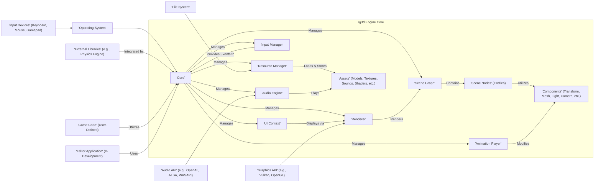
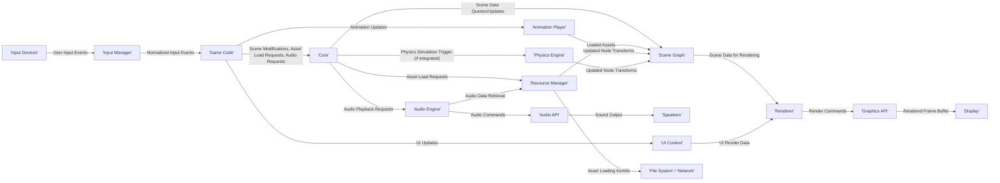

# Project Design Document: rg3d Game Engine for Threat Modeling

**Project Title:** rg3d Game Engine Analysis for Threat Modeling

**Version:** 1.1

**Date:** October 26, 2023

**Author:** AI Software Architecture Expert

## 1. Introduction

This document provides an enhanced design overview of the rg3d game engine project, as hosted on GitHub ([https://github.com/rg3dengine/rg3d](https://github.com/rg3dengine/rg3d)). Building upon the initial design, this version aims to provide a more granular and comprehensive understanding of the engine's architecture and data flow, specifically tailored for effective threat modeling. This document outlines the key components, their interactions, data flows, and technologies involved in the rg3d engine, enabling a more thorough analysis of its potential attack surfaces and vulnerabilities.

## 2. Project Overview

rg3d is a general-purpose, immediate-mode 3D game engine written in Rust. It is designed to be extensible and efficient, providing a foundation for developing a wide range of 3D games and interactive applications. Key features include:

*   **Scene Management:**  A hierarchical scene graph for organizing and managing game objects.
*   **Resource Handling:** Asynchronous loading and management of various asset types (models, textures, sounds, shaders, etc.).
*   **Rendering Capabilities:** Support for both forward and deferred rendering pipelines, with features like physically-based rendering (PBR).
*   **User Interface (UI) System:** An immediate-mode UI system for creating in-game interfaces.
*   **Input Management:** Abstraction layer for handling input from various devices (keyboard, mouse, gamepad).
*   **Audio Subsystem:**  Functionality for playing and managing spatialized audio.
*   **Animation Framework:** Support for skeletal and property animations, including blending and state machines.
*   **Physics Integration:**  Integration with external physics engines (e.g., using a plugin architecture).
*   **Scripting Potential:**  Architectural considerations for integrating scripting languages in the future.
*   **Editor (In Development):** A separate visual editor application intended to streamline content creation.
*   **Cross-Platform Design:** Targeting desktop platforms (Windows, Linux, macOS) and with potential for web platform support via WebAssembly.

## 3. System Architecture

The rg3d engine employs a modular and layered architecture, facilitating maintainability and extensibility.

### 3.1. High-Level Components

### 3.2. Component Details

*   **Core:** The central orchestrator of the engine, responsible for the main game loop, managing subsystems, and handling the application lifecycle.
*   **Scene Graph:** A hierarchical data structure representing the game world, allowing for efficient organization, transformation, and rendering of game objects.
*   **Resource Manager:** Handles the asynchronous loading, caching, and management of various asset types, including 3D models, textures, audio files, shaders, and configuration data. It manages asset lifecycles and dependencies.
*   **Renderer:**  Responsible for drawing the scene to the screen. It manages rendering pipelines (forward and deferred), shader compilation and management, material handling, and interacts with the underlying graphics API.
*   **Input Manager:**  Provides an abstraction layer for handling input events from various devices, normalizing input and providing a consistent interface for game code.
*   **Audio Engine:** Manages audio playback, including spatialization, sound effects, and music. It interacts with the underlying audio API for sound output.
*   **UI Context:**  Manages the immediate-mode user interface system, handling UI element creation, rendering, and input interaction.
*   **Animation Player:**  Responsible for playing and blending animations applied to scene nodes, supporting skeletal and property animations.
*   **Scene Nodes (Entities):** Represent individual objects within the game world. They are organized in the scene graph and can have various components attached to them.
*   **Components:** Data containers attached to scene nodes, defining their properties and behaviors. Examples include `Transform` (position, rotation, scale), `Mesh` (geometry data), `Light` (light source properties), `Camera` (viewpoint and projection), `Material` (surface properties), and custom components defined by game developers.
*   **Assets:** The raw data used by the engine, stored in files or potentially loaded from network sources. These include 3D models, textures, audio files, shaders, and configuration files. The `Resource Manager` handles their loading and management.
*   **Operating System:** The underlying platform providing access to system resources, file system, and hardware.
*   **Graphics API:** A low-level interface to the graphics hardware, such as Vulkan or OpenGL. The `Renderer` interacts with this API.
*   **Audio API:** A low-level interface to the audio hardware, such as OpenAL, ALSA, or WASAPI. The `Audio Engine` interacts with this API.
*   **Input Devices:** Physical devices used by the user to interact with the game.
*   **File System:** The mechanism for storing and retrieving game assets and configuration files.
*   **External Libraries:** Third-party libraries integrated into the engine for specific functionalities, such as physics simulation. These are often integrated via a plugin or module system.
*   **Game Code (User-Defined):**  The code written by game developers to implement game logic, character behavior, and other game-specific functionality. This code interacts with the engine's API.
*   **Editor Application:** A separate application (under development) providing a visual interface for creating and editing game scenes, managing assets, and configuring game settings.

## 4. Data Flow

The following diagram illustrates a more detailed data flow within the rg3d engine during a typical frame:

**Detailed Data Flow Description:**

1. **User Input:** The user interacts with input devices, generating input events.
2. **Input Manager:** The `Input Manager` captures these raw events, normalizes them, and provides a consistent interface.
3. **Game Code:** User-defined game code receives these normalized input events and updates the game state. This can involve modifying the scene graph, requesting the loading of new assets, or triggering audio playback.
4. **Core:** The `Core` module orchestrates the game loop. Based on game code actions, it manages updates to other subsystems.
5. **Scene Graph:** The `Scene Graph` stores the current state of the game world. The `Core` or `Game Code` can query and modify the scene graph.
6. **Resource Manager:** When the game code requests an asset, the `Resource Manager` initiates the loading process, potentially from the file system or a network source. It caches loaded assets for reuse.
7. **Renderer:** The `Renderer` traverses the `Scene Graph`, gathers rendering data from components, and generates rendering commands for the `Graphics API`.
8. **Graphics API:** The chosen `Graphics API` processes the rendering commands and outputs the rendered frame to the display.
9. **Audio Engine:** If the game code requests audio playback, the `Audio Engine` retrieves the necessary audio data from the `Resource Manager` and sends commands to the `Audio API`.
10. **Audio API:** The `Audio API` handles the actual playback of sound through the speakers.
11. **UI Context:** The `UI Context` receives updates from the `Game Code` and generates rendering data for the user interface elements, which are then rendered by the `Renderer`.
12. **Animation Player:** The `Animation Player` updates the properties of scene nodes (typically transforms) based on animation data.
13. **Physics Engine:** If a physics engine is integrated, the `Core` might trigger a physics simulation step. The `Physics Engine` then updates the transforms of physical objects in the `Scene Graph`.
14. **File System / Network:** The `Resource Manager` interacts with the file system to load assets. It might also interact with the network to download assets in certain scenarios.

## 5. Technology Stack

*   **Core Programming Language:** Rust (emphasizing memory safety and performance)
*   **Graphics APIs:**  Supports or intends to support:
    *   Vulkan (for modern, cross-platform graphics)
    *   OpenGL (for broader compatibility)
    *   Potentially others depending on platform and future development
*   **Audio APIs:** Supports or intends to support:
    *   OpenAL (cross-platform audio)
    *   ALSA (Linux audio)
    *   WASAPI (Windows audio)
    *   Potentially others depending on platform
*   **Build System:** Cargo (Rust's package manager and build automation tool)
*   **Target Operating Systems:**
    *   Windows
    *   Linux
    *   macOS
    *   Potential for WebAssembly support for web browsers
*   **Input Handling:**  Utilizes platform-specific APIs or cross-platform input libraries for handling keyboard, mouse, and gamepad input.
*   **UI Framework:**  Custom-built immediate-mode UI system within the engine.
*   **External Libraries (Examples):**
    *   Physics engines (e.g., Rapier, Bevy Physics via integration)
    *   Image loading libraries (for various image formats)
    *   Audio decoding libraries (for various audio formats)
    *   Math libraries (for linear algebra and other mathematical operations)
    *   Serialization libraries (for saving and loading game state and assets)

## 6. Security Considerations (Expanded)

Building upon the initial considerations, here are more detailed potential security risks:

*   **Malicious Asset Injection/Manipulation:**
    *   **Attack Vector:** Attackers could replace legitimate game assets with malicious ones, potentially containing exploits or inappropriate content. This could occur through compromised distribution channels or by exploiting vulnerabilities in asset loading mechanisms.
    *   **Impact:** Code execution, denial of service, display of offensive content, game crashes.
    *   **Examples:** Modified 3D models with excessively complex geometry causing rendering issues, textures containing malicious scripts (if the engine has such vulnerabilities), audio files with embedded exploits.
*   **Shader Vulnerabilities:**
    *   **Attack Vector:**  Exploiting vulnerabilities in the shader compilation or execution process. This could involve crafting malicious shaders that cause GPU crashes or potentially allow for some form of GPU-based code execution (though less common).
    *   **Impact:** Denial of service (GPU crash), unexpected visual artifacts, potential information leakage.
*   **Memory Safety Issues (Despite Rust):**
    *   **Attack Vector:** While Rust's memory safety features are strong, vulnerabilities can still arise in `unsafe` code blocks or within external C/C++ libraries used by the engine.
    *   **Impact:** Code execution, crashes, information leakage.
    *   **Examples:** Buffer overflows in `unsafe` code handling external data, vulnerabilities in bindings to C libraries.
*   **Input Handling Exploits:**
    *   **Attack Vector:**  Crafting specific input sequences that trigger unexpected behavior or vulnerabilities in the input processing logic.
    *   **Impact:** Denial of service, unexpected game state changes, potential for triggering other vulnerabilities.
    *   **Examples:** Extremely long input strings causing buffer overflows, specific key combinations triggering unintended actions.
*   **UI System Vulnerabilities:**
    *   **Attack Vector:** Exploiting vulnerabilities in the UI rendering or event handling to create malicious overlays, trigger unintended actions, or potentially execute code (if the UI system has such flaws).
    *   **Impact:** Display of misleading information, denial of service, potential for triggering other vulnerabilities.
*   **Resource Exhaustion Attacks:**
    *   **Attack Vector:**  Loading excessively large or numerous assets to consume system resources (CPU, memory, GPU memory), leading to performance degradation or crashes.
    *   **Impact:** Denial of service, poor game performance.
*   **Build Process and Supply Chain Security:**
    *   **Attack Vector:**  Compromised dependencies managed by Cargo could introduce malicious code into the engine.
    *   **Impact:** Code execution, backdoors, compromised builds.
*   **Editor Security (If Applicable):**
    *   **Attack Vector:** If the editor allows loading external assets or plugins, these could contain malicious code.
    *   **Impact:** Code execution on the developer's machine, compromised projects.
*   **WebAssembly Security (If Applicable):**
    *   **Attack Vector:**  Exploiting vulnerabilities in the WebAssembly sandbox or browser APIs when running the engine in a web browser.
    *   **Impact:**  Limited by the browser's security sandbox, but could potentially lead to information leakage or denial of service within the browser context.
*   **Networking Security (If Implemented):**
    *   **Attack Vector:** Standard network security threats such as eavesdropping, man-in-the-middle attacks, denial-of-service attacks, and exploitation of vulnerabilities in networking protocols.
    *   **Impact:** Data breaches, cheating, denial of service, unauthorized access.
*   **Serialization/Deserialization Vulnerabilities:**
    *   **Attack Vector:** If game state or assets are serialized and deserialized, vulnerabilities in the serialization format or implementation could allow for malicious data to be injected, leading to code execution or other issues.
    *   **Impact:** Code execution, game crashes, state manipulation.

## 7. Scope

This design document focuses on the core architecture, data flow, and technology stack of the rg3d game engine. It encompasses the major subsystems and their interactions, with a particular emphasis on aspects relevant to potential security vulnerabilities.

## 8. Assumptions

*   The information available in the public GitHub repository accurately reflects the design and implementation of the rg3d engine.
*   The engine is primarily intended for creating interactive 3D applications, with a focus on game development.
*   The security of the underlying operating system, hardware drivers, and third-party libraries is assumed, although potential vulnerabilities in the engine's interaction with these components are considered.

## 9. Out of Scope

The following are explicitly excluded from the scope of this design document:

*   Detailed line-by-line code analysis of the rg3d engine's source code.
*   Comprehensive security audits or penetration testing of the engine.
*   Detailed security analysis of every single external library used by the engine.
*   A complete design specification for the in-development editor application.
*   Specific implementation details of any future networking features.
*   Performance benchmarks, optimization strategies, or detailed performance analysis.
*   End-user documentation, tutorials, or API reference materials.
*   Specific security configurations or deployment strategies for games built with rg3d.

This enhanced design document provides a more detailed and nuanced understanding of the rg3d game engine's architecture and potential security considerations, serving as a robust foundation for subsequent threat modeling activities.
