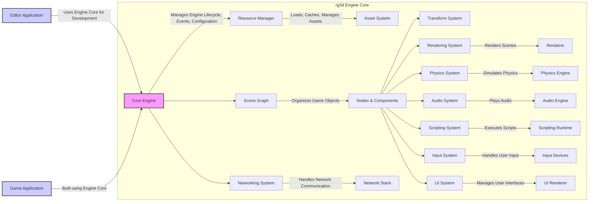

# Project Design Document: rg3d Game Engine for Threat Modeling (Improved)

## 1. Project Overview

*   **Project Name:** rg3d Game Engine
*   **Project Repository:** [https://github.com/rg3dengine/rg3d](https://github.com/rg3dengine/rg3d)
*   **Project Description:** rg3d is a free and open-source, general-purpose 3D game engine written in Rust. It is designed to be user-friendly and feature-rich, providing tools and functionalities for creating games and interactive 3D applications across various platforms.
*   **Key Features:**
    *   **Rendering:** Modern rendering pipeline supporting physically based rendering (PBR), forward and deferred rendering, various lighting models, and post-processing effects.
    *   **Scene Management:** Hierarchical scene graph for organizing game objects, supporting nodes, components, and resources.
    *   **Asset Management:** Robust asset pipeline for importing, processing, and managing various asset types (models, textures, sounds, etc.).
    *   **Physics:** Integration with a physics engine for realistic physics simulations.
    *   **Audio:** Comprehensive audio system for spatialized sound effects and music.
    *   **User Interface (UI):** Built-in UI system for creating in-game interfaces and editor tools.
    *   **Scripting:** Support for scripting languages (e.g., Lua integration) for game logic and behavior.
    *   **Networking:** Networking capabilities for creating multiplayer games.
    *   **Editor:** Integrated editor for scene creation, asset management, and game development workflow.
    *   **Cross-Platform Support:** Support for multiple platforms including Windows, Linux, macOS, and Web (via WebAssembly).
*   **Purpose of this Document:** This document provides a detailed design overview of the rg3d game engine. It is specifically created to serve as a foundation for threat modeling activities. The document outlines the engine's architecture, key components, data flow, and technologies used, enabling security experts to identify potential vulnerabilities and design appropriate security measures.

## 2. Architecture Overview

The rg3d engine follows a modular architecture, composed of several interconnected subsystems. The core engine provides fundamental functionalities, while specialized modules handle specific aspects like rendering, physics, and audio. The editor acts as a separate application built upon the engine core, providing a visual development environment.



## 3. Component Details

This section provides a detailed description of each major component identified in the architecture overview, focusing on their functionality, data flow, and security considerations.

### 3.1. Core Engine

*   **Functionality:**
    *   Manages the engine's lifecycle, including initialization, update loop, and shutdown.
    *   Handles engine configuration and settings.
    *   Dispatches events across the engine subsystems.
    *   Provides core utilities and data structures.
*   **Data Flow:**
    *   **Input:** Configuration files, command-line arguments, events from other subsystems.
    *   **Output:** Events to other subsystems, engine state updates.
*   **Dependencies:** Foundation libraries (OS-specific APIs, memory management).
*   **Security Considerations:**
    *   **Configuration Parsing Vulnerabilities:**
        *   Buffer overflows when parsing configuration values.
        *   Format string bugs if configuration values are used in format strings without proper sanitization.
        *   Integer overflows if configuration values are used in size calculations.
        *   Denial of Service (DoS) by providing excessively large or complex configuration files.
    *   **Improper Error Handling:**
        *   Lack of proper error handling can lead to crashes or undefined behavior, potentially exploitable.
        *   Information leakage through verbose error messages in production builds.
    *   **Denial-of-Service (DoS) during Initialization:**
        *   Resource exhaustion (CPU, memory) by providing malicious or oversized initial configuration.
        *   Deadlocks or infinite loops during initialization phase.

### 3.2. Resource Manager

*   **Functionality:**
    *   Loads, caches, and manages various game assets (models, textures, sounds, shaders, scenes, etc.).
    *   Handles asset dependencies and loading order.
    *   Provides mechanisms for asset streaming and unloading.
*   **Data Flow:**
    *   **Input:** Asset requests from other subsystems, asset files from disk or network.
    *   **Output:** Loaded assets to requesting subsystems, asset metadata.
*   **Dependencies:** Asset system, file system access, network access (for remote assets), data parsing libraries (for various asset formats).
*   **Security Considerations:**
    *   **Asset Parsing Vulnerabilities (Critical):**
        *   **Buffer Overflows:** In image loaders (PNG, JPG, etc.), model loaders (glTF, FBX, etc.), audio decoders (MP3, WAV, OGG, etc.), and scene loaders.
        *   **Integer Overflows:** In size calculations during asset parsing, leading to buffer overflows or memory corruption.
        *   **Format String Bugs:** If asset data is used in format strings without proper sanitization.
        *   **Heap Corruption:** Due to memory management errors in asset loaders.
        *   **Denial of Service (DoS):** By providing malformed or excessively complex assets that consume excessive resources or cause infinite loops in parsing.
        *   **Arbitrary Code Execution (ACE):** In highly complex asset formats or through vulnerabilities in external parsing libraries.
    *   **Asset Cache Poisoning:**
        *   If the asset cache directory is writable by unauthorized users, malicious assets could be placed in the cache, potentially replacing legitimate assets.
        *   Cache invalidation vulnerabilities allowing for serving outdated or malicious cached assets.
    *   **Path Traversal Vulnerabilities:**
        *   Improper validation of asset paths could allow access to files outside the intended asset directories.
        *   Exploitable through specially crafted asset paths in scene files or configuration.
    *   **Denial of Service (DoS) through Asset Loading:**
        *   Loading excessively large assets to exhaust memory.
        *   Loading a large number of assets simultaneously to overwhelm the system.
        *   Triggering asset loading loops or recursive asset dependencies.

### 3.3. Scene Graph

*   **Functionality:**
    *   Organizes game objects in a hierarchical tree structure (scene graph).
    *   Manages nodes and components within the scene.
    *   Provides mechanisms for scene traversal and manipulation.
*   **Data Flow:**
    *   **Input:** Scene descriptions (loaded from assets or created in editor), node and component creation/modification requests.
    *   **Output:** Scene structure information to other subsystems (rendering, physics, etc.), events related to scene changes.
*   **Dependencies:** Core engine, nodes & components system.
*   **Security Considerations:**
    *   **Scene Loading Vulnerabilities:**
        *   Similar to asset parsing vulnerabilities, scene file loaders can be vulnerable to buffer overflows, integer overflows, and other parsing errors.
        *   Malicious scene files could be crafted to exploit these vulnerabilities.
    *   **Denial of Service (DoS) through Scene Complexity:**
        *   Loading extremely large or deeply nested scenes can lead to performance degradation, memory exhaustion, or stack overflows during scene traversal.
        *   Crafted scenes designed to maximize scene graph complexity.
    *   **Logic Bugs in Scene Management:**
        *   Errors in scene graph manipulation logic (adding/removing nodes, parenting, transformations) could lead to unexpected game behavior or exploitable states.
        *   Race conditions in multi-threaded scene graph operations.

### 3.4. Nodes & Components

*   **Functionality:**
    *   Defines the building blocks of game objects (nodes).
    *   Provides a component-based architecture for adding functionalities to nodes (e.g., rendering, physics, audio, scripting).
    *   Manages component lifecycle and interactions.
*   **Data Flow:**
    *   **Input:** Component creation/modification requests, data from other subsystems (e.g., physics updates, input events).
    *   **Output:** Component data to other subsystems (e.g., rendering data, physics data, audio data).
*   **Dependencies:** Scene graph, various component systems (rendering, physics, audio, scripting, UI).
*   **Security Considerations:**
    *   **Component Logic Vulnerabilities:**
        *   Bugs or vulnerabilities within the implementation of individual components (e.g., rendering component, physics component, custom components).
        *   Exploitable through crafted component data or interactions.
    *   **Component Interaction Issues:**
        *   Incorrect or insecure interactions between different components on the same node or across different nodes.
        *   Race conditions or synchronization issues in component interactions.
    *   **Data Injection through Components:**
        *   If component data is not properly validated before being passed to other subsystems, it could be used to inject malicious data.
        *   Example: Injecting malicious shader code through a rendering component's material data.
    *   **Component Creation/Modification Vulnerabilities:**
        *   Vulnerabilities in the component creation or modification process itself, potentially leading to memory corruption or unexpected states.

### 3.5. Rendering System

*   **Functionality:**
    *   Handles rendering of the scene graph.
    *   Manages rendering pipeline, shaders, materials, and textures.
    *   Supports various rendering techniques (forward, deferred, PBR).
    *   Provides post-processing effects.
*   **Data Flow:**
    *   **Input:** Scene graph data, camera information, light information, rendering commands.
    *   **Output:** Rendered frames to display, rendering statistics.
*   **Dependencies:** Renderer, graphics API (Vulkan, OpenGL, DirectX), shader compiler.
*   **Security Considerations:**
    *   **Shader Vulnerabilities (High Risk):**
        *   **Malicious Shaders:** Crafted shaders designed to exploit vulnerabilities in graphics drivers or hardware, potentially leading to arbitrary code execution or system instability.
        *   **Shader Compiler Vulnerabilities:** Exploiting vulnerabilities in the shader compiler itself.
        *   **Denial of Service (DoS) through Shaders:**  Excessively complex or inefficient shaders that cause performance degradation or GPU hangs.
    *   **Resource Exhaustion in Rendering:**
        *   Rendering excessively complex scenes (high polygon count, large number of draw calls, complex shaders) to cause performance degradation or denial of service.
        *   Memory exhaustion due to excessive texture or buffer allocations.
    *   **Graphics API Vulnerabilities:**
        *   Exploiting known vulnerabilities in the underlying graphics API (Vulkan, OpenGL, DirectX) or their drivers.
        *   Triggering driver crashes or unexpected behavior through specific rendering commands.
    *   **Data Injection through Rendering Data:**
        *   Injecting malicious data into rendering commands or data buffers to potentially exploit vulnerabilities in the renderer or graphics driver.
        *   Example: Injecting crafted vertex data or texture data.

### 3.6. Physics System

*   **Functionality:**
    *   Simulates physics interactions between game objects.
    *   Handles collision detection, rigid body dynamics, and constraints.
    *   Integrates with a physics engine library.
*   **Data Flow:**
    *   **Input:** Scene graph data (physics components), physics simulation parameters, collision events.
    *   **Output:** Physics updates (object positions, velocities), collision events.
*   **Dependencies:** Physics Engine library, scene graph.
*   **Security Considerations:**
    *   **Physics Engine Library Vulnerabilities (Dependency Risk):**
        *   Exploiting known vulnerabilities in the integrated physics engine library (e.g., Rapier, PhysX, Bullet).
        *   These libraries are often complex and written in languages like C/C++, increasing the likelihood of vulnerabilities.
    *   **Denial of Service (DoS) through Physics Simulation:**
        *   Simulating excessively complex physics scenarios (large number of objects, complex collision shapes, unstable simulations) to cause performance degradation or denial of service.
        *   Crafted scenes designed to maximize physics simulation load.
    *   **Logic Bugs in Physics Integration:**
        *   Errors in the integration between the engine and the physics engine could lead to unexpected behavior, physics glitches, or potentially exploitable states.
        *   Incorrect handling of physics callbacks or events.
    *   **Physics Data Manipulation:**
        *   Manipulating physics parameters or data in unexpected ways to gain unfair advantages or cause game instability (especially in networked games).

### 3.7. Audio System

*   **Functionality:**
    *   Plays audio effects and music.
    *   Supports spatialized audio and audio effects.
    *   Manages audio resources and playback.
*   **Data Flow:**
    *   **Input:** Audio asset requests, audio playback commands, scene graph data (for spatialization).
    *   **Output:** Audio output to audio devices.
*   **Dependencies:** Audio engine library, audio codecs, audio output devices.
*   **Security Considerations:**
    *   **Audio Codec Vulnerabilities (Dependency Risk):**
        *   Exploiting vulnerabilities in audio codecs (MP3, OGG, WAV decoders) used to decode audio assets.
        *   Similar to image and model loaders, audio codecs can be vulnerable to buffer overflows, integer overflows, and other parsing errors.
    *   **Denial of Service (DoS) through Audio Playback:**
        *   Playing excessively large or numerous audio files to exhaust memory or audio resources.
        *   Triggering audio playback loops or resource leaks.
    *   **Logic Bugs in Audio System:**
        *   Errors in audio playback logic, spatialization calculations, or audio effect processing could lead to unexpected behavior or exploitable states.
        *   Incorrect handling of audio device errors.
    *   **Audio Data Manipulation:**
        *   Manipulating audio data or playback parameters to cause unexpected audio output or potentially exploit vulnerabilities in the audio engine or drivers.

### 3.8. UI System

*   **Functionality:**
    *   Provides a system for creating user interfaces within the game.
    *   Handles UI elements (buttons, text boxes, images, etc.), layout, and event handling.
    *   Renders UI elements.
*   **Data Flow:**
    *   **Input:** UI element definitions, user input events (mouse clicks, keyboard input), UI layout information.
    *   **Output:** Rendered UI elements, UI events to game logic.
*   **Dependencies:** UI Renderer, input system.
*   **Security Considerations:**
    *   **UI Rendering Vulnerabilities:**
        *   Similar to general rendering vulnerabilities, UI rendering can be susceptible to shader vulnerabilities, resource exhaustion, and graphics API exploits.
        *   Especially relevant if UI rendering uses complex shaders or rendering techniques.
    *   **Input Handling Vulnerabilities in UI:**
        *   **Cross-Site Scripting (XSS) like vulnerabilities:** If UI elements display user-provided text without proper sanitization, it could be used to inject malicious scripts (especially in web-based games or editor UI).
        *   **Command Injection:** If UI input is used to construct system commands or scripts without proper sanitization.
        *   **Buffer Overflows:** In UI input fields if input length is not properly validated.
    *   **Logic Bugs in UI System:**
        *   Errors in UI event handling, layout logic, or state management could lead to unexpected behavior or exploitable states.
        *   UI state desynchronization issues.
    *   **UI Data Manipulation:**
        *   Manipulating UI data or state to bypass UI restrictions or gain unauthorized access to game features or editor functionality.

### 3.9. Scripting System

*   **Functionality:**
    *   Allows scripting game logic and behavior using a scripting language (e.g., Lua).
    *   Provides an API for scripts to interact with the engine and game objects.
    *   Executes scripts within a scripting runtime.
*   **Data Flow:**
    *   **Input:** Script files, script execution requests, data from game objects and engine subsystems.
    *   **Output:** Script execution results, commands to engine subsystems, modifications to game objects.
*   **Dependencies:** Scripting runtime (e.g., Lua VM), scripting API bindings.
*   **Security Considerations:**
    *   **Scripting Engine Vulnerabilities (Dependency Risk):**
        *   Exploiting vulnerabilities in the scripting engine itself (e.g., Lua VM).
        *   Scripting engines, especially those written in C/C++, can have vulnerabilities like buffer overflows, integer overflows, and sandbox escape vulnerabilities.
    *   **Sandbox Escapes (Critical):**
        *   Scripts potentially escaping the intended sandbox and gaining unauthorized access to system resources, engine internals, or other parts of the game.
        *   Exploiting weaknesses in the scripting API or the scripting runtime to bypass sandbox restrictions.
    *   **Code Injection (High Risk):**
        *   If script code can be injected from external sources (e.g., network, user input, configuration files), it could lead to arbitrary code execution.
        *   Especially dangerous in networked games or if the engine loads scripts from untrusted sources.
    *   **Denial of Service (DoS) through Scripts:**
        *   Malicious scripts designed to consume excessive resources (CPU, memory, network) or crash the engine.
        *   Infinite loops, excessive memory allocations, or resource leaks in scripts.
    *   **API Misuse and Logic Exploits:**
        *   Scripts misusing the scripting API in unintended or insecure ways to exploit game logic, cheat, or gain unfair advantages.
        *   Exploiting vulnerabilities in the design of the scripting API itself.

### 3.10. Networking System

*   **Functionality:**
    *   Provides networking capabilities for creating multiplayer games.
    *   Handles network communication, data serialization, and network protocols.
    *   Supports client-server and potentially peer-to-peer architectures.
*   **Data Flow:**
    *   **Input:** Network packets from remote clients/servers, network configuration.
    *   **Output:** Network packets to remote clients/servers, network events.
*   **Dependencies:** Network stack, networking libraries, serialization libraries.
*   **Security Considerations:**
    *   **Network Protocol Vulnerabilities (Dependency Risk):**
        *   Exploiting vulnerabilities in network protocols used by the engine (TCP, UDP, custom protocols).
        *   Vulnerabilities in networking libraries or the underlying operating system network stack.
    *   **Denial of Service (DoS) Attacks:**
        *   **Network Flooding:** Sending a large volume of network traffic to overwhelm the server or clients.
        *   **Amplification Attacks:** Exploiting network protocols to amplify attack traffic.
        *   **Resource Exhaustion:** Exhausting server resources (CPU, memory, bandwidth) through malicious network requests.
    *   **Data Injection and Packet Manipulation:**
        *   Injecting malicious data into network packets to compromise clients or servers.
        *   Manipulating network packets to cheat, gain unfair advantages, or disrupt game play.
        *   **Replay Attacks:** Capturing and replaying network packets to bypass authentication or replay actions.
    *   **Authentication and Authorization Issues (Game Logic Risk):**
        *   Weak or missing authentication mechanisms allowing unauthorized access to game servers or player accounts.
        *   Insufficient authorization checks allowing players to perform actions they are not supposed to (cheating, griefing).
    *   **Man-in-the-Middle (MitM) Attacks:**
        *   Eavesdropping on network communication to intercept sensitive data (player credentials, game state).
        *   Tampering with network communication to modify game data or inject malicious content.
    *   **Serialization/Deserialization Vulnerabilities:**
        *   Exploiting vulnerabilities in data serialization/deserialization processes used for network communication (e.g., buffer overflows, format string bugs, type confusion).
        *   Maliciously crafted network packets designed to exploit these vulnerabilities.

### 3.11. Input System

*   **Functionality:**
    *   Handles user input from various input devices (keyboard, mouse, gamepad, touch).
    *   Processes input events and dispatches them to other subsystems.
    *   Provides input mapping and configuration.
*   **Data Flow:**
    *   **Input:** Raw input events from input devices.
    *   **Output:** Processed input events to other subsystems (scene graph, UI, scripting).
*   **Dependencies:** Operating system input APIs, input device drivers.
*   **Security Considerations:**
    *   **Input Injection (Less Likely, but possible):**
        *   Malicious input devices or software potentially injecting fabricated input events to trigger unintended game behavior or exploits.
        *   More relevant in scenarios where input devices are not strictly controlled.
    *   **Denial of Service (DoS) through Input Flooding:**
        *   Flooding the input system with excessive input events to cause performance degradation or denial of service.
        *   Malicious software or hardware generating rapid input events.
    *   **Input Handling Vulnerabilities:**
        *   Buffer overflows if input data (e.g., text input from keyboard) is not properly validated before processing.
        *   Format string bugs if input data is used in format strings without sanitization.
        *   Logic errors in input processing that could be exploited to bypass game logic or trigger unexpected behavior.

### 3.12. Editor Application

*   **Functionality:**
    *   Provides a visual development environment for creating and editing game scenes, assets, and game logic.
    *   Uses the rg3d engine core for scene rendering and simulation within the editor.
    *   Offers tools for asset management, scene editing, UI design, and scripting.
*   **Data Flow:**
    *   **Input:** User interactions within the editor UI, asset files, project configuration.
    *   **Output:** Modified scene data, asset files, project files, commands to the engine core.
*   **Dependencies:** rg3d Engine Core, UI system, asset system, various editor tools.
*   **Security Considerations:**
    *   **Editor-Specific Vulnerabilities (Application Security):**
        *   Vulnerabilities within the editor application code itself, separate from the engine core (e.g., UI framework vulnerabilities, logic errors in editor tools).
        *   Standard application security vulnerabilities like buffer overflows, format string bugs, etc.
    *   **Project File Vulnerabilities:**
        *   Maliciously crafted project files designed to exploit vulnerabilities in the editor when loaded.
        *   Similar to asset parsing vulnerabilities, project file loaders can be vulnerable to parsing errors.
    *   **Plugin/Extension Vulnerabilities (If Supported):**
        *   If the editor supports plugins or extensions, these can introduce security risks if they are not properly vetted or sandboxed.
        *   Malicious plugins could gain unauthorized access to the editor or the developer's system.
    *   **Data Integrity of Project Data:**
        *   Ensuring the integrity of project data (scenes, assets, project settings) and preventing unauthorized modifications or corruption.
        *   Risk of data loss or project corruption due to editor bugs or malicious actions.
    *   **Access Control in Collaborative Development:**
        *   Controlling access to editor features and project data in collaborative development environments to prevent unauthorized modifications or access.
    *   **Supply Chain Security for Editor Dependencies:**
        *   Ensuring the security of external libraries and dependencies used by the editor application.
        *   Risk of using compromised or vulnerable dependencies.

### 3.13. Renderer

*   **Functionality:**
    *   Low-level rendering implementation.
    *   Interacts directly with the graphics API (Vulkan, OpenGL, DirectX).
    *   Handles command buffer creation, resource management (buffers, textures, shaders), and draw calls.
*   **Data Flow:**
    *   **Input:** Rendering commands from the Rendering System, shader code, texture data, vertex data.
    *   **Output:** Rendered frames to the display.
*   **Dependencies:** Graphics API (Vulkan, OpenGL, DirectX), graphics drivers.
*   **Security Considerations:**
    *   **Graphics API Vulnerabilities (Dependency Risk):**
        *   Exploiting known vulnerabilities in the underlying graphics API (Vulkan, OpenGL, DirectX) or their drivers.
        *   Renderer code interacting directly with the graphics API needs to be robust and avoid triggering driver bugs.
    *   **Shader Compilation Vulnerabilities:**
        *   Vulnerabilities in the shader compiler used to compile shader code for the GPU.
        *   Malicious shader code designed to exploit compiler vulnerabilities.
    *   **Resource Management Issues in Renderer:**
        *   Improper resource management (memory leaks, buffer overflows, use-after-free) in the renderer code could lead to crashes or exploitable states.
        *   Especially critical in low-level rendering code that directly manages GPU resources.
    *   **Driver Vulnerabilities (External Risk):**
        *   Exploiting vulnerabilities in graphics drivers themselves. While not directly engine code, engine can trigger driver bugs through specific rendering patterns or commands.

### 3.14. Physics Engine

*   **Functionality:**
    *   External library responsible for physics simulation.
    *   Provides collision detection, rigid body dynamics, and constraint solvers.
    *   Integrated into the rg3d engine through the Physics System.
*   **Data Flow:**
    *   **Input:** Physics world description, object properties, simulation parameters.
    *   **Output:** Simulation results (object positions, velocities, collision events).
*   **Dependencies:** External physics library (e.g., Rapier, PhysX, Bullet).
*   **Security Considerations:**
    *   **Physics Engine Library Vulnerabilities (Dependency Risk - High):**
        *   Exploiting vulnerabilities in the external physics engine library (e.g., Rapier, PhysX, Bullet).
        *   Physics engines are complex C/C++ codebases and are known to have security vulnerabilities.
        *   Regularly updating the physics engine library is crucial.
    *   **Integration Vulnerabilities:**
        *   Vulnerabilities in the integration layer between the rg3d engine and the physics engine.
        *   Incorrect data passing, improper error handling, or logic errors in the integration code.
    *   **Performance Issues and DoS:**
        *   Complex physics simulations can lead to performance degradation or denial of service if not handled carefully.
        *   Engine needs to have mechanisms to limit physics complexity and prevent DoS through physics simulation.

### 3.15. Audio Engine

*   **Functionality:**
    *   External library responsible for audio processing and playback.
    *   Handles audio mixing, spatialization, effects, and output to audio devices.
    *   Integrated into the rg3d engine through the Audio System.
*   **Data Flow:**
    *   **Input:** Audio data, playback commands, spatialization parameters.
    *   **Output:** Audio output to audio devices.
*   **Dependencies:** External audio library (e.g., OpenAL, FMOD, custom audio engine), audio codecs.
*   **Security Considerations:**
    *   **Audio Engine Library Vulnerabilities (Dependency Risk - Medium):**
        *   Exploiting vulnerabilities in the external audio engine library (e.g., OpenAL, FMOD, custom audio engine).
        *   Audio engines, while less complex than physics or rendering engines, can still have vulnerabilities.
    *   **Audio Codec Vulnerabilities (Dependency Risk - Medium):**
        *   Exploiting vulnerabilities in audio codecs used by the audio engine (MP3, OGG, WAV decoders).
        *   Audio codecs are common targets for vulnerabilities.
    *   **Integration Vulnerabilities:**
        *   Vulnerabilities in the integration layer between the rg3d engine and the audio engine.
        *   Incorrect data passing, improper error handling, or logic errors in the integration code.

### 3.16. Scripting Runtime

*   **Functionality:**
    *   Virtual machine or interpreter responsible for executing scripts.
    *   Provides the runtime environment for scripts to run within.
    *   Integrated into the rg3d engine through the Scripting System.
*   **Data Flow:**
    *   **Input:** Script code, data from the engine and game objects.
    *   **Output:** Script execution results, commands to the engine and game objects.
*   **Dependencies:** Scripting language runtime (e.g., Lua VM).
*   **Security Considerations:**
    *   **Scripting Runtime Vulnerabilities (Dependency Risk - High):**
        *   Exploiting vulnerabilities in the scripting runtime itself (e.g., Lua VM).
        *   Scripting runtimes, especially those written in C/C++, are complex and can have vulnerabilities.
        *   Regularly updating the scripting runtime is crucial.
    *   **Sandbox Escapes (Critical - repeated for emphasis):**
        *   Scripts potentially escaping the intended sandbox and gaining unauthorized access to system resources or engine internals.
        *   This is the primary security concern for scripting systems.
    *   **Performance Issues and DoS:**
        *   Inefficient or malicious scripts can lead to performance degradation or denial of service.
        *   Scripting runtime needs to have mechanisms to limit script execution time and resource usage.

### 3.17. Network Stack

*   **Functionality:**
    *   Underlying network communication layer.
    *   Handles network protocols (TCP, UDP), socket management, and network data transmission.
    *   Used by the Networking System.
*   **Data Flow:**
    *   **Input:** Network packets from the network interface.
    *   **Output:** Network packets to the network interface.
*   **Dependencies:** Operating system network APIs, network interface drivers.
*   **Security Considerations:**
    *   **Operating System Network Vulnerabilities (External Risk - High):**
        *   Exploiting vulnerabilities in the underlying operating system network stack.
        *   OS network stacks are complex and are frequent targets for vulnerabilities.
        *   Engine relies on the security of the OS network stack.
    *   **Network Protocol Vulnerabilities (External Risk - Medium):**
        *   Exploiting vulnerabilities in network protocols (TCP/IP) themselves.
        *   Less likely to be directly exploitable by the engine, but engine needs to be aware of protocol security best practices.
    *   **Denial of Service (DoS) Attacks at Network Layer:**
        *   Network flooding or other network-based attacks targeting the network stack directly.
        *   Engine needs to be resilient to network DoS attacks, although mitigation is often handled at the network infrastructure level.

### 3.18. Asset System

*   **Functionality:**
    *   Provides low-level asset handling functionalities.
    *   Manages asset storage, loading, and caching.
    *   Used by the Resource Manager.
*   **Data Flow:**
    *   **Input:** Asset paths, asset loading requests.
    *   **Output:** Raw asset data, asset metadata.
*   **Dependencies:** File system access, potentially network access.
*   **Security Considerations:**
    *   **Path Traversal Vulnerabilities (Repeated for emphasis):**
        *   Improper handling of asset paths could allow access to unauthorized files outside of intended asset directories.
        *   Critical vulnerability if exploitable through user-controlled input or network requests.
    *   **File System Access Control Issues:**
        *   Insufficient access control on asset files or directories could lead to unauthorized access, modification, or deletion of assets.
        *   Especially relevant in development environments or if assets are stored in shared locations.
    *   **Data Integrity of Assets:**
        *   Ensuring the integrity of asset files and preventing unauthorized modifications or corruption.
        *   Risk of loading corrupted or tampered assets if integrity checks are not in place.

### 3.19. Transform System

*   **Functionality:**
    *   Manages the transformations (position, rotation, scale) of nodes in the scene graph.
    *   Calculates world matrices and local matrices.
    *   Provides utilities for transformation manipulation.
*   **Data Flow:**
    *   **Input:** Node transformations, parent-child relationships in the scene graph.
    *   **Output:** World matrices, local matrices, transformation updates.
*   **Dependencies:** Scene graph, nodes & components.
*   **Security Considerations:**
    *   **Logic Bugs in Transformation Calculations:**
        *   Errors in transformation calculations could lead to unexpected game behavior or visual glitches.
        *   Less likely to be direct security vulnerabilities, but could potentially be exploited in specific game logic scenarios.
    *   **Data Integrity of Transformation Data:**
        *   Ensuring the integrity of transformation data to prevent unexpected object positioning or behavior.
        *   Data corruption in transformation data could lead to game instability.

## 4. Data Flow Diagram (Detailed)

This diagram provides a more detailed view of data flow between key components, highlighting data sources and sinks.

```mermaid
graph LR
    subgraph "External Sources"
        EXT_ASSET["Asset Files (Disk/Network)"]
        EXT_INPUT["Input Devices (Keyboard, Mouse, etc.)"]
        EXT_NETWORK["Network (Remote Clients/Servers)"]
        EXT_CONFIG["Configuration Files"]
        EXT_SCRIPTS["Script Files"]
    end

    subgraph "rg3d Engine Core"
        RM["Resource Manager"]
        SG["Scene Graph"]
        RS["Rendering System"]
        PS["Physics System"]
        AS["Audio System"]
        SS["Scripting System"]
        NS["Networking System"]
        IS["Input System"]
        UIS["UI System"]
        RENDERER["Renderer"]
        PHYSICS_ENGINE["Physics Engine"]
        AUDIO_ENGINE["Audio Engine"]
        SCRIPT_RUNTIME["Scripting Runtime"]
        NETWORK_STACK["Network Stack"]
    end

    EXT_ASSET --> RM
    EXT_CONFIG --> RM
    EXT_SCRIPTS --> RM

    RM --> SG: "Scene Data, Assets"
    SG --> RS: "Scene Graph Data"
    SG --> PS: "Scene Graph Data"
    SG --> AS: "Scene Graph Data"
    SG --> SS: "Scene Graph Data"
    SG --> UIS: "Scene Graph Data"

    RS --> RENDERER: "Rendering Commands, Data"
    PS --> PHYSICS_ENGINE: "Physics Simulation Data"
    AS --> AUDIO_ENGINE: "Audio Data, Commands"
    SS --> SCRIPT_RUNTIME: "Script Code, Data"
    NS --> NETWORK_STACK: "Network Packets"

    EXT_INPUT --> IS
    IS --> SG: "Input Events"
    IS --> UIS: "Input Events"
    IS --> SS: "Input Events (Scripting)"

    EXT_NETWORK --> NS
    NS --> SG: "Network Events, Game State Updates"
    NS --> SS: "Network Events (Scripting)"

    RENDERER --> DISPLAY["Display Output"]
    AUDIO_ENGINE --> AUDIO_OUTPUT["Audio Output Devices"]
    NETWORK_STACK --> EXT_NETWORK

    style RM fill:#eee,stroke:#333,stroke-width:1px
    style SG fill:#eee,stroke:#333,stroke-width:1px
    style RS fill:#eee,stroke:#333,stroke-width:1px
    style PS fill:#eee,stroke:#333,stroke-width:1px
    style AS fill:#eee,stroke:#333,stroke-width:1px
    style SS fill:#eee,stroke:#333,stroke-width:1px
    style NS fill:#eee,stroke:#333,stroke-width:1px
    style IS fill:#eee,stroke:#333,stroke-width:1px
    style UIS fill:#eee,stroke:#333,stroke-width:1px
    style RENDERER fill:#ddd,stroke:#333,stroke-width:1px
    style PHYSICS_ENGINE fill:#ddd,stroke:#333,stroke-width:1px
    style AUDIO_ENGINE fill:#ddd,stroke:#333,stroke-width:1px
    style SCRIPT_RUNTIME fill:#ddd,stroke:#333,stroke-width:1px
    style NETWORK_STACK fill:#ddd,stroke:#333,stroke-width:1px
    style EXT_ASSET fill:#aaf,stroke:#333,stroke-width:1px
    style EXT_INPUT fill:#aaf,stroke:#333,stroke-width:1px
    style EXT_NETWORK fill:#aaf,stroke:#333,stroke-width:1px
    style EXT_CONFIG fill:#aaf,stroke:#333,stroke-width:1px
    style EXT_SCRIPTS fill:#aaf,stroke:#333,stroke-width:1px
    style DISPLAY fill:#aaf,stroke:#333,stroke-width:1px
    style AUDIO_OUTPUT fill:#aaf,stroke:#333,stroke-width:1px
```

## 5. Technology Stack

*   **Programming Language:** Rust
*   **Graphics APIs:**
    *   Vulkan
    *   OpenGL (Versions 3.3 and above recommended)
    *   DirectX 11/12 (platform dependent)
    *   WebGPU (for WebAssembly)
*   **Physics Engine (Integration):**
    *   Rapier (Rust-based, likely default, consider version and security updates)
    *   Potentially others through integration layers (consider security implications of other engines)
*   **Audio Engine (Integration):**
    *   OpenAL (likely, consider version and security updates)
    *   Potentially custom or other libraries (consider security implications of other engines)
*   **Scripting Language (Integration):**
    *   Lua (likely through a Rust binding like `rlua`, consider Lua version and security updates)
    *   Potentially others through integration layers (consider security implications of other scripting languages)
*   **UI Framework:**
    *   Custom UI system built within rg3d (security depends on the implementation)
*   **Networking Libraries:**
    *   Rust standard library networking features (`std::net`) (generally considered secure, but review for specific vulnerabilities)
    *   Potentially external crates for specific networking functionalities (consider security of external crates)
*   **Asset Loading Libraries:**
    *   Rust ecosystem crates for various asset formats (image decoders, model loaders, audio decoders, etc.) (security depends on the specific crates used, review for known vulnerabilities and maintain updates)
*   **Build System:** Cargo (Rust's build system) (generally secure, but ensure secure build practices)
*   **Operating Systems:**
    *   Windows
    *   Linux
    *   macOS
    *   Web (via WebAssembly)
    *   Potentially mobile platforms (Android, iOS) in the future

## 6. Deployment Model

*   **Engine as a Library:** rg3d is primarily designed as a game engine library or framework. Developers use the engine to build their games.
*   **Game Application Distribution:** Games built with rg3d are typically distributed as standalone applications for target platforms.
    *   **Desktop Platforms (Windows, Linux, macOS):** Executable files packaged with necessary assets and libraries.
        *   **Security Considerations:** Code signing of executables to ensure authenticity and integrity. Secure distribution channels to prevent tampering.
    *   **Web Platform (WebAssembly):** WebAssembly modules and associated JavaScript/HTML files deployed on web servers.
        *   **Security Considerations:** Secure web server configuration. HTTPS for secure communication. Content Security Policy (CSP) to mitigate XSS risks. Subresource Integrity (SRI) for dependencies.
    *   **Mobile Platforms (Android, iOS - if supported):** Platform-specific application packages (APK for Android, IPA for iOS) distributed through app stores.
        *   **Security Considerations:** App store security review processes. Code signing. Secure storage of sensitive data on mobile devices.
*   **Editor Distribution:** The rg3d editor is distributed as a separate application, typically for desktop platforms, to facilitate game development. It is not usually included in the final game application distribution.
    *   **Security Considerations:** Code signing of the editor application. Secure distribution channels. Regular security updates for the editor.

## 7. Security Considerations (High-Level)

*   **Asset Pipeline Security (Critical):** The asset pipeline is a critical area for security. Vulnerabilities in asset loaders and processors can be exploited by malicious assets. Robust validation and sanitization of loaded assets are essential. Implement fuzzing and static analysis on asset loaders.
*   **Scripting Security (High):** If scripting is enabled, the scripting engine and API must be carefully designed to prevent sandbox escapes and arbitrary code execution. Secure coding practices in scripts are also important. Implement a robust sandbox and regularly audit the scripting API.
*   **Networking Security (Medium to High, depending on game type):** For multiplayer games, network security is paramount. Secure network protocols, proper authentication and authorization, and protection against network-based attacks are crucial. Use secure network protocols (TLS), implement strong authentication and authorization, and consider DDoS mitigation strategies.
*   **Input Handling Security (Low to Medium):** Input handling should be robust to prevent input injection attacks and denial of service through excessive input. Sanitize and validate user input. Implement input rate limiting to prevent DoS.
*   **Resource Management (Medium):** Proper resource management is important to prevent denial of service attacks through resource exhaustion (memory leaks, excessive CPU usage, etc.). Implement resource limits and leak detection mechanisms.
*   **Dependency Security (High):** The security of external libraries and dependencies used by the engine (physics engine, audio engine, graphics libraries, etc.) should be considered. Regularly updating dependencies and using trusted sources is important. Implement dependency scanning and vulnerability management.
*   **Editor Security (Development Environment) (Medium):** While the editor is not directly part of deployed games, its security is important for the development process. Vulnerabilities in the editor could compromise developer machines or project data. Secure the editor application and its dependencies. Implement access control for project data.
*   **Update Mechanism Security (If any) (Medium to High):** If the engine or games built with it have auto-update features, these should be reviewed for security vulnerabilities (e.g., insecure update channels, man-in-the-middle attacks during updates). Use HTTPS for update channels, implement signature verification for updates.

## 8. Threat Modeling Focus Areas

Based on the architecture and security considerations, the following areas should be prioritized during threat modeling for the rg3d game engine:

*   **Asset Loading Pipeline (Priority 1 - Critical):**
    *   Focus on vulnerabilities in asset parsers (model loaders, texture loaders, audio decoders, scene loaders).
    *   Threats: Arbitrary code execution, buffer overflows, denial of service through malicious assets.
    *   Specific focus: Image format loaders (PNG, JPG, etc.), Model format loaders (glTF, FBX, etc.), Audio format decoders (MP3, OGG, WAV, etc.), Scene file loaders (rg3d scene format, potentially others).
*   **Scripting System (Priority 2 - High):**
    *   Focus on sandbox escapes, API security, and code injection vulnerabilities in the scripting engine and API.
    *   Threats: Arbitrary code execution, unauthorized access to engine internals, denial of service through malicious scripts.
    *   Specific focus: Lua VM security, rg3d scripting API design, script loading mechanisms, handling of external script input.
*   **Networking Layer (Priority 3 - Medium to High):**
    *   Focus on network protocol vulnerabilities, denial of service attacks, data injection, and authentication/authorization issues in multiplayer scenarios.
    *   Threats: Cheating, unauthorized access, denial of service, information disclosure in multiplayer games.
    *   Specific focus: Network protocol implementation (TCP/UDP usage), data serialization/deserialization, authentication mechanisms, vulnerability to DDoS attacks, handling of untrusted network input.
*   **Input Handling (Priority 4 - Low to Medium):**
    *   Focus on input injection vulnerabilities and denial of service through excessive input.
    *   Threats: Exploitation of game logic through crafted input, denial of service.
    *   Specific focus: Handling of text input, processing of input events, vulnerability to input flooding, input validation and sanitization.
*   **Resource Management (Priority 5 - Medium):**
    *   Focus on potential resource leaks and excessive resource consumption leading to denial of service.
    *   Threats: Denial of service through memory exhaustion, CPU exhaustion, etc.
    *   Specific focus: Memory management in asset loading, rendering, physics, audio, and scripting systems. Resource limits and monitoring.
*   **Update Mechanism (If any) (Priority 6 - Medium):**
    *   If the engine or games built with it have auto-update features, these should be reviewed for security vulnerabilities (e.g., insecure update channels, man-in-the-middle attacks during updates).
    *   Threats: Delivery of malicious updates, compromising the engine or game through update mechanisms.
    *   Specific focus: Update channel security (HTTPS), signature verification of updates, update process integrity.

This document provides a comprehensive and improved design overview of the rg3d game engine for threat modeling purposes. It should be used as a starting point for further in-depth security analysis and risk assessment. The added details and specific focus areas should enhance the threat modeling process.