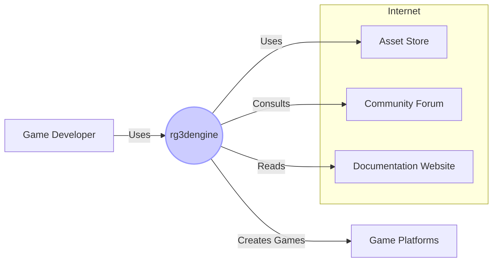
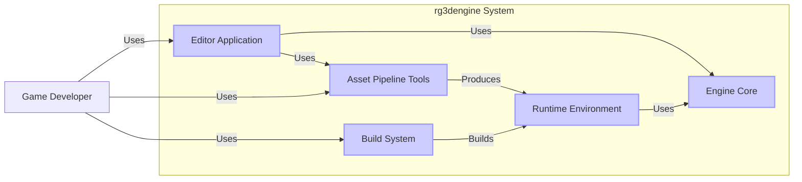
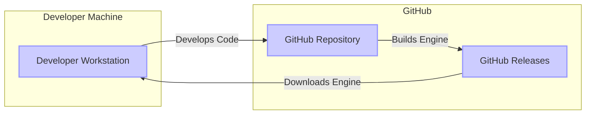

# BUSINESS POSTURE

This project, rg3dengine, is an open-source, general-purpose 3D game engine written in Rust.

- Business Priorities and Goals:
 - Provide a feature-rich, stable, and performant 3D game engine.
 - Foster a community of users and contributors around the engine.
 - Enable game developers to create high-quality 3D games and applications.
 - Offer an alternative to existing commercial and open-source game engines.
 - Promote the use of Rust in game development.

- Most Important Business Risks:
 - Security vulnerabilities in the engine could lead to exploitation in games built with it, damaging the engine's reputation and user trust.
 - Lack of community adoption and contribution could hinder the engine's development and long-term viability.
 - Performance issues or instability could deter developers from using the engine.
 - Competition from established game engines could limit market share and adoption.

# SECURITY POSTURE

- Existing Security Controls:
 - security control: Code is publicly available on GitHub for review. Implemented: GitHub repository.
 - security control: Bug reports and issues are tracked publicly. Implemented: GitHub issues.
 - security control: Contributions are reviewed via pull requests. Implemented: GitHub pull requests.
 - accepted risk: Reliance on community contributions for security vulnerability identification and patching.
 - accepted risk: Limited dedicated security team or resources for proactive security measures.

- Recommended Security Controls:
 - security control: Implement automated Static Application Security Testing (SAST) in the CI/CD pipeline to identify potential vulnerabilities in the code.
 - security control: Integrate Dependency Scanning to identify and manage known vulnerabilities in third-party libraries.
 - security control: Conduct regular security code reviews, focusing on critical components and areas identified by SAST.
 - security control: Establish a clear process for reporting and handling security vulnerabilities, including a security policy and contact information.
 - security control: Consider implementing Fuzz testing to discover input validation vulnerabilities and unexpected behavior.

- Security Requirements:
 - Authentication: Not directly applicable to the game engine itself. Authentication might be relevant for related services like asset stores or online game services built using the engine, but these are out of scope for the engine design itself.
 - Authorization: Authorization is relevant within the engine's editor and runtime environment to control access to engine features and game assets. This should be implemented within the engine's code.
 - Input Validation: Robust input validation is crucial for handling various file formats (models, textures, scenes, etc.) to prevent vulnerabilities like buffer overflows, path traversal, and arbitrary code execution. Input validation should be implemented in asset loading and parsing modules.
 - Cryptography: Cryptography might be required for features like:
  - Secure storage of game assets, potentially using encryption at rest. Implemented in asset management modules.
  - Secure network communication for multiplayer games built with the engine, using TLS/SSL. Implemented in networking modules.
  - Protection of sensitive game data, such as save games or configuration files, using encryption. Implemented in game save/load and configuration modules.

# DESIGN

## C4 CONTEXT



- C4 Context Elements:
 - - Name: Game Developer
   - Type: Person
   - Description: Individuals or teams who use rg3dengine to create games and interactive applications.
   - Responsibilities: Develop games, provide feedback on the engine, contribute to the community.
   - Security controls: Responsible for the security of the games they develop using the engine, including secure coding practices and vulnerability management in their game logic and assets.
 - - Name: rg3dengine
   - Type: Software System
   - Description: The rg3dengine game engine, providing tools and libraries for 3D game development.
   - Responsibilities: Provide core engine functionalities, editor tools, asset pipeline, and runtime environment.
   - Security controls: Input validation for asset loading, authorization within the editor, potentially cryptography for asset protection and networking, secure build process.
 - - Name: Asset Store
   - Type: External System
   - Description: Online marketplace where game developers can purchase or download assets (models, textures, sounds, etc.) for use in their games.
   - Responsibilities: Provide game assets, manage asset licensing and distribution.
   - Security controls: Security of asset delivery, protection against malware in assets, secure payment processing (if applicable).
 - - Name: Community Forum
   - Type: External System
   - Description: Online forum or platform for rg3dengine users to discuss the engine, share knowledge, and get support.
   - Responsibilities: Facilitate community interaction, provide support, share knowledge.
   - Security controls: Forum security (authentication, authorization, content moderation), protection against malicious content.
 - - Name: Documentation Website
   - Type: External System
   - Description: Website hosting the official documentation for rg3dengine, including tutorials, API references, and examples.
   - Responsibilities: Provide comprehensive and up-to-date documentation.
   - Security controls: Website security (availability, integrity of documentation content).
 - - Name: Game Platforms
   - Type: External System
   - Description: Platforms where games built with rg3dengine are deployed and played (e.g., Steam, web browsers, mobile app stores, consoles).
   - Responsibilities: Distribute and run games, provide platform-specific APIs and services.
   - Security controls: Platform security, game distribution security, runtime environment security.

## C4 CONTAINER



- C4 Container Elements:
 - - Name: Engine Core
   - Type: Container (Rust Library)
   - Description: The core engine libraries providing the fundamental functionalities of the game engine, such as rendering, physics, audio, input, and networking.
   - Responsibilities: Implement core engine features, manage game state, provide APIs for other containers.
   - Security controls: Input validation in asset loading and processing, memory safety (Rust language features), implementation of cryptographic functions if needed, authorization checks for internal engine operations.
 - - Name: Editor Application
   - Type: Container (Desktop Application)
   - Description: A graphical editor application that allows game developers to create, edit, and manage game scenes, assets, and logic.
   - Responsibilities: Provide a user interface for game development, scene editing, asset management, visual scripting, and debugging.
   - Security controls: User authentication and authorization within the editor (if applicable for multi-user scenarios, currently likely not needed for open-source single-user editor), input validation for user inputs and project file handling, protection against cross-site scripting (XSS) if the editor uses web technologies for UI, secure handling of project files and assets.
 - - Name: Asset Pipeline Tools
   - Type: Container (Command-line Tools, Libraries)
   - Description: A set of tools and libraries for processing game assets (models, textures, sounds, etc.) from various formats into engine-ready formats.
   - Responsibilities: Asset conversion, optimization, and management.
   - Security controls: Robust input validation for all supported asset formats to prevent vulnerabilities during asset processing (e.g., buffer overflows, arbitrary code execution), secure handling of file paths and permissions, prevention of directory traversal vulnerabilities.
 - - Name: Runtime Environment
   - Type: Container (Libraries, Executables)
   - Description: The runtime environment that executes games built with rg3dengine on target platforms. This includes platform-specific libraries and executables.
   - Responsibilities: Load and run games, provide platform-specific APIs, manage game resources.
   - Security controls: Secure loading of game assets, sandboxing or isolation of game execution environment (depending on target platform capabilities), protection against memory corruption vulnerabilities, secure handling of user input.
 - - Name: Build System
   - Type: Container (Scripts, Configuration Files)
   - Description: Scripts and configuration files used to build the engine, editor, and runtime components from source code.
   - Responsibilities: Automate the build process, compile code, link libraries, package distributions.
   - Security controls: Secure configuration of build environment, dependency management, integrity checks for build artifacts, secure storage of build secrets (if any).

## DEPLOYMENT

Deployment Scenario: Development Environment and GitHub Releases



- Deployment Elements:
 - - Name: Developer Workstation
   - Type: Environment (Physical/Virtual Machine)
   - Description: The local machine used by game developers to develop games and potentially build the engine from source.
   - Responsibilities: Game development, engine building, testing.
   - Security controls: Operating system security, developer tools security, code repository access control, local firewalls, endpoint protection.
 - - Name: GitHub Repository
   - Type: Environment (Cloud Service)
   - Description: The GitHub repository hosting the rg3dengine source code, issue tracker, and collaboration tools.
   - Responsibilities: Source code management, version control, issue tracking, pull request management, CI/CD pipelines, release management.
   - Security controls: GitHub's security controls (authentication, authorization, access control, audit logging), branch protection, vulnerability scanning (GitHub Dependabot), security code scanning (GitHub CodeQL).
 - - Name: GitHub Releases
   - Type: Environment (Cloud Service)
   - Description: GitHub Releases used to distribute pre-built binaries and source code packages of rg3dengine.
   - Responsibilities: Engine distribution, version management, providing downloadable artifacts.
   - Security controls: Integrity of release artifacts (checksums, signatures), secure delivery of downloads (HTTPS), access control to release management.

## BUILD

```mermaid
flowchart LR
    A[Developer] -- Code Changes --> B[Source Code Repository (GitHub)]
    B -- Triggers Build --> C[CI/CD System (GitHub Actions)]
    C -- Fetches Dependencies --> D[Dependency Registry (crates.io)]
    C -- Compiles & Tests Code --> E[Build Environment]
    E -- Runs Security Checks (SAST, Linters) --> E
    E -- Creates Build Artifacts --> F[Artifact Repository (GitHub Releases)]
    F -- Distributes Artifacts --> G[Users/Developers]
    style A fill:#ccf,stroke:#99f,stroke-width:2px
    style B fill:#ccf,stroke:#99f,stroke-width:2px
    style C fill:#ccf,stroke:#99f,stroke-width:2px
    style D fill:#ccf,stroke:#99f,stroke-width:2px
    style E fill:#ccf,stroke:#99f,stroke-width:2px
    style F fill:#ccf,stroke:#99f,stroke-width:2px
    style G fill:#ccf,stroke:#99f,stroke-width:2px
```

- Build Process Description:
 - Developer writes code and commits changes to the GitHub repository.
 - Code changes trigger the CI/CD system (e.g., GitHub Actions).
 - CI/CD system fetches dependencies from the Rust package registry (crates.io).
 - CI/CD system compiles the code in a controlled build environment.
 - Security checks are performed during the build process, including:
  - Static Application Security Testing (SAST) to identify potential code vulnerabilities.
  - Code linters to enforce coding standards and best practices.
  - Dependency scanning to check for known vulnerabilities in dependencies.
 - Build artifacts (binaries, source packages) are created.
 - Build artifacts are uploaded to the artifact repository (GitHub Releases).
 - Users and developers can download the build artifacts from GitHub Releases.

- Build Security Controls:
 - security control: Automated build process using CI/CD (GitHub Actions). Implemented: GitHub Actions workflows.
 - security control: Dependency management using `Cargo.toml` and `crates.io`. Implemented: Rust build system.
 - security control: Static Application Security Testing (SAST) integration in CI/CD. Recommended: Integrate a SAST tool in GitHub Actions.
 - security control: Code linting and formatting checks in CI/CD. Implemented: Rust linter (clippy) can be integrated in GitHub Actions.
 - security control: Dependency scanning in CI/CD. Recommended: Integrate a dependency scanning tool in GitHub Actions.
 - security control: Secure build environment (containerized build agents). Implemented: GitHub Actions runners provide isolated environments.
 - security control: Code review process for pull requests before merging. Implemented: GitHub pull request reviews.
 - security control: Signing of release artifacts. Recommended: Consider signing release binaries to ensure integrity and authenticity.

# RISK ASSESSMENT

- Critical Business Processes:
 - Development and maintenance of the rg3dengine source code.
 - Distribution of the rg3dengine to game developers.
 - Community engagement and support.

- Data to Protect and Sensitivity:
 - Source code of rg3dengine: High sensitivity (Intellectual Property, competitive advantage).
 - Build artifacts (binaries, packages): Medium sensitivity (Integrity and availability for users).
 - User data (community forum, website): Low to Medium sensitivity (depending on data collected, typically user profiles, posts).

# QUESTIONS & ASSUMPTIONS

- Questions:
 - What is the target audience for rg3dengine (indie developers, studios, hobbyists)?
 - Are there any specific security compliance requirements for the engine or games built with it?
 - Are there plans for commercialization or monetization of rg3dengine or related services?
 - What is the process for handling security vulnerability reports from the community?
 - Are there any specific areas of the engine that are considered high-risk from a security perspective?

- Assumptions:
 - rg3dengine is primarily intended for open-source use and community contribution.
 - Security is a concern, but resources for dedicated security efforts are limited.
 - The primary deployment model is distribution of source code and pre-built binaries via GitHub Releases.
 - The engine is not currently integrated with any commercial services or platforms that impose strict security requirements.
 - Game developers using rg3dengine are responsible for the security of their own games built with the engine.