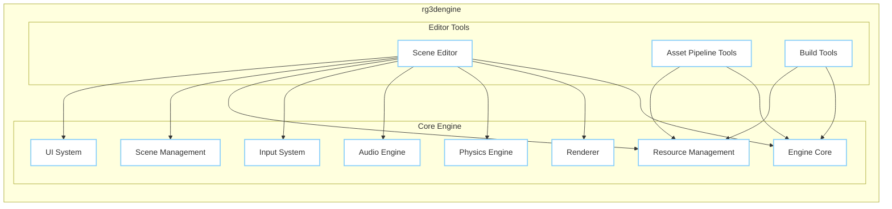

# BUSINESS POSTURE

- Business Priorities and Goals:
  - rg3dengine is an open-source, general-purpose 2D and 3D game engine written in Rust.
  - The primary goal is to provide a feature-rich, performant, and easy-to-use game engine for developers.
  - Priorities include:
    - Feature development and engine capabilities.
    - Stability and reliability of the engine.
    - Community growth and adoption.
    - Cross-platform compatibility.
    - Performance optimization.
- Business Risks:
  - Adoption risk: Lack of adoption by game developers could lead to project stagnation.
  - Competition risk: Competition from established game engines (Unity, Unreal Engine, Godot) and other emerging engines.
  - Security risk: Vulnerabilities in the engine could be exploited in games built with it, damaging the reputation and trust in the engine.
  - Community support risk:  Insufficient community support could hinder user adoption and feature development.
  - Sustainability risk: Long-term maintenance and development of an open-source project depend on contributions and funding.

# SECURITY POSTURE

- Existing Security Controls:
  - security control: GitHub repository access control - Implemented in GitHub repository settings.
  - security control: GitHub security scanning - Implemented by GitHub Dependabot and code scanning features.
  - accepted risk: Reliance on community contributions for security vulnerability discovery and patching.
  - accepted risk: Security vulnerabilities might be discovered after release.
- Recommended Security Controls:
  - security control: Implement automated security testing in CI/CD pipeline (SAST, DAST, dependency scanning).
  - security control: Establish a process for reporting and handling security vulnerabilities.
  - security control: Conduct regular security code reviews, especially for critical components.
  - security control: Provide security guidelines for developers using rg3dengine to build games.
- Security Requirements:
  - Authentication:
    - Requirement: Authentication is required for contributors to the GitHub repository.
    - Requirement: No authentication is required for users downloading and using the engine.
  - Authorization:
    - Requirement: Authorization is required for contributors to push code changes to the repository. Implemented via GitHub branch protection rules.
    - Requirement: Access to the GitHub repository is controlled via GitHub roles and permissions.
  - Input Validation:
    - Requirement: Engine should perform input validation to prevent crashes or unexpected behavior when loading game assets or handling user input in games built with the engine. This is the responsibility of the engine developers.
    - Requirement: Game developers using the engine are responsible for implementing input validation in their game logic to prevent vulnerabilities in their games.
  - Cryptography:
    - Requirement: If the engine provides features for networking or saving game data, ensure that cryptography is used appropriately to protect sensitive data. This might be relevant for game developers using the engine features.
    - Requirement: Secure storage of any API keys or secrets used in the build or deployment processes.

# DESIGN

## C4 CONTEXT

```mermaid
graph LR
    subgraph "Game Developers"
        GD[Game Developer]
    end
    subgraph "rg3dengine Project"
        RE[rg3dengine]
    end
    subgraph "External Systems"
        GH[GitHub]
        CR[Crates.io (or similar package registry)]
    end

    GD --> RE
    RE --> GH
    RE --> CR
    GD -- Uses --> RE
    GD -- Contributes to --> GH
    RE -- Hosted on, Source Code --> GH
    RE -- Publishes Packages to --> CR

    classDef box stroke:#32CD32,stroke-width:2px,fill:#fff
    classDef external stroke:#FFA07A,stroke-width:2px,fill:#fff
    classDef project stroke:#87CEFA,stroke-width:2px,fill:#fff

    class GD box
    class GH external
    class CR external
    class RE project
```

- Context Diagram Elements:
  - - Name: Game Developer
    - Type: Person
    - Description: Software developers who use rg3dengine to create games.
    - Responsibilities: Develop games using rg3dengine, provide feedback and contribute to the engine.
    - Security controls: Responsible for securing their own development environments and games built with the engine.
  - - Name: rg3dengine
    - Type: Software System
    - Description: Open-source 2D and 3D game engine written in Rust. Provides tools and libraries for game development.
    - Responsibilities: Provide a robust, feature-rich, and secure game engine. Manage source code and releases.
    - Security controls: Implements secure coding practices, performs security testing, manages vulnerabilities, and controls access to the source code repository.
  - - Name: GitHub
    - Type: External System
    - Description: Version control and collaboration platform. Hosts the rg3dengine source code repository.
    - Responsibilities: Provide secure hosting for the source code, manage access control, and provide collaboration tools.
    - Security controls: GitHub access controls, authentication, authorization, security scanning features (Dependabot, code scanning).
  - - Name: Crates.io (or similar package registry)
    - Type: External System
    - Description: Package registry for Rust crates (or similar for other languages if used). Used to distribute rg3dengine libraries and dependencies.
    - Responsibilities: Securely host and distribute software packages.
    - Security controls: Package signing, vulnerability scanning of packages, access controls.

## C4 CONTAINER



- Container Diagram Elements:
  - - Name: Engine Core
    - Type: Library/Module
    - Description: Core functionalities of the game engine, including game loop, entity-component system, scripting interface, and general utilities.
    - Responsibilities: Provide the foundation for the game engine, manage core logic and data structures.
    - Security controls: Input validation, memory safety (Rust language features), secure coding practices.
  - - Name: Renderer
    - Type: Library/Module
    - Description: Handles rendering of 2D and 3D graphics, including scene rendering, material system, and rendering pipelines.
    - Responsibilities: Render game scenes efficiently and correctly.
    - Security controls: Input validation for shaders and rendering parameters, protection against rendering exploits.
  - - Name: Physics Engine
    - Type: Library/Module
    - Description: Simulates physics interactions in the game world, including collision detection, rigid body dynamics, and physics materials.
    - Responsibilities: Provide realistic physics simulation.
    - Security controls: Input validation for physics parameters, prevent physics engine exploits.
  - - Name: Audio Engine
    - Type: Library/Module
    - Description: Manages audio playback, sound effects, and music in the game.
    - Responsibilities: Play audio efficiently and correctly.
    - Security controls: Input validation for audio files and parameters, prevent audio engine exploits.
  - - Name: Input System
    - Type: Library/Module
    - Description: Handles user input from various devices (keyboard, mouse, gamepad, touch).
    - Responsibilities: Capture and process user input reliably.
    - Security controls: Input validation to prevent injection attacks through input handling.
  - - Name: Resource Management
    - Type: Library/Module
    - Description: Manages game assets (textures, models, sounds, etc.), including loading, caching, and unloading.
    - Responsibilities: Efficiently manage game assets.
    - Security controls: Input validation for asset files to prevent malicious assets from being loaded, secure asset storage and handling.
  - - Name: Scene Management
    - Type: Library/Module
    - Description: Manages game scenes, including scene loading, saving, and scene graph management.
    - Responsibilities: Manage game scenes and their contents.
    - Security controls: Input validation for scene files, prevent scene loading exploits.
  - - Name: UI System
    - Type: Library/Module
    - Description: Provides UI elements and functionalities for creating user interfaces in games and editor tools.
    - Responsibilities: Provide UI components and rendering.
    - Security controls: Input validation for UI elements and user input in UI.
  - - Name: Scene Editor
    - Type: Application
    - Description: Visual editor for creating and editing game scenes, placing objects, and configuring game logic.
    - Responsibilities: Provide a user-friendly interface for scene editing.
    - Security controls: Access control to editor features, input validation for scene data, protection against editor exploits.
  - - Name: Asset Pipeline Tools
    - Type: Application
    - Description: Tools for processing and converting game assets into engine-compatible formats.
    - Responsibilities: Prepare game assets for use in the engine.
    - Security controls: Input validation for asset files, prevent malicious asset processing, secure handling of asset data.
  - - Name: Build Tools
    - Type: Application
    - Description: Tools for building and packaging games for different platforms.
    - Responsibilities: Build distributable game packages.
    - Security controls: Secure build process, prevent injection of malicious code during build, secure handling of build artifacts.

## DEPLOYMENT

- Deployment Options:
  - Game developers deploy games built with rg3dengine to various platforms (Windows, Linux, macOS, Web, Mobile, Consoles).
  - rg3dengine libraries are deployed to package registries (crates.io for Rust).
  - Editor tools are distributed as standalone applications or as part of the engine package.

- Detailed Deployment (Example: Game Deployment to Desktop):

```mermaid
graph LR
    subgraph "Developer Machine"
        DevMachine[Developer Machine]
        GameCode[Game Code & Assets]
        RE_BuildTool_Dev[Build Tools]
    end
    subgraph "Build Pipeline"
        BuildServer[Build Server]
        RE_BuildTool_Build[Build Tools]
        GamePackage[Game Package]
    end
    subgraph "User Machine"
        UserMachine[User Machine]
        DeployedGame[Deployed Game]
    end

    DevMachine --> BuildServer: Triggers Build
    GameCode --> RE_BuildTool_Dev: Used by
    RE_BuildTool_Dev --> BuildServer: Transfers Code & Assets
    RE_BuildTool_Build --> GamePackage: Creates
    BuildServer --> UserMachine: Distributes Game Package
    GamePackage --> DeployedGame: Installed on

    classDef machine stroke:#32CD32,stroke-width:2px,fill:#fff
    classDef server stroke:#FFA07A,stroke-width:2px,fill:#fff
    classDef package stroke:#87CEFA,stroke-width:2px,fill:#fff
    classDef app stroke:#FFFFE0,stroke-width:2px,fill:#fff

    class DevMachine machine
    class UserMachine machine
    class BuildServer server
    class GamePackage package
    class GameCode app
    class DeployedGame app
    class RE_BuildTool_Dev app
    class RE_BuildTool_Build app
```

- Deployment Diagram Elements (Game Deployment to Desktop):
  - - Name: Developer Machine
    - Type: Environment
    - Description: Developer's local computer used for game development.
    - Responsibilities: Game code development, asset creation, local testing.
    - Security controls: Developer machine security practices, code repository access control.
  - - Name: Build Server
    - Type: Environment
    - Description: Server used for automated game builds and packaging. Could be a CI/CD system.
    - Responsibilities: Automated building, testing, and packaging of the game.
    - Security controls: Secure build environment, access control to build server, secure storage of build artifacts.
  - - Name: User Machine
    - Type: Environment
    - Description: End-user's computer where the game is installed and played.
    - Responsibilities: Running the deployed game.
    - Security controls: User's machine security practices, game application security.
  - - Name: Game Code & Assets
    - Type: Artifact
    - Description: Source code and game assets created by the developer.
    - Responsibilities: Game logic, game content.
    - Security controls: Version control, access control, secure storage.
  - - Name: Build Tools (Developer)
    - Type: Software
    - Description: Build tools used on the developer machine for local builds and testing.
    - Responsibilities: Local game building and testing.
    - Security controls: Secure software development practices.
  - - Name: Build Tools (Build Server)
    - Type: Software
    - Description: Build tools installed on the build server for automated builds.
    - Responsibilities: Automated game building and packaging.
    - Security controls: Secure build process, dependency management, security scanning during build.
  - - Name: Game Package
    - Type: Artifact
    - Description: Distributable package of the game (e.g., executable, installer).
    - Responsibilities: Distributable game application.
    - Security controls: Code signing, integrity checks, secure distribution channels.
  - - Name: Deployed Game
    - Type: Application
    - Description: Game application installed and running on the user's machine.
    - Responsibilities: Game execution and user interaction.
    - Security controls: Application security, input validation, protection against runtime exploits.

## BUILD

```mermaid
graph LR
    subgraph "Developer"
        Developer[Developer]
        LocalCode[Local Code Changes]
    end
    subgraph "GitHub"
        GitHubRepo[GitHub Repository]
        GitHubActions[GitHub Actions CI]
    end
    subgraph "Build System"
        BuildAgent[Build Agent]
        BuildArtifacts[Build Artifacts]
        SecurityScanners[Security Scanners (SAST, Dependency)]
    end
    subgraph "Package Registry"
        PackageRegistry[Package Registry (crates.io)]
    end

    Developer -- Push Code --> GitHubRepo
    LocalCode --> GitHubRepo: Push
    GitHubRepo --> GitHubActions: Triggers Build
    GitHubActions --> BuildAgent: Executes Build
    BuildAgent --> SecurityScanners: Runs
    SecurityScanners --> BuildAgent: Reports
    BuildAgent --> BuildArtifacts: Creates
    BuildArtifacts --> PackageRegistry: Publishes

    style SecurityScanners fill:#FFFFE0,stroke:#D3D3D3,stroke-width:2px
    classDef person stroke:#32CD32,stroke-width:2px,fill:#fff
    classDef system stroke:#FFA07A,stroke-width:2px,fill:#fff
    classDef process stroke:#87CEFA,stroke-width:2px,fill:#fff
    classDef artifact stroke:#FFFFE0,stroke-width:2px,fill:#fff

    class Developer person
    class GitHubRepo system
    class GitHubActions process
    class BuildAgent process
    class PackageRegistry system
    class BuildArtifacts artifact
    class LocalCode artifact
```

- Build Process Description:
  - Developers write code and push changes to the GitHub repository.
  - GitHub Actions CI is triggered on code changes (e.g., push, pull request).
  - GitHub Actions executes build jobs on Build Agents.
  - Build process includes:
    - Code compilation (Rust compilation).
    - Running linters and code formatters.
    - Running Security Scanners (SAST, dependency vulnerability scanning).
    - Running unit and integration tests.
    - Building artifacts (libraries, editor tools, examples).
  - Build Artifacts are created and stored.
  - Successful build artifacts (engine libraries) are published to a package registry (crates.io).

- Build Process Security Controls:
  - security control: Automated build process using GitHub Actions - Implemented using GitHub Workflows.
  - security control: Source code hosted on GitHub with access control - Implemented by GitHub repository permissions.
  - security control: Dependency scanning - Implemented by GitHub Dependabot and potentially other dependency scanning tools in CI.
  - security control: Static Application Security Testing (SAST) - Recommended to integrate SAST scanners into the CI pipeline.
  - security control: Code linting and formatting - Implemented as part of the build process to enforce code quality and consistency.
  - security control: Unit and integration tests - Implemented as part of the build process to ensure code functionality and stability.
  - security control: Secure build environment - GitHub Actions runners are isolated environments.
  - security control: Code signing for release artifacts - Recommended for distribution of editor tools and game packages.

# RISK ASSESSMENT

- Critical Business Processes:
  - Development and maintenance of the rg3dengine.
  - Distribution of the rg3dengine libraries and tools.
  - Building games using rg3dengine by game developers.
- Data to Protect:
  - Source code of rg3dengine - Sensitivity: High (Intellectual Property, competitive advantage).
  - Game engine libraries and build artifacts - Sensitivity: Medium (Distribution integrity, prevent supply chain attacks).
  - Game assets (example projects, demos) - Sensitivity: Low to Medium (Depending on the asset, mostly for demonstration and community purposes).
  - Developer credentials and access keys - Sensitivity: High (Access to source code, build systems, and distribution channels).
- Data Sensitivity:
  - Source code: Highly sensitive. Unauthorized access or modification could lead to intellectual property theft, introduction of vulnerabilities, or project disruption.
  - Build artifacts: Moderately sensitive. Compromised build artifacts could lead to distribution of malware or vulnerable engine versions.
  - Game assets: Low to moderately sensitive. Depending on the asset type, they might have some value but are generally less critical than source code.
  - Developer credentials: Highly sensitive. Compromise could lead to unauthorized access to all project resources.

# QUESTIONS & ASSUMPTIONS

- BUSINESS POSTURE:
  - Question: What is the target audience for rg3dengine? Is it primarily hobbyists, indie developers, or are there plans to target larger studios or commercial use?
  - Assumption: Target audience is primarily indie developers and hobbyists, but with potential for wider adoption.
  - Question: Are there any specific business goals for rg3dengine beyond providing a free and open-source engine (e.g., commercial services, consulting, asset store)?
  - Assumption: Currently focused on open-source development and community growth, no immediate commercialization plans assumed.

- SECURITY POSTURE:
  - Question: Are there any existing security guidelines or policies for contributing to rg3dengine?
  - Assumption: Standard open-source contribution guidelines are followed, but no explicit security-focused guidelines are publicly documented.
  - Question: Are there any known past security vulnerabilities or security incidents related to rg3dengine?
  - Assumption: No publicly known major security incidents. Standard vulnerabilities for software projects are assumed to be possible.
  - Question: What is the process for reporting and handling security vulnerabilities in rg3dengine?
  - Assumption: Standard open-source vulnerability reporting process via GitHub issues or direct communication with maintainers.

- DESIGN:
  - Question: What are the primary programming languages used in rg3dengine besides Rust? (e.g., scripting languages, shader languages).
  - Assumption: Primarily Rust for core engine components, shader languages (GLSL, HLSL) for rendering, and potentially scripting languages for game logic (though not explicitly mentioned in the repository description).
  - Question: What are the key external dependencies of rg3dengine?
  - Assumption: Standard Rust crates for graphics, audio, physics, and other functionalities. Dependencies are managed via Cargo.
  - Question: What is the intended distribution method for rg3dengine libraries and editor tools?
  - Assumption: Libraries are distributed via crates.io, editor tools are distributed as standalone executables or as part of engine packages (downloadable from GitHub releases or website).