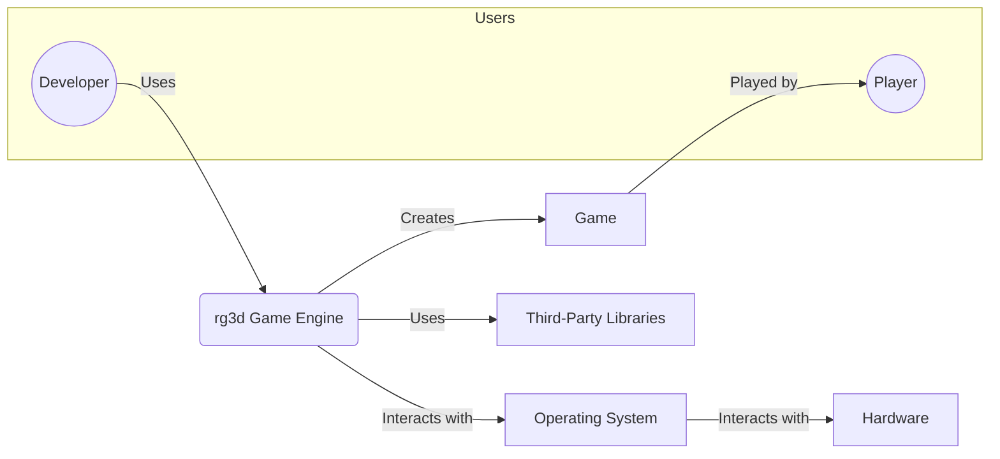
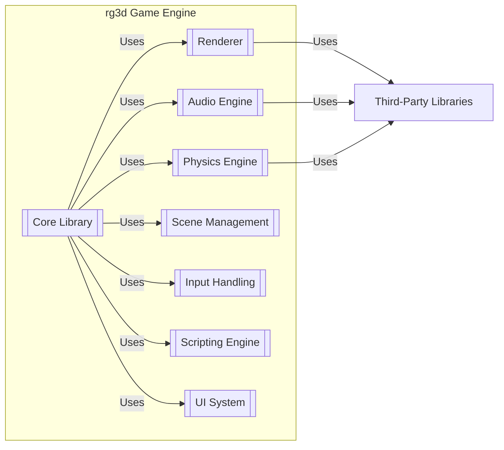

Okay, let's create a design document for the rg3d game engine, focusing on aspects relevant to threat modeling.

# BUSINESS POSTURE

The rg3d project is an open-source game engine.  Its primary goal is to provide a feature-rich, production-ready engine for creating 2D and 3D games.  The business priorities, in this context, revolve around community growth, adoption, and long-term maintainability.  Since it's open-source, direct monetization isn't the primary driver; instead, reputation and contribution are key.

Business Priorities:

*   Attract and retain users (game developers).
*   Foster a vibrant and active community.
*   Ensure the engine is robust, reliable, and performant.
*   Maintain a codebase that is easy to understand and contribute to.
*   Provide good documentation and support.
*   Facilitate the creation of high-quality games.

Business Goals:

*   Become a recognized and respected game engine in the industry.
*   Grow the number of games built using rg3d.
*   Increase the number of contributors to the project.
*   Establish a sustainable development model.

Most Important Business Risks:

*   Malicious code injection into the engine: This could compromise games built with the engine, damaging the reputation of rg3d and potentially harming end-users.
*   Lack of adoption: If the engine fails to attract users, it will become stagnant and eventually obsolete.
*   Uncontrolled dependencies: Vulnerabilities in third-party libraries could expose the engine and games built with it to attacks.
*   Lack of community engagement: A weak community can lead to slow development, fewer contributions, and a lack of support for users.
*   Code quality issues: Bugs and performance problems can deter users and make the engine difficult to maintain.
*   Intellectual property infringement: Using copyrighted assets or code without proper licensing could lead to legal issues.

# SECURITY POSTURE

The project is in its early stages, and security controls are likely evolving.  The following is an assessment based on the provided repository link and common practices.

Existing Security Controls:

*   security control: Code reviews: The GitHub repository uses pull requests, implying that code reviews are part of the development process. Location: GitHub pull request process.
*   security control: Use of Rust: Rust, as a memory-safe language, inherently mitigates many common security vulnerabilities like buffer overflows. Location: Core engine code.
*   security control: Dependency management: Cargo (Rust's package manager) is used, providing some level of dependency tracking. Location: Cargo.toml files.
*   security control: Static analysis (likely): Clippy (a Rust linter) is often used in Rust projects to catch potential issues. Location: Potentially integrated into the build process or CI. Not explicitly confirmed in the provided link.
*   security control: Issue tracking: GitHub Issues are used to track bugs and feature requests, which can include security vulnerabilities. Location: GitHub Issues.

Accepted Risks:

*   accepted risk: Reliance on third-party libraries: The engine uses external libraries (e.g., for rendering, audio, physics), which introduces the risk of vulnerabilities in those dependencies.
*   accepted risk: Limited formal security testing: There's no explicit mention of penetration testing, fuzzing, or other advanced security testing methodologies.
*   accepted risk: Community contributions: While beneficial, accepting code from external contributors introduces a risk of malicious or unintentionally vulnerable code.
*   accepted risk: Evolving security practices: As an open-source project, security practices may not be as formalized or consistently applied as in a commercial environment.

Recommended Security Controls (High Priority):

*   security control: Integrate a Software Composition Analysis (SCA) tool: Tools like Dependabot (for GitHub) or Snyk can automatically identify known vulnerabilities in dependencies.
*   security control: Implement a security.md file: This file should outline the project's security policy, vulnerability reporting process, and contact information for security researchers.
*   security control: Perform regular security audits: Conduct periodic reviews of the codebase and infrastructure to identify potential vulnerabilities.
*   security control: Consider fuzzing: Fuzz testing can help uncover unexpected behavior and potential vulnerabilities in input handling.
*   security control: Code signing: If distributing compiled binaries, code signing can help ensure the integrity and authenticity of the engine.

Security Requirements:

*   Authentication: Not directly applicable to the engine itself, but relevant for any associated services (e.g., asset stores, forums). If such services exist, strong authentication mechanisms (e.g., multi-factor authentication) should be used.
*   Authorization: Similarly, not directly applicable to the core engine. If there are administrative interfaces or services, role-based access control (RBAC) should be implemented.
*   Input Validation: Crucial for preventing injection attacks. The engine should carefully validate all inputs, including:
    *   User-provided data (e.g., scripts, configuration files).
    *   Data loaded from external files (e.g., models, textures).
    *   Network data (if networking features are used).
    *   Data from third-party libraries.
*   Cryptography:
    *   If the engine handles sensitive data (e.g., user credentials, encryption keys), appropriate cryptographic algorithms and secure key management practices should be used.
    *   If networking is involved, secure communication protocols (e.g., TLS/SSL) should be employed.
    *   Hashing should be used for storing passwords, if applicable.

# DESIGN

## C4 CONTEXT



Element Descriptions:

*   Element:
    *   Name: Developer
    *   Type: Person
    *   Description: A game developer who uses the rg3d engine to create games.
    *   Responsibilities: Writing game logic, designing levels, integrating assets, and building the game.
    *   Security controls: N/A (external to the system)

*   Element:
    *   Name: Player
    *   Type: Person
    *   Description: An end-user who plays games created with the rg3d engine.
    *   Responsibilities: Playing the game.
    *   Security controls: N/A (external to the system)

*   Element:
    *   Name: rg3d Game Engine
    *   Type: Software System
    *   Description: The core game engine, providing functionalities for rendering, physics, audio, input, etc.
    *   Responsibilities: Providing the core framework for building games.
    *   Security controls: Input validation, memory safety (via Rust), dependency management, code reviews.

*   Element:
    *   Name: Game
    *   Type: Software System
    *   Description: Game created using rg3d Game Engine.
    *   Responsibilities: Providing gameplay to Player.
    *   Security controls: Inherited from rg3d Game Engine.

*   Element:
    *   Name: Operating System
    *   Type: Software System
    *   Description: The underlying operating system (e.g., Windows, macOS, Linux) on which the engine and games run.
    *   Responsibilities: Providing low-level services (e.g., memory management, file system access, networking).
    *   Security controls: OS-level security features (e.g., sandboxing, access controls).

*   Element:
    *   Name: Third-Party Libraries
    *   Type: Software System
    *   Description: External libraries used by the engine (e.g., for rendering, audio, physics).
    *   Responsibilities: Providing specific functionalities to the engine.
    *   Security controls: Dependency management, SCA (recommended).

*   Element:
    *   Name: Hardware
    *   Type: Hardware
    *   Description: Physical computer and it's components.
    *   Responsibilities: Execute software.
    *   Security controls: N/A

## C4 CONTAINER



Element Descriptions:

*   Element:
    *   Name: Renderer
    *   Type: Container
    *   Description: Handles rendering graphics to the screen.
    *   Responsibilities: Drawing objects, managing shaders, handling lighting and shadows.
    *   Security controls: Input validation (for shader code, textures, models), potentially sandboxing (if supporting custom shaders).

*   Element:
    *   Name: Audio Engine
    *   Type: Container
    *   Description: Manages audio playback and effects.
    *   Responsibilities: Playing sounds, mixing audio streams, handling spatial audio.
    *   Security controls: Input validation (for audio files), protection against buffer overflows.

*   Element:
    *   Name: Physics Engine
    *   Type: Container
    *   Description: Simulates physics interactions between objects.
    *   Responsibilities: Collision detection, rigid body dynamics, constraint solving.
    *   Security controls: Input validation (for physics parameters), protection against denial-of-service (e.g., excessive simulation load).

*   Element:
    *   Name: Scene Management
    *   Type: Container
    *   Description: Organizes and manages game objects and their relationships.
    *   Responsibilities: Loading and unloading scenes, managing object hierarchies, handling object updates.
    *   Security controls: Input validation (for scene files), access control (if supporting multi-user editing).

*   Element:
    *   Name: Input Handling
    *   Type: Container
    *   Description: Processes user input from keyboard, mouse, gamepad, etc.
    *   Responsibilities: Capturing input events, mapping inputs to actions.
    *   Security controls: Input validation (to prevent unexpected behavior), rate limiting (to mitigate denial-of-service).

*   Element:
    *   Name: Scripting Engine
    *   Type: Container
    *   Description: Allows developers to write game logic using a scripting language (e.g., Lua, Rust).
    *   Responsibilities: Executing scripts, providing an interface between scripts and the engine.
    *   Security controls: Sandboxing (to limit script access to engine resources), input validation (for script code), code signing (for trusted scripts).

*   Element:
    *   Name: UI System
    *   Type: Container
    *   Description: Provides tools for creating user interfaces.
    *   Responsibilities: Rendering UI elements, handling user interaction with UI.
    *   Security controls: Input validation (for UI events), protection against cross-site scripting (XSS) if supporting web-based UI.

*   Element:
    *   Name: Core Library
    *   Type: Container
    *   Description: Contains core functionalities and utilities used by other modules.
    *   Responsibilities: Providing common data structures, algorithms, and helper functions.
    *   Security controls: Memory safety (via Rust), code reviews.

*   Element:
    *   Name: Third-Party Libraries
    *   Type: Software System
    *   Description: External libraries used by the engine (e.g., for rendering, audio, physics).
    *   Responsibilities: Providing specific functionalities to the engine.
    *   Security controls: Dependency management, SCA (recommended).

## DEPLOYMENT

Possible Deployment Solutions:

1.  **Source Code Distribution:** Users download the source code and build the engine themselves.
2.  **Pre-built Binaries:** The project provides pre-compiled binaries for various platforms.
3.  **Package Manager:** The engine is distributed through a package manager (e.g., Cargo for Rust components, or system-specific package managers).
4.  **Containerization:** The engine (or parts of it) could be packaged as Docker containers, although this is less common for game engines themselves. It's more likely for associated tools or services.

Chosen Solution (for detailed description): **Source Code Distribution + Pre-built Binaries**

This is the most common approach for open-source game engines. Users can choose to build from source for maximum flexibility or use pre-built binaries for convenience.

```mermaid
graph LR
    subgraph Deployment Environment
        subgraph User Machine
            OperatingSystem[Operating System]
            rg3dEngine[[rg3d Engine (Built)]]
            Game[[Game (Built)]]
            OperatingSystem -- Runs --> rg3dEngine
            OperatingSystem -- Runs --> Game
        end
        subgraph Build Server
            BuildEnvironment[Build Environment]
            BuildEnvironment -- Builds --> rg3dEngineBinaries((rg3d Engine Binaries))
        end
         rg3dEngineBinaries -- Downloaded to --> UserMachine
    end
    ThirdPartyLibraries[Third-Party Libraries]
    rg3dEngine -- Uses --> ThirdPartyLibraries
    Game -- Uses --> rg3dEngine

```

Element Descriptions:

*   Element:
    *   Name: User Machine
    *   Type: Node
    *   Description: The computer where the game developer builds and runs the game.
    *   Responsibilities: Providing the environment for development and execution.
    *   Security controls: OS-level security features.

*   Element:
    *   Name: Operating System (User Machine)
    *   Type: Software
    *   Description: The operating system on the user's machine.
    *   Responsibilities: Managing hardware and software resources.
    *   Security controls: OS-level security features.

*   Element:
    *   Name: rg3d Engine (Built)
    *   Type: Software
    *   Description: The compiled version of the rg3d engine.
    *   Responsibilities: Providing the core game engine functionality.
    *   Security controls: Inherited from the build process and engine design.

*   Element:
    *   Name: Game (Built)
    *   Type: Software
    *   Description: The compiled game created using the rg3d engine.
    *   Responsibilities: Providing the game experience.
    *   Security controls: Inherited from the engine and game-specific code.

*   Element:
        * Name: Build Server
        * Type: Node
        * Description: Server used to build rg3d Engine binaries.
        * Responsibilities: Providing build environment.
        * Security controls: Access control, OS-level security features.

*   Element:
        * Name: Build Environment
        * Type: Software
        * Description: Environment used to build rg3d Engine.
        * Responsibilities: Building rg3d Engine binaries.
        * Security controls: Build process security controls.

*   Element:
        * Name: rg3d Engine Binaries
        * Type: Software
        * Description: Pre-build binaries of rg3d Engine.
        * Responsibilities: Providing the core game engine functionality.
        * Security controls: Inherited from the build process and engine design.

*   Element:
    *   Name: Third-Party Libraries
    *   Type: Software
    *   Description: External libraries used by the engine.
    *   Responsibilities: Providing specific functionalities.
    *   Security controls: Dependency management, SCA.

## BUILD

The build process likely involves the following steps:

1.  **Developer:** A developer writes code and pushes changes to the GitHub repository.
2.  **Pull Request:** A pull request is created, triggering code review.
3.  **Continuous Integration (CI):**  A CI system (e.g., GitHub Actions, Travis CI, AppVeyor - not specified in the provided link, but common for Rust projects) is likely used to automatically build the engine and run tests on various platforms.
4.  **Compilation:** The Rust compiler (rustc) is used to compile the engine code. Cargo manages dependencies and the build process.
5.  **Testing:** Unit tests and integration tests are executed to verify the correctness of the code.
6.  **Artifact Generation:**  The build process produces compiled binaries (executables and libraries) for different target platforms.
7.  **Release (Optional):**  If a new release is being created, the artifacts may be packaged and uploaded to a release server (e.g., GitHub Releases).

```mermaid
graph LR
    Developer((Developer)) -- Pushes code --> GitHubRepository[GitHub Repository]
    GitHubRepository -- Triggers --> CI[Continuous Integration Server]
    CI -- Compiles with --> RustCompiler[Rust Compiler (rustc)]
    CI -- Uses --> Cargo[Cargo (Dependency Manager)]
    Cargo -- Fetches --> ThirdPartyLibraries[Third-Party Libraries]
    CI -- Runs --> Tests[[Tests]]
    RustCompiler -- Produces --> BuildArtifacts((Build Artifacts))
    Tests -- Pass/Fail --> CI
    CI -- Uploads --> ReleaseServer[Release Server (e.g., GitHub Releases)]

```

Security Controls in the Build Process:

*   security control: Code reviews: Mandatory code reviews before merging changes help prevent malicious or vulnerable code from entering the codebase.
*   security control: Automated testing: Unit and integration tests help ensure code quality and prevent regressions.
*   security control: Dependency management: Cargo helps track and manage dependencies, reducing the risk of using outdated or vulnerable libraries.
*   security control: CI/CD:  A CI/CD pipeline automates the build and testing process, ensuring consistency and reducing the risk of manual errors.
*   security control: Static analysis (Clippy - likely):  Linters like Clippy can identify potential code quality and security issues.
*   security control: SCA (recommended):  Integrating an SCA tool into the CI pipeline would automatically detect known vulnerabilities in dependencies.

# RISK ASSESSMENT

Critical Business Processes to Protect:

*   Codebase integrity: Ensuring that the engine's source code is not tampered with.
*   Build process: Protecting the build pipeline from compromise.
*   Community trust: Maintaining the trust of users and contributors.
*   Reputation: Protecting the engine's reputation as a reliable and secure platform.

Data to Protect and Sensitivity:

*   Source code:  Medium sensitivity.  While the code is open-source, unauthorized modifications could introduce vulnerabilities.
*   Build artifacts (binaries): High sensitivity.  Compromised binaries could be used to distribute malware.
*   User data (if any associated services exist):  Sensitivity depends on the type of data (e.g., email addresses, forum posts, game data).
*   Contributor data (e.g., email addresses on GitHub): Low sensitivity, but should still be protected under privacy regulations.
*   Third-party library licenses: Medium sensitivity.  Ensuring compliance with licensing terms is crucial.

# QUESTIONS & ASSUMPTIONS

Questions:

*   Are there any specific security certifications or compliance requirements that the engine needs to meet (e.g., for specific industries or platforms)?
*   What is the project's long-term plan for security testing and maintenance?
*   Are there any plans to implement more advanced security features, such as sandboxing for scripts or support for hardware security modules?
*   What is the process for handling vulnerability reports from external researchers?
*   Is there a dedicated security team or individual responsible for security?
*   Are there any existing security audits or assessments that have been conducted?
*   What specific third-party libraries are considered most critical from a security perspective?
*   Are there any plans to create official builds and distribute them? If so, what is the planned signing and distribution mechanism?
*   What is the target audience's level of security awareness and expertise?
*   Does the engine support any networking features, and if so, what security measures are in place?

Assumptions:

*   BUSINESS POSTURE: The project prioritizes community growth and adoption over direct monetization. The project is willing to accept some level of risk inherent in open-source development.
*   SECURITY POSTURE: The project uses basic security practices (code reviews, Rust's memory safety) but may not have a formal security program. The project relies on community contributions for security improvements.
*   DESIGN: The engine architecture is modular and follows common game engine design patterns. The build process is automated using a CI system (although the specific CI system is not confirmed). The primary deployment method is source code distribution, with potential pre-built binaries.