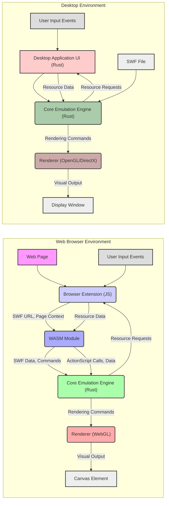

# Project Design Document: Ruffle - Flash Player Emulator

**Document Version:** 1.1
**Date:** October 26, 2023
**Prepared By:** Gemini (AI Language Model)

## 1. Introduction

This document provides an enhanced and detailed design overview of the Ruffle project, an open-source Flash Player emulator implemented in the Rust programming language. This document is specifically crafted to serve as a robust foundation for subsequent threat modeling activities. It meticulously outlines the key components, their interactions, and the comprehensive architecture of the system.

## 2. Project Overview

Ruffle's primary objective is to deliver a secure and contemporary method for experiencing legacy Flash content (SWF files) without relying on the now-deprecated and potentially vulnerable Adobe Flash Player. It achieves this by faithfully recreating the functionality of the ActionScript 1.0/2.0 virtual machines and offering partial support for the ActionScript 3.0 virtual machine, alongside a complete rendering pipeline. Ruffle is designed for broad applicability, targeting both execution within web browsers (as a WebAssembly module) and as a standalone application on various desktop operating systems.

## 3. Goals

*   **Accurate Emulation:** To faithfully reproduce the behavior of Flash content as intended by its creators.
*   **Security and Safety:** To provide a secure alternative to the original Adobe Flash Player, mitigating known vulnerabilities.
*   **Cross-Platform Compatibility:** To function seamlessly across major web browsers and desktop operating systems (Windows, macOS, Linux).
*   **Maintainable Codebase:** To adhere to principles of clean code, ensuring ease of understanding, modification, and contribution.
*   **Performance and Efficiency:** To execute Flash content with acceptable performance and minimal resource consumption.

## 4. Target Audience

This document is primarily intended for:

*   Security engineers tasked with performing comprehensive threat modeling of the Ruffle project.
*   Software developers actively contributing to the development and maintenance of Ruffle.
*   Individuals seeking an in-depth understanding of Ruffle's internal structure and operational mechanisms.

## 5. System Architecture

Ruffle's architecture is modular and can be conceptually divided into the following core components:

*   **Core Emulation Engine (Rust):** The central component responsible for the fundamental tasks of SWF parsing, ActionScript interpretation, and display list management.
*   **WebAssembly (WASM) Module:** A pre-compiled binary representation of the core engine, specifically designed for secure and efficient execution within web browsers.
*   **Browser Extension (JavaScript):** A browser-specific component that facilitates the seamless integration and execution of the WASM module within the context of a web page.
*   **Desktop Application (Rust with UI):** A standalone application providing a dedicated environment for executing SWF files outside of a web browser. This includes platform-specific user interface elements.
*   **Renderer (Rust with Platform APIs):** The component responsible for translating the display list into visual output, utilizing platform-specific graphics APIs.
*   **Input Handling (Platform-Specific):** Manages and interprets user interactions from various input devices, adapting to the specific environment.
*   **Networking (Conditional):** Handles network requests initiated by Flash content, subject to security restrictions and configurations.
*   **Configuration and Settings:** Provides mechanisms for users to customize Ruffle's behavior and preferences.

## 6. Detailed Design

### 6.1. Core Emulation Engine

*   **SWF Parser:**
    *   Functionality:  Decodes the binary structure of SWF files, interpreting headers, tags, and embedded data.
    *   Responsibilities: Handles various SWF versions, compression algorithms (e.g., Zlib), and data structures.
*   **ActionScript Virtual Machine (AVM1/AVM2):**
    *   Functionality: Executes the ActionScript bytecode embedded within SWF files.
    *   Responsibilities: Manages the runtime environment, including variable scope, function calls, object instantiation, and event handling for both ActionScript 1.0/2.0 and (partially) ActionScript 3.0.
*   **Display List Manager:**
    *   Functionality:  Maintains a hierarchical representation of all visual objects within the Flash movie.
    *   Responsibilities: Manages the creation, manipulation (e.g., transformations, visibility), and rendering order of display objects.
*   **Resource Manager:**
    *   Functionality: Loads and manages external assets referenced by the SWF, such as images (bitmaps, JPEGs, PNGs), audio (MP3, ADPCM), and fonts.
    *   Responsibilities: Caching, decoding, and providing access to these resources.
*   **Security Sandbox:**
    *   Functionality: Enforces security boundaries to prevent malicious SWFs from compromising the user's system.
    *   Responsibilities: Restricts access to the local file system, limits network capabilities, and enforces cross-domain policies based on the SWF's origin.

### 6.2. WebAssembly Module

*   **Compilation Target:** The core emulation engine is compiled into WebAssembly bytecode using tools like `wasm-pack`.
*   **Browser Execution:**  Provides a secure and portable environment for running the core logic within web browsers.
*   **JavaScript Interoperability:**  Communicates with the browser environment and the browser extension via JavaScript APIs for tasks like rendering and input handling.

### 6.3. Browser Extension

*   **Technology:** Primarily implemented using JavaScript and browser extension APIs.
*   **Flash Content Detection:** Identifies instances of Flash content (e.g., `<embed>` or `<object>` tags) on loaded web pages.
*   **WASM Module Loading and Initialization:**  Downloads and instantiates the WebAssembly module.
*   **Communication Bridge:** Establishes a communication channel between the web page's JavaScript and the WASM module, facilitating the exchange of data and commands.
*   **Input and Output Redirection:**  Captures user input events from the webpage and forwards them to the WASM module; receives rendering commands from the WASM module and updates the webpage's display.
*   **Configuration Management:**  Provides access to and manages user-configurable settings for Ruffle.

### 6.4. Desktop Application

*   **Technology:** Built using Rust, potentially leveraging UI frameworks like `winit` for window management and `egui` or platform-native APIs for the user interface.
*   **Standalone Execution:** Offers a dedicated environment for running SWF files independently of a web browser.
*   **File Handling:**  Provides mechanisms for users to open and manage SWF files from their local file system.
*   **User Interface:** Implements controls for playback (play, pause, stop), settings adjustments, and potentially debugging features.
*   **Direct Core Integration:** Integrates the core emulation engine directly into the application process.

### 6.5. Renderer

*   **Functionality:**  Responsible for the visual representation of the Flash content.
*   **Platform Abstraction:**  Abstracts away the specifics of the underlying graphics APIs.
*   **Web Browser Implementation:** Typically utilizes WebGL for hardware-accelerated rendering within browsers.
*   **Desktop Implementation:** May use OpenGL or DirectX, depending on the target platform and configuration.
*   **Rendering Primitives:** Handles the drawing of vector graphics, bitmap images, text, and other visual elements defined in the display list.
*   **Visual Effects:** Implements blend modes, filters, and other visual effects as specified by the Flash content.

### 6.6. Input Handling

*   **Platform-Specific Implementation:**  Input handling logic is tailored to the specific environment (web browser or desktop).
*   **Event Capture:** Captures user input events such as keyboard presses, mouse movements, and clicks.
*   **Event Translation:** Translates raw input events into a standardized format that can be understood by the core emulation engine.
*   **Focus Management:**  Manages input focus within the emulated Flash content.

### 6.7. Networking

*   **Conditional Inclusion:**  Networking support is only enabled when the loaded SWF file attempts to initiate network requests.
*   **Security Restrictions:** Implements security measures to prevent malicious network activity, such as restricting cross-origin requests and potentially blocking certain types of requests.
*   **API Emulation:** Emulates Flash's networking APIs (e.g., `LoadVars`, `XML`) to handle requests made by the SWF.

### 6.8. Configuration and Settings

*   **User Customization:** Allows users to modify Ruffle's behavior according to their preferences.
*   **Setting Examples:** May include options for rendering quality, input mapping, security settings (e.g., enabling/disabling network access), and debugging features.
*   **Storage Mechanisms:** Settings are typically stored locally, such as in the browser's local storage or in configuration files on the desktop.

## 7. Data Flow

**Data Flow Description:**

*   **Web Browser:**
    *   A user accesses a **Web Page** potentially containing Flash content.
    *   The **Browser Extension (JS)** detects the presence of Flash content and receives the **SWF URL** and **Page Context**.
    *   The **Browser Extension** loads and initializes the **WASM Module**, passing the SWF URL.
    *   The **WASM Module** fetches the **SWF Data** and sends **Commands** to the **Core Emulation Engine (Rust)**.
    *   The **Core Emulation Engine** processes the SWF and sends **Rendering Commands** to the **Renderer (WebGL)**.
    *   The **Renderer** generates **Visual Output** on the **Canvas Element**.
    *   **User Input Events** are captured by the browser and relayed to the **Browser Extension**.
    *   The **Browser Extension** forwards input to the **WASM Module**.
    *   The **WASM Module** communicates with the **Core Emulation Engine** via **ActionScript Calls** and **Data**.
    *   The **Core Emulation Engine** may request **Resource Requests** from the **Browser Extension**.
    *   The **Browser Extension** provides the requested **Resource Data** back to the **WASM Module**.
*   **Desktop:**
    *   The user interacts with the **Desktop Application UI (Rust)** to open an **SWF File**.
    *   The **Desktop Application UI** passes the SWF file to the **Core Emulation Engine (Rust)**.
    *   The **Core Emulation Engine** processes the SWF and sends **Rendering Commands** to the **Renderer (OpenGL/DirectX)**.
    *   The **Renderer** generates **Visual Output** in the **Display Window**.
    *   **User Input Events** are captured by the **Desktop Application UI** and passed to the **Core Emulation Engine**.
    *   The **Core Emulation Engine** may issue **Resource Requests** to the **Desktop Application UI**.
    *   The **Desktop Application UI** provides the necessary **Resource Data** back to the **Core Emulation Engine**.

## 8. Security Considerations (Pre-Threat Modeling)

*   **SWF File Parsing Vulnerabilities:**
    *   Risk: Maliciously crafted SWF files could exploit parsing vulnerabilities to cause crashes, denial of service, or potentially arbitrary code execution within the Ruffle process.
    *   Examples: Buffer overflows due to oversized data fields, integer overflows when calculating sizes, or incorrect handling of malformed tags.
*   **ActionScript Virtual Machine Vulnerabilities:**
    *   Risk: Bugs in the AVM1/AVM2 implementation could allow attackers to bypass security restrictions, manipulate program flow, or execute arbitrary code within the emulated environment.
    *   Examples: Type confusion errors, incorrect handling of object properties, or vulnerabilities in built-in ActionScript functions.
*   **WebAssembly Security Considerations:**
    *   Risk: While WASM provides a sandboxed environment, vulnerabilities could arise in the WASM runtime itself or in the JavaScript APIs used for communication.
    *   Examples:  Bypassing WASM sandbox restrictions, exploiting vulnerabilities in JavaScript glue code, or issues with memory management within the WASM module.
*   **Browser Extension Security Risks:**
    *   Risk: The browser extension has elevated privileges within the browser and could be targeted for attacks.
    *   Examples: Cross-site scripting (XSS) vulnerabilities if the extension doesn't properly sanitize input, insecure communication with the WASM module, or vulnerabilities allowing malicious websites to control the extension.
*   **Desktop Application Security Risks:**
    *   Risk: Vulnerabilities in the desktop application could allow attackers to gain access to the user's system.
    *   Examples: Buffer overflows in native code, insecure handling of file paths, or vulnerabilities in third-party libraries.
*   **Renderer Vulnerabilities:**
    *   Risk: Bugs in the rendering logic could potentially be exploited to cause crashes or, in some cases, lead to more serious vulnerabilities.
    *   Examples: Issues with handling specific graphics primitives, vulnerabilities in shader compilation or execution, or resource exhaustion.
*   **Networking Security Concerns:**
    *   Risk: Improper handling of network requests from SWFs could lead to security issues.
    *   Examples: Cross-site scripting (XSS) if responses are not properly sanitized, server-side request forgery (SSRF) if the SWF can make arbitrary requests, or exposure of sensitive information.
*   **Cross-Domain Policy Enforcement Weaknesses:**
    *   Risk: Failure to correctly enforce Flash's cross-domain policies could allow malicious SWFs to access data from other domains without authorization.
    *   Examples: Bypassing `crossdomain.xml` restrictions, incorrect handling of policy file requests, or vulnerabilities in the policy enforcement logic.

## 9. Technologies Used

*   **Primary Programming Language:** Rust
*   **Web Browser Integration:** WebAssembly (WASM), JavaScript, HTML5 Canvas, WebGL
*   **Desktop Application Development:** Potentially `winit`, `egui`, or platform-specific UI frameworks (e.g., Cocoa for macOS, Win32 API for Windows).
*   **Build System and Package Manager:** Cargo
*   **WASM Compilation Toolchain:** `wasm-pack`
*   **Graphics APIs:** OpenGL, DirectX, WebGL

## 10. Deployment Model

*   **Web Browser:** Distributed as a browser extension available through browser extension stores (e.g., Chrome Web Store, Firefox Add-ons). The extension injects the WASM module into web pages as needed.
*   **Desktop:** Distributed as standalone application packages for Windows, macOS, and Linux, potentially through package managers or direct downloads.

## 11. Future Considerations

*   **Complete ActionScript 3.0 Implementation:** Expanding support for the full range of ActionScript 3.0 features and APIs.
*   **Performance Optimization:** Continuously improving the performance and efficiency of the emulation engine and rendering pipeline.
*   **Expanded Feature Support:** Adding support for less common or more complex Flash features and APIs.
*   **Enhanced Security Auditing and Hardening:** Ongoing efforts to identify and mitigate potential security vulnerabilities through code reviews, static analysis, and penetration testing.

## 12. Conclusion

This enhanced design document provides a detailed and comprehensive overview of the Ruffle project's architecture, components, and data flow, with a particular focus on security considerations. This document serves as a valuable resource for understanding the system's inner workings and will be instrumental in conducting thorough and effective threat modeling activities to ensure the ongoing security and stability of the Ruffle project.