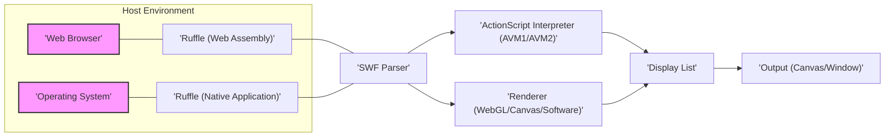
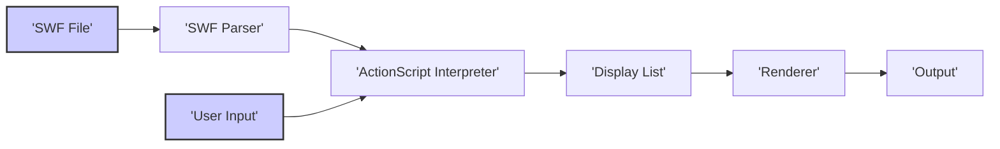

# Project Design Document: Ruffle Flash Player Emulator

**Version:** 1.1
**Date:** October 26, 2023
**Prepared By:** Gemini (AI Language Model)

## 1. Project Overview

Ruffle is an open-source Flash Player emulator implemented in Rust. Its core purpose is to enable the execution of legacy Adobe Flash content (primarily in the SWF file format) within modern environments where the original Adobe Flash Player is no longer available or supported. This includes integration into web browsers via WebAssembly and as a standalone desktop application. The project's overarching goal is the preservation of Flash content, ensuring its continued accessibility for users and archivists.

## 2. Goals and Objectives

*   **Accurate Emulation of Flash Runtimes:**  Faithfully reproduce the behavior of the Adobe Flash Player, encompassing graphics rendering, ActionScript execution (versions 1, 2, and 3), and API compatibility.
*   **Broad SWF Compatibility:** Support a wide spectrum of SWF files, including those utilizing various ActionScript versions, media formats, and advanced features.
*   **Enhanced Security Posture:** Offer a secure alternative to the deprecated Adobe Flash Player by mitigating known vulnerabilities and employing modern security practices.
*   **Optimized Performance:** Achieve acceptable and efficient performance for emulated content, ensuring a smooth user experience.
*   **Cross-Platform Functionality:** Operate seamlessly across diverse operating systems (Windows, macOS, Linux) and web browsers (Chrome, Firefox, Safari, Edge).
*   **Maintainable and Extensible Open-Source Project:** Foster a collaborative development environment with a well-structured codebase that is easy to understand, maintain, and extend by community contributors.

## 3. Target Audience

*   **End-users Seeking Flash Content Access:** Individuals who wish to play Flash games, view animations, or interact with other Flash-based content on the web or locally.
*   **Web Developers Maintaining Legacy Content:** Professionals responsible for websites containing Flash content who need a solution to ensure its continued functionality for visitors.
*   **Digital Archivists and Historians:** Individuals and institutions dedicated to preserving digital heritage, including Flash-based interactive media and applications.
*   **Software Developers and Contributors:**  Programmers interested in contributing to the development, testing, and improvement of the Ruffle emulator.

## 4. Architecture Overview

Ruffle adopts a modular architecture, promoting separation of concerns and enhancing maintainability. The core components handle distinct aspects of Flash emulation, such as parsing the SWF format, rendering graphics, and executing ActionScript code. Interactions with the host environment (web browser or operating system) are managed through specific integration layers.

*   **Host Environment:** The context in which Ruffle is executed, either a web browser providing a runtime environment for WebAssembly or an operating system for the native application.
*   **Ruffle (Web Assembly):** The version of the Ruffle core compiled into WebAssembly bytecode, designed to run within web browsers.
*   **Ruffle (Native Application):** The version of the Ruffle core compiled to native machine code for direct execution on operating systems.
*   **SWF Parser:** Responsible for the process of reading, decoding, and interpreting the binary structure of SWF files, extracting data such as sprites, shapes, sounds, scripts, and metadata.
*   **Renderer (WebGL/Canvas/Software):**  Manages the visual rendering of the Flash content. It utilizes different rendering backends: WebGL for hardware-accelerated 3D graphics in browsers, Canvas 2D for simpler 2D rendering, and a software renderer as a fallback.
*   **ActionScript Interpreter (AVM1/AVM2):** Executes the ActionScript code embedded within the SWF file. This includes two virtual machines: AVM1 for ActionScript 1 and 2, and AVM2 for ActionScript 3.
*   **Display List:** An internal, hierarchical representation of the objects to be rendered on the screen. It stores information about the position, size, transformations, and other properties of each visual element.
*   **Output (Canvas/Window):** The final rendered output, displayed either on an HTML Canvas element within a web browser or in a dedicated window for the native application.

## 5. Component Details

*   **SWF Parser:**
    *   **Functionality:** Reads the binary SWF file format, handling various versions and compression algorithms (e.g., Zlib, LZMA). It deserializes the SWF structure into internal data structures representing tags, shapes, sprites, fonts, sounds, and ActionScript bytecode.
    *   **Key Aspects:** Must be robust against malformed or potentially malicious SWF files, implementing strict validation and error handling. Needs to efficiently handle large and complex SWF files.
*   **Renderer:**
    *   **Functionality:** Takes the scene graph represented by the Display List and draws it to the output surface. It handles vector graphics rendering (using path stroking and filling), bitmap rendering, text rendering (supporting various font formats), and applies transformations and effects.
    *   **Key Aspects:**  The choice of rendering backend (WebGL, Canvas, Software) depends on the capabilities of the host environment and performance requirements. Needs to accurately implement Flash's rendering model, including blend modes, masking, and filters.
*   **ActionScript Interpreter (AVM1):**
    *   **Functionality:** Interprets and executes ActionScript 1 and 2 bytecode. It manages the execution stack, memory allocation, and garbage collection for AVM1 objects. Implements the built-in functions and objects defined in the ActionScript 1 and 2 specifications.
    *   **Key Aspects:**  Accurate emulation of AVM1's dynamic typing and prototype-based inheritance is crucial. Needs to handle security-sensitive APIs and potential exploits present in older Flash Player versions without replicating the vulnerabilities.
*   **ActionScript Interpreter (AVM2):**
    *   **Functionality:** Executes ActionScript 3 bytecode within its own virtual machine (AVM2). This involves just-in-time (JIT) compilation (or interpretation) of bytecode, management of the object heap, and garbage collection. Implements the more advanced object model, event system, and APIs of ActionScript 3.
    *   **Key Aspects:**  Performance is a key consideration for AVM2. Accurate implementation of the ECMAScript-based language and the Flash Player API is essential for compatibility with modern Flash content.
*   **Display List:**
    *   **Functionality:**  A tree-like data structure that organizes the visual elements of the Flash movie. Each node in the tree represents a display object (e.g., sprites, shapes, text fields), and stores properties like position, scale, rotation, alpha, and filters.
    *   **Key Aspects:**  The Display List is dynamically updated by the ActionScript interpreter in response to script execution and user interaction. Efficient management and traversal of the Display List are important for rendering performance.
*   **Web Integration Layer (for WebAssembly):**
    *   **Functionality:** Provides the necessary interfaces for Ruffle running in a web browser. This includes loading SWF files from URLs or local storage, managing the HTML Canvas element for rendering, handling user input events (mouse, keyboard), and interacting with browser APIs (e.g., for networking, audio).
    *   **Key Aspects:**  Security is paramount in the web environment. This layer must respect browser security policies (e.g., CORS, Content Security Policy).
*   **Native Integration Layer (for Native Application):**
    *   **Functionality:**  Provides the interfaces for Ruffle running as a standalone application. This includes window management, file system access, input event handling, and potentially access to system resources like audio and graphics drivers.
    *   **Key Aspects:**  Needs to be cross-platform, utilizing libraries like SDL2 to abstract platform-specific details.
*   **Configuration and Settings:**
    *   **Functionality:** Allows users to customize Ruffle's behavior, such as selecting the rendering backend, adjusting scaling options, and configuring debugging features.
    *   **Key Aspects:**  Configuration can be stored in files, browser local storage, or accessed through a user interface.

## 6. Data Flow

The typical flow of data within Ruffle during the execution of a SWF file follows these steps:

1. **Loading Phase:** The user initiates the loading of a SWF file, either by providing a file path (native application) or a URL (web browser). The appropriate integration layer handles the retrieval of the SWF data.
2. **Parsing Stage:** The SWF Parser receives the raw SWF data and begins the process of decoding and interpreting its structure. It extracts definitions for various elements like sprites, shapes, sounds, and ActionScript bytecode.
3. **Initialization Phase:** The ActionScript interpreter (either AVM1 or AVM2, depending on the SWF version) is initialized. It sets up the initial execution environment and creates the root display object.
4. **Execution Cycle:** The ActionScript interpreter begins executing the scripts within the SWF. This involves interpreting or JIT-compiling bytecode, managing the call stack, and manipulating objects in memory.
5. **Display List Manipulation:** As the ActionScript code executes, it interacts with the Display List, adding, removing, and modifying display objects and their properties.
6. **Rendering Pipeline:** When the scene needs to be updated (e.g., after script execution or animation), the Renderer traverses the Display List. For each visible object, it performs the necessary drawing operations using the selected rendering backend (WebGL, Canvas, or software).
7. **Output Display:** The rendered output is presented to the user, either by drawing on the HTML Canvas element in a web browser or by updating the window contents in the native application.
8. **User Interaction Handling:** User input events (mouse clicks, keyboard presses) are captured by the host environment and passed to the appropriate Ruffle integration layer. These events are then dispatched to the ActionScript interpreter for handling.
9. **Event Processing:** The ActionScript interpreter receives user events and executes the corresponding event handlers defined in the SWF. This often leads to further modifications of the Display List and triggers subsequent rendering cycles.
10. **Loop Continuation:** Steps 4 through 9 repeat, driving the interactive behavior of the Flash content until the movie ends or is unloaded.

## 7. Deployment Models

Ruffle is designed for flexible deployment across various platforms and environments:

*   **Web Browser Extension:** Packaged as a browser extension (e.g., for Chrome, Firefox). Upon installation, it intercepts requests for Flash content on web pages and replaces the default Flash Player with the Ruffle emulator, rendering the content within the browser.
*   **WebAssembly Embedding:**  Ruffle, compiled to WebAssembly, can be directly embedded into websites using JavaScript. This allows website developers to integrate Ruffle and render Flash content without requiring users to install a browser extension. The JavaScript code handles loading the WebAssembly module and managing the rendering canvas.
*   **Standalone Desktop Application:**  Distributed as a native application for Windows, macOS, and Linux. Users can open SWF files directly through the application, which provides a dedicated window for rendering and interaction. This model offers an isolated environment for running Flash content.
*   **Library for Embedding:** Ruffle can be used as a library that other applications can integrate to provide Flash playback capabilities. This is useful for projects that need to support legacy Flash content within their own applications.

## 8. Key Technologies

*   **Rust:** The primary programming language for Ruffle's core components. Rust's memory safety features, performance, and concurrency capabilities make it well-suited for building a robust emulator.
*   **WebAssembly (Wasm):** A binary instruction format for a stack-based virtual machine. It enables near-native performance for web applications and is crucial for running Ruffle within web browsers.
*   **JavaScript:** Used for web integration, including loading the WebAssembly module, interacting with the browser's Document Object Model (DOM), and handling user events.
*   **WebGL (Web Graphics Library):** A JavaScript API for rendering interactive 2D and 3D graphics within web browsers, leveraging the device's GPU for hardware acceleration. This is a primary rendering backend for Ruffle in browsers.
*   **HTML5 Canvas:** An HTML element that provides a drawing surface via JavaScript. Ruffle uses the Canvas API as an alternative rendering backend, particularly when WebGL is not available or suitable.
*   **Software Rendering:** A fallback rendering method where drawing operations are performed by the CPU instead of the GPU. This ensures that Ruffle can function even on systems with limited graphics capabilities.
*   **SDL2 (Simple DirectMedia Layer):** A cross-platform development library that provides low-level access to audio, keyboard, mouse, joystick, and graphics hardware via OpenGL and Direct3D. Used for building the native desktop application.

## 9. Security Considerations (High-Level)

*   **Sandboxing and Isolation:** Ruffle aims to isolate the execution of Flash content from the host environment to prevent malicious SWF files from accessing system resources or compromising the user's machine. The WebAssembly environment in browsers provides a degree of sandboxing. The native application employs OS-level process isolation.
*   **Memory Safety:**  Rust's ownership and borrowing system prevents common memory safety vulnerabilities like buffer overflows, use-after-free errors, and dangling pointers, which were prevalent in the original Flash Player.
*   **Input Validation and Sanitization:** The SWF parser implements strict validation to handle potentially malformed or malicious SWF files, preventing parsing errors from leading to exploitable conditions.
*   **Mitigation of Known Flash Vulnerabilities:** Ruffle's development explicitly avoids replicating known security vulnerabilities present in older versions of the Adobe Flash Player. Where applicable, safer alternatives or mitigations are implemented.
*   **Content Security Policy (CSP) Compliance:** When running in a web browser, Ruffle respects and integrates with Content Security Policy directives to further restrict the capabilities of the emulated content and prevent cross-site scripting (XSS) attacks.
*   **Regular Security Audits and Updates:** The open-source nature of Ruffle allows for community review and security audits. The project aims to address reported vulnerabilities promptly through regular updates.
*   **Limited API Exposure:** Ruffle does not necessarily implement all APIs available in the original Flash Player, especially those known to be problematic from a security perspective. This reduces the attack surface.

This document provides a more detailed design overview of the Ruffle project, suitable for informing threat modeling activities. Future iterations may delve deeper into specific component designs and security mechanisms.
