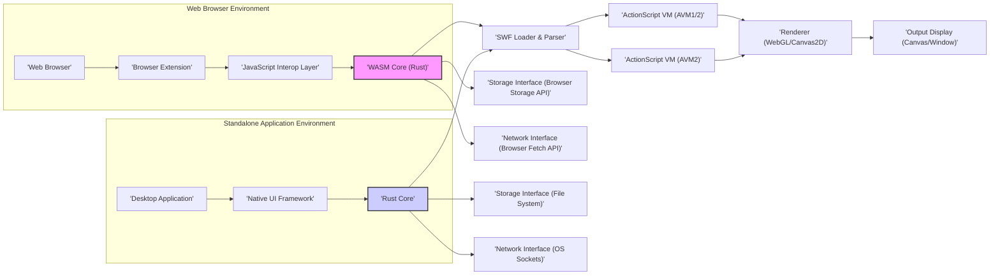
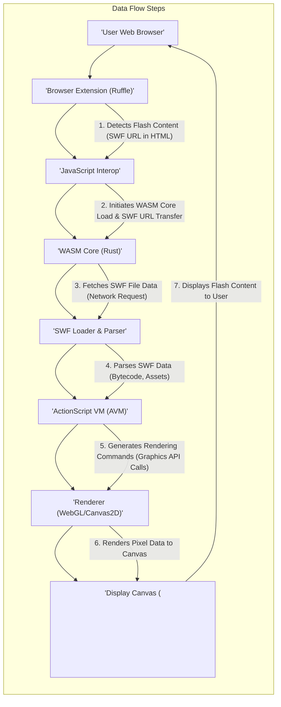

## Project Design Document: Ruffle - Flash Player Emulator

**Version:** 1.1
**Date:** October 27, 2023
**Author:** AI Expert

### 1. Project Overview

*   **Project Name:** Ruffle
*   **Project Repository:** [https://github.com/ruffle-rs/ruffle](https://github.com/ruffle-rs/ruffle)
*   **Project Goal:** To develop a secure, performant, and open-source Flash Player emulator using Rust. Ruffle aims to enable users to seamlessly experience legacy Flash content within modern web browsers and as standalone applications, eliminating the need for the discontinued Adobe Flash Player plugin. The project targets comprehensive compatibility, supporting both older ActionScript 1/2 and newer ActionScript 3 standards.
*   **Target Users:**
    *   End-users seeking access to archived or legacy Flash-based web content.
    *   Web developers and archivists responsible for maintaining or preserving Flash-dependent websites and applications.
    *   Individuals who require a local Flash player for offline SWF file playback.
    *   Educators and researchers studying or utilizing Flash content for historical or analytical purposes.
*   **Key Features:**
    *   Broad ActionScript Support: Emulation of ActionScript versions 1, 2, and 3, covering a wide range of Flash content.
    *   Extensive API Coverage: Implementation of a significant portion of the Flash API, including graphics, multimedia, interactivity, and networking functionalities.
    *   Web Browser Integration: Browser extensions designed for seamless interception and playback of Flash content within popular web browsers.
    *   Standalone Desktop Player: A dedicated desktop application for executing SWF files locally, independent of a web browser.
    *   Rust-based Core: Developed in Rust to leverage its memory safety, performance characteristics, and suitability for systems programming.
    *   Open-Source Development:  An open and community-driven project, fostering transparency, collaboration, and continuous improvement.
    *   Enhanced Security: Designed with security in mind to mitigate vulnerabilities inherent in the original Flash Player and provide a safer execution environment.

### 2. System Architecture

Ruffle employs a modular architecture that separates the core emulation logic from platform-specific front-ends. This design promotes code reusability and cross-platform compatibility. The core emulation engine, written in Rust, is compiled to WebAssembly (WASM) for web browser environments and linked directly into native applications for desktop platforms.

*   **Components:**
    *   **"Browser Extension"**:  A browser-specific extension (available for Chrome, Firefox, Safari, and potentially others) acting as the entry point for Ruffle in web browsers. It detects Flash content on web pages and orchestrates its replacement with the Ruffle player.
    *   **"JavaScript Interop Layer"**: JavaScript code residing within the browser extension. This layer facilitates communication between the browser environment and the WASM core. It manages WASM module loading, data exchange, event handling, and rendering context setup.
    *   **"WASM Core (Rust)"**: The heart of Ruffle for web-based usage. It's the core emulation engine, written in Rust and compiled to WebAssembly. It encompasses SWF parsing, ActionScript virtual machines, rendering logic, and browser-specific interfaces.
    *   **"Desktop Application"**: A standalone application providing a native user interface for playing SWF files outside of a web browser. It directly embeds the "Rust Core".
    *   **"Native UI Framework"**: Platform-dependent UI components used by the desktop application. These handle window management, user input, file selection, and application lifecycle events. Examples include GTK, Qt, or platform-native APIs.
    *   **"Rust Core"**: The foundational emulation engine written in Rust. Shared by both the WASM core and the desktop application, it contains core functionalities like SWF loading, ActionScript VMs, rendering pipelines, and abstract interfaces for storage and networking.
    *   **"SWF Loader & Parser"**: Responsible for reading and interpreting SWF files. It decodes the SWF file format, extracts bytecode instructions, embedded assets (images, sounds, fonts), and metadata necessary for emulation.
    *   **"ActionScript VM (AVM1/2)"**:  Virtual machines dedicated to executing ActionScript 1 and 2 bytecode. These VMs interpret the instruction sets of older ActionScript versions, managing runtime environments, object models, and API implementations.
    *   **"ActionScript VM (AVM2)"**: Virtual machine designed to execute ActionScript 3 bytecode. This VM handles the more complex and modern ActionScript 3 language, including its advanced object model, event system, and features.
    *   **"Renderer (WebGL/Canvas2D)"**:  The rendering engine responsible for translating graphical commands from the ActionScript VMs into visual output. It utilizes WebGL for hardware-accelerated rendering and Canvas2D as a software-based fallback, ensuring broad compatibility across different hardware and browser capabilities.
    *   **"Output Display (Canvas/Window)"**: The visual surface where rendered Flash content is presented. In browsers, this is typically a `<canvas>` element. In the desktop application, it's the application window.
    *   **"Storage Interface (Browser Storage API)"**: In the browser environment, this interface provides access to browser-provided storage mechanisms like LocalStorage, IndexedDB, or cookies, allowing Flash content to persist data.
    *   **"Network Interface (Browser Fetch API)"**:  In the browser environment, this interface leverages browser APIs like the Fetch API to handle network requests initiated by Flash content, respecting browser security policies and CORS restrictions.
    *   **"Storage Interface (File System)"**: In the desktop application, this interface provides access to the local file system, enabling Flash content to read and write files, subject to application permissions and security considerations.
    *   **"Network Interface (OS Sockets)"**: In the desktop application, this interface utilizes operating system-level socket APIs to handle network communication initiated by Flash content, allowing for more direct network access compared to the browser environment.

### 3. Component Details

#### 3.1. Browser Extension

*   **Functionality:**
    *   **Flash Content Detection:** Scans web pages for instances of embedded Flash content, identifying `<embed>`, `<object>` tags, and links to SWF files based on MIME types and file extensions.
    *   **Content Interception & Replacement:**  Intercepts requests for Flash content and dynamically replaces or overlays the original Flash elements with the Ruffle player, ensuring seamless integration.
    *   **WASM Core Management:** Loads, initializes, and manages the lifecycle of the Ruffle WASM core within the browser environment.
    *   **User Settings & Preferences:** Provides a user interface within the browser for configuring Ruffle's behavior, such as enabling/disabling Ruffle, setting default zoom levels, and managing content blocking/allowing lists.
    *   **Communication Bridge:** Establishes and manages communication channels with the "JavaScript Interop Layer" for data exchange and control signals.
*   **Data Handled:**
    *   SWF URLs and content locations extracted from web pages.
    *   User configuration settings and preferences.
    *   Messages exchanged with the "JavaScript Interop Layer", including SWF data, rendering commands, and user input events.
    *   Potentially, website URLs and user browsing history for content detection and filtering (subject to privacy considerations).
*   **Security Considerations:**
    *   **XSS Vulnerabilities:**  Susceptible to Cross-Site Scripting (XSS) attacks if extension code is compromised or improperly handles untrusted web page content. Input sanitization and secure coding practices are crucial.
    *   **Browser API Security:**  Must adhere strictly to browser extension security policies and permission models to prevent unauthorized access to sensitive browser APIs or user data.
    *   **Data Leakage:**  Risk of unintentionally leaking sensitive user data or browsing information if not handled carefully. Minimize data collection and ensure secure data handling practices.
    *   **CSP Compliance:**  Must respect and not bypass Content Security Policy (CSP) directives enforced by websites. Ensure compatibility and avoid weakening website security.
    *   **Update Security:** Secure update mechanism is essential to prevent malicious updates from compromising user security.

#### 3.2. JavaScript Interop Layer

*   **Functionality:**
    *   **WASM Module Loading & Initialization:**  Loads the Ruffle WASM module into the browser's JavaScript environment and initializes it, setting up the necessary runtime context.
    *   **API Bridging:**  Provides a JavaScript API that acts as a bridge for communication between the "Browser Extension" and the "WASM Core". This API facilitates function calls, data passing, and event routing.
    *   **Rendering Canvas Management:** Creates and manages the `<canvas>` element used for rendering Flash content. Sets up the rendering context (2D or WebGL) and handles canvas resizing and visibility.
    *   **Event Handling & Input Routing:** Captures user input events (mouse clicks, keyboard presses, etc.) within the canvas and routes them to the "WASM Core" for processing by the ActionScript VMs.
    *   **Data Marshaling:**  Handles the conversion and transfer of data between JavaScript data types and WASM memory spaces. This includes marshaling SWF data, rendering commands, and event data.
*   **Data Handled:**
    *   SWF file data received from the "Browser Extension" and passed to the "WASM Core".
    *   Rendering commands and data received from the "WASM Core" to update the rendering canvas.
    *   User input events (mouse, keyboard, touch) captured from the browser and forwarded to the "WASM Core".
    *   Control messages and status updates exchanged between the extension and the WASM core.
*   **Security Considerations:**
    *   **Bridge Vulnerabilities:**  Acts as a critical bridge between the potentially less secure web environment and the more controlled WASM environment. Vulnerabilities in this layer could compromise the security of the entire Ruffle system.
    *   **Data Marshaling Security:**  Insecure data marshaling could lead to buffer overflows, memory corruption, or other memory safety issues when interacting with WASM. Implement robust and safe marshaling techniques.
    *   **API Security:**  The JavaScript API exposed to the extension must be carefully designed to prevent misuse or exploitation. Limit API surface area and enforce strict input validation.
    *   **Permissions Management:**  Carefully manage permissions and access to browser APIs. Avoid granting excessive privileges to the JavaScript interop layer.
    *   **Injection Attacks:**  Guard against injection attacks (e.g., JavaScript injection) that could exploit vulnerabilities in the interop layer to execute malicious code.

#### 3.3. WASM Core (Rust)

*   **Functionality:**
    *   **Core Emulation Logic:**  Encapsulates the primary emulation logic of Ruffle, including SWF parsing, ActionScript VM execution, rendering pipeline, and core API implementations.
    *   **SWF Processing:**  Receives SWF file data, utilizes the "SWF Loader & Parser" to process it, and prepares it for execution by the ActionScript VMs.
    *   **ActionScript Execution:**  Instantiates and manages "ActionScript VM (AVM1/2)" and "ActionScript VM (AVM2)" instances to execute ActionScript bytecode extracted from SWF files.
    *   **Rendering Management:**  Orchestrates the rendering process, feeding rendering commands generated by the ActionScript VMs to the "Renderer (WebGL/Canvas2D)".
    *   **Interface Abstraction:** Provides abstract interfaces for storage and network access, allowing platform-specific implementations to be plugged in (e.g., "Storage Interface (Browser Storage API)" for browsers).
    *   **Resource Management:**  Manages memory allocation, CPU usage, and other resources to ensure stable and performant emulation, preventing resource exhaustion by malicious content.
*   **Data Handled:**
    *   SWF file bytecode and embedded assets.
    *   ActionScript runtime state, including variables, objects, and execution context.
    *   Rendering data (geometry, textures, colors) generated by ActionScript execution.
    *   Data exchanged with storage and network interfaces.
    *   Internal state related to emulation progress and resource usage.
*   **Security Considerations:**
    *   **Primary Attack Surface:**  Represents the primary attack surface due to the complexity of Flash emulation and ActionScript execution. Vulnerabilities here are most likely to have severe consequences.
    *   **VM Vulnerabilities:**  Bugs in the "ActionScript VM (AVM1/2)" or "ActionScript VM (AVM2)" implementations could lead to arbitrary code execution, memory corruption, or sandbox escapes if malicious SWF files are processed. Rigorous testing and security audits are essential.
    *   **SWF Loader Exploits:**  Vulnerabilities in the "SWF Loader & Parser" could be exploited to trigger buffer overflows, format string bugs, or other parsing-related issues. Implement robust parsing and input validation.
    *   **Memory Safety Criticality:**  Memory safety is paramount. Rust's memory safety features mitigate many common vulnerabilities, but logic errors and unsafe code blocks must be carefully scrutinized.
    *   **Sandbox Security:**  Must effectively sandbox untrusted SWF files to prevent them from escaping the emulation environment and accessing host system resources or sensitive data.
    *   **Resource Exhaustion Attacks:**  Implement resource limits and monitoring to prevent denial-of-service attacks caused by malicious SWF files consuming excessive CPU, memory, or network bandwidth.

#### 3.4. Desktop Application

*   **Functionality:**
    *   **SWF File Loading & Playback:**  Provides a user-friendly interface for loading and playing local SWF files. Supports drag-and-drop, file selection dialogs, and potentially file association.
    *   **Native UI & User Interaction:**  Offers a native desktop application UI with standard window controls, menus, and playback controls (play, pause, stop, fullscreen, zoom).
    *   **Configuration & Settings:**  Allows users to configure application settings, such as default renderer (WebGL/Canvas2D), zoom level, and potentially advanced emulation options.
    *   **File System Integration:**  Provides access to the local file system for loading SWF files and potentially for Flash content to interact with local storage (via "Storage Interface (File System)").
    *   **Application Lifecycle Management:**  Handles application startup, shutdown, window management, and user input events within the desktop environment.
*   **Data Handled:**
    *   Local SWF files loaded by the user from the file system.
    *   Application configuration settings and user preferences.
    *   Data related to window state, UI elements, and user interactions.
    *   Potentially, temporary files created during SWF processing or caching.
*   **Security Considerations:**
    *   **Local File Handling Security:**  Needs to handle local SWF files securely, as users might load untrusted files. Vulnerabilities in file loading or processing could be exploited.
    *   **Native UI Vulnerabilities:**  Vulnerabilities in the native UI framework or custom UI code could be exploited for local privilege escalation or other attacks.
    *   **File System Access Control:**  Control access to the file system to prevent malicious SWF content from accessing or modifying sensitive files outside of its intended scope.
    *   **Application Update Security:**  Secure application update mechanism is crucial to deliver security patches and bug fixes without introducing new vulnerabilities.
    *   **Process Isolation:** Consider process isolation techniques to sandbox the emulation core and limit the impact of potential vulnerabilities.

#### 3.5. ActionScript VM (AVM1/2 & AVM2)

*   **Functionality:**
    *   **Bytecode Interpretation:**  Interprets and executes ActionScript bytecode instructions from SWF files.
    *   **Runtime Environment Management:**  Manages the ActionScript runtime environment, including object creation, variable scope, function calls, and garbage collection.
    *   **API Implementation:**  Implements a wide range of Flash APIs and built-in functions, providing functionality for graphics, multimedia, interactivity, networking, and more.
    *   **Event Handling:**  Manages the ActionScript event system, dispatching events and executing event handlers.
    *   **Security Sandbox Enforcement:**  Enforces security sandbox restrictions to limit the capabilities of Flash content and prevent unauthorized actions.
*   **Data Handled:**
    *   ActionScript bytecode instructions being executed.
    *   ActionScript variables, object properties, and runtime data.
    *   Function call stacks and execution context.
    *   Data passed to and returned from Flash API calls.
    *   Event data and event handler execution context.
*   **Security Considerations:**
    *   **High Complexity & Vulnerability Prone:**  Extremely complex components and historically the source of numerous security vulnerabilities in Flash Player. Bugs in VM implementation are highly likely to have security implications.
    *   **Arbitrary Code Execution Risk:**  Vulnerabilities in bytecode interpretation or API implementation could lead to arbitrary code execution if malicious ActionScript bytecode is crafted to exploit them.
    *   **Memory Corruption Vulnerabilities:**  Bugs like buffer overflows, use-after-free, and type confusion in the VMs could lead to memory corruption and exploitable conditions.
    *   **Sandbox Escape Vulnerabilities:**  Vulnerabilities that allow malicious ActionScript to bypass sandbox restrictions and gain access to restricted resources or functionalities are critical security concerns.
    *   **Integer Overflows & Type Confusion:**  Integer overflows and type confusion errors in ActionScript operations or API implementations can be exploited to bypass security checks or cause unexpected behavior.
    *   **API Misuse & Abuse:**  Improper implementation or validation of Flash APIs could allow malicious content to misuse APIs for unintended purposes or bypass security restrictions.

#### 3.6. Renderer (WebGL/Canvas2D)

*   **Functionality:**
    *   **Rendering Command Processing:**  Receives rendering commands (draw calls, transformations, etc.) from the ActionScript VMs.
    *   **WebGL Rendering:**  Utilizes WebGL API for hardware-accelerated 2D and 3D graphics rendering when available and supported.
    *   **Canvas2D Rendering:**  Falls back to Canvas2D API for software-based 2D rendering, ensuring compatibility in environments without WebGL support.
    *   **Graphics Primitives Rendering:**  Handles rendering of various graphics primitives, including sprites, vector shapes, text, bitmaps, and video.
    *   **Texture & Asset Management:**  Manages loading, caching, and utilization of textures and other graphical assets used in rendering.
*   **Data Handled:**
    *   Rendering commands (draw calls, geometry data, texture coordinates, colors, etc.).
    *   Texture data and graphical assets (images, fonts, etc.).
    *   Viewport and display parameters (resolution, scaling, etc.).
    *   Rendering state (transformation matrices, blend modes, etc.).
*   **Security Considerations:**
    *   **Denial of Service (DoS):**  Resource exhaustion through excessive rendering commands or large textures could lead to denial-of-service. Implement resource limits and safeguards.
    *   **WebGL Vulnerabilities (Indirect):**  While less direct, vulnerabilities in the underlying WebGL implementation (browser or graphics drivers) could potentially be exploited indirectly through Ruffle's rendering pipeline. Keep up-to-date with browser security advisories.
    *   **Visual Glitches & Rendering Errors:**  Bugs in the renderer could cause visual glitches, rendering errors, or crashes, although these are typically less severe security risks.
    *   **Shader Vulnerabilities (WebGL):**  If custom shaders are used (though less likely in 2D Flash emulation), shader vulnerabilities could potentially be exploited.
    *   **Data Validation:**  Validate rendering commands and data to prevent unexpected behavior or crashes due to malformed or malicious input.

#### 3.7. Storage Interface (Browser Storage API & File System)

*   **Functionality:**
    *   **Local Storage Access:**  Provides an interface for ActionScript code to interact with local storage mechanisms.
    *   **Flash Local Shared Objects (LSOs) Emulation:**  Implements emulation of Flash Local Shared Objects (LSOs) for persistent data storage.
    *   **Browser Storage API Integration (Browser):** In browser environments, utilizes browser storage APIs like LocalStorage, IndexedDB, or cookies to store LSOs and other data.
    *   **File System Access (Desktop):** In desktop applications, provides access to the local file system for LSO storage and potentially for broader file system interactions (with appropriate security restrictions).
    *   **Data Serialization & Deserialization:**  Handles serialization and deserialization of data stored in LSOs.
*   **Data Handled:**
    *   Data read from and written to local storage by Flash content.
    *   Storage keys and values for LSOs.
    *   File paths and file system operations (desktop application).
    *   Serialized LSO data.
*   **Security Considerations:**
    *   **Storage Access Control:**  Strictly control access to local storage to prevent malicious Flash content from accessing or modifying sensitive data outside of its intended scope or origin. Enforce origin-based restrictions in browsers.
    *   **Data Confidentiality & Integrity:**  Data stored in LSOs should be treated as potentially untrusted. Consider encryption or other security measures if sensitive data is stored.
    *   **Storage Quotas & Limits:**  Enforce storage quotas and limits to prevent denial-of-service attacks by malicious content filling up user storage space.
    *   **File System Security (Desktop):**  In desktop applications, file system access must be carefully managed to prevent unauthorized file access, modification, or deletion. Implement sandboxing and permission controls.
    *   **LSO Vulnerabilities:**  Vulnerabilities in LSO implementation or handling could be exploited to bypass security restrictions or corrupt stored data.

#### 3.8. Network Interface (Browser Fetch API & OS Sockets)

*   **Functionality:**
    *   **Network Request Handling:**  Handles network requests initiated by ActionScript code using APIs like `URLLoader`, `XMLHTTPRequest`, and sockets.
    *   **HTTP Request Support:**  Supports HTTP and HTTPS requests, including GET, POST, and other methods.
    *   **Socket Connection Support:**  Provides support for socket connections (TCP/IP) for real-time communication.
    *   **Browser Fetch API Integration (Browser):** In browser environments, leverages the browser's Fetch API for network requests, respecting browser security policies (CORS, SOP).
    *   **OS Socket API Integration (Desktop):** In desktop applications, utilizes operating system-level socket APIs for network communication, allowing for more direct socket access.
    *   **Proxy & TLS/SSL Support:**  Handles proxy configurations and TLS/SSL encryption for secure network communication.
*   **Data Handled:**
    *   Network request URLs, headers, and parameters.
    *   Request and response bodies (data transmitted over the network).
    *   Socket data streams (raw network data).
    *   Proxy configurations and TLS/SSL certificates.
*   **Security Considerations:**
    *   **Network Access Control & Same-Origin Policy (SOP):**  Strictly enforce Same-Origin Policy (SOP) and other browser security restrictions on network requests in browser environments. Prevent cross-origin requests unless explicitly permitted by CORS.
    *   **Server-Side Request Forgery (SSRF) Prevention:**  Prevent Flash content from making requests to internal networks, localhost, or sensitive resources that it should not have access to. Implement URL filtering and validation.
    *   **Data Exfiltration Prevention:**  Guard against malicious Flash content attempting to exfiltrate sensitive data over the network to attacker-controlled servers.
    *   **Untrusted Network Response Handling:**  Handle untrusted network responses safely to prevent injection vulnerabilities (e.g., HTML injection, script injection) if Flash content processes or displays network data.
    *   **Socket Security:**  Secure socket connections to prevent man-in-the-middle attacks and ensure data confidentiality and integrity. Implement TLS/SSL for encrypted socket communication.
    *   **Protocol Vulnerabilities:**  Be aware of potential vulnerabilities in network protocols (HTTP, TCP/IP) and implement mitigations.

### 4. Data Flow

The following data flow diagram illustrates the process of loading and playing a SWF file in a web browser using Ruffle, highlighting the key components and data exchanges involved.

*   **Data Flow Steps (Detailed):**
    1.  **"Detects Flash Content (SWF URL in HTML)"**: The "Browser Extension (Ruffle)" actively scans the HTML Document Object Model (DOM) of web pages, looking for HTML elements that typically embed Flash content, such as `<embed>`, `<object>`, or `<a>` tags with links to `.swf` files. Upon detection, it extracts the URL pointing to the SWF file.
    2.  **"Initiates WASM Core Load & SWF URL Transfer"**: The "Browser Extension" communicates with the "JavaScript Interop" layer. If the "WASM Core (Rust)" is not already loaded and initialized, the extension instructs the interop layer to load and initialize it. Subsequently, the SWF file URL is passed from the extension to the "WASM Core" via the interop layer.
    3.  **"Fetches SWF File Data (Network Request)"**: The "WASM Core", upon receiving the SWF URL, utilizes the "Network Interface (Browser Fetch API)" to initiate a network request (typically an HTTP GET request) to fetch the SWF file data from the specified URL. The browser's network stack handles the actual network communication.
    4.  **"Parses SWF Data (Bytecode, Assets)"**: Once the SWF file data is downloaded, it is passed to the "SWF Loader & Parser" component within the "WASM Core". This component parses the binary SWF file format, extracting critical information such as ActionScript bytecode, embedded assets (images, sounds, fonts, etc.), metadata, and frame data.
    5.  **"Generates Rendering Commands (Graphics API Calls)"**: The parsed SWF data is then processed by the "ActionScript VM (AVM)" (either AVM1/2 or AVM2 depending on the SWF version). The VM executes the ActionScript bytecode, interpreting instructions and managing the Flash application's logic. During execution, the VM generates rendering commands, which are essentially instructions for drawing graphics (e.g., draw a sprite, fill a shape, set color). These commands are directed towards the "Renderer (WebGL/Canvas2D)".
    6.  **"Renders Pixel Data to Canvas"**: The "Renderer (WebGL/Canvas2D)" receives the rendering commands from the "ActionScript VM". It translates these abstract commands into concrete pixel data using either WebGL (for hardware-accelerated rendering) or Canvas2D (for software rendering). The renderer manipulates the rendering context of the "Display Canvas (<canvas>)" element, writing pixel data to it.
    7.  **"Displays Flash Content to User"**: The "Display Canvas (<canvas>)" element, now containing the rendered pixel data representing the Flash content, is displayed within the "User Web Browser". The browser handles the final display and compositing of the canvas within the webpage, making the Flash content visually accessible to the user.

Throughout this process, the "ActionScript VM" may also interact with the "Storage Interface (Browser Storage API)" and "Network Interface (Browser Fetch API)" to perform storage operations (e.g., saving game progress using LSOs) or initiate further network requests as dictated by the Flash content's ActionScript code.

### 5. Security Considerations (Detailed and Expanded)

*   **ActionScript VM Vulnerabilities (Expanded):**
    *   **Just-In-Time (JIT) Compilation Bugs (AVM2):** If JIT compilation is employed in AVM2 for performance optimization, bugs in the JIT compiler could introduce exploitable vulnerabilities, leading to arbitrary code execution.
    *   **Type Confusion & Memory Corruption:**  ActionScript's dynamic typing and complex object model can create opportunities for type confusion vulnerabilities. Improper type handling in the VM could lead to memory corruption, use-after-free, or other memory safety issues.
    *   **API Implementation Flaws:**  Bugs in the implementation of Flash APIs (especially complex or security-sensitive APIs) could be exploited to bypass security checks, gain unauthorized access, or cause unexpected behavior.
    *   **Integer Overflows & Arithmetic Errors:**  Integer overflows or other arithmetic errors in ActionScript operations or API implementations could lead to unexpected behavior, buffer overflows, or other vulnerabilities.
    *   **Sandbox Escape Mechanisms:**  Attackers may attempt to find vulnerabilities that allow them to escape the ActionScript sandbox and gain access to host system resources or browser functionalities beyond the intended restrictions.

*   **SWF Loader Vulnerabilities (Expanded):**
    *   **Parsing Complexity Exploits:** The SWF file format's complexity and historical evolution make it prone to parsing vulnerabilities. Attackers may craft malformed SWF files to exploit parsing bugs.
    *   **Buffer Overflows in Parsing:**  Improper bounds checking during SWF parsing could lead to buffer overflows when processing oversized or specially crafted data fields within the SWF file.
    *   **Format String Bugs:**  If format string vulnerabilities exist in the SWF loader (less likely in Rust, but still a consideration), they could be exploited to leak memory or potentially execute arbitrary code.
    *   **Resource Exhaustion during Parsing:**  Malicious SWF files could be designed to trigger excessive resource consumption (CPU, memory) during parsing, leading to denial-of-service.
    *   **Decompression Vulnerabilities:** SWF files can be compressed using various algorithms (e.g., Zlib). Vulnerabilities in decompression libraries or their integration could be exploited.

*   **Browser Extension Security (Expanded):**
    *   **Content Script Injection Vulnerabilities:**  If the browser extension's content scripts are not carefully written, they could be vulnerable to injection attacks, allowing malicious websites to inject code into the extension's context.
    *   **Message Handling Vulnerabilities:**  Improper handling of messages between the extension's background script and content scripts could create vulnerabilities if messages are not validated or sanitized.
    *   **Storage of Sensitive Data in Extension Storage:**  Storing sensitive user data (e.g., API keys, user credentials) in browser extension storage (LocalStorage, etc.) without proper encryption could lead to data leakage if the extension is compromised.
    *   **Cross-Site Scripting (XSS) in Extension UI:**  If the extension has a user interface (popup, options page), vulnerabilities in the UI code could lead to XSS attacks if user input or data from untrusted sources is not properly sanitized.
    *   **Permissions Creep:**  Over time, extensions may request additional permissions. Regularly review and minimize the permissions requested by the Ruffle browser extension to reduce the attack surface.

*   **WASM Core Security (Expanded):**
    *   **Logic Errors in Rust Code:**  While Rust provides memory safety, logic errors and algorithmic vulnerabilities can still exist in the Rust code of the WASM core. Thorough code reviews and testing are crucial.
    *   **Unsafe Rust Code:**  Use of `unsafe` Rust blocks bypasses Rust's memory safety guarantees. `unsafe` code must be carefully audited and minimized to prevent memory safety vulnerabilities.
    *   **Dependencies Security:**  Third-party Rust crates (dependencies) used by the WASM core could contain vulnerabilities. Regularly audit and update dependencies to address known security issues.
    *   **Build Chain Security:**  Ensure the security of the build chain used to compile Rust code to WASM. Compromised build tools could inject malicious code into the WASM module.
    *   **Side-Channel Attacks:**  Consider potential side-channel attacks (e.g., timing attacks, cache attacks) if sensitive data or cryptographic operations are performed within the WASM core.

*   **Interaction with Browser Security Model (Expanded):**
    *   **CORS Bypass Attempts:**  Malicious Flash content might attempt to bypass Cross-Origin Resource Sharing (CORS) restrictions to access resources from other origins without proper authorization. Ruffle must strictly enforce CORS.
    *   **Content Security Policy (CSP) Evasion:**  Ensure Ruffle does not inadvertently weaken or bypass Content Security Policy (CSP) directives set by websites. Ruffle should respect and integrate with CSP.
    *   **Permissions API Misuse:**  If Ruffle utilizes browser permissions APIs (e.g., Geolocation, Notifications), ensure these APIs are used securely and do not grant excessive privileges to Flash content.
    *   **Subframe Security:**  When embedding Ruffle in iframes, consider the security implications of iframe sandboxing and cross-document communication.
    *   **Navigation & URL Handling Security:**  Securely handle navigation requests and URL manipulations initiated by Flash content to prevent open redirects or other URL-based vulnerabilities.

*   **Resource Management (Expanded):**
    *   **CPU Exhaustion:**  Malicious SWF files could contain computationally intensive ActionScript code designed to consume excessive CPU resources, leading to browser or application slowdown or crashes. Implement CPU usage limits or throttling mechanisms.
    *   **Memory Exhaustion:**  SWF files could attempt to allocate large amounts of memory, leading to memory exhaustion and crashes. Implement memory limits and garbage collection mechanisms.
    *   **Network Bandwidth Exhaustion:**  Malicious content could initiate excessive network requests, consuming network bandwidth and potentially causing denial-of-service. Implement network request limits and rate limiting.
    *   **Graphics Resource Exhaustion:**  SWF files could generate a large number of rendering commands or load massive textures, exhausting graphics resources and causing rendering slowdowns or crashes. Implement limits on rendering complexity and texture sizes.
    *   **Infinite Loops & Script Hangs:**  ActionScript code could contain infinite loops or other logic that causes scripts to hang indefinitely, freezing the browser or application. Implement script execution timeouts and watchdog mechanisms.

*   **Data Handling and Privacy (Expanded):**
    *   **Data Minimization:**  Minimize the collection and storage of user data by Ruffle. Only collect data that is strictly necessary for functionality and security.
    *   **Data Privacy Compliance:**  Comply with relevant data privacy regulations (e.g., GDPR, CCPA) regarding the collection, storage, and processing of user data.
    *   **Secure Data Storage:**  If user data or sensitive Flash content data is stored, ensure it is stored securely using encryption and access controls.
    *   **Transparency & User Control:**  Be transparent with users about what data Ruffle collects and how it is used. Provide users with control over their data and privacy settings.
    *   **Third-Party Data Sharing:**  Avoid sharing user data with third parties unless absolutely necessary and with user consent.

*   **Update Mechanism (Expanded):**
    *   **Secure Update Channel:**  Use a secure update channel (e.g., HTTPS) to distribute updates for the browser extension and desktop application. Prevent man-in-the-middle attacks during updates.
    *   **Code Signing & Verification:**  Sign code updates cryptographically to ensure authenticity and integrity. Verify signatures before applying updates to prevent malicious updates.
    *   **Automatic Updates (with User Control):**  Implement automatic updates to ensure users are running the latest version with security patches. Provide users with options to control update behavior (e.g., disable automatic updates, choose update schedule).
    *   **Rollback Mechanism:**  In case of problematic updates, provide a mechanism to rollback to a previous version.
    *   **Update Notifications & Changelogs:**  Notify users about updates and provide changelogs detailing security fixes and new features.

### 6. Deployment Architecture (No Changes)

*   **Web Browser Extension:**
    *   Distributed through browser extension stores (Chrome Web Store, Firefox Add-ons, Safari Extension Gallery, etc.).
    *   Users install the extension in their browser.
    *   Extension automatically intercepts and replaces Flash content on web pages with Ruffle.
    *   WASM core is loaded and executed within the browser's JavaScript environment.
*   **Web Page Embedding (WASM):**
    *   Web developers can embed the Ruffle WASM core directly into their web pages using JavaScript.
    *   Allows for more controlled integration of Ruffle on specific websites.
    *   Requires developers to handle SWF loading and Ruffle initialization in their JavaScript code.
*   **Standalone Desktop Application:**
    *   Distributed as platform-specific executables (Windows, macOS, Linux).
    *   Users download and install the application.
    *   Application provides a native UI for loading and playing local SWF files.
    *   Rust core is embedded directly within the application.

### 7. Technology Stack (No Changes)

*   **Programming Languages:**
    *   **Rust:** Primarily used for the core emulation engine (WASM Core and Rust Core). Chosen for its memory safety, performance, and cross-platform capabilities.
    *   **JavaScript/TypeScript:** Used for the Browser Extension and JavaScript Interop layer.
*   **Web Technologies:**
    *   **WebAssembly (WASM):** Compilation target for the core emulation engine for web browser deployment.
    *   **WebGL:** Used for hardware-accelerated 2D and 3D rendering.
    *   **Canvas2D:** Used for software-based 2D rendering as a fallback or for simpler graphics.
    *   **HTML5 APIs:** Used for browser integration, storage (LocalStorage, IndexedDB), network requests (Fetch API), and other browser functionalities.
*   **Desktop Technologies (for Standalone Application):**
    *   **Native UI Frameworks:** Platform-specific UI frameworks (e.g., GTK, Qt, Cocoa, Win32 API) are likely used for the desktop application UI. The specific framework may vary depending on the target platform.
    *   **Operating System APIs:** Used for file system access, window management, and other OS-level functionalities.
*   **Build and Packaging:**
    *   **Cargo:** Rust's build system and package manager.
    *   **Wasm-pack:** Tool for building Rust code to WebAssembly and creating JavaScript bindings.
    *   Platform-specific packaging tools for browser extensions and desktop applications.

### 8. Glossary (No Changes)

*   **SWF (Small Web Format):** The file format for Adobe Flash content. Contains bytecode, assets, and metadata for Flash applications and animations.
*   **ActionScript:** The scripting language used in Adobe Flash. Ruffle aims to support ActionScript 1, 2, and 3.
*   **AVM1 (ActionScript Virtual Machine 1):** The virtual machine that executes ActionScript 1 and 2 bytecode in older Flash Players.
*   **AVM2 (ActionScript Virtual Machine 2):** The virtual machine that executes ActionScript 3 bytecode in newer Flash Players. More complex and feature-rich than AVM1.
*   **WASM (WebAssembly):** A binary instruction format for a stack-based virtual machine. Designed for high-performance execution in web browsers.
*   **CSP (Content Security Policy):** A browser security mechanism that helps prevent XSS attacks by controlling the resources the browser is allowed to load for a given web page.
*   **SOP (Same-Origin Policy):** A fundamental browser security mechanism that restricts how a document or script loaded from one origin can interact with resources from a different origin.
*   **LSO (Local Shared Object):** A Flash Player feature that allows Flash content to store data locally on a user's computer, similar to browser cookies.

This improved document provides a more detailed and comprehensive design overview of the Ruffle project, with expanded sections on component details, data flow, and especially security considerations. The added depth and clarity will enhance its utility for threat modeling and security analysis.