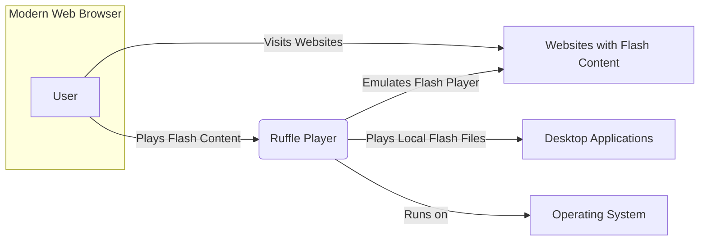
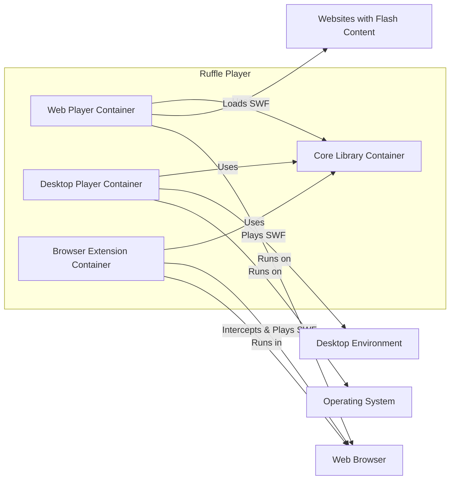
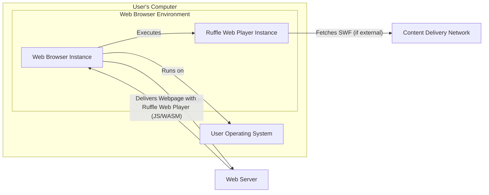

# BUSINESS POSTURE

Ruffle is an open-source Flash Player emulator. Its primary business priority is to preserve Flash content and ensure it remains accessible in modern web browsers and operating systems now that Adobe Flash Player is no longer supported.

- Business Goals:
  - Preserve legacy Flash content.
  - Provide a secure and open-source alternative to Adobe Flash Player.
  - Enable users to access Flash content on modern platforms without security risks associated with outdated Flash Player.
  - Support content creators and archives in keeping Flash content alive.

- Business Risks:
  - Compatibility issues with complex or obscure Flash content.
  - Performance limitations compared to the original Flash Player.
  - Potential security vulnerabilities in the emulator itself.
  - Lack of widespread adoption or user awareness.
  - Dependence on volunteer contributors and sustainability of the open-source project.

# SECURITY POSTURE

- Security Controls:
  - security control: Open-source project with public code repository (GitHub). This allows for community review and contribution to security. Implemented in: GitHub repository.
  - security control: Use of Rust programming language. Rust's memory safety features reduce the risk of common vulnerabilities like buffer overflows. Implemented in: Project codebase.
  - security control: Regular code reviews by project maintainers. Implemented in: Project development process.
  - security control: Issue tracking system (GitHub Issues) for reporting and addressing bugs and potential security vulnerabilities. Implemented in: GitHub repository.
  - security control: Community contributions and peer review. Implemented in: Open-source development model.

- Accepted Risks:
  - accepted risk: Potential for undiscovered vulnerabilities in the emulator code. Mitigation: Open-source nature, code reviews, and community scrutiny.
  - accepted risk: Risk of compatibility issues leading to unexpected behavior or security edge cases. Mitigation: Continuous testing and community feedback.
  - accepted risk: Reliance on volunteer effort for security maintenance and updates. Mitigation: Active project maintainers and community engagement.

- Recommended Security Controls:
  - security control: Implement automated security scanning tools (SAST/DAST) in the CI/CD pipeline to detect potential vulnerabilities early in the development process.
  - security control: Establish a clear vulnerability disclosure policy and process to handle security reports effectively.
  - security control: Conduct regular security audits or penetration testing by external security experts.
  - security control: Implement dependency scanning and management to ensure third-party libraries are up-to-date and free from known vulnerabilities.
  - security control: Consider fuzzing to discover unexpected inputs that might lead to crashes or vulnerabilities.

- Security Requirements:
  - Authentication: Not applicable. Ruffle is a player, not a service requiring user authentication.
  - Authorization: Not applicable. Ruffle's primary function is to play content, not to control access to resources. However, browser integration might involve browser's permission model.
  - Input Validation: Critical. Ruffle must rigorously validate and sanitize all input data from Flash content (SWF files) to prevent vulnerabilities like cross-site scripting (XSS), buffer overflows, and other injection attacks. Input validation should be applied at every stage of parsing and processing SWF data.
  - Cryptography: Relevant for handling encrypted Flash content (if supported) and for secure communication if Ruffle interacts with external services (though currently it primarily operates locally). If network communication is added, ensure TLS/HTTPS is used. For SWF content, handle any cryptographic operations securely, avoiding weak algorithms or insecure implementations.

# DESIGN

## C4 CONTEXT



- Elements of Context Diagram:
  - - Name: User
    - Type: Person
    - Description: End-user who wants to access Flash content.
    - Responsibilities: Uses a web browser or desktop application to access Flash content.
    - Security controls: Browser security controls, operating system security controls.

  - - Name: Ruffle Player
    - Type: Software System
    - Description: Open-source Flash Player emulator.
    - Responsibilities: Emulates Adobe Flash Player, plays SWF files, integrates with web browsers and desktop environments.
    - Security controls: Input validation, memory safety (Rust), secure coding practices, software updates.

  - - Name: Websites with Flash Content
    - Type: External System
    - Description: Websites that host or embed Flash content (SWF files).
    - Responsibilities: Serve Flash content to users.
    - Security controls: Website security controls, content security policies.

  - - Name: Desktop Applications
    - Type: External System
    - Description: Desktop applications that can open and play local SWF files using Ruffle.
    - Responsibilities: Provide environment for running Ruffle desktop player.
    - Security controls: Operating system security controls, application security controls.

  - - Name: Operating System
    - Type: Infrastructure
    - Description: User's operating system (Windows, macOS, Linux, etc.).
    - Responsibilities: Provides the runtime environment for Ruffle.
    - Security controls: Operating system security features, user permissions, system updates.

## C4 CONTAINER



- Elements of Container Diagram:
  - - Name: Web Player Container
    - Type: Web Application
    - Description: JavaScript/WebAssembly component of Ruffle that runs within a web browser.
    - Responsibilities: Loads and plays SWF files embedded in web pages, interacts with the browser DOM.
    - Security controls: Browser's JavaScript security sandbox, WebAssembly security features, input validation of SWF content, Content Security Policy (CSP) integration.

  - - Name: Desktop Player Container
    - Type: Desktop Application
    - Description: Standalone application built with Rust that runs natively on the operating system.
    - Responsibilities: Loads and plays local SWF files, provides a desktop interface for interacting with Flash content.
    - Security controls: Operating system security features, input validation of SWF content, application sandboxing (if implemented).

  - - Name: Browser Extension Container
    - Type: Browser Extension
    - Description: Browser extension that intercepts Flash content on web pages and replaces the Flash Player with Ruffle.
    - Responsibilities: Detects and replaces Flash content on websites, injects the Web Player into web pages, manages extension permissions.
    - Security controls: Browser extension security model, content script isolation, input validation of SWF content, secure communication with the Web Player.

  - - Name: Core Library Container
    - Type: Library
    - Description: Rust library containing the core Flash Player emulation logic, including SWF parsing, ActionScript execution, and rendering.
    - Responsibilities: Provides the core functionality for playing Flash content, shared by Web Player, Desktop Player, and Browser Extension.
    - Security controls: Memory safety (Rust), secure coding practices, input validation within core logic, unit and integration testing.

## DEPLOYMENT

Deployment Scenario: Web Browser Deployment



- Elements of Deployment Diagram (Web Browser Deployment):
  - - Name: User's Computer
    - Type: Infrastructure
    - Description: User's personal computer or device.
    - Responsibilities: Runs the web browser and Ruffle Web Player.
    - Security controls: User's personal security practices, operating system security, endpoint security software.

  - - Name: Web Browser Environment
    - Type: Environment
    - Description: The runtime environment provided by the web browser.
    - Responsibilities: Executes JavaScript and WebAssembly code, provides browser APIs, enforces security sandbox.
    - Security controls: Browser security sandbox, Content Security Policy (CSP), Same-Origin Policy (SOP), browser updates.

  - - Name: Web Browser Instance
    - Type: Software Instance
    - Description: A running instance of a web browser (e.g., Chrome, Firefox, Safari).
    - Responsibilities: Loads and renders web pages, executes JavaScript and WebAssembly, hosts Ruffle Web Player.
    - Security controls: Browser security features, extension security policies, user privacy settings.

  - - Name: Ruffle Web Player Instance
    - Type: Software Instance
    - Description: A running instance of the Ruffle Web Player (JavaScript/WebAssembly) within the web browser.
    - Responsibilities: Emulates Flash Player within the browser, plays SWF content, interacts with the DOM.
    - Security controls: Input validation, WebAssembly security, browser's JavaScript sandbox.

  - - Name: Content Delivery Network (CDN)
    - Type: Infrastructure
    - Description: Network of servers used to deliver SWF files and potentially Ruffle Web Player files.
    - Responsibilities: Host and deliver static content efficiently.
    - Security controls: CDN security measures, HTTPS for content delivery, access controls.

  - - Name: Web Server
    - Type: Infrastructure
    - Description: Web server hosting the website with embedded Flash content and Ruffle Web Player.
    - Responsibilities: Serve web pages, host Ruffle Web Player files.
    - Security controls: Web server security hardening, HTTPS, access controls, web application firewall (WAF).

## BUILD

```mermaid
graph LR
    Developer[Developer] -->|Code Changes, Commits| VCS(Version Control System - GitHub)
    VCS -->|Webhook, Trigger| CI(CI/CD System - GitHub Actions)
    CI -->|Build, Test, Scan| BuildEnv(Build Environment)
    BuildEnv -->|Build Artifacts (JS, WASM, Executables)| ArtifactRepo(Artifact Repository - GitHub Releases)
    ArtifactRepo -->|Distribution| Users
    CI -->|Notifications, Reports| Monitoring(Monitoring System)
```

- Elements of Build Diagram:
  - - Name: Developer
    - Type: Person
    - Description: Software developer contributing to the Ruffle project.
    - Responsibilities: Writes code, fixes bugs, implements features, commits code changes.
    - Security controls: Secure coding practices, code reviews, local development environment security.

  - - Name: Version Control System (VCS - GitHub)
    - Type: Tool/Service
    - Description: GitHub repository hosting the Ruffle source code.
    - Responsibilities: Manage source code, track changes, facilitate collaboration.
    - Security controls: Access controls (authentication, authorization), branch protection, audit logs.

  - - Name: CI/CD System (GitHub Actions)
    - Type: Tool/Service
    - Description: GitHub Actions used for automated build, test, and deployment pipelines.
    - Responsibilities: Automate build process, run tests, perform security scans, publish artifacts.
    - Security controls: Secure pipeline configuration, secret management, access controls, build environment isolation.

  - - Name: Build Environment
    - Type: Infrastructure/Environment
    - Description: Environment where the code is compiled, tested, and scanned.
    - Responsibilities: Provide necessary tools and dependencies for building Ruffle, execute build scripts, run security scans (SAST, linters).
    - Security controls: Isolated build environment, hardened images, vulnerability scanning of build tools and dependencies.

  - - Name: Artifact Repository (GitHub Releases)
    - Type: Tool/Service
    - Description: GitHub Releases used to store and distribute build artifacts (Web Player files, Desktop Player executables, Browser Extension packages).
    - Responsibilities: Store and manage build artifacts, provide download links for users.
    - Security controls: Access controls, integrity checks (checksums), secure release process.

  - - Name: Monitoring System
    - Type: Tool/Service
    - Description: System for monitoring the CI/CD pipeline and build process (e.g., GitHub Actions logs, notifications).
    - Responsibilities: Track build status, report errors, send notifications.
    - Security controls: Access controls, audit logs, secure configuration.

  - - Name: Users
    - Type: Person
    - Description: End-users who download and use Ruffle.
    - Responsibilities: Download and install Ruffle, use it to play Flash content.
    - Security controls: Software download security practices, operating system security, endpoint security software.

# RISK ASSESSMENT

- Critical Business Processes:
  - Preservation of Flash content accessibility.
  - Maintaining user trust in Ruffle as a secure alternative to Flash Player.
  - Ensuring the long-term viability and maintenance of the open-source project.

- Data to Protect and Sensitivity:
  - Source code: High sensitivity. Confidentiality and integrity are crucial to prevent malicious modifications and maintain project trustworthiness.
  - Build artifacts (Web Player, Desktop Player, Browser Extension): High sensitivity. Integrity is paramount to ensure users download and run legitimate, untampered software.
  - User data: Low sensitivity. Ruffle primarily operates locally and does not collect significant user data. However, if telemetry or update mechanisms are added in the future, user privacy and data security will become more important.
  - SWF content: Medium sensitivity. While SWF files themselves are often publicly available, they can contain intellectual property or sensitive information. Ruffle needs to handle SWF files securely to prevent unintended information disclosure or malicious exploitation.

# QUESTIONS & ASSUMPTIONS

- Questions:
  - Are there any plans to introduce network communication features in Ruffle (e.g., for updates, telemetry, or online services)? If so, security requirements for network communication need to be considered.
  - What is the process for handling security vulnerability reports from the community? Is there a dedicated security team or contact?
  - Are there specific types of Flash content or ActionScript features that are considered out of scope for Ruffle emulation, and what are the security implications of these limitations?
  - What are the long-term plans for funding and maintaining the Ruffle project to ensure continued security updates and support?

- Assumptions:
  - BUSINESS POSTURE: The primary business goal is non-commercial and focused on public good (Flash content preservation).
  - SECURITY POSTURE: The project follows standard open-source security practices. Security is a high priority, given the nature of software emulation and potential for vulnerabilities.
  - DESIGN: The architecture is primarily focused on local execution and browser integration, with minimal external dependencies or network communication in the current design. The build process utilizes standard CI/CD practices and GitHub infrastructure.