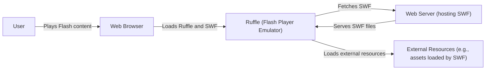
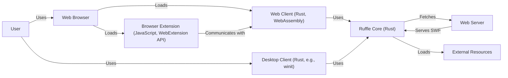
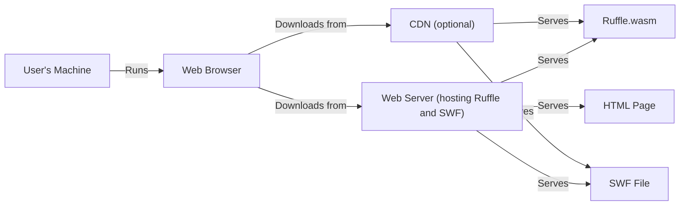
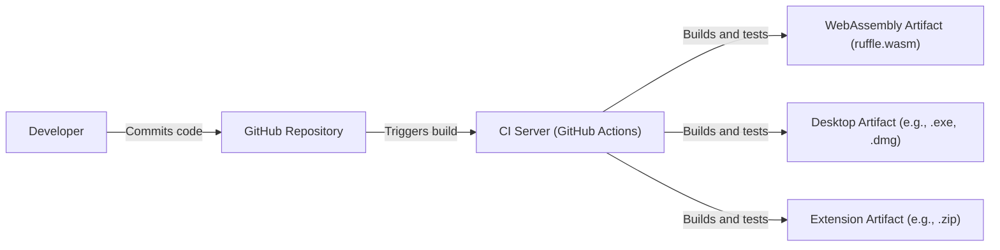

# BUSINESS POSTURE

Ruffle is an open-source Flash Player emulator. The project aims to preserve the legacy of Flash content on the web, which is no longer supported by major browsers.

Priorities:

-   Preserve access to Flash content.
-   Provide a safe and secure way to run Flash content.
-   Maintain compatibility with existing Flash content.
-   Ensure ease of use and integration for end-users and website owners.

Goals:

-   Become a viable alternative to the official Adobe Flash Player.
-   Achieve widespread adoption by users and websites.
-   Build a sustainable community around the project.

Business Risks:

-   Inability to accurately emulate all Flash content, leading to broken experiences.
-   Security vulnerabilities in the emulator that could be exploited by malicious Flash content.
-   Performance issues that make the emulator unusable for some content.
-   Lack of community support and contribution, leading to project stagnation.
-   Legal challenges related to intellectual property rights of Flash and related technologies.

# SECURITY POSTURE

Existing Security Controls:

-   security control: Written in Rust, a memory-safe language, mitigating many common vulnerabilities found in C/C++ applications (like the original Flash Player).
-   security control: Sandboxing of Flash content within the emulator. This is inherent to the design of an emulator, isolating the emulated environment from the host system.
-   security control: Regular updates and bug fixes to address newly discovered vulnerabilities.
-   security control: Open-source codebase, allowing for community review and contributions to security.
-   security control: Use of GitHub for issue tracking and vulnerability reporting.

Accepted Risks:

-   accepted risk: The inherent complexity of Flash and its ActionScript languages makes it challenging to achieve 100% compatibility and security. There may be undiscovered vulnerabilities or edge cases that could be exploited.
-   accepted risk: Reliance on community contributions for ongoing development and maintenance.
-   accepted risk: Potential for legal challenges related to Flash emulation.

Recommended Security Controls:

-   security control: Implement a comprehensive fuzzing framework to continuously test the emulator for vulnerabilities.
-   security control: Conduct regular security audits by independent security researchers.
-   security control: Establish a clear vulnerability disclosure program with defined response times.
-   security control: Explore the use of WebAssembly sandboxing features for additional isolation.
-   security control: Implement Content Security Policy (CSP) support to mitigate XSS vulnerabilities in the web-based player.

Security Requirements:

-   Authentication: Not directly applicable, as Ruffle itself doesn't handle user authentication. However, websites embedding Ruffle may have their own authentication mechanisms.
-   Authorization: Not directly applicable, as Ruffle itself doesn't manage user permissions. Websites embedding Ruffle may have their own authorization mechanisms. Ruffle should respect any SWF-defined access controls.
-   Input Validation: Crucial. Ruffle must thoroughly validate all input from SWF files, including ActionScript bytecode, data streams, and external resources, to prevent malicious code execution.
-   Cryptography: Ruffle should correctly implement any cryptographic functions used by Flash content, ensuring secure handling of encrypted data if required by the SWF.

# DESIGN

## C4 CONTEXT

Element Descriptions:

-   Element:
    -   Name: User
    -   Type: Person
    -   Description: A person who wants to view Flash content.
    -   Responsibilities: Interacts with a web browser to access websites containing Flash content.
    -   Security controls: Relies on the security controls of the web browser and operating system.

-   Element:
    -   Name: Ruffle (Flash Player Emulator)
    -   Type: Software System
    -   Description: The core emulator that interprets and executes Flash content.
    -   Responsibilities: Parses SWF files, executes ActionScript, renders graphics and audio, handles user input.
    -   Security controls: Memory safety (Rust), sandboxing, input validation, regular updates.

-   Element:
    -   Name: Web Browser
    -   Type: Software System
    -   Description: Standard web browser (e.g., Chrome, Firefox, Safari).
    -   Responsibilities: Hosts the Ruffle emulator (either through WebAssembly or a browser extension), provides the rendering context, handles network requests.
    -   Security controls: Browser's built-in security mechanisms (sandboxing, same-origin policy, etc.).

-   Element:
    -   Name: Web Server (hosting SWF)
    -   Type: Software System
    -   Description: A web server that hosts the SWF files and any associated assets.
    -   Responsibilities: Serves SWF files and other resources to the Ruffle emulator upon request.
    -   Security controls: Standard web server security practices (HTTPS, access controls, etc.).

-   Element:
    -   Name: External Resources (e.g., assets loaded by SWF)
    -   Type: Software System
    -   Description: External resources that a SWF file might load, such as images, sounds, or other data.
    -   Responsibilities: Provide data to the SWF file as requested.
    -   Security controls: Dependent on the source of the external resources; ideally, served over HTTPS.

## C4 CONTAINER

Element Descriptions:

-   Element:
    -   Name: User
    -   Type: Person
    -   Description: A person who wants to view Flash content.
    -   Responsibilities: Interacts with a web browser or desktop client to access Flash content.
    -   Security controls: Relies on the security controls of the web browser, desktop client, and operating system.

-   Element:
    -   Name: Web Browser
    -   Type: Software System
    -   Description: Standard web browser.
    -   Responsibilities: Hosts the Ruffle Web Client or Browser Extension.
    -   Security controls: Browser's built-in security mechanisms.

-   Element:
    -   Name: Web Server
    -   Type: Software System
    -   Description: A web server that hosts SWF files.
    -   Responsibilities: Serves SWF files and other resources.
    -   Security controls: Standard web server security practices.

-   Element:
    -   Name: External Resources
    -   Type: Software System
    -   Description: External resources loaded by a SWF file.
    -   Responsibilities: Provide data to the SWF.
    -   Security controls: Dependent on the resource source; ideally HTTPS.

-   Element:
    -   Name: Ruffle Core (Rust)
    -   Type: Container: Library
    -   Description: The core Flash Player emulation logic written in Rust.
    -   Responsibilities: Parsing SWF, executing ActionScript, rendering, audio.
    -   Security controls: Memory safety (Rust), input validation.

-   Element:
    -   Name: Desktop Client (Rust, e.g., winit)
    -   Type: Container: Application
    -   Description: A standalone desktop application for running Flash content.
    -   Responsibilities: Provides a window and rendering context, loads Ruffle Core.
    -   Security controls: OS-level security, sandboxing (if implemented).

-   Element:
    -   Name: Web Client (Rust, WebAssembly)
    -   Type: Container: WebAssembly Module
    -   Description: The Ruffle Core compiled to WebAssembly for use in web browsers.
    -   Responsibilities: Runs within the browser's WebAssembly sandbox, interacts with JavaScript.
    -   Security controls: WebAssembly sandbox, browser security.

-   Element:
    -   Name: Browser Extension (JavaScript, WebExtension API)
    -   Type: Container: Browser Extension
    -   Description: A browser extension that integrates Ruffle into web pages.
    -   Responsibilities: Detects Flash content, replaces it with the Ruffle Web Client.
    -   Security controls: Browser extension security model, permissions.

## DEPLOYMENT

Possible deployment solutions:

1.  WebAssembly in a browser: Ruffle is compiled to WebAssembly and loaded by a web page.
2.  Browser Extension: Ruffle is packaged as a browser extension that automatically replaces Flash content on web pages.
3.  Desktop Application: Ruffle is bundled as a standalone desktop application.

Chosen deployment (WebAssembly in a browser):

Element Descriptions:

-   Element:
    -   Name: User's Machine
    -   Type: Infrastructure Node: Device
    -   Description: The user's computer or mobile device.
    -   Responsibilities: Runs the web browser.
    -   Security controls: Operating system security, user account controls.

-   Element:
    -   Name: Web Browser
    -   Type: Software System
    -   Description: Standard web browser.
    -   Responsibilities: Loads and executes Ruffle.wasm, renders the output.
    -   Security controls: Browser's built-in security mechanisms.

-   Element:
    -   Name: Web Server (hosting Ruffle and SWF)
    -   Type: Infrastructure Node: Server
    -   Description: A web server that hosts the Ruffle WebAssembly file, the SWF file, and the HTML page.
    -   Responsibilities: Serves files to the web browser.
    -   Security controls: Standard web server security practices.

-   Element:
    -   Name: CDN (optional)
    -   Type: Infrastructure Node: Server
    -   Description: A Content Delivery Network that can be used to distribute Ruffle and SWF files.
    -   Responsibilities: Caches and serves files to improve performance and reduce load on the origin server.
    -   Security controls: CDN provider's security measures.

-   Element:
    -   Name: Ruffle.wasm
    -   Type: Artifact
    -   Description: The Ruffle emulator compiled to WebAssembly.
    -   Responsibilities: Emulates Flash Player.
    -   Security controls: WebAssembly sandbox.

-   Element:
    -   Name: SWF File
    -   Type: Artifact
    -   Description: The Flash content file.
    -   Responsibilities: Contains the Flash content to be emulated.
    -   Security controls: Input validation by Ruffle.

-   Element:
    -   Name: HTML Page
    -   Type: Artifact
    -   Description: The web page that embeds Ruffle and the SWF file.
    -   Responsibilities: Loads Ruffle.wasm and initiates the emulation.
    -   Security controls: Standard web page security (HTTPS, CSP).

## BUILD

Build Process Description:

1.  Developers write and commit code to the Ruffle GitHub repository.
2.  GitHub Actions (CI) is triggered by commits and pull requests.
3.  The CI server runs build scripts defined in the repository.
4.  The build process includes:
    -   Compiling the Rust code to WebAssembly for the web client.
    -   Building the desktop client for various platforms (Windows, macOS, Linux).
    -   Packaging the browser extension.
    -   Running unit tests and integration tests.
    -   Potentially running linters and static analysis tools (e.g., Clippy for Rust).
    -   Potentially running security-focused tools (e.g., cargo-audit for dependency vulnerability checks).
5.  If the build and tests are successful, build artifacts are generated:
    -   WebAssembly module (ruffle.wasm).
    -   Desktop application executables.
    -   Browser extension package.
6.  These artifacts can then be deployed to various environments (web server, extension stores, etc.).

Security Controls in Build Process:

-   security control: Use of GitHub Actions for automated builds and testing, ensuring consistency and reproducibility.
-   security control: Dependency management using Cargo (Rust's package manager), allowing for tracking and auditing of dependencies.
-   security control: Use of `cargo-audit` or similar tools to check for known vulnerabilities in dependencies.
-   security control: Use of linters (e.g., Clippy) to enforce code style and identify potential bugs.
-   security control: Running unit and integration tests to verify the correctness of the code.
-   security control: Code signing of build artifacts (where applicable) to ensure authenticity and integrity.

# RISK ASSESSMENT

Critical Business Processes:

-   Providing access to legacy Flash content.
-   Maintaining a secure and reliable Flash Player emulator.

Data to Protect:

-   Sensitivity: Low to Medium.
-   Data: Primarily the SWF files themselves, which may contain user-generated content or data loaded from external sources. Ruffle itself does not handle sensitive user data directly. The primary concern is preventing malicious SWF files from compromising the user's system.

# QUESTIONS & ASSUMPTIONS

Questions:

-   What is the specific threat model for malicious SWF files? What types of attacks are most concerning (e.g., XSS, data exfiltration, drive-by downloads)?
-   Are there any specific regulatory or compliance requirements that Ruffle needs to adhere to?
-   What is the long-term plan for maintaining Ruffle as Flash technology evolves (or becomes even more obsolete)?
-   What level of support is provided for different ActionScript versions and Flash features?
-   How are external resources loaded by SWF files handled, and what security measures are in place to prevent loading malicious content?

Assumptions:

-   BUSINESS POSTURE: The primary goal is to preserve Flash content, with security being a high priority but balanced against compatibility.
-   SECURITY POSTURE: The project relies heavily on the memory safety of Rust and the sandboxing capabilities of WebAssembly and browser extensions.
-   DESIGN: The architecture is modular, with a core emulation engine that can be used in different contexts (web, desktop, extension). The WebAssembly deployment is the primary focus.