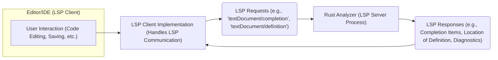
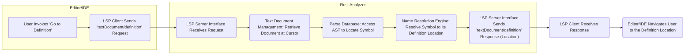
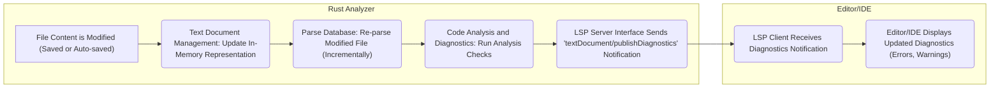

# Project Design Document: Rust Analyzer

**Version:** 1.1
**Date:** October 26, 2023
**Author:** Gemini (AI Language Model)

## 1. Introduction

This document provides a detailed design overview of Rust Analyzer, a Language Server Protocol (LSP) implementation specifically designed for the Rust programming language. The primary purpose of this document is to offer a clear and comprehensive understanding of Rust Analyzer's architecture, its constituent components, and the intricate data flows within the system. This detailed design will serve as a crucial foundation for subsequent threat modeling activities, enabling a thorough assessment of potential security vulnerabilities.

Rust Analyzer empowers developers with a rich set of code editing features tailored for Rust, including intelligent autocompletion, seamless navigation to definitions, comprehensive find-references functionality, and real-time diagnostics. It operates as an independent background process, adhering to the LSP standard to communicate effectively with various code editors and Integrated Development Environments (IDEs).

## 2. Goals

* To present a comprehensive and accurate depiction of Rust Analyzer's internal architecture.
* To clearly define each of the major components within Rust Analyzer, outlining their specific responsibilities and interactions.
* To visually illustrate the key data flows that occur within the system during various operations.
* To establish a solid and well-defined foundation for the identification and analysis of potential security vulnerabilities through subsequent threat modeling exercises.

## 3. Non-Goals

* This document intentionally avoids delving into the fine-grained implementation details of individual modules or functions within Rust Analyzer's codebase.
* Performance benchmarks, optimization strategies, and detailed resource utilization analysis are considered outside the scope of this document.
* A comprehensive explanation of the Language Server Protocol (LSP) itself is not included; this document assumes a basic understanding of LSP principles.

## 4. Architectural Overview

Rust Analyzer adopts a client-server architectural pattern, strictly adhering to the principles of the Language Server Protocol. In this model, the code editor or IDE functions as the LSP client, while Rust Analyzer acts as the LSP server. Communication between these two entities is typically established over standard input/output (stdio) streams or, less commonly, via network sockets.

## 5. Component Details

Rust Analyzer is composed of several distinct yet interconnected components, each responsible for a specific set of functionalities:

* **LSP Server Interface:**
    * Acts as the entry point for all communication from LSP clients.
    * Receives and parses incoming LSP requests, ensuring they conform to the protocol.
    * Validates the structure and semantics of incoming requests.
    * Dispatches validated requests to the appropriate internal components for processing.
    * Formats the results of processing into valid LSP responses.
    * Sends LSP responses back to the originating client.
    * Manages the lifecycle of individual client connections, handling connection establishment and termination.

* **Text Document Management:**
    * Maintains an up-to-date, in-memory representation of all Rust source files currently open in the editor.
    * Efficiently tracks and applies incremental changes made to the documents by the user in real-time.
    * Provides a consistent and reliable interface for other components to access the current state of the text documents.
    * Implements mechanisms for synchronizing document content between the server and the client, adhering to LSP synchronization modes.

* **Parse Database (Crates Data):**
    * Serves as a central repository for storing the Abstract Syntax Trees (ASTs) of the currently open files and all their dependencies (crates).
    * Employs incremental parsing techniques to efficiently update the ASTs as files are modified, minimizing redundant parsing.
    * Provides optimized data structures and access methods for quickly retrieving syntactic information about the code.
    * Includes metadata about the project's dependencies, extracted from `Cargo.toml` files and potentially downloaded crate information.

* **Name Resolution Engine:**
    * The core component responsible for resolving identifiers (such as variables, functions, types, and modules) to their corresponding declarations or definitions.
    * Traverses the AST, taking into account scope rules and visibility modifiers, to accurately determine the binding of each identifier.
    * Crucial for enabling features like "go-to-definition," "find-references," and accurate semantic highlighting.

* **Type Inference Engine:**
    * Deduced the data types of expressions and variables within the code, even when types are not explicitly declared.
    * Applies the rules of the Rust type system, including trait resolution and lifetime analysis, to infer types.
    * Provides essential information for code completion suggestions, accurate diagnostics (e.g., type mismatch errors), and other code intelligence features.

* **Code Analysis and Diagnostics:**
    * Performs static analysis of the codebase to identify potential issues, including syntax errors, type errors, unused code, and stylistic inconsistencies.
    * Integrates with external tools like Clippy (a collection of lints to catch common mistakes and improve Rust code) to provide more advanced diagnostics.
    * Reports diagnostic information back to the LSP client, which then displays these warnings and errors within the editor.

* **Code Completion Engine:**
    * Offers context-aware suggestions for completing code as the user types.
    * Leverages information from the Parse Database, Name Resolution Engine, and Type Inference Engine to generate relevant and accurate suggestions.
    * Considers the current lexical context and the expected type to provide intelligent completions for keywords, identifiers, and code snippets.

* **Go-to-Definition Engine:**
    * Enables users to navigate directly to the definition of a symbol (e.g., a function, variable, or type) by interacting with its usage in the editor.
    * Relies heavily on the Name Resolution Engine to locate the precise definition of the symbol under the cursor.

* **Find References Engine:**
    * Locates all occurrences (references) of a specific symbol throughout the entire project.
    * Utilizes the Name Resolution Engine to identify all instances where the symbol is used.

* **Formatting Engine:**
    * Integrates with the `rustfmt` tool, the official Rust code formatter, to automatically format code according to established style guidelines.
    * Can be invoked manually by the user or automatically on events like saving a file.

* **Configuration Management:**
    * Handles the loading and management of configuration settings that control the behavior of Rust Analyzer.
    * Reads configuration options from various sources, including configuration files (e.g., `.config/rust-analyzer.toml` or `.rust-analyzer.toml` in the project root) and potentially from settings provided by the LSP client.
    * Allows users to customize aspects like enabled/disabled features, paths to Rust toolchains, and specific lint settings.

* **File System Access:**
    * Interacts with the underlying file system to perform various operations, including reading source files, parsing `Cargo.toml` manifest files, and accessing crate dependencies.
    * Monitors the file system for changes (e.g., file creation, deletion, modification) to trigger updates in the Parse Database and other relevant components.

* **Caching Mechanisms:**
    * Employs various caching strategies at different levels to optimize performance and reduce redundant computations.
    * Caches parsed ASTs, results of name resolution and type inference, and other intermediate data to speed up subsequent requests.

## 6. Data Flow Diagrams

### 6.1. Code Completion Request Workflow

```mermaid
graph LR
    subgraph "Editor/IDE"
        A["User Types Code"] --> B("LSP Client Sends 'textDocument/completion' Request");
    end
    subgraph "Rust Analyzer"
        B --> C("LSP Server Interface Receives Request");
        C --> D("Text Document Management: Retrieve Current Document State");
        D --> E("Parse Database: Access AST of the Current File");
        E --> F("Name Resolution Engine: Determine Symbols in Scope");
        F --> G("Type Inference Engine: Infer Expected Type at Cursor");
        G --> H("Code Completion Engine: Generate Completion Suggestions");
        H --> I("LSP Server Interface Sends 'textDocument/completion' Response");
    end
    I --> J("LSP Client Receives Response");
    J --> K("Editor/IDE Displays Completion Suggestions to User");
```

### 6.2. Go-to-Definition Request Workflow

### 6.3. Diagnostics Update Workflow (on File Change)

## 7. Security Considerations (Preliminary)

This section provides an initial overview of potential security considerations relevant to Rust Analyzer's design. A more in-depth threat model will be developed based on this document.

* **Processing Malicious Code from Project:** Rust Analyzer inherently processes code from the user's project directory. Carefully crafted, malicious code within these projects could potentially exploit vulnerabilities in Rust Analyzer's parsing, analysis, or type inference engines, leading to unexpected behavior, crashes, or resource exhaustion. This includes potential for denial-of-service attacks by providing extremely large or deeply nested code structures.
* **File System Access Control and Vulnerabilities:** Rust Analyzer requires access to the file system to read source files, `Cargo.toml`, and potentially other project-related files. Improper handling of file paths, insufficient permission checks, or vulnerabilities in file system interaction logic could lead to unauthorized access, modification, or deletion of files outside the intended project scope. This could include scenarios like path traversal vulnerabilities.
* **Dependency Management and Supply Chain Risks:** Rust Analyzer relies on information from `Cargo.toml` to understand project dependencies and may interact with the crates.io registry or other crate sources. Compromised dependencies or malicious crate metadata could introduce vulnerabilities into the analysis process or potentially allow for the execution of arbitrary code during dependency resolution.
* **Resource Exhaustion and Denial of Service (DoS):**  Maliciously crafted LSP requests or the presence of extremely large and complex codebases could potentially overwhelm Rust Analyzer's resources (CPU, memory), leading to a denial of service. This could impact the user's ability to use the editor effectively.
* **Configuration Tampering and Security Misconfiguration:** If configuration files used by Rust Analyzer are writable by untrusted users or processes, malicious configurations could be introduced to alter the behavior of Rust Analyzer in undesirable ways, potentially weakening security or enabling malicious actions.
* **Security of LSP Communication Channel:** While LSP communication is often local (e.g., via stdio), if configured to use network sockets, the communication channel could be vulnerable to eavesdropping or tampering if not properly secured using encryption and authentication mechanisms.
* **Vulnerabilities in Third-Party Dependencies:** Rust Analyzer itself depends on various third-party Rust crates. Security vulnerabilities present in these dependencies could indirectly affect Rust Analyzer's security posture. Regular dependency audits and updates are crucial.
* **Code Injection through Macros or Build Scripts:**  Rust's powerful macro system and build scripts introduce potential attack vectors. Malicious code embedded within macros or executed during the build process could potentially compromise Rust Analyzer's environment or the user's system.

## 8. Deployment Considerations

Rust Analyzer is typically deployed as a language server that is launched and managed by the LSP client (the code editor or IDE). The deployment process generally involves:

* **Installation:** Users typically install Rust Analyzer as an extension or plugin for their specific editor/IDE. This often involves using the editor's built-in extension marketplace or package manager.
* **Automatic Launch:** When a user opens a Rust project, the LSP client (editor/IDE) automatically detects the presence of Rust files and initiates the Rust Analyzer process in the background.
* **Communication Setup:** The LSP client establishes a communication channel with the Rust Analyzer process, usually via standard input/output (stdio) streams. Some editors might support network socket communication for remote language servers.
* **Configuration:**  Users can often configure Rust Analyzer's behavior through editor settings or by creating configuration files within their project.
* **Updates:**  Keeping Rust Analyzer up-to-date is important for security and bug fixes. Editors usually provide mechanisms for automatically updating extensions.

## 9. Future Considerations

The following are potential future developments that could significantly impact the architecture and security considerations of Rust Analyzer:

* **Enhanced Remote LSP Support:**  Expanding support for running Rust Analyzer on remote servers or in cloud environments. This would necessitate robust authentication, authorization, and secure communication protocols to protect sensitive code and prevent unauthorized access.
* **Integration of More Advanced Static Analysis Techniques:** Incorporating more sophisticated static analysis tools and techniques could introduce new attack surfaces if these tools have vulnerabilities or if the integration is not handled securely.
* **Plugin or Extension System:**  Allowing external developers to create plugins or extensions to extend Rust Analyzer's functionality. This would require careful sandboxing and security reviews of plugins to prevent malicious code from compromising the core system.
* **Support for Build Systems Beyond Cargo:** Expanding support to other build systems beyond Cargo might require new mechanisms for gathering project information and could introduce new security considerations related to the security of those build systems.
* **Improved Caching and Persistence Mechanisms:**  Implementing more advanced caching or persistence mechanisms to improve performance could introduce new vulnerabilities related to data storage and access control.
* **Integration with Security Analysis Tools:**  Direct integration with security analysis tools or linters could enhance Rust Analyzer's ability to identify security vulnerabilities in user code. However, the integration itself needs to be secure.

This document provides a detailed and improved overview of the Rust Analyzer project design. It serves as a valuable resource for understanding the system's architecture, components, and data flows, and will be instrumental in the subsequent threat modeling process.