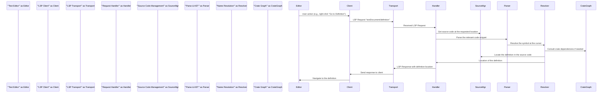

# Project Design Document: Rust Analyzer

**Version:** 1.1
**Date:** October 26, 2023
**Author:** AI Software Architect

## 1. Introduction

This document provides a detailed design overview of the Rust Analyzer project. Rust Analyzer is a Language Server Protocol (LSP) implementation for the Rust programming language. It offers rich code analysis and editing features to Integrated Development Environments (IDEs) and other code editors supporting the LSP. This document aims to clearly outline the architecture, components, and data flow within Rust Analyzer, making it suitable for subsequent threat modeling activities. The focus is on providing sufficient detail for security analysis.

## 2. Goals

* Provide a comprehensive and detailed architectural overview of Rust Analyzer.
* Clearly identify key components, sub-components, and their interactions, emphasizing trust boundaries.
* Describe the data flow within the system for various common operations.
* Highlight important security considerations and potential vulnerabilities relevant for threat modeling, with specific examples.
* Serve as a solid foundation for identifying potential threats, attack vectors, and vulnerabilities.

## 3. Overview

Rust Analyzer operates as a standalone server process that communicates with client applications (IDEs) via the Language Server Protocol (LSP). It analyzes Rust codebases, providing features such as:

* Code completion (including path and member completion)
* Go-to-definition (navigating to the source of symbols)
* Find references (locating all usages of a symbol)
* Syntax highlighting (semantic token highlighting)
* Error and warning diagnostics (linting and compiler errors)
* Code formatting (using `rustfmt`)
* Refactoring (e.g., rename, extract function)
* Inlay hints (e.g., parameter names, type hints)

The core functionality revolves around parsing, semantically analyzing, and understanding Rust code. It leverages the Rust compiler's (rustc) infrastructure for certain tasks but also maintains its own independent analysis engine, often referred to as the "RA Core," for performance and flexibility. This separation is a key architectural decision with security implications.

## 4. Architectural Design

The following diagram illustrates the high-level architecture of Rust Analyzer, highlighting key components and their relationships:

```mermaid
graph LR
    subgraph "Client (IDE)"
        A["'Text Editor'"]
    end
    B["'LSP Client'"] --> C("'LSP Server (Rust Analyzer)'");
    A --> B;
    subgraph "LSP Server (Rust Analyzer)"
        D["'LSP Transport'"]
        E["'Request Handler'"]
        subgraph "Analysis Engine ('RA Core')"
            F["'Source Code Management'"]
            G["'Parse & AST'"]
            H["'Name Resolution'"]
            I["'Type Inference'"]
            J["'Borrow Checking (Partial)'"]
            K["'Macro Expansion'"]
            L["'Crate Graph'"]
            M["'Configuration'"]
        end
        N["'Cargo Integration'"]
        O["'File System Access'"]
        P["'Rust Compiler (rustc) Integration'"]
        C --> D;
        D --> E;
        E --> F;
        E --> N;
        E --> M;
        E --> P;
        F --> G;
        F --> O;
        G --> H;
        H --> I;
        I --> J;
        G --> K;
        K --> G; % Macro expansion can lead to re-parsing
        I --> L;
        N --> O;
        P --> O;
    end
    C --> B;
```

### 4.1. Key Components and Sub-components

* **LSP Transport:**
    * Handles the bidirectional communication with the LSP client (IDE) using standard input/output (stdio), named pipes, or other configured transport mechanisms.
    * Responsible for serializing outgoing LSP messages (typically JSON-RPC) and deserializing incoming messages.
    * Acts as a trust boundary between the potentially untrusted client and the Rust Analyzer server.
* **Request Handler:**
    * Receives deserialized LSP requests and notifications from the LSP Transport.
    * Dispatches these requests to the appropriate internal components based on the method name.
    * Manages the lifecycle of requests and sends back serialized responses through the LSP Transport.
    * Implements rate limiting or other protective measures against malicious request flooding.
* **Analysis Engine ("RA Core"):** This is the heart of Rust Analyzer, responsible for understanding the Rust code.
    * **Source Code Management:**
        * Maintains an in-memory representation of the source code files being analyzed, including handling file open, close, and change events received from the LSP client.
        * Implements mechanisms for efficient storage and retrieval of source code.
        * Needs to handle potential inconsistencies between the in-memory representation and the actual file system.
    * **Parse & AST (Abstract Syntax Tree):**
        * Parses Rust source code into an Abstract Syntax Tree (AST), representing the syntactic structure of the code.
        * This component is crucial and a potential target for exploits if the parser is vulnerable to maliciously crafted input.
    * **Name Resolution:**
        * Resolves identifiers (names) to their corresponding declarations (e.g., variables, functions, types).
        * This involves traversing the AST and considering scope rules.
    * **Type Inference:**
        * Infers the types of expressions and variables where they are not explicitly specified.
        * A complex process that relies on the rules of the Rust type system.
    * **Borrow Checking (Partial):**
        * Implements a subset of Rust's borrow checker to identify potential memory safety issues.
        * While not as exhaustive as `rustc`, it provides valuable feedback within the IDE.
    * **Macro Expansion:**
        * Expands Rust macros, which are code generation mechanisms.
        * This can involve recursive expansion and can be computationally intensive. Malicious macros could lead to denial of service.
    * **Crate Graph:**
        * Maintains a representation of the dependencies between crates in the project, including both local crates and external dependencies.
        * Essential for accurate analysis across multiple files and libraries.
        * Information is typically obtained from `Cargo.toml` files.
    * **Configuration:**
        * Manages user and project-specific configuration settings that affect Rust Analyzer's behavior (e.g., formatting options, enabled features).
        * Configuration can come from various sources (IDE settings, project files) and needs to be handled securely to prevent malicious configuration injection.
* **Cargo Integration:**
    * Interacts with Cargo, Rust's build system, to obtain information about the project structure, dependencies, build targets, and enabled features.
    * This often involves invoking `cargo` commands and parsing their output.
    * Represents a trust boundary as interactions with external processes can introduce vulnerabilities.
* **File System Access:**
    * Provides controlled access to the file system for reading source code files, `Cargo.toml` files, configuration files, and potentially other project-related files.
    * Needs to implement robust path sanitization and access control to prevent unauthorized file access.
* **Rust Compiler (rustc) Integration:**
    * Can optionally integrate with the Rust compiler for more accurate or complete analysis in certain scenarios, especially for procedural macros and situations where RA Core's analysis is insufficient.
    * This might involve invoking `rustc` with specific flags or leveraging its internal data structures through libraries like `librustc_driver`.
    * Invoking external compilers is a significant security consideration.

## 5. Data Flow

The typical data flow for a user action (e.g., requesting go-to-definition) is as follows:



**Detailed Steps for Go-to-Definition:**

1. The user initiates a "Go to Definition" action in the text editor.
2. The LSP client in the IDE sends a `textDocument/definition` request to the Rust Analyzer LSP server, including the URI of the document and the position of the cursor.
3. The LSP Transport component receives and deserializes the request.
4. The Request Handler identifies the request type and dispatches it to the appropriate handler function.
5. The Source Code Management component retrieves the relevant source code file from its in-memory representation.
6. The Parse & AST component parses the code around the cursor position to build an Abstract Syntax Tree (AST).
7. The Name Resolution component analyzes the AST to determine the symbol at the cursor and resolve its definition, potentially consulting the Crate Graph for symbols defined in other crates.
8. The Name Resolution component uses the Source Code Management component to locate the source code corresponding to the definition.
9. The Name Resolution component returns the location (file URI and position) of the definition to the Request Handler.
10. The Request Handler formats the response according to the LSP specification.
11. The LSP Transport serializes and sends the response back to the LSP client.
12. The LSP client in the IDE uses the received location to navigate the user to the definition in the text editor.

## 6. Security Considerations

This section outlines potential security considerations for threat modeling, categorized for clarity:

* **Input Validation Vulnerabilities:**
    * **Maliciously Crafted Source Code:**  Exploiting vulnerabilities in the parser (Parse & AST component) by providing syntactically invalid or extremely complex code designed to cause crashes, infinite loops, or excessive resource consumption.
    * **Exploiting Macro Expansion:**  Crafting macros that, upon expansion, generate extremely large amounts of code, leading to memory exhaustion or stack overflow.
    * **Unsafe Input to `rustc` Integration:** If `rustc` is invoked with user-controlled input (e.g., through build scripts or procedural macros), vulnerabilities in `rustc` itself could be exploited.
* **Resource Exhaustion:**
    * **Denial of Service through Large Projects:**  Providing extremely large or deeply nested projects that consume excessive memory or CPU during analysis.
    * **Recursive Macro Expansion:** Macros that expand into other macros, potentially leading to infinite or excessively deep recursion.
    * **Excessive File System Access:**  Projects with a very large number of files or deeply nested directory structures could lead to performance issues or denial of service due to file system operations.
* **File System Access Control Issues:**
    * **Path Traversal Vulnerabilities:**  Exploiting vulnerabilities in the File System Access component to access files outside the intended project directory. This could involve crafted file paths in `Cargo.toml` or configuration files.
    * **Symlink Attacks:** Using symbolic links within the project to trick Rust Analyzer into accessing or modifying unintended files.
* **Configuration Vulnerabilities:**
    * **Malicious Configuration Injection:**  Injecting malicious configuration settings (e.g., through project-specific configuration files) that could alter Rust Analyzer's behavior or expose sensitive information.
* **Information Disclosure:**
    * **Leaking Sensitive Information in Error Messages:** Error messages or debug logs might inadvertently reveal sensitive information about the project structure, internal state, or dependencies.
    * **Exposing Source Code Snippets:**  Vulnerabilities in the LSP implementation could potentially allow an attacker to request and obtain arbitrary snippets of source code.
* **Dependency Chain Vulnerabilities:**
    * **Compromised Dependencies:** If Rust Analyzer depends on vulnerable external crates, these vulnerabilities could be indirectly exploitable.
* **Trust Boundary Violations:**
    * **LSP Client Impersonation:**  A malicious process could potentially impersonate an LSP client and send crafted requests to Rust Analyzer.
    * **Data Injection through LSP:**  Exploiting vulnerabilities in the LSP Transport or Request Handler to inject malicious data or commands.
* **Code Execution (Indirect):**
    * **Exploiting Cargo Integration:**  If the Cargo Integration component is vulnerable, a malicious project could potentially trigger the execution of arbitrary code through crafted `Cargo.toml` files or build scripts.
    * **Vulnerabilities in `rustc` Invocation:**  If Rust Analyzer invokes `rustc` in an insecure manner, it could potentially lead to arbitrary code execution.

## 7. Deployment

Rust Analyzer is typically deployed as a standalone executable that is launched by the LSP client (IDE). The client communicates with the server process over standard input/output (stdio) or other configured transport mechanisms like named pipes. The server runs with the privileges of the user running the IDE.

## 8. Dependencies

Rust Analyzer depends on several external libraries and tools, including:

* **Rust Standard Library:** Provides core functionalities.
* **Crates for Parsing and Analysis:**  Including crates like `rowan` for syntax trees and potentially custom parsing logic.
* **Libraries for LSP Implementation:** Crates like `lsp-server` for handling the LSP protocol communication.
* **Cargo:** Rust's build system, used for project information and dependency resolution.
* **Potentially `rustc` or `librustc_driver`:** For deeper integration with the Rust compiler.

## 9. Future Considerations

* **Enhanced Security Audits:** Conducting regular security audits and penetration testing.
* **Sandboxing or Isolation:** Exploring options for sandboxing or isolating the Rust Analyzer process to limit the impact of potential vulnerabilities.
* **Stricter Input Validation:** Implementing more robust input validation and sanitization throughout the system.
* **Improved Error Handling:** Ensuring that error messages do not reveal sensitive information.
* **Regular Dependency Updates:** Keeping dependencies up-to-date to patch known vulnerabilities.

This document provides a more detailed and security-focused understanding of the Rust Analyzer project's architecture and data flow. This information is crucial for conducting a thorough threat model to identify potential security vulnerabilities and design appropriate mitigations. The emphasis on component interactions and trust boundaries should facilitate a more effective security analysis.