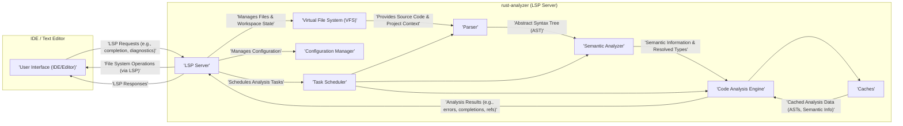
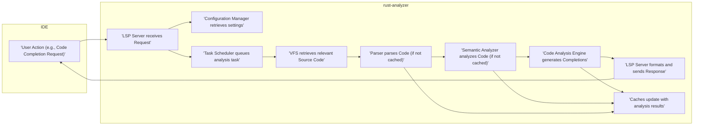

# Project Design Document: rust-analyzer for Threat Modeling

**Project Name:** rust-analyzer

**Project Repository:** [https://github.com/rust-analyzer/rust-analyzer](https://github.com/rust-analyzer/rust-analyzer)

**Document Version:** 1.1
**Date:** 2023-10-27
**Author:** AI Software Architect

## 1. Introduction

This document provides a detailed design overview of the rust-analyzer project, a Language Server Protocol (LSP) implementation specifically for the Rust programming language.  It is designed to serve as a foundational resource for conducting thorough threat modeling activities. The document meticulously outlines the system's architecture, individual components, data flow pathways, and the underlying technology stack.  Crucially, it highlights areas within the design that are most pertinent to security considerations and potential vulnerabilities.

rust-analyzer's primary function is to enhance the Rust development experience by providing rich Integrated Development Environment (IDE) features. These features include, but are not limited to: intelligent code completion, real-time error diagnostics, seamless navigation to definitions, and robust refactoring capabilities.  It operates as a standalone process, separate from the IDE itself, and communicates with IDEs or text editors via the standardized Language Server Protocol (LSP).  A comprehensive understanding of rust-analyzer's internal design and external interactions is paramount for effectively identifying potential security vulnerabilities and associated risks. This document aims to provide that understanding.

## 2. Project Overview

rust-analyzer stands as a high-performance, open-source language server dedicated to the Rust programming language. Its core objective is to deliver rapid and precise analysis of Rust codebases, thereby fostering a streamlined and highly productive development workflow for Rust programmers.  This objective is achieved through a combination of key functionalities:

*   **Robust Parsing and Semantic Analysis of Rust Code:**  At its heart, rust-analyzer meticulously parses Rust source code and performs in-depth semantic analysis. This analysis goes beyond syntax, delving into the meaning and relationships within the code to build a comprehensive understanding of the program's structure and logic.
*   **Implementation of Language Server Protocol (LSP) Features:** rust-analyzer fully implements the Language Server Protocol, a standardized protocol that enables seamless integration with a wide array of IDEs and text editors that support LSP. This ensures broad compatibility and usability across different development environments.
*   **Advanced Caching and Incremental Analysis for Performance:** To maintain responsiveness and efficiency, especially when working with large projects, rust-analyzer employs sophisticated caching mechanisms and incremental analysis techniques. These techniques minimize redundant computations by intelligently reusing previously computed results and only re-analyzing code that has changed.
*   **Design for Extensibility and Customization:** While its primary focus is on core Rust language features, rust-analyzer is architected with extensibility in mind. This design allows for future expansion to support custom language extensions, specialized features, and adaptations to evolving Rust language standards.

## 3. System Architecture

rust-analyzer adopts a modular architecture, carefully dividing responsibilities among several interconnected components. This modularity enhances maintainability, testability, and allows for focused development efforts. The high-level architecture is visually represented below:

### 3.1. Component Description

*   **User Interface (IDE/Editor):** This component represents the IDE or text editor (e.g., VS Code, IntelliJ IDEA, Vim, Sublime Text) that serves as the user's primary interaction point. It is responsible for:
    *   Presenting the user interface for code editing and project management.
    *   Dispatching LSP requests to rust-analyzer based on user actions (e.g., typing, saving, requesting completions).
    *   Receiving and displaying LSP responses from rust-analyzer, such as diagnostics, code completions, and refactoring suggestions.
    *   Handling file system operations as requested by the LSP server (e.g., reading files, writing files).

*   **LSP Server:** This is the central orchestrator within rust-analyzer, acting as the primary interface for communication with the IDE. Its responsibilities include:
    *   Receiving and parsing LSP requests from the IDE.
    *   Routing requests to the appropriate internal components for processing.
    *   Managing the overall state of the language server session, including project workspace information.
    *   Interacting with the Configuration Manager to apply user-defined settings.
    *   Utilizing the Task Scheduler to manage and prioritize analysis tasks.
    *   Formatting and sending LSP responses back to the IDE.

*   **Virtual File System (VFS):** The VFS provides an abstraction layer over the physical file system, enabling rust-analyzer to work with project files in a memory-efficient and consistent manner. Key features of the VFS include:
    *   Maintaining an in-memory representation of project files and their contents.
    *   Optimizing file access and change detection, reducing disk I/O.
    *   Providing a consistent view of the file system, even when files are modified externally.
    *   Abstracting away platform-specific file system details.

*   **Parser:** The Parser component is responsible for the initial stage of code understanding:
    *   Taking Rust source code (text) as input from the VFS.
    *   Performing lexical analysis (tokenization) and syntactic analysis.
    *   Constructing an Abstract Syntax Tree (AST), which represents the hierarchical structure of the code according to Rust grammar rules.
    *   Handling syntax errors and reporting them as diagnostics.

*   **Semantic Analyzer:** Building upon the AST, the Semantic Analyzer performs deeper analysis to understand the meaning of the code:
    *   Resolving names (identifying the declaration corresponding to each identifier).
    *   Performing type checking to ensure type correctness according to Rust's type system.
    *   Performing borrow checking to enforce Rust's memory safety rules.
    *   Resolving traits and implementing trait dispatch.
    *   Building a semantic model of the code, including symbol tables and type information.

*   **Code Analysis Engine:** This is the core engine that leverages the semantic information to provide IDE features:
    *   Generating diagnostics (errors, warnings, hints) based on semantic analysis and linting rules.
    *   Providing code completion suggestions based on context and type information.
    *   Enabling "go-to-definition" and "find-references" functionality.
    *   Supporting refactoring operations (e.g., rename, extract function).
    *   Performing code formatting and code folding.

*   **Caches:**  To ensure performance and responsiveness, rust-analyzer heavily relies on caching:
    *   Storing parsed ASTs to avoid redundant parsing of unchanged files.
    *   Caching semantic analysis results, such as type information and resolved names.
    *   Employing various caching strategies (e.g., invalidation on code changes, LRU caches) to optimize memory usage and cache hit rates.

*   **Configuration Manager:** This component handles the configuration and settings of rust-analyzer:
    *   Reading configuration files (e.g., `rust-project.json`, `.editorconfig`).
    *   Applying user-defined settings and preferences.
    *   Managing project-specific configurations.
    *   Providing mechanisms for users to customize rust-analyzer's behavior.

*   **Task Scheduler:**  The Task Scheduler manages and prioritizes the various analysis tasks within rust-analyzer:
    *   Scheduling parsing, semantic analysis, and code analysis tasks.
    *   Prioritizing tasks based on user actions and perceived importance (e.g., prioritizing analysis of the currently active file).
    *   Managing concurrency and parallelism to utilize system resources effectively.
    *   Ensuring responsiveness of the LSP server by managing task execution.

## 4. Data Flow

The data flow within rust-analyzer is triggered by user actions in the IDE. A typical data flow scenario, such as requesting code completion, is detailed below:

**Detailed Data Flow Steps:**

1.  **User Action:** The user performs an action in the IDE that requires rust-analyzer's assistance, such as typing code, triggering code completion, hovering over a symbol, or requesting diagnostics.
2.  **LSP Server Receives Request:** The IDE translates the user action into an LSP request and sends it to the rust-analyzer LSP server. This request includes details like the file path, cursor position, and the specific type of request (e.g., `textDocument/completion`, `textDocument/hover`).
3.  **Configuration Manager Retrieves Settings:** Upon receiving a request, the LSP Server may consult the Configuration Manager to retrieve relevant settings that might affect the processing of the request. This ensures that user preferences and project-specific configurations are taken into account.
4.  **Task Scheduler Queues Analysis Task:** The LSP Server uses the Task Scheduler to queue the necessary analysis tasks. This allows rust-analyzer to manage and prioritize work efficiently, especially when dealing with multiple requests or background analysis.
5.  **VFS Retrieves Source Code:** The Task Scheduler triggers the retrieval of the relevant source code files from the Virtual File System (VFS). The VFS provides an in-memory representation of the project's files, ensuring efficient access.
6.  **Parser Parses Code (if not cached):** If the source code for the relevant file has not been parsed recently or if the cached AST is invalid (due to code changes), the Parser component is invoked to parse the Rust code into an Abstract Syntax Tree (AST).
7.  **Semantic Analyzer Analyzes Code (if not cached):** The Semantic Analyzer then processes the AST to perform semantic analysis, including type checking, name resolution, and borrow checking.  Results of semantic analysis are also cached for future use.
8.  **Code Analysis Engine Generates Completions:** Based on the semantic information, the user's request context, and potentially configuration settings, the Code Analysis Engine performs the specific analysis required to fulfill the request. In this example, it generates a list of relevant code completion suggestions.
9.  **LSP Server Formats and Sends Response:** The LSP Server formats the results from the Code Analysis Engine into a structured LSP response message, adhering to the LSP specification. This response is then sent back to the IDE.
10. **IDE Displays Results:** The IDE receives the LSP response and displays the results to the user. In the code completion example, the IDE would present a list of code completion suggestions to the user.
11. **Caches Update with Analysis Results:**  Throughout the process, and especially after successful parsing and semantic analysis, the Caches component is updated with the newly computed ASTs, semantic information, and analysis results. This ensures that subsequent requests can benefit from cached data, improving performance.

## 5. Technology Stack

rust-analyzer is built upon a robust and modern technology stack, primarily leveraging the Rust ecosystem:

*   **Primary Programming Language:** Rust - The entire rust-analyzer project is implemented in Rust. This choice leverages Rust's inherent advantages in performance, memory safety, and concurrency, which are crucial for a language server that needs to be both fast and reliable.
*   **Communication Protocol:** Language Server Protocol (LSP) - LSP is the standard protocol used for communication between rust-analyzer and IDEs. This ensures broad compatibility and interoperability with any LSP-compliant editor.
*   **Core Rust Crates (Libraries):** rust-analyzer relies on a rich ecosystem of Rust crates to provide its functionality. Key crates include:
    *   **`syn` and `proc-macro2`:**  Essential for parsing Rust code. `syn` provides data structures for representing Rust syntax, and `proc-macro2` is used for working with procedural macros.
    *   **`ra-syntax`:**  Defines the concrete syntax tree (CST) and abstract syntax tree (AST) data structures used internally to represent Rust code.
    *   **`ra-db`:** Provides the database and caching infrastructure for managing project data and analysis results efficiently.
    *   **`ra-ide`:** Contains the core logic for IDE features, including semantic analysis, code completion, diagnostics, and refactoring.
    *   **`lsp-server`:** Handles the implementation of the Language Server Protocol, managing communication with IDE clients.
    *   **`vfs` (Virtual File System crate):**  Provides the virtual file system abstraction used by rust-analyzer.
    *   **`rayon`:**  A data parallelism library for Rust, used to parallelize computationally intensive tasks within rust-analyzer, improving performance.
*   **Build System and Package Manager:** `cargo` - Rust's built-in package manager and build system, `cargo`, is used for dependency management, building the project, running tests, and managing releases of rust-analyzer.

## 6. Security Considerations for Threat Modeling

When conducting threat modeling for rust-analyzer, several key areas related to security should be carefully examined. These areas represent potential attack surfaces and vulnerabilities:

*   **Input Validation and Robustness of Code Parsing:**
    *   **Threat:** Maliciously crafted Rust code, designed to exploit weaknesses in the parser or semantic analyzer, could be injected into the analysis process. This could lead to:
        *   **Denial of Service (DoS):**  Causing rust-analyzer to crash or become unresponsive, disrupting the developer's workflow.
        *   **Arbitrary Code Execution (ACE) within rust-analyzer:**  In extreme cases, vulnerabilities in parsing or analysis could potentially be exploited to execute arbitrary code within the rust-analyzer process itself. This is a high-severity threat.
        *   **Information Disclosure:**  Exploiting parsing vulnerabilities to leak sensitive information from the rust-analyzer process or the analyzed codebase.
    *   **Consideration:**  Thoroughly analyze the parser and semantic analyzer components for their robustness against malformed, oversized, or intentionally malicious Rust code inputs. Investigate error handling mechanisms, input sanitization practices, and defenses against common parsing vulnerabilities (e.g., buffer overflows, stack overflows, infinite loops). Fuzz testing the parser with a wide range of inputs, including edge cases and malicious payloads, is highly recommended.

*   **Security of Third-Party Dependencies:**
    *   **Threat:** rust-analyzer relies on a substantial number of third-party Rust crates. Vulnerabilities present in any of these dependencies could indirectly compromise rust-analyzer's security.
    *   **Consideration:**  Implement a robust dependency management strategy that includes:
        *   Regularly auditing and scanning dependencies for known vulnerabilities using vulnerability databases and security tools (e.g., `cargo audit`).
        *   Keeping dependencies up-to-date with security patches.
        *   Carefully evaluating the security posture and reputation of new dependencies before incorporating them.
        *   Employing Software Bill of Materials (SBOM) practices to track and manage dependencies effectively.

*   **Resource Consumption and Denial of Service (DoS) through Resource Exhaustion:**
    *   **Threat:**  Processing exceptionally large or complex Rust projects, or specifically crafted pathological code, could lead to excessive resource consumption (CPU, memory, disk I/O) within rust-analyzer. This could result in:
        *   **Local DoS:**  Overloading the developer's machine, making it unresponsive and hindering productivity.
        *   **Performance Degradation:**  Significantly slowing down rust-analyzer and the IDE, leading to a poor user experience.
    *   **Consideration:**  Evaluate resource management within rust-analyzer, particularly during parsing, semantic analysis, caching, and indexing large projects. Implement resource limits, timeouts, and mechanisms to prevent resource exhaustion. Consider techniques like:
        *   Memory limits and garbage collection tuning.
        *   CPU usage throttling or prioritization.
        *   Rate limiting for certain types of analysis tasks.
        *   Mechanisms to detect and handle excessively large or complex code structures gracefully.

*   **LSP Communication Channel Security:**
    *   **Threat:** Although LSP communication typically occurs locally via standard input/output or named pipes, scenarios involving remote development or insecure network configurations could expose the LSP communication channel to interception or manipulation. This could potentially lead to:
        *   **Information Leakage:**  Sensitive code or project information being intercepted from LSP messages.
        *   **Command Injection:**  Malicious LSP messages being injected to manipulate rust-analyzer's behavior or potentially execute commands on the developer's machine (though highly unlikely in typical LSP usage).
    *   **Consideration:**  While less critical in standard local development setups, consider the security of the LSP communication channel, especially if rust-analyzer is used in remote development environments or scenarios where network security is a concern.  For enhanced security in such scenarios, consider:
        *   Using secure communication channels (e.g., encrypted pipes or network connections).
        *   Implementing authentication and authorization mechanisms for LSP communication (if feasible and relevant to the deployment context).

*   **Code Injection Vulnerabilities (Low Probability but Worth Considering):**
    *   **Threat:**  While less likely in a language server context, theoretical vulnerabilities in code generation or refactoring features could, in extremely rare scenarios, introduce code injection risks. For example, if refactoring logic incorrectly manipulates code strings without proper sanitization.
    *   **Consideration:**  Examine code generation and refactoring functionalities for any potential injection points, although this is generally a low-risk area for language servers focused on analysis rather than code transformation.  Focus on ensuring that code manipulation logic is robust and avoids introducing new vulnerabilities.

*   **Caching Mechanism Security and Integrity:**
    *   **Threat:**  Improperly implemented caching mechanisms could lead to several security-related issues:
        *   **Cache Poisoning:**  Malicious actors potentially injecting crafted data into the cache, leading to incorrect analysis results or even exploitation of vulnerabilities based on stale or manipulated cached data.
        *   **Stale or Inconsistent Data:**  Cache invalidation issues could result in rust-analyzer using outdated or inconsistent cached data, leading to incorrect diagnostics or unexpected behavior.
    *   **Consideration:**  Thoroughly review the design and implementation of caching mechanisms to ensure:
        *   Data integrity and authenticity of cached data.
        *   Robust cache invalidation logic to prevent the use of stale data.
        *   Protection against cache poisoning attacks (e.g., using cryptographic checksums or signatures for cached data).
        *   Secure storage and access control for cached data, especially if sensitive information is cached.

## 7. Deployment Model

rust-analyzer is designed for local deployment and operation within a developer's environment:

*   **Local Installation as IDE Extension/Plugin:** Developers install rust-analyzer as an extension or plugin within their chosen IDE or text editor. This is the primary deployment method.
*   **Background Process Execution:** When the IDE starts and a Rust project is opened, the IDE automatically launches rust-analyzer as a separate background process running on the developer's local machine.
*   **LSP Communication via Local Channels:** Communication between the IDE and rust-analyzer occurs via the Language Server Protocol (LSP) over local communication channels, typically standard input/output (stdio) or named pipes. This communication is generally confined to the developer's local system.
*   **Direct Local File System Access:** rust-analyzer directly accesses project files on the developer's local file system through the Virtual File System (VFS) abstraction. It does not typically require network access to project files in standard usage scenarios.

## 8. Assumptions and Constraints

This design document is based on the following assumptions and constraints, which are important to consider during threat modeling:

*   **Focus on Software Design:** This document primarily focuses on the software design and architecture of rust-analyzer and its internal components. It does not delve into the security of the underlying operating system, hardware, or network infrastructure.
*   **LSP Standard Compliance:** It is assumed that rust-analyzer correctly and securely implements the Language Server Protocol and adheres to its specifications. Any deviations from the LSP standard could introduce unexpected security implications.
*   **Open Source and Community-Driven Development:** rust-analyzer is an open-source project developed by a community. This implies transparency and public scrutiny of the codebase, but also relies on community contributions for security reviews and vulnerability patching.
*   **Actively Evolving Project:** rust-analyzer is under active development, with frequent updates and feature additions. The architecture and features described in this document represent a snapshot at the time of writing and may evolve over time. Security assessments should be ongoing to account for changes in the codebase.
*   **Threat Modeling Context:** This document is specifically tailored to facilitate threat modeling activities. The security considerations section highlights areas deemed most relevant to potential security risks associated with rust-analyzer in typical development workflows. The scope of threat modeling should be aligned with the specific use cases and deployment scenarios under consideration.

This detailed design document provides a comprehensive foundation for conducting a thorough and effective threat model of rust-analyzer. By understanding its architecture, data flow, technology stack, and security considerations, security professionals, developers, and users can collaboratively identify, analyze, and mitigate potential security threats associated with this essential Rust development tool. Continuous security assessment and proactive mitigation efforts are crucial to maintain the security and integrity of rust-analyzer as it evolves.