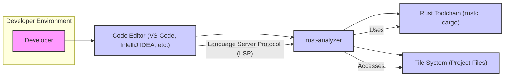
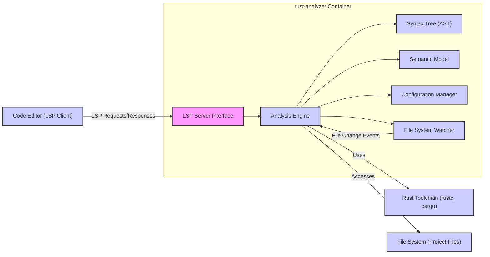
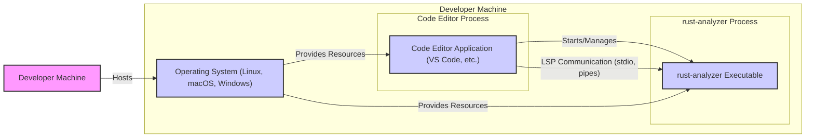
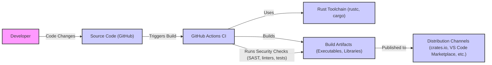

# BUSINESS POSTURE

rust-analyzer is a project that provides semantic analysis for the Rust programming language. It operates as a Language Server Protocol (LSP) server, offering features like code completion, error checking, go-to-definition, and refactoring to enhance the Rust development experience in code editors.

Business Priorities and Goals:

- Enhance developer productivity for Rust programmers by providing rich code intelligence features.
- Support the Rust ecosystem by offering a high-quality, open-source language server.
- Enable faster and more reliable Rust software development.
- Facilitate adoption of the Rust programming language by improving the developer experience.

Business Risks:

- Project adoption risk: If the language server is unreliable, slow, or lacks features, developers might not use it, hindering its goals.
- Community support risk: As an open-source project, its success depends on community contributions and maintenance. Lack of community engagement can lead to stagnation and security vulnerabilities.
- Security vulnerability risk: Vulnerabilities in the language server could potentially impact developer machines or the integrity of the code being developed.
- Performance risk: Poor performance of the language server can negatively impact developer experience and productivity.

# SECURITY POSTURE

Existing Security Controls:

- security control: Open Source Code: The project is open source, allowing for community review and scrutiny of the codebase. Implemented in: GitHub repository.
- security control: Code Review: Contributions are reviewed via pull requests. Implemented in: GitHub pull request process.
- security control: Automated Testing: The project likely has automated tests to ensure code quality and prevent regressions. Implemented in: CI pipelines (GitHub Actions).
- security control: Dependency Management: Using Cargo, Rust's package manager, for managing dependencies. Implemented in: `Cargo.toml` and `Cargo.lock` files.

Accepted Risks:

- accepted risk: Reliance on community contributions for security fixes.
- accepted risk: Potential for vulnerabilities to be introduced before being identified and patched due to the complexity of the codebase.
- accepted risk: Risk of supply chain vulnerabilities through dependencies, although Rust's dependency management and security practices mitigate this to some extent.

Recommended Security Controls:

- security control: Static Application Security Testing (SAST): Integrate SAST tools into the CI/CD pipeline to automatically scan the codebase for potential vulnerabilities.
- security control: Dependency Scanning: Implement dependency scanning to identify known vulnerabilities in project dependencies.
- security control: Fuzzing: Employ fuzzing techniques to discover unexpected behavior and potential vulnerabilities in code parsing and analysis logic.
- security control: Security Audits: Conduct periodic security audits by external security experts to identify and address potential security weaknesses.

Security Requirements:

- Authentication: Not directly applicable as rust-analyzer is a language server and does not handle user authentication in the traditional sense. However, secure communication channels might be relevant if rust-analyzer were to communicate over a network in certain configurations (though typically it communicates locally via pipes or stdio).
- Authorization: Not directly applicable in the traditional sense. Authorization in this context relates to ensuring rust-analyzer only accesses and processes files within the developer's project scope and respects file system permissions.
- Input Validation: Critical. rust-analyzer processes source code and project configurations provided by the user's editor. Robust input validation is essential to prevent vulnerabilities arising from maliciously crafted code or configuration files that could exploit parsing or analysis logic. This includes validating file paths, code syntax, and configuration parameters.
- Cryptography: Not a primary requirement for core functionality. Cryptography might be relevant if features like secure code signing or encrypted communication were to be added in the future, but it's not a core security requirement for the current scope of a language server.

# DESIGN

## C4 CONTEXT

Context Diagram Elements:

- Element:
    - Name: Developer
    - Type: Person
    - Description: A software developer using a code editor to write Rust code.
    - Responsibilities: Writes Rust code, uses code editor features to improve productivity.
    - Security controls: Responsible for securing their development environment, including their machine and access to project files.

- Element:
    - Name: Code Editor (VS Code, IntelliJ IDEA, etc.)
    - Type: Software System
    - Description: A code editor or Integrated Development Environment (IDE) used by developers to write and edit code. Examples include VS Code, IntelliJ IDEA, and others that support LSP.
    - Responsibilities: Provides a user interface for code editing, integrates with language servers via LSP, displays code intelligence features provided by language servers.
    - Security controls: Code editor is responsible for secure execution of extensions and language servers, and for protecting user data within the editor environment.

- Element:
    - Name: rust-analyzer
    - Type: Software System
    - Description: A language server that provides semantic analysis for the Rust programming language. It runs as a separate process and communicates with code editors via the Language Server Protocol (LSP).
    - Responsibilities: Provides code completion, error checking, go-to-definition, refactoring, and other code intelligence features to code editors. Analyzes Rust code and project files.
    - Security controls: Input validation of code and project files, secure processing of code, protection against vulnerabilities that could be exploited through malicious code or project configurations.

- Element:
    - Name: Rust Toolchain (rustc, cargo)
    - Type: Software System
    - Description: The official Rust toolchain, including the Rust compiler (`rustc`), package manager (`cargo`), and other tools necessary for building and managing Rust projects.
    - Responsibilities: Compiles Rust code, manages project dependencies, provides build and testing functionalities.
    - Security controls: Rust toolchain is responsible for the security of the compilation process and for mitigating vulnerabilities in compiled code.

- Element:
    - Name: File System (Project Files)
    - Type: Data Store
    - Description: The local file system where the developer's Rust project files are stored, including source code, configuration files, and dependencies.
    - Responsibilities: Stores project files, provides access to files for the code editor and rust-analyzer.
    - Security controls: File system permissions control access to project files. Developers are responsible for securing their file system and project files.

## C4 CONTAINER

Container Diagram Elements:

- Element:
    - Name: LSP Server Interface
    - Type: Component
    - Description: Handles communication with the code editor via the Language Server Protocol (LSP). Receives requests from the editor and sends responses back.
    - Responsibilities: LSP protocol handling, request parsing and routing, response formatting.
    - Security controls: Input validation of LSP requests to prevent injection attacks or denial-of-service. Rate limiting of requests if necessary.

- Element:
    - Name: Analysis Engine
    - Type: Component
    - Description: The core component of rust-analyzer. It performs semantic analysis of Rust code, builds semantic models, and provides code intelligence features.
    - Responsibilities: Parsing Rust code, building Abstract Syntax Trees (ASTs), creating semantic models, implementing code analysis logic for features like completion, diagnostics, and refactoring.
    - Security controls: Robust parsing and analysis logic to prevent vulnerabilities from malicious code. Input validation of code and project configurations. Memory safety to prevent memory-related vulnerabilities.

- Element:
    - Name: Syntax Tree (AST)
    - Type: Data Store (In-memory)
    - Description: In-memory representation of the parsed Rust code's syntax structure.
    - Responsibilities: Stores the AST for efficient code analysis.
    - Security controls: Memory safety in AST data structures and access methods.

- Element:
    - Name: Semantic Model
    - Type: Data Store (In-memory)
    - Description: In-memory representation of the semantic information derived from the Rust code, including types, scopes, and references.
    - Responsibilities: Stores semantic information for efficient code analysis and feature implementation.
    - Security controls: Memory safety in semantic model data structures and access methods.

- Element:
    - Name: Configuration Manager
    - Type: Component
    - Description: Manages configuration settings for rust-analyzer, including user preferences and project-specific settings.
    - Responsibilities: Loading, parsing, and applying configuration settings.
    - Security controls: Input validation of configuration files to prevent malicious configurations from affecting rust-analyzer's behavior or security. Secure handling of sensitive configuration data if any.

- Element:
    - Name: File System Watcher
    - Type: Component
    - Description: Monitors the file system for changes in project files. Notifies the Analysis Engine of file changes to trigger re-analysis.
    - Responsibilities: Watching project files for changes, efficiently detecting and reporting file modifications, deletions, and additions.
    - Security controls: Secure file system access and monitoring. Prevention of path traversal vulnerabilities if file paths are processed.

## DEPLOYMENT

Deployment Architecture: Standalone Application (Language Server)

rust-analyzer is typically deployed as a standalone language server application that is launched and managed by a code editor.

Deployment Diagram Elements:

- Element:
    - Name: Developer Machine
    - Type: Infrastructure
    - Description: The physical or virtual machine used by the developer for software development.
    - Responsibilities: Provides the hardware and operating system environment for running the code editor and rust-analyzer.
    - Security controls: Machine-level security controls, including operating system security, firewalls, and endpoint protection.

- Element:
    - Name: Operating System (Linux, macOS, Windows)
    - Type: Software
    - Description: The operating system running on the developer machine.
    - Responsibilities: Provides system resources, process management, file system access, and network communication.
    - Security controls: Operating system security features, including user access control, process isolation, and security updates.

- Element:
    - Name: Code Editor Application (VS Code, etc.)
    - Type: Software Application
    - Description: The code editor application that the developer uses. It acts as the LSP client and manages the rust-analyzer process.
    - Responsibilities: Launches and manages rust-analyzer, communicates with rust-analyzer via LSP, provides the user interface for code intelligence features.
    - Security controls: Code editor's security controls for managing extensions and language servers, secure communication channels, and protection against malicious extensions.

- Element:
    - Name: rust-analyzer Executable
    - Type: Software Application
    - Description: The compiled executable of the rust-analyzer language server.
    - Responsibilities: Provides language server functionalities, analyzes code, and responds to LSP requests from the code editor.
    - Security controls: Security controls implemented within the rust-analyzer application itself, as described in previous sections (input validation, memory safety, etc.).

## BUILD

Build Process Diagram Elements:

- Element:
    - Name: Developer
    - Type: Person
    - Description: Developers contributing code to the rust-analyzer project.
    - Responsibilities: Writing code, submitting pull requests, participating in code reviews.
    - Security controls: Secure development practices, code review process.

- Element:
    - Name: Source Code (GitHub)
    - Type: Code Repository
    - Description: The GitHub repository hosting the rust-analyzer source code.
    - Responsibilities: Version control, source code management, collaboration platform.
    - Security controls: GitHub's security features, access control, branch protection, vulnerability scanning.

- Element:
    - Name: GitHub Actions CI
    - Type: CI/CD System
    - Description: GitHub Actions is used for continuous integration and continuous delivery. Automates the build, test, and release process.
    - Responsibilities: Automated building, testing, and publishing of rust-analyzer. Running security checks during the build process.
    - Security controls: Secure CI/CD pipeline configuration, secrets management, build environment security, integration of security scanning tools (SAST, linters, dependency scanners).

- Element:
    - Name: Rust Toolchain (rustc, cargo)
    - Type: Build Tool
    - Description: The Rust toolchain used to compile and build rust-analyzer.
    - Responsibilities: Compiling Rust code, managing dependencies, creating build artifacts.
    - Security controls: Ensuring the integrity of the Rust toolchain itself. Using stable and trusted versions of the toolchain.

- Element:
    - Name: Build Artifacts (Executables, Libraries)
    - Type: Software Artifacts
    - Description: The compiled executables and libraries produced by the build process.
    - Responsibilities: Deployable and distributable software components of rust-analyzer.
    - Security controls: Security checks performed on build artifacts (SAST, linters, tests). Code signing of artifacts for integrity and authenticity (optional, but recommended for distribution).

- Element:
    - Name: Distribution Channels (crates.io, VS Code Marketplace, etc.)
    - Type: Distribution Platform
    - Description: Platforms used to distribute rust-analyzer to end-users, such as crates.io for Rust libraries and VS Code Marketplace for the VS Code extension.
    - Responsibilities: Distributing rust-analyzer to developers.
    - Security controls: Security of distribution platforms. Verifying the integrity and authenticity of packages before installation by users.

# RISK ASSESSMENT

Critical Business Processes:

- Developer Productivity: rust-analyzer directly impacts developer productivity by providing code intelligence features that speed up development and reduce errors.
- Rust Ecosystem Support: rust-analyzer is a key component of the Rust ecosystem, supporting the language's usability and adoption.

Data Sensitivity:

- Source Code: rust-analyzer processes source code, which can be highly sensitive and confidential, especially in commercial projects. While rust-analyzer itself does not store or transmit source code outside the developer's machine, vulnerabilities could potentially expose or compromise the code being analyzed.
- Project Configurations: Project configuration files (e.g., `Cargo.toml`) are also processed, which might contain sensitive information or influence the build process.
- Developer Environment: Indirectly, vulnerabilities in rust-analyzer could potentially compromise the developer's machine and environment.

Data Sensitivity Level: High. Source code and developer environments are highly sensitive assets.

# QUESTIONS & ASSUMPTIONS

Questions:

- Are there any specific compliance requirements that rust-analyzer needs to adhere to (e.g., security certifications, data privacy regulations)?
- Are there any plans to introduce network communication features in rust-analyzer in the future?
- What is the current process for handling security vulnerabilities reported by the community or discovered internally?
- Are there any specific performance requirements that have security implications (e.g., DoS resistance)?

Assumptions:

- BUSINESS POSTURE: The primary goal is to enhance developer productivity and support the Rust ecosystem. Security is important but not the absolute highest priority compared to functionality and performance for initial versions, but becomes increasingly critical as adoption grows.
- SECURITY POSTURE: The project follows standard open-source security practices, including code review and automated testing. There is an awareness of security risks, but dedicated security measures might be still evolving.
- DESIGN: rust-analyzer is primarily designed as a local language server application communicating with code editors via LSP. Deployment is assumed to be on developer machines, and the build process uses standard Rust tooling and CI practices.