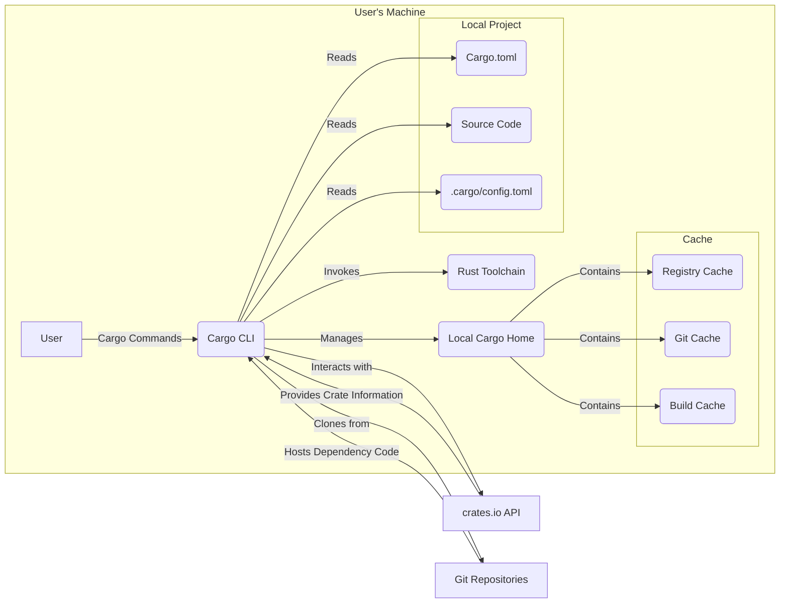
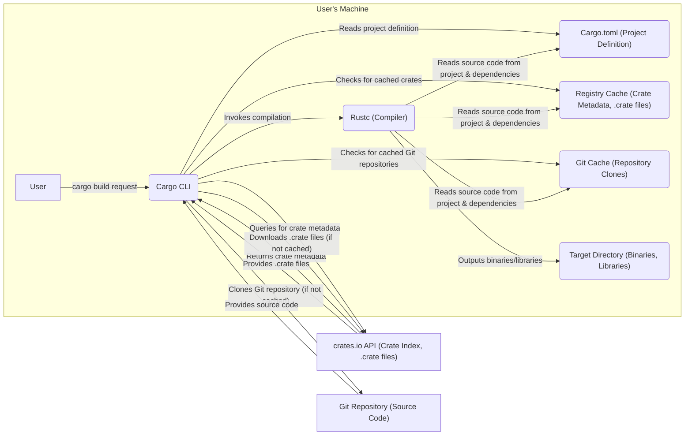

# Project Design Document: Cargo - The Rust Package Manager

**Version:** 1.1
**Date:** October 26, 2023
**Author:** AI Software Architect

## 1. Introduction

This document provides a detailed design overview of Cargo, the package manager for the Rust programming language. It outlines the key components, their interactions, and relevant security considerations. This document is intended to serve as a foundation for subsequent threat modeling activities by providing a clear understanding of the system's architecture and potential attack surfaces.

## 2. Goals and Objectives

The primary goals of Cargo are to:

* **Dependency Management:**  Efficiently manage project dependencies, including resolution, downloading, building, and linking of required libraries.
* **Build Automation:** Automate the process of compiling and linking Rust projects, handling build configurations and platform specifics.
* **Package Distribution:** Facilitate the creation and distribution of reusable Rust libraries (crates) through a central registry.
* **Project Management:** Provide a standardized set of tools for creating, building, testing, benchmarking, and running Rust projects.
* **Configuration Management:** Manage project metadata, dependencies, build profiles, and other settings through declarative configuration files.

## 3. High-Level Architecture

Cargo operates as a command-line tool that interacts with various external resources and the local file system. The following diagram illustrates the high-level architecture, highlighting key interactions:

**Components:**

* **User:** The developer interacting with Cargo through the command-line interface to manage Rust projects.
* **Cargo CLI:** The main executable responsible for parsing commands, managing dependencies, orchestrating builds, and interacting with external resources.
* **Local Project:** The directory containing all project-specific files.
    * **Cargo.toml:** The manifest file defining project metadata, dependencies, and build configurations.
    * **Source Code:** The Rust source code files of the project.
    * **.cargo/config.toml:**  Optional configuration file for Cargo-specific settings.
* **Local Cargo Home:** A directory (`~/.cargo` by default) where Cargo stores global configuration and caches.
    * **Cache:** Stores downloaded crates and build artifacts to speed up subsequent operations.
        * **Registry Cache:** Stores metadata and downloaded `.crate` files from `crates.io`.
        * **Git Cache:** Stores cloned Git repositories for Git-based dependencies.
        * **Build Cache:** Stores intermediate build artifacts to avoid redundant compilations.
* **Rust Toolchain:** The collection of tools required to compile and work with Rust code, including `rustc`, `cargo`, `rustup`, etc.
* **crates.io API:** The application programming interface provided by `crates.io` for searching, downloading, and retrieving information about Rust crates.
* **Git Repositories:** External repositories (e.g., on GitHub, GitLab) that host Rust dependencies specified via Git URLs.

## 4. Detailed Component Description

This section provides a more detailed description of the key components and their responsibilities, focusing on aspects relevant to security.

### 4.1. Cargo CLI

* **Functionality:**
    * **Command Parsing:** Interprets user commands and options.
    * **Manifest Processing:** Reads and validates the `Cargo.toml` file, including dependency declarations and build settings.
    * **Dependency Resolution:**  Determines the exact versions of all direct and transitive dependencies required for the project.
    * **Registry Interaction:** Communicates with the `crates.io API` to search for and download crates.
    * **Git Interaction:** Clones Git repositories specified as dependencies.
    * **Build System Orchestration:** Invokes the Rust compiler (`rustc`) with appropriate arguments and manages the build process.
    * **Cache Management:** Reads from and writes to the local Cargo caches.
    * **Project Management Tasks:** Supports commands for creating new projects, running tests, generating documentation, and publishing crates.
* **Key Responsibilities:**
    * Ensuring the integrity and consistency of the build process.
    * Securely downloading and managing dependencies.
    * Enforcing project configurations and constraints.
    * Protecting user data and the local environment.

### 4.2. Local Project Files

* **Functionality:**
    * **Project Definition:** `Cargo.toml` defines the project's name, version, authors, license, dependencies, and build profiles.
    * **Source Code Storage:** Contains the Rust source code that will be compiled.
    * **Configuration Overrides:** `.cargo/config.toml` allows users to override default Cargo behavior, such as registry URLs or build settings.
* **Key Responsibilities:**
    * Accurately representing the project's structure and dependencies.
    * Providing the codebase to be built.
    * Allowing for customization of the build process.
    * **Security Note:** Maliciously crafted `Cargo.toml` files or source code can introduce vulnerabilities.

### 4.3. Local Cargo Home

* **Functionality:**
    * **Global Configuration Storage:** Stores user-specific Cargo settings.
    * **Caching:** Provides local storage for downloaded crates and build artifacts to optimize performance.
        * **Registry Cache:** Stores `.crate` files and index information from `crates.io`.
        * **Git Cache:** Stores full clones of Git repositories.
        * **Build Cache:** Stores intermediate compilation outputs.
* **Key Responsibilities:**
    * Optimizing build times by reusing downloaded and built artifacts.
    * Providing a central location for global Cargo settings.
    * **Security Note:**  The cache can be a target for attacks aiming to inject malicious code or influence the build process.

### 4.4. Rust Toolchain

* **Functionality:**
    * **Compilation:** The `rustc` compiler translates Rust source code into machine code.
    * **Standard Library:** Provides core functionalities and data structures for Rust programs.
    * **Other Tools:** Includes tools like `rustfmt` for code formatting and `clippy` for static analysis.
* **Key Responsibilities:**
    * Securely compiling Rust code, enforcing language safety guarantees.
    * Providing the necessary tools for developing and building Rust applications.
    * **Security Note:** Vulnerabilities in the Rust toolchain itself could have significant security implications.

### 4.5. crates.io API

* **Functionality:**
    * **Crate Index:** Provides an index of all published crates and their versions.
    * **Crate Download:** Allows downloading `.crate` files containing the source code and metadata of published crates.
    * **Crate Information Retrieval:** Enables fetching metadata about specific crates, such as dependencies and authors.
    * **Publishing:** Allows registered users to upload new crates or new versions of existing crates.
* **Key Responsibilities:**
    * Serving as the central repository for Rust packages.
    * Ensuring the availability and integrity of published crates.
    * Authenticating publishers and managing crate ownership.
    * **Security Note:**  The security of `crates.io` is critical to the security of the entire Rust ecosystem.

### 4.6. Git Repositories

* **Functionality:**
    * **Code Hosting:** Stores the source code of Rust dependencies.
    * **Version Control:** Tracks changes to the codebase over time.
* **Key Responsibilities:**
    * Providing an alternative source for dependencies not available on `crates.io`.
    * Enabling the use of specific versions or branches of dependencies.
    * **Security Note:** The security of Git repositories used as dependencies is the responsibility of the repository owners.

## 5. Data Flow Diagram

The following diagram illustrates the key data flows within the Cargo system for a typical dependency resolution and build process, highlighting the type of data exchanged:

**Data Flow Description:**

1. The **User** initiates a build process using the `cargo build` command.
2. The **Cargo CLI** reads the **Cargo.toml (Project Definition)** to understand project dependencies.
3. The **Cargo CLI** queries the **crates.io API** for **Crate Metadata** to resolve dependency versions.
4. The **crates.io API** returns the requested **Crate Metadata**.
5. The **Cargo CLI** checks the **Registry Cache** for already downloaded **.crate files**.
6. If `.crate` files are not found in the cache, the **Cargo CLI** downloads them from the **crates.io API**.
7. The **crates.io API** provides the **.crate files**.
8. If dependencies are specified via Git, the **Cargo CLI** checks the **Git Cache** for existing **Repository Clones**.
9. If the repository is not cached, the **Cargo CLI** clones the necessary **Git Repository**.
10. The **Git Repository** provides the **Source Code**.
11. The **Cargo CLI** invokes the **Rustc (Compiler)**.
12. **Rustc** reads **Source Code** from the project and dependencies (from `Cargo.toml`, **Registry Cache**, and **Git Cache**).
13. **Rustc** outputs the compiled **Binaries/Libraries** to the **Target Directory**.

## 6. Security Considerations

This section expands on the security considerations, providing more specific examples of potential threats and vulnerabilities.

* **Dependency Vulnerabilities:**
    * **Supply Chain Attacks:** A malicious actor could publish a crate to `crates.io` containing malware or vulnerabilities that are then included as dependencies in other projects. Example: A crate with a popular utility function is compromised to exfiltrate environment variables.
    * **Typosquatting:** Attackers create crates with names similar to popular ones, hoping users will accidentally depend on the malicious crate. Example: A crate named "reuests" instead of "requests" containing malicious code.
    * **Dependency Confusion:**  If a private dependency has the same name as a public one, Cargo might be tricked into downloading the malicious public crate.
    * **Outdated Dependencies:** Projects using older versions of dependencies with known vulnerabilities are susceptible to exploits. Cargo's outdated dependency warnings should be heeded.
* **crates.io Security:**
    * **Account Takeover:** If a publisher's account is compromised (e.g., through weak passwords or phishing), attackers can upload malicious crate versions.
    * **Code Injection/Cross-Site Scripting (XSS):** Vulnerabilities in the `crates.io` web platform could allow attackers to inject malicious code or scripts.
    * **Denial of Service (DoS):** Attackers could overload the `crates.io` servers, preventing users from downloading crates.
* **Git Dependency Security:**
    * **Repository Compromise:** If a Git repository used as a dependency is compromised, malicious code can be introduced into projects depending on it.
    * **Man-in-the-Middle (MitM) Attacks:** During Git clone operations, an attacker could intercept the connection and inject malicious code. Using SSH for Git remotes helps mitigate this.
    * **Submodule Hijacking:** If a dependency uses Git submodules, attackers could compromise the submodule repository.
* **Local Cache Security:**
    * **Cache Poisoning:** An attacker gaining access to the local Cargo cache could replace legitimate crates with malicious versions. This could happen if user permissions are not properly managed.
    * **Path Traversal Vulnerabilities:** If Cargo doesn't properly sanitize file paths when accessing the cache, attackers might be able to access or modify files outside the cache directory.
* **Build Script Security:**
    * **Arbitrary Code Execution:** Build scripts (`build.rs`) can execute arbitrary code during the build process. Malicious dependencies could include build scripts that compromise the user's system.
    * **Information Disclosure:** Build scripts might unintentionally expose sensitive information.
* **Configuration Security:**
    * **Insecure Registry Configuration:**  Pointing Cargo to a malicious or compromised registry in `.cargo/config.toml`.
    * **Environment Variable Injection:** Malicious actors could try to influence the build process by setting environment variables that Cargo or build scripts rely on.
* **Cargo CLI Security:**
    * **Command Injection:** Vulnerabilities in the Cargo CLI could allow attackers to execute arbitrary commands on the user's system by crafting malicious input.
    * **Privilege Escalation:** If Cargo requires elevated privileges for certain operations, vulnerabilities could be exploited to gain unauthorized access.
* **Denial of Service (Local):**
    * Maliciously crafted `Cargo.toml` files could cause excessive resource consumption during dependency resolution or building, leading to a local DoS.

## 7. Assumptions and Constraints

* **Assumptions:**
    * Users have a properly installed and configured Rust toolchain managed by `rustup`.
    * Network connectivity is generally available and reliable for downloading dependencies.
    * `crates.io` and reputable Git hosting providers have baseline security measures in place.
    * Users exercise caution when adding dependencies and review their `Cargo.toml` file.
* **Constraints:**
    * Cargo's primary focus is on managing Rust dependencies and builds.
    * Maintaining backward compatibility is a consideration when introducing new features or security enhancements.
    * Performance and efficiency in dependency resolution and building are critical for user experience.

## 8. Future Considerations

* **Software Bill of Materials (SBOM) Generation:**  Integrating the ability to generate SBOMs to track the components included in a project for better vulnerability management.
* **Enhanced Dependency Auditing and Vulnerability Scanning:**  Improving tools and features for identifying and mitigating known vulnerabilities in project dependencies.
* **Stronger Authentication and Authorization for `crates.io`:** Implementing more robust mechanisms to protect publisher accounts and prevent unauthorized crate uploads.
* **Sandboxing or Isolation for Build Scripts:** Exploring ways to isolate build script execution to limit the potential impact of malicious scripts.
* **Formal Verification of Critical Components:** Applying formal methods to verify the correctness and security of core Cargo functionalities, especially the dependency resolution algorithm.

This improved document provides a more detailed and nuanced understanding of the Cargo project's design, making it a more effective foundation for threat modeling activities. The expanded descriptions of components, data flows, and security considerations offer a clearer picture of potential attack surfaces and vulnerabilities.
