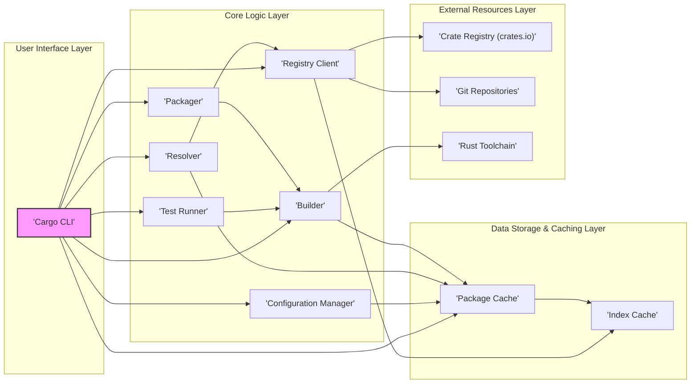
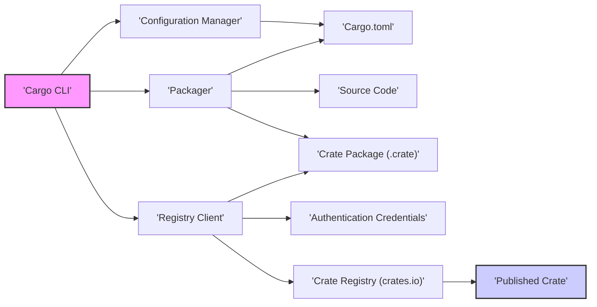

## Project Design Document: Cargo - Rust Package Manager

**Project Name:** Cargo

**Project Repository:** [https://github.com/rust-lang/cargo](https://github.com/rust-lang/cargo)

**Document Version:** 1.1
**Date:** 2023-10-27
**Author:** Gemini (AI Language Model)

### 1. Project Overview

Cargo is the official package manager and build system for the Rust programming language. It is designed to streamline and automate various aspects of Rust project development, enhancing developer productivity and ensuring project consistency. Key functionalities include:

*   **Dependency Management:**  Automated handling of project dependencies (crates). This includes:
    *   Downloading required crates from registries (e.g., crates.io) or git repositories.
    *   Resolving complex dependency graphs, ensuring version compatibility and avoiding conflicts.
    *   Managing different dependency types (e.g., build dependencies, dev dependencies).
*   **Build Automation:**  Compilation and linking of Rust code. This encompasses:
    *   Compiling Rust source code using the `rustc` compiler.
    *   Managing different build profiles (e.g., debug, release) with optimized settings.
    *   Handling build scripts (`build.rs`) for pre- and post-build tasks.
    *   Incremental compilation to speed up rebuilds by only recompiling changed code.
*   **Testing:**  Built-in support for running various types of tests:
    *   Unit tests (testing individual functions or modules).
    *   Integration tests (testing interactions between different parts of the project).
    *   Doctests (tests embedded within documentation comments).
    *   Benchmark tests (measuring performance).
*   **Project Creation and Management:**  Tools for project initialization and ongoing management:
    *   Generating new project skeletons with predefined directory structures and basic configuration.
    *   Managing project metadata and dependencies through `Cargo.toml` manifest files.
    *   Updating dependencies to newer versions.
*   **Crate Publishing:**  Facilitating the distribution of Rust libraries (crates):
    *   Packaging crates into `.crate` files for distribution.
    *   Publishing crates to registries like crates.io, making them available to the Rust community.
    *   Managing crate versions and publishing updates.
*   **Documentation Generation:**  Integration with `rustdoc` for generating project documentation:
    *   Automatically generating HTML documentation from Rust source code comments.
    *   Serving documentation locally for development and preview.

Cargo is an indispensable tool for Rust developers, simplifying project setup, dependency management, building, testing, and distribution. This document details Cargo's design to support comprehensive threat modeling and security analysis.

### 2. System Architecture

Cargo's architecture is modular, composed of distinct components that collaborate to deliver its functionalities. The following diagram illustrates the high-level architecture and component interactions:

### 3. Component Descriptions

This section provides a detailed description of each component within Cargo's architecture, outlining their responsibilities and functionalities.

*   **'Cargo CLI'**:
    *   **Functionality:** The primary interface for user interaction with Cargo.
    *   **Responsibilities:**
        *   Command parsing: Interprets user commands entered in the terminal (e.g., `cargo build`, `cargo test`, `cargo publish`).
        *   Command orchestration:  Delegates tasks to the appropriate core components based on the parsed command.
        *   Input/Output handling: Manages user input and displays output, including progress updates, error messages, and build results.
        *   Argument parsing: Processes command-line arguments and options provided by the user.
    *   **Security Relevance:** Entry point for user-provided input, making it a potential target for command injection or argument injection vulnerabilities if not properly validated.

*   **'Configuration Manager'**:
    *   **Functionality:** Manages all configuration settings for Cargo and projects.
    *   **Responsibilities:**
        *   `Cargo.toml` parsing: Reads and parses `Cargo.toml` manifest files to extract project metadata, dependencies, and build configurations.
        *   Global configuration loading: Loads global Cargo configuration settings from user-specific configuration files.
        *   Profile management: Handles different build profiles (debug, release, custom profiles) and their associated settings.
        *   Configuration provision: Provides configuration data to other Cargo components as needed.
    *   **Security Relevance:**  Parsing `Cargo.toml` involves processing user-defined data, which could be a source of vulnerabilities if parsing is not robust or if malicious configurations can be crafted. Handling of sensitive information in configuration (though discouraged) is also a concern.

*   **'Resolver'**:
    *   **Functionality:**  Solves the dependency graph for a project, ensuring compatible versions are selected.
    *   **Responsibilities:**
        *   Dependency specification parsing: Reads dependency declarations from `Cargo.toml`.
        *   Index querying: Queries the 'Index Cache' and 'Registry Client' to retrieve information about available crate versions and their dependencies.
        *   Version resolution: Applies dependency resolution algorithms (e.g., semver compatibility) to select a consistent set of dependency versions that satisfy all constraints.
        *   Feature resolution: Resolves feature flags and conditional dependencies based on target platforms and user-specified features.
        *   Dependency graph construction: Builds a dependency graph representing the resolved dependencies and their relationships.
    *   **Security Relevance:**  Dependency resolution involves fetching and processing data from external registries. Vulnerabilities in the resolution algorithm or in handling registry responses could lead to dependency confusion or the introduction of malicious dependencies.

*   **'Builder'**:
    *   **Functionality:**  Compiles Rust code and manages the build process.
    *   **Responsibilities:**
        *   Compilation orchestration: Invokes the 'Rust Toolchain' (specifically `rustc`) to compile Rust source code.
        *   Build script execution: Executes `build.rs` scripts to perform pre-build and post-build tasks.
        *   Incremental build management: Tracks changes and performs incremental compilation to optimize build times.
        *   Artifact generation: Produces build artifacts (executables, libraries, object files) in the target directory.
        *   Build profile application: Applies build profile settings (optimization levels, debug symbols, etc.) during compilation.
    *   **Security Relevance:**  Build scripts (`build.rs`) are executed as code and can perform arbitrary actions. Malicious or vulnerable build scripts pose a significant security risk. Interaction with the 'Rust Toolchain' and compiler vulnerabilities are also potential concerns.

*   **'Test Runner'**:
    *   **Functionality:**  Discovers and executes tests within a Rust project.
    *   **Responsibilities:**
        *   Test discovery: Identifies test functions and test modules within the project's source code.
        *   Test execution: Runs discovered tests and captures test output.
        *   Test reporting: Provides test results and reports (pass/fail, execution time, etc.).
        *   Integration with 'Builder': Relies on the 'Builder' to compile test code before execution.
    *   **Security Relevance:**  Test code, while intended for testing, can still contain vulnerabilities or be used to trigger unexpected behavior. The test runner itself should be robust and prevent test code from escaping its intended sandbox.

*   **'Packager'**:
    *   **Functionality:**  Packages crates for publishing to registries.
    *   **Responsibilities:**
        *   Crate packaging: Creates `.crate` files containing source code, metadata, and documentation.
        *   Metadata validation: Verifies crate metadata (e.g., in `Cargo.toml`) for correctness and completeness.
        *   Package verification: Performs checks on the crate package content before publishing.
    *   **Security Relevance:**  The packaging process needs to ensure the integrity and authenticity of crates. Malicious actors could attempt to inject malicious code during packaging or manipulate crate metadata.

*   **'Registry Client'**:
    *   **Functionality:**  Handles communication with crate registries (like crates.io).
    *   **Responsibilities:**
        *   Index download: Downloads crate index information from registries.
        *   Crate download: Downloads crate packages from registries.
        *   Registry API interaction: Interacts with registry APIs for searching, publishing, and other registry operations.
        *   Authentication and authorization: Handles authentication and authorization for accessing and publishing to registries.
        *   Protocol handling: Supports different registry protocols (e.g., HTTPS, git).
    *   **Security Relevance:**  The 'Registry Client' interacts with external networks and downloads code from potentially untrusted sources. It is crucial to ensure secure communication (HTTPS), validate downloaded data, and handle authentication credentials securely. Vulnerabilities in the registry client could lead to man-in-the-middle attacks, malicious crate downloads, or credential compromise.

*   **'Package Cache'**:
    *   **Functionality:**  Local storage for downloaded crate packages to avoid redundant downloads.
    *   **Responsibilities:**
        *   Package storage: Stores downloaded `.crate` files on the local file system.
        *   Cache lookup: Retrieves packages from the cache when needed.
        *   Cache invalidation: Manages cache invalidation and updates to ensure cached packages are up-to-date.
        *   Cache management: Handles cache size and cleanup.
    *   **Security Relevance:**  The 'Package Cache' is a local storage area. Cache poisoning (replacing legitimate packages with malicious ones) is a potential threat. File system permissions and access control for the cache directory are important security considerations.

*   **'Index Cache'**:
    *   **Functionality:**  Local cache for crate registry index information to speed up dependency resolution.
    *   **Responsibilities:**
        *   Index storage: Stores downloaded registry index data locally.
        *   Cache lookup: Retrieves index data from the cache.
        *   Index update: Periodically updates the index cache from registries.
        *   Cache management: Handles cache size and cleanup.
    *   **Security Relevance:** Similar to the 'Package Cache', the 'Index Cache' is susceptible to cache poisoning. If malicious index data is injected into the cache, it could lead to the resolver selecting malicious dependencies.

*   **'Crate Registry (crates.io)'**:
    *   **Functionality:**  The primary public registry for Rust crates.
    *   **Responsibilities:**
        *   Crate hosting: Stores crate index information and crate packages.
        *   Crate distribution: Provides an API for searching, downloading, and publishing crates.
        *   Metadata management: Manages crate metadata and ownership information.
        *   Security measures: Implements security measures to protect against malicious crates and registry compromise.
    *   **Security Relevance:**  As a central point for crate distribution, crates.io is a critical component in the Rust ecosystem's security. Compromise of crates.io could have widespread impact.

*   **'Git Repositories'**:
    *   **Functionality:**  Source for dependencies specified via git URLs in `Cargo.toml`.
    *   **Responsibilities:**
        *   Repository access: Allows Cargo to clone and fetch code from git repositories.
        *   Revision management: Supports specifying specific git revisions (branches, tags, commits) as dependencies.
    *   **Security Relevance:**  Dependencies fetched from git repositories are subject to the security of the git repository itself. Compromised git repositories can introduce malicious code. Cargo's interaction with git needs to be secure to prevent vulnerabilities related to git commands or repository access.

*   **'Rust Toolchain'**:
    *   **Functionality:**  The complete set of tools for Rust development.
    *   **Components relevant to Cargo:**
        *   `rustc`: The Rust compiler (essential for building Rust code).
        *   `rustdoc`: Documentation generator (used by Cargo for documentation tasks).
    *   **Security Relevance:**  Vulnerabilities in the 'Rust Toolchain' components, especially `rustc`, can have significant security implications for Cargo and Rust projects built with it. Cargo relies on the toolchain's integrity and security.

### 4. Data Flow Diagram - 'cargo publish' Operation

The following diagram illustrates the data flow during a `cargo publish` operation, highlighting the steps involved in publishing a crate to a registry.

**Data Flow Steps for `cargo publish`:**

1.  **'Cargo CLI'** receives the `cargo publish` command from the user.
2.  **'Cargo CLI'** invokes the **'Configuration Manager'** to load project configuration.
3.  **'Configuration Manager'** reads configuration from **'Cargo.toml'**.
4.  **'Cargo CLI'** invokes the **'Packager'** to create the crate package.
5.  **'Packager'** reads metadata from **'Cargo.toml'**.
6.  **'Packager'** gathers **'Source Code'** and other necessary files.
7.  **'Packager'** creates the **'Crate Package (.crate)'** file.
8.  **'Cargo CLI'** invokes the **'Registry Client'** to publish the crate.
9.  **'Registry Client'** receives the **'Crate Package (.crate)'**.
10. **'Registry Client'** retrieves **'Authentication Credentials'** (e.g., API token).
11. **'Registry Client'** communicates with the **'Crate Registry (crates.io)'**, providing the crate package and credentials.
12. **'Crate Registry (crates.io)'** validates the package and credentials and publishes the **'Published Crate'**.

### 5. Key Technologies Used

Cargo leverages a range of technologies to implement its functionalities:

*   **Core Language:**
    *   **Rust Programming Language:** Cargo is primarily implemented in Rust, benefiting from its safety, performance, and concurrency features.
*   **Data Serialization and Configuration:**
    *   **TOML (Tom's Obvious, Minimal Language):** Used for `Cargo.toml` manifest files and configuration files due to its readability and ease of use for configuration data.
*   **Version Control:**
    *   **Git:**  Essential for interacting with git repositories for dependency fetching, registry index updates, and potentially for registry implementations.
*   **Networking:**
    *   **HTTP/HTTPS:** Used for secure communication with crate registries (crates.io) and downloading crates and index data.
*   **File System Interaction:**
    *   **Operating System File System APIs:** Cargo extensively uses file system operations for managing project files, caches, build artifacts, and interacting with the local file system.
*   **Command-Line Interface:**
    *   **CLI Parsing Libraries (e.g., `clap`):** Used for building a robust and user-friendly command-line interface for Cargo.
*   **Compression and Archiving:**
    *   **Libraries for handling `.crate` files (e.g., `tar`, `gzip` or similar Rust crates):** Used for creating and extracting crate packages.

### 6. Security Considerations for Threat Modeling (Detailed)

Threat modeling for Cargo should consider the following security areas in detail, exploring potential threats and vulnerabilities within each:

*   **Dependency Supply Chain Security:**
    *   **Threat:** **Malicious Crates (Dependency Poisoning):**
        *   **Vulnerability:**  Malicious actors could publish crates containing malware, backdoors, or vulnerabilities to public or private registries.
        *   **Impact:**  Projects depending on these crates could be compromised, leading to data breaches, system compromise, or supply chain attacks.
        *   **Mitigation:**  Crate registries should implement security scanning and vetting processes. Users should practice dependency review, use dependency vulnerability scanners, and potentially use private registries with curated crates.
    *   **Threat:** **Dependency Confusion/Typosquatting:**
        *   **Vulnerability:**  Attackers register crate names similar to popular crates (typosquatting) or exploit namespace confusion to trick users into downloading malicious crates instead of legitimate ones.
        *   **Impact:**  Unintentional inclusion of malicious dependencies, leading to similar impacts as dependency poisoning.
        *   **Mitigation:**  Careful dependency name verification, using tools to detect typosquatting attempts, and relying on trusted registries.
    *   **Threat:** **Registry Compromise:**
        *   **Vulnerability:**  A crate registry (like crates.io) could be compromised, allowing attackers to inject malicious crates, modify existing crates, or tamper with index data.
        *   **Impact:**  Widespread distribution of malicious crates to a large number of users, potentially affecting the entire Rust ecosystem.
        *   **Mitigation:**  Robust security measures for crate registries, including access control, intrusion detection, security audits, and incident response plans.
    *   **Threat:** **Git Repository Compromise (for Git Dependencies):**
        *   **Vulnerability:**  Git repositories used as dependency sources could be compromised, allowing attackers to inject malicious code into specific branches or tags.
        *   **Impact:**  Projects depending on compromised git repositories could be vulnerable.
        *   **Mitigation:**  Verifying the integrity of git repositories, using specific commit hashes instead of branches or tags where possible, and monitoring repository security.

*   **Build Process Security:**
    *   **Threat:** **Malicious Build Scripts (`build.rs`):**
        *   **Vulnerability:**  `build.rs` scripts are executed during the build process and can contain arbitrary code. Malicious crates could include build scripts that execute harmful commands on the user's system.
        *   **Impact:**  System compromise, data exfiltration, denial of service, or other malicious actions during the build process.
        *   **Mitigation:**  Sandboxing or isolation of build script execution, static analysis of build scripts, and user awareness of the risks associated with build scripts from untrusted sources. Cargo's future improvements might include features to restrict build script capabilities.
    *   **Threat:** **Compiler Vulnerabilities (`rustc`):**
        *   **Vulnerability:**  Bugs or vulnerabilities in the Rust compiler (`rustc`) could be exploited during the build process, potentially leading to arbitrary code execution or other security issues.
        *   **Impact:**  Compiler-level vulnerabilities are generally severe and could affect any Rust project built with a vulnerable compiler version.
        *   **Mitigation:**  Regularly updating the Rust toolchain to the latest stable version, reporting and patching compiler vulnerabilities promptly by the Rust team.
    *   **Threat:** **Injection Attacks (Build Configuration):**
        *   **Vulnerability:**  If Cargo processes untrusted input during build configuration (e.g., environment variables, command-line arguments), it could be vulnerable to injection attacks (e.g., command injection, path injection).
        *   **Impact:**  Arbitrary command execution, file system access, or other unintended actions during the build process.
        *   **Mitigation:**  Careful sanitization and validation of all external input processed during build configuration.

*   **Configuration Security:**
    *   **Threat:** **`Cargo.toml` Parsing Vulnerabilities:**
        *   **Vulnerability:**  Parsing `Cargo.toml` files could be vulnerable to parsing errors, buffer overflows, or other vulnerabilities if the parser is not robust.
        *   **Impact:**  Denial of service, unexpected behavior, or potentially code execution if parsing vulnerabilities are exploitable.
        *   **Mitigation:**  Robust and well-tested TOML parsing libraries, input validation, and fuzzing of the `Cargo.toml` parser.
    *   **Threat:** **Secrets Exposure in Configuration:**
        *   **Vulnerability:**  Accidental or intentional inclusion of secrets (API keys, passwords) in `Cargo.toml` or other configuration files, especially if these files are committed to version control.
        *   **Impact:**  Exposure of sensitive credentials, leading to unauthorized access or compromise of associated accounts or systems.
        *   **Mitigation:**  Strongly discourage storing secrets in configuration files. Use environment variables, dedicated secret management tools, or secure credential storage mechanisms instead.

*   **Local File System Security:**
    *   **Threat:** **Cache Poisoning (Package & Index Cache):**
        *   **Vulnerability:**  Attackers could attempt to replace legitimate packages or index data in the 'Package Cache' or 'Index Cache' with malicious content.
        *   **Impact:**  Subsequent Cargo operations could use poisoned cache data, leading to the use of malicious dependencies or incorrect dependency resolution.
        *   **Mitigation:**  File system permissions to protect cache directories, integrity checks for cached data, and potentially cryptographic signing of cached packages in the future.
    *   **Threat:** **Directory Traversal:**
        *   **Vulnerability:**  Vulnerabilities in file path handling within Cargo could allow directory traversal attacks, enabling access to files or directories outside of the intended project scope.
        *   **Impact:**  Unauthorized file access, information disclosure, or potentially file manipulation.
        *   **Mitigation:**  Secure file path handling practices, input validation, and using safe file system APIs.
    *   **Threat:** **Permissions Issues (Cache & Project Directories):**
        *   **Vulnerability:**  Incorrect file permissions on cache directories or project directories could allow unauthorized users to modify or access files, potentially leading to security issues.
        *   **Impact:**  Cache poisoning, unauthorized code modification, or information disclosure.
        *   **Mitigation:**  Setting appropriate file system permissions for cache and project directories, following least privilege principles.

*   **Network Security:**
    *   **Threat:** **Man-in-the-Middle (MITM) Attacks (Registry Communication):**
        *   **Vulnerability:**  If communication with crate registries is not properly secured (e.g., using HTTP instead of HTTPS), it could be vulnerable to MITM attacks, allowing attackers to intercept and modify network traffic.
        *   **Impact:**  Malicious crate injection, index data tampering, or credential theft during registry communication.
        *   **Mitigation:**  Enforce HTTPS for all communication with crate registries. Implement certificate pinning or other mechanisms to enhance TLS security.
    *   **Threat:** **Denial of Service (DoS) Attacks (Registry or Client):**
        *   **Vulnerability:**  Crate registries or Cargo clients could be targeted by DoS attacks, making them unavailable or unresponsive.
        *   **Impact:**  Disruption of crate downloads, publishing, and overall Rust development workflow.
        *   **Mitigation:**  Rate limiting, traffic filtering, and robust infrastructure for crate registries. For clients, resilient network handling and potentially caching mechanisms to mitigate registry unavailability.

This detailed breakdown of security considerations provides a more comprehensive basis for threat modeling Cargo and identifying specific areas for security improvements and mitigations.