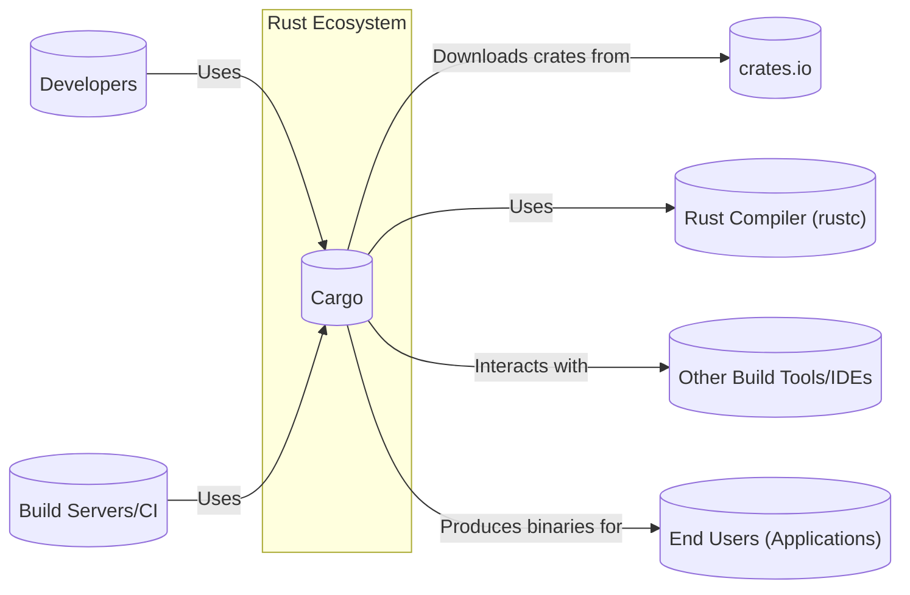
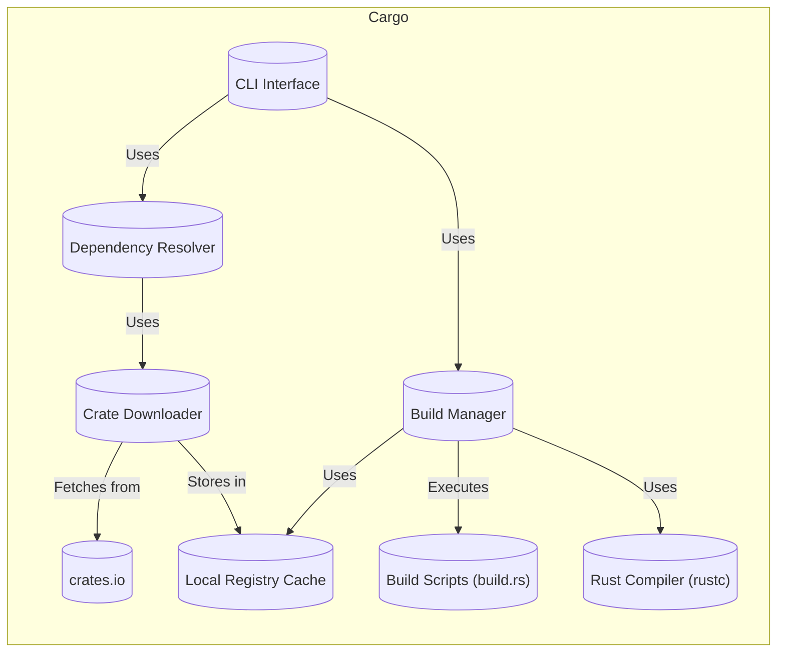
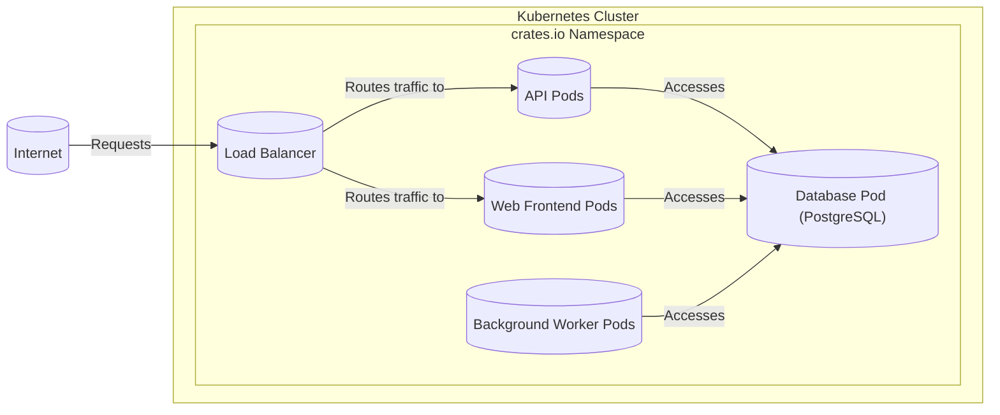
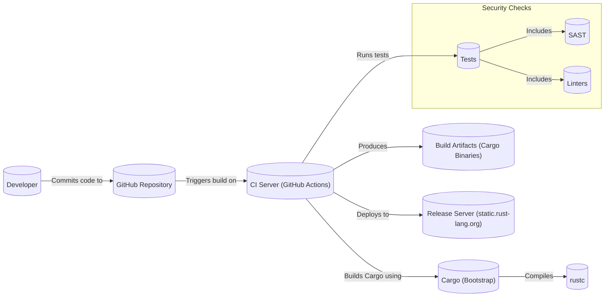

Okay, let's create a design document for the Rust Cargo project, keeping in mind its purpose and potential security considerations.

# BUSINESS POSTURE

Cargo is the package manager and build system for the Rust programming language.  It's a critical piece of infrastructure for the entire Rust ecosystem.

Priorities and Goals:

*   Provide a reliable and reproducible way to manage Rust project dependencies.
*   Offer a standardized and easy-to-use build process for Rust projects.
*   Facilitate the sharing and distribution of Rust libraries (crates) through crates.io.
*   Ensure the integrity and security of the build process and dependency resolution.
*   Maintain backward compatibility and stability for existing projects.
*   Support a wide range of platforms and architectures.

Business Risks:

*   Malicious Crates: The biggest risk is the potential for malicious code to be introduced into the ecosystem through compromised or intentionally harmful crates on crates.io. This could lead to supply chain attacks affecting numerous projects.
*   Dependency Confusion:  Attackers could publish crates with names similar to internal or private crates, tricking Cargo into downloading the malicious version.
*   Build System Vulnerabilities:  Exploits in Cargo itself could allow attackers to execute arbitrary code during the build process.
*   Denial of Service:  Attacks against crates.io or other infrastructure could prevent developers from accessing necessary dependencies, halting development.
*   Compromised Developer Accounts:  If a maintainer's account on crates.io is compromised, an attacker could publish malicious versions of legitimate crates.
*   Data Exfiltration: Sensitive information (API keys, credentials) accidentally included in a crate could be exposed.

# SECURITY POSTURE

Existing Security Controls:

*   security control: Crates.io Security Policies: Crates.io has policies in place to prevent obviously malicious crates and to respond to reported vulnerabilities. (Described in crates.io documentation and policies).
*   security control: Code Signing (limited): While Cargo doesn't fully enforce code signing for all crates, there are mechanisms like `cargo-crev` for community-driven code reviews and trust management. (Described in `cargo-crev` documentation).
*   security control: Two-Factor Authentication (2FA): Crates.io supports and encourages 2FA for maintainer accounts. (Described in crates.io account settings).
*   security control: Sandboxing (limited): Cargo's build process has some level of isolation, but it's not a complete sandbox. Build scripts (`build.rs`) can execute arbitrary code. (Described in Cargo documentation).
*   security control: Dependency Resolution Algorithm: Cargo uses a SAT solver to resolve dependencies, aiming for consistent and predictable results. (Described in Cargo's source code and documentation).
*   security control: Checksums: Cargo verifies the checksums of downloaded crates to ensure integrity. (Described in Cargo's source code and documentation).
*   security control: HTTPS: Communication with crates.io is secured using HTTPS. (Observed in network traffic).
*   security control: Regular Security Audits: The Rust project, including Cargo, undergoes regular security audits. (Announced on the Rust blog and security advisories).

Accepted Risks:

*   accepted risk: Build Script Execution: Cargo allows arbitrary code execution within build scripts (`build.rs`). This is a known risk, mitigated by community vigilance and the expectation that maintainers review build scripts.
*   accepted risk: Lack of Universal Code Signing: Not all crates are digitally signed by their authors. This is mitigated by community review tools and the checksum verification.
*   accepted risk: Dependency Vulnerabilities: Cargo cannot guarantee that all dependencies are free of vulnerabilities. This is a general problem in software development, mitigated by prompt updates and security advisories.

Recommended Security Controls:

*   Implement mandatory code signing for all crates published to crates.io.
*   Enhance sandboxing capabilities for build scripts to limit their access to the system.
*   Integrate static analysis tools into the publishing process to automatically detect potential vulnerabilities.
*   Implement a dependency confusion detection mechanism.
*   Provide built-in support for Software Bill of Materials (SBOM) generation.

Security Requirements:

*   Authentication:
    *   Crates.io users (crate publishers) must be authenticated using strong passwords and mandatory 2FA.
    *   API tokens used for automated publishing should have limited scopes and be easily revocable.

*   Authorization:
    *   Only authorized users (crate owners and designated collaborators) should be able to publish new versions of a crate.
    *   Access control mechanisms should prevent unauthorized modification of crates.io metadata.

*   Input Validation:
    *   Cargo should validate all inputs from `Cargo.toml` and other configuration files to prevent injection attacks.
    *   Crate names and versions should be strictly validated to prevent typosquatting and dependency confusion.
    *   URLs used for dependencies should be validated to prevent fetching from untrusted sources.

*   Cryptography:
    *   All communication with crates.io should use HTTPS with strong ciphers.
    *   Checksums (e.g., SHA-256) should be used to verify the integrity of downloaded crates.
    *   Cryptographic signatures should be used for code signing (when implemented).

# DESIGN

## C4 CONTEXT

Element Descriptions:

*   Element:
    *   Name: Developers
    *   Type: Person
    *   Description: Software developers writing Rust code.
    *   Responsibilities: Write code, manage dependencies, build projects, publish crates.
    *   Security controls: Use strong passwords, enable 2FA on crates.io, follow secure coding practices.

*   Element:
    *   Name: Cargo
    *   Type: Software System
    *   Description: The Rust package manager and build system.
    *   Responsibilities: Manage dependencies, build projects, interact with crates.io.
    *   Security controls: Checksum verification, HTTPS communication, dependency resolution algorithm.

*   Element:
    *   Name: crates.io
    *   Type: Software System
    *   Description: The central repository for Rust crates.
    *   Responsibilities: Host crates, provide search and discovery, manage user accounts.
    *   Security controls: 2FA, security policies, regular audits.

*   Element:
    *   Name: Rust Compiler (rustc)
    *   Type: Software System
    *   Description: The Rust compiler.
    *   Responsibilities: Compile Rust code into executable binaries.
    *   Security controls: Compiler-level security features (e.g., borrow checker, memory safety guarantees).

*   Element:
    *   Name: Other Build Tools/IDEs
    *   Type: Software System
    *   Description: Other tools that developers might use alongside Cargo.
    *   Responsibilities: Provide development environment, integrate with Cargo.
    *   Security controls: Dependent on the specific tool.

*   Element:
    *   Name: Build Servers/CI
    *   Type: Software System
    *   Description: Automated build and continuous integration systems.
    *   Responsibilities: Build and test Rust projects automatically.
    *   Security controls: Secure configuration, limited access, regular updates.

*   Element:
    *   Name: End Users (Applications)
    *   Type: Person
    *   Description: Users of applications built with Rust.
    *   Responsibilities: Use the applications.
    *   Security controls: N/A (rely on the security of the built applications).

## C4 CONTAINER

Element Descriptions:

*   Element:
    *   Name: CLI Interface
    *   Type: Component
    *   Description: The command-line interface for interacting with Cargo.
    *   Responsibilities: Parse commands, handle user input, display output.
    *   Security controls: Input validation.

*   Element:
    *   Name: Dependency Resolver
    *   Type: Component
    *   Description: Resolves project dependencies based on `Cargo.toml`.
    *   Responsibilities: Determine the correct versions of all dependencies.
    *   Security controls: Dependency resolution algorithm, version constraint validation.

*   Element:
    *   Name: Crate Downloader
    *   Type: Component
    *   Description: Downloads crates from crates.io or other sources.
    *   Responsibilities: Fetch crate data, verify checksums.
    *   Security controls: HTTPS communication, checksum verification.

*   Element:
    *   Name: Build Manager
    *   Type: Component
    *   Description: Manages the build process, including compiling code and running build scripts.
    *   Responsibilities: Coordinate compilation, execute build scripts, generate output artifacts.
    *   Security controls: Limited sandboxing (for build scripts).

*   Element:
    *   Name: Local Registry Cache
    *   Type: Component
    *   Description: A local cache of downloaded crates.
    *   Responsibilities: Store downloaded crate data, provide fast access to cached crates.
    *   Security controls: File system permissions.

*   Element:
    *   Name: Build Scripts (build.rs)
    *   Type: Component
    *   Description: Custom scripts that can be executed during the build process.
    *   Responsibilities: Perform custom build steps, generate code, link to external libraries.
    *   Security controls: Limited sandboxing (ideally), code review.

*   Element:
    *   Name: crates.io
    *   Type: External System
    *   Description: The central repository for Rust crates.
    *   Responsibilities: Host crates, provide search and discovery, manage user accounts.
    *   Security controls: 2FA, security policies, regular audits.

*   Element:
    *   Name: Rust Compiler (rustc)
    *   Type: External System
    *   Description: The Rust compiler.
    *   Responsibilities: Compile Rust code into executable binaries.
    *   Security controls: Compiler-level security features.

## DEPLOYMENT

Cargo itself is not "deployed" in the traditional sense of a web application. It's a command-line tool that is installed on developer machines and build servers. However, the *infrastructure* that Cargo relies on (crates.io) *is* deployed.  We'll focus on crates.io deployment.

Possible Deployment Solutions:

1.  Traditional Virtual Machines: Deploy crates.io on a cluster of virtual machines, using a load balancer to distribute traffic.
2.  Containerized Deployment (Kubernetes): Deploy crates.io as a set of containers managed by Kubernetes. This offers better scalability and resilience.
3.  Serverless Functions:  Parts of crates.io (e.g., API endpoints) could be implemented as serverless functions.

Chosen Solution: Containerized Deployment (Kubernetes)

Element Descriptions:

*   Element:
    *   Name: Load Balancer
    *   Type: Infrastructure
    *   Description: Distributes incoming traffic across multiple API and web frontend pods.
    *   Responsibilities: Handle incoming requests, distribute load, provide SSL termination.
    *   Security controls: DDoS protection, firewall rules, TLS configuration.

*   Element:
    *   Name: API Pods
    *   Type: Container
    *   Description: Handle API requests for crate downloads, publishing, and other operations.
    *   Responsibilities: Process API requests, interact with the database.
    *   Security controls: Input validation, authentication, authorization, rate limiting.

*   Element:
    *   Name: Web Frontend Pods
    *   Type: Container
    *   Description: Serve the crates.io website.
    *   Responsibilities: Render web pages, handle user interactions.
    *   Security controls: Input validation, XSS protection, CSRF protection.

*   Element:
    *   Name: Database Pod (PostgreSQL)
    *   Type: Container
    *   Description: Stores crate metadata, user accounts, and other data.
    *   Responsibilities: Store and retrieve data.
    *   Security controls: Access control, encryption at rest, regular backups, auditing.

*   Element:
    *   Name: Background Worker Pods
    *   Type: Container
    *   Description: Perform asynchronous tasks, such as updating search indexes and sending emails.
    *   Responsibilities: Execute background jobs.
    *   Security controls: Limited access to sensitive data, monitoring.

*   Element:
    *   Name: Internet
    *   Type: External
    *   Description: The public internet.
    *   Responsibilities: N/A
    *   Security controls: N/A

## BUILD

Cargo's build process is, in essence, the process of building Cargo itself. This is typically done using Cargo itself (bootstrapping).

Build Process Description:

1.  Developers commit code changes to the Cargo repository on GitHub.
2.  GitHub Actions (the CI server) is triggered by the commit.
3.  The CI server checks out the code and uses a bootstrap version of Cargo to build the new version of Cargo.
4.  The Rust compiler (`rustc`) is used to compile the code.
5.  A comprehensive suite of tests is run, including unit tests, integration tests, and potentially static analysis (SAST) and linters.
6.  If all tests pass, build artifacts (Cargo binaries for various platforms) are produced.
7.  The build artifacts are uploaded to a release server (static.rust-lang.org).

Security Controls in Build Process:

*   security control: CI/CD Pipeline: The entire build process is automated using GitHub Actions, ensuring consistency and reproducibility.
*   security control: Bootstrap Build: Building Cargo with a previous version of itself helps to prevent toolchain contamination.
*   security control: Testing: Extensive testing helps to catch bugs and security vulnerabilities before release.
*   security control: SAST (Potential): Static analysis tools could be integrated into the CI pipeline to detect potential vulnerabilities.
*   security control: Linters: Linters (like Clippy) are used to enforce coding standards and identify potential issues.
*   security control: Supply Chain Security (Limited): While Cargo itself doesn't have strong supply chain security mechanisms, the Rust project is actively working on improving this area (e.g., with `cargo-vet`).

# RISK ASSESSMENT

Critical Business Processes:

*   Crate Publishing: Ensuring that only authorized users can publish crates and that the publishing process is secure.
*   Dependency Resolution: Ensuring that Cargo correctly resolves dependencies and downloads the correct versions of crates.
*   Crate Download: Ensuring that users can reliably download crates from crates.io.
*   Build Process: Ensuring that the build process is secure and produces reliable binaries.

Data Sensitivity:

*   Crate Metadata (Public): Information about crates, including names, versions, descriptions, and dependencies. Sensitivity: Low.
*   User Account Data (Confidential): Usernames, email addresses, hashed passwords, and API tokens. Sensitivity: High.
*   Source Code (Public/Confidential): The source code of crates is generally public, but some crates may contain proprietary code. Sensitivity: Varies.
*   Downloaded Crate Data (Public): The actual crate files downloaded by Cargo. Sensitivity: Low (but could contain malicious code).
*   API Keys/Credentials (Confidential): API keys used for publishing crates. Sensitivity: High.

# QUESTIONS & ASSUMPTIONS

Questions:

*   What is the specific threat model used by the Rust project for Cargo and crates.io?
*   What are the current plans for implementing mandatory code signing?
*   What are the details of the sandboxing mechanisms used for build scripts?
*   What specific static analysis tools are being considered for integration into the CI pipeline?
*   What is the incident response plan for handling security vulnerabilities in Cargo or crates.io?

Assumptions:

*   BUSINESS POSTURE: The Rust project prioritizes security and is willing to invest in improving the security of Cargo and crates.io.
*   SECURITY POSTURE: The existing security controls are implemented and maintained correctly.
*   DESIGN: The design diagrams accurately reflect the current architecture of Cargo and crates.io. The deployment model described is representative of a likely production setup. The build process is accurately described.