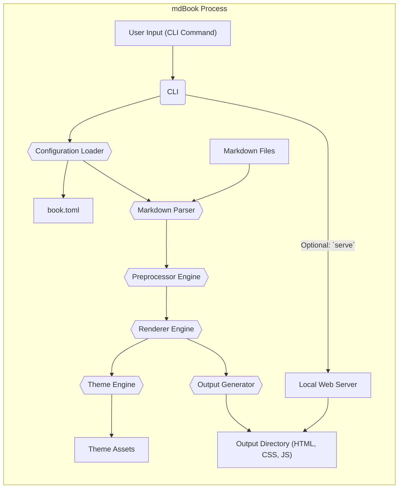

# Project Design Document: mdBook

**Version:** 1.1
**Date:** October 26, 2023
**Author:** AI Software Architect

## 1. Introduction

This document provides a detailed design overview of the `mdBook` project, a command-line utility for creating books from Markdown files. This document is intended to serve as a foundation for subsequent threat modeling activities by clearly outlining the system's architecture, components, and data flow.

## 2. Goals of this Document

*   To clearly define the architecture and components of the `mdBook` project.
*   To describe the data flow within the system in a comprehensive manner.
*   To identify key functionalities and their interactions, highlighting potential areas of interest for security analysis.
*   To provide a solid basis for identifying potential security threats and vulnerabilities during threat modeling.
*   To serve as a valuable reference for developers, security analysts, and anyone seeking to understand the inner workings of `mdBook`.

## 3. Overview

`mdBook` is a static site generator specifically designed for creating online books from collections of Markdown files. It takes a directory containing Markdown files as input, processes them according to a configuration file (`book.toml`), and generates a static HTML website representing the book. This generated website is self-contained and can be hosted on any standard web server or accessed locally.

## 4. System Architecture

The `mdBook` system can be conceptually divided into the following core components, each with specific responsibilities:

*   **Command-Line Interface (CLI):** The primary interface for users to interact with `mdBook`. It parses commands and arguments provided by the user.
*   **Configuration Loader:** Responsible for reading, parsing, and validating the `book.toml` configuration file, which defines the book's metadata, structure, and rendering options.
*   **Markdown Parser:**  Parses individual Markdown files into a structured, internal representation that can be further processed.
*   **Preprocessor Engine:** Executes configured preprocessors, which are external programs or scripts that can modify the Markdown content before it is rendered into HTML.
*   **Renderer Engine:** Transforms the parsed and preprocessed Markdown content into HTML. This includes applying themes, handling code highlighting, and generating the final HTML structure.
*   **Theme Engine:** Manages the visual appearance of the generated book by providing templates (using Handlebars) and static assets (CSS, JavaScript, images).
*   **Output Generator:** Writes the rendered HTML files, along with static assets from the theme, to the specified output directory.
*   **Serve Functionality (Optional):** Provides a local HTTP server for previewing the generated book during development, allowing users to see changes in real-time.

## 5. Data Flow

The typical data flow within `mdBook` proceeds through the following stages:

1. **User Interaction:** The user interacts with `mdBook` by invoking the CLI with a specific command (e.g., `mdbook build`, `mdbook serve`, `mdbook test`).
2. **Command Processing:** The CLI component parses the command and any arguments provided by the user.
3. **Configuration Loading and Parsing:** The Configuration Loader reads the `book.toml` file from the root directory of the book project. It parses this file (typically in TOML format) and validates the configuration against the expected schema.
4. **Markdown File Reading:** The Markdown Parser reads the Markdown files that constitute the book's content, as specified in the `book.toml` configuration.
5. **Markdown Parsing:** The Markdown Parser processes each Markdown file, converting the text into a structured, internal representation of the document.
6. **Preprocessing (Conditional):** If preprocessors are defined in the `book.toml` file, the Preprocessor Engine executes them. This involves:
    *   Reading the configuration for each preprocessor.
    *   Invoking the specified executable for each preprocessor.
    *   Passing the parsed Markdown content to the preprocessor's standard input.
    *   Receiving the modified Markdown content from the preprocessor's standard output.
7. **Rendering to HTML:** The Renderer Engine takes the parsed (and potentially preprocessed) Markdown content and transforms it into HTML. This process involves:
    *   Applying the selected theme from the Theme Engine.
    *   Using Handlebars templates to structure the HTML pages.
    *   Applying syntax highlighting to code blocks based on language detection.
8. **Theme Integration:** The Theme Engine provides the visual styling and structure for the generated HTML. The Renderer Engine utilizes templates and static assets (CSS, JavaScript, images) provided by the active theme.
9. **Output Generation:** The Output Generator writes the rendered HTML files, along with the static assets from the theme, to the designated output directory (typically `book/`). This includes generating an `index.html` file and individual HTML files for each chapter.
10. **Serving (Optional):** If the `serve` command is used, the Local Web Server starts and serves the generated files from the output directory. This allows the user to preview the book in a web browser, often with features like live reloading upon file changes.

## 6. Key Components in Detail

### 6.1. Command-Line Interface (CLI)

*   **Responsibility:** Provides the primary user interface for interacting with `mdBook`. Manages command parsing and execution.
*   **Functionality:**
    *   Parses commands such as `build`, `serve`, `init`, `test`, and potentially custom commands from extensions.
    *   Handles command-line arguments and options.
    *   Invokes the appropriate internal components based on the user's command.
    *   Provides feedback to the user through the console (e.g., progress, errors).

### 6.2. Configuration Loader

*   **Responsibility:** Loads, parses, and validates the `book.toml` configuration file.
*   **Functionality:**
    *   Locates the `book.toml` file in the book's root directory.
    *   Parses the TOML formatted content of the file.
    *   Validates the configuration against a predefined schema, ensuring required fields are present and values are of the correct type.
    *   Makes the parsed configuration data available to other components of `mdBook`.
*   **Key Configuration Sections:**
    *   `[book]`: Defines core book metadata like title, author, and description.
    *   `[build]`: Specifies settings for the build process, such as the source directory for Markdown files.
    *   `[output.html]`: Configuration options specific to the HTML output format.
    *   `[preprocessor.<name>]`: Settings for individual preprocessors, including their executable path and arguments.
    *   `[theme]`: Allows specifying a custom theme or configuring theme-related options.

### 6.3. Markdown Parser

*   **Responsibility:** Converts Markdown files into a structured, in-memory representation.
*   **Functionality:**
    *   Reads the content of Markdown files from the specified source directory.
    *   Parses the Markdown syntax according to a defined specification (typically CommonMark or a similar standard).
    *   Identifies and structures Markdown elements such as headings, paragraphs, lists, code blocks, links, and images.

### 6.4. Preprocessor Engine

*   **Responsibility:** Executes external programs or scripts to modify Markdown content before rendering.
*   **Functionality:**
    *   Reads preprocessor configurations from the `book.toml` file.
    *   For each configured preprocessor:
        *   Spawns a new process for the preprocessor executable.
        *   Passes the Markdown content to the preprocessor's standard input.
        *   Receives the modified Markdown content from the preprocessor's standard output.
    *   Allows for chaining of multiple preprocessors.
*   **Use Cases:**
    *   Adding custom Markdown syntax or features.
    *   Generating content dynamically based on external data.
    *   Performing transformations or validations on the Markdown content.

### 6.5. Renderer Engine

*   **Responsibility:** Transforms the parsed (and potentially preprocessed) Markdown content into HTML.
*   **Functionality:**
    *   Traverses the internal representation of the Markdown content.
    *   Generates corresponding HTML elements for each Markdown element.
    *   Applies syntax highlighting to code blocks, often using libraries like `syntect` or similar.
    *   Integrates with the Theme Engine to apply the book's visual styling and layout.
    *   Generates navigation elements (e.g., table of contents, next/previous chapter links).

### 6.6. Theme Engine

*   **Responsibility:** Manages the visual appearance and structure of the generated book.
*   **Functionality:**
    *   Loads theme templates, typically written using Handlebars or a similar templating language.
    *   Provides static assets such as CSS stylesheets, JavaScript files, images, and fonts.
    *   Allows users to customize the look and feel of their books by creating or modifying themes.
*   **Typical Theme Structure:**
    *   `index.hbs`: The main template for the overall book layout.
    *   `chapter.hbs`: Template for rendering individual chapter pages.
    *   `css/`: Directory containing CSS files for styling.
    *   `js/`: Directory containing JavaScript files for interactive elements.
    *   `fonts/`: Directory containing font files.
    *   `templates/`: Directory for additional partial templates.

### 6.7. Output Generator

*   **Responsibility:** Writes the rendered HTML files and theme assets to the output directory.
*   **Functionality:**
    *   Creates the necessary directory structure in the output directory.
    *   Writes the generated HTML content for each chapter to individual files.
    *   Copies static assets (CSS, JavaScript, images, fonts) from the active theme to the output directory.
    *   Generates the main `index.html` file for the book.

### 6.8. Serve Functionality (Optional)

*   **Responsibility:** Provides a local HTTP server for previewing the generated book during development.
*   **Functionality:**
    *   Starts a lightweight HTTP server, typically listening on `localhost`.
    *   Serves files from the output directory.
    *   May include features like automatic browser reloading when changes are detected in the source files or theme.

## 7. Security Considerations (Initial)

This section outlines initial security considerations relevant to `mdBook`. A dedicated threat modeling exercise will provide a more in-depth analysis.

*   **Input Validation:**  Improper validation of the `book.toml` file or Markdown content could lead to vulnerabilities. Maliciously crafted input might cause unexpected behavior or allow for injection attacks.
*   **Cross-Site Scripting (XSS):**  If user-provided content in Markdown files is not properly sanitized during the rendering process, it could result in XSS vulnerabilities in the generated HTML output.
*   **Theme Security:**  If themes allow arbitrary code execution (e.g., through template engines or JavaScript), malicious themes could compromise the security of users building books with them.
*   **Preprocessor Security:**  Executing external preprocessors introduces a significant security risk. Maliciously crafted preprocessors could execute arbitrary code on the user's system.
*   **Denial of Service (DoS):**  Processing extremely large or deeply nested Markdown files could potentially lead to DoS by consuming excessive system resources.
*   **Supply Chain Security:**  Vulnerabilities in dependencies used by `mdBook` (e.g., Markdown parsing libraries, syntax highlighting libraries) could be exploited.
*   **Local Web Server Security:**  The optional `serve` functionality, while intended for local development, could pose a risk if not implemented securely or if exposed unintentionally.
*   **Configuration Injection:**  Care must be taken to prevent injection attacks through configuration settings, especially when those settings influence the execution of external processes.

## 8. Deployment

The output of `mdBook` is a static website, offering flexible deployment options:

*   **Static Site Hosting Platforms:** The generated `book/` directory can be readily deployed to static site hosting services such as GitHub Pages, Netlify, Vercel, and Amazon S3.
*   **Traditional Web Servers:** The output can be served by traditional web servers like Apache HTTP Server or Nginx.
*   **Local File System Access:** The generated book can be accessed directly by opening the `index.html` file in a web browser from the local file system.

## 9. Future Considerations

*   **Enhanced Plugin System:**  Developing a more robust and secure plugin system would allow for extending `mdBook`'s functionality in a controlled manner, potentially reducing reliance on external preprocessors for common tasks.
*   **Support for More Output Formats:** Expanding the supported output formats beyond HTML (e.g., PDF, EPUB) would increase the versatility of `mdBook`.
*   **Improved Theme Customization and Security:** Providing more advanced theme customization options while ensuring a secure theming mechanism is crucial. This might involve sandboxing or stricter template rendering.
*   **Built-in Linting and Validation:** Integrating linting and validation tools directly into `mdBook` could help users identify potential issues in their Markdown content or configuration.

This improved design document provides a more detailed and refined overview of the `mdBook` project, offering a strong foundation for subsequent threat modeling activities.
