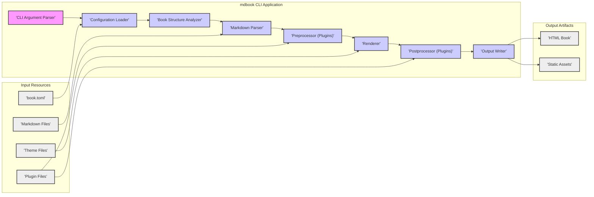
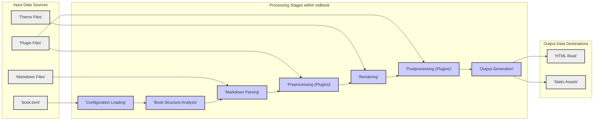

## Project Design Document: mdbook (Improved)

**Project Name:** mdbook

**Project URL:** [https://github.com/rust-lang/mdbook](https://github.com/rust-lang/mdbook)

**Document Version:** 1.1

**Date:** 2023-10-27 (Improved Version)

**Author:** AI Software Architect

### 1. Project Overview

mdbook is a versatile command-line tool, crafted in Rust, designed for building books from Markdown source files. Its core philosophy emphasizes simplicity, extensibility through a robust plugin ecosystem, and the generation of visually appealing and highly functional online books. mdbook is widely adopted for creating software documentation, technical tutorials, and publishing online books.

**Key Features:**

*   **Markdown Parsing and Rendering:**  Processes and transforms Markdown formatted text into book structures, adhering to CommonMark or a compatible specification.
*   **Configuration Management:** Leverages a `book.toml` configuration file to centralize project settings, including book metadata (title, authors), build configurations, and output preferences.
*   **Theming and Customization:** Offers theming capabilities to tailor the visual presentation of generated books, allowing for custom branding and aesthetic choices.
*   **Plugin Extensibility:** Provides a powerful plugin system, enabling users to extend mdbook's core functionalities. Plugins, written in Rust, can manipulate book content, introduce new rendering formats, and implement custom pre-processing and post-processing workflows.
*   **HTML Output Generation:** Primarily targets HTML as the output format for web-based book delivery, ensuring broad accessibility across web browsers. Plugin extensions can broaden output format support.
*   **Live Reloading (Development Aid):** Supports an optional "watch mode" that automatically rebuilds the book upon detecting changes in source files, streamlining the development and preview process.
*   **Integrated Search Functionality:** Incorporates client-side search capabilities into the generated HTML books, enhancing user navigation and information retrieval.
*   **Internationalization (i18n) Support:**  Facilitates the creation of books in multiple languages through internationalization features for both content and user interface elements.

**Target Audience:**

*   Software Developers: For creating API documentation, library guides, and project documentation.
*   Technical Writers: For authoring user manuals, technical specifications, and knowledge bases.
*   Online Book Authors: For publishing tutorials, educational materials, and general online books.
*   Content Creators: Anyone needing to structure and present information from Markdown files in a book format.

### 2. System Architecture

mdbook's architecture is modular, composed of distinct components working in concert to convert Markdown inputs into a final book output.

**2.1. Component Diagram (Mermaid)**

**2.2. Component Descriptions:**

*   **"'CLI Argument Parser'":**
    *   Function: Interprets command-line arguments passed to the `mdbook` executable.
    *   Details: Uses a library like `clap` in Rust to define and parse arguments. Determines the operation mode (e.g., `build`, `serve`, `test`), input paths, output directory, and various command-line flags.
    *   Security Relevance:  While seemingly simple, incorrect argument parsing can lead to unexpected behavior or vulnerabilities if not handled robustly (e.g., path injection if paths are taken directly from arguments without validation).

*   **"'Configuration Loader'":**
    *   Function: Reads and processes the `book.toml` configuration file.
    *   Details: Parses the TOML file using a TOML parsing library in Rust.  Loads settings such as book title, authors, description, build options (e.g., output format, theme), and plugin configurations (plugin names, paths, and settings). Performs validation of configuration values against expected types and ranges. Reports errors for invalid configurations, halting the process.
    *   Security Relevance: Critical for security. Improper parsing or validation of `book.toml` can lead to configuration injection vulnerabilities, allowing malicious users to influence mdbook's behavior, potentially leading to file system access issues or execution of unintended plugins.

*   **"'Book Structure Analyzer'":**
    *   Function: Examines the project directory to understand the book's organization.
    *   Details:  Traverses the project directory, identifies Markdown files based on extensions (e.g., `.md`), theme files, and plugin files as specified in `book.toml` or by convention.  Determines the chapter and section hierarchy, typically based on `SUMMARY.md` or directory structure if `SUMMARY.md` is absent.  Builds an in-memory representation of the book's structure.
    *   Security Relevance: Path traversal vulnerabilities could arise if the analyzer doesn't properly sanitize file paths when determining book structure, potentially allowing access to files outside the intended project directory.

*   **"'Markdown Parser'":**
    *   Function: Converts Markdown files into an Abstract Syntax Tree (AST).
    *   Details: Employs a Markdown parsing library (likely based on CommonMark specification) written in Rust. Parses each Markdown file into an AST, representing the document's structure and content in a structured format. Handles Markdown syntax elements like headings, paragraphs, lists, code blocks, images, and links.  May perform basic syntax validation and error reporting during parsing.
    *   Security Relevance:  Markdown parsers are a common source of vulnerabilities.  Vulnerabilities in the parser could lead to:
        *   **Cross-Site Scripting (XSS):** If the parser incorrectly handles certain Markdown constructs, allowing injection of malicious HTML or JavaScript into the generated output.
        *   **Denial of Service (DoS):**  Maliciously crafted Markdown input designed to exploit parser inefficiencies, leading to excessive resource consumption and potential crashes.

*   **"'Preprocessor (Plugins)'":**
    *   Function: Executes preprocessor plugins to modify the book's content *before* rendering.
    *   Details: Loads and executes preprocessor plugins in the order defined in `book.toml`. Provides a plugin API allowing plugins to access and manipulate the book's AST, modify Markdown content, add or remove chapters, or perform other content transformations. Plugins are typically implemented as separate Rust crates and loaded dynamically.
    *   Security Relevance: Plugins operate with the same privileges as mdbook itself. Malicious or vulnerable preprocessor plugins can:
        *   **Modify book content maliciously:** Inject harmful content, alter information, or introduce vulnerabilities.
        *   **Access and modify the file system:** Read sensitive data, overwrite files, or perform other file system operations.
        *   **Introduce vulnerabilities through plugin code or dependencies:** Plugins may have their own security flaws or depend on vulnerable libraries.

*   **"'Renderer'":**
    *   Function: Transforms the book's AST into the final output format (primarily HTML).
    *   Details: Takes the processed AST as input and generates HTML output. Applies the selected theme (either built-in or custom) to style the HTML. Generates HTML pages for each chapter, including navigation elements (table of contents, next/previous chapter links), search functionality integration, and theme-specific elements. Handles code syntax highlighting, image embedding, and other rendering tasks.
    *   Security Relevance: The renderer is responsible for generating the final output viewed by users. Vulnerabilities in the renderer or themes can lead to:
        *   **Cross-Site Scripting (XSS):** If theme templates or rendering logic are not properly secured, allowing injection of malicious scripts into the generated HTML.
        *   **Information Disclosure:**  If the renderer inadvertently exposes sensitive information in the generated output.

*   **"'Postprocessor (Plugins)'":**
    *   Function: Executes postprocessor plugins to modify the rendered output *after* the main rendering process.
    *   Details: Loads and executes postprocessor plugins in the order specified in `book.toml`. Provides a plugin API allowing plugins to access and modify the generated HTML output, optimize assets (e.g., minify HTML, compress images), perform deployment tasks, or add custom features to the final book.
    *   Security Relevance: Similar to preprocessor plugins, postprocessor plugins operate with full privileges. Malicious or vulnerable postprocessor plugins can:
        *   **Modify the rendered output maliciously:** Inject harmful scripts, alter content, or introduce vulnerabilities into the final HTML.
        *   **Access and modify the file system:**  Potentially perform malicious file system operations after the book is rendered.
        *   **Introduce vulnerabilities through plugin code or dependencies.**

*   **"'Output Writer'":**
    *   Function: Writes the generated HTML book and static assets to the output directory.
    *   Details: Takes the rendered HTML and associated static assets (CSS, JavaScript, images, fonts) and writes them to the specified output directory (defaulting to `book/`). Organizes the output files into a structured directory hierarchy suitable for serving as a website.
    *   Security Relevance:  Improper output path handling could lead to writing files to unintended locations, potentially overwriting important system files if output paths are not properly validated and sanitized.

*   **"'Markdown Files'":**
    *   Data: Input Markdown source files containing the book's content.
    *   Details: Plain text files formatted using Markdown syntax. Organized into chapters and sections within the project directory.
    *   Security Relevance:  Maliciously crafted Markdown files are the primary vector for exploiting Markdown parser vulnerabilities.

*   **"'book.toml'":**
    *   Data: Configuration file in TOML format defining project settings.
    *   Details:  A text file in TOML format located at the project root. Contains settings for book metadata, build options, theme selection, and plugin configurations.
    *   Security Relevance:  A compromised `book.toml` file can directly control mdbook's behavior, including plugin loading and output settings, making it a critical security component.

*   **"'Theme Files'":**
    *   Data: Files defining the visual theme of the book.
    *   Details: Typically includes CSS stylesheets, HTML templates, JavaScript files, and potentially images and fonts. Can be built-in themes or custom themes provided by users.
    *   Security Relevance: Themes, especially custom themes, can introduce vulnerabilities if they contain malicious JavaScript or insecure HTML templates, leading to XSS vulnerabilities in generated books.

*   **"'Plugin Files'":**
    *   Data: Rust crates extending mdbook's functionality.
    *   Details: Compiled Rust libraries (`.so` or `.dll` files) implementing the mdbook plugin API. Can be preprocessors, renderers, or postprocessors.
    *   Security Relevance: Plugins are a major security consideration due to their ability to execute arbitrary code within the mdbook process. Untrusted or vulnerable plugins pose a significant risk.

*   **"'HTML Book'":**
    *   Data: The primary output, a set of HTML files representing the book.
    *   Details:  A collection of HTML files, CSS, JavaScript, and images organized into a directory structure. Designed to be viewed in a web browser.
    *   Security Relevance: The final output that users interact with. Must be free of vulnerabilities, especially XSS, to protect users viewing the book.

*   **"'Static Assets'":**
    *   Data: Supporting files for the HTML book.
    *   Details: Includes CSS stylesheets, JavaScript files, images, fonts, and other resources required for the HTML book to render correctly in a browser.
    *   Security Relevance: Static assets, especially JavaScript libraries included in themes, can contain known vulnerabilities that could be exploited in the generated book.

### 3. Data Flow

The data flow illustrates the transformation of input data through mdbook's processing stages to produce the final book output.

**3.1. Data Flow Diagram (Mermaid)**

**3.2. Data Flow Description:**

1.  **Input Data Acquisition:** mdbook begins by gathering necessary input data:
    *   **"'Markdown Files'":** Reads Markdown content from files located within the project directory.
    *   **"'book.toml'":** Loads and parses the project configuration from the `book.toml` file.
    *   **"'Theme Files'":** Loads theme assets based on the configured theme, either built-in or custom.
    *   **"'Plugin Files'":** Loads and initializes plugin libraries as specified in the `book.toml` configuration.

2.  **"'Configuration Loading'":** The `book.toml` file is parsed, and configuration parameters are loaded into memory for use throughout the book building process.

3.  **"'Book Structure Analysis'":** The project directory is analyzed to determine the book's structure, identify chapters and sections, and establish the order of content based on `SUMMARY.md` or directory structure.

4.  **"'Markdown Parsing'":** Each Markdown file is read and processed by the Markdown parser, converting the Markdown syntax into an Abstract Syntax Tree (AST) representing the document's structure and content.

5.  **"'Preprocessing (Plugins)'":** Preprocessor plugins are executed sequentially. Each plugin receives the book's AST and can modify it. This allows for content manipulation, augmentation, or transformation before rendering.

6.  **"'Rendering'":** The core rendering engine takes the processed book AST and transforms it into HTML format. This stage applies the selected theme to style the HTML output, generates navigation elements, and integrates search functionality.

7.  **"'Postprocessing (Plugins)'":** Postprocessor plugins are executed in sequence after rendering. Each plugin receives the generated HTML output and can modify it. This enables tasks like HTML minification, asset optimization, or custom output transformations.

8.  **"'Output Generation'":** The final HTML book, along with all necessary static assets, is written to the designated output directory.

9.  **Output Data Delivery:**
    *   **"'HTML Book'":** The generated HTML files are ready to be deployed to a web server or accessed locally via a web browser.
    *   **"'Static Assets'":** Supporting files (CSS, JavaScript, images, etc.) are placed alongside the HTML book to ensure proper rendering and functionality in a browser environment.

### 4. Security Considerations

This section details security considerations relevant to mdbook, focusing on potential vulnerabilities and risks.

**4.1. Input Validation and Sanitization:**

*   **Markdown Parsing Security:**
    *   Risk: Vulnerabilities in the Markdown parser can be exploited through maliciously crafted Markdown input.
    *   Specific Risks:
        *   **Cross-Site Scripting (XSS) via HTML Injection:**  Markdown features like raw HTML embedding or improper handling of HTML-like syntax within Markdown could allow injection of malicious scripts into the generated HTML.
        *   **Denial of Service (DoS) through Parser Exploits:**  Complex or deeply nested Markdown structures, or specific syntax combinations, could trigger parser inefficiencies, leading to excessive CPU or memory consumption and potential DoS.
        *   **Bypass of Security Features:**  Markdown extensions or custom syntax might introduce unexpected behaviors or bypass intended security measures if not carefully designed and validated.
    *   Mitigation:
        *   Utilize a well-vetted and actively maintained Markdown parsing library.
        *   Implement strict input validation and sanitization for Markdown content, especially when handling user-provided Markdown.
        *   Consider using a Content Security Policy (CSP) in generated HTML to mitigate potential XSS risks, even if parser vulnerabilities exist.

*   **`book.toml` Configuration Security:**
    *   Risk: Improper parsing or validation of `book.toml` can lead to configuration injection and other vulnerabilities.
    *   Specific Risks:
        *   **Path Injection:**  Maliciously crafted paths in `book.toml` (e.g., for theme files, plugin paths, output directory) could lead to mdbook accessing or writing files outside the intended project scope, potentially leading to directory traversal or file overwrite vulnerabilities.
        *   **Arbitrary Configuration Overrides:**  Injection of unexpected configuration values could alter mdbook's behavior in unintended and potentially harmful ways.
    *   Mitigation:
        *   Implement robust schema validation for `book.toml` to ensure configuration values conform to expected types and formats.
        *   Sanitize and validate all paths read from `book.toml` to prevent path injection vulnerabilities.
        *   Apply the principle of least privilege when accessing files based on configuration paths.

**4.2. Plugin System Security Risks:**

*   **Unsandboxed Plugin Execution:**
    *   Risk: mdbook plugins execute within the same process as mdbook and have full access to its resources and permissions.
    *   Specific Risks:
        *   **Malicious Plugin Code Execution:**  Malicious plugins can execute arbitrary code, potentially compromising the system running mdbook, stealing data, or modifying files.
        *   **Vulnerable Plugin Dependencies:** Plugins may depend on third-party libraries with known vulnerabilities, indirectly introducing security risks into mdbook.
        *   **Plugin Bugs Leading to Instability:**  Bugs in plugins can cause mdbook to crash or behave unpredictably.
    *   Mitigation:
        *   **Plugin Sandboxing (Future Enhancement):**  Consider implementing a sandboxing mechanism to restrict plugin capabilities and limit their access to system resources.
        *   **Plugin Code Review and Auditing:**  Encourage code review and security audits of plugins, especially those from untrusted sources.
        *   **Dependency Scanning for Plugins:**  Implement or recommend tools for scanning plugin dependencies for known vulnerabilities.
        *   **Clear Plugin Security Guidelines:**  Provide clear guidelines for plugin developers on secure coding practices and vulnerability prevention.
        *   **Plugin Signing and Verification (Future Enhancement):**  Explore plugin signing and verification mechanisms to establish trust and authenticity of plugins.

*   **Plugin Distribution and Trust:**
    *   Risk: Users must trust the source of plugins they install.
    *   Specific Risks:
        *   **Supply Chain Attacks:**  Malicious actors could distribute compromised plugins through package registries or other channels.
        *   **Social Engineering:**  Users could be tricked into installing malicious plugins disguised as legitimate extensions.
    *   Mitigation:
        *   **Promote Plugin Repositories with Security Scrutiny:**  Encourage the use of curated plugin repositories that perform some level of security review.
        *   **User Education on Plugin Security:**  Educate users about the risks of installing plugins from untrusted sources and best practices for plugin security.

**4.3. Output Security - Generated HTML:**

*   **Cross-Site Scripting (XSS) in Generated HTML:**
    *   Risk: The generated HTML book could contain XSS vulnerabilities.
    *   Specific Risks:
        *   **XSS from Markdown Parser Vulnerabilities (as mentioned above).**
        *   **XSS in Theme Templates:**  Theme templates (HTML, JavaScript) could contain vulnerabilities that allow injection of malicious scripts.
        *   **XSS from Insecure Theme JavaScript:**  JavaScript code included in themes might have vulnerabilities or be written insecurely, leading to XSS.
        *   **Inclusion of Vulnerable Static Assets:** Themes might include vulnerable JavaScript libraries or other static assets with known security flaws.
    *   Mitigation:
        *   **Secure Theme Development Practices:**  Develop themes with security in mind, avoiding insecure coding practices and carefully reviewing theme templates and JavaScript code.
        *   **Regular Theme Security Audits:**  Conduct security audits of built-in and popular themes.
        *   **Dependency Management for Theme Assets:**  Manage and update dependencies of theme assets (e.g., JavaScript libraries) to address known vulnerabilities.
        *   **Content Security Policy (CSP):**  Implement a strong Content Security Policy in the generated HTML to restrict the capabilities of scripts and mitigate XSS risks.

**4.4. Dependency Security - mdbook and Plugins:**

*   **Vulnerabilities in Dependencies:**
    *   Risk: mdbook and its plugins rely on numerous third-party Rust crates. Vulnerabilities in these dependencies can affect mdbook's security.
    *   Specific Risks:
        *   **Transitive Dependencies:**  Vulnerabilities can exist in dependencies of dependencies, making them harder to track and mitigate.
        *   **Outdated Dependencies:**  Using outdated dependencies increases the risk of known vulnerabilities.
    *   Mitigation:
        *   **Regular Dependency Scanning:**  Implement automated dependency scanning tools to identify known vulnerabilities in mdbook's dependencies and plugin dependencies.
        *   **Dependency Updates:**  Keep dependencies up-to-date to patch known vulnerabilities.
        *   **Dependency Pinning and Management:**  Use dependency management tools to pin dependency versions and ensure reproducible builds, while also allowing for controlled updates.

**4.5. File System Access Security:**

*   **Directory Traversal and File Overwrite:**
    *   Risk: Improper handling of file paths could lead to directory traversal vulnerabilities or unintended file overwrites.
    *   Specific Risks:
        *   **Path Injection in `book.toml` or Command-Line Arguments:**  As mentioned earlier, malicious paths in configuration or arguments could be exploited.
        *   **Bugs in File Path Handling Logic:**  Bugs in mdbook's code could lead to incorrect file path construction or validation, resulting in unintended file system access.
    *   Mitigation:
        *   **Path Sanitization and Validation:**  Thoroughly sanitize and validate all file paths before using them for file system operations.
        *   **Use Secure File System APIs:**  Utilize secure file system APIs provided by the operating system and programming language to minimize risks.
        *   **Principle of Least Privilege:**  Ensure mdbook and plugins operate with the minimum necessary file system permissions.

**4.6. Command Execution Risks (Indirect):**

*   **Plugin-Initiated Command Execution:**
    *   Risk: While mdbook itself is not designed to execute arbitrary commands directly, plugins *could* be written to do so.
    *   Specific Risks:
        *   **Remote Code Execution (RCE) via Malicious Plugins:**  Malicious plugins could execute arbitrary commands on the system running mdbook, leading to full system compromise.
        *   **Abuse of System Resources:**  Plugins could be used to launch resource-intensive commands, leading to DoS.
    *   Mitigation:
        *   **Discourage Command Execution in Plugins:**  Plugin development guidelines should strongly discourage or prohibit the execution of arbitrary system commands unless absolutely necessary and carefully secured.
        *   **Sandboxing (as mentioned above):** Sandboxing plugins would be a primary mitigation against this risk.
        *   **Code Review and Auditing of Plugins:**  Thoroughly review plugin code to identify and prevent command execution vulnerabilities.

### 5. Potential Attack Surfaces (Detailed)

This section provides a more detailed breakdown of potential attack surfaces, including attack vectors, potential impacts, and mitigation considerations.

*   **Attack Surface 1: Markdown Parser Vulnerabilities**
    *   Description: Exploiting vulnerabilities within the Markdown parser component.
    *   Attack Vector:
        *   Providing a maliciously crafted Markdown file as input to `mdbook build`, `mdbook serve`, or any command that processes Markdown.
        *   Including malicious Markdown content in a `SUMMARY.md` file or other input Markdown files.
    *   Potential Impact:
        *   Cross-Site Scripting (XSS) in generated HTML, potentially allowing attackers to execute arbitrary JavaScript in users' browsers when they view the book.
        *   Denial of Service (DoS) against the mdbook process, making it unavailable.
    *   Mitigation Considerations:
        *   Use a robust and well-maintained Markdown parser library.
        *   Regularly update the Markdown parser library to patch known vulnerabilities.
        *   Implement input validation and sanitization for Markdown content.
        *   Employ Content Security Policy (CSP) in generated HTML as a defense-in-depth measure.

*   **Attack Surface 2: `book.toml` Configuration Injection**
    *   Description: Injecting malicious configuration values into the `book.toml` file to manipulate mdbook's behavior.
    *   Attack Vector:
        *   Directly modifying the `book.toml` file in a project repository.
        *   Potentially through vulnerabilities in tools or processes that generate or modify `book.toml` files.
    *   Potential Impact:
        *   File system access vulnerabilities (directory traversal, file overwrite) if malicious paths are injected.
        *   Loading and execution of unintended or malicious plugins if plugin paths or names are manipulated.
        *   Unexpected or insecure build configurations.
    *   Mitigation Considerations:
        *   Implement strict schema validation for `book.toml` files.
        *   Sanitize and validate all paths read from `book.toml`.
        *   Restrict write access to `book.toml` files to authorized users or processes.

*   **Attack Surface 3: Malicious Plugins**
    *   Description: Installing and using intentionally malicious mdbook plugins.
    *   Attack Vector:
        *   Downloading and installing a plugin from an untrusted source (e.g., a malicious website, a compromised package registry).
        *   Social engineering users into installing malicious plugins.
    *   Potential Impact:
        *   Full compromise of the system running mdbook, including remote code execution.
        *   Data theft, including access to sensitive files on the system.
        *   Malicious modification of generated books, injecting harmful content or vulnerabilities.
    *   Mitigation Considerations:
        *   User education on the risks of installing plugins from untrusted sources.
        *   Promote the use of curated and security-reviewed plugin repositories.
        *   Consider plugin sandboxing mechanisms.
        *   Plugin signing and verification (future enhancement).

*   **Attack Surface 4: Vulnerable Plugins**
    *   Description: Using plugins that contain unintentional security vulnerabilities (bugs, insecure dependencies).
    *   Attack Vector:
        *   Using plugins with known vulnerabilities in their code or dependencies.
        *   Vulnerabilities in plugins discovered after installation.
    *   Potential Impact:
        *   Varies depending on the specific plugin vulnerability, ranging from DoS to remote code execution.
        *   Compromise of the generated book if plugin vulnerabilities lead to XSS or other output vulnerabilities.
    *   Mitigation Considerations:
        *   Regular dependency scanning for plugins to identify vulnerable dependencies.
        *   Encourage plugin developers to follow secure coding practices and perform security testing.
        *   Provide mechanisms for users to report and update vulnerable plugins.

*   **Attack Surface 5: Theme Vulnerabilities**
    *   Description: Exploiting vulnerabilities within mdbook themes, especially custom or third-party themes.
    *   Attack Vector:
        *   Using themes from untrusted sources.
        *   Using themes with known vulnerabilities in theme templates (HTML, JavaScript) or static assets.
    *   Potential Impact:
        *   Cross-Site Scripting (XSS) in the generated HTML book, compromising users who view the book.
        *   Information disclosure if themes inadvertently expose sensitive data.
    *   Mitigation Considerations:
        *   Secure theme development practices.
        *   Regular security audits of built-in and popular themes.
        *   Dependency management for theme assets.
        *   Content Security Policy (CSP) in generated HTML to mitigate XSS risks from themes.

*   **Attack Surface 6: Dependency Vulnerabilities (mdbook Core and Plugins)**
    *   Description: Exploiting vulnerabilities in the third-party libraries (Rust crates) used by mdbook itself or its plugins.
    *   Attack Vector:
        *   Vulnerabilities in underlying libraries used by mdbook or its plugins.
        *   Transitive dependencies with vulnerabilities.
    *   Potential Impact:
        *   Varies depending on the dependency vulnerability, ranging from DoS to remote code execution.
        *   Compromise of the mdbook process or the generated book.
    *   Mitigation Considerations:
        *   Regular dependency scanning for mdbook and plugins.
        *   Dependency updates to patch known vulnerabilities.
        *   Dependency pinning and management to control dependency versions.

*   **Attack Surface 7: File System Access Vulnerabilities**
    *   Description: Exploiting vulnerabilities related to file system access, such as directory traversal or file overwrite issues.
    *   Attack Vector:
        *   Providing crafted file paths in `book.toml` configuration.
        *   Potentially through plugin interactions that manipulate file paths.
        *   Bugs in mdbook's file path handling logic.
    *   Potential Impact:
        *   Access to sensitive files outside the intended project directory.
        *   Unintended file modifications or deletions.
        *   Potential for escalation to other vulnerabilities.
    *   Mitigation Considerations:
        *   Thorough path sanitization and validation.
        *   Use secure file system APIs.
        *   Principle of least privilege for file system access.

This improved design document provides a more comprehensive and detailed foundation for threat modeling mdbook. It expands on security considerations and attack surfaces, offering a more actionable resource for identifying and mitigating potential security risks.