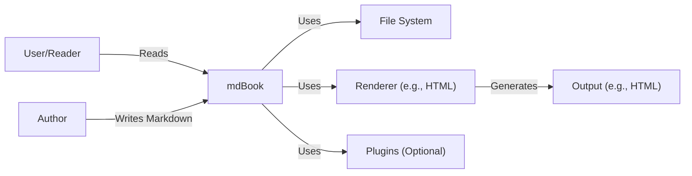
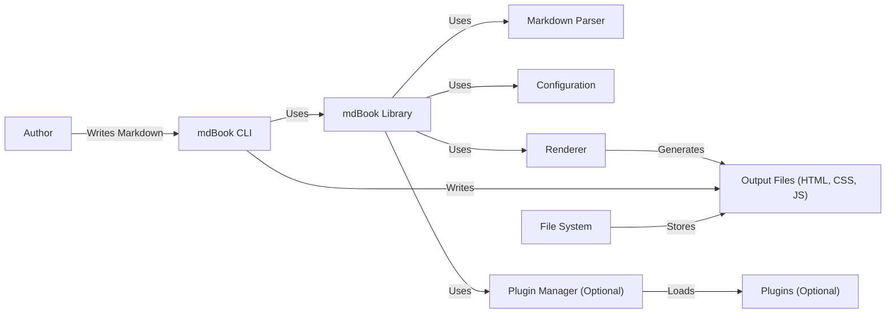
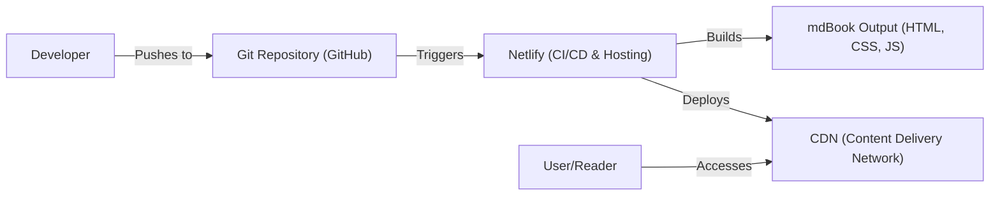
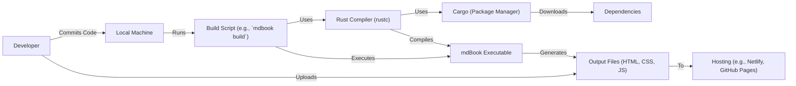

Okay, let's create a design document for the `mdBook` project.

# BUSINESS POSTURE

`mdBook` is a command-line tool and Rust library for creating online books from Markdown files. It's used extensively within the Rust community and beyond for documentation, tutorials, and even full-length books.

Priorities and Goals:

*   Provide a simple, fast, and reliable way to generate professional-looking online books from Markdown.
*   Maintain a user-friendly experience for both authors (writing the Markdown) and readers (consuming the output).
*   Ensure extensibility and customizability to cater to diverse needs (themes, plugins, etc.).
*   Maintain high code quality and stability, given its use in critical documentation projects.
*   Support various output formats, primarily HTML, but potentially others.

Business Risks:

*   Data Integrity: Incorrect rendering of Markdown or corruption of output could lead to misinformation, especially critical for technical documentation.
*   Availability: Build failures or bugs preventing book generation could disrupt documentation workflows.
*   Reputation: Security vulnerabilities or poor user experience could damage the project's reputation and adoption.
*   Maintainability: Lack of proper architecture and design could make it difficult to maintain and extend the project, hindering future development.

# SECURITY POSTURE

Existing Security Controls:

*   security control: Input Validation: `mdBook` parses Markdown, a text-based format. It likely includes input validation and sanitization to prevent common web vulnerabilities like Cross-Site Scripting (XSS) if user-provided Markdown is rendered. Implemented in Markdown parsing and rendering logic.
*   security control: Dependency Management: Rust's package manager, Cargo, helps manage dependencies and their security. `Cargo.lock` ensures consistent builds. Described in `Cargo.toml` and `Cargo.lock` files.
*   security control: Code Quality Tools: The Rust ecosystem encourages using tools like `rustfmt` (formatter) and `clippy` (linter) to maintain code quality and catch potential errors early. Likely integrated into the development workflow.
*   security control: Testing: The project likely includes unit and integration tests to ensure functionality and prevent regressions. Described in the project's test suite.
*   security control: Static Analysis: Rust's strong type system and borrow checker provide compile-time safety guarantees, preventing many common memory safety issues.

Accepted Risks:

*   accepted risk: Limited Access Control: `mdBook` itself doesn't handle user authentication or authorization. It's a tool for generating static content; access control is typically handled at the web server or hosting platform level.
*   accepted risk: Third-Party Plugins: While `mdBook` supports plugins, the security of these plugins is the responsibility of their developers. Users should exercise caution when using third-party plugins.
*   accepted risk: Denial of Service (DoS): While unlikely to be a primary target, a very large or maliciously crafted input could potentially cause excessive resource consumption during book generation.

Recommended Security Controls:

*   security control: Content Security Policy (CSP): If `mdBook` generates HTML that includes user-provided content, implementing a CSP can mitigate XSS risks.
*   security control: Regular Security Audits: Periodic security audits, both manual and automated, can help identify and address potential vulnerabilities.
*   security control: Supply Chain Security: Consider using tools to analyze dependencies for known vulnerabilities (e.g., `cargo-audit`).

Security Requirements:

*   Authentication: Not directly applicable to `mdBook` itself, as it's a static site generator. Authentication is handled by the hosting environment.
*   Authorization: Not directly applicable, similar to authentication.
*   Input Validation: Crucial to prevent XSS and other injection vulnerabilities. Markdown parsing should be robust and secure.  Any user-provided configuration (e.g., for plugins) should also be validated.
*   Cryptography: Not directly used for core functionality. If plugins or extensions require cryptography, they should use well-vetted libraries and follow best practices.

# DESIGN

## C4 CONTEXT

Element Descriptions:

*   Element:
    *   Name: User/Reader
    *   Type: Person
    *   Description: The end-user who reads the generated book.
    *   Responsibilities: Accessing and viewing the book content.
    *   Security controls: None (handled by the web server/hosting environment).

*   Element:
    *   Name: Author
    *   Type: Person
    *   Description: The person who writes the Markdown content and uses `mdBook` to generate the book.
    *   Responsibilities: Writing content, configuring `mdBook`, running the build process.
    *   Security controls: None (relies on the security of their local development environment).

*   Element:
    *   Name: mdBook
    *   Type: Software System
    *   Description: The command-line tool and library for generating books from Markdown.
    *   Responsibilities: Parsing Markdown, managing configuration, generating output, handling plugins.
    *   Security controls: Input validation, dependency management, code quality tools, testing, static analysis.

*   Element:
    *   Name: File System
    *   Type: System
    *   Description: The local file system where Markdown files, configuration, and output are stored.
    *   Responsibilities: Storing and retrieving files.
    *   Security controls: Operating system file permissions.

*   Element:
    *   Name: Renderer
    *   Type: Component
    *   Description: The component responsible for converting the processed Markdown into a specific output format (e.g., HTML).
    *   Responsibilities: Generating output in the desired format.
    *   Security controls: Input validation (within the renderer), potentially CSP (for HTML).

*   Element:
    *   Name: Plugins (Optional)
    *   Type: Component
    *   Description: Optional extensions that add functionality to `mdBook`.
    *   Responsibilities: Varies depending on the plugin.
    *   Security controls: Responsibility of the plugin developer. `mdBook` should ideally provide a secure plugin interface.

*   Element:
    *   Name: Output (e.g., HTML)
    *   Type: Data
    *   Description: The generated book content, typically in HTML format.
    *   Responsibilities: Displaying the book content to the reader.
    *   Security controls: Dependent on the hosting environment (e.g., web server security, HTTPS).

## C4 CONTAINER

Element Descriptions:

*   Element:
    *   Name: mdBook CLI
    *   Type: Command-Line Interface
    *   Description: The command-line interface for interacting with `mdBook`.
    *   Responsibilities: Parsing command-line arguments, invoking the `mdBook` library.
    *   Security controls: Basic input validation of command-line arguments.

*   Element:
    *   Name: mdBook Library
    *   Type: Library
    *   Description: The core Rust library that provides the functionality for building books.
    *   Responsibilities: Managing the build process, coordinating other components.
    *   Security controls: Dependency management, code quality tools, testing, static analysis.

*   Element:
    *   Name: Markdown Parser
    *   Type: Component
    *   Description: Parses the Markdown input into an Abstract Syntax Tree (AST).
    *   Responsibilities: Parsing Markdown according to the specification.
    *   Security controls: Robust input validation to prevent parsing vulnerabilities.

*   Element:
    *   Name: Configuration
    *   Type: Component
    *   Description: Handles the `book.toml` configuration file.
    *   Responsibilities: Loading and validating configuration settings.
    *   Security controls: Input validation of configuration values.

*   Element:
    *   Name: Renderer
    *   Type: Component
    *   Description: Converts the processed Markdown (AST) into the final output format (e.g., HTML).
    *   Responsibilities: Generating the output files.
    *   Security controls: Input validation (within the renderer), potentially CSP (for HTML).

*   Element:
    *   Name: Plugin Manager (Optional)
    *   Type: Component
    *   Description: Manages the loading and execution of plugins.
    *   Responsibilities: Loading plugins, providing a secure interface for plugins to interact with `mdBook`.
    *   Security controls: Sandboxing or other mechanisms to limit the capabilities of plugins.

*   Element:
    *   Name: Plugins (Optional)
    *   Type: Component
    *   Description: Optional extensions that add functionality to `mdBook`.
    *   Responsibilities: Varies depending on the plugin.
    *   Security controls: Responsibility of the plugin developer.

*   Element:
    *   Name: Output Files (HTML, CSS, JS)
    *   Type: Data
    *   Description: The generated book content, typically HTML, CSS, and JavaScript files.
    *   Responsibilities: Displaying the book content to the reader.
    *   Security controls: Dependent on the hosting environment.

*   Element:
    *   Name: File System
    *   Type: System
    *   Description: The local file system.
    *   Responsibilities: Storing and retrieving files.
    *   Security controls: Operating system file permissions.

## DEPLOYMENT

Possible Deployment Solutions:

1.  **Static Site Hosting (Netlify, GitHub Pages, AWS S3 + CloudFront, etc.):** This is the most common and recommended approach. `mdBook` generates static HTML, CSS, and JavaScript files, which can be directly uploaded to these services.
2.  **Traditional Web Server (Apache, Nginx):** `mdBook`'s output can be served like any other static website using a traditional web server.
3.  **Containerized Deployment (Docker, Kubernetes):** While less common for static sites, it's possible to containerize the output and serve it using a container orchestration platform. This is generally overkill.

Chosen Solution (Static Site Hosting - Netlify):

Element Descriptions:

*   Element:
    *   Name: Developer
    *   Type: Person
    *   Description: The person writing the Markdown and using `mdBook`.
    *   Responsibilities: Writing content, configuring `mdBook`, pushing changes to the Git repository.
    *   Security controls: None (relies on the security of their local development environment and Git repository).

*   Element:
    *   Name: Git Repository (GitHub)
    *   Type: System
    *   Description: The source code repository hosted on GitHub.
    *   Responsibilities: Storing the Markdown files, configuration, and other assets.
    *   Security controls: GitHub's access controls, branch protection rules, etc.

*   Element:
    *   Name: Netlify (CI/CD & Hosting)
    *   Type: System
    *   Description: The platform that provides continuous integration, continuous deployment, and hosting for the `mdBook` output.
    *   Responsibilities: Building the book on each commit, deploying it to the CDN.
    *   Security controls: Netlify's built-in security features, access controls, etc.

*   Element:
    *   Name: mdBook Output (HTML, CSS, JS)
    *   Type: Data
    *   Description: The generated static files.
    *   Responsibilities: Displaying the book content.
    *   Security controls: Dependent on Netlify's CDN and security settings.

*   Element:
    *   Name: CDN (Content Delivery Network)
    *   Type: System
    *   Description: A distributed network of servers that deliver the content to users based on their geographic location.
    *   Responsibilities: Serving the book content quickly and reliably.
    *   Security controls: CDN's built-in security features (e.g., DDoS protection, HTTPS).

*   Element:
    *   Name: User/Reader
    *   Type: Person
    *   Description: The end-user accessing the book.
    *   Responsibilities: Viewing the book content.
    *   Security controls: None (handled by the CDN and their browser).

## BUILD

Build Process Description:

1.  **Development:** The developer writes Markdown content and configures `mdBook` on their local machine.
2.  **Commit:** The developer commits changes to a Git repository (e.g., GitHub).
3.  **Build Script:** A build script (often simply `mdbook build`) is executed, either locally or within a CI/CD environment (like Netlify, GitHub Actions, etc.).
4.  **Rust Compiler:** The Rust compiler (`rustc`) is invoked to compile the `mdBook` source code.
5.  **Cargo:** Cargo, the Rust package manager, manages dependencies, downloading and compiling them as needed.
6.  **Dependencies:** Dependencies are fetched from crates.io (the Rust package registry) or other configured sources.
7.  **Compilation:** The Rust compiler compiles the `mdBook` source code and its dependencies into an executable.
8.  **Execution:** The build script executes the compiled `mdBook` executable.
9.  **Output Generation:** `mdBook` processes the Markdown files and generates the output (HTML, CSS, JS).
10. **Deployment:** The generated output files are uploaded to a hosting provider (e.g., Netlify, GitHub Pages, a web server).

Security Controls in Build Process:

*   security control: Dependency Management (Cargo): Cargo helps manage dependencies and their versions, reducing the risk of using outdated or vulnerable libraries. `Cargo.lock` ensures reproducible builds.
*   security control: Static Analysis (Rust Compiler): The Rust compiler's strong type system and borrow checker provide compile-time safety guarantees, preventing many memory safety issues.
*   security control: Code Quality Tools (rustfmt, clippy): These tools help maintain code quality and catch potential errors early, reducing the likelihood of vulnerabilities.
*   security control: CI/CD Integration: Using a CI/CD platform (like Netlify or GitHub Actions) automates the build and deployment process, ensuring consistency and reducing the risk of manual errors.
*   security control: Supply Chain Security (cargo-audit): Tools like `cargo-audit` can be integrated into the build process to scan dependencies for known vulnerabilities.

# RISK ASSESSMENT

Critical Business Processes:

*   **Documentation Delivery:** Providing accurate and up-to-date documentation is crucial for users of `mdBook` and the projects that rely on it.
*   **Software Development:** `mdBook` itself is a software project, and its development process needs to be secure to prevent vulnerabilities.

Data Sensitivity:

*   **Markdown Content:** The sensitivity of the Markdown content depends on the specific project using `mdBook`. It could range from public documentation to potentially sensitive internal information.
*   **Configuration Files:** `book.toml` may contain configuration settings, but typically doesn't hold highly sensitive data.
*   **Output Files (HTML, CSS, JS):** The generated output files reflect the sensitivity of the Markdown content.

# QUESTIONS & ASSUMPTIONS

Questions:

*   Are there any specific compliance requirements (e.g., GDPR, HIPAA) that apply to projects using `mdBook`? This would influence the handling of user data, if any.
*   What is the expected threat model for typical `mdBook` deployments? Are there specific attackers or attack vectors that are of particular concern?
*   What level of support is provided for users who encounter security issues with `mdBook` or its plugins?
*   What is the process for reporting and addressing security vulnerabilities in `mdBook`?

Assumptions:

*   BUSINESS POSTURE: The primary goal is to provide a reliable and user-friendly tool for creating documentation. Security is important, but not at the expense of usability or performance.
*   SECURITY POSTURE: The project follows standard secure coding practices for Rust. Users are responsible for the security of their hosting environment and any third-party plugins they use.
*   DESIGN: The design is modular and extensible, allowing for future enhancements and customization. The focus is on generating static content, with security primarily handled at the hosting level.