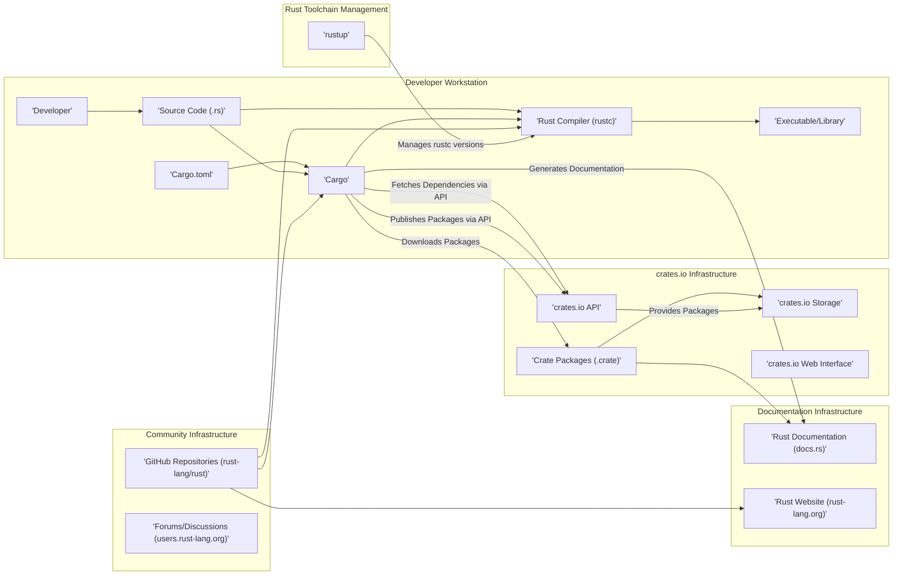
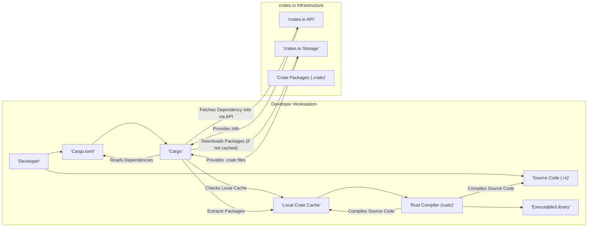
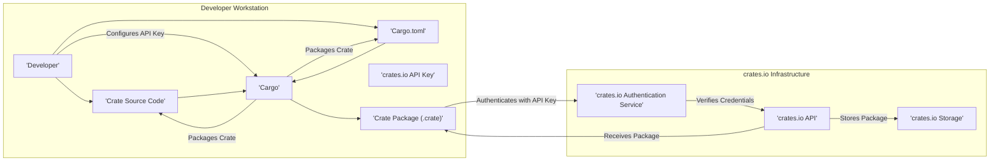
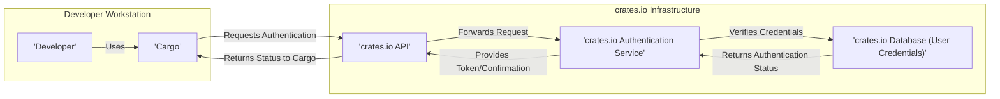

## Project Design Document: The Rust Programming Language Ecosystem (Improved)

**Version:** 1.1
**Date:** October 26, 2023
**Author:** AI Software Architect

### 1. Project Overview

This document provides an enhanced outline of the high-level architecture and key components of the Rust programming language ecosystem. Building upon the previous version, it offers a more granular understanding of the system's structure, interactions, and deployment considerations. This detailed view serves as a robust foundation for subsequent threat modeling activities, enabling a more comprehensive identification of potential security vulnerabilities. The scope encompasses the core language components, build tools, package management, documentation, and community infrastructure, with added detail on deployment and authentication aspects.

### 2. Goals

*   Provide a clear, concise, and more detailed description of the Rust ecosystem's architecture.
*   Identify key components and their interactions with greater granularity.
*   Establish a stronger basis for identifying potential security vulnerabilities and attack vectors, including deployment considerations.
*   Serve as an improved reference document for security assessments and threat modeling exercises.

### 3. Target Audience

*   Security engineers and architects
*   Software developers contributing to the Rust project
*   Individuals performing threat modeling and security assessments of Rust-based systems
*   Anyone seeking a deeper understanding of the Rust ecosystem's architecture and its security landscape

### 4. Scope

This document covers the following key aspects of the Rust ecosystem with increased detail:

*   The Rust compiler (`rustc`) and its interaction with LLVM.
*   The Cargo build system and package manager, including its dependency resolution and build script execution.
*   The crates.io package registry, including its API, storage mechanisms, and web interface.
*   The Rust standard library (`std`) and core library (`core`), and their role in providing fundamental functionalities.
*   The official Rust documentation infrastructure, including `docs.rs` and the Rust website.
*   Key community infrastructure (e.g., GitHub repositories, forums), and their role in the ecosystem.
*   Typical deployment environments for key components.
*   Basic authentication and authorization mechanisms within the ecosystem.

This document still does *not* cover:

*   Specific applications built using Rust.
*   Internal implementation details of the compiler or standard library beyond their architectural significance, unless directly relevant to security.
*   Extensive details of third-party crates beyond their interaction with crates.io.

### 5. High-Level Architecture

The Rust ecosystem's architecture, with more detailed component names, is represented below:

**Key Interactions (Enhanced):**

*   Developers write Rust source code and define project dependencies in `Cargo.toml`.
*   Cargo uses `rustc` to compile the source code, linking dependencies obtained from crates.io or local sources.
*   Cargo interacts with the crates.io API to download and manage dependencies.
*   Developers can publish their own crates to crates.io via the API.
*   Documentation is generated from source code by `rustdoc` (invoked by Cargo) and hosted on `docs.rs`.
*   The Rust website and community forums provide information, support, and governance.
*   The main Rust repository on GitHub hosts the compiler, standard library, and other core components, managed through Git.
*   `rustup` manages different versions of the Rust toolchain (compiler, Cargo, etc.).

### 6. Detailed Component Breakdown

This section provides a more detailed description of the key components.

*   **Rust Compiler (`rustc`)**:
    *   Responsible for compiling Rust source code into machine code.
    *   Front-end performs parsing, type checking, and borrow checking.
    *   Utilizes LLVM as its back-end for code generation and optimization, translating Rust's intermediate representation (MIR) to LLVM IR.
    *   Performs static analysis to enforce memory safety and prevent data races at compile time.
    *   Outputs executable binaries, static libraries (`.rlib`), or dynamic libraries (`.so`, `.dll`, `.dylib`).
    *   Configuration can be influenced by environment variables and compiler flags.

*   **Cargo**:
    *   The official build system and package manager for Rust projects.
    *   Reads the `Cargo.toml` manifest file to understand project structure, dependencies, and metadata.
    *   Resolves dependencies by interacting with the crates.io API or local sources.
    *   Downloads crate packages (`.crate`) from crates.io storage.
    *   Orchestrates the compilation process by invoking `rustc` with appropriate arguments.
    *   Executes build scripts defined in `Cargo.toml`, which can run arbitrary code.
    *   Manages different build profiles (e.g., debug, release).
    *   Facilitates publishing crates to crates.io, requiring authentication.

*   **crates.io Infrastructure**:
    *   **crates.io API**: Provides programmatic access to the registry for searching, downloading, and publishing crates. Uses HTTPS for secure communication. Authentication is required for publishing.
    *   **crates.io Storage**: Stores the actual crate package files (`.crate`). Likely uses a cloud storage service (e.g., AWS S3, Google Cloud Storage). Integrity of stored packages is crucial.
    *   **crates.io Web Interface**: A web application allowing users to browse, search, and view information about crates. Needs protection against common web vulnerabilities (e.g., XSS, CSRF).

*   **Rust Standard Library (`std`) and Core Library (`core`)**:
    *   `std` provides a rich set of functionalities for common programming tasks, including collections, I/O, threading, networking, and more.
    *   `core` is a smaller, platform-agnostic subset of `std`, designed for environments where `std` is not available (e.g., embedded systems).
    *   Both are written in Rust and are part of the Rust distribution. Security vulnerabilities in these libraries can have a wide impact.

*   **Rust Documentation Infrastructure**:
    *   **`docs.rs`**: Automatically builds and hosts documentation for crates published on crates.io. Generates documentation from Rust source code using `rustdoc`. Vulnerable to issues if malicious code is present in crate documentation comments.
    *   **Rust Website (`rust-lang.org`)**: The official website for the Rust language, providing downloads, news, blog posts, and links to other resources.

*   **Community Infrastructure**:
    *   **GitHub Repositories (`rust-lang/rust`)**: The central repository for the development of the Rust language itself. Uses Git for version control and GitHub for collaboration (pull requests, issue tracking). Security of this repository is paramount.
    *   **Forums/Discussions (`users.rust-lang.org`)**: Community-run platforms for discussions, support, and announcements. Moderation and security practices are important to prevent malicious activity.

*   **Rust Toolchain Management (`rustup`)**:
    *   A command-line tool for managing Rust installations, including different versions (channels) of the compiler and associated tools.
    *   Downloads toolchains from official Rust distribution servers. Security of these servers and the download process is critical.

### 7. Data Flow Diagrams

This section provides more detailed data flow diagrams.

#### 7.1. Building a Rust Project with Dependencies

#### 7.2. Publishing a Crate to crates.io (Detailed)

#### 7.3. User Authentication with crates.io

### 8. Key Technologies

*   **Rust Programming Language:** The core language with its memory safety guarantees.
*   **LLVM (Low Level Virtual Machine):** Compiler backend for code generation and optimization.
*   **Git:** Version control system for source code management.
*   **TLS/SSL (Transport Layer Security/Secure Sockets Layer):** Used for secure communication over the internet (e.g., with crates.io).
*   **HTTPS (HTTP Secure):** Secure protocol for web communication.
*   **TOML (Tom's Obvious, Minimal Language):** Configuration language used for `Cargo.toml`.
*   **JSON (JavaScript Object Notation):** Likely used for API communication with crates.io.
*   **Potentially Cloud Storage Services (e.g., AWS S3, Google Cloud Storage):** For storing crate packages.
*   **Database Systems:** For storing crates.io metadata and user information.

### 9. Security Considerations (More Detailed)

This section expands on the initial security considerations, providing more specific examples of potential threats.

*   **Supply Chain Security (crates.io):**
    *   **Dependency Confusion Attacks:** Attackers could publish crates with the same names as internal dependencies, leading to accidental or malicious inclusion.
    *   **Malicious Code Injection in Crates:** Compromised or malicious crate authors could inject harmful code into their packages, affecting downstream users.
    *   **Typosquatting:** Attackers register crate names that are similar to popular ones, hoping users will make typos and download the malicious crate.
    *   **Compromised Author Accounts:** Attackers gaining control of crate author accounts could publish malicious updates to legitimate crates.
    *   **Backdoors in Dependencies:** Legitimate crates might unknowingly include dependencies with vulnerabilities or backdoors.
    *   **Lack of Reproducible Builds:** Difficulty in verifying that the published crate matches the source code.
    *   **Vulnerabilities in `rustsec` advisory database:** If the database of known vulnerabilities is compromised or inaccurate.

*   **Compiler Security (`rustc`):**
    *   **Compiler Bugs Leading to Insecure Code Generation:** Vulnerabilities in the compiler could result in the creation of binaries with exploitable flaws.
    *   **Exploiting Compiler Plugins:** Malicious compiler plugins could introduce vulnerabilities during the compilation process.
    *   **Denial of Service through Malicious Code:** Crafting specific Rust code that causes the compiler to crash or consume excessive resources.

*   **Build System Security (Cargo):**
    *   **Malicious Build Scripts:** Build scripts defined in `Cargo.toml` can execute arbitrary code during the build process, posing a significant risk if dependencies are compromised.
    *   **Vulnerabilities in Cargo Itself:** Bugs in Cargo could be exploited to manipulate the build process or introduce malicious dependencies.
    *   **Insecure Handling of Credentials:** If Cargo improperly stores or transmits authentication credentials for crates.io.

*   **crates.io Infrastructure Security:**
    *   **Account Takeovers:** Attackers gaining access to user accounts on crates.io could publish malicious crates or tamper with existing ones.
    *   **Data Breaches:** Unauthorized access to the crates.io database could expose sensitive information, including user credentials and crate metadata.
    *   **Denial of Service Attacks:** Overwhelming the crates.io infrastructure to make it unavailable.
    *   **Code Injection Vulnerabilities:** In the crates.io web interface or API.
    *   **Integrity Attacks on Crate Storage:** Tampering with the stored crate package files.

*   **Documentation Security (`docs.rs`, `rust-lang.org`):**
    *   **Cross-Site Scripting (XSS):** Attackers injecting malicious scripts into documentation pages.
    *   **Content Injection:** Injecting misleading or harmful information into documentation.

*   **Community Infrastructure Security (GitHub, Forums):**
    *   **Account Takeovers:** Compromised accounts could be used to spread misinformation or malicious code.
    *   **Phishing Attacks:** Targeting developers through community platforms.
    *   **Spam and Malicious Links:** Dissemination of harmful content.

*   **Rust Toolchain Management (`rustup`):**
    *   **Compromised Download Servers:** If the servers hosting Rust toolchains are compromised, attackers could distribute malicious versions of the compiler and tools.
    *   **Man-in-the-Middle Attacks:** Intercepting the download of toolchains and replacing them with malicious versions.
    *   **Vulnerabilities in `rustup` Itself:** Bugs in `rustup` could be exploited to install malicious toolchains.

### 10. Deployment Considerations

Understanding how the components are typically deployed is crucial for threat modeling.

*   **Rust Compiler (`rustc`) and Cargo:** Typically installed locally on developer workstations. Security relies on the integrity of the downloaded toolchain and the security of the developer's machine.
*   **crates.io Infrastructure:** Deployed as a web application, likely using a cloud provider. Requires robust security measures for the web application, API, database, and storage.
*   **Rust Documentation (`docs.rs`):** Deployed as a static website generated from crate sources. Security focuses on preventing malicious content injection during generation and serving.
*   **Rust Website (`rust-lang.org`):** A public-facing website, requiring standard web security practices.
*   **Community Infrastructure (GitHub, Forums):** Relies on the security measures provided by these third-party platforms.

### 11. Authentication and Authorization

*   **crates.io:** Uses API keys for authentication when publishing crates. These keys should be treated as secrets. User accounts are managed through the crates.io website.
*   **GitHub:** Uses standard GitHub authentication mechanisms (usernames, passwords, SSH keys, personal access tokens) for accessing and contributing to repositories.
*   **Community Forums:** Typically have their own user account systems with username/password authentication.

### 12. Assumptions and Constraints

*   This document assumes a general understanding of software development, cloud, and security concepts.
*   The architecture described represents a high-level view and may not capture all intricate details.
*   Security considerations are based on common knowledge and potential attack vectors. A formal threat modeling exercise will provide a more comprehensive analysis.
*   The deployment considerations are based on typical scenarios and may vary depending on specific implementations.
*   The focus is on the publicly accessible and core components of the Rust ecosystem.

This improved design document provides a more detailed and nuanced understanding of the Rust project's architecture, incorporating deployment and authentication aspects. This enhanced level of detail will significantly benefit the subsequent threat modeling process, enabling a more thorough and effective identification of potential security risks.