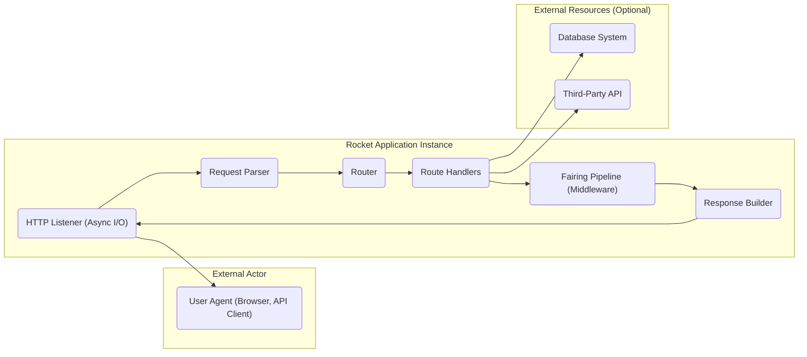
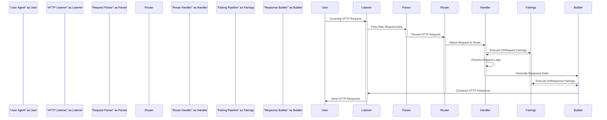

# Project Design Document: Rocket Web Framework

**Version:** 1.1
**Date:** October 26, 2023
**Author:** AI Software Architect

## 1. Introduction

This document provides an enhanced and detailed design overview of the Rocket web framework, based on the codebase available at [https://github.com/rwf2/rocket](https://github.com/rwf2/rocket). This iteration aims to provide even greater clarity and depth, specifically tailored for subsequent threat modeling activities. The document captures the key architectural components, data flows, and interactions within the framework with a focus on security-relevant aspects.

## 2. Goals and Objectives

The primary goals of the Rocket framework are to:

* Provide a memory-safe and efficient web development experience leveraging the Rust language.
* Offer a declarative and ergonomic API for building web applications, reducing boilerplate.
* Enforce compile-time safety guarantees, minimizing runtime errors and potential vulnerabilities.
* Empower developers to create highly robust and performant web services with a focus on security.

## 3. High-Level Architecture

The Rocket framework employs a layered architecture, meticulously handling incoming HTTP requests and intelligently routing them to the appropriate user-defined handlers. It heavily leverages Rust's strong type system and ownership model to ensure memory safety and performance, which inherently contributes to security.

**Architectural Components:**

* **HTTP Listener (Async I/O):**  The entry point for all incoming network traffic. It's responsible for asynchronously accepting TCP connections and managing the low-level details of network communication. Libraries like `tokio` or `async-std` are fundamental here.
* **Request Parser:**  Takes the raw byte stream from the HTTP Listener and parses it into a structured HTTP request object, extracting headers, method, path, and body.
* **Router:**  A crucial component that examines the parsed request's HTTP method and path to determine the correct route handler to invoke. It often uses efficient data structures like tries for fast lookups.
* **Route Handlers:**  The core business logic of the application resides here. These are developer-defined functions or asynchronous blocks annotated with route attributes (e.g., `#[get("/")]`). They process the request and generate a response.
* **Fairing Pipeline (Middleware):**  A powerful mechanism for intercepting and processing requests and responses. Fairings are executed in a defined order and can perform tasks like logging, authentication, authorization, request/response modification, and error handling.
* **Response Builder:**  Transforms the output from the Route Handler (or Fairings) into a well-formed HTTP response, setting appropriate status codes, headers (including security headers), and the response body.
* **Database System (Optional):**  External data stores that the application may interact with for persistent data management.
* **Third-Party API (Optional):**  External services or APIs that the application might communicate with to extend its functionality.

## 4. Component Details

This section provides a more granular examination of the key components within the Rocket framework, highlighting aspects relevant to security.

### 4.1 HTTP Listener (Async I/O)

* **Functionality:**  Establishes a listening socket on a specified network address and port, accepting incoming TCP connections asynchronously. Manages connection state and handles the initial stages of the HTTP handshake.
* **Implementation Details:**  Relies heavily on Rust's asynchronous I/O capabilities, typically using libraries like `tokio` or `async-std`. May handle TLS/SSL termination if configured for HTTPS.
* **Key Considerations for Threat Modeling:**
    * Susceptible to Denial-of-Service (DoS) and Distributed Denial-of-Service (DDoS) attacks if not properly protected (e.g., rate limiting).
    * Vulnerable to connection hijacking if TLS/SSL is not correctly implemented or uses weak configurations.
    * Potential vulnerabilities in the underlying asynchronous I/O library could be exploited.

### 4.2 Request Parser

* **Functionality:**  Decodes the raw byte stream received by the HTTP Listener into a structured HTTP request object. This involves parsing headers, the request line (method, path, protocol), and the request body.
* **Implementation Details:**  Likely uses a dedicated HTTP parsing library that adheres to HTTP specifications. Handles various encoding schemes and content types.
* **Key Considerations for Threat Modeling:**
    * Vulnerabilities in the parsing logic could lead to HTTP Request Smuggling attacks.
    * Failure to properly handle malformed requests could lead to unexpected behavior or crashes.
    * Inadequate handling of large request bodies can lead to resource exhaustion.

### 4.3 Router

* **Functionality:**  Matches an incoming request to the appropriate route handler based on the HTTP method and the request path. Supports pattern matching, parameterized routes, and potentially wildcards.
* **Implementation Details:**  Often implemented using a routing tree (trie) or a similar efficient data structure for fast route matching.
* **Key Considerations for Threat Modeling:**
    * Incorrectly defined or overlapping routes could lead to route hijacking or unintended access to resources.
    * Vulnerabilities in the routing logic itself could be exploited to bypass security checks.

### 4.4 Route Handlers

* **Functionality:**  Contain the core application logic. They receive the parsed request data and any extracted path parameters or state. They interact with other services, databases, or perform computations to generate a response.
* **Implementation Details:**  Defined by developers using Rocket's attribute macros. Can access request guards (e.g., for authentication), managed state, and other injected dependencies.
* **Key Considerations for Threat Modeling:**
    * The primary target for many common web application vulnerabilities, including:
        * Injection attacks (SQL, Command, OS Command, Log Injection).
        * Cross-Site Scripting (XSS) if response generation doesn't properly escape output.
        * Business logic flaws that allow for unauthorized actions or data manipulation.
        * Insecure direct object references (IDOR).

### 4.5 Fairing Pipeline (Middleware)

* **Functionality:**  Provides a powerful mechanism to intercept and process requests and responses at various stages of the request lifecycle. Enables cross-cutting concerns to be addressed in a modular way.
* **Types of Fairings:**
    * **OnRequest:** Executed before the route handler is invoked, allowing for request modification, authentication checks, logging, etc.
    * **OnResponse:** Executed after the route handler has generated a response, enabling response modification, adding security headers, logging, etc.
    * **Catch:** Handles errors that occur during request processing.
* **Implementation Details:**  Fairings are registered with the Rocket instance and are executed in a specific, developer-defined order.
* **Key Considerations for Threat Modeling:**
    * Incorrectly implemented fairings can introduce vulnerabilities or bypass existing security measures.
    * The order of fairing execution is critical; a misconfigured order can lead to security flaws.
    * Fairings intended for security (e.g., authentication) must be robust and correctly implemented.

### 4.6 Response Builder

* **Functionality:**  Constructs the final HTTP response to be sent back to the client. This involves setting the HTTP status code, response headers, and the response body.
* **Implementation Details:**  Handles serialization of data into various formats (e.g., JSON, HTML, XML). Allows setting custom headers, including security-related headers.
* **Key Considerations for Threat Modeling:**
    * Improperly set or missing security headers can leave the application vulnerable to various attacks (e.g., XSS, clickjacking).
    * Verbose error messages in the response body can leak sensitive information.
    * Vulnerabilities in serialization libraries could be exploited if untrusted data is being serialized.

### 4.7 Data Structures and State Management

* **Request Data:**  Includes HTTP headers, query parameters, path parameters extracted by the router, and the request body.
* **Managed State:** Rocket allows sharing state across requests using managed state. This state is accessible to route handlers and fairings.
* **Cookies and Sessions:** Mechanisms for maintaining user sessions, often implemented using cookies.
* **Key Considerations for Threat Modeling:**
    * Improper handling or sanitization of request data can lead to injection vulnerabilities.
    * Insecure storage or management of managed state can expose sensitive information.
    * Vulnerabilities in cookie handling or session management can lead to session hijacking or fixation attacks.

## 5. Data Flow

The typical data flow for an incoming HTTP request in a Rocket application follows this sequence:

**Detailed Steps:**

1. **User Agent sends an HTTP request:** The user interacts with the application through a browser, API client, or other means.
2. **HTTP Listener receives the request:** The Rocket application's HTTP Listener accepts the incoming TCP connection and receives the raw request data.
3. **Request Parser parses the request:** The Request Parser decodes the raw bytes into a structured HTTP request object.
4. **Router matches the request to a route:** The Router examines the parsed request's method and path to find the corresponding Route Handler.
5. **OnRequest Fairings are executed:** Any registered `OnRequest` fairings are executed in their defined order, potentially modifying the request or performing pre-processing tasks.
6. **Route Handler processes the request:** The matched Route Handler function is invoked, executing the core application logic. It may interact with databases or external services.
7. **Response Data is generated:** The Route Handler produces the data that needs to be sent back to the user.
8. **OnResponse Fairings are executed:** Any registered `OnResponse` fairings are executed, potentially modifying the response (e.g., adding security headers) or performing post-processing tasks.
9. **Response Builder constructs the HTTP response:** The Response Builder takes the data from the handler and constructs a complete HTTP response, including the status code, headers, and body.
10. **HTTP Listener sends the response:** The HTTP Listener transmits the generated HTTP response back to the User Agent.

## 6. Security Considerations

This section expands on the security considerations, providing more specific examples of potential threats and mitigation strategies relevant to each component.

* **Input Validation and Sanitization:**
    * **Threat:** Injection attacks (SQL, Command, XSS).
    * **Mitigation:** Implement robust input validation and sanitization in Route Handlers and Fairings. Use parameterized queries for database interactions. Escape output properly to prevent XSS.
* **Authentication and Authorization:**
    * **Threat:** Unauthorized access to resources, privilege escalation.
    * **Mitigation:** Implement secure authentication mechanisms (e.g., JWT, OAuth 2.0) using Fairings. Enforce authorization checks within Route Handlers based on user roles or permissions.
* **Cross-Site Scripting (XSS):**
    * **Threat:** Malicious scripts injected into the application, potentially stealing user credentials or performing unauthorized actions.
    * **Mitigation:** Properly escape all user-generated content before rendering it in HTML responses. Utilize Content Security Policy (CSP) headers.
* **Cross-Site Request Forgery (CSRF):**
    * **Threat:** Unauthorized actions performed on behalf of an authenticated user without their knowledge.
    * **Mitigation:** Implement anti-CSRF tokens for state-changing requests. Utilize `SameSite` attribute for cookies.
* **SQL Injection:**
    * **Threat:** Attackers can manipulate database queries to gain unauthorized access to or modify data.
    * **Mitigation:** Always use parameterized queries or prepared statements when interacting with databases. Avoid constructing SQL queries from user input directly.
* **Command Injection:**
    * **Threat:** Attackers can execute arbitrary commands on the server.
    * **Mitigation:** Avoid executing external commands based on user input. If necessary, carefully sanitize input and use safe APIs.
* **Session Management:**
    * **Threat:** Session hijacking, session fixation.
    * **Mitigation:** Use secure, HTTP-only, and `SameSite` cookies for session management. Implement session invalidation after logout or inactivity. Regenerate session IDs after login.
* **TLS/SSL Configuration:**
    * **Threat:** Man-in-the-middle attacks, eavesdropping.
    * **Mitigation:** Enforce HTTPS by default. Use strong TLS configurations with up-to-date ciphers. Implement HTTP Strict Transport Security (HSTS).
* **Dependency Management:**
    * **Threat:** Using vulnerable dependencies can expose the application to known exploits.
    * **Mitigation:** Regularly audit and update dependencies. Use tools to scan for known vulnerabilities in dependencies.
* **Logging and Monitoring:**
    * **Threat:** Difficulty in detecting and responding to security incidents.
    * **Mitigation:** Implement comprehensive logging of security-relevant events. Monitor application logs for suspicious activity.
* **Error Handling:**
    * **Threat:** Information leakage through verbose error messages.
    * **Mitigation:** Avoid displaying sensitive information in error messages. Provide generic error messages to users while logging detailed errors securely.
* **Denial of Service (DoS) Protection:**
    * **Threat:** Application becomes unavailable due to resource exhaustion.
    * **Mitigation:** Implement rate limiting, request size limits, and other mechanisms to mitigate DoS attacks. Consider using a Web Application Firewall (WAF).
* **CORS Configuration:**
    * **Threat:** Unauthorized access to resources from different origins.
    * **Mitigation:** Configure CORS policies carefully to allow only trusted origins to access the application's resources.
* **Security Headers:**
    * **Threat:** Vulnerability to various client-side attacks.
    * **Mitigation:** Utilize security-related HTTP headers such as `Content-Security-Policy`, `Strict-Transport-Security`, `X-Frame-Options`, `X-Content-Type-Options`, and `Referrer-Policy`.

## 7. Deployment Considerations

The deployment environment significantly influences the security posture of the Rocket application.

* **Operating System and Environment Hardening:** Secure the underlying operating system and environment by applying security patches, disabling unnecessary services, and configuring firewalls.
* **Reverse Proxy Configuration:** Utilize a reverse proxy (e.g., Nginx, Apache) for TLS termination, load balancing, and adding security features like request filtering and WAF capabilities.
* **Containerization Security:** When using containers (e.g., Docker), ensure secure container image creation, vulnerability scanning of images, and proper container runtime configuration.
* **Cloud Environment Security:** When deploying to cloud platforms (e.g., AWS, Azure, GCP), leverage the cloud provider's security services and follow security best practices for the specific platform. Understand the shared responsibility model.
* **Secrets Management:** Securely manage sensitive information like API keys, database credentials, and TLS certificates using dedicated secrets management solutions.

## 8. Future Considerations

* **Enhanced built-in support for common security patterns and best practices.**
* **More fine-grained control over Fairing execution order and conditional execution.**
* **Improved tooling and documentation for security auditing and vulnerability analysis of Rocket applications.**
* **Exploration of formal verification techniques to enhance the security guarantees of the framework itself.**

This revised document provides a more in-depth and security-focused design overview of the Rocket web framework. The detailed information presented here will be invaluable for conducting thorough threat modeling exercises and developing robust security strategies for applications built with Rocket.
