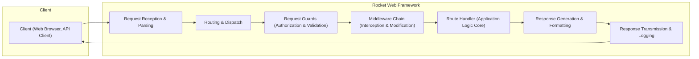
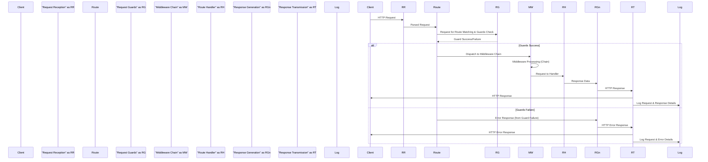
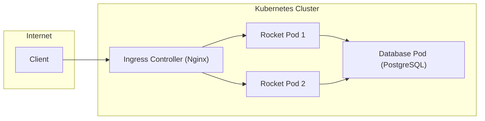

## Project Design Document: Rocket Web Framework (Improved)

### 1. Project Overview

*   **Project Name:** Rocket
*   **Project Repository:** [https://github.com/rwf2/rocket](https://github.com/rwf2/rocket)
*   **Project Description:** Rocket is a performant web framework for Rust, emphasizing developer ergonomics, speed, and inherent security through Rust's type system and memory safety. It aims to simplify web application development in Rust by providing a declarative and intuitive API.
*   **Project Goals:**
    *   **Ergonomics:** Provide a developer-friendly API that minimizes boilerplate and maximizes productivity.
    *   **Performance:** Leverage Rust's performance characteristics to create a fast and efficient web framework.
    *   **Security:** Design with security in mind, utilizing Rust's safety features and incorporating best practices to facilitate secure application development.
    *   **Extensibility:** Offer a modular architecture that allows for customization and extension through middleware and plugins.
    *   **Maintainability:** Promote code clarity and maintainability through a well-structured and documented codebase.

### 2. Architecture Overview

Rocket employs a layered architecture, separating concerns for request handling, routing, application logic, and response generation. This modular design enhances maintainability and security.

*   **Request Reception & Parsing:**  Handles incoming HTTP connections, TLS termination (if HTTPS), and parsing of raw HTTP requests into structured data.
*   **Routing & Dispatch:** Matches incoming requests to defined routes based on URI, HTTP method, and other criteria. Dispatches requests to the appropriate handlers.
*   **Request Guards (Authorization & Validation):**  A powerful feature in Rocket, Request Guards are types that must be successfully constructed before a route handler is invoked. They are used for request validation, authentication, and authorization.
*   **Middleware Chain (Interception & Modification):**  Provides a chain of functions to intercept and process requests and responses. Used for cross-cutting concerns like logging, security header injection, and request/response modification.
*   **Route Handler (Application Logic Core):**  Contains the application's business logic, processing requests and generating responses.
*   **Response Generation & Formatting:**  Constructs HTTP responses from handler outputs, setting headers, status codes, and formatting the response body (e.g., JSON serialization, HTML rendering).
*   **Response Transmission & Logging:**  Sends the generated response back to the client and performs request/response logging for monitoring and auditing.

### 3. Component Design

#### 3.1. Request Reception & Parsing

*   **Functionality:**
    *   **Connection Handling:** Listens on configured ports (HTTP/HTTPS), manages TCP connections, and handles TLS handshake for HTTPS using libraries like `rustls` or `openssl-rs`.
    *   **HTTP Parsing:** Parses raw byte streams into HTTP request structures, adhering to RFC 7230 and related specifications. Uses robust HTTP parsing libraries to prevent vulnerabilities related to malformed requests.
    *   **Request Object Construction:** Creates a structured request object containing:
        *   HTTP Method (e.g., GET, POST, PUT, DELETE).
        *   Request URI (path, query parameters, fragments).
        *   HTTP Headers (parsed into key-value pairs).
        *   Request Body (as a stream or buffered data).
        *   Client IP Address and other connection metadata.
*   **Implementation Details (Conceptual):**
    *   Asynchronous I/O using `tokio` or `async-std` for non-blocking connection handling and efficient concurrency.
    *   HTTP parsing likely leverages crates like `httparse` or `hyper`'s HTTP parsing components.
    *   Error handling for invalid HTTP requests, returning appropriate HTTP error responses (e.g., 400 Bad Request).
*   **Security Considerations:**
    *   **DoS Protection:** Connection limits, timeouts, and request size limits to mitigate denial-of-service attacks.
    *   **Malformed Request Handling:** Robust parsing to prevent vulnerabilities like header injection, request smuggling, and buffer overflows due to oversized headers or bodies.
    *   **TLS Configuration:** Secure TLS configuration (strong cipher suites, up-to-date TLS versions) to protect confidentiality and integrity of communication.
    *   **IP Address Handling:** Securely handle and log client IP addresses, considering privacy implications and potential for IP spoofing.

#### 3.2. Routing & Dispatch

*   **Functionality:**
    *   **Route Definition:**  Provides a declarative API (using attributes or macros) for defining routes with path patterns, HTTP methods, and associated handlers.
    *   **Route Registry:** Maintains an efficient data structure (e.g., a trie or hash map) to store registered routes and their handlers.
    *   **Request Matching:** Matches incoming requests against registered routes based on:
        *   URI Path: Exact matches, parameterized segments (`<param>`), and catch-all segments (`..`).
        *   HTTP Method: Restricting routes to specific HTTP verbs (GET, POST, etc.).
        *   Content-Type or Accept Headers (for content negotiation, potentially).
    *   **Parameter Extraction:** Extracts path parameters from the request URI based on route definitions and makes them available to route handlers.
    *   **Dispatching:** Invokes the appropriate route handler for a matched route. If no route matches, dispatches to a default 404 Not Found handler.
*   **Implementation Details (Conceptual):**
    *   Efficient route matching algorithms for fast lookup, even with a large number of routes.
    *   Likely uses Rust's powerful macro system for declarative route definition.
    *   Error handling for route definition conflicts or invalid route patterns.
*   **Security Considerations:**
    *   **Route Hijacking Prevention:** Careful design of route matching logic to prevent unintended route matches or hijacking due to overlapping or overly broad route definitions.
    *   **Path Traversal Prevention:** Proper handling of URL encoding and decoding to avoid path traversal vulnerabilities through manipulated URI paths.
    *   **Route Enumeration Mitigation:**  Consider strategies to prevent or mitigate route enumeration attacks, where attackers try to discover all available routes.

#### 3.3. Request Guards (Authorization & Validation)

*   **Functionality:**
    *   **Declarative Authorization & Validation:**  Allows developers to declaratively specify authorization and validation logic as part of route definitions using custom types that implement the `FromRequest` trait.
    *   **Request Context Access:** Request Guards have access to the incoming request context (headers, cookies, path parameters, etc.) to perform validation and authorization checks.
    *   **Conditional Route Handling:**  Route handlers are only invoked if all associated Request Guards successfully construct themselves. If a guard fails, it can abort the request with an error response (e.g., 401 Unauthorized, 403 Forbidden, 400 Bad Request).
    *   **Data Extraction & Transformation:** Request Guards can extract and transform data from the request and make it available to route handlers as typed parameters.
*   **Implementation Details (Conceptual):**
    *   Rust's type system and traits are central to the Request Guard mechanism.
    *   `FromRequest` trait defines the interface for Request Guards, requiring implementation of a `from_request` method that attempts to construct the guard type from the request context.
    *   Failure of a Request Guard typically results in a "failure" outcome, preventing route handler execution.
*   **Security Considerations:**
    *   **Centralized Authorization:** Encourages a centralized and declarative approach to authorization, making it easier to reason about and audit security policies.
    *   **Input Validation Enforcement:**  Provides a structured way to enforce input validation before application logic is executed, reducing the risk of injection attacks and data integrity issues.
    *   **Type Safety:** Rust's type system ensures that Request Guards are correctly implemented and used, reducing the likelihood of common authorization and validation errors.
    *   **Guard Implementation Security:**  Security of the application heavily relies on the correct and secure implementation of custom Request Guards. Guards should be carefully reviewed for potential vulnerabilities.

#### 3.4. Middleware Chain (Interception & Modification)

*   **Functionality:**
    *   **Request/Response Interception:** Allows functions (middleware) to intercept and process requests before they reach route handlers and responses before they are sent to clients.
    *   **Middleware Chaining:** Middleware functions are executed in a defined order, forming a chain. This allows for modular and composable request/response processing.
    *   **Cross-Cutting Concerns:** Middleware is used to handle cross-cutting concerns such as:
        *   Logging (request/response details, performance metrics).
        *   Authentication and Authorization (if not handled by Request Guards or for broader application-level checks).
        *   Security Header Injection (e.g., CSP, HSTS, X-Frame-Options).
        *   Request/Response Modification (e.g., compression, content transformation).
        *   Error Handling (global error handling and reporting).
*   **Implementation Details (Conceptual):**
    *   Middleware functions likely have a specific signature that takes the request and potentially the next middleware in the chain as input and returns a modified request or response.
    *   Middleware registration mechanism (e.g., application builder pattern) to define the order of middleware execution.
*   **Security Considerations:**
    *   **Middleware Order Importance:** The order of middleware execution is crucial for security. Ensure that security-related middleware (e.g., authentication, authorization, security headers) are executed in the correct order.
    *   **Middleware Security Auditing:**  Middleware functions should be carefully audited for security vulnerabilities, as they have broad access to requests and responses.
    *   **Avoid Overly Complex Middleware:**  Keep middleware functions focused and avoid overly complex logic to improve maintainability and reduce the risk of introducing vulnerabilities.
    *   **Secure Logging Practices:** Middleware used for logging should follow secure logging practices to avoid logging sensitive data and protect log files.

#### 3.5. Route Handler (Application Logic Core)

*   **Functionality:**
    *   **Application-Specific Logic:** Contains the core business logic of the web application, processing requests and generating responses for specific routes.
    *   **Request Data Access:** Route handlers receive processed request data, including path parameters, query parameters, request body (potentially parsed and validated by Request Guards or within the handler), and other request context.
    *   **Response Generation:** Route handlers are responsible for generating responses, which can be various types:
        *   HTML, JSON, XML, plain text content.
        *   Redirects.
        *   File downloads.
        *   Error responses (using Rocket's error handling mechanisms).
*   **Implementation Details (Conceptual):**
    *   Route handlers are typically Rust functions with signatures that match the route definition and accept extracted parameters and request data.
    *   Developers are responsible for implementing secure, efficient, and correct application logic within route handlers.
*   **Security Considerations:**
    *   **Input Validation & Sanitization:**  Even with Request Guards, route handlers should perform further input validation and sanitization specific to their application logic to prevent injection attacks.
    *   **Secure Data Handling:**  Route handlers must handle sensitive data (e.g., user credentials, personal information) securely, following best practices for storage, processing, and transmission.
    *   **Authorization Enforcement:**  While Request Guards provide initial authorization, route handlers may need to perform more granular authorization checks based on application logic.
    *   **Error Handling & Information Leakage:**  Implement robust error handling to prevent information leakage in error responses. Avoid exposing sensitive details in error messages or stack traces.
    *   **Rate Limiting (Handler-Specific):**  Consider implementing rate limiting within route handlers for specific sensitive operations to prevent abuse.

#### 3.6. Response Generation & Formatting

*   **Functionality:**
    *   **Response Object Construction:** Creates HTTP response objects, setting:
        *   HTTP Status Code (e.g., 200 OK, 404 Not Found, 500 Internal Server Error).
        *   HTTP Headers (Content-Type, Cache-Control, Security Headers, etc.).
        *   Response Body (content to be sent to the client).
    *   **Content Formatting:** Handles formatting of response bodies based on content type and application needs:
        *   JSON serialization (using crates like `serde_json`).
        *   HTML templating (using templating engines like `Handlebars`, `Tera`, or `Mustache`).
        *   Plain text encoding.
        *   File serving (streaming file content).
    *   **Content Negotiation (Potentially):** May support content negotiation based on client `Accept` headers to serve responses in the preferred format.
*   **Implementation Details (Conceptual):**
    *   Provides convenient APIs and abstractions for constructing responses with different content types and formats.
    *   Likely uses Rust's type system to ensure type-safe response construction.
*   **Security Considerations:**
    *   **Output Encoding:**  Crucial to perform proper output encoding (e.g., HTML escaping, JSON encoding) to prevent cross-site scripting (XSS) vulnerabilities. Rocket should provide mechanisms or encourage secure output encoding practices.
    *   **Security Header Injection:**  Ensure that appropriate security headers (CSP, HSTS, X-Frame-Options, etc.) are set in responses, either through middleware or directly in response generation.
    *   **Sensitive Data in Responses:**  Carefully review responses to avoid accidentally including sensitive data that should not be exposed to clients.
    *   **Content-Type Mismatch:**  Ensure that the `Content-Type` header accurately reflects the actual content of the response body to prevent browser misinterpretation and potential vulnerabilities.

#### 3.7. Response Transmission & Logging

*   **Functionality:**
    *   **Response Transmission:** Sends the generated HTTP response back to the client over the network connection using asynchronous I/O.
    *   **Connection Management:** Handles connection keep-alive and closing connections after response transmission.
    *   **Logging:** Logs request and response details for monitoring, auditing, and debugging. Logging typically includes:
        *   Request URI, HTTP method, client IP.
        *   Response status code, response size.
        *   Request processing time.
        *   Potentially error details.
*   **Implementation Details (Conceptual):**
    *   Utilizes asynchronous networking capabilities for efficient response transmission.
    *   Logging likely uses Rust's logging ecosystem (e.g., `log` crate) and can be configured to write logs to files, console, or external logging services.
*   **Security Considerations:**
    *   **HTTPS Enforcement:**  Ensure that responses are transmitted over HTTPS/TLS to protect confidentiality and integrity during transmission.
    *   **Secure Logging:**
        *   Avoid logging sensitive data (e.g., passwords, API keys, personal information) in logs.
        *   Secure log storage and access control to prevent unauthorized access to log data.
        *   Consider log rotation and retention policies to manage log volume and security.
    *   **Error Logging Rate Limiting:**  In high-volume environments, consider rate limiting error logging to prevent log flooding in case of widespread errors.

### 4. Data Flow (Improved Sequence Diagram)

1.  **Client sends HTTP Request:** Client initiates an HTTP request.
2.  **Request Reception receives & parses:**  Receives and parses the raw request.
3.  **Routing matches & checks Guards:** Routing matches the request to a route and initiates Request Guard checks.
4.  **Request Guards evaluate:** Request Guards are evaluated.
5.  **Guards Success Path:**
    *   **Dispatch to Middleware:** If all guards succeed, the request is dispatched to the Middleware Chain.
    *   **Middleware Processing:** Middleware chain processes the request and response.
    *   **Route Handler executes:** The Route Handler processes the request and generates response data.
    *   **Response Generation:** Response Generation constructs the HTTP response.
    *   **Response Transmission:** Response Transmission sends the response to the client.
    *   **Logging:** Request and response details are logged.
6.  **Guards Failure Path:**
    *   **Error Response from Guards:** If any Request Guard fails, an error response is generated (e.g., 401, 403, 400).
    *   **Response Generation (Error):** Response Generation constructs the HTTP error response.
    *   **Response Transmission (Error):** Response Transmission sends the error response.
    *   **Logging (Error):** Request and error details are logged.

### 5. Technology Stack (Expanded)

*   **Programming Language:** Rust (leveraging memory safety and performance)
*   **Web Framework:** Rocket (itself)
*   **Asynchronous Runtime:** `tokio` or `async-std` (for non-blocking I/O and concurrency)
*   **HTTP Server Implementation:** Likely built upon or using components from:
    *   `hyper`: A popular HTTP library for Rust.
    *   `tungstenite-rs` or similar for WebSocket support (if applicable).
*   **TLS/SSL:**
    *   `rustls`: Rust-native TLS library, known for security and performance.
    *   `openssl-rs`: Bindings to OpenSSL, providing broader compatibility.
*   **HTTP Parsing:**
    *   `httparse`: Fast and lightweight HTTP parser.
    *   `http-rs`:  HTTP types and utilities.
*   **Routing:**  Rocket's own routing implementation, likely using efficient data structures and algorithms.
*   **Data Serialization/Deserialization:**
    *   `serde` and `serde_json`: For JSON handling and general serialization/deserialization.
    *   `form_urlencoded`: For parsing form data.
*   **Templating Engines (Optional):**
    *   `Handlebars-rust`, `Tera`, `Mustache` (depending on application choice).
*   **Database Interaction (Optional):**
    *   `diesel`: ORM for Rust.
    *   `sqlx`: Asynchronous SQL toolkit.
    *   `mongodb`: MongoDB driver for Rust.
*   **Logging:**
    *   `log`: Rust's standard logging facade.
    *   `tracing`:  Structured logging and diagnostics.

### 6. Deployment Architecture (Detailed Scenarios)

*   **Deployment Environments:**
    *   **Cloud Platforms (AWS, Azure, GCP):**
        *   **Virtual Machines (VMs/EC2, Azure VMs, Compute Engine):** Traditional deployment, offering control over the environment. Security relies on VM hardening, network security groups, and OS-level security.
        *   **Containers (Docker/Kubernetes - ECS, AKS, GKE):** Containerization provides isolation and scalability. Security considerations include container image security, Kubernetes security best practices, and network policies.
        *   **Serverless (AWS Lambda, Azure Functions, Cloud Functions):**  For event-driven applications. Security focuses on function code security, IAM roles, and API Gateway configuration. Rocket might be less directly suited for serverless due to its server-centric nature, but could be adapted with custom runtimes.
    *   **On-Premise Servers:** Deployment on physical or virtual servers in a private data center. Security is managed by the organization, including physical security, network security, and server hardening.
    *   **PaaS (Platform as a Service - Heroku, Render):** Simplified deployment and management. Security relies on the PaaS provider's security measures and application-level security.

*   **Deployment Models:**
    *   **Standalone Application Server:** Rocket application runs as a single process or cluster of processes directly serving HTTP requests.
    *   **Reverse Proxy Setup:**  A reverse proxy (Nginx, Apache, Caddy) is placed in front of Rocket for TLS termination, static file serving, load balancing, and security enhancements. This is a recommended best practice for production deployments.

*   **Infrastructure Components (Example - Kubernetes Deployment with Reverse Proxy):**

    *   **Ingress Controller (Nginx):**  Handles external access to the Kubernetes cluster, performs TLS termination, routing, and load balancing to Rocket pods.
    *   **Rocket Pods:**  Containers running instances of the compiled Rocket application. Kubernetes manages scaling, health checks, and restarts.
    *   **Database Pod (PostgreSQL):**  Containerized database server for persistent data storage. Kubernetes manages database deployment and scaling.
    *   **Kubernetes Services:**  Internal Kubernetes services to expose Rocket pods and the database pod within the cluster.
    *   **Persistent Volumes (Optional):** For persistent storage of database data or application files.

### 7. Security Considerations (Detailed & Threat Modelling Focus)

*   **Input Validation & Sanitization (Threat: Injection Attacks):**
    *   **Threat:** SQL Injection, Command Injection, Cross-Site Scripting (XSS), Path Traversal, etc.
    *   **Mitigation:**
        *   **Request Guards:** Utilize Request Guards for declarative input validation and authorization.
        *   **Data Type Validation:** Leverage Rust's type system to ensure data conforms to expected types.
        *   **Sanitization Libraries:** Use libraries to sanitize user inputs before processing or displaying them.
        *   **Parameterized Queries/ORMs:**  For database interactions, use parameterized queries or ORMs to prevent SQL injection.
        *   **Output Encoding:**  Properly encode outputs to prevent XSS (HTML escaping, JSON encoding).

*   **Output Encoding (Threat: Cross-Site Scripting - XSS):**
    *   **Threat:** XSS attacks where malicious scripts are injected into web pages viewed by other users.
    *   **Mitigation:**
        *   **Context-Aware Output Encoding:** Encode output based on the context (HTML, JavaScript, URL, etc.).
        *   **Content Security Policy (CSP):** Implement CSP headers to control the sources from which the browser is allowed to load resources, mitigating XSS risks.
        *   **Template Engines with Auto-Escaping:** Use templating engines that provide automatic output escaping by default.

*   **Authentication & Authorization (Threat: Unauthorized Access):**
    *   **Threat:** Unauthorized users gaining access to sensitive data or functionality.
    *   **Mitigation:**
        *   **Request Guards for Authentication:** Implement Request Guards to authenticate users based on credentials (e.g., tokens, sessions).
        *   **Request Guards for Authorization:** Implement Request Guards to authorize users based on roles or permissions before accessing specific routes or resources.
        *   **Role-Based Access Control (RBAC):** Implement RBAC to manage user permissions and roles.
        *   **OAuth 2.0/OpenID Connect:**  Integrate with standard authentication and authorization protocols for API access and user authentication.
        *   **Secure Session Management:** Use secure session management practices (secure cookies, session invalidation, protection against session fixation and hijacking).

*   **HTTPS/TLS (Threat: Man-in-the-Middle Attacks, Data Eavesdropping):**
    *   **Threat:**  Data transmitted between client and server being intercepted or modified by attackers.
    *   **Mitigation:**
        *   **Enforce HTTPS:**  Configure Rocket and deployment infrastructure to enforce HTTPS for all communication.
        *   **HSTS (HTTP Strict Transport Security):** Implement HSTS headers to instruct browsers to always use HTTPS for future connections.
        *   **Strong TLS Configuration:** Use strong cipher suites, disable insecure TLS versions, and ensure up-to-date TLS libraries.

*   **Security Headers (Threat: Various Client-Side Attacks):**
    *   **Threat:** Clickjacking, frame injection, MIME-sniffing vulnerabilities, etc.
    *   **Mitigation:**
        *   **Content Security Policy (CSP):**  As mentioned above, CSP is crucial for mitigating XSS and other client-side attacks.
        *   **X-Frame-Options:** Prevent clickjacking attacks by controlling whether the application can be embedded in frames.
        *   **X-Content-Type-Options: nosniff:** Prevent MIME-sniffing vulnerabilities.
        *   **Referrer-Policy:** Control how much referrer information is sent with requests.
        *   **Permissions-Policy (Feature-Policy):** Control browser features that the application is allowed to use.

*   **Dependency Management (Threat: Vulnerable Dependencies):**
    *   **Threat:** Using third-party libraries with known security vulnerabilities.
    *   **Mitigation:**
        *   **`cargo audit`:** Regularly use `cargo audit` to check for known vulnerabilities in dependencies.
        *   **Dependency Updates:** Keep dependencies updated to the latest secure versions.
        *   **Dependency Review:** Review dependencies for security implications before including them in the project.
        *   **Supply Chain Security:** Consider the security of the entire dependency supply chain.

*   **Error Handling & Logging (Threat: Information Leakage, Log Data Exposure):**
    *   **Threat:**  Exposing sensitive information in error messages or logs, unauthorized access to log data.
    *   **Mitigation:**
        *   **Generic Error Responses:**  Return generic error messages to clients, avoiding detailed error information that could be exploited.
        *   **Secure Logging Practices:** Avoid logging sensitive data. Securely store and access log files. Implement log rotation and retention policies.
        *   **Centralized Logging:** Use centralized logging systems for better security monitoring and auditing.

*   **Denial of Service (DoS) Protection (Threat: Service Disruption):**
    *   **Threat:**  Attackers overwhelming the application with requests, making it unavailable to legitimate users.
    *   **Mitigation:**
        *   **Rate Limiting:** Implement rate limiting at various levels (reverse proxy, middleware, route handlers) to restrict the number of requests from a single source.
        *   **Request Size Limits:** Limit the size of incoming requests to prevent resource exhaustion.
        *   **Connection Limits:** Limit the number of concurrent connections.
        *   **Timeouts:** Configure timeouts for requests and connections to prevent long-running requests from consuming resources indefinitely.
        *   **Load Balancing:** Distribute traffic across multiple instances to improve resilience to DoS attacks.
        *   **Web Application Firewall (WAF):**  Consider using a WAF to filter malicious traffic and protect against common web attacks.

*   **Regular Security Audits & Updates (Proactive Security):**
    *   **Mitigation:**
        *   **Security Code Reviews:** Conduct regular security code reviews to identify potential vulnerabilities.
        *   **Penetration Testing:** Perform penetration testing to simulate real-world attacks and identify weaknesses.
        *   **Vulnerability Scanning:** Use automated vulnerability scanning tools to detect known vulnerabilities in the application and dependencies.
        *   **Stay Updated:** Keep Rocket framework, Rust toolchain, dependencies, and deployment infrastructure updated with the latest security patches.
        *   **Security Monitoring:** Implement security monitoring and alerting to detect and respond to security incidents.

This improved design document provides a more detailed and security-focused foundation for threat modelling the Rocket web framework and applications built upon it. It highlights key components, data flows, technologies, deployment considerations, and a comprehensive initial set of security considerations to guide further threat analysis and mitigation planning.