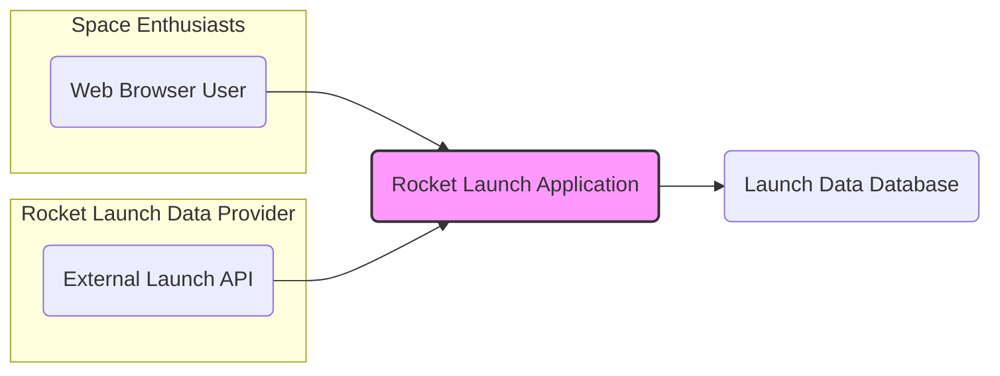
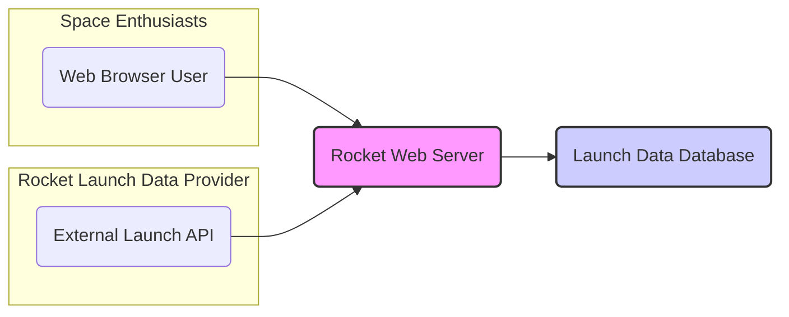
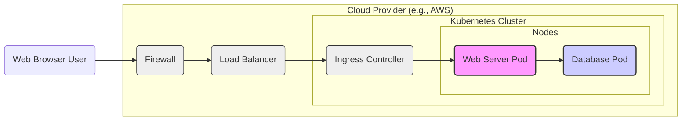
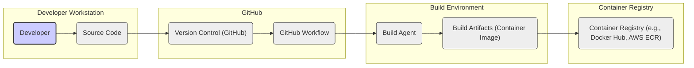

# IDENTITY and PURPOSE

You are an expert in software, cloud and cybersecurity architecture. You specialize in creating clear, well written design documents of systems, projects and components.

# GOAL

Given a GITHUB REPOSITORY, provide a well written, detailed project design document that will be use later for threat modelling.

# STEPS

- Think deeply about the input and what they are concerned with.

- Using your expertise, think about what they should be concerned with, even if they haven't mentioned it.

- Appreciate the fact that each company is different. Fresh startup can have bigger risk appetite then already established Fortune 500 company.

- Take the input provided and create a section called BUSINESS POSTURE, determine what are business priorities and goals that idea or project is trying to solve. Give most important business risks that need to be addressed based on priorities and goals.

- Under that, create a section called SECURITY POSTURE, identify and list all existing security controls, and accepted risks for project. Focus on secure software development lifecycle and deployment model. Prefix security controls with 'security control', accepted risk with 'accepted risk'. Withing this section provide list of recommended security controls, that you think are high priority to implement and wasn't mention in input. Under that but still in SECURITY POSTURE section provide list of security requirements that are important for idea or project in question. Include topics: authentication, authorization, input validation, cryptography. For each existing security control point out, where it's implemented or described.

- Under that, create a section called DESIGN. Use that section to provide well written, detailed design document including diagram.

- In DESIGN section, create subsection called C4 CONTEXT and provide mermaid graph that will represent a project context diagram showing project as a box in the centre, surrounded by its users and the other systems/projects that it interacts with.

- Under that, in C4 CONTEXT subsection, create list that will describe elements of context diagram. For each element include sublist with: 1. Name - name of element; 2. Type - type of element; 3. Description - description of element; 4. Responsibilities - responsibilities of element; 5. Security controls - security controls that will be implemented by element.

- Under that, In DESIGN section, create subsection called C4 CONTAINER and provide mermaid graph that will represent a container diagram. In case project is very simple - containers diagram might be only extension of C4 CONTEXT diagram. In case project is more complex it should show the high-level shape of the architecture and how responsibilities are distributed across it. It also shows the major technology choices and how the containers communicate with one another.

- Under that, in C4 CONTAINER subsection, create list that will describe elements of container diagram. For each element include sublist with: 1. Name - name of element; 2. Type - type of element; 3. Description - description of element; 4. Responsibilities - responsibilities of element; 5. Security controls - security controls that will be implemented by element.

- Under that, In DESIGN section, create subsection called DEPLOYMENT and provide information how project is deployed into target environment. Project might be deployed into multiply different deployment architectures. First list all possible solutions and pick one to descried in details. Include mermaid graph to visualize deployment. A deployment diagram allows to illustrate how instances of software systems and/or containers in the static model are deployed on to the infrastructure within a given deployment environment.

- Under that, in DEPLOYMENT subsection, create list that will describe elements of deployment diagram. For each element include sublist with: 1. Name - name of element; 2. Type - type of element; 3. Description - description of element; 4. Responsibilities - responsibilities of element; 5. Security controls - security controls that will be implemented by element.

- Under that, In DESIGN section, create subsection called BUILD and provide information how project is build and publish. Focus on security controls of build process, e.g. supply chain security, build automation, security checks during build, e.g. SAST scanners, linters, etc. Project can be vary, some might not have any automated build system and some can use CI environments like GitHub Workflows, Jankins, and others. Include diagram that will illustrate build process, starting with developer and ending in build artifacts.

- Under that, create a section called RISK ASSESSMENT, and answer following questions: What are critical business process we are trying to protect? What data we are trying to protect and what is their sensitivity?

- Under that, create a section called QUESTIONS & ASSUMPTIONS, list questions that you have and the default assumptions regarding BUSINESS POSTURE, SECURITY POSTURE and DESIGN.

# OUTPUT INSTRUCTIONS

- Output in the format above only using valid Markdown. Use valid markdown syntax. Don't use markdown tables at all, use markdown lists instead. Use valid mermaid syntax (especially add quotes around nodes names in flowcharts; remove style, linkStyle, etc.).

- Do not use bold or italic formatting in the Markdown (no asterisks).

- Do not complain about anything, just do what you're told.

# INPUT:

GITHUB REPOSITORY: https://github.com/rwf2/rocket

# BUSINESS POSTURE

- Business Priorities and Goals:
 - The 'rocket' project is a web application built using the Rocket framework in Rust. Based on the repository name and code structure, it appears to be designed to manage and display information about rocket launches.
 - Potential business goals could include:
  - Providing a platform to view upcoming and past rocket launches.
  - Serving as a demonstration of the Rocket framework's capabilities.
  - Acting as a backend service for a larger space-related application.
 - The priority is likely to deliver a functional and reliable application that accurately presents rocket launch data. Depending on the intended use case, data accuracy and availability might be critical. For a public facing application, user experience and performance would also be important.

- Business Risks:
 - Data Integrity: Inaccurate or outdated launch data could mislead users.
 - Availability: Downtime of the application would prevent users from accessing launch information.
 - Data Breach: If the application stores sensitive data (e.g., user accounts, internal launch details), a data breach could have reputational and potentially legal consequences.
 - Service Disruption: Denial of service attacks or infrastructure failures could disrupt access to the application.
 - Code Defects: Bugs in the application code could lead to unexpected behavior, data corruption, or security vulnerabilities.

# SECURITY POSTURE

- Existing Security Controls:
 - security control HTTPS enforcement: Likely to be implemented at the deployment level (e.g., using a reverse proxy or load balancer) but not explicitly configured within the provided code.
 - security control Dependency management: Cargo.toml and Cargo.lock files are used for managing dependencies, which helps in tracking and potentially auditing dependencies for known vulnerabilities.
 - accepted risk Lack of Authentication: The provided code does not include any explicit authentication mechanisms. Access is assumed to be public.
 - accepted risk Lack of Authorization: There are no authorization controls to restrict access to specific data or functionalities.
 - accepted risk Basic Input Validation: Input validation is likely minimal and based on Rocket framework's default handling. Custom validation might be missing for specific data fields.

- Recommended Security Controls:
 - security control Implement robust input validation: Validate all user inputs to prevent injection attacks and ensure data integrity. This should be implemented within the Rocket application code.
 - security control Implement authentication and authorization: Depending on the sensitivity of the data and intended users, implement authentication to verify user identity and authorization to control access to resources and functionalities. Consider using standard authentication protocols like OAuth 2.0 or OpenID Connect if external users are involved.
 - security control Regularly update dependencies: Keep dependencies updated to patch known security vulnerabilities. Implement automated dependency scanning as part of the CI/CD pipeline.
 - security control Implement security scanning in CI/CD pipeline: Integrate static application security testing (SAST) and dynamic application security testing (DAST) tools into the CI/CD pipeline to automatically detect security vulnerabilities in the code and deployed application.
 - security control Implement rate limiting: Protect against brute-force attacks and denial-of-service attacks by implementing rate limiting on API endpoints.
 - security control Secure secrets management: If secrets are used (e.g., database credentials, API keys), manage them securely using a secrets management solution and avoid hardcoding them in the code.

- Security Requirements:
 - Authentication:
  - Requirement: If user accounts are needed (e.g., for administrators or specific user groups), implement a secure authentication mechanism to verify user identities.
  - Implementation: Consider using Rocket's built-in support for authentication or integrate with an external authentication provider.
 - Authorization:
  - Requirement: If different roles or permissions are required, implement authorization controls to ensure users only have access to the resources and functionalities they are permitted to use.
  - Implementation: Implement role-based access control (RBAC) or attribute-based access control (ABAC) within the application logic.
 - Input Validation:
  - Requirement: Validate all user inputs to prevent common web application vulnerabilities such as SQL injection, cross-site scripting (XSS), and command injection.
  - Implementation: Use Rocket's form handling and validation features, and implement custom validation logic where necessary. Sanitize outputs to prevent XSS.
 - Cryptography:
  - Requirement: Use HTTPS to encrypt all communication between the client and the server to protect data in transit. If sensitive data is stored at rest, consider encryption at rest.
  - Implementation: Enforce HTTPS at the server level (e.g., using TLS certificates). For data at rest encryption, utilize database encryption features or disk encryption.

# DESIGN

## C4 CONTEXT

- Context Diagram Elements:
 - - Name: Web Browser User
   - Type: Person
   - Description: Users who access the Rocket Launch Application through a web browser to view information about rocket launches.
   - Responsibilities: View public rocket launch data.
   - Security controls: None directly, user's browser security controls apply.
 - - Name: External Launch API
   - Type: System
   - Description: An external API that provides data about rocket launches. This could be a public API from a space agency or a commercial data provider.
   - Responsibilities: Provide up-to-date rocket launch data in a structured format (e.g., JSON, XML).
   - Security controls: API key authentication (if required by the external API provider), rate limiting, data validation.
 - - Name: Rocket Launch Application
   - Type: Software System
   - Description: The web application built using Rocket framework that fetches, stores, and displays rocket launch information.
   - Responsibilities:
    - Fetch rocket launch data from the External Launch API.
    - Store and manage rocket launch data in the database.
    - Serve web pages to users to view launch data.
    - Provide API endpoints for data access (if needed).
   - Security controls: Input validation, authorization (if implemented), HTTPS, secure configuration, dependency management, security scanning in CI/CD.
 - - Name: Launch Data Database
   - Type: Data Store
   - Description: A database to persistently store rocket launch data.
   - Responsibilities: Store and retrieve rocket launch data efficiently and reliably.
   - Security controls: Access control lists (ACLs), database authentication, encryption at rest (optional), regular backups.

## C4 CONTAINER

- Container Diagram Elements:
 - - Name: Rocket Web Server
   - Type: Web Application
   - Description: The Rocket framework application instance responsible for handling HTTP requests, serving web pages, interacting with the database, and fetching data from the external API.
   - Responsibilities:
    - Receive and process user requests from web browsers.
    - Fetch data from the External Launch API.
    - Query and update the Launch Data Database.
    - Render web pages and API responses.
    - Implement application logic and business rules.
   - Security controls: Input validation, authorization (if implemented), session management, secure coding practices, logging and monitoring, rate limiting, web application firewall (WAF) if deployed in front.
 - - Name: Launch Data Database
   - Type: Database
   - Description: A relational database (e.g., PostgreSQL, MySQL) used to store rocket launch data.
   - Responsibilities:
    - Persistently store rocket launch data.
    - Provide efficient data retrieval and storage mechanisms.
    - Ensure data integrity and consistency.
    - Manage database connections and transactions.
   - Security controls: Database authentication, authorization (user and role management), network access control (firewall rules), encryption at rest (optional), regular backups, database auditing.

## DEPLOYMENT

- Deployment Options:
 - Option 1: Cloud-based deployment (e.g., AWS, GCP, Azure) using containerization (Docker) and orchestration (Kubernetes).
 - Option 2: Cloud-based deployment using Platform-as-a-Service (PaaS) like Heroku or AWS Elastic Beanstalk.
 - Option 3: On-premise deployment on virtual machines or physical servers.

- Detailed Deployment Architecture (Option 1 - Cloud-based with Kubernetes):

- Deployment Diagram Elements:
 - - Name: Web Browser User
   - Type: Person
   - Description: End-user accessing the application.
   - Responsibilities: Access the application via web browser.
   - Security controls: Browser security controls.
 - - Name: Firewall (FW)
   - Type: Network Security Device
   - Description: Cloud provider's network firewall to control inbound and outbound traffic to the cloud environment.
   - Responsibilities: Filter network traffic based on defined rules, protect against network-based attacks.
   - Security controls: Network access control lists (ACLs), intrusion detection/prevention system (IDS/IPS).
 - - Name: Load Balancer (LB)
   - Type: Load Balancer
   - Description: Distributes incoming traffic across multiple instances of the Web Server Pod for high availability and scalability.
   - Responsibilities: Load balancing, health checks, SSL termination (HTTPS).
   - Security controls: SSL/TLS encryption, DDoS protection, access logs.
 - - Name: Ingress Controller (ING)
   - Type: Kubernetes Ingress Controller
   - Description: Manages external access to the Kubernetes cluster services, routing traffic to the Web Server Pod based on defined rules.
   - Responsibilities: Route traffic, SSL termination, path-based routing, name-based routing.
   - Security controls:  Configuration security, rate limiting, integration with WAF (optional).
 - - Name: Web Server Pod (WEB_POD)
   - Type: Kubernetes Pod
   - Description: Containerized instance of the Rocket Web Server application running within a Kubernetes pod.
   - Responsibilities: Serve web application, process user requests, interact with the database.
   - Security controls: Container security (image scanning, vulnerability management), resource limits, network policies, application-level security controls (input validation, authorization).
 - - Name: Database Pod (DB_POD)
   - Type: Kubernetes Pod
   - Description: Containerized instance of the Launch Data Database running within a Kubernetes pod.
   - Responsibilities: Store and manage rocket launch data.
   - Security controls: Database security (authentication, authorization, encryption at rest), network policies, regular backups, database vulnerability scanning.
 - - Name: Kubernetes Cluster
   - Type: Container Orchestration Platform
   - Description: Manages and orchestrates containerized applications.
   - Responsibilities: Container orchestration, scaling, health monitoring, resource management.
   - Security controls: Kubernetes security best practices (RBAC, network policies, security audits), cluster hardening, regular security updates.
 - - Name: Cloud Provider (e.g., AWS)
   - Type: Cloud Infrastructure Provider
   - Description: Provides the underlying infrastructure for the Kubernetes cluster and other cloud services.
   - Responsibilities: Infrastructure management, physical security, network infrastructure, availability zones.
   - Security controls: Cloud provider's security controls (physical security, data center security, network security), compliance certifications.

## BUILD

- Build Process Elements:
 - - Name: Developer
   - Type: Person
   - Description: Software developer writing and modifying the application code.
   - Responsibilities: Write code, commit code to version control, initiate build process.
   - Security controls: Secure workstation, code review, secure coding practices.
 - - Name: Source Code
   - Type: Code Repository
   - Description: The application source code managed in a version control system (GitHub).
   - Responsibilities: Store and track code changes, provide code history, facilitate collaboration.
   - Security controls: Access control (branch permissions, repository access), code review, vulnerability scanning (GitHub Dependabot).
 - - Name: Version Control (GitHub)
   - Type: Version Control System
   - Description: GitHub platform used for version control and collaboration.
   - Responsibilities: Manage code repository, trigger CI/CD workflows, track code changes.
   - Security controls: GitHub security features (access control, audit logs, security scanning), branch protection rules.
 - - Name: GitHub Workflow
   - Type: CI/CD Pipeline Definition
   - Description: Defines the automated build, test, and deployment pipeline using GitHub Actions.
   - Responsibilities: Automate build process, run tests, perform security checks, build container images, push images to registry.
   - Security controls: Secure workflow definition, secrets management (GitHub Secrets), access control to workflow configuration.
 - - Name: Build Agent
   - Type: CI/CD Build Server
   - Description: Executes the build steps defined in the GitHub Workflow. This could be GitHub-hosted runners or self-hosted runners.
   - Responsibilities: Compile code, run tests, build container images, perform security scans.
   - Security controls: Secure build environment, access control, hardened build agents, logging and monitoring.
 - - Name: Build Artifacts (Container Image)
   - Type: Software Artifact
   - Description: The output of the build process, typically a container image containing the application.
   - Responsibilities: Package application code and dependencies, be ready for deployment.
   - Security controls: Container image scanning for vulnerabilities, image signing (optional), minimal image size.
 - - Name: Container Registry (e.g., Docker Hub, AWS ECR)
   - Type: Container Image Registry
   - Description: Stores and manages container images.
   - Responsibilities: Store container images, provide access to images for deployment.
   - Security controls: Access control (image permissions), vulnerability scanning, image signing (optional), registry security configuration.

# RISK ASSESSMENT

- Critical Business Processes:
 - Displaying Rocket Launch Information: The primary business process is to provide users with accurate and up-to-date information about rocket launches. Availability and data integrity are crucial for this process.

- Data Sensitivity:
 - Rocket Launch Data: Publicly available rocket launch information (launch date, time, location, rocket type, payload) is generally considered low sensitivity. However, if the application were to handle more sensitive data, such as internal mission details, user account information, or API keys, the sensitivity would increase significantly. For this example, assuming publicly available data, the sensitivity is considered low to medium.

# QUESTIONS & ASSUMPTIONS

- Questions:
 - What is the intended audience for this application? Is it for public users, internal users, or both?
 - What is the source of the rocket launch data? Is it a trusted and reliable API?
 - Are there any specific regulatory compliance requirements (e.g., GDPR, HIPAA) that need to be considered?
 - What is the expected scale and performance requirements for the application?
 - Are there any specific security requirements or policies mandated by the organization deploying this application?
 - Is there any sensitive data being processed or stored that requires encryption at rest?

- Assumptions:
 - Business Posture:
  - The primary goal is to provide a functional and informative rocket launch application.
  - Data accuracy and availability are important.
  - Security is a consideration, but not the highest priority for an initial version.
 - Security Posture:
  - Currently, security controls are minimal, typical for a demonstration project.
  - There is an acceptance of risks related to lack of authentication and authorization in the current state.
  - Security improvements are desired and will be implemented in future iterations.
 - Design:
  - The application is designed as a web application with a separate database.
  - Deployment is assumed to be cloud-based using containerization and Kubernetes for scalability and resilience.
  - The build process is automated using GitHub Actions for CI/CD.
  - Data sensitivity is considered low to medium, primarily public rocket launch information.