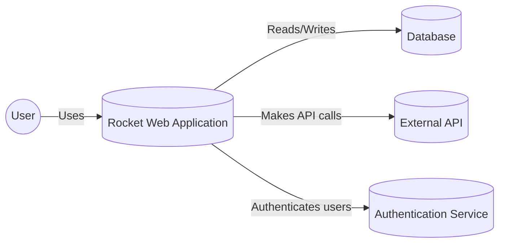
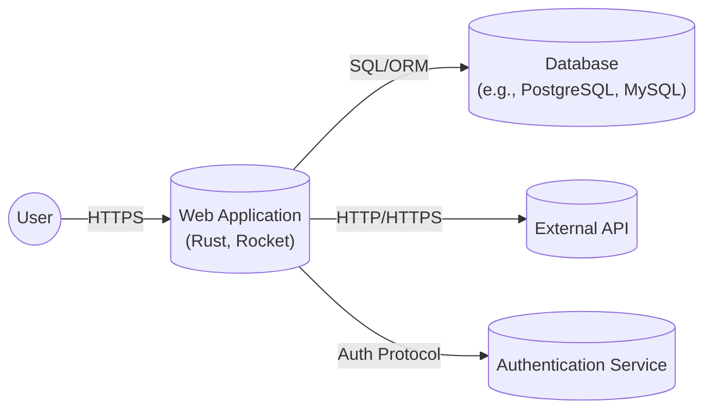
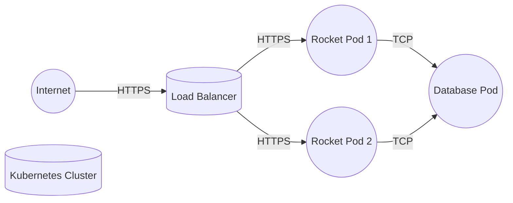
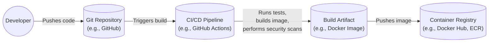

Okay, let's create a design document for the `rocket` project, focusing on aspects relevant to threat modeling.

# BUSINESS POSTURE

Business Priorities and Goals:

*   Provide a simple, fast, and secure web framework for Rust.
*   Enable rapid development of web applications and APIs.
*   Attract developers to the Rust ecosystem by offering a user-friendly web development experience.
*   Maintain a high level of code quality and security.
*   Foster a strong community around the framework.

Most Important Business Risks:

*   Security vulnerabilities in the framework could lead to exploitation of applications built with Rocket, damaging the reputation of the framework and potentially harming users.
*   Performance issues could hinder the adoption of Rocket, especially for high-traffic applications.
*   Lack of features or poor developer experience could make Rocket less competitive compared to other web frameworks.
*   Inability to keep up with the evolving Rust language and ecosystem could lead to compatibility issues and hinder future development.
*   Insufficient community engagement and contribution could slow down the development and maintenance of the framework.

# SECURITY POSTURE

Existing Security Controls:

*   security control: Type-safe language (Rust): The use of Rust inherently provides memory safety and helps prevent common vulnerabilities like buffer overflows and dangling pointers. (Described in Rust language documentation)
*   security control: Built-in CSRF protection: Rocket provides mechanisms to protect against Cross-Site Request Forgery attacks. (Described in Rocket documentation)
*   security control: Request Guards: These allow developers to implement custom security checks and data validation before a request is handled. (Described in Rocket documentation)
*   security control: Managed state: Rocket's managed state feature allows for secure sharing of data between different parts of the application. (Described in Rocket documentation)
*   security control: Templating engine (Tera/Handlebars): Using a templating engine helps prevent Cross-Site Scripting (XSS) vulnerabilities by automatically escaping output. (Described in Rocket and templating engine documentation)
*   security control: HTTPS support: Rocket can be configured to use HTTPS, encrypting communication between the client and server. (Described in Rocket documentation)
*   security control: Regular security audits and dependency updates: The Rocket project likely performs these, although specific details would need confirmation. (Assumed based on best practices)

Accepted Risks:

*   accepted risk: Reliance on third-party libraries: Rocket, like any framework, depends on external crates. Vulnerabilities in these dependencies could impact Rocket's security. This is mitigated by careful selection and updates of dependencies.
*   accepted risk: Developer errors: While Rocket provides security features, developers can still introduce vulnerabilities in their application code. This is mitigated by promoting secure coding practices and providing documentation.
*   accepted risk: Configuration errors: Misconfiguration of Rocket or its deployment environment can lead to security weaknesses. This is mitigated by providing clear documentation and secure defaults.

Recommended Security Controls:

*   security control: Content Security Policy (CSP): Implement CSP headers to mitigate XSS and data injection attacks.
*   security control: HTTP Strict Transport Security (HSTS): Enforce HTTPS connections to prevent man-in-the-middle attacks.
*   security control: Security Headers: Implement other security-related HTTP headers like X-Frame-Options, X-XSS-Protection, and X-Content-Type-Options.
*   security control: Input validation and sanitization: While Request Guards help, explicitly validate and sanitize all user inputs at multiple layers.
*   security control: Regular penetration testing: Conduct periodic penetration tests to identify vulnerabilities that automated tools might miss.
*   security control: Dependency vulnerability scanning: Integrate automated tools to scan for known vulnerabilities in dependencies.
*   security control: Secrets management: Securely store and manage sensitive information like API keys and database credentials.

Security Requirements:

*   Authentication:
    *   Support for various authentication mechanisms (e.g., API keys, JWT, OAuth 2.0).
    *   Secure storage of user credentials (e.g., using password hashing with salt).
    *   Protection against brute-force attacks (e.g., rate limiting, account lockout).
*   Authorization:
    *   Role-Based Access Control (RBAC) or Attribute-Based Access Control (ABAC) to restrict access to resources based on user roles or attributes.
    *   Fine-grained access control at the route and resource level.
*   Input Validation:
    *   Strict validation of all user inputs based on expected data types, formats, and lengths.
    *   Whitelist validation preferred over blacklist validation.
    *   Sanitization of inputs to prevent injection attacks.
*   Cryptography:
    *   Use of strong, industry-standard cryptographic algorithms and libraries.
    *   Secure key management practices.
    *   Protection of sensitive data in transit and at rest.

# DESIGN

## C4 CONTEXT

Element Descriptions:

*   Element:
    *   Name: User
    *   Type: Person
    *   Description: A person interacting with the Rocket Web Application through a web browser or other client.
    *   Responsibilities: Accessing and using the features provided by the application.
    *   Security controls: Browser security features, user-provided credentials.

*   Element:
    *   Name: Rocket Web Application
    *   Type: Software System
    *   Description: The web application built using the Rocket framework.
    *   Responsibilities: Handling user requests, processing data, interacting with other systems, and providing the application's functionality.
    *   Security controls: All listed in the "Security Posture" section.

*   Element:
    *   Name: Database
    *   Type: Software System
    *   Description: A database system used to store application data.
    *   Responsibilities: Storing and retrieving data as requested by the Rocket application.
    *   Security controls: Database access controls, encryption at rest, regular backups.

*   Element:
    *   Name: External API
    *   Type: Software System
    *   Description: An external API that the Rocket application interacts with.
    *   Responsibilities: Providing specific services or data to the Rocket application.
    *   Security controls: API keys, rate limiting, authentication, authorization.

*   Element:
    *   Name: Authentication Service
    *   Type: Software System
    *   Description: A service responsible for authenticating users. This could be a separate service or integrated within the Rocket application.
    *   Responsibilities: Verifying user credentials and issuing authentication tokens.
    *   Security controls: Secure password storage, multi-factor authentication, protection against common authentication attacks.

## C4 CONTAINER

Element Descriptions:

*   Element:
    *   Name: User
    *   Type: Person
    *   Description: A person interacting with the Rocket Web Application.
    *   Responsibilities: Accessing and using the features provided by the application.
    *   Security controls: Browser security features, user-provided credentials.

*   Element:
    *   Name: Web Application (Rust, Rocket)
    *   Type: Container
    *   Description: The core application code, built using the Rocket framework and Rust. This container handles request routing, business logic, and data processing.
    *   Responsibilities: Handling user requests, processing data, interacting with other systems, and providing the application's functionality.
    *   Security controls: All listed in the "Security Posture" section, implemented within the Rust code and Rocket framework features.

*   Element:
    *   Name: Database (e.g., PostgreSQL, MySQL)
    *   Type: Container
    *   Description: The database system used to store application data.
    *   Responsibilities: Storing and retrieving data as requested by the Rocket application.
    *   Security controls: Database access controls, encryption at rest, regular backups, SQL injection prevention (through ORM or parameterized queries).

*   Element:
    *   Name: External API
    *   Type: Container
    *   Description: An external API that the Rocket application interacts with.
    *   Responsibilities: Providing specific services or data to the Rocket application.
    *   Security controls: API keys, rate limiting, authentication, authorization, input validation on the API side.

*   Element:
    *   Name: Authentication Service
    *   Type: Container
    *   Description: A service responsible for authenticating users.
    *   Responsibilities: Verifying user credentials and issuing authentication tokens.
    *   Security controls: Secure password storage, multi-factor authentication, protection against common authentication attacks, secure communication protocols.

## DEPLOYMENT

Possible Deployment Solutions:

1.  Traditional Server Deployment: Deploying the Rocket application on a physical or virtual server (e.g., using a provider like AWS EC2, DigitalOcean, or a self-hosted server).
2.  Containerized Deployment (Docker): Packaging the Rocket application and its dependencies into a Docker container and deploying it on a container orchestration platform (e.g., Kubernetes, Docker Swarm, AWS ECS).
3.  Serverless Deployment: Deploying individual Rocket routes as serverless functions (e.g., using AWS Lambda, Azure Functions, Google Cloud Functions). This is less common for a full Rocket application but can be used for specific parts.

Chosen Solution: Containerized Deployment (Docker with Kubernetes)

Element Descriptions:

*   Element:
    *   Name: Internet
    *   Type: Network
    *   Description: The public internet.
    *   Responsibilities: Routing traffic to the load balancer.
    *   Security controls: Network firewalls, DDoS protection.

*   Element:
    *   Name: Load Balancer
    *   Type: Infrastructure
    *   Description: A load balancer (e.g., provided by a cloud provider or a self-hosted solution like Nginx or HAProxy) that distributes incoming traffic across multiple instances of the Rocket application.
    *   Responsibilities: Distributing traffic, health checks, SSL termination.
    *   Security controls: SSL/TLS encryption, DDoS protection, Web Application Firewall (WAF).

*   Element:
    *   Name: Kubernetes Cluster
    *   Type: Infrastructure
    *   Description: A Kubernetes cluster that manages the deployment and scaling of the Rocket application and its dependencies.
    *   Responsibilities: Orchestrating containers, managing resources, providing networking and service discovery.
    *   Security controls: Kubernetes RBAC, network policies, pod security policies, secrets management.

*   Element:
    *   Name: Rocket Pod 1
    *   Type: Container Instance
    *   Description: An instance of the Rocket application running within a Kubernetes pod.
    *   Responsibilities: Handling user requests.
    *   Security controls: All application-level security controls, container isolation.

*   Element:
    *   Name: Rocket Pod 2
    *   Type: Container Instance
    *   Description: Another instance of the Rocket application running within a Kubernetes pod.
    *   Responsibilities: Handling user requests.
    *   Security controls: All application-level security controls, container isolation.

*   Element:
    *   Name: Database Pod
    *   Type: Container Instance
    *   Description: An instance of the database server running within a Kubernetes pod.
    *   Responsibilities: Storing and retrieving data.
    *   Security controls: Database access controls, encryption at rest, regular backups, network policies to restrict access to the database pod.

## BUILD

Build Process Description:

1.  Developer: The developer writes code and pushes it to a Git repository (e.g., GitHub, GitLab, Bitbucket).
2.  Git Repository: The repository hosts the source code and triggers the CI/CD pipeline upon code changes (e.g., a push to the main branch).
3.  CI/CD Pipeline: A CI/CD pipeline (e.g., GitHub Actions, Jenkins, CircleCI, GitLab CI) is triggered. This pipeline automates the build, test, and deployment process.
    *   Security Checks:
        *   Static Application Security Testing (SAST): Tools like Clippy (for Rust) are used to analyze the source code for potential vulnerabilities.
        *   Dependency Scanning: Tools scan for known vulnerabilities in project dependencies.
        *   Linting: Code linters (e.g., Clippy) enforce coding standards and best practices.
        *   Unit Tests: Automated tests verify the functionality of individual components.
        *   Integration Tests: Tests verify the interaction between different parts of the application.
4.  Build Artifact: The CI/CD pipeline produces a build artifact, typically a Docker image containing the compiled Rocket application and its dependencies.
5.  Container Registry: The Docker image is pushed to a container registry (e.g., Docker Hub, Amazon ECR, Google Container Registry) for storage and later deployment.

Security Controls in Build Process:

*   security control: Code review: All code changes are reviewed by other developers before being merged.
*   security control: SAST: Static analysis tools are used to identify potential vulnerabilities in the code.
*   security control: Dependency scanning: Automated tools scan for known vulnerabilities in dependencies.
*   security control: Least privilege: Build processes should run with minimal necessary permissions.
*   security control: Signed commits: Developers sign their commits to ensure authenticity and prevent tampering.
*   security control: Immutable build artifacts: Once built, the artifact (Docker image) should not be modified.

# RISK ASSESSMENT

Critical Business Processes:

*   User authentication and authorization.
*   Data storage and retrieval.
*   API interactions (if applicable).
*   Serving web content.

Data Sensitivity:

*   User credentials (passwords, API keys): Highly sensitive.
*   Personally Identifiable Information (PII): Sensitivity depends on the specific data collected (e.g., name, email, address, financial information).
*   Application data: Sensitivity depends on the nature of the application (e.g., financial data, health data, proprietary business data).
*   Session data: Moderately sensitive.

# QUESTIONS & ASSUMPTIONS

Questions:

*   What specific external APIs does the Rocket application interact with?
*   What type of database is used?
*   What is the expected traffic volume and scaling requirements?
*   Are there any specific compliance requirements (e.g., GDPR, HIPAA, PCI DSS)?
*   What is the current process for security audits and penetration testing?
*   What is the current process for managing secrets (e.g., API keys, database credentials)?
*   What is the team's experience with secure coding practices and security testing?

Assumptions:

*   BUSINESS POSTURE: The Rocket project prioritizes security and aims to provide a secure framework for web development.
*   SECURITY POSTURE: The Rocket project follows best practices for secure software development, including regular security audits and dependency updates.
*   DESIGN: The application will be deployed in a containerized environment using Docker and Kubernetes. The application will use a relational database. The application will interact with external APIs over HTTPS. The application will use a CI/CD pipeline for automated builds and deployments.