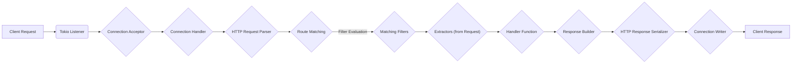

## Project Design Document: Warp Web Framework (Improved)

**1. Introduction**

This document provides an enhanced architectural design of the Warp web framework (as represented by the GitHub repository: https://github.com/seanmonstar/warp). This improved document aims to provide a more granular and detailed understanding of the framework's internal workings, specifically for the purpose of conducting thorough threat modeling. It elaborates on the key components, data flow, and interactions within the framework, offering a comprehensive view of its structure and functionality. The primary audience for this document includes security engineers, developers, and architects responsible for assessing and securing applications built using Warp.

**2. Overview**

Warp is a highly composable and lightweight web framework for the Rust programming language, built upon the foundation of the Tokio asynchronous runtime. It offers a robust set of tools and abstractions for constructing efficient and scalable web applications and APIs. At its core, Warp leverages the concept of "filters," which are independent, composable units of logic designed to handle specific aspects of HTTP request processing. These filters can be chained together to define complex routing and request handling pipelines.

**Key Features:**

*   **Fine-grained Composable Filters:** The fundamental building block, enabling developers to construct intricate request handling logic by combining small, focused filters. This promotes modularity and reusability.
*   **Asynchronous, Non-blocking Operations:** Built on Tokio, Warp inherently supports asynchronous operations, allowing for high concurrency and efficient resource utilization without blocking threads.
*   **Rust's Strong Type System and Safety:**  Leveraging Rust's memory safety and strong typing significantly reduces the likelihood of common web application vulnerabilities.
*   **Extensibility through Custom Filters:** Developers can create custom filters to extend Warp's functionality and tailor it to specific application needs.
*   **Seamless Integration with the Rust Ecosystem:** Warp integrates smoothly with other crates in the Rust ecosystem, facilitating the use of various libraries for tasks like database interaction, serialization, and more.

**3. Architectural Design**

The following diagram provides a more detailed illustration of the architecture and request flow within a Warp application:

**3.1. Component Descriptions:**

*   **Tokio Listener:** The entry point for incoming network connections, provided by the Tokio asynchronous runtime. It listens on a specified port for new connection attempts.
*   **Connection Acceptor:** Responsible for accepting new connections established by the `Tokio Listener`. It creates a new handler for each incoming connection.
*   **Connection Handler:** Manages the lifecycle of an individual client connection. It receives raw byte streams from the network associated with that connection.
*   **HTTP Request Parser:** Parses the raw byte stream according to the HTTP protocol specification. This component extracts crucial information such as the HTTP method, URI, headers, and body of the request.
*   **Route Matching:** The core routing engine of Warp. It takes the parsed request URI and attempts to match it against the defined routes, which are constructed from composed filters.
*   **Matching Filters:** The specific filter or chain of filters that successfully matches the incoming request based on defined criteria (e.g., path, headers, query parameters).
*   **Extractors (from Request):**  Components responsible for extracting specific data from the request based on the matched filters. This could involve extracting path parameters, query parameters, headers, or the request body.
*   **Handler Function:** The user-defined function associated with the matched route. This function contains the core application logic to process the request, perform necessary operations, and generate a response.
*   **Response Builder:**  Facilitates the construction of the HTTP response. It allows the handler function to set the response status code, headers, and body.
*   **HTTP Response Serializer:** Converts the structured HTTP response object (created by the `Response Builder`) into a byte stream that conforms to the HTTP protocol.
*   **Connection Writer:** Writes the serialized HTTP response byte stream back to the client over the established network connection.

**3.2. Data Flow (Detailed):**

1. A client initiates an HTTP request, which is sent over the network to the server.
2. The **Tokio Listener** on the server receives the connection attempt.
3. The **Connection Acceptor** accepts the incoming connection, establishing a dedicated connection.
4. A **Connection Handler** is created to manage the lifecycle of this specific client connection and receives the raw request bytes.
5. The **HTTP Request Parser** processes the raw bytes, transforming them into a structured HTTP request object, making the request details accessible.
6. The **Route Matching** component takes the parsed request URI and begins the process of evaluating the defined filter chains to find a matching route.
7. **Filter Evaluation** involves sequentially checking each filter in the chain against the request. Filters can perform various checks, such as matching the path, verifying headers, or inspecting query parameters.
8. Upon finding a set of **Matching Filters**, the framework proceeds to extract relevant data from the request.
9. **Extractors** are used to pull specific information from the request based on the definitions within the matching filters. This data is then passed to the handler function.
10. The associated **Handler Function** is invoked with the extracted data. This function executes the core application logic to process the request.
11. The **Handler Function** uses the **Response Builder** to construct the HTTP response, setting the status code, headers, and body.
12. The **HTTP Response Serializer** takes the structured response and converts it back into a byte stream suitable for transmission over the network.
13. Finally, the **Connection Writer** sends the serialized HTTP response byte stream back to the client, completing the request-response cycle.

**4. Security Considerations (Detailed for Threat Modeling)**

This section expands on potential security concerns, providing more specific examples and considerations for threat modeling activities.

*   **Input Validation and Sanitization:**
    *   **Threat:** Injection attacks (e.g., SQL injection if interacting with databases, command injection if executing external commands), cross-site scripting (XSS) through reflected input.
    *   **Considerations:** How rigorously does Warp encourage or enforce input validation within filters and handlers? Are there built-in mechanisms to sanitize user-provided data? How are different data types handled and validated?
*   **Authentication and Authorization:**
    *   **Threat:** Unauthorized access to resources, privilege escalation.
    *   **Considerations:** How are authentication mechanisms (e.g., API keys, JWTs, session cookies) implemented and secured within Warp applications? How is authorization enforced based on user roles or permissions? Are there recommended patterns for secure credential storage and handling?
*   **Session Management:**
    *   **Threat:** Session hijacking, session fixation.
    *   **Considerations:** If sessions are used, how are session IDs generated, stored, and transmitted? Are there protections against session ID theft or manipulation? Are session timeouts properly implemented?
*   **Cross-Site Scripting (XSS) Prevention:**
    *   **Threat:** Malicious scripts injected into the application's output, potentially stealing user data or performing actions on their behalf.
    *   **Considerations:** How does Warp facilitate the generation of secure HTML responses? Are there mechanisms for escaping or sanitizing output to prevent XSS vulnerabilities?
*   **Cross-Site Request Forgery (CSRF) Prevention:**
    *   **Threat:** Malicious websites or emails tricking authenticated users into performing unintended actions on the application.
    *   **Considerations:** What mechanisms are available or recommended for implementing CSRF protection (e.g., synchronizer tokens, same-site cookies)?
*   **Rate Limiting and Denial of Service (DoS) Protection:**
    *   **Threat:** Application unavailability due to excessive requests or resource exhaustion.
    *   **Considerations:** How can Warp applications implement rate limiting to restrict the number of requests from a single source? Are there strategies to mitigate other forms of DoS attacks?
*   **TLS/SSL Configuration:**
    *   **Threat:** Man-in-the-middle attacks, eavesdropping on sensitive data.
    *   **Considerations:** How is HTTPS configured and enforced in Warp applications? Are there recommendations for secure TLS settings and certificate management?
*   **Dependency Management and Supply Chain Security:**
    *   **Threat:** Vulnerabilities in third-party dependencies being exploited.
    *   **Considerations:** How are dependencies managed in Warp projects? Are there processes for identifying and mitigating vulnerabilities in dependencies? Tools like `cargo audit` should be considered.
*   **Error Handling and Information Disclosure:**
    *   **Threat:** Sensitive information being leaked in error messages or stack traces.
    *   **Considerations:** How are errors handled gracefully in Warp applications? Is care taken to avoid exposing internal details or sensitive data in error responses?
*   **Resource Management:**
    *   **Threat:** Resource exhaustion vulnerabilities (e.g., memory leaks, excessive file handle usage).
    *   **Considerations:** How does Warp manage resources? Are there safeguards against resource exhaustion due to malicious or poorly written handlers?
*   **Middleware Security:**
    *   **Threat:** Security vulnerabilities introduced by custom or third-party middleware, improper ordering of middleware leading to bypasses.
    *   **Considerations:** If middleware is used, how are they reviewed for security vulnerabilities? Is the order of middleware execution carefully considered to avoid unintended consequences?

**5. Dependencies**

Warp relies on a set of crucial dependencies within the Rust ecosystem to provide its functionality:

*   **Tokio:** The foundational asynchronous runtime that enables Warp's non-blocking I/O and concurrency model.
*   **Hyper:** A low-level, efficient HTTP library that Warp utilizes for handling HTTP connections, parsing requests, and serializing responses.
*   **Futures:** Provides abstractions for asynchronous operations, enabling the composition of asynchronous tasks.
*   **Bytes:** An efficient byte buffer type used for handling raw byte data.
*   **Serde:** A widely used serialization and deserialization framework in Rust, often employed for handling request and response bodies in various formats (e.g., JSON).
*   **http:** Provides foundational HTTP types for representing requests and responses.

**6. Deployment Considerations**

Warp applications are typically compiled into standalone, statically linked executables. This simplifies deployment across various environments. Common deployment strategies include:

*   **Bare Metal Servers:** Deploying directly on physical or virtual machines, often managed through systemd or similar init systems.
*   **Containers (e.g., Docker):** Containerization provides isolation, reproducibility, and portability, making it a popular choice for deploying Warp applications.
*   **Cloud Platforms (e.g., AWS, Azure, GCP):** Cloud platforms offer managed infrastructure and services that simplify deployment, scaling, and management of Warp applications.
*   **Serverless Environments (with Adaptation):** While less common due to the nature of Warp, it's possible to adapt Warp applications for serverless environments by using custom runtimes or frameworks.

It is common practice to deploy Warp applications behind a reverse proxy (e.g., Nginx, Apache, Cloudflare) to handle tasks such as TLS termination, load balancing, request routing, and providing an additional layer of security.

**7. Future Considerations**

This section highlights potential future developments and areas for further investigation that could impact the architecture and security of Warp applications.

*   **Enhanced Observability and Monitoring Tools:** Improvements in logging, tracing, and metrics collection could significantly enhance security monitoring and incident response capabilities for Warp applications.
*   **Standardized Security Middleware Components:** The development of more standardized and reusable security middleware could simplify the implementation of common security patterns and reduce the likelihood of errors.
*   **Formal Security Audits of the Framework:** Regular, independent security audits of the Warp framework itself are crucial for proactively identifying and addressing potential vulnerabilities within the core framework.
*   **Improved Integration with Security Scanning and Analysis Tools:** Better integration with static and dynamic analysis tools could streamline the security assessment process for applications built with Warp.
*   **Guidance on Secure Coding Practices Specific to Warp:** Providing more comprehensive documentation and best practices for secure development with Warp would empower developers to build more secure applications.

This improved document provides a more detailed and nuanced understanding of the Warp web framework's architecture, specifically tailored for threat modeling activities. It aims to equip security professionals and developers with the necessary information to identify and mitigate potential security risks effectively.