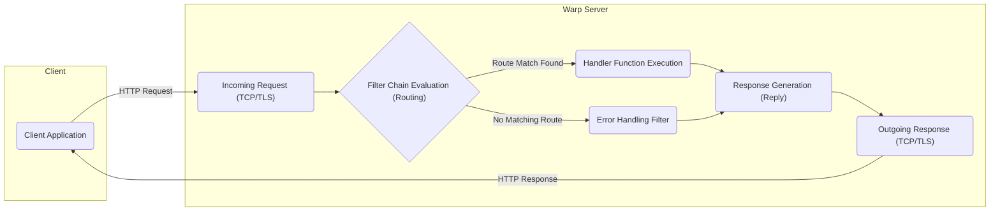

# Project Design Document: Warp - A Composable Web Server Framework

**Version:** 1.1
**Date:** October 26, 2023
**Author:** Gemini (AI Model)

## 1. Introduction

This document provides a detailed design overview of the Warp project, a web server framework written in Rust. The information presented here is intended to be used as a basis for subsequent threat modeling activities. This document aims to clearly articulate the architecture, components, and data flow within a typical Warp application, providing a solid foundation for security analysis.

## 2. Goals

* Provide a comprehensive and detailed architectural overview of the Warp framework.
* Clearly identify key components, their responsibilities, and interactions.
* Describe the complete request lifecycle within a Warp application, highlighting decision points.
* Explicitly highlight areas relevant for security considerations and threat identification, offering concrete examples.

## 3. Architecture Overview

Warp is designed as a highly composable and flexible web server framework. It leverages Rust's type system and asynchronous capabilities (primarily through the `tokio` runtime) to achieve high performance and resource efficiency. The core principle revolves around building request handling pipelines using composable `Filter`s, allowing for a declarative and modular approach to defining routes and middleware.

## 4. Component Details

* **`warp` Crate (Core Framework):**
    * **Responsibility:** Provides the foundational structures and logic for building web servers.
    * **Key Features:**
        * Defines the central `Filter` trait, the abstraction for intercepting and processing requests.
        * Offers a rich set of pre-built filters for common web server tasks. Examples include:
            * Path-based routing (`warp::path`, `warp::path::param`).
            * HTTP method matching (`warp::get`, `warp::post`).
            * Header extraction and validation (`warp::header`, `warp::header::exact`).
            * Query parameter parsing (`warp::query`).
            * Request body handling (`warp::body::json`, `warp::body::form`, `warp::body::bytes`).
        * Manages the asynchronous event loop, driven by the `tokio` runtime, for handling concurrent connections and requests efficiently.
        * Provides utilities for starting and configuring the server instance (e.g., binding to an address and port).
        * Includes combinators (`and`, `or`, `map`, `then`, `untuple`) for composing and transforming filters.

* **Filters:**
    * **Responsibility:** Represent individual, composable units of request processing logic. They act as predicates and transformers on incoming requests.
    * **Characteristics:**
        * Implement the `Filter` trait.
        * Can inspect and extract information from the request.
        * Can modify the request or response.
        * Can decide whether to allow the request to proceed further down the processing pipeline.
    * **Examples:**
        * **Path Filter:** `warp::path("users" / u32)` - Matches requests to `/users/{id}` and extracts the user ID.
        * **Method Filter:** `warp::get()` - Matches only GET requests.
        * **Header Filter:** `warp::header("X-Request-ID")` - Extracts the value of the `X-Request-ID` header.
        * **Authentication Filter (Custom):** A filter that verifies a JWT token in the `Authorization` header.
        * **Logging Filter:** A filter that logs details about the incoming request.

* **Routes:**
    * **Responsibility:** Define the mapping between incoming requests and their corresponding handlers.
    * **Construction:** Created by combining and composing various filters using combinators. The order of composition often dictates the processing order.
    * **Example:** `warp::path("api" / "users").and(warp::get()).map(|| "List Users")` - Defines a route that matches GET requests to `/api/users` and responds with "List Users".

* **Handlers (Endpoint Functions):**
    * **Responsibility:** The actual functions that execute the business logic for a specific endpoint.
    * **Input:** Receive data extracted by the preceding filters in the route definition.
    * **Output:** Return a type that implements the `Reply` trait, representing the HTTP response.
    * **Example:** `async fn create_user(user: User) -> Result<impl warp::Reply, warp::Rejection> { /* ... logic to create user ... */ Ok(warp::reply::json(&user)) }`

* **`Reply` Trait:**
    * **Responsibility:** Represents the HTTP response that will be sent back to the client.
    * **Implementation:** Can be implemented by various types, allowing for flexible response generation.
    * **Helper Functions:** Warp provides helper functions for creating common response types:
        * `warp::reply::json`: Creates a JSON response.
        * `warp::reply::html`: Creates an HTML response.
        * `warp::reply::with_status`: Sets the HTTP status code.
        * `warp::reply::with_header`: Adds a header to the response.

* **`tokio` Runtime:**
    * **Responsibility:** Provides the asynchronous execution environment for Warp.
    * **Key Features:**
        * Manages the event loop, allowing Warp to handle multiple concurrent connections without blocking.
        * Provides abstractions for asynchronous I/O, timers, and other concurrency primitives.

* **Transport Layer (TCP/TLS):**
    * **Responsibility:** Handles the low-level communication over the network.
    * **Implementation:** Warp typically listens for incoming TCP connections on a specified port.
    * **Security:** TLS (Transport Layer Security) can be enabled to provide encrypted communication over HTTPS. This often involves integrating with crates like `tokio-rustls` or `tokio-native-tls`.

* **Middleware (Implemented via Filters):**
    * **Responsibility:**  Logic that intercepts and processes requests or responses at various stages of the request lifecycle.
    * **Implementation:** Achieved by creating filters that are composed into the route definition.
    * **Examples:**
        * **Logging Middleware:** Logs request details before the handler is executed.
        * **Authentication Middleware:** Verifies user credentials before allowing access to protected routes.
        * **CORS Middleware:** Adds necessary headers to enable Cross-Origin Resource Sharing.
        * **Compression Middleware:** Compresses the response body before sending it to the client.

## 5. Data Flow

**Detailed Request Lifecycle:**

1. **Client Sends Request:** A client application initiates an HTTP request targeting the Warp server, transmitted over TCP, potentially secured with TLS.
2. **Incoming Request:** The `tokio` runtime accepts the incoming connection and receives the request data.
3. **Filter Chain Evaluation (Routing):** Warp begins processing the request by evaluating a chain of filters defined by the application's routes. This evaluation happens sequentially.
    * Each filter inspects the request based on its defined logic (e.g., checking the path, method, headers).
    * Filters can extract data from the request and make it available to subsequent filters or the handler.
    * The `and` combinator requires all composed filters to match.
    * The `or` combinator allows the request to proceed if any of the composed filters match.
4. **Route Match Found:** If the entire filter chain for a specific route successfully matches the incoming request, the associated handler function is selected for execution.
5. **Handler Function Execution:** The designated handler function is invoked. It receives any data that was extracted by the preceding filters in the route. The handler performs the core business logic for the request.
6. **No Matching Route:** If none of the defined routes match the incoming request, Warp will typically execute a default error handling mechanism or a custom error handling filter, generating an appropriate error response (e.g., 404 Not Found).
7. **Response Generation (Reply):** The handler function (or the error handler) generates a `Reply` object. This object encapsulates the HTTP response, including the status code, headers, and body.
8. **Outgoing Response:** The `Reply` is serialized into an HTTP response and sent back to the client over the established TCP connection.

## 6. Security Considerations

This section details potential security concerns relevant to Warp applications, providing specific examples and mitigation strategies to consider during threat modeling.

* **Input Validation:**
    * **Vulnerability:** Failure to properly validate data extracted by filters (e.g., path parameters, query parameters, headers, request body) can lead to various injection attacks.
    * **Examples:** SQL injection through unvalidated query parameters, command injection via unsanitized header values, cross-site scripting (XSS) through reflected input in responses.
    * **Warp's Role & Mitigation:** While Warp provides tools for data extraction, developers are responsible for implementing validation logic. Utilize libraries like `validator` or implement custom validation filters to sanitize and verify inputs before processing.

* **Authentication and Authorization:**
    * **Vulnerability:** Insufficient or flawed authentication and authorization mechanisms can allow unauthorized access to sensitive resources and functionalities.
    * **Examples:** Bypassing authentication checks, privilege escalation due to incorrect authorization rules.
    * **Warp's Role & Mitigation:** Implement authentication using custom filters that verify credentials (e.g., API keys, JWTs, session cookies). Use authorization filters to enforce access control policies based on user roles or permissions. Consider using libraries like `jsonwebtoken` for JWT handling.

* **Session Management:**
    * **Vulnerability:** Insecure session management can lead to session hijacking or fixation attacks, allowing attackers to impersonate legitimate users.
    * **Examples:** Using predictable session IDs, storing session tokens insecurely.
    * **Warp's Role & Mitigation:** Warp doesn't provide built-in session management. Integrate external libraries like `cookie` and a secure storage mechanism (e.g., Redis, database) to manage sessions. Ensure session IDs are randomly generated, securely transmitted (HTTPS), and invalidated upon logout or after a period of inactivity.

* **Cross-Site Scripting (XSS):**
    * **Vulnerability:** Improperly sanitized user-provided data included in HTML responses can allow attackers to inject malicious scripts into the client's browser.
    * **Examples:** Displaying user comments without encoding, reflecting unvalidated input in error messages.
    * **Warp's Role & Mitigation:** When generating HTML responses, use templating engines or libraries that automatically escape user-provided data. Manually escape output when necessary to prevent the execution of malicious scripts in the browser.

* **Cross-Site Request Forgery (CSRF):**
    * **Vulnerability:** Malicious websites can trick authenticated users into making unintended requests to the Warp application.
    * **Examples:** A user logged into their bank account visits a malicious website that triggers a money transfer request to the attacker's account.
    * **Warp's Role & Mitigation:** Implement CSRF protection mechanisms like synchronizer tokens. Generate a unique token for each user session and include it in forms. Verify the token on the server-side for state-changing requests.

* **Denial of Service (DoS):**
    * **Vulnerability:** Attackers can attempt to overwhelm the server with a large number of requests, making it unavailable to legitimate users.
    * **Examples:** SYN floods, HTTP floods.
    * **Warp's Role & Mitigation:** While `tokio` provides some resilience, implement rate limiting middleware to restrict the number of requests from a single IP address within a given timeframe. Consider adding request size limits to prevent resource exhaustion. Deploy behind a reverse proxy with DoS protection capabilities.

* **Dependency Management:**
    * **Vulnerability:** Using dependencies with known security vulnerabilities can introduce flaws into the application.
    * **Warp's Role & Mitigation:** Regularly audit project dependencies using tools like `cargo audit`. Keep dependencies updated to their latest secure versions. Be mindful of the supply chain security of dependencies.

* **TLS Configuration:**
    * **Vulnerability:** Misconfigured TLS can lead to insecure communication, exposing sensitive data.
    * **Examples:** Using weak ciphers, not enforcing HTTPS, using expired or invalid certificates.
    * **Warp's Role & Mitigation:** When enabling HTTPS, ensure proper TLS configuration. Use strong cipher suites, enforce HTTPS by redirecting HTTP traffic, and obtain valid TLS certificates from trusted Certificate Authorities. Regularly renew certificates.

* **Error Handling and Information Disclosure:**
    * **Vulnerability:** Verbose error messages or stack traces in production environments can leak sensitive information about the application's internal workings.
    * **Warp's Role & Mitigation:** Configure error handling to log detailed errors internally but return generic error messages to the client in production. Avoid displaying stack traces or sensitive data in API responses.

## 7. Deployment Considerations

* **Reverse Proxy:** Deploying Warp applications behind a reverse proxy (e.g., Nginx, Apache, Traefik) is a common practice.
    * **Benefits:** TLS termination, load balancing, request routing, security features (e.g., WAF), caching.
* **Containerization:** Using containerization technologies like Docker and Kubernetes simplifies deployment, scaling, and management.
    * **Benefits:** Isolation, reproducibility, portability.
* **Cloud Platforms:** Warp applications can be deployed on various cloud platforms, including:
    * **AWS:** Using services like EC2, ECS, Fargate, Lambda (with custom runtime).
    * **Azure:** Using services like Virtual Machines, Azure Container Instances, Azure Kubernetes Service, Azure Functions (with custom handler).
    * **GCP:** Using services like Compute Engine, Google Kubernetes Engine, Cloud Run, Cloud Functions (with custom runtime).
* **Process Managers:** Using process managers like `systemd` or `pm2` can help manage the Warp application's lifecycle in non-containerized environments.

## 8. Dependencies

* **Core Dependencies:**
    * **`tokio`:** Asynchronous runtime for Rust, providing the foundation for non-blocking I/O.
    * **`hyper`:**  A fast and correct HTTP implementation that Warp leverages for low-level HTTP handling.
    * **`bytes`:**  Provides efficient byte buffer manipulation, crucial for network operations.
    * **`http`:**  Defines HTTP types and utilities used throughout the framework.
* **Commonly Used Dependencies:**
    * **`serde` and `serde_json`:** For serialization and deserialization of JSON data.
    * **`tokio-rustls` or `tokio-native-tls`:** For enabling TLS support (HTTPS).
    * **`log` and `env_logger` or `tracing`:** For logging and tracing application behavior.
    * **Database interaction crates:** e.g., `sqlx`, `diesel`, `mongodb`.
    * **Authentication/Authorization crates:** e.g., `jsonwebtoken`, `oauth2`.
    * **Templating engines:** e.g., `tera`, `handlebars`.

This improved design document provides a more in-depth understanding of the Warp framework, its components, and potential security considerations. This detailed information will be valuable for conducting a comprehensive threat modeling exercise.
