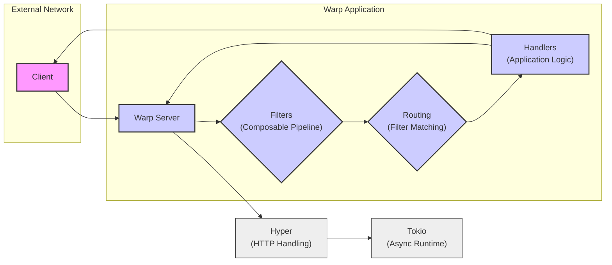

# Project Design Document: Warp Web Framework (Improved)

## 1. Project Overview

- Warp is a lightweight, composable, and functional web framework for Rust, designed for building modern web applications and APIs.
- It leverages the power of Rust's type system and ownership model to provide memory safety and performance.
- Built on top of Tokio for asynchronous I/O and Hyper for HTTP protocol handling, ensuring efficiency and scalability.
- Emphasizes composability through its "filters" system, enabling declarative and modular request handling logic.
- Ideal for building RESTful APIs, microservices, single-page applications (SPAs) backends, and other web services requiring high performance and reliability.
- Focuses on developer experience with a clean, intuitive API and comprehensive documentation.

## 2. System Architecture

- Warp's architecture is designed around a pipeline of request processing using composable "filters".
- Core components work together to handle incoming HTTP requests and generate responses:
    - **Client:**  The entity initiating HTTP requests to the Warp application. This could be a web browser, a mobile application, another service, or command-line tools like `curl`.
    - **Warp Server:** The central component of the Warp framework. It:
        - Listens for incoming TCP connections on a specified port.
        - Accepts connections and hands them off to Tokio for asynchronous handling.
        - Manages the lifecycle of requests and responses.
        - Orchestrates the filter chain and handler execution.
    - **Filters:** The fundamental building blocks of Warp applications. Filters are:
        - Functions or closures that operate on incoming requests.
        - Composable using combinators (e.g., `and`, `or`, `map`, `then`).
        - Used to extract, transform, validate, and route requests.
        - Can represent various aspects of a request: path segments, headers, query parameters, request body, HTTP method, etc.
    - **Routes:**  Represent specific paths or patterns that the Warp application handles. Routes are defined by composing filters to match desired request characteristics. When a route matches, its associated handler is executed.
    - **Handlers:** Functions that contain the application's business logic. Handlers are:
        - Invoked when a route matches an incoming request.
        - Responsible for processing the request data and generating an HTTP response.
        - Can interact with databases, external services, and other parts of the application.
    - **Hyper:** The underlying HTTP/1 and HTTP/2 library. Hyper is responsible for:
        - Low-level HTTP protocol parsing and generation.
        - Connection management (keeping connections alive, handling timeouts).
        - Request and response body streaming.
    - **Tokio:** The asynchronous runtime environment for Rust. Tokio provides:
        - Asynchronous I/O operations (non-blocking sockets).
        - Task scheduling and concurrency management.
        - Timers and other utilities for building asynchronous applications.

## 3. Data Flow

- **Detailed Request Processing Lifecycle:**
    - **1. HTTP Request Arrival:** The "Client" sends an HTTP request message, conforming to HTTP standards (e.g., HTTP/1.1 or HTTP/2), to the "Warp Server" over a TCP connection. The request includes:
        - **Method:** (GET, POST, PUT, DELETE, etc.) indicating the intended action.
        - **Path:**  The resource being requested (e.g., `/users/123`).
        - **Headers:** Metadata about the request (e.g., `Content-Type`, `Authorization`, `User-Agent`).
        - **Body (Optional):** Data associated with the request (e.g., JSON payload for a POST request).
    - **2. Connection and Request Handling by Warp Server:** The "Warp Server", powered by "Hyper" and "Tokio", accepts the connection and uses Hyper to parse the raw byte stream into an HTTP request object.
    - **3. Filter Chain Execution:** The parsed HTTP request is then passed through the defined chain of "Filters".
        - Filters are applied sequentially, in the order they are composed.
        - Each filter can:
            - **Inspect the request:** Access headers, path, body, method, etc.
            - **Transform the request:** Modify headers, extract data, parse the body.
            - **Validate the request:** Check for required parameters, data format, authentication, authorization.
            - **Short-circuit the pipeline:** Reject the request early if validation fails or conditions are not met, returning an error response.
    - **4. Route Matching and Handler Selection:** "Routes" are evaluated by matching their composed filters against the processed request.
        - Routing is essentially filter matching. If a route's filter composition matches the request, it's considered a match.
        - Warp uses a first-match approach for routes. The first route that matches the request will have its handler executed.
    - **5. Handler Invocation:** Once a route is matched, the associated "Handler" function is invoked. The handler receives extracted and processed data from the filters.
    - **6. Response Generation by Handler:** The "Handler" executes application-specific logic. This may involve:
        - Accessing databases or external services.
        - Performing calculations or data processing.
        - Constructing an HTTP response. The response includes:
            - **Status Code:** (200 OK, 404 Not Found, 500 Internal Server Error, etc.) indicating the outcome of the request.
            - **Headers:** Metadata about the response (e.g., `Content-Type`, `Cache-Control`).
            - **Body (Optional):** Data to be returned to the client (e.g., JSON response, HTML content).
    - **7. HTTP Response Transmission:** The "Handler" returns the response to the "Warp Server". Hyper serializes the response object back into an HTTP response message (bytes).
    - **8. Response Delivery to Client:** The "Warp Server", using Hyper and Tokio, sends the HTTP response message back to the "Client" over the established TCP connection.

- **Data Types Handled in Detail:**
    - Warp operates primarily with HTTP messages, which are text-based but can carry binary data in the body.
    - **Textual Data (String, &str):**
        - HTTP Headers (names and values are typically text).
        - HTTP Path segments and query parameters.
        - Text-based body formats like JSON, XML, HTML, plain text.
    - **Byte Streams (`Vec<u8>`, `Bytes`):**
        - Raw bytes for request and response bodies, essential for handling binary data.
        - File uploads and downloads.
        - Image, audio, video, and other binary content.
    - **Structured Data (Rust Data Structures):**
        - Warp encourages using Rust's strong typing. Data parsed from request bodies (e.g., JSON, form data) is typically deserialized into Rust structs or enums using libraries like `serde`.
        - Handlers often return Rust data structures that Warp serializes into response bodies (e.g., JSON).
    - **Metadata (Headers, Cookies):**
        - HTTP headers are key-value pairs providing metadata about requests and responses.
        - Cookies are small pieces of data sent between the server and client, often used for session management and tracking. Warp provides filters for handling cookies.

## 4. Key Features Relevant to Security

- **HTTPS/TLS Encryption:**
    - Warp relies on TLS libraries via Hyper and Tokio (e.g., `tokio-rustls`, `tokio-native-tls`) to enable HTTPS.
    - **Importance:** Encrypts all communication between the client and server, protecting sensitive data (passwords, personal information, API keys) from eavesdropping and man-in-the-middle attacks.
    - **Configuration:** Requires proper configuration of TLS certificates (obtained from a Certificate Authority or self-signed for development), private keys, and selection of secure TLS protocol versions and cipher suites.
    - **Best Practices:** Enforce HTTPS by redirecting HTTP traffic, use HSTS (HTTP Strict Transport Security) header to instruct browsers to always use HTTPS.
- **Robust Request Filtering and Input Validation:**
    - Warp's filter system is a powerful tool for implementing comprehensive input validation and sanitization *before* reaching application logic.
    - **Examples of Filter-Based Validation:**
        - **Data Type Validation:** Ensure path parameters or query parameters are of the expected type (e.g., integer, UUID). `warp::path::param::<u32>()`.
        - **Format Validation:** Validate input strings against regular expressions or specific formats (e.g., email addresses, phone numbers).
        - **Range Checks:** Verify that numeric inputs are within acceptable ranges.
        - **Length Limits:** Enforce maximum lengths for strings and array sizes to prevent buffer overflows or excessive resource consumption.
        - **Sanitization:** Escape HTML entities, remove potentially harmful characters, or encode data to prevent injection attacks (e.g., XSS, command injection).  *Example:* Using a filter to sanitize user-provided HTML before rendering it.
    - **Benefits:** Reduces the attack surface by rejecting invalid or malicious requests early in the processing pipeline, preventing vulnerabilities in handlers.
- **Authentication and Authorization Mechanisms:**
    - Warp provides filters and utilities to implement various authentication and authorization schemes.
    - **Authentication Methods (Examples using Warp Filters):**
        - **API Key Authentication:** Extract API key from headers or query parameters and validate it against a stored list or database. `warp::header::header("X-API-Key")`.
        - **JWT (JSON Web Token) Authentication:** Extract JWT from `Authorization` header, verify its signature and claims. Libraries like `jsonwebtoken` can be used within a filter. `warp::header::optional::<String>("Authorization")`.
        - **OAuth 2.0:** Integrate with OAuth 2.0 providers for delegated authorization. Libraries like `oauth2` can be used in conjunction with Warp filters to handle OAuth flows.
        - **Basic Authentication:** Parse username and password from `Authorization` header and authenticate against a user database. `warp::header::basic_auth()`.
    - **Authorization:** Implement access control logic based on user roles, permissions, or policies. Authorization checks can be performed in filters or handlers after successful authentication. *Example:* A filter to check if the authenticated user has the "admin" role before allowing access to admin routes.
- **Secure Error Handling and Response Management:**
    - Warp's error handling allows for customization of error responses, crucial for security.
    - **Best Practices:**
        - **Avoid Exposing Sensitive Information:** Do not include stack traces, internal paths, or database connection details in error responses sent to clients.
        - **User-Friendly Error Messages:** Return generic, informative error messages to users without revealing system internals. *Example:* Instead of "Database connection failed", return "An error occurred while processing your request."
        - **Centralized Error Logging:** Log detailed error information (including stack traces) securely on the server-side for debugging and monitoring, but *not* in client responses.
        - **Custom Error Pages:** Implement custom error pages for common HTTP error codes (404, 500, etc.) to provide a consistent and secure user experience.
- **Comprehensive Logging and Security Monitoring:**
    - Integrate Warp applications with Rust logging libraries (`log`, `tracing`) for detailed logging.
    - **Security-Relevant Logging:**
        - **Request Logging:** Log source IP address, request path, method, headers (excluding sensitive ones), and timestamps for audit trails and intrusion detection.
        - **Authentication and Authorization Events:** Log successful and failed login attempts, authorization decisions, and changes to user roles or permissions.
        - **Errors and Exceptions:** Log all errors and exceptions, including stack traces (securely on the server-side).
        - **Security Events:** Log security-related events like suspicious activity, rate limiting triggers, and detected attacks.
    - **Monitoring:** Use logging data for real-time monitoring of application health and security. Set up alerts for suspicious patterns or security incidents.
- **Security Headers for Defense in Depth:**
    - Warp filters can easily add security-enhancing HTTP headers to responses.
    - **Common Security Headers and their Benefits:**
        - **`Content-Security-Policy` (CSP):** Mitigates Cross-Site Scripting (XSS) attacks by controlling the sources from which the browser is allowed to load resources.
        - **`Strict-Transport-Security` (HSTS):** Enforces HTTPS and prevents downgrade attacks.
        - **`X-Frame-Options`:** Prevents clickjacking attacks by controlling whether the page can be embedded in a frame.
        - **`X-Content-Type-Options: nosniff`:** Prevents MIME-sniffing attacks, where browsers try to guess the content type and potentially execute malicious code.
        - **`Referrer-Policy`:** Controls how much referrer information is sent with requests, enhancing privacy and potentially preventing information leakage.
        - **`Permissions-Policy` (Feature-Policy - deprecated):** Controls browser features that the website is allowed to use, reducing the attack surface.
- **Rate Limiting and Throttling:**
    - Implement rate limiting filters to protect against denial-of-service (DoS) attacks and brute-force attacks.
    - **Rate Limiting Strategies:**
        - **IP-based Rate Limiting:** Limit requests from a specific IP address within a time window.
        - **User-based Rate Limiting:** Limit requests per authenticated user.
        - **Route-based Rate Limiting:** Apply different rate limits to different routes based on their sensitivity or resource consumption.
    - **Warp Filter Implementation:** Rate limiting can be implemented using filters that track request counts and timestamps, potentially using in-memory stores or external caching systems like Redis.
- **Middleware Capabilities (Filters as Security Middleware):**
    - Warp filters act as middleware, allowing for the implementation of cross-cutting security concerns.
    - **Examples of Security Middleware Filters:**
        - **Request Logging Filter:** Logs details of every incoming request.
        - **Security Header Injection Filter:** Adds security headers to every response.
        - **Rate Limiting Filter:** Enforces rate limits across multiple routes.
        - **CORS (Cross-Origin Resource Sharing) Filter:** Configures CORS policies to control cross-origin requests. `warp::cors::cors()`.
        - **Request ID Generation Filter:** Generates unique request IDs for tracing and correlation across logs.

## 5. Dependencies and Supply Chain Security

- **Core Dependencies (Security Critical):**
    - `tokio`: Asynchronous runtime. Security vulnerabilities in Tokio could have widespread impact on Warp applications. Regularly monitor Tokio security advisories.
    - `hyper`: HTTP library. Vulnerabilities in Hyper directly affect Warp's HTTP handling, potentially leading to request smuggling, header injection, or other HTTP-related attacks.
    - `http`: HTTP types and utilities. While less directly exposed, vulnerabilities here could still impact HTTP processing.
- **TLS Dependencies (HTTPS Security):**
    - `tokio-rustls` or `tokio-native-tls`: TLS implementations. The security of these libraries is paramount for HTTPS. Ensure they are up-to-date and use secure configurations.
    - `rustls` or `native-tls`: Underlying TLS libraries. Vulnerabilities in these libraries directly compromise TLS security.
- **Common Application Dependencies (Potential Security Risks):**
    - `serde` and `serde_json`: Serialization/deserialization for JSON. Deserialization vulnerabilities (if present) could lead to remote code execution or denial of service. Be aware of potential deserialization gadgets if using `serde` with untrusted input.
    - Database drivers (e.g., `sqlx`, `diesel`, `mongodb`): Database interactions can introduce SQL injection, NoSQL injection, or other database-specific vulnerabilities if queries are not parameterized correctly or input is not sanitized.
    - Authentication/Authorization libraries (e.g., `jsonwebtoken`, `oauth2`, `bcrypt`): Security flaws in these libraries can directly compromise authentication and authorization. Use well-vetted and actively maintained libraries.
    - Input validation/sanitization libraries (if used explicitly): Ensure these libraries are also secure and up-to-date.

- **Supply Chain Security Best Practices:**
    - **Dependency Auditing:** Regularly audit project dependencies for known vulnerabilities using tools like `cargo audit`. Integrate `cargo audit` into CI/CD pipelines.
    - **Dependency Updates:** Keep dependencies updated to the latest stable versions to patch security vulnerabilities promptly. Automate dependency updates where possible, but test thoroughly after updates.
    - **Security Advisories:** Subscribe to security advisories for the Rust ecosystem, crates.io, and specific dependencies to stay informed about newly discovered vulnerabilities.
    - **Dependency Minimization:** Only include necessary dependencies to reduce the attack surface. Remove unused dependencies.
    - **Dependency Scanning in CI/CD:** Integrate dependency scanning tools into CI/CD pipelines to automatically detect vulnerabilities in dependencies before deployment.
    - **Reproducible Builds:** Use `Cargo.lock` to ensure reproducible builds and prevent unexpected dependency changes that could introduce vulnerabilities.
    - **Vulnerability Disclosure Policy:** Have a clear vulnerability disclosure policy for your application and dependencies, allowing security researchers to report vulnerabilities responsibly.

## 6. Deployment Model and Environment Security

- **Deployment Scenarios and Security Considerations:**
    - **Standalone Server (Directly Exposed):**
        - **Scenario:** Warp application runs as a single executable on a server directly facing the internet.
        - **Security Considerations:**
            - **OS Hardening:** Secure the operating system (patching, firewalls, disabling unnecessary services).
            - **Network Firewall:** Configure a firewall to restrict access to only necessary ports (e.g., 443 for HTTPS, 80 for HTTP redirect).
            - **Warp Application Security:** Implement all security best practices within the Warp application itself (input validation, authentication, authorization, secure headers, etc.).
            - **Regular Security Audits:** Conduct regular security audits and penetration testing.
    - **Reverse Proxy Setup (Recommended for Production):**
        - **Scenario:** Warp application deployed behind a reverse proxy (Nginx, Apache, Traefik, Cloudflare, etc.).
        - **Security Considerations:**
            - **TLS Termination at Proxy:** Configure the reverse proxy to handle TLS termination, offloading encryption/decryption from the Warp application.
            - **Reverse Proxy Security:** Harden the reverse proxy itself (configuration, updates, modules).
            - **Web Application Firewall (WAF):** Consider using a WAF (often integrated with reverse proxies) to protect against common web attacks (SQL injection, XSS, etc.).
            - **Rate Limiting and DDoS Protection:** Reverse proxies often provide built-in rate limiting and DDoS protection capabilities.
            - **Load Balancing:** Reverse proxies can distribute traffic across multiple Warp application instances for scalability and resilience.
            - **Internal Network Security:** Secure the network between the reverse proxy and the Warp application instances.
    - **Containerized Deployment (Docker, Kubernetes):**
        - **Scenario:** Warp application packaged in a Docker container and deployed in container orchestration platforms like Kubernetes.
        - **Security Considerations:**
            - **Container Image Security:** Scan container images for vulnerabilities during build process. Use minimal base images.
            - **Container Runtime Security:** Harden the container runtime environment.
            - **Kubernetes Security:** Implement Kubernetes security best practices (RBAC, network policies, pod security policies/admission controllers, secrets management).
            - **Network Policies:** Use Kubernetes network policies to restrict network traffic between containers and namespaces.
            - **Secrets Management:** Use Kubernetes Secrets or dedicated secrets management solutions to securely manage sensitive credentials.
    - **Serverless Functions (AWS Lambda, Azure Functions, etc.):**
        - **Scenario:** Warp application (or parts of it) deployed as serverless functions.
        - **Security Considerations:**
            - **Serverless Platform Security:** Rely on the security provided by the serverless platform provider.
            - **IAM Roles and Permissions:** Configure least-privilege IAM roles and permissions for serverless functions to limit access to resources.
            - **Function Code Security:** Apply secure coding practices within the serverless function code.
            - **Dependency Security:** Manage dependencies of serverless functions securely.
            - **Cold Starts and Security:** Be aware of potential security implications of cold starts and function initialization.
            - **API Gateway Security:** If using an API Gateway in front of serverless functions, configure API Gateway security features (authentication, authorization, rate limiting).

- **General Deployment Environment Security Measures:**
    - **Operating System Hardening:** Apply security patches, disable unnecessary services, use security benchmarks (CIS benchmarks).
    - **Network Segmentation:** Segment networks to isolate the Warp application and its components from other systems.
    - **Intrusion Detection/Prevention Systems (IDS/IPS):** Deploy IDS/IPS to monitor network traffic for malicious activity.
    - **Access Control (Principle of Least Privilege):** Restrict access to servers, databases, and other resources based on the principle of least privilege. Use strong authentication (multi-factor authentication where possible).
    - **Secrets Management:** Use dedicated secrets management solutions (HashiCorp Vault, AWS Secrets Manager, Azure Key Vault) to securely store and manage sensitive credentials. Avoid hardcoding secrets in code or configuration files.
    - **Security Monitoring and Logging (Environment Level):** Implement comprehensive monitoring and logging of the deployment environment (system logs, security logs, audit logs). Use SIEM (Security Information and Event Management) systems for centralized log analysis and security event correlation.
    - **Regular Security Audits and Penetration Testing (Deployment):** Periodically assess the security posture of the deployed application and environment through security audits and penetration testing.
    - **Infrastructure as Code (IaC) Security:** Secure IaC pipelines and configurations. Store IaC configurations securely and use version control. Review IaC changes for security implications.

This improved design document provides a more detailed and comprehensive overview of the Warp web framework, with a stronger focus on security considerations throughout the entire system lifecycle, from development to deployment. It should serve as a valuable resource for threat modeling and security analysis of Warp-based projects.