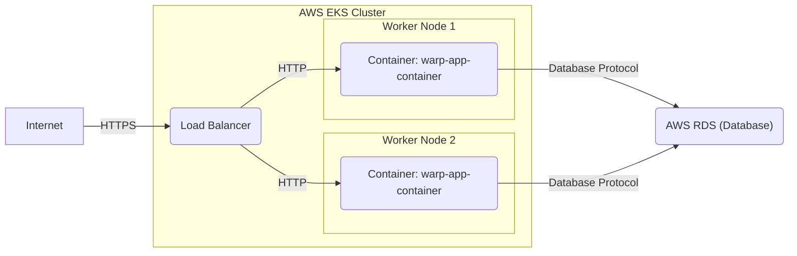

# BUSINESS POSTURE

This project, represented by the GitHub repository `seanmonstar/warp`, provides a web server framework written in Rust. The primary business goal for adopting such a framework is to efficiently and reliably build web applications and services.

Business Priorities and Goals:
- Rapid development of web applications: `warp` aims to be easy to use and composable, facilitating faster development cycles.
- High performance and efficiency: Rust is known for its performance, and `warp` leverages this to provide fast and resource-efficient web services.
- Reliability and stability: Rust's memory safety and strong type system contribute to building robust and stable applications.
- Flexibility and customization: `warp` is designed to be composable, allowing developers to tailor it to specific application needs.
- Modern web standards support:  A modern web framework should support current web protocols and standards.

Business Risks:
- Security vulnerabilities in the framework: Like any software, `warp` could contain vulnerabilities that could be exploited in applications built with it.
- Insecure application development: Developers using `warp` might introduce security flaws in their applications if they are not security-conscious or lack sufficient training.
- Dependency vulnerabilities: `warp` relies on other Rust crates (libraries), and vulnerabilities in these dependencies could impact applications using `warp`.
- Operational risks: Misconfiguration or improper deployment of `warp`-based applications can lead to security and availability issues.
- Performance bottlenecks: While `warp` is designed for performance, inefficient application code or resource constraints can still lead to performance problems.

# SECURITY POSTURE

Existing Security Controls:
- security control: Memory safety provided by Rust language. Rust's memory management system prevents many common memory-related vulnerabilities like buffer overflows and use-after-free errors. Implemented at the language level.
- security control: Type safety provided by Rust language. Rust's strong type system helps catch type-related errors at compile time, reducing the risk of certain types of vulnerabilities. Implemented at the language level.
- security control: HTTPS support. `warp` supports TLS/SSL for secure communication over HTTPS. Described in documentation and examples.
- security control: Input handling and routing. `warp` provides mechanisms for defining routes and handling incoming requests, allowing developers to implement input validation and sanitization. Described in documentation and examples.
- accepted risk: Security of applications built using `warp` is primarily the responsibility of the application developers. The framework provides tools, but secure application design and implementation are crucial.
- accepted risk: Dependency vulnerabilities are managed through crate updates, but timely updates and vulnerability scanning are the responsibility of the application developers.

Recommended Security Controls:
- security control: Implement automated security scanning (SAST/DAST) for applications built with `warp` as part of the CI/CD pipeline.
- security control: Conduct regular security code reviews of applications built with `warp`.
- security control: Implement dependency vulnerability scanning and management for applications using `warp`.
- security control: Provide security guidelines and best practices documentation specifically for developing secure applications with `warp`.
- security control: Encourage and facilitate community security audits of the `warp` framework itself.

Security Requirements:
- Authentication: Applications built with `warp` will likely need to implement various authentication mechanisms to verify user identities. `warp` should provide flexibility to integrate different authentication strategies (e.g., session-based, token-based, OAuth).
- Authorization: Applications need to control access to resources based on user roles and permissions. `warp` should provide mechanisms to implement authorization logic, potentially through middleware or route guards.
- Input Validation: All external inputs to `warp` applications must be validated to prevent injection attacks (e.g., SQL injection, cross-site scripting). `warp` should facilitate easy input validation and sanitization.
- Cryptography: Applications might need to use cryptography for data encryption, secure communication, and secure storage. `warp` should not hinder the use of cryptographic libraries and should ideally provide utilities for common cryptographic tasks if applicable to a web framework.
- Secure Defaults: `warp` should strive to have secure defaults in its configuration and usage patterns to minimize the risk of misconfiguration leading to vulnerabilities.
- Logging and Monitoring: Applications should log security-relevant events for auditing and monitoring purposes. `warp` should integrate well with logging frameworks and provide mechanisms to log request details and security events.
- Error Handling: Error handling should be implemented securely to avoid leaking sensitive information in error messages. `warp` should encourage secure error handling practices.
- Protection against common web attacks: `warp` and applications built on it should be protected against common web attacks such as Cross-Site Scripting (XSS), Cross-Site Request Forgery (CSRF), and others.

# DESIGN

## C4 CONTEXT

```mermaid
graph LR
    subgraph "Organization Context"
        U1("Web User")
        S1("warp-based Application")
        S2("Database System")
        S3("External API")
    end
    U1 --> S1: HTTP Requests
    S1 --> S2: Database Queries
    S1 --> S3: API Calls
```

Context Diagram Elements:

- Name: Web User
  - Type: Person
  - Description: End-users who interact with the web application through a web browser or other HTTP client.
  - Responsibilities: Accessing and using the web application's features and functionalities.
  - Security controls: Browser security controls, user device security.

- Name: warp-based Application
  - Type: Software System
  - Description: The web application built using the `warp` framework. This is the system being designed and analyzed.
  - Responsibilities: Handling user requests, processing business logic, interacting with databases and external APIs, and providing responses to users.
  - Security controls: Authentication, authorization, input validation, session management, secure logging, error handling, HTTPS.

- Name: Database System
  - Type: Software System
  - Description: A database system used by the `warp`-based application to store and retrieve data. Could be relational (e.g., PostgreSQL, MySQL) or NoSQL (e.g., MongoDB, Redis).
  - Responsibilities: Storing application data, providing data persistence, and ensuring data integrity and availability.
  - Security controls: Database access controls, encryption at rest, encryption in transit, database auditing.

- Name: External API
  - Type: Software System
  - Description: External services or APIs that the `warp`-based application interacts with to retrieve data or perform actions.
  - Responsibilities: Providing external data or services to the application.
  - Security controls: API authentication and authorization, secure API communication (HTTPS), rate limiting.

## C4 CONTAINER

```mermaid
graph LR
    subgraph "warp-based Application"
        C1("Web Server")
        C2("Application Logic")
        C3("Data Access Layer")
    end
    C1 --> C2: Function Calls
    C2 --> C3: Function Calls
    C1 -- HTTP --> U1("Web User")
    C3 -- Database Protocol --> S2("Database System")
    C2 -- API Calls --> S3("External API")
```

Container Diagram Elements:

- Name: Web Server
  - Type: Container (Logical Component)
  - Description: The core `warp` framework component responsible for handling HTTP requests, routing, and managing connections. This is the entry point for all web requests.
  - Responsibilities: HTTP request handling, routing requests to application logic, managing HTTP connections, implementing web server security features (e.g., TLS).
  - Security controls: HTTPS configuration, request parsing and validation, rate limiting, web server hardening.

- Name: Application Logic
  - Type: Container (Logical Component)
  - Description: Contains the business logic of the web application. This is where the core application functionality is implemented, handling user requests and orchestrating data processing.
  - Responsibilities: Implementing business rules, processing user requests, coordinating data access, and interacting with external services.
  - Security controls: Authorization logic, input validation, secure coding practices, output encoding, session management.

- Name: Data Access Layer
  - Type: Container (Logical Component)
  - Description:  Responsible for interacting with the database system. This component abstracts database interactions from the application logic, providing data access and persistence.
  - Responsibilities: Database query construction, data mapping, database connection management, data validation, and handling database interactions.
  - Security controls: Parameterized queries or ORM usage to prevent SQL injection, database access control, data sanitization before database storage.

## DEPLOYMENT

Deployment Solution: Cloud-based Containerized Deployment (using Docker and Kubernetes on AWS EKS)



Deployment Diagram Elements:

- Name: Container: warp-app-container
  - Type: Container Instance
  - Description: Docker container instance running the `warp`-based application. Multiple instances are deployed for scalability and availability.
  - Responsibilities: Running the `warp` application, handling requests, and processing application logic.
  - Security controls: Container image security scanning, resource limits, network policies, application-level security controls.

- Name: Load Balancer
  - Type: Infrastructure Component
  - Description: AWS Elastic Load Balancer (ELB) distributing incoming HTTPS traffic across multiple container instances.
  - Responsibilities: Load balancing, SSL termination, health checks, and routing traffic to healthy container instances.
  - Security controls: SSL/TLS configuration, security groups, access logging, DDoS protection.

- Name: AWS RDS (Database)
  - Type: Managed Database Service
  - Description: AWS Relational Database Service (RDS) providing a managed database instance for the application.
  - Responsibilities: Data storage, data persistence, database management, and providing database access to the application containers.
  - Security controls: Database access controls, encryption at rest, encryption in transit, database backups, security patching.

- Name: AWS EKS Cluster
  - Type: Infrastructure Component
  - Description: AWS Elastic Kubernetes Service (EKS) cluster providing the container orchestration platform.
  - Responsibilities: Container orchestration, scaling, deployment management, and resource management.
  - Security controls: Kubernetes RBAC, network policies, pod security policies, cluster security hardening.

- Name: Worker Node 1 & Worker Node 2
  - Type: Infrastructure Component
  - Description: Virtual machines in the EKS cluster that run the application containers.
  - Responsibilities: Providing compute resources for running containers.
  - Security controls: Operating system hardening, security patching, access controls, monitoring.

## BUILD

```mermaid
graph LR
    subgraph "Developer Workstation"
        DEV("Developer")
    end
    subgraph "CI/CD Pipeline (GitHub Actions)"
        BC("Build Container")
        SAST("SAST Scanner")
        LINT("Linter")
        TEST("Automated Tests")
        IMG_BUILD("Container Image Build")
        IMG_SCAN("Container Image Scanner")
        REG("Container Registry")
    end
    DEV -- Code Commit --> BC
    BC --> SAST: Source Code
    BC --> LINT: Source Code
    BC --> TEST: Source Code
    SAST --> BC: Results
    LINT --> BC: Results
    TEST --> BC: Results
    BC --> IMG_BUILD: Build Context
    IMG_BUILD --> IMG_SCAN: Container Image
    IMG_SCAN --> REG: Container Image
    BC -- Build Artifacts --> REG
```

Build Process Description:

1. Developer (DEV) writes code and commits it to a version control system (e.g., GitHub).
2. Code commit triggers the CI/CD pipeline, which starts a Build Container (BC) in GitHub Actions.
3. Build Container (BC) performs the following steps:
    - Static Application Security Testing (SAST): SAST Scanner analyzes the source code for potential security vulnerabilities.
    - Linting: Linter checks the code for code quality and style issues.
    - Automated Tests: Automated tests (unit, integration, etc.) are executed to ensure code functionality and catch regressions.
    - Container Image Build (IMG_BUILD): A Docker container image for the application is built.
    - Container Image Scanning (IMG_SCAN): The container image is scanned for vulnerabilities using a container image scanner.
4. Build artifacts (e.g., binaries, container images) are pushed to a Container Registry (REG).
5. Results from SAST, Linter, and Tests are collected and reported.

Build Diagram Elements:

- Name: Developer
  - Type: Person
  - Description: Software developer writing and committing code for the `warp`-based application.
  - Responsibilities: Writing secure and functional code, performing local testing, and committing code changes.
  - Security controls: Secure coding practices, code review, local development environment security.

- Name: Build Container
  - Type: Automated Process
  - Description: Containerized build environment in CI/CD pipeline (GitHub Actions) that executes build steps.
  - Responsibilities: Compiling code, running tests, performing security scans, and building artifacts.
  - Security controls: Secure build environment, access controls, build process isolation.

- Name: SAST Scanner
  - Type: Security Tool
  - Description: Static Application Security Testing tool that analyzes source code for vulnerabilities.
  - Responsibilities: Identifying potential security flaws in the code.
  - Security controls: Regularly updated vulnerability rules, configuration for relevant security checks.

- Name: Linter
  - Type: Code Quality Tool
  - Description: Linter tool that checks code for style and quality issues.
  - Responsibilities: Enforcing code quality standards and identifying potential code defects.
  - Security controls: Configuration for security-related linting rules.

- Name: Automated Tests
  - Type: Automated Process
  - Description: Automated test suite (unit, integration, etc.) that verifies code functionality.
  - Responsibilities: Ensuring code functionality and catching regressions.
  - Security controls: Test environment security, secure test data management.

- Name: Container Image Build
  - Type: Automated Process
  - Description: Process of building a Docker container image for the application.
  - Responsibilities: Creating a runnable container image of the application.
  - Security controls: Base image selection, minimal image layers, avoiding secrets in images.

- Name: Container Image Scanner
  - Type: Security Tool
  - Description: Tool that scans container images for known vulnerabilities in base images and dependencies.
  - Responsibilities: Identifying vulnerabilities in container images before deployment.
  - Security controls: Regularly updated vulnerability database, integration with container registry.

- Name: Container Registry
  - Type: Artifact Repository
  - Description: Repository for storing and managing container images (e.g., Docker Hub, AWS ECR).
  - Responsibilities: Storing and distributing container images.
  - Security controls: Access controls, image signing, vulnerability scanning integration, registry security hardening.

# RISK ASSESSMENT

Critical Business Processes:
- Providing web application functionality to users. This includes all features and services offered by the `warp`-based application. Disruption or compromise of this process would directly impact users and business operations.
- Data storage and retrieval. The application relies on the database system to store and retrieve critical data. Data loss, corruption, or unauthorized access would have significant business impact.
- External API integrations. If the application relies on external APIs for core functionality, the availability and security of these integrations are critical.

Data Sensitivity:
- The sensitivity of data depends on the specific application built with `warp`. However, common types of data in web applications and their potential sensitivity levels include:
    - User credentials (usernames, passwords, API keys): Confidential. Requires strong protection to prevent unauthorized access.
    - Personal Identifiable Information (PII) (names, addresses, emails, etc.): Confidential or Private. Requires protection to comply with privacy regulations and maintain user trust.
    - Application data (business-specific data): Sensitivity varies depending on the nature of the business and data. Could be Public, Internal, Confidential, or Restricted.
    - Session data: Potentially Confidential. May contain session identifiers or temporary user data that needs to be protected during the session.
    - Logs and audit trails: Internal. Important for security monitoring and incident response, needs to be protected from unauthorized access and tampering.

# QUESTIONS & ASSUMPTIONS

Questions:
- What type of application will be built using `warp`? (e.g., e-commerce, API service, content management system). This will help to refine the business posture and security requirements.
- What are the specific data types and sensitivity levels that the application will handle? This is crucial for data protection and risk assessment.
- What are the compliance requirements for the application (e.g., GDPR, HIPAA, PCI DSS)? Compliance requirements will dictate specific security controls.
- What is the organization's risk appetite? This will influence the prioritization of security controls and accepted risks.
- What existing security infrastructure and tools are already in place? Leveraging existing tools and infrastructure can improve efficiency and reduce costs.
- What is the expected scale and performance requirements for the application? This will impact deployment architecture and security considerations related to performance and availability.

Assumptions:
- The organization adopting `warp` is building a web application or service that requires performance, reliability, and security.
- The development team has some familiarity with Rust and web application development principles.
- Security is a relevant concern for the application being built, and the organization is willing to invest in security controls.
- The deployment environment is assumed to be a cloud-based infrastructure, but other deployment models are possible.
- The build process includes automated CI/CD pipelines, but manual build processes are also possible in simpler scenarios.