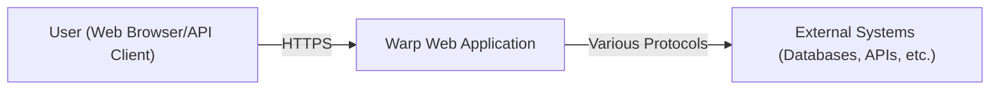
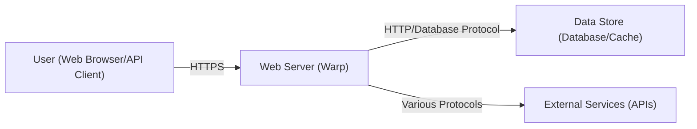
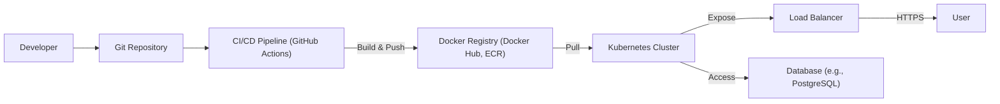
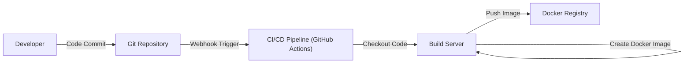

# BUSINESS POSTURE

Business Priorities and Goals:

*   Provide a robust, high-performance, and easy-to-use web server framework for the Rust ecosystem.
*   Enable developers to build and deploy web applications and services with speed and confidence.
*   Maintain a strong focus on correctness, safety, and performance, leveraging Rust's language features.
*   Foster a vibrant community and ecosystem around the framework.
*   Offer a compelling alternative to web frameworks in other languages.

Business Risks:

*   Security vulnerabilities in the framework could expose applications built with Warp to attacks, leading to data breaches, service disruptions, and reputational damage.
*   Performance bottlenecks or instability in the framework could negatively impact the performance and reliability of applications built with Warp.
*   Lack of adoption or a decline in community engagement could hinder the long-term viability of the project.
*   Competition from other web frameworks in Rust and other languages could limit Warp's market share.
*   Inability to keep up with evolving web standards and security best practices could render the framework obsolete or insecure.

# SECURITY POSTURE

Existing Security Controls:

*   security control: The project is written in Rust, a memory-safe language, which inherently prevents many common security vulnerabilities like buffer overflows and use-after-free errors. (Described in the project's README and inherent to the choice of Rust).
*   security control: The project uses `hyper` as its HTTP implementation, which itself is a well-vetted and security-conscious library. (Described in the project's dependencies).
*   security control: The project has a `SECURITY.md` file outlining the process for reporting vulnerabilities.
*   security control: Regular dependency updates to address known vulnerabilities in third-party libraries. (Visible in the project's commit history).
*   security control: Use of CI (GitHub Actions) to automate testing and linting. (Visible in the `.github/workflows` directory).

Accepted Risks:

*   accepted risk: The framework is relatively young, and undiscovered vulnerabilities may exist.
*   accepted risk: Reliance on external dependencies (like `hyper`) introduces the risk of vulnerabilities in those dependencies.
*   accepted risk: The complexity of asynchronous programming in Rust can introduce subtle bugs that may have security implications.

Recommended Security Controls:

*   security control: Implement fuzzing to proactively discover potential vulnerabilities.
*   security control: Conduct regular security audits and penetration testing.
*   security control: Integrate a Software Composition Analysis (SCA) tool to identify and track vulnerabilities in dependencies.
*   security control: Consider implementing a Content Security Policy (CSP) and other HTTP security headers by default or providing easy configuration options.

Security Requirements:

*   Authentication:
    *   The framework should provide mechanisms or guidance for implementing secure authentication protocols (e.g., OAuth 2.0, OpenID Connect).
    *   Support for secure session management is crucial.
*   Authorization:
    *   The framework should facilitate the implementation of role-based access control (RBAC) or other authorization models.
    *   Mechanisms for protecting against unauthorized access to resources are necessary.
*   Input Validation:
    *   The framework should encourage or provide built-in mechanisms for validating all user inputs to prevent injection attacks (e.g., XSS, SQL injection).
    *   Clear guidance on handling different data types and encodings is needed.
*   Cryptography:
    *   The framework should utilize secure cryptographic libraries and practices for handling sensitive data (e.g., passwords, API keys).
    *   Guidance on using HTTPS and managing TLS certificates is essential.

# DESIGN

## C4 CONTEXT

Element Descriptions:

*   Element: User
    *   Name: User
    *   Type: Person
    *   Description: Represents a user interacting with the Warp web application, either through a web browser or an API client.
    *   Responsibilities:
        *   Initiates requests to the Warp application.
        *   Receives and processes responses from the Warp application.
    *   Security controls:
        *   Uses HTTPS for secure communication.
        *   May implement client-side security measures (e.g., browser security settings, API key management).

*   Element: Warp
    *   Name: Warp Web Application
    *   Type: Software System
    *   Description: The web application or service built using the Warp framework.
    *   Responsibilities:
        *   Handles incoming HTTP requests.
        *   Processes requests and generates responses.
        *   Interacts with external systems as needed.
        *   Enforces security policies.
    *   Security controls:
        *   Leverages Rust's memory safety.
        *   Uses `hyper` for secure HTTP handling.
        *   Implements input validation, authentication, and authorization mechanisms.

*   Element: External Systems
    *   Name: External Systems
    *   Type: Software System
    *   Description: Represents external systems that the Warp application interacts with, such as databases, other APIs, or third-party services.
    *   Responsibilities:
        *   Provides data or services to the Warp application.
    *   Security controls:
        *   Should implement their own security measures appropriate to their function.
        *   Communication with these systems should use secure protocols.

## C4 CONTAINER

Element Descriptions:

*   Element: User
    *   Name: User
    *   Type: Person
    *   Description: Represents a user interacting with the Warp web application.
    *   Responsibilities: Initiates requests, receives responses.
    *   Security controls: HTTPS, client-side security.

*   Element: Web Server
    *   Name: Web Server (Warp)
    *   Type: Container: Web Server
    *   Description: The core Warp framework instance, handling request routing, filtering, and response generation.
    *   Responsibilities:
        *   Receives and parses HTTP requests.
        *   Routes requests to appropriate handlers.
        *   Applies filters (middleware).
        *   Generates HTTP responses.
    *   Security controls:
        *   Rust memory safety.
        *   `hyper` for secure HTTP.
        *   Input validation.
        *   Authentication/authorization filters.

*   Element: Data Store
    *   Name: Data Store (Database/Cache)
    *   Type: Container: Database
    *   Description: Represents a persistent data store, such as a relational database (PostgreSQL, MySQL) or a NoSQL database (MongoDB, Redis).
    *   Responsibilities:
        *   Stores and retrieves data.
        *   Manages data consistency and integrity.
    *   Security controls:
        *   Database-specific security measures (access controls, encryption).
        *   Secure communication protocols.

*   Element: External Services
    *   Name: External Services (APIs)
    *   Type: Container: API
    *   Description: Represents external APIs or services that the Warp application interacts with.
    *   Responsibilities: Provides specific functionalities or data.
    *   Security controls: API-specific security (authentication, authorization, rate limiting).

## DEPLOYMENT

Possible deployment solutions:

1.  Bare Metal/Virtual Machine: Deploy the compiled Warp application binary directly onto a server.
2.  Containerization (Docker): Package the application and its dependencies into a Docker container for easy deployment and scaling.
3.  Cloud Platforms (AWS, Google Cloud, Azure): Utilize cloud-specific services (e.g., AWS Elastic Beanstalk, Google App Engine, Azure App Service) for deployment and management.
4.  Kubernetes: Deploy the application as a containerized workload within a Kubernetes cluster.

Chosen solution (for detailed description): Containerization (Docker) with Kubernetes.

Element Descriptions:

*   Element: Developer
    *   Name: Developer
    *   Type: Person
    *   Description: The developer writing and deploying the Warp application.
    *   Responsibilities: Writes code, commits to Git, manages deployment configuration.
    *   Security controls: Secure coding practices, access controls to Git repository.

*   Element: Git
    *   Name: Git Repository
    *   Type: Version Control System
    *   Description: Stores the application source code and deployment configurations.
    *   Responsibilities: Version control, collaboration.
    *   Security controls: Access controls, branch protection rules.

*   Element: CI/CD Pipeline
    *   Name: CI/CD Pipeline (GitHub Actions)
    *   Type: Automation
    *   Description: Automates the build, test, and deployment process.
    *   Responsibilities: Builds the Docker image, runs tests, pushes the image to a registry.
    *   Security controls: Secure configuration, limited access to secrets.

*   Element: Docker Registry
    *   Name: Docker Registry (Docker Hub, ECR)
    *   Type: Container Registry
    *   Description: Stores the built Docker images.
    *   Responsibilities: Image storage, versioning.
    *   Security controls: Access controls, image scanning.

*   Element: Kubernetes Cluster
    *   Name: Kubernetes Cluster
    *   Type: Container Orchestration
    *   Description: Manages the deployment and scaling of the application containers.
    *   Responsibilities: Container scheduling, resource management, service discovery.
    *   Security controls: Network policies, RBAC, pod security policies.

*   Element: Load Balancer
    *   Name: Load Balancer
    *   Type: Network
    *   Description: Distributes incoming traffic across multiple instances of the application.
    *   Responsibilities: Traffic routing, health checks.
    *   Security controls: TLS termination, DDoS protection.

*   Element: User
    *   Name: User
    *   Type: Person
    *   Description: The end-user accessing the application.
    *   Responsibilities: Initiates requests.
    *   Security controls: HTTPS.

*   Element: Database
    *   Name: Database (e.g., PostgreSQL)
    *   Type: Database
    *   Description: The persistent data store for the application.
    *   Responsibilities: Data storage and retrieval.
    *   Security controls: Database-specific security measures.

## BUILD

Build Process Description:

1.  Developer commits code to the Git repository.
2.  A webhook triggers the CI/CD pipeline (GitHub Actions).
3.  The CI pipeline checks out the code onto a build server.
4.  The code is compiled using `cargo build --release`.
5.  Tests are run using `cargo test`.
6.  Linting is performed using `clippy`.
7.  Dependency vulnerabilities are checked using `cargo audit` or a similar tool.
8.  A Docker image is created, packaging the compiled binary and any necessary runtime dependencies.
9.  The Docker image is pushed to a container registry (e.g., Docker Hub, Amazon ECR).

Security Controls:

*   security control: Use of a CI/CD pipeline (GitHub Actions) ensures consistent and automated builds.
*   security control: Automated testing (`cargo test`) helps catch bugs early.
*   security control: Linting (`clippy`) enforces code style and helps prevent potential errors.
*   security control: Dependency checking (`cargo audit`) identifies known vulnerabilities in dependencies.
*   security control: Building a Docker image provides a consistent and isolated runtime environment.
*   security control: Pushing the image to a secure container registry protects the built artifact.

# RISK ASSESSMENT

Critical Business Processes:

*   Serving web requests and API responses reliably and efficiently.
*   Protecting user data and ensuring privacy.
*   Maintaining the availability and integrity of the service.

Data Sensitivity:

*   Depending on the specific application built with Warp, the data handled could range from non-sensitive public data to highly sensitive personal or financial information.  The design document should be updated with specifics once the application's purpose is defined.
*   Example: If the Warp application handles user authentication, then user credentials (hashed passwords, tokens) would be considered highly sensitive.
*   Example: If the application processes payments, then credit card details and transaction data would be highly sensitive.
*   Example: If the application stores user-generated content, the sensitivity would depend on the nature of the content.

# QUESTIONS & ASSUMPTIONS

Questions:

*   What specific types of applications are anticipated to be built with Warp? (This will significantly impact data sensitivity and security requirements.)
*   What are the expected traffic patterns and scaling requirements?
*   What external services will Warp applications typically interact with?
*   What level of security certification or compliance is required (e.g., PCI DSS, HIPAA)?
*   Are there any specific performance benchmarks or targets?

Assumptions:

*   BUSINESS POSTURE: The primary goal is to provide a secure and performant web framework.
*   SECURITY POSTURE: Developers using Warp will have a basic understanding of web security principles.
*   SECURITY POSTURE: The underlying operating system and infrastructure are secured.
*   DESIGN: The application will be deployed using containerization (Docker) and Kubernetes.
*   DESIGN: The application will use a database for persistent storage.
*   DESIGN: The CI/CD pipeline will be used for building and deploying the application.