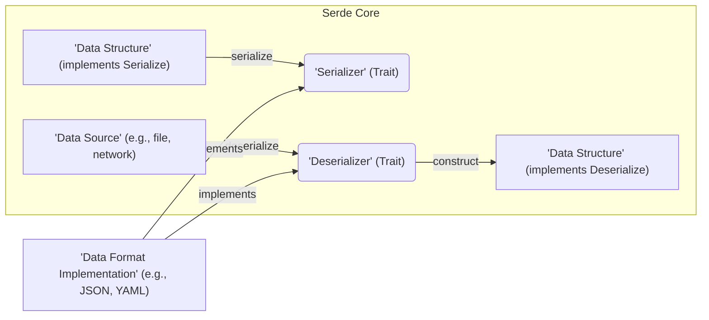
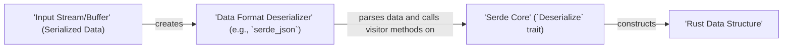

# Project Design Document: Serde - Rust Serialization Framework

**Version:** 1.1
**Date:** October 26, 2023
**Author:** Gemini (AI Language Model)

## 1. Introduction

This document details the design of the Serde crate, a foundational framework in Rust for serializing and deserializing data structures. This document aims to provide a comprehensive understanding of Serde's architecture, specifically for use as input in subsequent threat modeling activities. A strong understanding of Serde's internal workings is crucial for identifying potential security vulnerabilities.

Serde enables the conversion of Rust data structures into a format suitable for storage or transmission, and the reverse process of reconstructing Rust data structures from such a format. This is achieved through a generic interface that can be implemented for a wide variety of data formats.

## 2. Goals

The core design goals of Serde are:

* **Format Genericity:** To offer a single, consistent API for serialization and deserialization, independent of the underlying data format.
* **Performance Efficiency:** To provide high-speed serialization and deserialization capabilities.
* **Extensibility and Flexibility:** To facilitate customization and the addition of support for new data structures and formats.
* **Memory and Type Safety:** To leverage Rust's inherent safety features and provide mechanisms to prevent common serialization/deserialization errors and vulnerabilities.
* **Developer Ergonomics:** To present a user-friendly and intuitive API for seamless integration into Rust projects.

## 3. High-Level Architecture

Serde's architecture is built around the central traits `Serializer` and `Deserializer`. Rust data structures interact with these traits by implementing the `Serialize` and `Deserialize` traits.



Key architectural elements include:

* **`Serialize` Trait:**  This trait is implemented by Rust data structures that need to be serialized. It defines a single primary method, `serialize`, which guides the serialization process by interacting with a `Serializer`.
* **`Serializer` Trait:** This trait defines the interface for transforming Rust data into a specific data format. Concrete implementations are provided by external crates tailored to individual formats (e.g., `serde_json` for JSON).
* **`Deserialize` Trait:**  Implemented by Rust data structures that can be reconstructed from a serialized representation. It defines the `deserialize` method, which uses a `Deserializer` to parse the input data.
* **`Deserializer` Trait:** This trait specifies the interface for parsing data from a particular format and providing the data to the `Deserialize` implementation. Format-specific crates provide concrete implementations.
* **Data Format Crates:**  These are separate Rust crates that provide the concrete implementations of the `Serializer` and `Deserializer` traits for specific data formats like JSON, YAML, TOML, and others. They handle the format-specific encoding and decoding logic.
* **Derive Macro (`#[derive(Serialize, Deserialize)]`):** A powerful procedural macro that automatically generates implementations of the `Serialize` and `Deserialize` traits for many common Rust structs and enums, reducing boilerplate code.

## 4. Detailed Component Design

### 4.1. `Serialize` Trait

* **Purpose:** To provide a mechanism for Rust data structures to describe how they should be represented in a serialized form.
* **Key Methods:**
    * `serialize<S>(&self, serializer: S) -> Result<S::Ok, S::Error>`: The central method. The data structure uses the provided `Serializer` to serialize its constituent parts.
    * Methods on the `Serializer` trait are then called by the `serialize` implementation to handle different data types (e.g., `serialize_bool`, `serialize_i32`, `serialize_str`, `serialize_struct`, `serialize_tuple`, `serialize_seq`, `serialize_map`).
* **Security Relevance:** The logic within the `serialize` implementation determines the structure and content of the serialized data. Incorrect or naive implementations could inadvertently expose sensitive information or create opportunities for manipulation during deserialization in other systems.

### 4.2. `Serializer` Trait

* **Purpose:** To define a generic interface for the process of converting Rust data into a specific data format.
* **Key Methods:**
    * A comprehensive set of methods for serializing primitive types (e.g., `serialize_bool`, `serialize_i8`, `serialize_f64`, `serialize_char`).
    * Methods for handling compound data types (e.g., `serialize_struct`, `serialize_tuple`, `serialize_seq`, `serialize_map`). These methods dictate how the structure of the data is represented in the target format.
    * `Error` associated type: Defines the error type that the serializer implementation will use to report serialization failures.
    * `Ok` associated type:  Specifies the success type of the serialization process, typically `()`.
* **Security Relevance:** Implementations of this trait are directly responsible for the correct encoding of data according to the target format's specification. Vulnerabilities in these implementations, such as improper handling of string escaping or numeric precision, can lead to security issues when the data is later processed.

### 4.3. `Deserialize` Trait

* **Purpose:** To enable the reconstruction of a Rust data structure from its serialized representation.
* **Key Methods:**
    * `deserialize<'de, D>(deserializer: D) -> Result<Self, D::Error>`: The primary method. It receives a `Deserializer` instance and uses its methods to parse the input data and populate the fields of the data structure.
    * `deserialize_any<'de, V>(self, visitor: V) -> Result<V::Value, Self::Error>`:  Allows deserialization of data where the exact type is not known beforehand, using a `Visitor` pattern.
* **Security Relevance:** The `deserialize` implementation is responsible for correctly interpreting the serialized data and constructing a valid Rust object. Vulnerabilities can arise from mishandling malformed or malicious input, potentially leading to crashes, unexpected program behavior, or even code execution if the deserialized data influences control flow or system calls.

### 4.4. `Deserializer` Trait

* **Purpose:** To define a generic interface for parsing data from a specific format and providing the parsed data to the `Deserialize` implementation.
* **Key Methods:**
    * Methods for accessing primitive values from the input stream (e.g., `deserialize_bool`, `deserialize_i32`, `deserialize_string`).
    * Methods for navigating the structure of the input data (e.g., `deserialize_struct`, `deserialize_tuple`, `deserialize_seq`, `deserialize_map`). These methods allow the `Deserialize` implementation to traverse the serialized data.
    * `Error` associated type: Defines the error type used by the deserializer implementation.
* **Security Relevance:** Implementations of this trait are a critical point of interaction with potentially untrusted data. They must carefully parse and validate the input to prevent vulnerabilities like buffer overflows (if the format involves length prefixes), integer overflows (when parsing numeric values), or format string bugs (though less common in modern formats, the principle applies to how data is interpreted).

### 4.5. Data Format Implementations (Example: `serde_json`)

* **Purpose:** To provide concrete, format-specific implementations of the `Serializer` and `Deserializer` traits.
* **Components:**
    * `Serializer`: Implements the `Serializer` trait to convert Rust data structures into JSON strings or byte streams, adhering to JSON syntax and encoding rules (e.g., string quoting, character escaping).
    * `Deserializer`: Implements the `Deserializer` trait to parse JSON strings or byte streams and reconstruct Rust data structures. This involves validating the JSON structure and converting JSON values into Rust types.
* **Security Relevance:** These implementations are the primary handlers of raw, potentially untrusted input data. They are the most direct point of contact for many common serialization vulnerabilities. For example, a `serde_json` deserializer needs to be robust against excessively large numbers, deeply nested objects, and invalid UTF-8 sequences to prevent denial-of-service attacks or unexpected behavior.

### 4.6. Derive Macro

* **Purpose:** To automate the generation of `Serialize` and `Deserialize` trait implementations for Rust structs and enums, based on their field types and structure.
* **Functionality:**  The macro analyzes the structure of the data type at compile time and generates the necessary code to serialize and deserialize its members according to their types. It can be customized with attributes to control the serialization process (e.g., renaming fields, skipping fields).
* **Security Relevance:** While the derive macro itself is generally safe, its behavior depends on the types of the fields in the data structure. If a field's type has a custom `Serialize` or `Deserialize` implementation with vulnerabilities, the derived implementation will inherit those risks. Additionally, incorrect usage of attributes or complex data structures might lead to unexpected serialization behavior that could have security implications.

## 5. Data Flow

The following diagrams illustrate the typical flow of data during serialization and deserialization operations.

### 5.1. Serialization Data Flow

```mermaid
graph LR
    A["'Rust Data Structure'"] -->|`serialize()` method call| B["'Serde Core' (`Serialize` trait)"];
    B -->|calls format-specific methods on| C["'Data Format Serializer' (e.g., `serde_json`)"];
    C -->|writes formatted data to| D["'Output Stream/Buffer'"];
```

1. A Rust data structure that implements the `Serialize` trait initiates the process by calling its `serialize()` method.
2. The `serialize()` method receives a concrete `Serializer` instance, which is specific to the desired output format.
3. The `serialize()` implementation within the data structure calls methods on the `Serializer` to serialize its individual fields or variants.
4. The `Serializer` implementation writes the formatted data to the designated output stream or buffer.

### 5.2. Deserialization Data Flow



1. An input stream or buffer containing serialized data is used to create a concrete `Deserializer` instance corresponding to the data's format.
2. The `deserialize()` method of the target Rust data structure (implementing `Deserialize`) is called, receiving the `Deserializer`.
3. The `deserialize()` implementation uses the `Deserializer` to parse the input data. This often involves a "visitor" pattern, where the `Deserializer` informs the `Deserialize` implementation about the structure and types of the incoming data.
4. The `Deserialize` implementation constructs the Rust data structure based on the parsed data.

## 6. Security Considerations

Several crucial security aspects are relevant to the design and use of Serde:

* **Robust Input Validation:** Deserialization processes must rigorously validate input data to prevent common vulnerabilities like buffer overflows, integer overflows, and format string bugs. This responsibility primarily lies with the format-specific `Deserializer` implementations.
* **Denial of Service (DoS) Prevention:**  Maliciously crafted input data could be designed to consume excessive resources (CPU, memory) during deserialization, leading to DoS attacks. This includes scenarios like deeply nested structures, extremely long strings, or a large number of small allocations.
* **Prevention of Information Disclosure:** Care must be taken to avoid unintentionally serializing sensitive information that should not be exposed. Developers should leverage Serde's attributes (e.g., `#[serde(skip)]`, `#[serde(with = "...")]`) to control which data is serialized and how.
* **Mitigation of Code Injection Risks:** Flaws in deserialization logic could potentially allow attackers to inject and execute arbitrary code by crafting malicious input. This is a critical concern, especially when deserializing data from untrusted sources. Format implementations must be carefully designed to prevent this.
* **Security of Dependencies:** Serde relies on external crates for format-specific implementations. The security of these dependencies is paramount. Vulnerabilities in these crates can directly impact the security of applications using Serde. Regular dependency audits and updates are essential.
* **Format-Specific Vulnerabilities Awareness:** Each data format has its own set of potential vulnerabilities. For example, JSON parsing might be susceptible to issues with very large numbers or deeply nested objects. YAML has historically had vulnerabilities related to arbitrary code execution through tag processing. Developers need to be aware of these format-specific risks.
* **Type Safety and Deserialization:** While Rust's type system provides a baseline of safety, deserialization from untyped formats requires careful handling to ensure type compatibility and prevent unexpected behavior or panics.
* **Comprehensive Error Handling:** Robust error handling during deserialization is critical. Instead of panicking, deserializers should return meaningful errors when encountering malformed or invalid input, preventing crashes and providing opportunities for graceful recovery.

## 7. Potential Threats (Detailed for Threat Modeling)

Based on Serde's design, the following potential threats should be considered during threat modeling:

* **Malicious Input Exploiting Deserializer Vulnerabilities:** Attackers could craft malicious input that exploits vulnerabilities (e.g., buffer overflows, integer overflows) within the format-specific deserializer implementations, leading to crashes, memory corruption, or potentially remote code execution.
* **Denial of Service Attacks Through Resource Exhaustion:** Attackers could send specially crafted, large, or deeply nested serialized data to exhaust the resources (CPU, memory) of the deserializing system, causing a denial of service.
* **Information Leakage Due to Unintended Serialization:** Developers might inadvertently serialize sensitive data (e.g., passwords, API keys) if they are not careful about which fields are included in the serialization process.
* **Code Injection through Deserialization of Untrusted Data:** In scenarios where deserialization involves complex data structures or custom deserialization logic, vulnerabilities could allow attackers to inject and execute arbitrary code by manipulating the serialized data. This is particularly relevant for formats that support custom types or code execution (though less common in standard serialization formats).
* **Exploitation of Vulnerabilities in Format-Specific Crates:** Attackers could target known or newly discovered vulnerabilities in the underlying format-specific crates (e.g., `serde_json`, `serde_yaml`).
* **Misuse of Serde API Leading to Insecure Deserialization:** Developers might use Serde's API incorrectly, for example, by deserializing untrusted data without proper validation or by using unsafe deserialization methods (if any exist in specific format implementations).
* **Supply Chain Attacks Targeting Serde Dependencies:** Attackers could compromise dependencies of Serde or its format implementations to introduce malicious code that could be executed during serialization or deserialization.

## 8. Future Considerations

* **Ongoing Security Audits:** Regular security audits of the Serde core and widely used format implementations are crucial to identify and address potential vulnerabilities proactively.
* **Fuzzing for Deserialization Robustness:** Employing fuzzing techniques against deserializers with various malformed and malicious inputs can help uncover potential vulnerabilities and edge cases.
* **Exploring Sandboxing or Isolation Techniques:** Investigating the feasibility of sandboxing or isolating deserialization processes, especially when handling data from untrusted sources, to limit the impact of potential vulnerabilities.
* **Enhanced Error Reporting and Diagnostics:** Improving error messages during deserialization can aid developers in debugging and identifying potential security issues related to malformed input.
* **Formal Verification of Deserialization Logic:** For critical applications, exploring formal verification techniques to mathematically prove the correctness and security of deserialization implementations.

## 9. Conclusion

Serde is a cornerstone library in the Rust ecosystem, providing a powerful and flexible framework for serialization and deserialization. Its design emphasizes genericity and performance. A thorough understanding of Serde's architecture, the responsibilities of its core components, and the potential security considerations is essential for building secure applications. This design document serves as a crucial input for comprehensive threat modeling, enabling the identification and mitigation of potential risks associated with data serialization and deserialization.