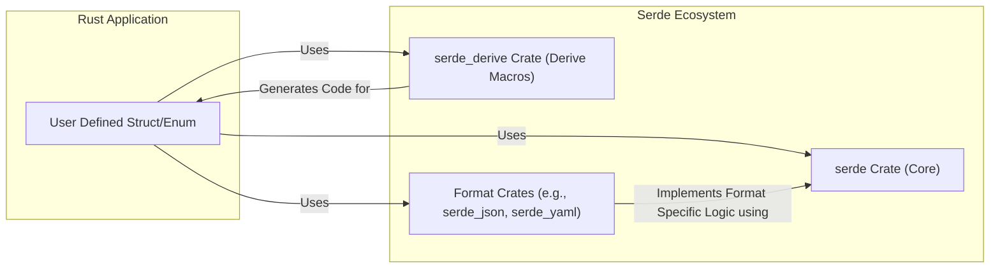
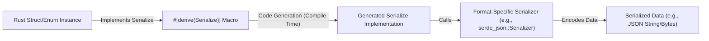
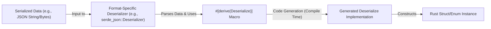
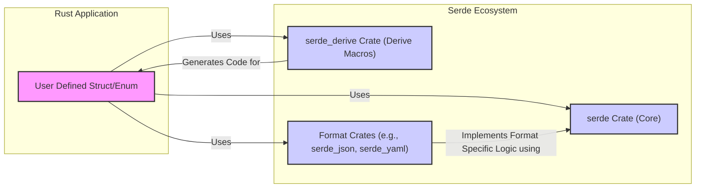

# Project Design Document: Serde

## 1. Introduction

### 1.1. Project Overview

Serde is a powerful and widely used Rust framework for serialization and deserialization of data structures. It provides a simple, flexible, and performant way to convert Rust data structures to and from various data formats, such as JSON, YAML, MessagePack, and many others. Serde consists of two main parts:

*   **Serde Core:** Defines the core traits and data model for serialization and deserialization. It provides the foundational API that format-specific crates and user code interact with.
*   **Serde Derive:** Provides procedural macros (`#[derive(Serialize)]` and `#[derive(Deserialize)]`) that automatically generate serialization and deserialization implementations for Rust structs and enums. This significantly simplifies the process of making custom data types serializable and deserializable.

The project aims to be format-agnostic, allowing developers to easily switch between different data formats without changing their core application logic. Its focus on performance and correctness has made it a cornerstone of the Rust ecosystem for data handling.

### 1.2. Purpose of this Document

This document serves as a design specification for the Serde project, focusing on its architecture, components, and security considerations. It is intended to be used as a basis for threat modeling and security analysis of systems that utilize Serde. This document will outline the key architectural elements, data flow, and potential security implications to facilitate a comprehensive threat assessment.

## 2. System Architecture

### 2.1. High-Level Architecture

Serde's architecture is designed around a core set of traits and a derive system that enables format-agnostic serialization and deserialization. The high-level architecture can be visualized as follows:



**Description of Components:**

*   **Rust Application:** Represents user code that defines data structures (structs, enums) and utilizes Serde to serialize and deserialize them. This is the consumer of Serde's functionality.
*   **`serde` Crate (Core):** This is the central crate providing the core traits (`Serialize`, `Deserialize`, `Serializer`, `Deserializer`, `Visitor`, etc.) and the abstract data model. It is format-agnostic and defines the interfaces that format-specific crates must implement to integrate with Serde. The data model includes fundamental types like booleans, integers, floats, strings, byte arrays, sequences, maps, and enums, providing a common language for serialization and deserialization across different formats.
*   **`serde_derive` Crate (Derive Macros):** This crate provides procedural macros that automatically generate implementations of `Serialize` and `Deserialize` traits for user-defined structs and enums. It significantly simplifies the developer experience by automating boilerplate code generation based on the structure of Rust types and `serde` attributes.
*   **Format Crates (e.g., `serde_json`, `serde_yaml`):** These are external crates that implement serialization and deserialization for specific data formats. They utilize the core traits from the `serde` crate and provide concrete implementations of `Serializer` and `Deserializer` tailored to the syntax and semantics of their respective formats. They handle the format-specific parsing and generation of data.

### 2.2. Component Description

#### 2.2.1. `serde` Crate (Core)

*   **Purpose:** Defines the fundamental traits, data model, and error handling mechanisms for serialization and deserialization in Rust. Acts as the central abstraction layer.
*   **Key Features:**
    *   **`Serialize` Trait:**  Defines the interface for types that can be serialized. Types implementing this trait can be converted into a serialized representation by a `Serializer`.
    *   **`Deserialize` Trait:** Defines the interface for types that can be deserialized. Types implementing this trait can be constructed from a serialized representation by a `Deserializer`.
    *   **`Serializer` Trait:** Defines the interface for serializers, which are responsible for encoding data into a specific format. Format crates implement this trait to support a particular format.
    *   **`Deserializer` Trait:** Defines the interface for deserializers, which are responsible for decoding data from a specific format. Format crates implement this trait to support a particular format.
    *   **`Visitor` Trait:** Used during deserialization to decouple the deserializer implementation from the concrete Rust type being deserialized. It allows format crates to handle the structure of the input data and guide the construction of the Rust type.
    *   **Data Model:** Provides a common, format-agnostic data model that serializers and deserializers work with. This model includes primitives like booleans, integers (signed and unsigned, various sizes), floats (32-bit and 64-bit), strings, byte arrays, sequences (like vectors and lists), maps (like hash maps), and enums.
    *   **Error Handling:** Defines a standard `Error` type and `Result` type for reporting errors during serialization and deserialization, ensuring consistent error handling across different format crates.

#### 2.2.2. `serde_derive` Crate

*   **Purpose:** Provides procedural macros to automatically generate `Serialize` and `Deserialize` implementations, reducing boilerplate and improving developer productivity.
*   **Key Features:**
    *   **`#[derive(Serialize)]` Macro:**  Generates `Serialize` implementation for structs and enums based on their field types and structure. It analyzes the fields and generates code that calls the appropriate `serialize_*` methods on a `Serializer`.
    *   **`#[derive(Deserialize)]` Macro:** Generates `Deserialize` implementation for structs and enums, handling the construction of the type from serialized data. It generates code that uses a `Deserializer` and a `Visitor` to construct the Rust type from the input data.
    *   **Attribute Support:**  Allows extensive customization of serialization and deserialization behavior through attributes like `#[serde(rename = "...", serialize_with = "...", deserialize_with = "...", skip_serializing, skip_deserializing, default, flatten, tag = "...", content = "...")]`. These attributes provide fine-grained control over how fields and enum variants are serialized and deserialized.
    *   **Code Generation:**  Generates efficient Rust code at compile time, which is highly performant and avoids runtime reflection overhead. The generated code is statically typed and optimized by the Rust compiler.
    *   **Compile-time Checks:** Performs compile-time checks to ensure that the derived implementations are valid and consistent with the structure of the Rust type, catching potential errors early in the development process.

#### 2.2.3. Format-specific Crates (e.g., `serde_json`, `serde_yaml`)

*   **Purpose:** Implement serialization and deserialization for specific data formats, bridging the gap between Serde's core traits and concrete data formats.
*   **Key Features:**
    *   **Format Implementation:**  Provides concrete implementations of `Serializer` and `Deserializer` traits from the `serde` crate for a particular format (e.g., JSON, YAML, MessagePack, TOML, CSV, etc.).
    *   **Format Parsing/Generation:**  Handles the parsing of input data during deserialization according to the format's grammar and specification, and the generation of output data during serialization, adhering to the format's rules. This often involves using format-specific parsing libraries or generators.
    *   **Error Handling:**  Provides format-specific error handling and reporting during serialization and deserialization, often enriching the generic `serde::Error` with format-specific context and details for better debugging.
    *   **Configuration Options:** May offer format-specific configuration options to control serialization and deserialization behavior, such as pretty printing in JSON (`serde_json::to_string_pretty`), YAML style and indentation (`serde_yaml`), or CSV delimiters and quoting (`csv-serde`).
    *   **Format-Specific Data Types:** May handle format-specific data types or extensions, such as JSON Schema validation in `serde_json` or YAML anchors and aliases in `serde_yaml`.
    *   **Performance Optimization:** Format crates are often optimized for performance for their specific format, leveraging efficient parsing and generation techniques.

### 2.3. Data Flow

#### 2.3.1. Serialization Process

The serialization process involves converting a Rust data structure into a serialized representation in a specific format. The typical data flow is as follows:



**Detailed Steps:**

1.  **User-defined type implements `Serialize`:**  A Rust struct or enum is annotated with `#[derive(Serialize)]` or manually implements the `Serialize` trait. This indicates that the type is capable of being serialized by Serde.
2.  **`serde_derive` generates code:** The `serde_derive` macro, during Rust compilation, inspects the structure of the user-defined type and generates Rust code that implements the `Serialize` trait. This generated code is specific to the structure of the type.
3.  **Generated `Serialize` implementation is compiled:** The Rust compiler compiles the generated `Serialize` implementation along with the rest of the user's code.
4.  **Format-specific serializer is invoked:**  When serialization is initiated in user code (e.g., by calling `serde_json::to_string(&my_struct)`), a format-specific serializer instance (e.g., `serde_json::Serializer`) is created. This serializer is responsible for encoding data into the target format (JSON in this example).
5.  **Serialization logic is executed:** The generated `Serialize` implementation for the user type is executed. This code traverses the fields of the struct/enum and calls the appropriate methods on the format-specific serializer (e.g., `serialize_struct`, `serialize_string`, `serialize_u32`, `serialize_seq`, `serialize_map`, etc.). These calls guide the serializer to encode the data according to the target format's rules.
6.  **Serialized data is produced:** The format-specific serializer accumulates the encoded data and produces the final serialized output, which could be a string, bytes, a file, or any other representation depending on the format and the serializer's implementation.

#### 2.3.2. Deserialization Process

The deserialization process involves converting a serialized representation in a specific format back into a Rust data structure. The typical data flow is as follows:



**Detailed Steps:**

1.  **Serialized data is input:** Serialized data (e.g., a JSON string from a file or network request) is provided as input to a format-specific deserialization function (e.g., `serde_json::from_str(json_string)`).
2.  **Format-specific deserializer is created:** A format-specific deserializer instance (e.g., `serde_json::Deserializer`) is created to parse and decode the input data according to the format's specification.
3.  **`serde_derive` generated code is used:** The `serde_derive` macro, during compilation, generates the `Deserialize` implementation for the target user-defined type. This generated code contains logic to guide the deserializer in constructing an instance of the type.
4.  **Deserialization logic is executed:** The format-specific deserializer parses the input data stream. Guided by the generated `Deserialize` implementation and using a `Visitor`, it interprets the serialized data and calls methods on the `Visitor` to construct the Rust type. The `Visitor` pattern allows the deserializer to handle the structure of the input data without needing to know the concrete Rust type upfront.
5.  **Rust struct/enum instance is produced:** The deserialization process completes, and an instance of the Rust struct or enum is created and returned, populated with data extracted from the serialized input.

### 2.4. Key Interfaces and APIs

*   **`Serialize` and `Deserialize` traits:** These are the core interfaces for enabling serialization and deserialization for Rust types. User code interacts with these traits primarily through the `#[derive]` mechanism, or by manually implementing them for more complex scenarios.
*   **`Serializer` and `Deserializer` traits:** These are the interfaces that format crates implement. They define a rich set of methods (`serialize_*` and `deserialize_*`) for handling different data types and structures within a specific format. Format crates provide concrete implementations of these traits.
*   **Format-specific functions (e.g., `serde_json::to_string`, `serde_json::from_str`, `serde_yaml::to_writer`, `serde_yaml::from_reader`):** These are the high-level, user-facing API functions provided by format crates. They offer convenient ways to initiate serialization and deserialization operations, taking user data and format-specific configurations as input and producing serialized data or Rust types as output.
*   **Attributes for customization (e.g., `#[serde(rename = "...", serialize_with = "...")]`):** Serde provides a powerful attribute system that allows users to customize serialization and deserialization behavior declaratively, directly within their Rust type definitions. This includes renaming fields, specifying custom serialization/deserialization functions, skipping fields, flattening structures, and more.

### 2.5. Extension Points

*   **Format Crates:** The primary extension point is the ability to create new format crates. Developers can implement the `Serializer` and `Deserializer` traits for new data formats, instantly expanding Serde's ecosystem and format support. This allows Serde to adapt to emerging data formats or niche requirements.
*   **Custom Serialization/Deserialization Logic:** For advanced use cases or types with complex serialization requirements, users can manually implement the `Serialize` and `Deserialize` traits. This provides complete control over the serialization and deserialization process, overriding the default derive behavior and enabling highly customized logic.
*   **Data Format Adapters/Wrappers:**  It's possible to create adapter crates or wrappers around existing format crates to modify their behavior, pre-process or post-process data, or integrate them with other systems or libraries. This allows for flexible integration and adaptation of Serde to diverse environments.
*   **Visitor Pattern Customization:** While format crates primarily use the `Visitor` trait, advanced users or format crate developers can potentially extend or customize the visitor pattern for highly specialized deserialization scenarios.
*   **Custom Attributes and Derive Logic:** Although more complex, it's theoretically possible to extend `serde_derive` with custom attributes or modify the derive logic itself (though this is less common and requires deep understanding of procedural macros and Serde internals).

## 3. Security Considerations

### 3.1. Input Validation and Deserialization

*   **Deserialization as a Security Boundary:** Deserialization is a critical security boundary because it processes data originating from external, potentially untrusted sources. Any vulnerabilities in the deserialization process can be directly exploited by malicious input data.
    *   **Mitigation:** Treat all deserialized data as untrusted. Apply strict input validation *after* deserialization to ensure data conforms to expected business logic and constraints. Employ principle of least privilege when handling deserialized data.
*   **Denial of Service (DoS):**  Large or deeply nested input data can cause excessive resource consumption (CPU, memory, network bandwidth) during deserialization, leading to DoS attacks. Attackers can craft payloads designed to exhaust resources.
    *   **Mitigation:** Format crates should implement built-in safeguards against DoS attacks, such as:
        *   **Input Size Limits:** Limit the maximum size of input data to prevent excessive memory allocation.
        *   **Nesting Depth Limits:** Limit the maximum nesting depth of data structures (e.g., JSON objects, YAML lists) to prevent stack overflow or excessive recursion.
        *   **Timeouts:** Implement timeouts for deserialization operations to prevent indefinite processing of malicious inputs.
        *   **Resource Monitoring:** Monitor resource usage during deserialization and implement circuit breakers or rate limiting if necessary.
*   **Type Confusion:** If the deserialization process does not strictly validate the input data against the expected type schema, or if format crates have vulnerabilities in type handling, it could lead to type confusion vulnerabilities. This can allow attackers to bypass security checks, corrupt data, or potentially gain control over program execution.
    *   **Mitigation:**
        *   **Schema Validation:** Where applicable, use schema validation techniques (e.g., JSON Schema, YAML Schema) to validate input data against a predefined schema *before* or during deserialization.
        *   **Strict Type Checking:** Ensure format crates perform strict type checking during deserialization and fail gracefully on type mismatches.
        *   **Avoid Dynamic Typing:** Prefer statically typed languages and data structures to minimize the risk of type confusion.
*   **Format-Specific Vulnerabilities:** Vulnerabilities in the parsing logic of format crates (e.g., JSON, YAML parsers) can be exploited to cause crashes, memory corruption, or other security issues. These vulnerabilities can arise from bugs in the parsing algorithm, buffer overflows, or incorrect handling of edge cases in the format specification.
    *   **Mitigation:**
        *   **Use Well-Audited Libraries:** Format crates should rely on robust, well-tested, and regularly audited parsing libraries.
        *   **Fuzzing and Security Testing:** Format crates should undergo rigorous fuzzing and security testing to identify and fix potential parsing vulnerabilities.
        *   **Regular Updates:** Keep format crate dependencies updated to benefit from security patches and bug fixes in underlying parsing libraries.
*   **Unsafe Deserialization:**  In rare scenarios, deserialization might involve unsafe Rust code or interactions with external resources (e.g., file system, network). These areas require extra scrutiny as they can introduce vulnerabilities if not handled carefully.
    *   **Mitigation:**
        *   **Minimize Unsafe Code:** Minimize the use of `unsafe` code in deserialization logic. If `unsafe` is necessary, ensure it is thoroughly reviewed and justified.
        *   **Sandboxing and Isolation:** If deserialization involves external resource access, consider sandboxing or isolating the deserialization process to limit the impact of potential vulnerabilities.
        *   **Principle of Least Privilege:** Run deserialization processes with the minimum necessary privileges to reduce the potential damage from exploits.

### 3.2. Code Generation Security

*   **`serde_derive` as a Trusted Component:** The `serde_derive` crate is a trusted component in the Rust build process as it generates code at compile time. However, bugs or vulnerabilities in the derive macro logic could potentially lead to the generation of insecure or incorrect code, which could manifest as runtime vulnerabilities.
    *   **Mitigation:**
        *   **Rigorous Testing:** `serde_derive` should be rigorously tested with a wide range of Rust types and `serde` attributes to ensure correct and secure code generation.
        *   **Code Reviews:** Code changes to `serde_derive` should undergo thorough code reviews, especially for security-sensitive aspects of code generation.
        *   **Static Analysis:** Employ static analysis tools to detect potential code generation issues or vulnerabilities in `serde_derive`.
*   **Attribute Handling:**  The handling of `serde` attributes in `serde_derive` needs to be secure. Maliciously crafted or unexpected combinations of attributes should not be able to cause unexpected behavior, code injection, or security issues during code generation.
    *   **Mitigation:**
        *   **Attribute Validation:** `serde_derive` should validate attribute syntax and semantics to prevent unexpected or malicious attribute usage.
        *   **Sanitization:** Sanitize or escape attribute values when generating code to prevent code injection vulnerabilities.
        *   **Defensive Programming:** Implement defensive programming practices in `serde_derive` to handle unexpected attribute combinations gracefully and prevent code generation errors.
*   **Dependency Security:**  `serde_derive` and format crates depend on other crates within the Rust ecosystem. Vulnerabilities in these dependencies (transitive dependencies) could indirectly affect Serde's security.
    *   **Mitigation:**
        *   **Dependency Audits:** Regularly audit dependencies of `serde`, `serde_derive`, and format crates for known vulnerabilities using tools like `cargo audit`.
        *   **Dependency Updates:** Keep dependencies updated to the latest secure versions to benefit from security patches.
        *   **Supply Chain Security:** Implement measures to ensure the integrity and security of the supply chain for Serde and its dependencies (e.g., using checksum verification, dependency pinning, and SBOM).

### 3.3. Format-Specific Security Risks

*   **Format-Specific Vulnerabilities:** Each data format has its own inherent security risks and potential vulnerabilities related to its parsing and interpretation.
    *   **JSON:**
        *   **JSON Injection:** If deserialized JSON data is directly used in contexts like SQL queries, command execution, or HTML rendering without proper sanitization, it can lead to injection attacks (e.g., SQL injection, command injection, cross-site scripting - XSS).
            *   **Mitigation:** Always sanitize and validate deserialized JSON data before using it in security-sensitive contexts. Use parameterized queries, prepared statements, and output encoding techniques to prevent injection attacks.
        *   **JSON Parsing Vulnerabilities:** Bugs in JSON parsing libraries can lead to crashes or unexpected behavior when processing maliciously crafted JSON.
            *   **Mitigation:** Use well-vetted and regularly updated JSON parsing libraries (like `serde_json` which uses `simd-json` or `minijson`).
    *   **YAML:**
        *   **YAML Deserialization Vulnerabilities (Arbitrary Code Execution):** YAML's feature of allowing custom types and tags can be exploited for arbitrary code execution if not handled with extreme care. Unsafe YAML loading can allow attackers to embed malicious code within YAML data that gets executed during deserialization.
            *   **Mitigation:** **Always use safe YAML loading functions** provided by YAML libraries (e.g., `serde_yaml::from_str` is safe by default, but ensure you are not using unsafe loading functions if available in other YAML libraries). Avoid using YAML's custom type/tag features if possible, or restrict their usage to trusted sources and carefully validate them.
        *   **YAML Parsing Vulnerabilities:** Similar to JSON, vulnerabilities in YAML parsing libraries can exist.
            *   **Mitigation:** Use robust and well-maintained YAML parsing libraries (like `serde_yaml` which uses a safe YAML parser).
    *   **XML:**
        *   **XML External Entity (XXE) Injection:** XML's support for external entities can be exploited for XXE injection attacks, allowing attackers to read local files, perform server-side request forgery (SSRF), or cause DoS.
            *   **Mitigation:** Disable or carefully control the processing of external entities in XML parsers. Configure XML parsers to disallow external entity resolution by default.
        *   **XML DoS Attacks (e.g., Billion Laughs Attack):** XML's recursive structure can be exploited for DoS attacks by crafting deeply nested XML documents that consume excessive resources during parsing.
            *   **Mitigation:** Implement limits on XML nesting depth and entity expansion to prevent DoS attacks.
    *   **Other Formats:** Each format (e.g., MessagePack, TOML, CSV, etc.) needs to be analyzed for its specific security implications and potential vulnerabilities.
*   **Format Mismatch:**  If the expected data format does not match the actual input format, it can lead to parsing errors, unexpected behavior, or even security issues if error handling is not robust.
    *   **Mitigation:**
        *   **Content Type Validation:** Validate the content type of input data to ensure it matches the expected format before attempting deserialization.
        *   **Robust Error Handling:** Implement robust error handling for deserialization failures and format mismatches. Avoid exposing detailed error messages to external users that could reveal information about the system.

### 3.4. Dependency Management

*   **Transitive Dependencies:** Serde and its ecosystem rely on a network of transitive dependencies. Security vulnerabilities in any of these dependencies, even deep down the dependency tree, can potentially impact the security of systems using Serde.
    *   **Mitigation:**
        *   **Dependency Scanning:** Use dependency scanning tools (e.g., `cargo audit`, Snyk, Dependabot) to regularly scan for known vulnerabilities in direct and transitive dependencies.
        *   **Software Bill of Materials (SBOM):** Generate and maintain a Software Bill of Materials (SBOM) for projects using Serde to track dependencies and facilitate vulnerability management.
*   **Dependency Updates:**  Failing to keep dependencies updated is a major source of security vulnerabilities. Outdated dependencies may contain known vulnerabilities that have been patched in newer versions.
    *   **Mitigation:**
        *   **Automated Dependency Updates:** Implement automated dependency update mechanisms (e.g., Dependabot, Renovate) to keep dependencies up-to-date with security patches.
        *   **Regular Updates:** Establish a process for regularly reviewing and updating dependencies, prioritizing security updates.
*   **Supply Chain Security:**  Compromised dependencies or malicious packages in the supply chain can introduce vulnerabilities into Serde and applications using it.
    *   **Mitigation:**
        *   **Checksum Verification:** Verify checksums of downloaded dependencies to ensure their integrity and authenticity.
        *   **Dependency Pinning:** Use dependency pinning or lock files (e.g., `Cargo.lock` in Rust) to ensure consistent dependency versions and prevent unexpected dependency changes.
        *   **Secure Package Registries:** Use trusted and secure package registries (e.g., crates.io for Rust) and consider using private registries for internal dependencies.
        *   **Code Signing and Provenance:** Where possible, verify code signatures and provenance of dependencies to ensure they originate from trusted sources.

## 4. Deployment and Usage Context

### 4.1. Common Use Cases

*   **Web Services and APIs:**  Serialization and deserialization of request and response bodies in web APIs (REST, GraphQL, etc.), typically using JSON, but also other formats like MessagePack or Protocol Buffers for performance or binary data.
*   **Data Storage and Retrieval:**  Persisting data to databases (SQL, NoSQL) or file systems in serialized formats (JSON, YAML, binary formats) and deserializing it upon retrieval.
*   **Configuration Management:**  Loading and saving application configuration from files in formats like YAML, TOML, JSON, or INI.
*   **Inter-Process Communication (IPC):**  Exchanging data between processes or services, often using efficient binary formats like MessagePack, Protocol Buffers, or Avro for performance and compactness.
*   **Command-Line Interfaces (CLIs):**  Parsing command-line arguments and options, and handling configuration files for CLIs, often using formats like YAML, JSON, or TOML for configuration.
*   **Data Processing Pipelines:**  Serializing and deserializing data as it flows through different stages of data processing pipelines (e.g., ETL, stream processing), enabling data transformation and exchange between components.
*   **Caching:**  Serializing data for storage in caches (in-memory caches, distributed caches) to improve performance and reduce database load.
*   **Event Sourcing and Event Streaming:**  Serializing events in event-driven architectures and event streaming platforms (e.g., Kafka, RabbitMQ), often using formats like JSON, Avro, or Protocol Buffers.

### 4.2. Deployment Environments

*   **Server-Side Applications:**  Backend services, web servers, application servers, API gateways, microservices, batch processing systems, data analytics platforms.
*   **Client-Side Applications:**  Web browsers (JavaScript/Wasm), mobile apps (iOS, Android, React Native), desktop applications (GUI applications), command-line tools.
*   **Embedded Systems:**  Resource-constrained devices, IoT devices, embedded software, where efficient serialization and deserialization are crucial due to limited processing power and memory.
*   **Cloud Environments:**  Cloud platforms (AWS, Azure, GCP), serverless functions (AWS Lambda, Azure Functions, Google Cloud Functions), containerized applications (Docker, Kubernetes), cloud storage services.
*   **Containers and Orchestration:**  Deployment within Docker containers managed by orchestration platforms like Kubernetes, Docker Swarm, or Nomad, enabling scalable and resilient deployments.
*   **Edge Computing:**  Edge devices, gateways, and edge servers, where data serialization and deserialization are needed for local data processing and communication with the cloud.

## 5. Diagrams

### 5.1. High-Level Architecture Diagram



### 5.2. Serialization Data Flow Diagram

```mermaid
graph LR
    A["Rust Struct/Enum Instance"] -- "Implements Serialize" --> B["#[derive(Serialize)] Macro"]
    B -- "Code Generation (Compile Time)" --> C["Generated Serialize Implementation"]
    C -- "Calls" --> D["Format-Specific Serializer (e.g., serde_json::Serializer)"]
    D -- "Encodes Data" --> E["Serialized Data (e.g., JSON String/Bytes)"]
    style A fill:#f9f,stroke:#333,stroke-width:2px
    style B fill:#ccf,stroke:#333,stroke-width:2px
    style C fill:#ccf,stroke:#333,stroke-width:2px
    style D fill:#ccf,stroke:#333,stroke-width:2px
    style E fill:#efe,stroke:#333,stroke-width:2px
```



### 5.3. Deserialization Data Flow Diagram

```mermaid
graph LR
    A["Serialized Data (e.g., JSON String/Bytes)"] -- "Input to" --> B["Format-Specific Deserializer (e.g., serde_json::Deserializer)"]
    B -- "Parses Data & Uses" --> C["#[derive(Deserialize)] Macro"]
    C -- "Code Generation (Compile Time)" --> D["Generated Deserialize Implementation"]
    D -- "Constructs" --> E["Rust Struct/Enum Instance"]
    style A fill:#efe,stroke:#333,stroke-width:2px
    style B fill:#ccf,stroke:#333,stroke-width:2px
    style C fill:#ccf,stroke:#333,stroke-width:2px
    style D fill:#ccf,stroke:#333,stroke-width:2px
    style E fill:#f9f,stroke:#333,stroke-width:2px