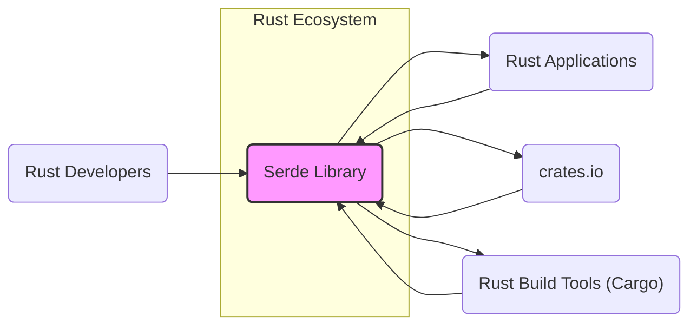
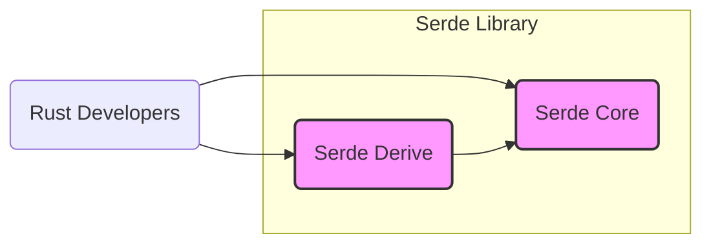
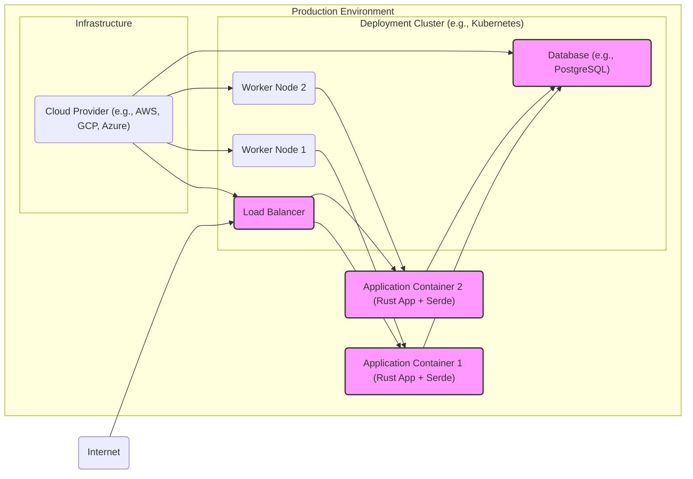
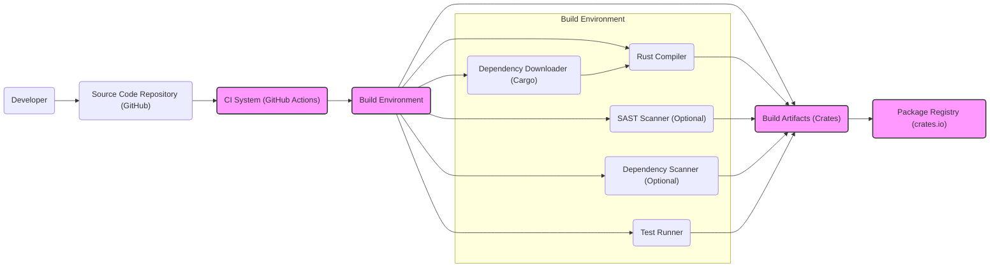

# BUSINESS POSTURE

- Business Priorities and Goals:
  - Provide a general-purpose, efficient, and reliable serialization and deserialization framework for the Rust programming language.
  - Enable Rust developers to easily handle data serialization and deserialization across various formats and use cases.
  - Foster a strong and secure foundation for data handling within the Rust ecosystem.

- Business Risks:
  - Security vulnerabilities in Serde could have widespread impact on the Rust ecosystem due to its broad adoption.
  - Performance bottlenecks in Serde could negatively affect the performance of applications that rely on it.
  - Lack of support for certain data formats or features could limit Serde's applicability and adoption.
  - Bugs or unexpected behavior could lead to data corruption or application instability.

# SECURITY POSTURE

- Existing Security Controls:
  - security control: Memory safety provided by the Rust programming language, reducing the risk of memory-related vulnerabilities. Implemented by: Rust compiler and language design.
  - security control: Open source project with public code review, allowing community scrutiny and identification of potential issues. Implemented by: GitHub repository and open development model.
  - security control: Unit and integration testing to ensure the correctness and robustness of the library. Implemented by: Test suite within the repository.
  - security control: Fuzzing to discover potential vulnerabilities through automated testing with invalid or unexpected inputs. Implemented by: Likely integrated into CI or as separate testing efforts (needs verification).

- Accepted Risks:
  - accepted risk: Dependencies of Serde might introduce security vulnerabilities. Mitigation: Dependency scanning and updates.
  - accepted risk: Complex logic in serialization and deserialization can still contain subtle bugs that could be exploited. Mitigation: Thorough testing, code reviews, and security audits.
  - accepted risk: Misuse of Serde by developers in downstream projects can lead to security vulnerabilities in those projects, even if Serde itself is secure. Mitigation: Clear documentation and usage examples.

- Recommended Security Controls:
  - security control: Implement Static Application Security Testing (SAST) tools in the CI/CD pipeline to automatically detect potential code-level vulnerabilities.
  - security control: Integrate Dependency Scanning tools to automatically identify and alert on known vulnerabilities in Serde's dependencies.
  - security control: Enhance fuzzing efforts with broader coverage and continuous execution to proactively discover vulnerabilities.
  - security control: Conduct periodic security audits by external security experts to review the codebase and identify potential security weaknesses.

- Security Requirements:
  - Authentication: Not applicable for a serialization/deserialization library. Serde itself does not handle authentication.
  - Authorization: Not applicable for a serialization/deserialization library. Serde itself does not handle authorization.
  - Input Validation: Critical for deserialization processes to prevent vulnerabilities such as denial of service, buffer overflows, or arbitrary code execution. Serde needs to ensure robust input validation based on the data format and schema being deserialized. Implemented by: Deserialization logic within Serde and format-specific implementations.
  - Cryptography: Serde itself does not implement cryptographic algorithms. However, it should be designed to be compatible with cryptographic libraries and not hinder the secure handling of sensitive data that might be encrypted or need to be encrypted during serialization/deserialization. Implemented by: Design considerations to avoid interference with cryptographic operations in user code.

# DESIGN

## C4 CONTEXT

- Context Diagram Elements:
  - - Name: Serde Library
    - Type: Software System
    - Description: A Rust library for serializing and deserializing data structures efficiently and generically. It provides a framework and derive macros to automatically implement serialization and deserialization for custom data types.
    - Responsibilities:
      - Provide core traits and APIs for serialization and deserialization.
      - Offer derive macros to automatically generate serialization and deserialization implementations.
      - Support various data formats through format-specific crates (e.g., JSON, YAML, CSV).
    - Security controls:
      - Input validation during deserialization.
      - Memory safety enforced by Rust.
      - Community code review and testing.

  - - Name: Rust Developers
    - Type: Person
    - Description: Software engineers who use the Rust programming language and utilize Serde in their projects to handle data serialization and deserialization.
    - Responsibilities:
      - Integrate Serde into their Rust projects.
      - Define data structures and use Serde's derive macros or APIs to enable serialization and deserialization.
      - Choose appropriate data formats and Serde format crates for their needs.
    - Security controls:
      - Secure coding practices in their applications using Serde.
      - Proper handling of sensitive data during serialization and deserialization.

  - - Name: Rust Applications
    - Type: Software System
    - Description: Applications written in Rust that depend on Serde for handling data serialization and deserialization. These applications can range from web servers and command-line tools to embedded systems and libraries.
    - Responsibilities:
      - Utilize Serde to serialize and deserialize data for various purposes (e.g., data storage, network communication, configuration parsing).
      - Depend on Serde for reliable and efficient data handling.
    - Security controls:
      - Application-level security controls to protect data processed by Serde.
      - Input validation and sanitization in application logic beyond Serde's built-in validation.

  - - Name: crates.io
    - Type: Software System
    - Description: The official package registry for the Rust ecosystem. Serde is published on crates.io, allowing Rust developers to easily download and include it as a dependency in their projects.
    - Responsibilities:
      - Host and distribute Serde library packages.
      - Provide versioning and dependency management for Serde.
    - Security controls:
      - crates.io's infrastructure security to ensure the integrity and availability of packages.
      - Package verification and checksums to prevent tampering.

  - - Name: Rust Build Tools (Cargo)
    - Type: Software System
    - Description: The standard build system and package manager for Rust. Cargo is used to build Rust projects, manage dependencies (including Serde), and run tests.
    - Responsibilities:
      - Download and manage Serde and its dependencies during project builds.
      - Compile Rust code, including Serde and projects using Serde.
      - Run tests for Serde and projects using Serde.
    - Security controls:
      - Cargo's dependency resolution and management to ensure secure dependency handling.
      - Build process security to prevent injection of malicious code during compilation.

## C4 CONTAINER

- Container Diagram Elements:
  - - Name: Serde Core
    - Type: Library (Rust Crate)
    - Description: The core crate of Serde, providing the fundamental traits (`Serialize`, `Deserialize`) and APIs for serialization and deserialization. It defines the data model and the framework for format implementations.
    - Responsibilities:
      - Define the `Serialize` and `Deserialize` traits.
      - Provide generic serialization and deserialization logic.
      - Offer APIs for implementing format-specific serialization and deserialization.
    - Security controls:
      - Input validation logic within core deserialization functions.
      - Memory safety enforced by Rust.
      - Unit and integration testing.

  - - Name: Serde Derive
    - Type: Library (Rust Crate, Procedural Macros)
    - Description: A crate providing procedural macros (`#[derive(Serialize)]`, `#[derive(Deserialize)]`) that automatically generate implementations of the `Serialize` and `Deserialize` traits for user-defined data structures.
    - Responsibilities:
      - Automatically generate `Serialize` and `Deserialize` implementations based on data structure definitions.
      - Simplify the process of making custom types serializable and deserializable.
    - Security controls:
      - Code generation logic to avoid introducing vulnerabilities during macro expansion.
      - Testing of generated code to ensure correctness and security.
      - Reliance on Serde Core for fundamental security controls.

## DEPLOYMENT

Serde is a library and does not have a standalone deployment in the traditional sense. It is deployed as part of Rust applications that depend on it. The deployment context is therefore the deployment of applications that use Serde.

Assuming a typical deployment scenario for a Rust application using Serde as a web service:

- Deployment Diagram Elements:
  - - Name: Cloud Provider (e.g., AWS, GCP, Azure)
    - Type: Infrastructure
    - Description: Provides the underlying infrastructure for hosting the application, including compute resources, networking, and managed services.
    - Responsibilities:
      - Provide secure and reliable infrastructure.
      - Manage physical security of data centers.
      - Offer security services like firewalls, intrusion detection, and access control.
    - Security controls:
      - Physical security of data centers.
      - Network security controls (firewalls, VPCs).
      - Identity and Access Management (IAM).
      - Compliance certifications (e.g., SOC 2, ISO 27001).

  - - Name: Deployment Cluster (e.g., Kubernetes)
    - Type: Container Orchestration Platform
    - Description: Manages the deployment, scaling, and operation of application containers. Provides features like load balancing, service discovery, and automated rollouts.
    - Responsibilities:
      - Orchestrate container deployments.
      - Manage container lifecycle and scaling.
      - Provide network services within the cluster.
    - Security controls:
      - Role-Based Access Control (RBAC) for cluster resources.
      - Network policies to control traffic within the cluster.
      - Secrets management for sensitive data.
      - Container security scanning.

  - - Name: Worker Node 1 & Worker Node 2
    - Type: Compute Instance (Virtual Machine or Physical Server)
    - Description: Nodes within the deployment cluster that run application containers.
    - Responsibilities:
      - Execute container workloads.
      - Provide compute resources (CPU, memory, storage) for containers.
    - Security controls:
      - Operating system hardening.
      - Host-based intrusion detection systems (HIDS).
      - Security patching and updates.
      - Container runtime security (e.g., containerd, CRI-O).

  - - Name: Application Container 1 & Application Container 2 (Rust App + Serde)
    - Type: Containerized Application
    - Description: Docker containers packaging the Rust application that uses Serde, along with necessary runtime dependencies.
    - Responsibilities:
      - Run the Rust application logic.
      - Utilize Serde for data serialization and deserialization.
      - Serve application requests.
    - Security controls:
      - Application-level security controls (authentication, authorization, input validation).
      - Secure coding practices in the Rust application.
      - Container image scanning for vulnerabilities.
      - Least privilege container configuration.

  - - Name: Load Balancer
    - Type: Network Load Balancer
    - Description: Distributes incoming traffic across multiple application container instances to ensure high availability and scalability.
    - Responsibilities:
      - Distribute traffic evenly across application instances.
      - Health checking of application instances.
      - SSL/TLS termination (optional).
    - Security controls:
      - DDoS protection.
      - Web Application Firewall (WAF) integration (optional).
      - Access control lists (ACLs).

  - - Name: Database (e.g., PostgreSQL)
    - Type: Data Storage
    - Description: Persistent storage for application data. Serde might be used to serialize and deserialize data stored in the database.
    - Responsibilities:
      - Store and retrieve application data.
      - Ensure data persistence and integrity.
    - Security controls:
      - Database access control and authentication.
      - Data encryption at rest and in transit.
      - Regular backups and disaster recovery.
      - Database security hardening.

## BUILD

- Build Process Elements:
  - - Name: Developer
    - Type: Person
    - Description: Software developer who writes and maintains the Serde library code.
    - Responsibilities:
      - Write code for Serde library features and bug fixes.
      - Write unit and integration tests.
      - Commit code changes to the source code repository.
    - Security controls:
      - Secure development practices.
      - Code reviews.
      - Access control to the source code repository.

  - - Name: Source Code Repository (GitHub)
    - Type: Version Control System
    - Description: Hosts the source code for the Serde library, including code history, branches, and pull requests.
    - Responsibilities:
      - Store and manage the source code.
      - Facilitate collaboration through pull requests and code reviews.
      - Trigger CI/CD pipelines on code changes.
    - Security controls:
      - Access control and authentication for repository access.
      - Branch protection rules.
      - Audit logs of repository activities.

  - - Name: CI System (GitHub Actions)
    - Type: Continuous Integration and Continuous Delivery System
    - Description: Automates the build, test, and release process for Serde. GitHub Actions is used as the CI system in this case (assuming typical GitHub project setup).
    - Responsibilities:
      - Automate the build process on code commits and pull requests.
      - Run unit and integration tests.
      - Perform security checks (SAST, dependency scanning - optional but recommended).
      - Build and publish release artifacts.
    - Security controls:
      - Secure configuration of CI workflows.
      - Secrets management for CI credentials.
      - Isolation of build environments.
      - Audit logs of CI activities.

  - - Name: Build Environment
    - Type: Isolated Environment for Building Software
    - Description: A controlled and isolated environment where the Serde library is compiled, tested, and packaged.
    - Responsibilities:
      - Provide necessary tools and dependencies for building Serde (Rust compiler, Cargo).
      - Execute build scripts and commands.
      - Run tests and security scans.
      - Produce build artifacts.
    - Security controls:
      - Isolation from external networks (ideally).
      - Controlled access to build environment.
      - Securely managed build tools and dependencies.
      - Ephemeral build environments (recreated for each build).

  - - Name: Rust Compiler
    - Type: Software Tool
    - Description: The Rust compiler (`rustc`) used to compile the Serde source code into executable binaries and libraries.
    - Responsibilities:
      - Compile Rust code into machine code.
      - Perform static analysis and code optimization during compilation.
    - Security controls:
      - Using a trusted and verified Rust compiler version.
      - Compiler security features (e.g., stack overflow protection).

  - - Name: Dependency Downloader (Cargo)
    - Type: Software Tool
    - Description: Cargo, the Rust package manager, is used to download and manage dependencies required for building Serde.
    - Responsibilities:
      - Download specified dependencies from crates.io or other sources.
      - Verify dependency integrity (checksums).
      - Manage dependency versions.
    - Security controls:
      - Using a trusted and verified Cargo version.
      - Dependency verification mechanisms in Cargo.
      - Securely configured Cargo settings.

  - - Name: SAST Scanner (Optional)
    - Type: Security Tool
    - Description: Static Application Security Testing (SAST) tool used to analyze the Serde source code for potential security vulnerabilities without executing the code.
    - Responsibilities:
      - Identify potential code-level vulnerabilities (e.g., buffer overflows, injection flaws).
      - Report findings to developers.
    - Security controls:
      - Properly configured and up-to-date SAST tool.
      - Integration into the CI pipeline for automated scanning.

  - - Name: Dependency Scanner (Optional)
    - Type: Security Tool
    - Description: Dependency scanning tool used to identify known vulnerabilities in Serde's dependencies.
    - Responsibilities:
      - Scan dependencies for known vulnerabilities (CVEs).
      - Report findings to developers.
    - Security controls:
      - Properly configured and up-to-date dependency scanner.
      - Integration into the CI pipeline for automated scanning.

  - - Name: Test Runner
    - Type: Software Tool
    - Description: Tool used to execute unit and integration tests for Serde to ensure code correctness and functionality.
    - Responsibilities:
      - Run test suites.
      - Report test results.
    - Security controls:
      - Properly configured test runner.
      - Secure test environment.

  - - Name: Build Artifacts (Crates)
    - Type: Software Packages
    - Description: Compiled and packaged Serde libraries (crates) ready for distribution.
    - Responsibilities:
      - Contain compiled Serde code.
      - Be signed or checksummed for integrity verification.
    - Security controls:
      - Integrity verification mechanisms (checksums, signatures).
      - Secure storage of build artifacts before publishing.

  - - Name: Package Registry (crates.io)
    - Type: Software Repository
    - Description: crates.io, the official Rust package registry, where Serde crates are published for public consumption.
    - Responsibilities:
      - Host and distribute Serde crates.
      - Provide versioning and dependency management.
      - Ensure package integrity and availability.
    - Security controls:
      - crates.io's infrastructure security.
      - Package verification and checksums.
      - Access control for publishing packages.

# RISK ASSESSMENT

- Critical Business Processes:
  - Ensuring the integrity and reliability of data serialization and deserialization across the Rust ecosystem.
  - Maintaining the performance and efficiency of data handling in Rust applications.
  - Providing a secure and trustworthy foundation for data processing in Rust.

- Data to Protect and Sensitivity:
  - Integrity of the Serde library code itself to prevent malicious modifications. Sensitivity: High, as compromised library code could affect a vast number of applications.
  - Integrity of build artifacts (crates) to ensure users download and use unmodified and safe versions of Serde. Sensitivity: High, as compromised artifacts could directly lead to vulnerabilities in user applications.
  - Confidentiality of potential vulnerability information before patches are released. Sensitivity: Medium to High, depending on the severity of the vulnerability.
  - Integrity and confidentiality of data processed by applications using Serde. Sensitivity: Varies greatly depending on the application and the data it handles. Serde itself is format-agnostic and can be used with highly sensitive data.

# QUESTIONS & ASSUMPTIONS

- Questions:
  - What SAST and dependency scanning tools are currently used in the Serde project's CI/CD pipeline, if any?
  - What is the process for handling reported security vulnerabilities in Serde? Is there a security policy or vulnerability disclosure process?
  - Are there regular security audits or penetration testing performed on Serde?
  - What is the current strategy for fuzzing and property-based testing of Serde?
  - Are there specific guidelines or documentation for developers on how to use Serde securely, especially regarding input validation during deserialization?

- Assumptions:
  - BUSINESS POSTURE:
    - The primary business goal is to provide a high-quality, secure, and widely adopted serialization/deserialization library for the Rust community.
    - Security is a significant priority for the Serde project maintainers.
    - The project aims for broad compatibility and support for various data formats.

  - SECURITY POSTURE:
    - Rust's memory safety features are considered a foundational security control.
    - Open source nature and community review are valuable security mechanisms.
    - There is an understanding of the need for ongoing security efforts beyond basic testing.

  - DESIGN:
    - The C4 model accurately represents the high-level architecture of Serde as a library within the Rust ecosystem.
    - The deployment diagram represents a common deployment scenario for applications using Serde, even though Serde itself is not directly deployed.
    - The build process diagram reflects a typical modern CI/CD pipeline for open-source Rust projects using GitHub Actions and crates.io.