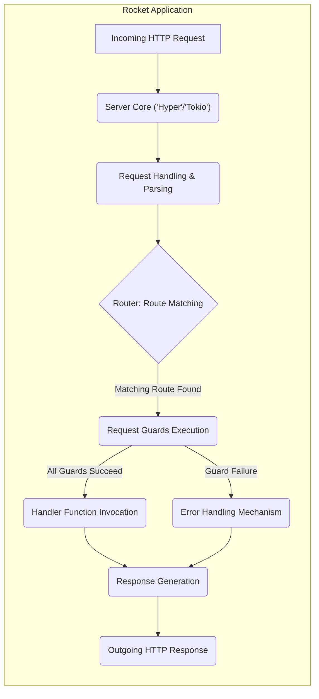
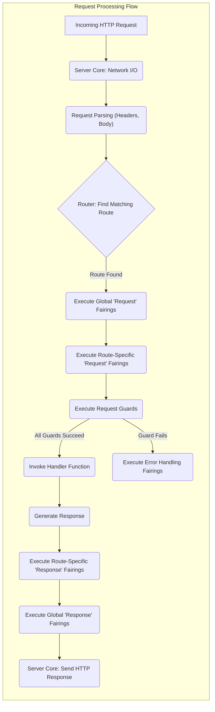

## Project Design Document: Rocket Web Framework

**Version:** 1.1
**Date:** October 26, 2023
**Author:** Gemini (AI Language Model)

### 1. Project Overview

This document provides a detailed design overview of the Rocket web framework, a Rust library specifically designed for building type-safe and efficient web applications. The primary purpose of this document is to serve as a resource for threat modeling, offering a comprehensive understanding of Rocket's architectural components, data flow, and key security considerations. It focuses on the framework's internal structure and mechanisms, rather than the specifics of any particular application built with it.

### 2. Goals and Objectives

* **Developer Productivity:** To offer an expressive and intuitive API that simplifies web application development in Rust, minimizing boilerplate and maximizing developer efficiency.
* **Type Safety and Reliability:** To leverage Rust's strong type system and ownership model to prevent common web application vulnerabilities and ensure high reliability.
* **Performance and Efficiency:** To provide a performant foundation for web applications by utilizing Rust's low-level control and asynchronous capabilities.
* **Secure Foundation:** To incorporate security best practices into the framework's design and provide developers with the tools and abstractions necessary to build secure web applications. This includes features that encourage secure defaults and mitigate common web vulnerabilities.
* **Extensibility and Modularity:** To allow developers to extend and customize the framework through a well-defined and modular architecture, primarily through the use of Fairings.

### 3. Target Audience

This document is primarily intended for:

* Security engineers tasked with performing threat modeling and security assessments of the Rocket framework and applications built upon it.
* Developers actively contributing to the development and maintenance of the Rocket project itself.
* Application developers utilizing the Rocket framework who require a deep understanding of its internal workings for security analysis, debugging, and optimization.

### 4. High-Level Architecture

Rocket employs a layered architecture to manage incoming HTTP requests, route them to appropriate handlers, and generate responses. This design promotes separation of concerns and facilitates maintainability.

**Key aspects of the high-level architecture:**

* **Presentation Layer (Server Core):** This layer is responsible for the underlying HTTP server implementation, typically leveraging the `hyper` crate built on top of the `tokio` asynchronous runtime. It handles network I/O and manages connections.
* **Request Processing Layer:** This layer receives the raw HTTP request and performs initial parsing of headers, body, and other request components.
* **Routing Layer:** The Router component is responsible for matching incoming requests to the appropriate handler function based on the defined routes (HTTP method and path).
* **Authorization/Validation Layer (Request Guards):** Request Guards act as interceptors, allowing for validation, authentication, authorization, and other pre-processing steps before a request reaches the handler.
* **Application Logic Layer (Handlers):** Handler functions contain the core application logic for specific routes. They process the request and generate a response.
* **Response Generation Layer:** This layer constructs the HTTP response, including status codes, headers, and the response body.
* **Error Handling Layer:** This layer manages errors that occur during request processing, providing mechanisms for custom error responses and logging.

### 5. Key Components

This section provides a detailed description of the major components within the Rocket framework, highlighting their functionalities and potential security implications:

* **Server (`rocket::Server`):**
    * **Functionality:** Manages the lifecycle of the HTTP server, listening for incoming connections, and spawning tasks to handle individual requests. It encapsulates the underlying HTTP implementation (`hyper`).
    * **Security Implications:** Configuration of the server (e.g., listening address, TLS settings) directly impacts the application's security posture. Vulnerabilities in the underlying HTTP server implementation could also affect Rocket applications.
* **Request (`rocket::Request`):**
    * **Functionality:** Represents an incoming HTTP request, providing access to request metadata (method, URI, headers, remote address) and the request body. Offers methods for extracting typed data.
    * **Security Implications:**  Improper handling or validation of request data can lead to various vulnerabilities, including injection attacks. The request object is the primary source of potentially malicious user input.
* **Response (`rocket::Response`):**
    * **Functionality:** Represents the outgoing HTTP response, allowing developers to set the status code, headers, and body. Provides mechanisms for setting cookies and other response directives.
    * **Security Implications:**  Incorrectly setting response headers (e.g., missing security headers) can expose applications to attacks. Care must be taken when setting cookies to avoid security issues like session fixation.
* **Router (`rocket::Router`):**
    * **Functionality:** Stores and manages the defined routes for the application. Matches incoming requests to the appropriate handler based on the request method and path. Supports dynamic route segments and route precedence.
    * **Security Implications:**  Incorrectly defined routes or overlapping routes could lead to unintended access or information disclosure.
* **Handlers (Functions annotated with route attributes):**
    * **Functionality:** User-defined functions that implement the application logic for specific routes. They receive extracted request data and return values that are converted into HTTP responses.
    * **Security Implications:** Handlers are where the core application logic resides, making them a primary target for vulnerabilities if not implemented securely.
* **Request Guards (Types implementing `rocket::request::FromRequest`):**
    * **Functionality:**  Components that intercept requests before they reach handlers. They are used to extract and validate data from the request, perform authentication and authorization checks, and more.
    * **Security Implications:**  Crucial for security. Different types of guards include:
        * **Data Extraction Guards:** Extract and potentially validate data from the request (e.g., `Form`, `Json`). Improper validation here can lead to vulnerabilities.
        * **Authentication Guards:** Verify the identity of the user making the request. Weak authentication guards can be bypassed.
        * **Authorization Guards:** Determine if the authenticated user has permission to access the requested resource. Flawed authorization logic can lead to unauthorized access.
        * **Custom Guards:** Developers can create custom guards for specific application needs. Security depends on the implementation of these custom guards.
* **State Management (`rocket::State`):**
    * **Functionality:** Allows sharing data across requests within an application. Managed through the `State` request guard. Commonly used for database connections, configuration, and other shared resources.
    * **Security Implications:**  Sensitive information stored in application state needs to be protected. Improper access control or insecure storage of state can lead to information disclosure.
* **Fairings (`rocket::fairing::Fairing`):**
    * **Functionality:** A powerful mechanism for intercepting and processing requests and responses, similar to middleware. Fairings can be attached globally or to specific routes.
    * **Security Implications:** Fairings can be used for security-related tasks (e.g., logging, security header injection, request modification). However, poorly written or malicious fairings can introduce vulnerabilities or bypass security measures.
* **Configuration (`Rocket.toml` or programmatic configuration):**
    * **Functionality:** Allows configuring various aspects of the Rocket application, including listening address, port, environment, logging level, and TLS settings.
    * **Security Implications:** Incorrect configuration can significantly weaken the application's security (e.g., exposing sensitive information in logs, disabling security features).
* **CORS Support (`rocket::fairing::AdHoc::config`):**
    * **Functionality:** Provides mechanisms for configuring Cross-Origin Resource Sharing (CORS) policies, controlling which origins are allowed to access resources.
    * **Security Implications:**  Misconfigured CORS policies can allow unauthorized access to resources from unintended origins.
* **TLS Support (`config::Config::tls`):**
    * **Functionality:** Enables secure HTTPS connections using TLS. Can be configured to use automatically managed certificates (e.g., Let's Encrypt) or user-provided certificates.
    * **Security Implications:**  Proper TLS configuration is essential for protecting data in transit. Weak TLS configurations or the use of insecure certificates can expose communication to eavesdropping and manipulation.

### 6. Data Flow

The following diagram illustrates the typical data flow for an incoming HTTP request within a Rocket application:

**Detailed breakdown of the data flow:**

1. **Incoming HTTP Request:** The Rocket server receives an HTTP request from a client.
2. **Server Core: Network I/O:** The underlying HTTP server implementation (`hyper`) handles the network connection and reads the raw request data.
3. **Request Parsing (Headers, Body):** Rocket parses the HTTP headers and body content, making the data available to subsequent components.
4. **Router: Find Matching Route:** The Router component attempts to match the request's URI and method to a registered route.
5. **Execute Global 'Request' Fairings:** Globally registered "request" fairings are executed. These can perform actions like logging, request modification, or security checks.
6. **Execute Route-Specific 'Request' Fairings:** "Request" fairings specifically attached to the matched route are executed.
7. **Execute Request Guards:** The request guards associated with the matched route are executed in order. Each guard returns an `Outcome`, indicating success, failure, or forwarding to another route.
8. **Invoke Handler Function:** If all request guards succeed, the corresponding handler function is invoked with the extracted and validated request data.
9. **Guard Fails:** If any request guard fails, the request processing is typically short-circuited, and error handling mechanisms (including error handling fairings) are invoked.
10. **Generate Response:** The handler function returns a value that is converted into an HTTP response by Rocket.
11. **Execute Route-Specific 'Response' Fairings:** "Response" fairings specifically attached to the matched route are executed. These can modify the response before it's sent.
12. **Execute Global 'Response' Fairings:** Globally registered "response" fairings are executed. These can perform actions like adding security headers or logging the response.
13. **Server Core: Send HTTP Response:** The server core sends the generated HTTP response back to the client.

### 7. Security Considerations (Detailed for Threat Modeling)

This section expands on potential security concerns within the Rocket framework, providing more specific examples and areas for deeper investigation during threat modeling:

* **Input Validation and Sanitization:**
    * **Threat:** Injection attacks (SQL injection, XSS, command injection) due to insufficient validation or sanitization of user-provided data in request parameters, headers, and body.
    * **Rocket Mechanisms:** Request Guards (`Form`, `Json`, `Data`) provide mechanisms for extracting and validating data. Developers are responsible for implementing proper validation logic within guards or handlers.
    * **Areas for Investigation:**  How robust are the built-in validation mechanisms? Are there common pitfalls developers might encounter? Are there recommended libraries or patterns for input sanitization within Rocket?
* **Authentication and Authorization:**
    * **Threat:** Unauthorized access to resources or functionalities due to weak or missing authentication and authorization mechanisms.
    * **Rocket Mechanisms:** Request Guards are the primary mechanism for implementing authentication and authorization. Developers can create custom guards to verify user credentials and permissions.
    * **Areas for Investigation:** What are the recommended patterns for implementing authentication (e.g., session-based, token-based) in Rocket? How can authorization logic be effectively implemented and enforced using guards? Are there built-in helpers for common authentication schemes?
* **Session Management:**
    * **Threat:** Session hijacking, session fixation, or other vulnerabilities related to insecure session management.
    * **Rocket Mechanisms:** Rocket itself doesn't provide built-in session management. Developers typically rely on external crates or implement custom solutions using cookies or other mechanisms.
    * **Areas for Investigation:** What are the recommended crates or approaches for secure session management in Rocket applications? How can developers ensure session IDs are generated securely, protected from disclosure, and invalidated properly?
* **Cross-Origin Resource Sharing (CORS):**
    * **Threat:**  Unauthorized access to resources from different origins due to misconfigured CORS policies.
    * **Rocket Mechanisms:** Rocket provides built-in support for configuring CORS policies using Fairings.
    * **Areas for Investigation:** How easy is it for developers to correctly configure CORS policies in Rocket? Are there common misconfigurations that could lead to vulnerabilities?
* **Transport Layer Security (TLS):**
    * **Threat:**  Eavesdropping or manipulation of data in transit due to missing or improperly configured TLS.
    * **Rocket Mechanisms:** Rocket supports configuring TLS for HTTPS connections.
    * **Areas for Investigation:** What are the recommended TLS configuration settings for Rocket applications? How does Rocket handle certificate management? Are there any known vulnerabilities related to Rocket's TLS implementation or dependencies?
* **Error Handling and Information Disclosure:**
    * **Threat:**  Exposure of sensitive information through overly verbose error messages or stack traces.
    * **Rocket Mechanisms:** Rocket provides mechanisms for custom error handling.
    * **Areas for Investigation:** What are the best practices for handling errors in Rocket to prevent information disclosure? How can developers customize error responses based on the environment (development vs. production)?
* **Dependency Management:**
    * **Threat:**  Vulnerabilities introduced through insecure dependencies.
    * **Rocket Mechanisms:** Rocket relies on various Rust crates.
    * **Areas for Investigation:** What is the process for managing and updating dependencies in Rocket? Are there tools or processes in place to identify and address potential vulnerabilities in dependencies?
* **Denial of Service (DoS):**
    * **Threat:**  Resource exhaustion or other attacks that can make the application unavailable.
    * **Rocket Mechanisms:**  Rocket's asynchronous nature helps mitigate some DoS risks.
    * **Areas for Investigation:** Are there specific endpoints or functionalities in Rocket applications that are particularly vulnerable to DoS attacks (e.g., resource-intensive operations without proper rate limiting)? Are there built-in mechanisms or recommended patterns for mitigating DoS attacks?
* **Cross-Site Request Forgery (CSRF):**
    * **Threat:**  Unauthorized actions performed on behalf of a legitimate user.
    * **Rocket Mechanisms:** Rocket doesn't provide built-in CSRF protection. Developers need to implement their own solutions, often using tokens.
    * **Areas for Investigation:** What are the recommended approaches for implementing CSRF protection in Rocket applications? Are there community crates or examples that developers can leverage?
* **Fairing Security:**
    * **Threat:**  Malicious or poorly written fairings introducing vulnerabilities or bypassing security measures.
    * **Rocket Mechanisms:** Fairings have significant power to intercept and modify requests and responses.
    * **Areas for Investigation:** How can the security of custom fairings be ensured? Are there guidelines or best practices for developing secure fairings?

### 8. Deployment Model

Rocket applications are typically deployed as standalone executables. Common deployment patterns include:

* **Directly on a server:** The Rocket executable runs directly on a server, listening on a specified port. This is suitable for simpler deployments or development environments.
* **Behind a reverse proxy:** A reverse proxy (e.g., Nginx, Apache, Caddy) is placed in front of the Rocket application. The reverse proxy handles tasks like TLS termination, load balancing, and request routing, enhancing security and scalability. This is the recommended approach for production deployments.
* **Containerized environments:** Rocket applications can be easily containerized using Docker or similar technologies and deployed within container orchestration platforms like Kubernetes. This provides scalability, isolation, and easier management.

### 9. Technologies Used

* **Rust:** The primary programming language, providing memory safety and performance.
* **Hyper:** A fast and correct HTTP implementation in Rust, serving as the underlying HTTP server.
* **Tokio:** An asynchronous runtime for Rust, enabling efficient handling of concurrent connections.
* **Serde:** A framework for serializing and deserializing Rust data structures, commonly used for handling JSON and other data formats in request and response bodies.
* **Crate Ecosystem:** Rocket leverages a rich ecosystem of Rust crates for various functionalities, including routing, form handling, data validation, and more.

This improved design document provides a more detailed and structured overview of the Rocket web framework, specifically tailored for threat modeling purposes. It highlights key components, data flow, and potential security considerations, offering a solid foundation for security analysis and risk assessment.