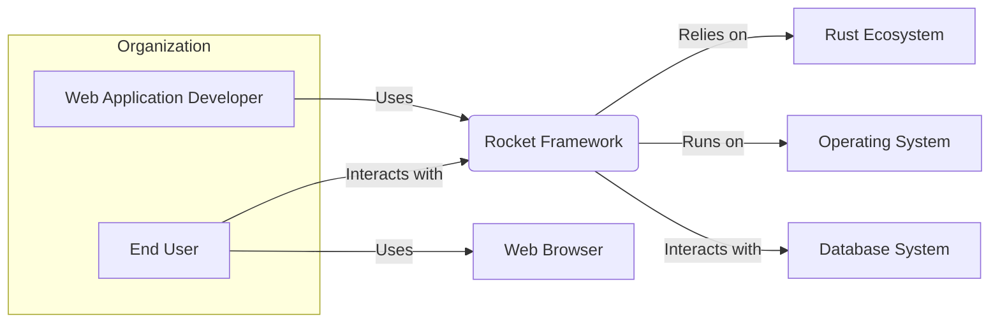
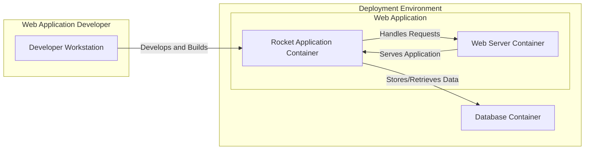
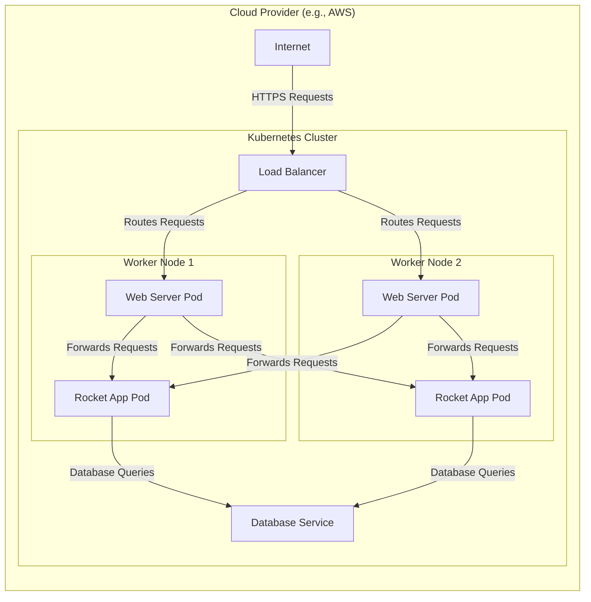
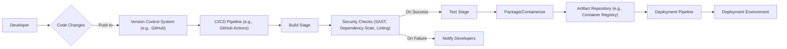

# BUSINESS POSTURE

- Business priorities and goals:
  - Enable developers to build fast, secure, and reliable web applications using Rust.
  - Provide a productive and enjoyable web development experience in Rust, reducing development time and complexity.
  - Promote the adoption of Rust for backend web development by offering a robust and user-friendly framework.
- Most important business risks:
  - Security vulnerabilities in applications built with Rocket framework could damage reputation and lead to data breaches.
  - Performance bottlenecks in Rocket framework could lead to slow applications and poor user experience.
  - Lack of community support or documentation could hinder adoption and developer productivity.
  - Bugs or instability in Rocket framework could lead to application failures and downtime.

# SECURITY POSTURE

- Existing security controls:
  - security control: Rust's memory safety features inherently prevent many common web application vulnerabilities like buffer overflows and use-after-free. Implemented by: Rust compiler and language design.
  - security control: Type system and compile-time checks in Rust reduce the likelihood of type-related errors that can lead to vulnerabilities. Implemented by: Rust compiler.
  - security control: Rocket framework encourages secure coding practices through its design, such as request guards for input validation and type-safe routing. Implemented by: Rocket framework design and API.
  - security control: HTTPS support is easily configurable in Rocket for secure communication. Implemented by: Rocket framework configuration and underlying Rust TLS libraries.
  - security control:  CORS (Cross-Origin Resource Sharing) configuration is available in Rocket to control cross-origin requests. Implemented by: Rocket framework configuration and fairings.
- Accepted risks:
  - accepted risk:  Vulnerabilities in dependencies used by Rocket or applications built with Rocket. Mitigation: Dependency scanning and updates are developer's responsibility.
  - accepted risk:  Developer errors in application code built with Rocket, such as insecure business logic or improper use of Rocket's features. Mitigation: Secure coding training and code reviews are developer's responsibility.
  - accepted risk:  Denial-of-service attacks targeting applications built with Rocket. Mitigation: Rate limiting and infrastructure security are developer's/operator's responsibility.
- Recommended security controls:
  - security control: Implement static application security testing (SAST) tools in the development pipeline to automatically detect potential vulnerabilities in application code.
  - security control: Implement dependency scanning tools to identify and manage vulnerabilities in third-party libraries used by Rocket applications.
  - security control: Conduct regular penetration testing and security audits of applications built with Rocket to identify and remediate security weaknesses.
  - security control: Establish and enforce secure coding guidelines for developers using Rocket framework.
  - security control: Implement runtime application self-protection (RASP) or web application firewall (WAF) for applications built with Rocket to detect and prevent attacks in runtime.
- Security requirements:
  - Authentication:
    - Requirement: Rocket applications should support various authentication mechanisms (e.g., session-based, token-based, OAuth) to verify user identity.
    - Requirement:  Authentication mechanisms should be resistant to common attacks like brute-force and credential stuffing.
  - Authorization:
    - Requirement: Rocket applications should implement fine-grained authorization to control user access to resources and functionalities based on roles and permissions.
    - Requirement: Authorization decisions should be consistently enforced throughout the application.
  - Input validation:
    - Requirement: Rocket applications must validate all user inputs to prevent injection attacks (e.g., SQL injection, cross-site scripting).
    - Requirement: Input validation should be performed on both client-side and server-side. Rocket's request guards can be used for server-side validation.
  - Cryptography:
    - Requirement: Rocket applications should use strong and up-to-date cryptographic algorithms and libraries for sensitive data protection (e.g., password hashing, data encryption in transit and at rest).
    - Requirement:  Proper key management practices should be implemented for cryptographic keys.

# DESIGN

## C4 CONTEXT

- Context Diagram Elements:
  - Element:
    - Name: Web Application Developer
    - Type: Person
    - Description: Developers who use the Rocket framework to build web applications.
    - Responsibilities: Develop, test, deploy, and maintain web applications using Rocket. Ensure secure coding practices and proper framework usage.
    - Security controls: Secure development environment, code review, security training.
  - Element:
    - Name: End User
    - Type: Person
    - Description: Users who interact with web applications built using the Rocket framework through web browsers or other clients.
    - Responsibilities: Use web applications to access information or perform actions.
    - Security controls: Strong passwords, awareness of phishing and social engineering attacks.
  - Element:
    - Name: Rocket Framework
    - Type: Software System
    - Description: A web framework written in Rust, designed for building fast, secure, and reliable web applications.
    - Responsibilities: Provide a foundation for building web applications, handle HTTP requests and responses, routing, request handling, and security features.
    - Security controls: Memory safety through Rust, secure coding practices in framework development, input validation mechanisms (request guards), HTTPS support.
  - Element:
    - Name: Rust Ecosystem
    - Type: Software System
    - Description: The collection of tools, libraries (crates), and community resources that support Rust development, including the Rust compiler (rustc), package manager (Cargo), and crates.io.
    - Responsibilities: Provide necessary tools and libraries for Rocket framework and applications built with it. Ensure security and reliability of core Rust components.
    - Security controls: Security audits of Rust compiler and standard libraries, crate verification on crates.io.
  - Element:
    - Name: Operating System
    - Type: Software System
    - Description: The operating system on which Rocket applications are deployed (e.g., Linux, macOS, Windows).
    - Responsibilities: Provide a runtime environment for Rocket applications, manage system resources, and provide security features at the OS level.
    - Security controls: OS hardening, security patching, access control mechanisms.
  - Element:
    - Name: Database System
    - Type: Software System
    - Description: A database system used by Rocket applications to store and retrieve data (e.g., PostgreSQL, MySQL, SQLite).
    - Responsibilities: Persist application data, ensure data integrity and availability, and provide data access control.
    - Security controls: Database access control, encryption at rest, regular backups, vulnerability patching.
  - Element:
    - Name: Web Browser
    - Type: Software System
    - Description: Web browsers used by end users to access web applications built with Rocket (e.g., Chrome, Firefox, Safari).
    - Responsibilities: Render web pages, execute client-side scripts, and securely communicate with web servers.
    - Security controls: Browser security features (e.g., sandboxing, Content Security Policy), regular updates.

## C4 CONTAINER

- Container Diagram Elements:
  - Element:
    - Name: Developer Workstation
    - Type: Container
    - Description: The development environment used by web application developers, including IDE, Rust toolchain, and development tools.
    - Responsibilities: Code development, building, testing, and debugging Rocket applications.
    - Security controls: Secure workstation configuration, access control, antivirus software, code versioning system.
  - Element:
    - Name: Rocket Application Container
    - Type: Container
    - Description: A containerized instance of the Rocket application code, responsible for handling application logic, routing, and business logic. This container runs the compiled Rust application built with the Rocket framework.
    - Responsibilities: Handle HTTP requests, execute application logic, interact with the database, and generate responses.
    - Security controls: Input validation, authorization checks, secure coding practices, dependency management, regular security updates of base image.
  - Element:
    - Name: Web Server Container
    - Type: Container
    - Description: A containerized web server (e.g., Nginx, Apache) that acts as a reverse proxy, handling incoming HTTP/HTTPS requests, serving static files, and forwarding requests to the Rocket Application Container. It can also handle TLS termination.
    - Responsibilities: Receive and route HTTP requests, serve static content, handle TLS termination, load balancing, and potentially act as a WAF.
    - Security controls: Web server hardening, TLS configuration, access control, rate limiting, WAF rules, regular security updates.
  - Element:
    - Name: Database Container
    - Type: Container
    - Description: A containerized database system (e.g., PostgreSQL, MySQL) used by the Rocket application to persist data.
    - Responsibilities: Store and manage application data, provide data persistence, ensure data integrity and availability.
    - Security controls: Database access control, encryption at rest, regular backups, database hardening, vulnerability patching, network segmentation.

## DEPLOYMENT

- Deployment Architecture Options:
  - Option 1: Cloud-based deployment (AWS, GCP, Azure) using container orchestration (Kubernetes) or serverless functions.
  - Option 2: On-premise deployment on virtual machines or bare-metal servers.
  - Option 3: PaaS (Platform as a Service) deployment.

- Detailed Deployment Architecture (Cloud-based using Kubernetes):

- Deployment Diagram Elements:
  - Element:
    - Name: Internet
    - Type: Environment
    - Description: The public internet from which end users access the web application.
    - Responsibilities: Provide network connectivity for users to access the application.
    - Security controls:  External firewall, DDoS protection at the cloud provider level.
  - Element:
    - Name: Load Balancer
    - Type: Infrastructure
    - Description: A cloud load balancer that distributes incoming HTTPS requests across multiple Web Server Pods for high availability and scalability. It also handles TLS termination.
    - Responsibilities: Load balancing, TLS termination, health checks, traffic routing.
    - Security controls: TLS configuration, access control lists, DDoS protection, security monitoring.
  - Element:
    - Name: Web Server Pod
    - Type: Container Instance
    - Description: Instances of the Web Server Container running as pods in the Kubernetes cluster.
    - Responsibilities: Receive requests from the load balancer, serve static content, forward requests to Rocket App Pods.
    - Security controls: Container security hardening, network policies, resource limits, regular security updates.
  - Element:
    - Name: Rocket App Pod
    - Type: Container Instance
    - Description: Instances of the Rocket Application Container running as pods in the Kubernetes cluster.
    - Responsibilities: Handle application logic, process requests, interact with the database.
    - Security controls: Container security hardening, network policies, resource limits, regular security updates, application-level security controls.
  - Element:
    - Name: Database Service
    - Type: Managed Service
    - Description: A managed database service provided by the cloud provider (e.g., AWS RDS, GCP Cloud SQL) for high availability, scalability, and managed backups.
    - Responsibilities: Data persistence, database management, backups, high availability.
    - Security controls: Database access control, encryption at rest and in transit, regular backups, security monitoring, vulnerability patching managed by cloud provider.
  - Element:
    - Name: Kubernetes Cluster
    - Type: Infrastructure
    - Description: A Kubernetes cluster managed by the cloud provider, providing container orchestration and management.
    - Responsibilities: Container orchestration, scaling, health monitoring, resource management.
    - Security controls: Kubernetes security configurations, RBAC (Role-Based Access Control), network policies, security audits, regular updates.

## BUILD

- Build Process Description:
  - Developer makes code changes and pushes them to a Version Control System (e.g., GitHub).
  - A CI/CD pipeline (e.g., GitHub Actions) is triggered upon code changes.
  - Build Stage: The pipeline starts with a build stage where the Rust code is compiled using `cargo build`.
  - Security Checks: Automated security checks are performed, including:
    - Static Application Security Testing (SAST) to analyze source code for potential vulnerabilities.
    - Dependency scanning to identify vulnerabilities in third-party crates.
    - Code linting to enforce coding standards and identify potential code quality issues.
  - Test Stage: If security checks pass, the pipeline proceeds to the test stage where unit tests and integration tests are executed.
  - Package/Containerize: If tests pass, the application is packaged into deployable artifacts, such as container images (using Docker).
  - Artifact Repository: The build artifacts (e.g., container images) are pushed to an artifact repository (e.g., Container Registry).
  - Deployment Pipeline: The deployment pipeline is triggered, taking the artifacts from the repository and deploying them to the target Deployment Environment (e.g., Kubernetes cluster).
  - Notifications: Developers are notified of build failures, security vulnerabilities, or deployment issues.

- Build Diagram Elements:
  - Element:
    - Name: Developer
    - Type: Person
    - Description: Software developer writing and modifying the code.
    - Responsibilities: Writing secure code, committing code changes, and addressing build/security issues.
    - Security controls: Secure coding practices, code review, access control to development environment.
  - Element:
    - Name: Version Control System (e.g., GitHub)
    - Type: Software System
    - Description: A system for tracking and managing changes to the codebase.
    - Responsibilities: Source code management, version control, collaboration, and triggering CI/CD pipelines.
    - Security controls: Access control, branch protection, audit logs, secure communication (HTTPS, SSH).
  - Element:
    - Name: CI/CD Pipeline (e.g., GitHub Actions)
    - Type: Software System
    - Description: An automated pipeline for building, testing, and deploying the application.
    - Responsibilities: Automating build, test, security checks, and deployment processes. Enforcing security gates in the pipeline.
    - Security controls: Secure pipeline configuration, access control, secret management, audit logs.
  - Element:
    - Name: Build Stage
    - Type: Pipeline Stage
    - Description: Stage in the CI/CD pipeline where the Rust code is compiled.
    - Responsibilities: Compiling the code, producing build artifacts.
    - Security controls: Secure build environment, dependency management, build process isolation.
  - Element:
    - Name: Security Checks (SAST, Dependency Scan, Linting)
    - Type: Pipeline Stage
    - Description: Stage in the CI/CD pipeline where automated security checks are performed.
    - Responsibilities: Identifying potential security vulnerabilities and code quality issues.
    - Security controls: SAST tools, dependency scanning tools, linters, vulnerability reporting.
  - Element:
    - Name: Test Stage
    - Type: Pipeline Stage
    - Description: Stage in the CI/CD pipeline where automated tests are executed.
    - Responsibilities: Running unit tests, integration tests, and ensuring code quality.
    - Security controls: Test environment isolation, secure test data management.
  - Element:
    - Name: Package/Containerize
    - Type: Pipeline Stage
    - Description: Stage in the CI/CD pipeline where the application is packaged into deployable artifacts (e.g., container images).
    - Responsibilities: Creating deployable artifacts.
    - Security controls: Secure artifact creation process, image scanning for vulnerabilities.
  - Element:
    - Name: Artifact Repository (e.g., Container Registry)
    - Type: Software System
    - Description: A repository for storing and managing build artifacts (e.g., container images).
    - Responsibilities: Storing and distributing build artifacts.
    - Security controls: Access control, image signing, vulnerability scanning, audit logs.
  - Element:
    - Name: Deployment Pipeline
    - Type: Pipeline Stage
    - Description: Stage in the CI/CD pipeline that deploys the application to the target environment.
    - Responsibilities: Deploying the application to the target environment.
    - Security controls: Secure deployment process, infrastructure as code, deployment environment access control.
  - Element:
    - Name: Deployment Environment
    - Type: Environment
    - Description: The target environment where the application is deployed (e.g., Kubernetes cluster).
    - Responsibilities: Running the deployed application.
    - Security controls: Infrastructure security, runtime security controls, monitoring and logging.

# RISK ASSESSMENT

- Critical business processes:
  - Handling user requests and serving web pages.
  - Processing user data and interactions.
  - Authenticating and authorizing users.
  - Accessing and managing data in the database.
- Data sensitivity:
  - Potentially sensitive user data (depending on the application built with Rocket). This could include:
    - User credentials (passwords, API keys). Sensitivity: High.
    - Personal Identifiable Information (PII) like names, email addresses, addresses. Sensitivity: Medium to High.
    - Application data, which could be business-critical or confidential. Sensitivity: Varies depending on the application.

# QUESTIONS & ASSUMPTIONS

- Questions:
  - What type of web applications are being built with Rocket framework in the target organization? (e.g., public facing websites, internal applications, APIs).
  - What are the specific compliance requirements for applications built with Rocket (e.g., GDPR, HIPAA, PCI DSS)?
  - What is the organization's risk appetite regarding security vulnerabilities in web applications?
  - What existing security infrastructure and tools are already in place in the organization?
  - What is the expected scale and performance requirements for applications built with Rocket?

- Assumptions:
  - Applications built with Rocket will handle potentially sensitive user data.
  - Security is a high priority for applications built with Rocket.
  - The organization has a need for secure and scalable web applications.
  - Standard web application security best practices are applicable to applications built with Rocket.
  - The deployment environment is a cloud-based Kubernetes cluster for the detailed deployment architecture.