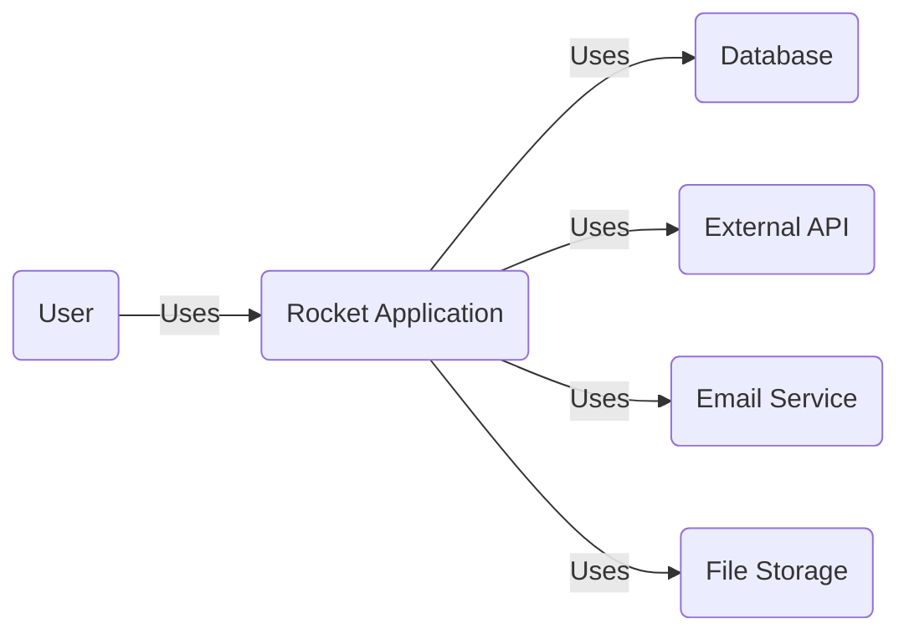
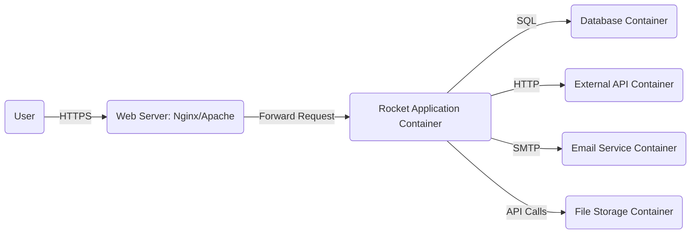
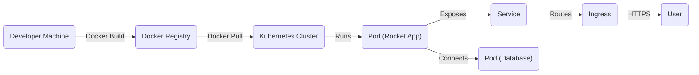
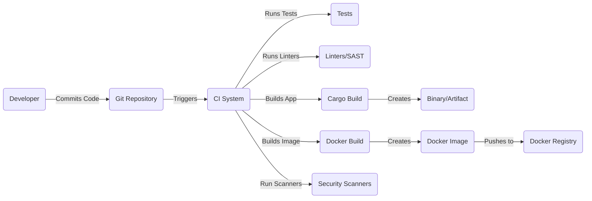

Okay, let's create a design document for the Rocket web framework (https://github.com/sergiobenitez/rocket).

# BUSINESS POSTURE

Rocket is a web framework for Rust that aims to be fast, easy to use, and secure. It prioritizes developer productivity and application performance.  Given that it's an open-source project, the business context is slightly different than a commercial product.  The "business" here is the community of users and contributors.

Priorities:

*   Provide a robust and reliable web framework.
*   Maintain high performance and efficiency.
*   Ensure ease of use and developer productivity.
*   Foster a strong and active community.
*   Maintain a high level of security.

Goals:

*   Attract and retain users and contributors.
*   Become a leading web framework in the Rust ecosystem.
*   Provide a secure platform for building web applications.
*   Continuously improve and evolve the framework.

Business Risks:

*   Loss of community interest and contribution, leading to stagnation.
*   Security vulnerabilities that could damage the reputation and trustworthiness of the framework.
*   Inability to keep up with the evolving Rust ecosystem and web development best practices.
*   Competition from other Rust web frameworks.
*   Lack of sufficient documentation and support, hindering adoption.

# SECURITY POSTURE

Rocket incorporates several security features by default and encourages secure coding practices. However, as a framework, the ultimate security of an application built with Rocket depends significantly on how it's used by developers.

Existing Security Controls:

*   security control: Type-safe request handling: Rust's strong type system and ownership model, leveraged by Rocket, prevent many common web vulnerabilities like null pointer dereferences, buffer overflows, and data races. Implemented in the core framework design.
*   security control: Built-in CSRF protection: Rocket provides mechanisms for generating and validating CSRF tokens. Described in the Rocket documentation and examples.
*   security control: Request guards: These allow developers to enforce authentication and authorization policies before a request handler is executed. Described in the Rocket documentation.
*   security control: Managed state: Rocket's managed state feature provides a safe and controlled way to share data between request handlers, reducing the risk of race conditions and data corruption. Described in the Rocket documentation.
*   security control: Templating engine (optional): Rocket supports templating engines like Tera and Handlebars, which can help prevent cross-site scripting (XSS) vulnerabilities when used correctly. Described in the Rocket documentation and examples.
*   security control: Form handling: Rocket provides built-in support for parsing and validating form data, reducing the risk of injection vulnerabilities. Described in the Rocket documentation.
*   security control: Cookie management: Rocket offers secure cookie handling, including options for setting HttpOnly and Secure flags. Described in the Rocket documentation.

Accepted Risks:

*   accepted risk: Security vulnerabilities in third-party dependencies: While Rocket itself may be secure, vulnerabilities in dependencies could compromise applications built with it. This is a common risk in software development.
*   accepted risk: Misconfiguration by developers: Rocket provides secure defaults, but developers can still misconfigure the framework or introduce vulnerabilities in their application code.
*   accepted risk: Emerging threats: New types of attacks and vulnerabilities are constantly being discovered. Rocket, like any software, may be vulnerable to unknown threats.

Recommended Security Controls:

*   security control: Integrate a robust logging and monitoring system. This is crucial for detecting and responding to security incidents.
*   security control: Implement a Content Security Policy (CSP). This helps mitigate XSS and other code injection attacks.
*   security control: Regularly update dependencies to patch known vulnerabilities. Use tools like `cargo audit` or Dependabot.
*   security control: Conduct regular security audits and penetration testing of applications built with Rocket.

Security Requirements:

*   Authentication:
    *   Applications should use secure authentication mechanisms, such as JWT or session-based authentication.
    *   Password storage must use strong, one-way hashing algorithms (e.g., Argon2, bcrypt).
    *   Implement robust account recovery mechanisms.
    *   Consider multi-factor authentication (MFA) for sensitive applications.

*   Authorization:
    *   Implement role-based access control (RBAC) or attribute-based access control (ABAC) to restrict access to resources.
    *   Enforce the principle of least privilege.

*   Input Validation:
    *   Validate all user inputs on the server-side.
    *   Use whitelisting (allowlisting) whenever possible, rather than blacklisting (denylisting).
    *   Sanitize data to prevent injection attacks (e.g., SQL injection, command injection).

*   Cryptography:
    *   Use strong, industry-standard cryptographic algorithms and libraries.
    *   Store sensitive data (e.g., API keys, secrets) securely.
    *   Use HTTPS for all communication.
    *   Properly manage cryptographic keys.

# DESIGN

## C4 CONTEXT

Element Descriptions:

*   1.  Name: User
    2.  Type: Person
    3.  Description: A user interacting with the Rocket application through a web browser or other client.
    4.  Responsibilities: Accessing and interacting with the application's features.
    5.  Security controls: Browser security features, network security.

*   1.  Name: Rocket Application
    2.  Type: Software System
    3.  Description: The web application built using the Rocket framework.
    4.  Responsibilities: Handling user requests, processing data, interacting with other systems.
    5.  Security controls: Type-safe request handling, CSRF protection, request guards, managed state, secure cookie handling, input validation, output encoding.

*   1.  Name: Database
    2.  Type: Software System
    3.  Description: A database system used to store application data.
    4.  Responsibilities: Storing and retrieving data.
    5.  Security controls: Access controls, encryption at rest, encryption in transit, auditing.

*   1.  Name: External API
    2.  Type: Software System
    3.  Description: An external API used by the Rocket application.
    4.  Responsibilities: Providing specific functionality or data.
    5.  Security controls: API keys, authentication, authorization, rate limiting, input validation.

*   1.  Name: Email Service
    2.  Type: Software System
    3.  Description: A service used for sending emails.
    4.  Responsibilities: Sending transactional and notification emails.
    5.  Security controls: API keys, authentication, encryption in transit.

*   1.  Name: File Storage
    2.  Type: Software System
    3.  Description: A service or system used for storing files.
    4.  Responsibilities: Storing and retrieving files.
    5.  Security controls: Access controls, encryption at rest, encryption in transit.

## C4 CONTAINER

Element Descriptions:

*   1.  Name: User
    2.  Type: Person
    3.  Description: A user interacting with the Rocket application.
    4.  Responsibilities: Accessing and interacting with the application.
    5.  Security controls: Browser security features.

*   1.  Name: Web Server
    2.  Type: Container
    3.  Description: A web server (e.g., Nginx, Apache) that acts as a reverse proxy for the Rocket application.
    4.  Responsibilities: Handling TLS termination, serving static assets, forwarding requests to the Rocket application.
    5.  Security controls: TLS configuration, access controls, request filtering.

*   1.  Name: Rocket Application Container
    2.  Type: Container
    3.  Description: The container running the Rocket application code.
    4.  Responsibilities: Handling user requests, processing data, interacting with other containers.
    5.  Security controls: All security controls listed in the "Security Posture" section.

*   1.  Name: Database Container
    2.  Type: Container
    3.  Description: The container running the database system.
    4.  Responsibilities: Storing and retrieving data.
    5.  Security controls: Access controls, encryption at rest, encryption in transit, auditing.

*   1.  Name: External API Container
    2.  Type: Container
    3.  Description: The container hosting the external API.
    4.  Responsibilities: Providing specific functionality or data.
    5.  Security controls: API keys, authentication, authorization, rate limiting, input validation.

*   1.  Name: Email Service Container
    2.  Type: Container
    3.  Description: The container for the email service.
    4.  Responsibilities: Sending emails.
    5.  Security controls: API keys, authentication, encryption in transit.

*   1.  Name: File Storage Container
    2.  Type: Container
    3.  Description: The container for file storage.
    4.  Responsibilities: Storing and retrieving files.
    5.  Security controls: Access controls, encryption at rest, encryption in transit.

## DEPLOYMENT

Rocket applications can be deployed in various ways, including:

1.  Traditional Server Deployment: Deploying directly to a virtual machine or bare-metal server.
2.  Containerized Deployment (Docker): Packaging the application and its dependencies into a Docker container.
3.  Serverless Deployment (AWS Lambda, etc.): Deploying individual Rocket handlers as serverless functions.
4.  Platform-as-a-Service (PaaS) (Heroku, etc.): Using a PaaS provider to manage the deployment and scaling.

We'll describe the containerized deployment using Docker and Kubernetes:

Element Descriptions:

*   1.  Name: Developer Machine
    2.  Type: Infrastructure Node
    3.  Description: The developer's local machine used for development and building the application.
    4.  Responsibilities: Code development, building Docker images.
    5.  Security controls: Local security measures, code signing.

*   1.  Name: Docker Registry
    2.  Type: Infrastructure Node
    3.  Description: A registry for storing Docker images (e.g., Docker Hub, AWS ECR).
    4.  Responsibilities: Storing and distributing Docker images.
    5.  Security controls: Access controls, image scanning.

*   1.  Name: Kubernetes Cluster
    2.  Type: Infrastructure Node
    3.  Description: A Kubernetes cluster for orchestrating containers.
    4.  Responsibilities: Managing the deployment, scaling, and networking of containers.
    5.  Security controls: RBAC, network policies, pod security policies.

*   1.  Name: Pod (Rocket App)
    2.  Type: Infrastructure Node
    3.  Description: A Kubernetes pod running the Rocket application container.
    4.  Responsibilities: Running the application code.
    5.  Security controls: All application-level security controls.

*   1.  Name: Service
    2.  Type: Infrastructure Node
    3.  Description: A Kubernetes service that provides a stable endpoint for accessing the Rocket application.
    4.  Responsibilities: Load balancing and service discovery.
    5.  Security controls: Network policies.

*   1.  Name: Ingress
    2.  Type: Infrastructure Node
    3.  Description: A Kubernetes ingress controller that manages external access to the service.
    4.  Responsibilities: Routing external traffic to the service.
    5.  Security controls: TLS termination, access controls.

*   1.  Name: User
    2.  Type: Person
    3.  Description: A user accessing the application.
    4.  Responsibilities: Interacting with the application.
    5.  Security controls: Browser security features.

*   1.  Name: Pod (Database)
    2.  Type: Infrastructure Node
    3.  Description: Pod running database.
    4.  Responsibilities: Storing application data.
    5.  Security controls: Database security controls.

## BUILD

The build process for a Rocket application typically involves the following steps:

1.  Developer writes code on their local machine.
2.  Code is committed to a version control system (e.g., Git).
3.  A Continuous Integration (CI) system (e.g., GitHub Actions, Jenkins, CircleCI) is triggered.
4.  The CI system checks out the code.
5.  The CI system runs tests (unit tests, integration tests).
6.  The CI system runs linters and static analysis tools (e.g., Clippy).
7.  The CI system builds the Rocket application using `cargo build --release`.
8.  (Optional) The CI system builds a Docker image containing the compiled application.
9.  (Optional) The CI system pushes the Docker image to a container registry.
10. (Optional) Security scanners are run against the built artifact (e.g. container image).

Security Controls in the Build Process:

*   security control: Use of a CI system to automate the build and testing process.
*   security control: Running unit and integration tests to catch bugs early.
*   security control: Using linters (e.g., Clippy) to enforce code style and identify potential issues.
*   security control: Using static analysis tools to detect potential security vulnerabilities.
*   security control: Building a release version of the application (`cargo build --release`) to optimize for performance and security.
*   security control: (Optional) Building a Docker image to create a consistent and isolated runtime environment.
*   security control: (Optional) Pushing the Docker image to a secure container registry.
*   security control: (Optional) Using image scanning tools to identify vulnerabilities in the Docker image.
*   security control: (Optional) Using Software Bill of Materials (SBOM) tools to track dependencies.
*   security control: (Optional) Using tools like `cargo audit` to check for vulnerabilities in dependencies.

# RISK ASSESSMENT

Critical Business Processes:

*   User authentication and authorization.
*   Data storage and retrieval.
*   Interaction with external services (if applicable).
*   Serving web content.
*   Maintaining the availability and performance of the application.

Data to Protect:

*   User data (e.g., usernames, passwords, email addresses, personal information). Sensitivity: High.
*   Application data (e.g., data stored in the database). Sensitivity: Depends on the specific application.
*   Session data. Sensitivity: High.
*   API keys and secrets. Sensitivity: High.
*   Configuration data. Sensitivity: Medium to High.

# QUESTIONS & ASSUMPTIONS

Questions:

*   What specific external services will Rocket applications typically interact with?
*   What are the most common deployment scenarios for Rocket applications?
*   What level of security auditing and penetration testing is performed on the Rocket framework itself?
*   Are there any specific compliance requirements (e.g., GDPR, HIPAA) that need to be considered for applications built with Rocket?
*   What is the expected traffic volume and scaling requirements for typical Rocket applications?

Assumptions:

*   BUSINESS POSTURE: The primary goal is to provide a secure and reliable web framework, even at the potential cost of some developer convenience.
*   SECURITY POSTURE: Developers using Rocket are expected to have a basic understanding of web security principles.
*   DESIGN: Rocket applications will often be deployed in containerized environments.  A database will often be used.