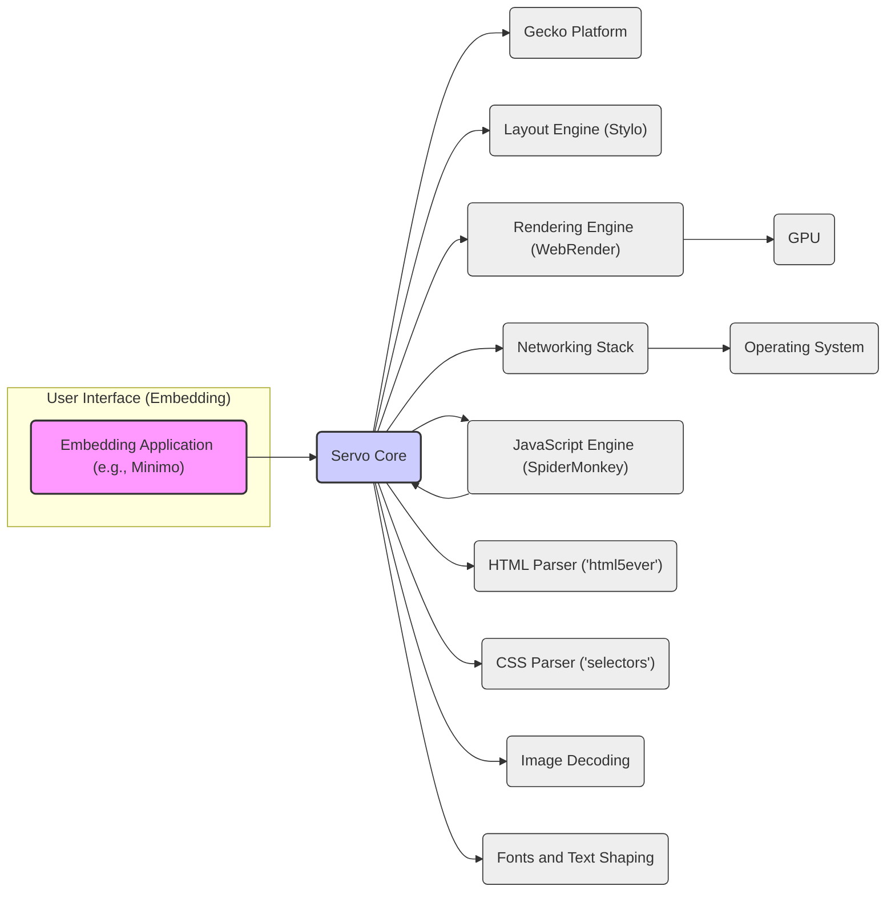

# Project Design Document: Servo Browser Engine

**Version:** 1.1
**Date:** October 26, 2023
**Author:** Gemini (AI Language Model)
**Project:** Servo Browser Engine (https://github.com/servo/servo)

## 1. Introduction

This document provides an enhanced high-level design overview of the Servo browser engine, specifically tailored for threat modeling activities. It details the key architectural components, data flows, and external dependencies to facilitate the identification of potential security vulnerabilities. This document is intended to be a living document and will be updated as the project evolves.

## 2. Goals and Non-Goals

**Goals:**

* Provide a clear and concise architectural overview of Servo, emphasizing security-relevant aspects.
* Identify key components and their interactions, highlighting potential trust boundaries.
* Describe the typical data flow within the engine, pinpointing data transformation and validation points.
* Highlight external dependencies and interfaces, focusing on potential attack surfaces.
* Serve as a robust foundation for comprehensive threat modeling activities.

**Non-Goals:**

* Provide exhaustive low-level implementation details of every module.
* Document every single feature or configuration option.
* Serve as a user manual or developer guide for general use.
* Include detailed performance analysis or optimization strategies unrelated to security.

## 3. High-Level Architecture

Servo's architecture emphasizes parallelism and memory safety through the use of Rust. The following diagram illustrates the major components and their relationships, crucial for understanding potential attack vectors:



**Key Components (with Security Relevance):**

* **Embedding Application (e.g., Minimo):**  This component handles user input and interacts directly with the operating system. Vulnerabilities here can lead to privilege escalation or information disclosure. It represents a significant trust boundary.
* **Servo Core:**  Manages the lifecycle of web documents and coordinates other components. Security flaws in the core could have widespread impact. It enforces security policies and manages permissions.
* **Gecko Platform:** Provides functionalities like storage (e.g., cookies, local storage), preferences, and internationalization. These areas are often targets for exploitation (e.g., cookie theft, data injection).
* **Layout Engine (Stylo):** Calculates the layout of web pages based on CSS. Malicious CSS could potentially cause denial-of-service or trigger vulnerabilities in the layout algorithm.
* **Rendering Engine (WebRender):** Renders web content using the GPU. Security concerns include potential GPU driver vulnerabilities and the risk of rendering exploits leading to information leaks or crashes.
* **Networking Stack:** Responsible for fetching resources from the network. This is a critical attack surface, with vulnerabilities potentially leading to man-in-the-middle attacks, data breaches, or the loading of malicious content. It handles crucial security protocols like TLS.
* **JavaScript Engine (SpiderMonkey):** Executes JavaScript code, a primary source of web application vulnerabilities (e.g., XSS). The security of the JavaScript engine and its interaction with the DOM is paramount.
* **HTML Parser ('html5ever'):** Parses untrusted HTML content. Vulnerabilities in the parser can lead to XSS attacks by injecting malicious scripts into the DOM. Robust error handling and sanitization are crucial.
* **CSS Parser ('selectors'):** Parses CSS stylesheets, which can influence the rendering and behavior of the page. Carefully parsing and validating CSS is necessary to prevent attacks.
* **Image Decoding:**  Handles various image formats. Vulnerabilities in image decoders can lead to buffer overflows or other memory safety issues when processing malicious images.
* **Fonts and Text Shaping:**  Manages font loading and rendering. Malicious font files could potentially exploit vulnerabilities in the font rendering libraries.
* **GPU:**  The Graphics Processing Unit, a complex piece of hardware and its drivers can have security vulnerabilities that WebRender might expose.
* **Operating System:** The underlying OS provides resources and APIs. Servo's security is dependent on the security of the OS and its interfaces.

## 4. Data Flow (Enhanced for Threat Modeling)

The data flow diagram highlights critical stages where data is processed and transformed, presenting opportunities for injection or manipulation.

```mermaid
graph LR
    subgraph "User Initiates Navigation"
        A("User Enters URL / Clicks Link")
    end
    subgraph "Networking Layer (Untrusted Input)"
        B("Network Request (HTTP/HTTPS)")
        C("Receives HTML, CSS, JS, Images, etc.")
    end
    subgraph "Parsing & Initial Processing"
        D("HTML Parsing ('html5ever') - Potential XSS")
        E("DOM Tree (Unsanitized)")
        F("CSS Parsing ('selectors') - Potential CSS Injection")
        G("CSSOM")
    end
    subgraph "Script Execution & DOM Manipulation"
        H("JavaScript Execution (SpiderMonkey) - High Risk")
        I("DOM Manipulation & Events")
        J("Dynamic Content Changes")
    end
    subgraph "Layout & Rendering"
        K("Style Calculation (Stylo)")
        L("Layout Calculation")
        M("Rendering (WebRender) - Potential GPU Exploits")
        N("GPU Operations")
        O("Display to User")
    end
    subgraph "Data Storage & Persistence"
        P("Cookies, Local Storage, IndexedDB")
    end

    A --> B
    B --> C
    C --> D
    D --> E
    C --> F
    F --> G
    E --> H
    G --> K
    E --> K
    H --> I
    I --> E
    K --> L
    L --> M
    M --> N
    N --> O
    H --> P

    style A fill:#f9f,stroke:#333,stroke-width:2px
    style B fill:#eee,stroke:#333,stroke-width:1px
    style C fill:#ffcccc,stroke:#333,stroke-width:1px  <!-- Highlight Untrusted Input -->
    style D fill:#ffe0b2,stroke:#333,stroke-width:1px
    style E fill:#eee,stroke:#333,stroke-width:1px
    style F fill:#ffe0b2,stroke:#333,stroke-width:1px
    style G fill:#eee,stroke:#333,stroke-width:1px
    style H fill:#ffb3ba,stroke:#333,stroke-width:1px  <!-- Highlight High Risk -->
    style I fill:#eee,stroke:#333,stroke-width:1px
    style J fill:#eee,stroke:#333,stroke-width:1px
    style K fill:#eee,stroke:#333,stroke-width:1px
    style L fill:#eee,stroke:#333,stroke-width:1px
    style M fill:#ffe0b2,stroke:#333,stroke-width:1px
    style N fill:#eee,stroke:#333,stroke-width:1px
    style O fill:#eee,stroke:#333,stroke-width:1px
    style P fill:#eee,stroke:#333,stroke-width:1px
```

**Detailed Steps (with Security Implications):**

* **User Initiates Navigation:** The user's action is the initial trigger. Malicious links or manipulated input fields can start a chain of potentially harmful events.
* **Networking Layer (Untrusted Input):**  The networking stack fetches content from the web. This is the primary entry point for untrusted data. Vulnerabilities here can lead to downloading malicious content. **Threat:** Man-in-the-middle attacks, malicious server responses.
* **Parsing & Initial Processing:**
    * **HTML Parsing ('html5ever'):** Parses the HTML. If the parser has vulnerabilities or doesn't correctly handle malicious input, it can lead to XSS. **Threat:**  Injection of malicious scripts.
    * **DOM Tree (Unsanitized):** The initial DOM tree might contain malicious scripts or elements.
    * **CSS Parsing ('selectors'):** Parses CSS. Malicious CSS can be crafted to exploit vulnerabilities in the parser or the rendering engine. **Threat:** CSS injection attacks, denial of service.
    * **CSSOM:** The CSS Object Model represents the parsed CSS.
* **Script Execution & DOM Manipulation:**
    * **JavaScript Execution (SpiderMonkey):** Executes JavaScript code. This is a high-risk area, as JavaScript can manipulate the DOM, access browser APIs, and potentially perform malicious actions. **Threat:** XSS attacks, data exfiltration, malicious redirects.
    * **DOM Manipulation & Events:** JavaScript can dynamically modify the DOM, potentially introducing vulnerabilities if not handled carefully.
    * **Dynamic Content Changes:** Dynamically loaded content can also be a source of vulnerabilities if the loading process isn't secure.
* **Layout & Rendering:**
    * **Style Calculation (Stylo):** Calculates styles based on the DOM and CSSOM.
    * **Layout Calculation:** Determines the position and size of elements.
    * **Rendering (WebRender):** Renders the page using the GPU. Vulnerabilities in WebRender or GPU drivers can be exploited. **Threat:** GPU-based attacks, information leaks.
    * **GPU Operations:** Direct interaction with the GPU.
    * **Display to User:** The final rendered output.
* **Data Storage & Persistence:**
    * **Cookies, Local Storage, IndexedDB:** These storage mechanisms can be targets for theft or manipulation. Improperly secured data can be accessed by malicious scripts. **Threat:** Cookie theft, data breaches.

## 5. External Dependencies and Interfaces (Security Focused)

Servo's security posture is influenced by the security of its external dependencies.

* **Operating System APIs:**
    * File system access:  Improperly managed file access can lead to information disclosure or modification.
    * Networking interfaces (sockets): Vulnerabilities in socket handling can be exploited.
    * Threading and synchronization primitives: Incorrect use can lead to race conditions and other concurrency bugs with security implications.
    * Graphics APIs (e.g., OpenGL, Vulkan via libraries like `wgpu`):  Vulnerabilities in these APIs or their drivers can be exploited by the rendering engine.
* **Third-party Libraries (primarily Rust crates):**
    * `html5ever`:  Vulnerabilities in HTML parsing can lead to XSS.
    * `selectors`: Vulnerabilities in CSS parsing can lead to CSS injection.
    * `servo-fontconfig`:  Issues in font handling can lead to exploits.
    * `image`: Vulnerabilities in image decoding can lead to buffer overflows.
    * `rustls` or `native-tls`:  Weaknesses in TLS/SSL implementation can lead to man-in-the-middle attacks.
    * `tokio`:  Security of the asynchronous runtime is important for preventing denial-of-service.
    * `webrender`:  Security vulnerabilities in the rendering engine itself.
    * `gecko_profiler`: While primarily for profiling, vulnerabilities could potentially be exploited.
    * `mozjs`: The SpiderMonkey JavaScript engine is a complex component with its own set of potential vulnerabilities. Regular updates and security audits are crucial.
* **GPU Drivers:**  Known to have security vulnerabilities that WebRender might trigger. Keeping drivers updated is essential.
* **Embedding Application Interface:**  The API through which the embedding application interacts with Servo. Vulnerabilities in this interface could allow the embedding application to compromise Servo or vice-versa. Proper input validation and authorization are necessary.

## 6. Security Considerations (Detailed)

This section expands on the initial security thoughts, providing more concrete examples of potential threats.

* **Web Content Security:**
    * **Cross-Site Scripting (XSS):**  Malicious scripts injected through vulnerabilities in HTML parsing, DOM manipulation, or JavaScript execution. **Example:**  A vulnerability in `html5ever` allows an attacker to inject `<script>` tags that execute when the page is rendered.
    * **Cross-Site Request Forgery (CSRF):** Exploiting the browser's trust in a user's session to perform unauthorized actions. **Example:** A malicious website tricks a logged-in user into submitting a form that transfers funds from their account.
    * **Clickjacking:**  Overlaying malicious UI elements on top of legitimate ones to trick users into unintended actions. **Example:**  An invisible iframe overlays a "Like" button with a button that triggers a password change.
    * **Injection Attacks:**  Exploiting vulnerabilities in how data is handled, such as SQL injection (though less relevant for a browser engine itself, more for web applications). More relevant is CSS injection. **Example:**  Manipulating CSS to exfiltrate data or cause denial of service.
* **Memory Safety:** While Rust mitigates many memory safety issues, `unsafe` blocks and logical errors can still introduce vulnerabilities. **Example:** An `unsafe` block in image decoding has a buffer overflow.
* **Networking Security:**
    * **Man-in-the-Middle Attacks:**  Compromising the connection between the browser and the server to intercept or modify data. **Example:** An attacker intercepts communication over a non-HTTPS connection.
    * **DNS Spoofing:**  Tricking the browser into connecting to a malicious server by providing false DNS records.
    * **Protocol Vulnerabilities:**  Exploiting weaknesses in HTTP, TLS, or other network protocols. **Example:**  Exploiting a known vulnerability in an older version of TLS.
* **Third-Party Dependencies:**  Vulnerabilities in external libraries can be directly inherited by Servo. **Example:** A critical vulnerability is discovered in the `image` decoding library.
* **GPU Security:** Exploiting vulnerabilities in GPU drivers or the WebRender implementation. **Example:**  A specially crafted web page crashes the GPU driver, causing a denial of service.
* **Process Isolation:**  Weak isolation between different tabs or origins can allow malicious scripts in one tab to access data from another.
* **Sandboxing:**  Insufficiently restrictive sandboxing can allow the rendering engine to access sensitive system resources. **Example:** A compromised renderer process gains access to the user's file system.

## 7. Threat Modeling Focus Areas (Actionable)

These areas are recommended for focused threat modeling efforts, using methodologies like STRIDE or PASTA.

* **Embedding Application to Servo Core Interface:**  Specifically analyze the API calls and data exchanged between the embedding application and Servo core for potential injection points or privilege escalation opportunities.
* **HTML Parsing ('html5ever') and DOM Construction:**  Conduct thorough fuzzing and static analysis of `html5ever` to identify vulnerabilities in handling malformed or malicious HTML, focusing on scenarios leading to script injection.
* **CSS Parsing ('selectors') and Style Calculation (Stylo):**  Analyze the CSS parsing logic and style calculation engine for vulnerabilities related to CSS injection, denial-of-service through complex styles, or unexpected behavior.
* **JavaScript Engine (SpiderMonkey) Integration:**  Focus on the security boundaries between Servo and SpiderMonkey, particularly how JavaScript interacts with the DOM and browser APIs. Analyze potential for sandbox escapes and privilege escalation.
* **Networking Stack Vulnerabilities:**  Perform a deep dive into the networking stack, focusing on TLS implementation, cookie handling, and protection against man-in-the-middle attacks. Analyze the handling of different network protocols and potential vulnerabilities.
* **WebRender and GPU Driver Interactions:**  Investigate the potential for vulnerabilities in WebRender that could exploit weaknesses in GPU drivers, leading to information disclosure or denial of service. Consider fuzzing rendering commands.
* **Security of External Dependencies:**  Maintain a comprehensive Software Bill of Materials (SBOM) and regularly scan dependencies for known vulnerabilities. Prioritize updates for critical security fixes.
* **Process Isolation and Sandboxing Mechanisms:**  Thoroughly evaluate the effectiveness of process isolation and sandboxing in preventing cross-site scripting and limiting the impact of compromised renderer processes. Analyze the communication channels between processes.

This enhanced design document provides a more detailed and security-focused overview of the Servo browser engine, intended to significantly aid in the threat modeling process. It highlights key components, data flows, and potential vulnerabilities, providing a solid foundation for identifying and mitigating security risks.
