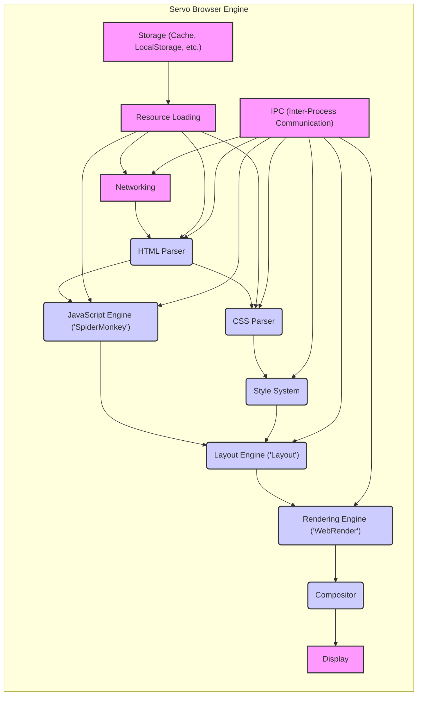

# Project Design Document: Servo Browser Engine for Threat Modeling

## 1. Introduction

This document provides a refined and detailed design overview of the Servo browser engine project, as hosted on GitHub at [https://github.com/servo/servo](https://github.com/servo/servo). Building upon the initial design document, this version aims to offer enhanced clarity and specificity, making it even more suitable for subsequent threat modeling activities. It meticulously outlines the system architecture, delves deeper into key component functionalities, clarifies data flow pathways, and elaborates on the technologies underpinning Servo. The information presented herein is structured to facilitate a robust understanding of Servo's internal mechanisms from a security-centric viewpoint, thereby enabling more precise identification and effective mitigation of potential threats.

## 2. Goals and Objectives of Servo

Servo's core mission is to be a cutting-edge, parallel browser engine, leveraging the Rust programming language for inherent safety and performance.  Its primary goals and objectives are:

*   **Extreme Parallelism for Performance:** To fully exploit modern multi-core processors by parallelizing all feasible browser engine tasks. This includes, but is not limited to, HTML parsing, CSS styling, JavaScript execution, layout calculations, and rendering operations. The aim is to achieve significantly improved responsiveness and rendering speed compared to traditional single-threaded or less parallel browser engines.
*   **Memory Safety and Robust Security:**  To eliminate entire classes of memory-related vulnerabilities (e.g., buffer overflows, use-after-free) by utilizing Rust's memory safety features. This foundational security is intended to reduce the attack surface and increase the overall robustness of the browser engine against exploits.
*   **Modular and Embeddable Architecture:** To design Servo as a collection of loosely coupled, independent modules. This modularity facilitates easier maintenance, updates, and importantly, embeddability into diverse applications.  The engine should be adaptable for integration into environments beyond a traditional desktop browser, such as embedded systems, game engines, and mobile platforms.
*   **Strict Adherence to Web Standards:** To ensure full and accurate implementation of current and emerging web standards as defined by W3C and WHATWG.  Compliance is crucial for consistent rendering across the web and reduces the risk of rendering bugs that could be exploited.
*   **Platform for Web Innovation and Research:** To serve as an experimental platform for exploring novel browser engine architectures and web technologies. Servo is intended to be a testbed for research into areas like parallel algorithms for web processing, new rendering techniques, and advanced security mechanisms for web browsers.

## 3. System Architecture Overview

Servo's architecture is fundamentally designed for parallelism and modularity, breaking down browser functionalities into distinct, concurrently operating subsystems.  This approach maximizes resource utilization and enhances responsiveness. The high-level architecture is represented below:

### 3.1. Detailed Subsystem Descriptions

*   **Networking:**
    *   **Functionality:** Manages all network-related operations, including initiating and handling HTTP/HTTPS requests, WebSocket connections, and potentially other network protocols.
    *   **Security Relevance:** Critical for enforcing web security policies like CORS, handling TLS/SSL for secure connections, and mitigating network-based attacks (e.g., man-in-the-middle, protocol vulnerabilities).  Must correctly handle untrusted network data.
    *   **Key Aspects:** Connection pooling, caching mechanisms (HTTP cache), proxy support, DNS resolution, TLS handshake, certificate validation.
*   **Resource Loading:**
    *   **Functionality:** Responsible for fetching resources from various sources: network, disk cache, or local storage.  Manages resource prioritization to optimize page load times.
    *   **Security Relevance:**  Handles potentially untrusted resources. Must prevent issues like path traversal vulnerabilities when accessing local resources and ensure integrity of cached resources.
    *   **Key Aspects:**  Resource scheduling, cache management (disk and memory cache), data decompression (gzip, deflate), MIME type handling, data URI scheme processing.
*   **HTML Parser:**
    *   **Functionality:** Parses HTML documents into a DOM tree.  Handles potentially malformed or malicious HTML input gracefully and securely.
    *   **Security Relevance:**  Vulnerable to XSS attacks if parsing is not robust. Must sanitize or neutralize potentially malicious HTML constructs.  Error handling is crucial to prevent parser exploits.
    *   **Key Aspects:**  Tokenization, tree construction, error recovery, handling of character encodings, DOM API implementation.
*   **CSS Parser:**
    *   **Functionality:** Parses CSS stylesheets into a CSSOM.  Handles CSS syntax, including complex selectors and property values.
    *   **Security Relevance:**  CSS parsing vulnerabilities could lead to unexpected styling or even script injection in some scenarios.  Must handle malicious or crafted CSS input safely.
    *   **Key Aspects:**  Tokenization, parsing of selectors and declarations, CSSOM API implementation, handling of different CSS versions and vendor prefixes.
*   **JavaScript Engine ('SpiderMonkey'):**
    *   **Functionality:** Executes JavaScript code. Provides the core scripting capabilities of the browser. Servo integrates Mozilla's SpiderMonkey.
    *   **Security Relevance:**  JavaScript engines are a major attack surface in browsers.  Vulnerabilities in SpiderMonkey directly impact Servo's security.  Sandboxing and security policies within the engine are critical.
    *   **Key Aspects:**  ECMAScript standard compliance, JIT compilation, garbage collection, browser API implementation (DOM manipulation, Web APIs), security sandboxing, just-in-time compilation security.
*   **Style System:**
    *   **Functionality:**  Calculates the computed styles for each DOM element by applying CSS rules based on cascading, specificity, and inheritance.
    *   **Security Relevance:**  Style calculation logic errors could lead to unexpected rendering or potentially exploitable behavior.  Performance issues in style calculation could be used for DoS attacks.
    *   **Key Aspects:**  CSS cascade algorithm, selector matching, property inheritance, computed style generation, performance optimization.
*   **Layout Engine ('Layout'):**
    *   **Functionality:**  Determines the position and size of each element on the page based on computed styles and the DOM structure.  Implements layout algorithms like block, inline, flexbox, and grid.
    *   **Security Relevance:**  Layout engine vulnerabilities could lead to rendering bugs, DoS attacks (through complex layouts), or potentially information leaks if layout calculations expose sensitive data.
    *   **Key Aspects:**  Box model implementation, layout algorithms (block, inline, flexbox, grid), viewport management, scrolling, zooming, performance optimization.
*   **Rendering Engine ('WebRender'):**
    *   **Functionality:**  Rasterizes the layout tree into pixels for display, utilizing GPU acceleration for performance. Handles drawing primitives, text rendering, image decoding and rendering, and compositing.
    *   **Security Relevance:**  Rendering engine vulnerabilities could lead to crashes, memory corruption, or potentially GPU-related exploits.  Must handle untrusted image data and rendering instructions safely.
    *   **Key Aspects:**  GPU command generation, shader execution, texture management, font rendering, image decoding (JPEG, PNG, etc.), vector graphics rendering, compositing operations.
*   **Compositor:**
    *   **Functionality:**  Composites different rendering layers (e.g., page content, UI elements, plugins) into a final frame for display. Manages scrolling, zooming, animations, and visual effects.
    *   **Security Relevance:**  Compositor vulnerabilities could lead to visual glitches, information leaks (through layer blending issues), or potentially privilege escalation if compositor interacts with system graphics drivers in an unsafe way.
    *   **Key Aspects:**  Layer management, transformation and clipping, animation handling, input event routing, interaction with windowing system.
*   **Display:**
    *   **Functionality:**  Presents the final rendered frames on the user's screen via the operating system's display system. Handles interaction with the OS windowing system.
    *   **Security Relevance:**  Interaction with the operating system's display system needs to be secure to prevent issues like window injection or privilege escalation.
    *   **Key Aspects:**  Window management, display synchronization, input event handling, integration with OS graphics APIs.
*   **IPC (Inter-Process Communication):**
    *   **Functionality:**  Enables communication between different processes within Servo. Used for process isolation, parallel task execution, and communication between components like the main process, rendering processes, and plugin processes.
    *   **Security Relevance:**  IPC mechanisms must be secure to prevent unauthorized communication between processes, privilege escalation, or data leaks across process boundaries.
    *   **Key Aspects:**  Message passing, shared memory (if used), serialization/deserialization, process management, security policies for inter-process communication.
*   **Storage (Cache, LocalStorage, etc.):**
    *   **Functionality:**  Provides persistent storage mechanisms for caching resources, storing website data (LocalStorage, IndexedDB, Cookies), and browser settings.
    *   **Security Relevance:**  Storage mechanisms must protect user data from unauthorized access and ensure data integrity. Vulnerabilities could lead to data breaches, cookie theft, or cache poisoning.
    *   **Key Aspects:**  Cache eviction policies, data encryption (for sensitive data), access control mechanisms, quota management, cookie security attributes (HttpOnly, Secure).

## 4. Data Flow (Detailed)

The data flow in Servo is a pipeline, starting from a URL request and culminating in displaying the rendered page.  Here's a more detailed breakdown:

1.  **URL Request Initiation:** The process begins with a URL request, either initiated by user interaction (typing in the address bar, clicking a link) or programmatically by an embedding application.
2.  **Networking and Resource Fetching:**
    *   The **Networking** subsystem handles the URL request, performing DNS resolution, establishing a connection (potentially TLS/SSL for HTTPS), and sending the HTTP request.
    *   **Resource Loading** manages the download of the resource (HTML, CSS, JavaScript, images, etc.) from the network. It may utilize the **Storage** subsystem to check for cached versions of the resource before initiating a network request.
3.  **HTML Parsing and DOM Tree Construction:**
    *   The downloaded HTML content is fed to the **HTML Parser**.
    *   The parser tokenizes the HTML and constructs a DOM tree, representing the hierarchical structure of the HTML document.
4.  **CSS Parsing and CSSOM Construction:**
    *   As the HTML parser encounters `<link>` tags for CSS stylesheets or `<style>` blocks, the **CSS Parser** is invoked.
    *   The CSS parser parses the CSS rules and builds a CSSOM, representing the style rules associated with the document.
5.  **JavaScript Execution (and DOM/CSSOM Manipulation):**
    *   When the HTML parser encounters `<script>` tags or inline JavaScript, the **JavaScript Engine ('SpiderMonkey')** is engaged.
    *   SpiderMonkey executes the JavaScript code. JavaScript can dynamically manipulate the DOM tree (adding, removing, or modifying elements) and the CSSOM (changing styles). These manipulations feed back into the next stages.
6.  **Style Calculation and Computed Styles:**
    *   The **Style System** takes the DOM tree and the CSSOM as input.
    *   It traverses the DOM tree and, for each element, calculates the final "computed styles" by applying CSS rules based on cascading, specificity, and inheritance.
7.  **Layout Calculation and Layout Tree Generation:**
    *   The **Layout Engine ('Layout')** receives the DOM tree with computed styles.
    *   It performs layout calculations based on CSS box model properties and layout algorithms (block, inline, flexbox, grid) to determine the position and size of each element. This results in a layout tree.
8.  **Rendering and Pixel Rasterization:**
    *   The **Rendering Engine ('WebRender')** takes the layout tree.
    *   It rasterizes the layout tree into pixels, utilizing the GPU for accelerated rendering. This involves drawing text, images, shapes, and applying visual effects.
9.  **Compositing and Frame Preparation:**
    *   The **Compositor** takes the rendered output from WebRender, along with other layers (e.g., UI elements, plugin layers).
    *   It composites these layers together, handles scrolling, zooming, and animations, and prepares the final frame to be displayed.
10. **Display to Screen:**
    *   The **Display** subsystem receives the composited frame.
    *   It interacts with the operating system's display system to present the frame on the user's screen.

This detailed data flow is visualized below:

```mermaid
graph LR
    A["URL Request"] --> B("Networking & Resource Fetching");
    B --> C("HTML Parsing & DOM Tree");
    C --> D("CSS Parsing & CSSOM");
    D --> E("JavaScript Execution (SpiderMonkey) & DOM/CSSOM Manipulation");
    E --> F("Style Calculation & Computed Styles");
    F --> G("Layout Calculation & Layout Tree");
    G --> H("Rendering (WebRender) & Pixel Rasterization");
    H --> I("Compositing & Frame Preparation");
    I --> J["Display to Screen"];
    J -->|User Interaction/New Requests| A;
    style A fill:#f9f,stroke:#333,stroke-width:2px
    style B fill:#ccf,stroke:#333,stroke-width:2px
    style C fill:#ccf,stroke:#333,stroke-width:2px
    style D fill:#ccf,stroke:#333,stroke-width:2px
    style E fill:#ccf,stroke:#333,stroke-width:2px
    style F fill:#ccf,stroke:#333,stroke-width:2px
    style G fill:#ccf,stroke:#333,stroke-width:2px
    style H fill:#ccf,stroke:#333,stroke-width:2px
    style I fill:#ccf,stroke:#333,stroke-width:2px
    style J fill:#f9f,stroke:#333,stroke-width:2px
```

## 5. Technology Stack (Detailed)

Servo's technology stack is centered around Rust for core components, emphasizing safety and performance. It also integrates mature, well-established technologies where appropriate.

*   **Core Programming Language:** Rust
    *   **Rationale:** Provides memory safety, concurrency features, and performance comparable to C/C++.  Crucial for building a secure and efficient browser engine.
    *   **Usage:**  Used for the majority of Servo's codebase, including the Layout engine, WebRender, Style System, and parts of the Networking and Resource Loading subsystems.
*   **JavaScript Engine:** SpiderMonkey (Mozilla)
    *   **Rationale:** A highly mature and widely used JavaScript engine, actively developed and optimized by Mozilla.  Integrating SpiderMonkey leverages existing expertise and reduces the effort of building a new JavaScript engine from scratch.
    *   **Integration:**  Servo embeds SpiderMonkey and provides bindings for interaction between Rust code and JavaScript.
*   **Rendering Engine:** WebRender (Rust)
    *   **Rationale:** Servo's in-house, GPU-accelerated rendering engine designed for parallelism and performance. Written in Rust for safety and efficiency.
    *   **Features:**  Tile-based rendering, fine-grained parallelism, modern graphics API usage (e.g., WebGPU, Vulkan, Metal, DirectX 12).
*   **Layout Engine:** Layout (Rust)
    *   **Rationale:** Servo's parallel layout engine, also written in Rust. Designed to efficiently handle complex layouts and leverage multi-core processors.
    *   **Features:**  Implementation of various layout algorithms (block, inline, flexbox, grid), incremental layout updates, performance optimizations.
*   **Networking Libraries:** Rust Ecosystem (e.g., `tokio`, `hyper`, `reqwest`)
    *   **Rationale:**  Leverages the robust and growing ecosystem of networking libraries in Rust. These libraries provide asynchronous I/O, HTTP protocol implementations, and other networking functionalities.
    *   **Examples:** `tokio` for asynchronous runtime, `hyper` for HTTP/1.1 and HTTP/2 implementation, `reqwest` for higher-level HTTP client functionality, `rustls` or `native-tls` for TLS/SSL.
*   **Build System:** Cargo (Rust's Build System and Package Manager)
    *   **Rationale:**  Cargo is the standard build system for Rust projects. It simplifies dependency management, compilation, testing, and building executables.
    *   **Usage:**  Used to manage Servo's dependencies, build the project, run tests, and create distribution packages.
*   **Inter-Process Communication (IPC):** Operating System Mechanisms and Rust Libraries (e.g., `ipc-channel`, `crossbeam-channel`)
    *   **Rationale:**  Utilizes OS-provided IPC mechanisms (e.g., pipes, sockets, shared memory) and Rust libraries that provide abstractions and safety wrappers around these mechanisms.
    *   **Examples:**  `ipc-channel` for higher-level IPC abstractions, `crossbeam-channel` for efficient and safe channel-based communication within and across processes.
*   **Storage Mechanisms:**  Operating System APIs and Rust Libraries (e.g., `sled`, `rusqlite`)
    *   **Rationale:**  Uses OS APIs for file system access and potentially Rust libraries for database functionalities (e.g., for IndexedDB or other structured storage).
    *   **Examples:**  Standard Rust file I/O libraries, `sled` for an embedded database, `rusqlite` for SQLite integration.
*   **Platform APIs:** Operating System Specific APIs (e.g., Win32 API, Cocoa, Xlib/Wayland)
    *   **Rationale:**  Necessary for interacting with the underlying operating system for tasks like window management, graphics context creation, input event handling, and accessing system resources.
    *   **Abstraction Layers:** Servo likely uses abstraction layers to minimize platform-specific code and provide a more portable codebase.

## 6. Security Considerations (Detailed Threat Areas)

Building upon the initial security considerations, this section elaborates on specific threat areas within Servo's architecture, relevant for threat modeling:

*   **Memory Safety Vulnerabilities (Despite Rust):**
    *   **Threat:**  While Rust mitigates many memory safety issues, `unsafe` blocks, FFI (Foreign Function Interface) with C/C++ libraries (including SpiderMonkey), and logic errors can still introduce memory vulnerabilities.
    *   **Examples:**  Use-after-free in `unsafe` code, buffer overflows in C libraries called via FFI, memory leaks due to incorrect resource management in Rust code.
    *   **Mitigation:**  Rigorous code reviews of `unsafe` blocks and FFI boundaries, static analysis tools, fuzzing, memory safety testing.
*   **Web Security Policy Violations:**
    *   **Threat:** Failure to correctly implement and enforce web security policies (SOP, CSP, CORS) can lead to cross-site scripting (XSS), cross-site request forgery (CSRF), and data leaks.
    *   **Examples:**  Bypassing SOP checks in JavaScript engine, incorrect CSP enforcement allowing execution of unauthorized scripts, CORS misconfigurations enabling cross-origin data access.
    *   **Mitigation:**  Thorough testing of security policy implementations, adherence to web security standards, regular security audits, content security policy enforcement.
*   **JavaScript Engine (SpiderMonkey) Vulnerabilities:**
    *   **Threat:**  Vulnerabilities in SpiderMonkey itself (e.g., JIT bugs, memory corruption) can directly compromise Servo.
    *   **Examples:**  Exploiting JIT compiler bugs to execute arbitrary code, memory corruption vulnerabilities in SpiderMonkey's core engine.
    *   **Mitigation:**  Staying up-to-date with SpiderMonkey security patches, sandboxing JavaScript execution within Servo, limiting JavaScript capabilities where possible.
*   **Input Validation and Injection Attacks:**
    *   **Threat:**  Insufficient input validation in HTML parser, CSS parser, or JavaScript engine can lead to injection attacks (XSS, CSS injection).
    *   **Examples:**  XSS vulnerabilities due to improper sanitization of HTML input, CSS injection attacks exploiting CSS parsing flaws.
    *   **Mitigation:**  Robust input validation and sanitization at parsing stages, context-aware output encoding, using parser libraries designed for security.
*   **Process Isolation and IPC Security:**
    *   **Threat:**  Weak process isolation or insecure IPC mechanisms can allow compromised rendering processes to escalate privileges or access data in other processes.
    *   **Examples:**  Exploiting vulnerabilities in IPC channels to bypass process boundaries, privilege escalation from a rendering process to the main process.
    *   **Mitigation:**  Using robust OS-level process isolation, secure IPC mechanisms with authentication and authorization, principle of least privilege for process capabilities.
*   **Resource Exhaustion and Denial of Service (DoS):**
    *   **Threat:**  Resource-intensive operations in parsing, layout, rendering, or JavaScript execution can be exploited for DoS attacks.
    *   **Examples:**  Crafted HTML or CSS that causes excessive parsing or layout calculations, JavaScript code that consumes excessive CPU or memory, triggering resource exhaustion in WebRender.
    *   **Mitigation:**  Resource limits and quotas, rate limiting, input complexity analysis, efficient algorithms, DoS attack detection and mitigation mechanisms.
*   **Dependency Vulnerabilities:**
    *   **Threat:**  Vulnerabilities in third-party libraries used by Servo (Rust crates, C libraries) can be exploited.
    *   **Examples:**  Security flaws in networking libraries, image decoding libraries, or other dependencies.
    *   **Mitigation:**  Regularly auditing and updating dependencies, using dependency scanning tools, vulnerability management processes.
*   **Storage Security:**
    *   **Threat:**  Insecure storage mechanisms can lead to data breaches, cookie theft, or cache poisoning.
    *   **Examples:**  Unencrypted storage of sensitive data, vulnerabilities in cookie handling, cache poisoning attacks.
    *   **Mitigation:**  Encrypting sensitive data at rest, secure cookie handling (HttpOnly, Secure flags), cache integrity checks, access control for storage.
*   **Rendering Engine (WebRender) and GPU Security:**
    *   **Threat:**  Vulnerabilities in WebRender or interactions with GPU drivers could lead to crashes, memory corruption, or potentially GPU-related exploits.
    *   **Examples:**  Shader vulnerabilities, memory corruption in WebRender's rendering pipeline, issues in GPU driver interactions.
    *   **Mitigation:**  Code reviews of WebRender, fuzzing of rendering code, security testing of GPU interactions, sandboxing rendering processes.

## 7. Deployment Model (Security Implications)

Servo's deployment models have different security implications:

*   **Embedded Browser Engine:**
    *   **Security Implications:** Security is paramount as vulnerabilities in the embedded engine can directly impact the host application. The embedding application is responsible for configuring and securing Servo appropriately within its environment.  The attack surface can be broader depending on the capabilities exposed by the embedding application.
    *   **Considerations:**  Careful API design for embedding, clear security guidelines for integrators, sandboxing within the embedding environment, regular security updates for the embedded engine.
*   **Research and Development Platform:**
    *   **Security Implications:** While direct user-facing security might be less critical in a research context, vulnerabilities can still hinder development and potentially expose research infrastructure.  Security is important for code integrity and preventing malicious contributions.
    *   **Considerations:**  Code review processes, security testing of experimental features, access control to development infrastructure, vulnerability disclosure and patching processes.
*   **Potential Standalone Browser (Experimental):**
    *   **Security Implications:**  Highest security requirements, as it directly handles untrusted web content and user data.  All browser security features must be robust and actively maintained.  A large attack surface due to the full browser functionality.
    *   **Considerations:**  Comprehensive security testing, regular security audits, rapid vulnerability patching, robust sandboxing, user privacy protection mechanisms, secure update mechanisms.

## 8. Future Security Considerations

Future security enhancements and considerations for Servo should include:

*   **Formal Security Audits:**  Regular, independent security audits by external experts to identify vulnerabilities and weaknesses.
*   **Continuous Fuzzing and Security Testing:**  Integrating fuzzing and other automated security testing techniques into the development process.
*   **Memory Safety Hardening:**  Exploring further memory safety hardening techniques beyond Rust's base guarantees, such as using memory tagging or other hardware-assisted memory safety features.
*   **Enhanced Sandboxing:**  Strengthening process sandboxing and exploring more advanced sandboxing technologies to further isolate rendering processes and other less trusted components.
*   **Formal Verification of Security-Critical Components:**  Applying formal verification techniques to critical security components (e.g., parser, style system, security policy enforcement) to mathematically prove their correctness and security properties.
*   **Privacy Enhancing Technologies (PETs) Integration:**  Exploring and integrating privacy-enhancing technologies to improve user privacy within the browser engine.
*   **Vulnerability Disclosure and Bug Bounty Program:**  Establishing a clear vulnerability disclosure process and potentially a bug bounty program to encourage responsible disclosure of security vulnerabilities.
*   **Security Focused Development Practices:**  Promoting security-focused development practices within the Servo project, including security training for developers and incorporating security considerations into all stages of the development lifecycle.

This improved design document provides a more detailed and security-focused foundation for threat modeling the Servo browser engine. It highlights key components, data flows, technologies, and specific threat areas, enabling a more comprehensive and effective threat modeling process.