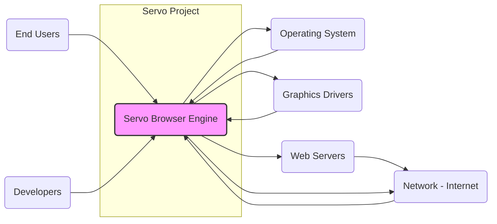

# BUSINESS POSTURE

This project, Servo, aims to create a modern, embeddable web engine. It is designed to be highly parallel and written in Rust, emphasizing safety and performance. The primary business goal is to provide an alternative browser engine that can be used in various applications, potentially competing with existing engines like Blink and Gecko.

Business priorities and goals:
- Provide a secure web engine.
- Achieve high performance and efficiency.
- Offer a modern and standards-compliant web platform.
- Enable embedding Servo in diverse applications and environments.
- Foster an open-source community around the project.

Most important business risks:
- Security vulnerabilities in the engine could lead to data breaches and reputational damage.
- Performance issues might hinder adoption and user experience.
- Lack of compatibility with web standards could limit usability.
- Difficulty in embedding Servo into different platforms could restrict its market reach.
- Insufficient community support could slow down development and maintenance.

# SECURITY POSTURE

Existing security controls:
- security control: Memory safety provided by Rust language, mitigating many common classes of vulnerabilities like buffer overflows. Implemented at the language level.
- security control: Code review process for contributions. Implemented via GitHub pull requests.
- security control: Fuzzing and testing as part of continuous integration. Implemented in GitHub Workflows.
- security control: Reporting and handling of security vulnerabilities. Described in project's security policy (if available, needs verification).
- accepted risk: Reliance on external dependencies, which might introduce vulnerabilities.
- accepted risk: Complexity of the codebase, making it challenging to identify all potential security issues.
- accepted risk: Open source nature, making the codebase publicly available for vulnerability research (both by attackers and defenders).

Recommended security controls:
- security control: Static Application Security Testing (SAST) integration into the CI/CD pipeline to automatically detect potential vulnerabilities in the code.
- security control: Dynamic Application Security Testing (DAST) to test the running application for vulnerabilities.
- security control: Regular security audits by external security experts.
- security control: Dependency scanning and management to track and update vulnerable dependencies.
- security control: Implement and enforce secure coding guidelines and training for developers.

Security requirements:
- Authentication: Not directly applicable to a browser engine as it doesn't manage user accounts. However, security mechanisms within web pages loaded by Servo might involve authentication, which Servo needs to handle securely (e.g., handling cookies, TLS certificates).
- Authorization: Servo needs to enforce the same-origin policy and other web security models to prevent unauthorized access to resources and data between different websites. Implemented within the engine's core logic.
- Input validation:  Critical for processing untrusted web content. Servo must rigorously validate all inputs from web pages (HTML, CSS, JavaScript, network responses, etc.) to prevent injection attacks (XSS, etc.) and other vulnerabilities. Implemented in parsing and processing components of the engine.
- Cryptography: Servo relies on cryptography for secure communication (HTTPS) and handling web cryptography APIs. Correct and secure implementation of cryptographic protocols and APIs is essential. Implemented in networking and JavaScript engine components.

# DESIGN

## C4 CONTEXT



Context Diagram Elements:

- Element:
  - Name: Servo Browser Engine
  - Type: Software System
  - Description: A modern, embeddable web engine written in Rust. It is designed to be highly parallel and secure, aiming to provide an alternative to existing browser engines.
  - Responsibilities:
    - Rendering web pages (HTML, CSS, JavaScript).
    - Handling network requests and responses.
    - Enforcing web security policies (same-origin policy, etc.).
    - Providing APIs for embedding in other applications.
  - Security controls:
    - Memory safety through Rust.
    - Input validation for web content.
    - Implementation of web security standards.
    - Secure handling of network communications (TLS).

- Element:
  - Name: End Users
  - Type: Person
  - Description: Users who interact with applications that embed the Servo browser engine. They access web content through these applications.
  - Responsibilities:
    - Using applications that embed Servo to browse the web or access web-based content.
  - Security controls:
    - Rely on the security of the embedding application and the Servo engine itself.

- Element:
  - Name: Developers
  - Type: Person
  - Description: Software developers who embed the Servo browser engine into their applications or contribute to the Servo project itself.
  - Responsibilities:
    - Embedding Servo into applications.
    - Configuring and integrating Servo with other components.
    - Contributing to the development and maintenance of Servo.
  - Security controls:
    - Responsible for securely integrating Servo into their applications.
    - Following secure development practices when contributing to Servo.

- Element:
  - Name: Operating System
  - Type: Software System
  - Description: The underlying operating system on which Servo and embedding applications run (e.g., Windows, macOS, Linux, Android, iOS).
  - Responsibilities:
    - Providing system resources and APIs to Servo.
    - Managing processes and memory.
    - Enforcing system-level security policies.
  - Security controls:
    - Operating system security features (e.g., process isolation, memory protection, access control).

- Element:
  - Name: Graphics Drivers
  - Type: Software System
  - Description: Drivers that manage the graphics hardware and provide APIs for rendering graphics. Servo uses these drivers to display web content.
  - Responsibilities:
    - Providing hardware acceleration for rendering.
    - Managing communication with graphics hardware.
  - Security controls:
    - Driver security and stability to prevent crashes or vulnerabilities that could be exploited by Servo or malicious web content.

- Element:
  - Name: Network - Internet
  - Type: External System
  - Description: The external network (Internet) from which Servo fetches web content.
  - Responsibilities:
    - Transporting web requests and responses between Servo and web servers.
  - Security controls:
    - Network security protocols (TLS/HTTPS) to protect communication confidentiality and integrity.

- Element:
  - Name: Web Servers
  - Type: External System
  - Description: Servers on the internet that host web content accessed by Servo.
  - Responsibilities:
    - Hosting and serving web pages and resources.
    - Implementing web application security.
  - Security controls:
    - Web server security configurations and practices.
    - Application-level security measures to protect against web attacks.

## C4 CONTAINER

```mermaid
graph LR
    subgraph "Servo Browser Engine"
        subgraph "Rendering Engine"
            RE_HTML(HTML Parser)
            RE_CSS(CSS Engine)
            RE_Layout(Layout Engine)
            RE_Paint(Painting)
        end
        subgraph "JavaScript Engine"
            JSE(JavaScript Engine)
        end
        subgraph "Networking"
            NW_HTTP(HTTP Client)
            NW_TLS(TLS Library)
        end
        subgraph "Platform Integration"
            PI_OS(OS API Bindings)
            PI_Graphics(Graphics API Bindings)
        end
        subgraph "Security Components"
            SEC_Policy(Security Policy Enforcement)
            SEC_Sandbox(Sandbox)
        end
        RE_HTML --> RE_CSS
        RE_CSS --> RE_Layout
        RE_Layout --> RE_Paint
        JSE --> RE_Paint
        NW_HTTP --> NW_TLS
        RE_HTML --> JSE
        NW_HTTP --> RE_HTML
        PI_OS --> RE_Paint
        PI_Graphics --> RE_Paint
        SEC_Policy --> RE_HTML
        SEC_Policy --> JSE
        SEC_Sandbox --> RE_Paint
        SEC_Sandbox --> JSE
        NW_TLS --> SEC_Policy
    end
    style "Servo Browser Engine" fill:#ccf,stroke:#333,stroke-width:2px
    style Rendering Engine fill:#eee,stroke:#333,stroke-width:1px
    style JavaScript Engine fill:#eee,stroke:#333,stroke-width:1px
    style Networking fill:#eee,stroke:#333,stroke-width:1px
    style "Platform Integration" fill:#eee,stroke:#333,stroke-width:1px
    style "Security Components" fill:#eee,stroke:#333,stroke-width:1px
```

Container Diagram Elements:

- Element:
  - Name: Rendering Engine
  - Type: Container
  - Description: Responsible for parsing HTML and CSS, calculating layout, and painting the web page content.
  - Responsibilities:
    - Parsing HTML and CSS.
    - Building the Document Object Model (DOM) and CSS Object Model (CSSOM).
    - Calculating the layout of elements on the page.
    - Painting the rendered output.
  - Security controls:
    - Input validation of HTML and CSS to prevent injection attacks.
    - Memory safety in parsing and layout algorithms.
    - Protection against resource exhaustion during rendering.

- Element:
  - Name: JavaScript Engine
  - Type: Container
  - Description: Executes JavaScript code within web pages.
  - Responsibilities:
    - Interpreting and executing JavaScript.
    - Providing JavaScript APIs to web pages.
    - Managing JavaScript execution context and memory.
  - Security controls:
    - Sandbox environment to isolate JavaScript execution.
    - Input validation of JavaScript code (though limited in browser context).
    - Protection against vulnerabilities in the JavaScript engine itself.

- Element:
  - Name: Networking
  - Type: Container
  - Description: Handles network communication, including HTTP requests and responses, and TLS for secure connections.
  - Responsibilities:
    - Making HTTP requests to web servers.
    - Handling HTTP responses.
    - Establishing and managing TLS connections.
    - Managing cookies and other network-related state.
  - Security controls:
    - Secure implementation of TLS protocols.
    - Validation of server certificates.
    - Protection against network-based attacks (e.g., man-in-the-middle).

- Element:
  - Name: Platform Integration
  - Type: Container
  - Description: Provides bindings to operating system and graphics APIs, allowing Servo to interact with the underlying platform.
  - Responsibilities:
    - Interfacing with OS-specific APIs for system resources.
    - Interfacing with graphics APIs for rendering output.
  - Security controls:
    - Secure usage of OS and graphics APIs.
    - Handling platform-specific security mechanisms.

- Element:
  - Name: Security Components
  - Type: Container
  - Description: Enforces security policies and provides sandboxing to isolate different parts of the engine and web content.
  - Responsibilities:
    - Enforcing the same-origin policy.
    - Implementing content security policy (CSP).
    - Providing a sandbox environment for rendering and JavaScript execution.
    - Managing permissions and security contexts.
  - Security controls:
    - Policy enforcement mechanisms.
    - Sandbox isolation techniques.
    - Privilege separation within the engine.

## DEPLOYMENT

Deployment Architecture: Library Embedding

Servo is primarily designed to be embedded as a library within other applications. The deployment model involves integrating Servo as a dependency into a host application.

```mermaid
graph LR
    subgraph "Deployment Environment"
        subgraph "Host Application Process"
            HA(Host Application)
            SL(Servo Library)
            OS_Instance(Operating System Instance)
            GD_Instance(Graphics Drivers Instance)
        end
    end
    HA --> SL
    SL --> OS_Instance
    SL --> GD_Instance
    style "Deployment Environment" fill:#efe,stroke:#333,stroke-width:2px
    style "Host Application Process" fill:#eee,stroke:#333,stroke-width:1px
```

Deployment Diagram Elements:

- Element:
  - Name: Host Application
  - Type: Software Process
  - Description: The application that embeds the Servo library to provide web rendering capabilities. This could be a browser, an email client, a game engine, or any other application needing web content display.
  - Responsibilities:
    - Integrating and initializing the Servo library.
    - Providing an interface for users to interact with web content rendered by Servo.
    - Managing the lifecycle of the Servo library within the application.
  - Security controls:
    - Secure coding practices in the host application to prevent vulnerabilities that could compromise Servo or the system.
    - Proper configuration and usage of Servo APIs to maintain security boundaries.

- Element:
  - Name: Servo Library
  - Type: Software Library
  - Description: The compiled Servo engine, linked as a library into the host application.
  - Responsibilities:
    - Providing web rendering functionality to the host application.
    - Executing within the process space of the host application.
  - Security controls:
    - All security controls implemented within the Servo engine containers (as described in the Container Diagram).
    - Memory safety and isolation provided by Rust.

- Element:
  - Name: Operating System Instance
  - Type: Infrastructure
  - Description: An instance of the operating system (e.g., a running kernel and system services) on the user's machine where the host application and Servo are deployed.
  - Responsibilities:
    - Providing the runtime environment for the host application and Servo.
    - Managing system resources (memory, CPU, etc.).
    - Enforcing OS-level security policies.
  - Security controls:
    - Operating system security features (process isolation, memory protection, access control).
    - System updates and patching to address OS vulnerabilities.

- Element:
  - Name: Graphics Drivers Instance
  - Type: Infrastructure
  - Description: Instance of graphics drivers installed on the user's machine, used by Servo for hardware-accelerated rendering.
  - Responsibilities:
    - Providing graphics rendering capabilities to Servo.
  - Security controls:
    - Driver security and stability.
    - Regular driver updates to address vulnerabilities.

## BUILD

Build Process: Automated CI/CD with Security Checks

The Servo project likely uses an automated build system, potentially GitHub Workflows, to build, test, and publish the Servo library. The build process should incorporate security checks to ensure the integrity and security of the final artifacts.

```mermaid
graph LR
    subgraph "Development Environment"
        DEV(Developer)
    end
    subgraph "CI/CD Pipeline (GitHub Workflows)"
        VC(Version Control - GitHub)
        BC(Build and Compile)
        TEST(Automated Tests - Unit, Integration, Fuzzing)
        SAST_SCAN(SAST Scanner)
        DAST_SCAN(DAST Scanner)
        DEP_SCAN(Dependency Scanner)
        ARTIFACT(Build Artifacts - Libraries)
        PUB(Publish Artifacts - Package Registry)
    end
    DEV --> VC
    VC --> BC
    BC --> TEST
    BC --> SAST_SCAN
    BC --> DAST_SCAN
    BC --> DEP_SCAN
    TEST --> ARTIFACT
    SAST_SCAN --> ARTIFACT
    DAST_SCAN --> ARTIFACT
    DEP_SCAN --> ARTIFACT
    ARTIFACT --> PUB
    style "Development Environment" fill:#eff,stroke:#333,stroke-width:2px
    style "CI/CD Pipeline (GitHub Workflows)" fill:#efe,stroke:#333,stroke-width:2px
```

Build Diagram Elements:

- Element:
  - Name: Developer
  - Type: Person
  - Description: A developer contributing code to the Servo project.
  - Responsibilities:
    - Writing and committing code changes.
    - Participating in code reviews.
    - Addressing issues identified by the CI/CD pipeline.
  - Security controls:
    - Secure coding practices.
    - Code review process.
    - Access control to the repository.

- Element:
  - Name: Version Control - GitHub
  - Type: Software System
  - Description: GitHub repository hosting the Servo source code and managing version control.
  - Responsibilities:
    - Storing and managing source code.
    - Tracking code changes and history.
    - Managing branches and pull requests.
  - Security controls:
    - Access control and authentication for repository access.
    - Audit logging of repository activities.
    - Branch protection rules.

- Element:
  - Name: Build and Compile
  - Type: Software System
  - Description: The build system (e.g., Rust's Cargo) that compiles the Servo source code into libraries.
  - Responsibilities:
    - Compiling Rust code.
    - Linking dependencies.
    - Generating build artifacts (libraries).
  - Security controls:
    - Use of trusted build tools and environments.
    - Build process integrity to prevent tampering.
    - Reproducible builds (ideally).

- Element:
  - Name: Automated Tests - Unit, Integration, Fuzzing
  - Type: Software System
  - Description: Automated tests run as part of the CI/CD pipeline to verify the functionality and stability of Servo. Includes unit tests, integration tests, and fuzzing.
  - Responsibilities:
    - Running tests to detect regressions and bugs.
    - Improving code quality and reliability.
    - Identifying potential security vulnerabilities through fuzzing.
  - Security controls:
    - Comprehensive test suite covering security-relevant aspects.
    - Fuzzing to discover input validation and memory safety issues.

- Element:
  - Name: SAST Scanner
  - Type: Software System
  - Description: Static Application Security Testing (SAST) tools integrated into the CI/CD pipeline to analyze the source code for potential security vulnerabilities without executing it.
  - Responsibilities:
    - Identifying potential code-level vulnerabilities (e.g., injection flaws, buffer overflows).
    - Providing reports on identified vulnerabilities.
  - Security controls:
    - Integration of SAST tools into the build process.
    - Configuration of SAST tools to detect relevant vulnerability types.

- Element:
  - Name: DAST Scanner
  - Type: Software System
  - Description: Dynamic Application Security Testing (DAST) tools that could be used to test built artifacts in a running environment for vulnerabilities. (Less common for libraries, but could be used for integration tests).
  - Responsibilities:
    - Identifying runtime vulnerabilities by testing the application.
    - Simulating attacks to find weaknesses.
  - Security controls:
    - Integration of DAST tools into the testing process (if applicable).
    - Configuration of DAST tools to cover relevant attack vectors.

- Element:
  - Name: Dependency Scanner
  - Type: Software System
  - Description: Scans project dependencies for known vulnerabilities.
  - Responsibilities:
    - Identifying vulnerable dependencies.
    - Alerting developers to update vulnerable dependencies.
  - Security controls:
    - Regular dependency scanning.
    - Automated alerts and updates for vulnerable dependencies.

- Element:
  - Name: Build Artifacts - Libraries
  - Type: Data Store
  - Description: The compiled Servo libraries produced by the build process.
  - Responsibilities:
    - Storing the compiled libraries.
    - Ensuring the integrity of the build artifacts.
  - Security controls:
    - Secure storage of build artifacts.
    - Integrity checks (e.g., checksums) for artifacts.

- Element:
  - Name: Publish Artifacts - Package Registry
  - Type: Software System
  - Description: A package registry (e.g., crates.io for Rust) where Servo libraries are published for distribution.
  - Responsibilities:
    - Hosting and distributing Servo libraries.
    - Providing versioning and package management.
  - Security controls:
    - Secure publishing process.
    - Integrity checks for published packages.
    - Access control to publishing rights.

# RISK ASSESSMENT

Critical business processes we are trying to protect:
- Secure rendering of web content: Ensuring that Servo can process and display web pages without introducing security vulnerabilities that could be exploited to harm users or systems.
- Integrity of the engine: Maintaining the integrity of the Servo codebase and build process to prevent malicious modifications or supply chain attacks.
- Availability of the engine: Ensuring that Servo remains available and functional for embedding applications and users.

Data we are trying to protect and their sensitivity:
- User data processed by web pages: This includes potentially sensitive information such as personal data entered into forms, browsing history, cookies, and data accessed by JavaScript. Sensitivity is high, as breaches could lead to privacy violations, identity theft, and other harms.
- Application data within embedding applications: If Servo is embedded in applications that handle sensitive data, vulnerabilities in Servo could potentially expose this application data. Sensitivity depends on the nature of the embedding application.
- Intellectual property of the Servo project: The source code and design of Servo are valuable intellectual property. Protecting against unauthorized access and modification is important. Sensitivity is medium to high.

# QUESTIONS & ASSUMPTIONS

Questions:
- What is the formal security policy for the Servo project? Is there a documented vulnerability disclosure process?
- Are there regular security audits performed on the Servo codebase? If so, what are the findings and remediation status?
- What SAST/DAST tools are currently used in the CI/CD pipeline, if any?
- What dependency scanning and management practices are in place?
- Is there a formal secure coding guideline followed by Servo developers?
- What is the threat model considered during the design and development of Servo?
- What are the performance requirements and constraints that influence security decisions?
- What are the intended use cases and embedding scenarios for Servo? Are there specific security considerations for different use cases?

Assumptions:
- Servo aims to be a secure browser engine and prioritizes security in its development.
- The project follows standard open-source development practices, including code reviews and testing.
- Rust's memory safety features are a significant security control for the project.
- The build process is automated and includes some level of testing.
- Servo is intended to be embedded in a variety of applications, requiring a robust and secure design.
- Security vulnerabilities in Servo could have significant impact due to its role in rendering web content and handling user data.