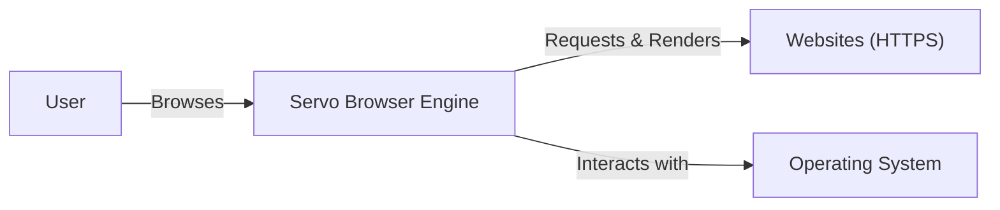
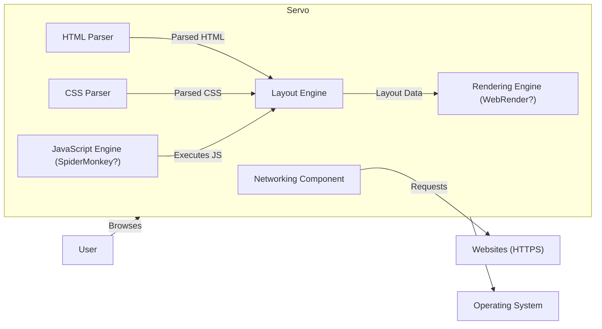
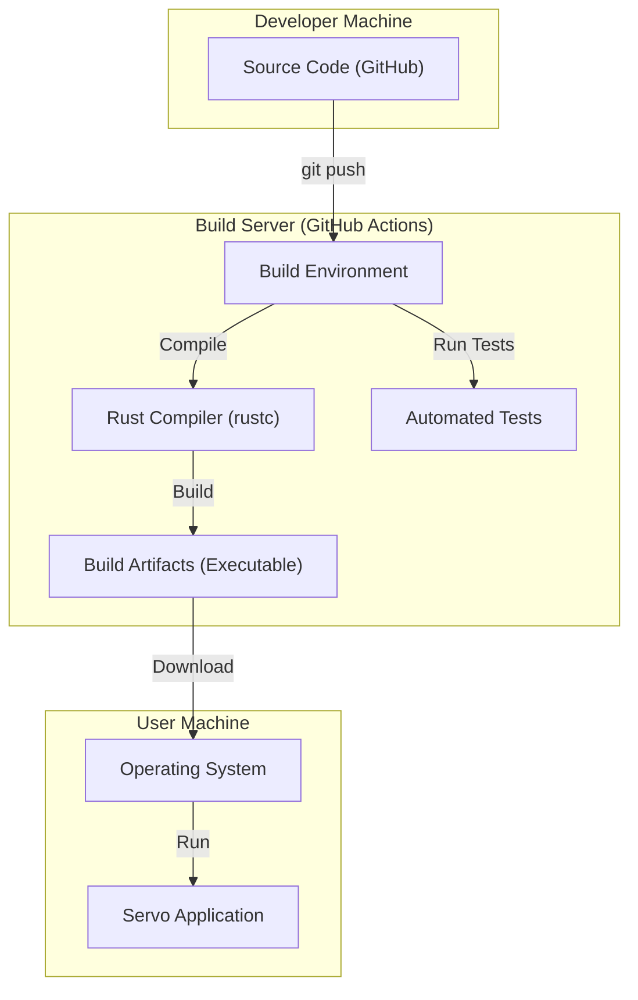
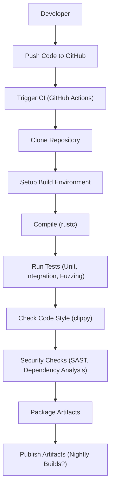

Okay, let's create a design document for the Servo project, keeping in mind its purpose and potential security considerations.

# BUSINESS POSTURE

Servo is an experimental, open-source project. Its primary goal is to create a new, high-performance browser engine built from the ground up using modern principles and technologies (specifically, the Rust programming language).  It's not intended to be a fully-fledged, consumer-ready browser *yet*, but rather a research platform and a potential foundation for future browser development.  This implies a higher risk tolerance than a commercial product, but security is still crucial for credibility and future adoption.

Business Priorities:

*   Demonstrate the feasibility of building a high-performance, memory-safe browser engine in Rust.
*   Explore new approaches to web rendering and layout.
*   Foster a community of contributors and researchers.
*   Potentially serve as the basis for future browser products (long-term).

Business Goals:

*   Achieve performance parity with or exceeding existing browser engines.
*   Demonstrate improved security and stability compared to existing engines.
*   Attract and retain a vibrant open-source community.

Most Important Business Risks:

*   Failure to achieve performance goals: If Servo cannot demonstrate significant performance advantages, it will fail to attract interest and adoption.
*   Major security vulnerabilities:  Even though it's experimental, severe security flaws would damage the project's reputation and hinder its long-term goals.  This includes vulnerabilities that could lead to remote code execution, data breaches, or denial-of-service.
*   Lack of community engagement:  The project's success depends on attracting and retaining contributors.  A lack of community involvement would stall development and limit its potential.
*   Inability to scale: The architecture must be able to handle the complexity of modern web pages and applications.

# SECURITY POSTURE

Servo, being written in Rust, benefits significantly from Rust's inherent memory safety features. This is a major security advantage over traditional browser engines written in C++. However, other security aspects need careful consideration.

Existing Security Controls:

*   security control: Memory Safety (Rust): The use of Rust inherently prevents many common memory-related vulnerabilities like buffer overflows, use-after-free errors, and dangling pointers. Implemented in: Core language and compiler.
*   security control: Code Reviews:  The project uses GitHub's pull request system, requiring code reviews before merging changes. Implemented in: GitHub repository workflow.
*   security control: Continuous Integration (CI):  Automated builds and tests are run on every pull request to catch regressions and potential issues. Implemented in: GitHub Actions (likely, based on common practice).
*   security control: Fuzzing: Servo likely employs fuzzing to test various components for unexpected behavior and vulnerabilities. Implemented in: Build process and dedicated fuzzing infrastructure (details would need confirmation from the repository).
*   security control: Static Analysis: Rust's compiler performs extensive static analysis, catching many potential errors at compile time. Implemented in: Rust compiler.
*   security control: Sandboxing: Servo likely implements some form of sandboxing to isolate different processes and limit the impact of potential vulnerabilities. Implemented in: Process architecture (details need confirmation).

Accepted Risks:

*   accepted risk: Experimental Nature:  The project is explicitly experimental, meaning that some instability and undiscovered vulnerabilities are expected.
*   accepted risk: Limited Security Audits:  While code reviews and fuzzing are in place, comprehensive, professional security audits may be limited due to resource constraints.
*   accepted risk: Dependency Vulnerabilities:  Like all projects, Servo depends on external libraries, which may contain vulnerabilities.

Recommended Security Controls (High Priority):

*   security control: Regular Security Audits:  As the project matures, periodic professional security audits should be conducted.
*   security control: Enhanced Fuzzing:  Expand fuzzing coverage to include more components and edge cases.
*   security control: Content Security Policy (CSP):  Implement robust CSP support to mitigate XSS attacks.
*   security control: Subresource Integrity (SRI):  Use SRI to ensure that fetched resources haven't been tampered with.
*   security control: Dependency Management:  Implement a robust system for tracking and updating dependencies, including vulnerability scanning.

Security Requirements:

*   Authentication: Not directly applicable to the core browser engine, but relevant for features like syncing and account management (if implemented).
*   Authorization:  Not directly applicable to the core engine, but relevant for features that interact with user data or external services.
*   Input Validation:  Crucial for preventing various web-based attacks.  All input from web pages (HTML, CSS, JavaScript, etc.) must be rigorously validated and sanitized.
*   Cryptography:  Essential for secure communication (HTTPS).  Must use strong, well-vetted cryptographic libraries and algorithms.  TLS 1.3 or later should be the default.
*   Sandboxing: Isolate renderer processes from each other and from the browser's core processes.
*   Site Isolation: Isolate different websites from each other to prevent cross-site attacks.

# DESIGN

## C4 CONTEXT

Element Descriptions:

*   Element:
    *   Name: User
    *   Type: Person
    *   Description: A person using a web browser powered by the Servo engine.
    *   Responsibilities: Initiates web browsing, interacts with web pages.
    *   Security controls: Relies on the security controls implemented in Servo and the operating system.

*   Element:
    *   Name: Servo Browser Engine
    *   Type: Software System
    *   Description: The core software component responsible for fetching, parsing, rendering, and displaying web content.
    *   Responsibilities:  Fetching web resources, parsing HTML/CSS/JavaScript, rendering web pages, managing the DOM, handling user input, executing JavaScript.
    *   Security controls: Memory safety (Rust), code reviews, CI, fuzzing, static analysis, sandboxing (planned/partial), input validation, cryptography (for HTTPS).

*   Element:
    *   Name: Websites (HTTPS)
    *   Type: Software System
    *   Description: External websites accessed by the user via the Servo engine.
    *   Responsibilities: Providing web content (HTML, CSS, JavaScript, images, etc.) over HTTPS.
    *   Security controls:  External to Servo; relies on website developers implementing proper security measures. Servo should implement controls like CSP and SRI to mitigate risks from potentially malicious websites.

*   Element:
    *   Name: Operating System
    *   Type: Software System
    *   Description: The underlying operating system (e.g., Windows, macOS, Linux) on which Servo runs.
    *   Responsibilities: Providing system resources (memory, CPU, network access), managing processes, enforcing system-level security policies.
    *   Security controls: OS-level security features (e.g., ASLR, DEP), user permissions, sandboxing mechanisms.

## C4 CONTAINER

Element Descriptions:

*   Element:
    *   Name: Networking Component
    *   Type: Container
    *   Description: Handles network communication, including fetching resources over HTTPS.
    *   Responsibilities:  Making HTTP requests, handling responses, managing connections, enforcing security policies (e.g., HSTS).
    *   Security controls:  TLS 1.3+ for HTTPS, certificate validation, connection security.

*   Element:
    *   Name: HTML Parser
    *   Type: Container
    *   Description: Parses HTML documents into a DOM tree.
    *   Responsibilities:  Parsing HTML, handling malformed HTML, constructing the DOM.
    *   Security controls:  Robust parsing to prevent vulnerabilities related to malformed HTML, input validation.

*   Element:
    *   Name: CSS Parser
    *   Type: Container
    *   Description: Parses CSS stylesheets.
    *   Responsibilities:  Parsing CSS, handling malformed CSS, applying styles to the DOM.
    *   Security controls:  Robust parsing to prevent vulnerabilities related to malformed CSS, input validation.

*   Element:
    *   Name: JavaScript Engine (SpiderMonkey?)
    *   Type: Container
    *   Description: Executes JavaScript code.  (Servo has historically used SpiderMonkey, but this may change.)
    *   Responsibilities:  Parsing and executing JavaScript, interacting with the DOM, handling events.
    *   Security controls:  Secure execution environment, sandboxing, JIT compilation security, regular updates to address vulnerabilities.

*   Element:
    *   Name: Layout Engine
    *   Type: Container
    *   Description: Calculates the layout of web page elements.
    *   Responsibilities:  Determining the position and size of elements, handling reflow and repaint.
    *   Security controls:  Robust layout calculations to prevent vulnerabilities related to layout manipulation.

*   Element:
    *   Name: Rendering Engine (WebRender?)
    *   Type: Container
    *   Description: Renders the web page to the screen. (Servo has developed WebRender, a GPU-accelerated rendering engine.)
    *   Responsibilities:  Drawing elements to the screen, handling compositing, interacting with the graphics hardware.
    *   Security controls:  Secure rendering pipeline, protection against GPU-related vulnerabilities.

## DEPLOYMENT

Possible Deployment Solutions:

1.  Standalone Application: Servo can be built and run as a standalone application on various operating systems (Windows, macOS, Linux).
2.  Embedded Component: Servo could be embedded within other applications, such as a larger browser or a web view component.
3.  Cloud-Based Rendering:  (Less likely for Servo's current focus)  Parts of the rendering pipeline could be offloaded to a cloud service.

Chosen Solution (for detailed description): Standalone Application

Element Descriptions:

*   Element:
    *   Name: Source Code (GitHub)
    *   Type: Code Repository
    *   Description: The source code of the Servo project, hosted on GitHub.
    *   Responsibilities: Storing the code, managing versions, facilitating collaboration.
    *   Security controls: GitHub's built-in security features, access controls, code review process.

*   Element:
    *   Name: Build Environment
    *   Type: Virtual Machine/Container
    *   Description: The environment where the Servo code is compiled and tested.
    *   Responsibilities: Providing the necessary tools and dependencies for building Servo.
    *   Security controls: Isolated environment, regular updates to address vulnerabilities.

*   Element:
    *   Name: Rust Compiler (rustc)
    *   Type: Compiler
    *   Description: The Rust compiler, used to compile the Servo code.
    *   Responsibilities: Compiling Rust code into machine code.
    *   Security controls: Rust's built-in memory safety features, static analysis.

*   Element:
    *   Name: Automated Tests
    *   Type: Test Suite
    *   Description: A suite of automated tests that are run during the build process.
    *   Responsibilities: Verifying the correctness and stability of the code.
    *   Security controls: Testing for security vulnerabilities (e.g., fuzzing).

*   Element:
    *   Name: Build Artifacts (Executable)
    *   Type: Executable File
    *   Description: The compiled Servo application, ready to be run.
    *   Responsibilities: Executing the Servo browser engine.
    *   Security controls: Code signing (ideally).

*   Element:
    *   Name: Operating System
    *   Type: Software System
    *   Description: The user's operating system.
    *   Responsibilities: Providing the environment for running the Servo application.
    *   Security controls: OS-level security features.

*   Element:
    *   Name: Servo Application
    *   Type: Application
    *   Description: The running instance of the Servo browser engine.
    *   Responsibilities: Rendering web pages, handling user input.
    *   Security controls: All security controls implemented within Servo.

## BUILD

The build process for Servo is likely automated using GitHub Actions (or a similar CI/CD system).

Security Controls in Build Process:

*   Code Review: All code changes are reviewed before being merged.
*   Automated Build: GitHub Actions (or similar) automates the build process.
*   Static Analysis: Rust's compiler (rustc) and tools like clippy perform static analysis.
*   Fuzzing: Fuzzing is likely integrated into the build process to test for vulnerabilities.
*   Dependency Analysis: Tools may be used to scan dependencies for known vulnerabilities.
*   Secure Build Environment: The build environment should be isolated and regularly updated.
*   Artifact Signing: Build artifacts could be signed to ensure their integrity.

# RISK ASSESSMENT

Critical Business Processes:

*   Web Page Rendering: The core function of Servo is to render web pages correctly and efficiently.
*   JavaScript Execution:  Servo must be able to execute JavaScript code securely and reliably.
*   Network Communication:  Servo needs to communicate securely with web servers (HTTPS).

Data to Protect:

*   User Browsing History: (Sensitivity: High) - If Servo stores browsing history, it must be protected from unauthorized access.
*   Cookies: (Sensitivity: High) - Cookies often contain sensitive information, including authentication tokens.
*   Cached Data: (Sensitivity: Medium) - Cached data may contain sensitive information from websites.
*   User Input: (Sensitivity: High) - Any data entered by the user (e.g., passwords, form data) must be protected.
*   Website content: (Sensitivity: Medium) - While Servo is rendering content, it should be protected from modification by malicious actors.

# QUESTIONS & ASSUMPTIONS

Questions:

*   What specific sandboxing mechanisms are currently implemented in Servo?
*   What is the current state of fuzzing coverage and infrastructure?
*   What JavaScript engine is currently being used (SpiderMonkey, or a different engine)?
*   What is the process for handling security vulnerabilities reported by external researchers?
*   Are there any plans for formal security audits?
*   What specific dependency management tools and processes are in place?
*   What are the plans for implementing features like syncing and user accounts?
*   What is the long-term roadmap for Servo, and how does it align with Mozilla's overall strategy?

Assumptions:

*   BUSINESS POSTURE: Servo is primarily a research project with a higher risk tolerance than a commercial product.
*   SECURITY POSTURE: Rust's memory safety provides a strong foundation for security, but other security controls are still necessary.
*   DESIGN: The C4 diagrams are based on a general understanding of browser architecture and may not reflect the exact implementation details of Servo. The deployment model assumes a standalone application build. The build process assumes the use of GitHub Actions and standard Rust tooling.