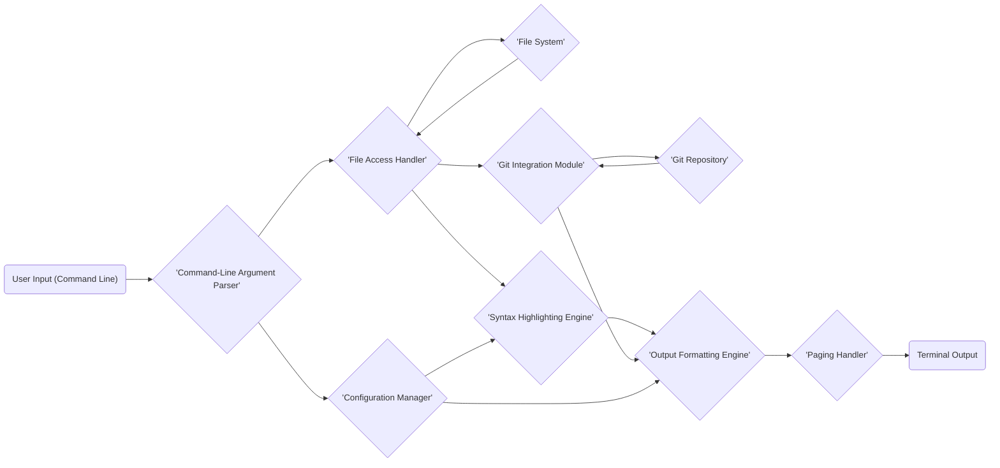

## Project Design Document: `bat` - A Cat Clone with Wings (Improved)

**Document Version:** 1.1
**Date:** October 26, 2023
**Author:** AI Software Architect

### 1. Introduction

This document provides an enhanced and more detailed design overview of the `bat` utility, a command-line tool that serves as a `cat` clone with syntax highlighting and Git integration. This document aims to provide a comprehensive and precise understanding of the system's architecture, components, and data flow. This detailed design will serve as the foundation for subsequent threat modeling activities, enabling a thorough analysis of potential security vulnerabilities.

### 2. Goals

*   Provide a clear and detailed description of the architecture and individual components of the `bat` utility, including their specific responsibilities.
*   Accurately illustrate the data flow within the application, highlighting the transformations and interactions between components.
*   Precisely identify key interactions with the operating system and external resources, specifying the nature of these interactions.
*   Establish a robust and comprehensive foundation for identifying potential security vulnerabilities and attack vectors during the threat modeling process.

### 3. Project Overview

`bat` is a modern command-line utility, developed in Rust, that significantly improves upon the functionality of the standard `cat` command. Its core function is to display the contents of files with visually appealing syntax highlighting, making code, configuration files, and other structured text significantly easier to read directly in the terminal. Furthermore, it seamlessly integrates with Git to display inline modifications relative to the staging area or the last commit, providing valuable context for code review and understanding changes.

### 4. System Architecture

The `bat` utility is designed with a modular architecture, comprising several distinct components that collaborate to process and present file content.

#### 4.1. Components

*   **Command-Line Argument Parser (`clap` crate usage):** This initial component leverages a library like `clap` to meticulously parse the arguments provided by the user when invoking `bat`. It identifies the target file paths, various operational options (e.g., specifying a language, choosing a theme, toggling line numbers), and flags that modify behavior.
*   **File Access Handler (Rust's `std::fs`):** This component is responsible for securely managing the reading of file content from the underlying file system. It utilizes Rust's standard library (`std::fs`) to handle file opening, reading the file's bytes, and robustly managing potential errors related to file access permissions, non-existent files, or other I/O issues.
*   **Syntax Highlighting Engine (`syntect` crate):** This central component is powered by a dedicated syntax highlighting library, most notably `syntect`. It analyzes the file content based on either explicitly specified language or automatic language detection (based on file extension or content). It then applies appropriate color codes and formatting rules defined by language grammars and themes.
*   **Git Integration Module (`git2` crate or command execution):** This component facilitates the integration with Git repositories. It determines if the target file resides within a Git repository and, if so, retrieves information about modifications. This might involve using a Git library like the `git2` crate for direct interaction with the Git repository or executing Git commands as subprocesses.
*   **Output Formatting Engine (Custom logic):** This component takes the syntax-highlighted content from the highlighting engine and the Git diff information (if available) and meticulously formats it for optimal display in the terminal. This includes adding line numbers (optionally), visually representing Git modifications (added, modified, deleted lines with distinct markers), and applying the visual styles defined by the selected theme.
*   **Paging Handler (Conditional execution of `less` or `more`):** This component intelligently manages the output to the terminal. If the output is determined to be longer than the visible terminal height or if the user has configured `bat` to always use a pager, it spawns a subprocess to execute a pager program (such as `less` or `more`) and pipes the formatted output to it.
*   **Configuration Manager (`directories` and `serde` crates):** This component is responsible for loading and managing `bat`'s configuration settings. It typically uses libraries like `directories` to locate the user's configuration directory and `serde` to deserialize configuration data (likely in TOML or YAML format) from configuration files. This includes themes, language associations, and other user preferences.

#### 4.2. Data Flow

The following diagram illustrates the typical sequence of data flow within the `bat` utility:

**Detailed Data Flow Description:**

1. **User Input (Command Line):** The user initiates the process by invoking the `bat` command in the terminal, providing file paths and any desired optional arguments.
2. **Command-Line Argument Parser:** The argument parser meticulously analyzes the command-line input to precisely determine the target files and all user-specified options and flags that influence `bat`'s behavior.
3. **Configuration Manager:** The configuration manager loads user-specific preferences and settings from configuration files, including the selected theme for syntax highlighting and any custom language associations.
4. **File Access Handler:** The file access handler securely attempts to open and read the raw byte content of the specified files directly from the **File System**, handling potential errors gracefully.
5. **Syntax Highlighting Engine:** The raw file content is then passed to the syntax highlighting engine. This engine utilizes language grammars (potentially loaded based on configuration or automatic detection) to apply appropriate syntax highlighting rules, adding color codes and formatting.
6. **Git Integration Module:** If the processed file resides within a Git repository, the Git integration module interacts with the **Git Repository** to retrieve relevant diff information, indicating changes made to the file.
7. **Output Formatting Engine:** The syntax-highlighted content and any retrieved Git diff information are combined and carefully formatted according to the user's selected theme and specified options, including the addition of line numbers and visual markers for Git modifications.
8. **Paging Handler:** The paging handler determines if the formatted output exceeds the terminal's display capacity or if the user has configured `bat` to always use a pager. If so, it pipes the output to an external pager program.
9. **Terminal Output:** Finally, the fully formatted output is displayed to the user in their terminal, either directly or through the invoked pager program.

#### 4.3. Interactions with External Systems

*   **File System (Operating System):** `bat` directly interacts with the underlying operating system's file system to perform essential operations such as reading the content of specified files. This involves standard system calls for file manipulation, including `open`, `read`, and `close`.
*   **Git Repository (Local or Networked):** When processing files within a Git repository, `bat` interacts with the local Git repository (or potentially a networked repository in some scenarios) to retrieve diff information. This interaction might involve executing Git commands via subprocesses or utilizing a Git library for more direct access to repository data.
*   **Pager Programs (e.g., `less`, `more`, `vimpager`):** `bat` can optionally pipe its formatted output to external pager programs like `less`, `more`, or `vimpager`. This involves creating a separate subprocess for the pager and managing the standard input/output streams to pass the formatted content.
*   **Terminal (User Interface):** `bat` writes the final formatted output directly to the user's terminal's standard output stream. The terminal interprets the ANSI escape codes embedded in the output to render the syntax highlighting and other formatting.
*   **Configuration Files (Local File System):** `bat` reads configuration files, typically stored in a user-specific configuration directory on the local file system. These files, often in TOML or YAML format, contain user preferences and settings that customize `bat`'s behavior.

### 5. Security Considerations (Detailed)

This section provides a more detailed overview of potential security considerations based on the system architecture. This will be further elaborated upon during the dedicated threat modeling process.

*   **Path Traversal Vulnerabilities (File Access Handler):** The File Access Handler must be meticulously implemented to prevent path traversal vulnerabilities. Malicious users could potentially provide crafted file paths (e.g., using `../`) to access files outside of the intended directories, leading to unauthorized information disclosure. Input validation and sanitization are crucial here.
*   **Command Injection Vulnerabilities (Git Integration and Paging Handler):** If `bat` relies on executing external commands (e.g., for Git integration or invoking the pager), there is a potential risk of command injection. If user-provided input (e.g., file names with special characters) is not properly sanitized before being passed as arguments to these external commands, attackers could inject arbitrary commands for execution.
*   **Denial of Service (DoS) Attacks (Syntax Highlighting Engine and File Access Handler):** Processing exceptionally large files or files containing specific patterns designed to exploit vulnerabilities in the syntax highlighting engine could lead to excessive CPU or memory consumption, resulting in a denial of service. Similarly, attempting to open an extremely large number of files could exhaust system resources.
*   **Configuration File Security (Configuration Manager):** The configuration files themselves represent a potential attack vector. If these files are not stored with appropriate permissions or if the parsing logic is flawed, malicious users could modify the configuration to inject harmful data or alter `bat`'s behavior in unintended ways.
*   **Supply Chain Vulnerabilities (Dependencies):** `bat` relies on external libraries (crates in the Rust ecosystem) for core functionalities like syntax highlighting (`syntect`) and argument parsing (`clap`). Vulnerabilities in these dependencies could directly impact the security of `bat`. Regular dependency audits and updates are essential.
*   **Information Disclosure (Git Integration):** While intended functionality, the Git integration reveals information about the file's modification status. In certain sensitive environments, this information disclosure itself might be a concern.
*   **Terminal Escape Sequence Injection (Output Formatting Engine):** Although less critical, vulnerabilities in the output formatting logic could potentially allow the injection of malicious terminal escape sequences that could manipulate the user's terminal.

### 6. Deployment

`bat` is typically deployed as a statically linked, standalone command-line executable. Users can download pre-built binaries for their respective operating systems or compile it from source using the Rust toolchain. Installation usually involves placing the executable in a directory included in the system's PATH environment variable, making it readily accessible from the command line. No server-side components or complex deployment procedures are required.

### 7. Future Considerations

*   **Sandboxing Techniques:** Exploring and implementing sandboxing techniques could further enhance security by isolating file access operations and the execution of external commands, limiting the potential impact of vulnerabilities.
*   **Plugin System Security:** If a plugin system is introduced to extend `bat`'s functionality, rigorous security measures will be necessary to prevent malicious plugins from compromising the system. This includes secure plugin loading mechanisms, permission models, and code signing.
*   **Remote File Access Security:** If future versions incorporate the ability to access remote files (e.g., via protocols like HTTP or SSH), new security considerations related to secure network communication, authentication, and authorization will need to be addressed.
*   **Improved Error Handling and Security Logging:** Enhancing error handling to prevent sensitive information leakage in error messages and implementing robust security logging can aid in detecting and responding to potential attacks.

This improved document provides a more detailed and comprehensive design overview of the `bat` utility. It offers a stronger foundation for understanding the system's intricate architecture and will be invaluable for conducting a thorough and effective threat modeling exercise to proactively identify and mitigate potential security vulnerabilities.
