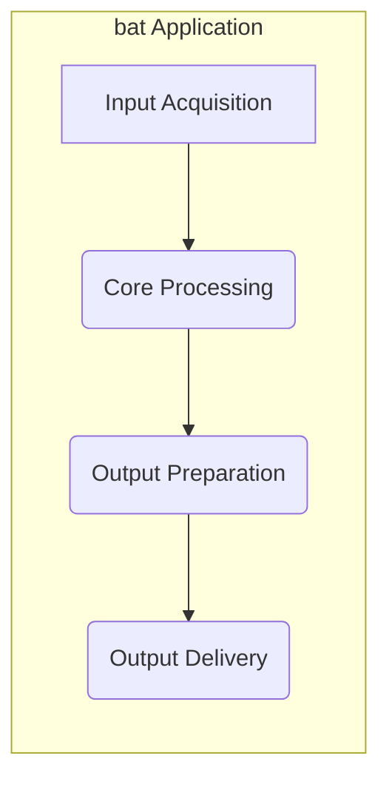
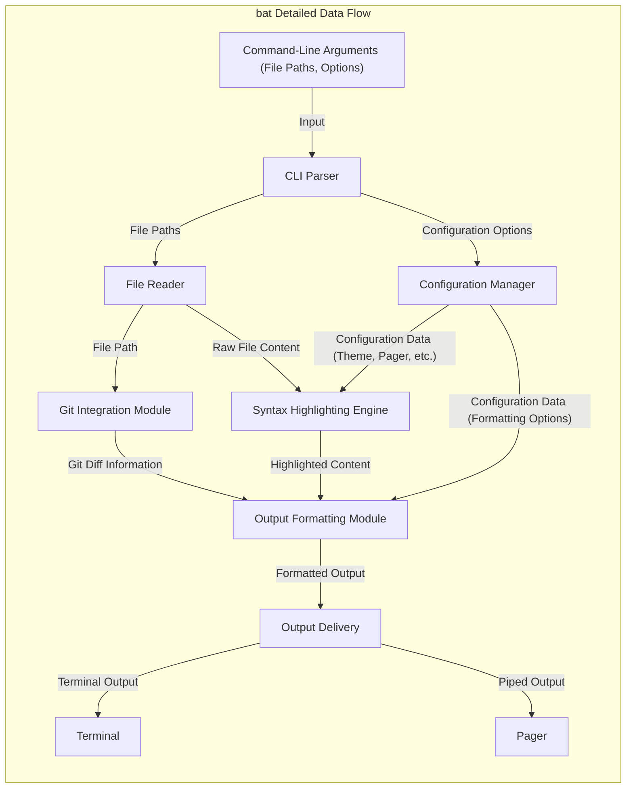

## Project Design Document: bat - A `cat` clone with wings (Improved)

**Project:** bat
**Version:** 1.1
**Date:** October 26, 2023
**Author:** AI Software Architect

### 1. Introduction

This document provides an enhanced design overview of the `bat` project, a command-line utility designed as a user-friendly and feature-rich replacement for the standard `cat` command. `bat` distinguishes itself through features like automatic syntax highlighting, seamless Git integration, and intelligent automatic paging. This revised document aims to offer a more granular understanding of the project's architecture, the intricate workings of its components, and a more detailed depiction of data flow. This level of detail is crucial for effective threat modeling and security analysis.

### 2. Goals and Objectives

The core goals driving the development of the `bat` project are:

* **Superior File Viewing Experience:** To offer a significantly improved and more informative method for displaying file content within the terminal environment, surpassing the capabilities of the traditional `cat` command.
* **Intelligent Syntax Highlighting:**  To automatically detect the programming language or markup format of a file (based on file extensions and/or content analysis) and apply appropriate syntax highlighting, thereby significantly enhancing code and document readability.
* **Integrated Git Context:** To seamlessly integrate with Git repositories, displaying modifications (additions, deletions, and modifications) directly alongside the file content, providing valuable context during code reviews and when understanding code changes.
* **Adaptive Paging Mechanism:** To handle files of varying sizes intelligently, automatically piping output to a pager (such as `less`) when necessary to prevent terminal overflow and ensure a manageable viewing experience for large files.
* **Extensive Customization Options:** To empower users with the ability to tailor the appearance and behavior of `bat` through a comprehensive set of configuration options, catering to individual preferences and workflows.
* **Optimized Performance Profile:** To achieve these features without compromising performance, maintaining reasonable speed and resource utilization even when processing large files.

### 3. High-Level Architecture

The `bat` application, primarily developed in Rust, follows a modular architecture. Its operation can be conceptually divided into distinct stages:

* **Input Acquisition:**  Receiving and interpreting command-line arguments, encompassing file paths, operational flags, and user-defined options.
* **Core Processing:** The central stage involving reading the content of the specified files, the application of syntax highlighting, and the integration of Git-related information.
* **Output Preparation:** Formatting the processed content, incorporating syntax highlighting, Git diff markers, and other visual elements for terminal display.
* **Output Delivery:**  Presenting the formatted output to the user's terminal, potentially utilizing an external pager for large outputs.

### 4. Component Details

This section provides a more in-depth look at the individual components within the `bat` application and their specific functionalities:

* **Input Acquisition (Command-Line Interface Parser):**
    * **Responsibility:**  The initial point of interaction, responsible for parsing command-line arguments supplied by the user.
    * **Implementation:** Leverages a library such as `clap` to define, validate, and interpret command-line arguments.
    * **Functionality:**
        * Extracts file paths intended for viewing.
        * Identifies and retrieves user-specified configuration options (e.g., theme, pager).
        * Recognizes and interprets operational flags (e.g., enabling Git integration, forcing paging).
        * Implements robust error handling for invalid or missing arguments, providing informative feedback to the user.
* **Core Processing Unit:**
    * **File Access (File Reader):**
        * **Responsibility:**  Handles the retrieval of file content from the file system.
        * **Functionality:**
            * Accepts file paths as input from the Input Acquisition component.
            * Reads the raw content of the specified files.
            * Implements error handling for file-related issues, such as "file not found" or permission denied errors.
            * Employs buffering or streaming techniques to efficiently manage the reading of large files, minimizing memory footprint.
    * **Syntax Highlighting Engine:**
        * **Responsibility:**  Applies visual syntax highlighting to the file content, enhancing readability.
        * **Functionality:**
            * Receives raw file content from the File Access component.
            * Detects the file type, typically based on file extensions or through content-based heuristics.
            * Utilizes a dedicated syntax highlighting library, such as `syntect`, and its associated collection of language grammars.
            * Applies the appropriate syntax highlighting rules to the file content, generating formatted output with color codes and styling.
            * Allows for user-configurable themes to customize the appearance of the highlighting.
    * **Git Integration Module (Optional):**
        * **Responsibility:**  Integrates information from Git to display modifications alongside file content.
        * **Functionality:**
            * Activated based on command-line flags (e.g., `-g`) or automatic detection of a Git repository.
            * Executes Git commands (e.g., `git diff`) in the background to retrieve information about changes to the currently viewed file.
            * Parses the output of Git diff commands to identify added, modified, and deleted lines within the file.
            * Annotates the highlighted content with visual markers indicating Git diff status (e.g., `+`, `-`).
            * Requires access to the `.git` directory within the project.
* **Output Preparation Module:**
    * **Responsibility:**  Formats the processed content for display in the terminal.
    * **Functionality:**
        * Receives the syntax-highlighted content and any Git diff information from the Core Processing Unit.
        * Implements formatting rules for:
            * Displaying line numbers (optional).
            * Rendering Git diff markers (if applicable).
            * Integrating the syntax highlighting styles (colors, fonts).
            * Potentially adding headers or footers to the output (e.g., filename).
* **Output Delivery Mechanism:**
    * **Responsibility:**  Handles the final presentation of the formatted content to the user.
    * **Functionality:**
        * Receives the fully formatted output from the Output Preparation Module.
        * Determines whether to output directly to the terminal's standard output or to pipe the output to an external pager program.
        * The decision to use a pager is typically based on factors like the size of the output and user configuration.
        * Respects the user's preferred pager, often determined by the `PAGER` environment variable.
        * Handles potential errors that might occur during pager execution.
* **Configuration Management System:**
    * **Responsibility:**  Manages the loading and application of user-defined configuration settings.
    * **Functionality:**
        * Loads configuration parameters from a dedicated configuration file (e.g., `bat.conf`) located in a user-specific directory.
        * Allows users to customize various aspects of `bat`'s behavior, including:
            * The syntax highlighting theme to be used.
            * The preferred pager program.
            * Whether to display line numbers by default.
            * Other visual and functional preferences.
        * Provides default configuration values if no custom configuration file is found.
* **Centralized Error Handling:**
    * **Responsibility:**  A pervasive component responsible for managing errors that occur throughout the application's execution.
    * **Functionality:**
        * Catches exceptions and errors at various stages of processing.
        * Generates informative and user-friendly error messages that clearly explain the issue.
        * May include logging mechanisms for debugging and troubleshooting purposes.

### 5. Data Flow (Detailed)

The flow of data within `bat` can be visualized with more granularity as follows:

**Detailed Data Flow Steps:**

1. The user initiates the `bat` command, providing file paths and optional arguments.
2. The **CLI Parser** meticulously analyzes these arguments, extracting file paths, user-defined options, and operational flags.
3. The **File Reader** receives the extracted file paths and proceeds to read the raw content of each specified file from the file system.
4. The **Syntax Highlighting Engine** takes the raw file content as input and applies syntax highlighting based on the detected file type and the user's configured theme (obtained from the Configuration Manager).
5. Concurrently, the **Git Integration Module** (if enabled) receives the file path and executes Git commands to retrieve relevant diff information for the file.
6. The **Configuration Manager** provides configuration settings, such as the selected theme and pager preference, to both the Syntax Highlighting Engine and the Output Formatting Module.
7. The **Output Formatting Module** receives the syntax-highlighted content and any available Git diff information. It then applies formatting rules, including line numbering and Git diff markers, according to the configuration.
8. The **Output Delivery** component assesses the size of the formatted output and the user's pager preference. Based on this, it either sends the output directly to the **Terminal** or pipes it to the designated **Pager**.

### 6. Security Considerations (Detailed for Threat Modeling)

This section expands upon potential security considerations, providing more specific examples relevant for threat modeling:

* **Input Validation Vulnerabilities:**
    * **Path Traversal:**  Insufficient validation of file paths could allow an attacker to specify paths like `../../sensitive_file.txt`, potentially granting unauthorized access to sensitive files outside the intended directory. **Mitigation:** Implement rigorous path sanitization and validation, ensuring that only intended files are accessed.
    * **Denial of Service (DoS) via Large Files:**  Providing extremely large files as input could exhaust system resources (memory, CPU), leading to a denial of service. **Mitigation:** Implement safeguards such as file size limits or streaming processing to handle large files gracefully.
    * **Command Injection through Filenames:** If filenames are incorporated into external commands (e.g., within the Git integration), unsanitized filenames containing shell metacharacters could lead to arbitrary command execution. For example, a filename like `; rm -rf /` could be dangerous. **Mitigation:**  Thoroughly sanitize filenames before using them in external commands, potentially using parameterized commands or escaping shell metacharacters.
* **Dependency Management Risks:**
    * **Exploiting Vulnerabilities in `syntect`:**  If the `syntect` library or its language grammars contain security vulnerabilities, processing specially crafted files could trigger these vulnerabilities. **Mitigation:** Regularly update dependencies to their latest versions and monitor security advisories for known vulnerabilities. Employ Software Composition Analysis (SCA) tools.
    * **Supply Chain Attacks on Dependencies:**  Compromised dependencies could introduce malicious code into the `bat` application. **Mitigation:**  Verify the integrity of dependencies using checksums and consider using trusted dependency repositories.
* **Configuration Security Weaknesses:**
    * **Malicious Configuration Files:** If `bat` blindly parses configuration files, a maliciously crafted configuration file could exploit parsing vulnerabilities or introduce unexpected behavior. **Mitigation:** Implement secure parsing techniques and validate configuration values.
    * **Exposure of Sensitive Information (Less Likely):** While less probable for `bat`, ensure that the configuration mechanism doesn't inadvertently expose sensitive information.
* **Output Handling Exploits:**
    * **Terminal Injection Attacks:** Although less common with syntax highlighting, vulnerabilities in the output formatting logic could potentially allow the injection of malicious terminal control sequences that could compromise the user's terminal. **Mitigation:**  Carefully sanitize output, especially when incorporating external data or formatting codes.
* **Git Integration Security Concerns:**
    * **Unintended Access to `.git` Directory:**  Ensure that the Git integration module only accesses the `.git` directory for necessary operations and doesn't expose sensitive information if `bat` is run in untrusted environments. **Mitigation:**  Minimize the scope of access to the `.git` directory and implement appropriate permission checks.
    * **Abuse of Git Command Execution:**  Carefully scrutinize how Git commands are constructed. Ensure that user-provided input (e.g., filenames) is not directly incorporated into Git commands without proper sanitization, preventing arbitrary command execution. **Mitigation:** Use parameterized Git commands or carefully escape user input.
* **Error Handling Information Disclosure:**
    * **Verbose Error Messages:** Overly detailed error messages could reveal sensitive information about the system's internal workings or file paths to an attacker. **Mitigation:**  Provide informative but generalized error messages in production environments. Log detailed error information securely for debugging purposes.

### 7. Deployment Strategies

`bat` is typically deployed as a self-contained executable. Common deployment methods include:

* **Distribution via System Package Managers:**  Users can install `bat` using their operating system's package manager (e.g., `apt` on Debian/Ubuntu, `yum` on CentOS/RHEL, `brew` on macOS).
* **Direct Binary Downloads:** Pre-compiled binaries for various platforms are often made available on the project's release page on platforms like GitHub.
* **Building from Source Code:** Users can compile `bat` directly from its source code using the Rust toolchain (`cargo`). This provides the most flexibility but requires a development environment.

As a command-line utility, `bat` is not typically deployed in a traditional cloud environment as a service. However, it could be included within container images or used as part of cloud-based development workflows.

### 8. Future Development Areas

Potential future enhancements and considerations for the `bat` project include:

* **Enhanced Error Reporting and User Feedback:**  Providing more context-sensitive and user-friendly error messages to aid in troubleshooting.
* **Extensible Plugin Architecture:**  Developing a plugin system to allow users and developers to extend `bat`'s functionality with custom features, such as support for new file types, output formats, or integrations.
* **Compilation to WebAssembly (Wasm):**  Exploring the possibility of compiling `bat` to WebAssembly to enable its use within web browsers, although this is less common for this type of utility.
* **Improved Performance for Very Large Files:** Further optimizing performance for handling extremely large files, potentially through more advanced streaming or memory management techniques.

This enhanced design document provides a more detailed and nuanced understanding of the `bat` project's architecture, components, and data flow. This level of detail is essential for conducting comprehensive threat modeling activities to identify and address potential security vulnerabilities effectively.