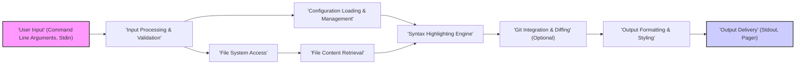

# Project Design Document: bat - A cat(1) clone with wings (Improved)

## 1. Project Overview

### 1.1. Project Name
bat - A cat(1) clone with wings

### 1.2. Project Description
`bat` is a command-line tool designed as a modern and feature-rich alternative to the standard `cat` utility. It enhances the command-line file viewing experience by providing syntax highlighting for a wide array of programming and markup languages, integrating with Git to display file modifications directly in the output, and offering a customizable and user-friendly interface.  `bat` aims to be a drop-in replacement for `cat` for users who desire more informative and visually appealing output when viewing file contents in the terminal.

### 1.3. Project Goals
*   **Enhanced Core Functionality:**  Serve as a superior replacement for `cat`, offering all standard `cat` functionalities and more.
*   **Rich Syntax Highlighting:**  Automatically detect and apply syntax highlighting for a broad spectrum of languages and file formats.
*   **Git Integration for Context:**  Visually display Git modifications (additions, modifications, deletions) inline with the file content for better code context.
*   **Extensive Customization:**  Empower users to tailor the appearance and behavior of `bat` through configuration files and command-line options to suit individual preferences.
*   **Broad Platform Support:**  Ensure seamless operation across major operating systems including Linux, macOS, and Windows.
*   **Optimized Performance:**  Maintain efficient performance and resource usage for typical command-line file viewing tasks.

## 2. System Architecture

### 2.1. High-Level Architecture Diagram

### 2.2. Component Description

*   **"User Input (Command Line Arguments, Stdin)"**:
    *   Description: This is the entry point of `bat`, responsible for receiving commands and data from the user, either through command-line arguments or standard input.
    *   Functionality:
        *   Parses command-line arguments using a robust argument parsing library (like `clap` in Rust), handling options, flags, and file paths.
        *   Detects and manages input from standard input (stdin) when `bat` is used in a pipeline.
        *   Provides initial input data to the "Input Processing & Validation" component.

*   **"Input Processing & Validation"**:
    *   Description: This component refines and validates the raw user input, ensuring it's in the correct format and within acceptable parameters before further processing.
    *   Functionality:
        *   Validates command-line arguments and options against defined rules, reporting errors for invalid input.
        *   Determines the input source (files specified as arguments or data from stdin).
        *   Handles potential errors related to user input, such as incorrect option usage or invalid file paths.
        *   Prepares validated file paths and processing instructions for subsequent components.

*   **"Configuration Loading & Management"**:
    *   Description: This component manages the loading and application of configuration settings from various sources, allowing users to customize `bat`'s behavior.
    *   Functionality:
        *   Loads configuration files from standard locations (e.g., user's home directory, system-wide configuration directories) in formats like TOML or YAML.
        *   Parses configuration files and handles potential parsing errors gracefully.
        *   Manages configuration settings including:
            *   Syntax highlighting theme selection.
            *   Language-specific configurations and file extension mappings.
            *   Display options (line numbers, grid style, word wrapping, etc.).
            *   Pager preferences and behavior.
        *   Provides configuration data to other components as needed.

*   **"File System Access"**:
    *   Description: This component handles all interactions with the file system, specifically reading the content of files specified by the user.
    *   Functionality:
        *   Opens files based on the provided file paths, respecting file system permissions.
        *   Handles file access errors, such as "file not found" or "permission denied", reporting them to the user.
        *   Reads file content efficiently, potentially using buffered I/O for performance.
        *   Passes the raw file content to the "File Content Retrieval" component.

*   **"File Content Retrieval"**:
    *   Description: This component represents the in-memory representation of the raw file content read from the file system. It acts as a data carrier for the file's bytes.
    *   Functionality:
        *   Stores the raw byte data of the file content in memory.
        *   Provides access to the file content for the "Syntax Highlighting Engine".
        *   May handle character encoding detection if needed for syntax highlighting.

*   **"Syntax Highlighting Engine"**:
    *   Description: This is the core component responsible for applying syntax highlighting to the file content based on the detected language and selected theme.
    *   Functionality:
        *   Detects the programming or markup language of the file. Language detection can be based on:
            *   File extension.
            *   Shebang line (e.g., `#!/bin/python`).
            *   Content analysis heuristics.
        *   Loads appropriate syntax definitions for the detected language from a library like `syntect` in Rust.
        *   Applies syntax highlighting rules to the file content, generating styled output with color codes and formatting.
        *   Passes the syntax-highlighted content to the "Git Integration & Diffing" component.

*   **"Git Integration & Diffing (Optional)"**:
    *   Description: This component adds Git integration, enhancing the output by displaying inline Git diff information for files within Git repositories. This is an optional feature, configurable by the user.
    *   Functionality:
        *   Checks if the file being processed is within a Git repository.
        *   If in a Git repository and Git integration is enabled:
            *   Uses Git commands (e.g., `git diff`) to determine lines that have been added, modified, or deleted compared to the Git staging area or a specific commit.
            *   Annotates the syntax-highlighted output with visual markers indicating Git modifications (e.g., using different colors or symbols for added, modified, deleted lines).
        *   Passes the output (with or without Git annotations) to the "Output Formatting & Styling" component.

*   **"Output Formatting & Styling"**:
    *   Description: This component is responsible for the final formatting and styling of the highlighted content before it's displayed to the user.
    *   Functionality:
        *   Applies formatting options based on user configuration and command-line arguments, including:
            *   Adding line numbers to the output.
            *   Drawing a grid or borders around the output.
            *   Handling word wrapping and terminal width constraints.
            *   Applying user-selected themes for colors and styles.
        *   Prepares the final formatted output string, including ANSI escape codes for colors and styling.
        *   Passes the formatted output to the "Output Delivery" component.

*   **"Output Delivery (Stdout, Pager)"**:
    *   Description: This is the final stage, responsible for delivering the formatted output to the user, either directly to the standard output or through a pager for better navigation of long files.
    *   Functionality:
        *   Determines if the output should be piped to a pager based on configuration, output length, or user preference.
        *   If paging is required or enabled, pipes the output to a pager program (e.g., `less`, `more`).
        *   Otherwise, writes the formatted output directly to standard output (stdout).
        *   Manages terminal interactions with the pager if one is used, allowing users to scroll and navigate the output.

## 3. Data Flow Description

The data flow in `bat` follows these steps:

1.  **User Input:** The user provides input to `bat` through command-line arguments (file paths, options) and potentially standard input (stdin).
2.  **Input Processing & Validation:** The "Input Processing & Validation" component parses, validates, and prepares the user input for further processing.
3.  **Configuration Loading & Management:** The "Configuration Loading & Management" component loads and applies user-defined configuration settings, customizing `bat`'s behavior.
4.  **File System Access:** For each specified file, the "File System Access" component reads the raw file content from the file system.
5.  **File Content Retrieval:** The "File Content Retrieval" component stores the raw file content in memory, making it available for processing.
6.  **Syntax Highlighting Engine:** The "Syntax Highlighting Engine" detects the language of the file and applies syntax highlighting to the content using loaded syntax definitions and the selected theme.
7.  **Git Integration & Diffing (Optional):** If enabled and applicable, the "Git Integration & Diffing" component retrieves Git diff information and annotates the highlighted output with modification markers.
8.  **Output Formatting & Styling:** The "Output Formatting & Styling" component applies final formatting options (line numbers, grid, etc.) and styling to the highlighted content, preparing it for display.
9.  **Output Delivery:** The "Output Delivery" component sends the formatted output to the user, either directly to standard output or through a pager for comfortable viewing.

## 4. Technology Stack

*   **Programming Language:** Rust (chosen for its performance, safety, and modern features)
*   **Command-line Argument Parsing:** `clap` crate (for robust and user-friendly command-line argument parsing)
*   **Configuration File Parsing:** `serde` and `toml` crates (for handling TOML configuration files), or potentially `yaml-rust` for YAML support if needed.
*   **Syntax Highlighting:** `syntect` crate (a powerful syntax highlighting engine based on Sublime Text syntax definitions, offering a wide range of language support and themes).
*   **Git Integration:** `git2-rs` crate (for safe and efficient interaction with Git repositories and Git commands).
*   **Terminal Interaction:**
    *   `termcolor` crate (for cross-platform terminal color support).
    *   `terminalsize` crate (for determining terminal dimensions).
    *   `pager` crate (or similar, for handling output paging).
*   **Standard Library:** Extensive utilization of Rust's standard library for core functionalities like file I/O, string manipulation, data structures, and general utilities.

## 5. Deployment Model

`bat` is designed for deployment as a standalone, command-line executable, emphasizing ease of installation and use across different platforms.

*   **Distribution:** Distributed as pre-compiled, platform-specific binaries for major operating systems (Linux, macOS, Windows). Distribution channels include:
    *   Package managers (e.g., `apt`, `brew`, `choco`) for simplified installation on various systems.
    *   Direct downloads from the project's GitHub Releases page for users who prefer manual installation or for systems without package manager support.
*   **Installation:** Users install `bat` by downloading the appropriate binary for their operating system and placing it in a directory included in their system's `PATH` environment variable, making it accessible from the command line.
*   **Usage:** Users interact with `bat` directly from the command line, invoking it with file paths and desired options as arguments. It is designed to be a drop-in replacement for `cat` in most scenarios.
*   **Configuration:** User-specific configuration is managed through configuration files typically located in user's home directories (e.g., `.config/bat/config.toml` on Linux). System-wide configuration may also be supported in appropriate system directories.

## 6. Security Considerations (For Threat Modeling)

These security considerations are initial points for a more in-depth threat modeling exercise.

*   **Configuration File Parsing Vulnerabilities:**
    *   **Deserialization Attacks:** Vulnerabilities in TOML or YAML parsing libraries could be exploited through maliciously crafted configuration files, potentially leading to arbitrary code execution if deserialization flaws exist (e.g., YAML deserialization vulnerabilities).
    *   **Path Traversal in Configuration:** If configuration files allow specifying paths (e.g., for themes or syntax definitions), improper validation could lead to path traversal vulnerabilities, allowing access to files outside the intended configuration directory.

*   **Syntax Highlighting Engine Vulnerabilities:**
    *   **Regex Denial of Service (ReDoS):**  Complex regular expressions used in syntax definition files (e.g., for `syntect`) could be vulnerable to ReDoS attacks. Maliciously crafted files could exploit these regexes to cause excessive CPU consumption, leading to denial of service.
    *   **Syntax Definition Injection:** If syntax definitions are loaded from external sources or user-provided files, there's a risk of malicious syntax definitions being injected to cause unexpected behavior or exploit vulnerabilities in the highlighting engine.

*   **File System Access Control Vulnerabilities:**
    *   **Path Traversal:** Improper handling of file paths provided as command-line arguments could lead to path traversal vulnerabilities, allowing users to access or display files outside of intended directories.
    *   **Symlink Following:** Uncontrolled following of symbolic links could allow attackers to bypass access controls and access files they shouldn't be able to read. `bat` should carefully consider symlink behavior and potentially restrict or control symlink traversal.

*   **Git Integration Security Vulnerabilities:**
    *   **Command Injection:** If Git commands are constructed using user-provided input without proper sanitization, command injection vulnerabilities could arise. Maliciously crafted filenames or directory names could be used to inject arbitrary commands into the Git commands executed by `bat`.

*   **Dependency Security:**
    *   **Vulnerable Dependencies:** `bat` relies on numerous external Rust crates. Vulnerabilities in these dependencies (e.g., in `syntect`, `clap`, `git2-rs`, etc.) could directly impact `bat`'s security. Regular dependency scanning and updates are crucial to mitigate this risk.

*   **Output Handling and Terminal Escape Sequence Injection:**
    *   **ANSI Escape Sequence Injection:** Improper sanitization of output, especially when incorporating syntax highlighting and Git diff markers using ANSI escape sequences, could lead to terminal escape sequence injection vulnerabilities. Maliciously crafted file content could inject escape sequences to manipulate the user's terminal in unintended ways (e.g., execute commands, modify terminal settings).

*   **Resource Exhaustion:**
    *   **Large File Processing:** Processing extremely large files or files with very long lines could lead to excessive memory consumption or CPU usage, potentially causing denial of service or performance degradation.
    *   **Complex Syntax Highlighting:**  Files with extremely complex syntax or very long lines might require significant processing by the syntax highlighting engine, potentially leading to resource exhaustion.

This improved design document provides a more detailed and refined understanding of `bat`'s architecture and includes expanded security considerations. This document will serve as a stronger foundation for conducting a comprehensive threat modeling exercise to identify and address potential security vulnerabilities in the `bat` project.