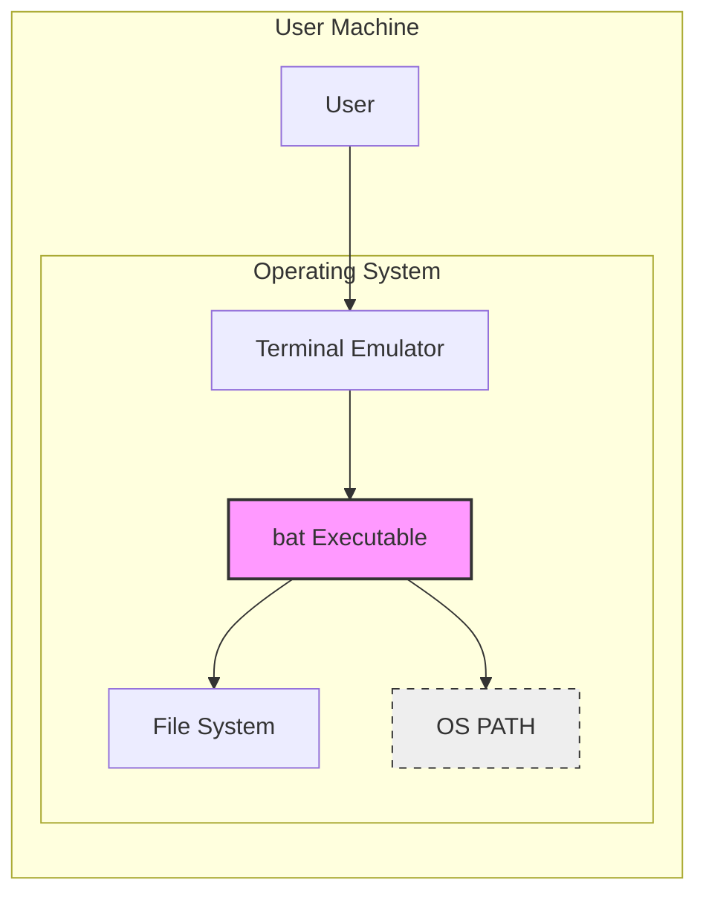

# BUSINESS POSTURE

- Business Priorities and Goals:
 - Enhance command-line user experience by providing a visually appealing and feature-rich alternative to standard file viewing utilities like `cat`.
 - Improve developer productivity by offering syntax highlighting for various programming languages and integration with Git for version control context.
 - Maintain a lightweight, fast, and cross-platform command-line tool that is easy to install and use.
 - Foster an open-source community around the project, encouraging contributions and ensuring long-term sustainability.

- Business Risks:
 - Security vulnerabilities in the tool could be exploited by malicious actors if `bat` is used to view untrusted files.
 - Dependency vulnerabilities in third-party libraries used by `bat` could introduce security risks.
 - Lack of adoption by users if the tool is perceived as unreliable, slow, or incompatible with common workflows.
 - Community stagnation if contributions decline, leading to slow bug fixes and feature development.

# SECURITY POSTURE

- Existing Security Controls:
 - security control: Open Source Code - The source code is publicly available on GitHub, allowing for community review and identification of potential vulnerabilities. Implemented in: GitHub repository.
 - security control: Written in Rust - Rust is a memory-safe language, reducing the risk of common vulnerabilities like buffer overflows and dangling pointers. Implemented in: Project codebase.
 - security control: Use of established crates - The project likely uses well-vetted and widely used Rust crates, reducing the risk of introducing vulnerabilities from custom or less-maintained libraries. Implemented in: `Cargo.toml` dependencies.
 - accepted risk: Reliance on third-party crates - The project depends on external crates, which could contain vulnerabilities that are not immediately known or patched. Accepted risk: Dependency management.
 - accepted risk: Potential for undiscovered vulnerabilities - As with any software, there is always a possibility of undiscovered vulnerabilities in the `bat` codebase itself. Accepted risk: Software development inherent risk.

- Recommended Security Controls:
 - security control: Dependency Scanning - Implement automated dependency scanning to identify and alert on known vulnerabilities in third-party crates used by `bat`. Recommended implementation: Integrate dependency scanning tools into CI/CD pipeline.
 - security control: Static Analysis Security Testing (SAST) - Integrate SAST tools into the development process to automatically analyze the codebase for potential security flaws. Recommended implementation: Integrate SAST tools into CI/CD pipeline.
 - security control: Fuzzing - Perform fuzz testing to discover unexpected behavior and potential vulnerabilities by providing invalid or malformed inputs to `bat`. Recommended implementation: Integrate fuzzing into testing process.
 - security control: Release Signing - Sign release binaries to ensure authenticity and integrity, protecting users from downloading tampered versions. Recommended implementation: Implement binary signing during release process.

- Security Requirements:
 - Authentication: Not applicable. `bat` is a command-line tool executed locally and does not involve user authentication.
 - Authorization: Not applicable. `bat` operates within the permissions of the user executing it and does not require explicit authorization mechanisms.
 - Input Validation:
  - Requirement: `bat` must properly handle and validate file paths provided as input to prevent path traversal vulnerabilities.
  - Requirement: `bat` must handle potentially malicious or malformed files gracefully without crashing or exhibiting unexpected behavior.
  - Requirement: Syntax highlighting logic should be robust and not vulnerable to injection attacks or denial-of-service through specially crafted input files.
 - Cryptography: Not applicable for core functionality. If future features require cryptography, standard best practices for cryptographic implementation should be followed.

# DESIGN

- C4 CONTEXT

```mermaid
flowchart LR
    subgraph "User Context"
        U[Command-Line User]
    end
    subgraph "System Context"
        B["bat"]
    end
    subgraph "External Systems"
        FS[File System]
        T[Terminal]
        GIT[Git (Optional)]
    end

    U --> B
    B --> FS
    B --> T
    B --> GIT
    style B fill:#f9f,stroke:#333,stroke-width:2px
```

- C4 CONTEXT Elements:
 - - Name: Command-Line User
   - Type: Person
   - Description: Developers, system administrators, and general users who use the command line to view file contents.
   - Responsibilities: Provide file paths as input to `bat` and view the formatted output in the terminal.
   - Security controls: User access control on the operating system level.
 - - Name: bat
   - Type: Software System
   - Description: A command-line tool that provides syntax highlighting and Git integration for viewing file contents, acting as a `cat(1)` replacement.
   - Responsibilities: Read file contents from the file system, apply syntax highlighting based on file type, integrate with Git to show version control context, and output formatted text to the terminal.
   - Security controls: Input validation, secure file handling, dependency management, static analysis, fuzzing, release signing.
 - - Name: File System
   - Type: External System
   - Description: The local file system where files to be viewed by `bat` are stored.
   - Responsibilities: Store and provide access to files.
   - Security controls: Operating system file permissions, access control lists.
 - - Name: Terminal
   - Type: External System
   - Description: The terminal emulator application used by the user to interact with `bat` and view its output.
   - Responsibilities: Display text output from `bat`.
   - Security controls: Terminal security features (e.g., sandboxing, process isolation).
 - - Name: Git (Optional)
   - Type: External System
   - Description: Version control system used for optional integration with `bat` to display Git context (e.g., staged/unstaged changes).
   - Responsibilities: Provide version control information to `bat` when invoked within a Git repository.
   - Security controls: Git repository access controls, user authentication to Git services (if remote repositories are involved).

- C4 CONTAINER

```mermaid
flowchart LR
    subgraph "User Context"
        U[Command-Line User]
    end
    subgraph "bat Container"
        BAT_EXE["bat Executable"]
    end
    subgraph "External Systems"
        FS[File System]
        T[Terminal]
        GIT[Git (Optional)]
    end

    U --> BAT_EXE
    BAT_EXE --> FS
    BAT_EXE --> T
    BAT_EXE --> GIT
    style BAT_EXE fill:#f9f,stroke:#333,stroke-width:2px
```

- C4 CONTAINER Elements:
 - - Name: bat Executable
   - Type: Container (Executable)
   - Description: The compiled binary of the `bat` application, written in Rust. This is the single container representing the application as it is a standalone command-line tool.
   - Responsibilities:
    - Parse command-line arguments.
    - Read file contents from the File System.
    - Detect file type and apply appropriate syntax highlighting.
    - Integrate with Git to fetch version control information.
    - Format output for the Terminal.
    - Handle errors and exceptions gracefully.
   - Security controls:
    - Input validation on command-line arguments and file paths.
    - Secure file handling to prevent path traversal and other file-related vulnerabilities.
    - Robust syntax highlighting logic to prevent injection or denial-of-service attacks.
    - Memory safety provided by Rust.
    - Dependency scanning for used crates.
    - Static analysis of the codebase.
    - Fuzzing to identify unexpected behavior.
    - Release signing of the executable.
 - - Name: File System
   - Type: External System
   - Description: The local file system where files are accessed by the `bat` executable.
   - Responsibilities: Provide access to files based on user permissions.
   - Security controls: Operating system file permissions, access control lists.
 - - Name: Terminal
   - Type: External System
   - Description: The terminal emulator that displays the output from the `bat` executable.
   - Responsibilities: Render text output securely.
   - Security controls: Terminal security features.
 - - Name: Git (Optional)
   - Type: External System
   - Description: Git command-line interface used by `bat` to get version control information.
   - Responsibilities: Provide Git repository information when requested by `bat`.
   - Security controls: Git repository access controls.

- DEPLOYMENT

- Deployment Architecture Options:
 - Option 1: User-Managed Installation - Users download pre-built binaries from GitHub Releases or install via package managers (e.g., `apt`, `brew`, `cargo install`) and manually place the executable in their system's PATH.
 - Option 2: Containerized Deployment (Less Common for CLI tools) - While less typical for command-line tools, `bat` could be containerized (e.g., Docker image) for isolated execution. This is not the primary deployment method but is a possibility.

- Detailed Deployment Architecture (Option 1: User-Managed Installation):



- DEPLOYMENT Elements:
 - - Name: User Machine
   - Type: Deployment Environment
   - Description: The user's local computer (laptop, desktop, server) where `bat` is installed and executed.
   - Responsibilities: Provide the environment for running `bat`.
   - Security controls: Operating system security controls, user account management, endpoint security software.
 - - Name: Operating System
   - Type: Infrastructure Component
   - Description: The operating system (e.g., Linux, macOS, Windows) running on the user's machine.
   - Responsibilities: Manage system resources, provide file system access, execute programs.
   - Security controls: OS-level security features (firewall, user permissions, kernel security).
 - - Name: bat Executable
   - Type: Software Component
   - Description: The compiled `bat` binary installed on the user's system.
   - Responsibilities: Execute when invoked by the user from the terminal.
   - Security controls: Release signing, file system permissions (executable flag).
 - - Name: OS PATH
   - Type: Infrastructure Configuration
   - Description: The operating system's PATH environment variable, which includes the directory where the `bat` executable is located, allowing it to be invoked from any terminal location.
   - Responsibilities: Enable system-wide access to the `bat` executable.
   - Security controls: User permissions to modify PATH (typically restricted to user or administrator).
 - - Name: Terminal Emulator
   - Type: User Interface
   - Description: The terminal application used by the user to interact with the operating system and run `bat`.
   - Responsibilities: Provide a command-line interface for executing `bat` and displaying its output.
   - Security controls: Terminal security features, process isolation.
 - - Name: File System
   - Type: Infrastructure Component
   - Description: The local file system accessed by `bat` to read file contents.
   - Responsibilities: Store and provide access to files.
   - Security controls: File system permissions, access control lists.
 - - Name: User
   - Type: Actor
   - Description: The individual using the `bat` tool.
   - Responsibilities: Install and run `bat`, provide input files.
   - Security controls: User account security practices (strong passwords, avoiding running as administrator unnecessarily).

- BUILD

```mermaid
flowchart LR
    subgraph "Developer Environment"
        DEV[Developer]
        SRC_CODE[Source Code]
    end
    subgraph "Build System (e.g., GitHub Actions)"
        CODE_REPO[Code Repository (GitHub)]
        BUILD_SERVER[Build Server]
        COMPILER[Rust Compiler]
        DEPENDENCIES[Dependencies (Crates.io)]
        SAST_SCANNER[SAST Scanner]
        DEP_SCANNER[Dependency Scanner]
        SIGNING_KEY[Signing Key (Secure Storage)]
    end
    subgraph "Artifact Repository (GitHub Releases)"
        BUILD_ARTIFACTS[Build Artifacts (Binaries)]
        RELEASE_REPO[Release Repository (GitHub Releases)]
    end

    DEV --> SRC_CODE
    SRC_CODE --> CODE_REPO
    CODE_REPO --> BUILD_SERVER
    BUILD_SERVER --> COMPILER
    BUILD_SERVER --> DEPENDENCIES
    BUILD_SERVER --> SAST_SCANNER
    BUILD_SERVER --> DEP_SCANNER
    COMPILER --> BUILD_ARTIFACTS
    SAST_SCANNER --> BUILD_SERVER
    DEP_SCANNER --> BUILD_SERVER
    BUILD_ARTIFACTS --> SIGNING_KEY
    SIGNING_KEY --> BUILD_ARTIFACTS
    BUILD_ARTIFACTS --> RELEASE_REPO
    style BUILD_SERVER fill:#f9f,stroke:#333,stroke-width:2px
    style CODE_REPO fill:#eee,stroke:#333,stroke-width:1px,stroke-dasharray: 5 5
    style RELEASE_REPO fill:#eee,stroke:#333,stroke-width:1px,stroke-dasharray: 5 5
```

- BUILD Elements:
 - - Name: Developer
   - Type: Actor
   - Description: Software developers who write and maintain the `bat` codebase.
   - Responsibilities: Write code, commit changes to the code repository.
   - Security controls: Developer workstation security, secure coding practices, code review.
 - - Name: Source Code
   - Type: Data
   - Description: The Rust source code of the `bat` project.
   - Responsibilities: Represent the codebase of the project.
   - Security controls: Version control (Git), access control to the code repository.
 - - Name: Code Repository (GitHub)
   - Type: System
   - Description: GitHub repository hosting the `bat` source code.
   - Responsibilities: Store and manage source code, track changes, facilitate collaboration.
   - Security controls: Access control, branch protection, audit logs, vulnerability scanning (GitHub Dependabot).
 - - Name: Build Server (e.g., GitHub Actions)
   - Type: System
   - Description: Automated build system (e.g., GitHub Actions workflows) that compiles, tests, and packages `bat`.
   - Responsibilities: Automate the build process, run security checks, create release artifacts.
   - Security controls: Secure build environment, access control to build configurations, secrets management for signing keys, build process isolation.
 - - Name: Rust Compiler
   - Type: Tool
   - Description: The Rust compiler (`rustc`) used to compile the source code into executable binaries.
   - Responsibilities: Compile Rust code into machine code.
   - Security controls: Compiler integrity (using official Rust toolchain).
 - - Name: Dependencies (Crates.io)
   - Type: System
   - Description: Crates.io, the Rust package registry, from which `bat`'s dependencies are downloaded during the build process.
   - Responsibilities: Provide third-party libraries (crates) required by `bat`.
   - Security controls: Dependency scanning, crate verification (crates.io security measures).
 - - Name: SAST Scanner
   - Type: Tool
   - Description: Static Analysis Security Testing tools used to analyze the source code for potential security vulnerabilities during the build process.
   - Responsibilities: Identify potential security flaws in the code.
   - Security controls: SAST tool configuration, vulnerability reporting.
 - - Name: Dependency Scanner
   - Type: Tool
   - Description: Dependency scanning tools used to check for known vulnerabilities in the project's dependencies.
   - Responsibilities: Identify vulnerable dependencies.
   - Security controls: Dependency vulnerability database updates, vulnerability reporting.
 - - Name: Signing Key (Secure Storage)
   - Type: Data
   - Description: Private key used to sign release binaries, stored securely (e.g., in a secrets management system).
   - Responsibilities: Authenticate and ensure the integrity of release binaries.
   - Security controls: Access control to signing key, key rotation, secure storage (e.g., hardware security module, encrypted secrets vault).
 - - Name: Build Artifacts (Binaries)
   - Type: Data
   - Description: Compiled and signed binaries of `bat` for different platforms.
   - Responsibilities: Distributable binaries of the application.
   - Security controls: Release signing, integrity checks (checksums).
 - - Name: Release Repository (GitHub Releases)
   - Type: System
   - Description: GitHub Releases page where build artifacts are published for users to download.
   - Responsibilities: Host and distribute release binaries.
   - Security controls: Access control, HTTPS for download, release signing verification.

# RISK ASSESSMENT

- Critical Business Processes:
 - Ensuring developers and command-line users have a reliable and secure tool for viewing file contents.
 - Maintaining the reputation and trustworthiness of the `bat` project as a secure and well-maintained open-source tool.
 - Supporting the open-source community around `bat` and encouraging contributions.

- Data to Protect and Sensitivity:
 - Source Code: Publicly available, but integrity and availability are important to ensure the project can be maintained and built. Sensitivity: Low confidentiality, Medium integrity, Medium availability.
 - Build Artifacts (Binaries): Publicly available, but integrity and authenticity are crucial to prevent users from downloading compromised versions. Sensitivity: Low confidentiality, High integrity, High availability.
 - Signing Key: Private key used for signing releases. Confidentiality and integrity are paramount to prevent unauthorized signing of releases. Sensitivity: High confidentiality, High integrity, Low availability (access needed only during release process).
 - User Data: `bat` itself does not collect or store user data. However, files viewed by users might contain sensitive information, but `bat` is only a viewer and does not store or transmit this data. Sensitivity: Depends on the files users view, but not directly related to `bat` itself.

# QUESTIONS & ASSUMPTIONS

- Questions:
 - What is the expected threat model for `bat`? Is it primarily concerned with preventing vulnerabilities that could be exploited by viewing malicious files, or are there other threat vectors to consider?
 - Are there any specific compliance requirements or security standards that `bat` needs to adhere to?
 - What is the process for reporting and handling security vulnerabilities in `bat`?
 - Are there any plans to implement additional security features in the future, such as sandboxing or more advanced input validation?

- Assumptions:
 - BUSINESS POSTURE: The primary goal is to provide a useful and secure command-line tool for the open-source community. Business risks are primarily related to security vulnerabilities and lack of user adoption.
 - SECURITY POSTURE: Current security controls are based on open-source principles and Rust's memory safety. Recommended controls focus on automated security testing and release process security. Security requirements are centered around input validation and secure file handling.
 - DESIGN: `bat` is designed as a standalone command-line executable. Deployment is primarily user-managed installation on local machines. The build process involves standard Rust tooling and can be enhanced with security scanning and release signing.