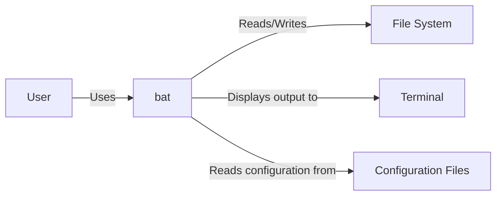
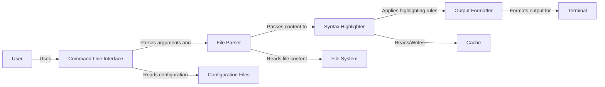
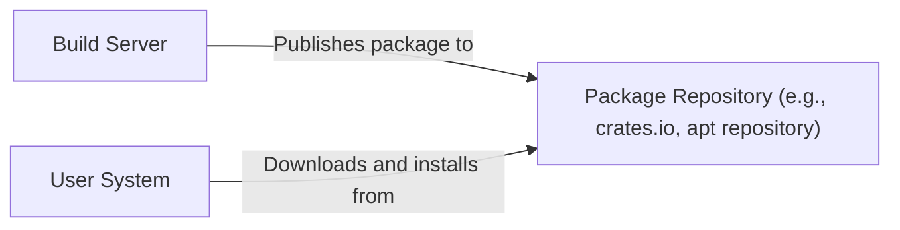
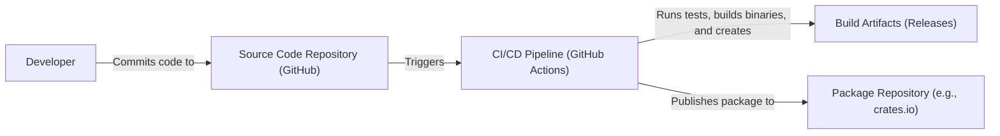

# BUSINESS POSTURE

Business Priorities and Goals:

*   Provide a user-friendly and feature-rich alternative to the standard `cat` command.
*   Enhance developer productivity and code readability through syntax highlighting and other features.
*   Offer a cross-platform tool that works consistently across different operating systems.
*   Maintain an open-source project with community contributions.

Most Important Business Risks:

*   Compromised releases: Malicious code injection into the build process or distribution channels could lead to widespread compromise of user systems.
*   Denial of Service: Vulnerabilities in the software could be exploited to cause crashes or excessive resource consumption, rendering the tool unusable.
*   Reputation damage: Security incidents or poor handling of user data could negatively impact the project's reputation and user trust.
*   Data exfiltration: If `bat` is used to view sensitive files, vulnerabilities could potentially be exploited to leak this data.

# SECURITY POSTURE

Existing Security Controls:

*   security control: Code reviews: The project uses GitHub's pull request system, which implies code review before merging changes. (Described in contribution guidelines on GitHub).
*   security control: Static analysis: The project appears to use some form of static analysis, potentially through linters or other tools integrated into the build process. (Inferred from the presence of CI workflows on GitHub).
*   security control: Dependency management: The project uses a package manager (Cargo for Rust) to manage dependencies, which helps ensure that known vulnerable versions are not used. (Described in `Cargo.toml` and `Cargo.lock` files).
*   security control: Automated testing: The project includes a test suite to verify functionality and potentially catch security-related bugs. (Inferred from the presence of tests and CI workflows on GitHub).
*   security control: Fuzz testing: The project uses fuzz testing. (Described in fuzz directory on GitHub).

Accepted Risks:

*   accepted risk: The project does not appear to have a formal security policy or vulnerability disclosure program.
*   accepted risk: The project does not currently employ advanced security measures like sandboxing or memory safety protections beyond what Rust provides by default.

Recommended Security Controls:

*   security control: Implement a security policy and vulnerability disclosure program.
*   security control: Integrate SAST (Static Application Security Testing) tools into the CI/CD pipeline for continuous security analysis.
*   security control: Integrate DAST (Dynamic Application Security Testing) tools, even in a limited capacity, to test the running application for vulnerabilities.
*   security control: Perform regular security audits and penetration testing.
*   security control: Consider using a Software Bill of Materials (SBOM) to track dependencies and their vulnerabilities.
*   security control: Sign releases to ensure authenticity and integrity.

Security Requirements:

*   Authentication: Not applicable, as `bat` is a command-line tool that does not involve user authentication.
*   Authorization: Not directly applicable, but `bat` should respect the file system permissions of the underlying operating system. It should not allow users to bypass access controls.
*   Input Validation: `bat` must handle potentially malicious input (e.g., crafted files designed to exploit vulnerabilities) gracefully. It should not crash or allow arbitrary code execution. Input validation should include checks for file size, type, and content, as appropriate.
*   Cryptography: If `bat` were to handle sensitive data (which it typically doesn't), it should use appropriate cryptographic libraries and algorithms for encryption and integrity checks. Currently, cryptography is not a primary concern.

# DESIGN

## C4 CONTEXT

Element Descriptions:

*   Element:
    *   Name: User
    *   Type: Person
    *   Description: A person who uses `bat` to view files.
    *   Responsibilities: Invokes `bat` with command-line arguments, provides input files.
    *   Security controls: Relies on the operating system's user authentication and authorization mechanisms.

*   Element:
    *   Name: bat
    *   Type: Software System
    *   Description: The `bat` command-line utility.
    *   Responsibilities: Reads files, applies syntax highlighting, displays output to the terminal.
    *   Security controls: Input validation, dependency management, code reviews, static analysis, automated testing, fuzz testing.

*   Element:
    *   Name: File System
    *   Type: External System
    *   Description: The operating system's file system.
    *   Responsibilities: Stores files that `bat` reads.
    *   Security controls: Operating system file permissions, access control lists.

*   Element:
    *   Name: Terminal
    *   Type: External System
    *   Description: The user's terminal emulator.
    *   Responsibilities: Displays the output from `bat`.
    *   Security controls: Terminal security settings, potentially sandboxing.

*   Element:
    *   Name: Configuration Files
    *   Type: External System
    *   Description: Files containing user-defined configurations for `bat`.
    *   Responsibilities: Provide custom settings for `bat`'s behavior.
    *   Security controls: File system permissions.

## C4 CONTAINER

Element Descriptions:

*   Element:
    *   Name: User
    *   Type: Person
    *   Description: A person who uses `bat` to view files.
    *   Responsibilities: Invokes `bat` with command-line arguments, provides input files.
    *   Security controls: Relies on the operating system's user authentication and authorization mechanisms.

*   Element:
    *   Name: Command Line Interface
    *   Type: Container
    *   Description: Handles command-line arguments and configuration.
    *   Responsibilities: Parses command-line arguments, loads configuration files, determines program behavior.
    *   Security controls: Input validation.

*   Element:
    *   Name: File Parser
    *   Type: Container
    *   Description: Reads file content from the file system.
    *   Responsibilities: Reads file data, handles file encodings.
    *   Security controls: Input validation, checks for file size limits.

*   Element:
    *   Name: Syntax Highlighter
    *   Type: Container
    *   Description: Applies syntax highlighting to file content.
    *   Responsibilities: Parses file content, identifies language, applies highlighting rules.
    *   Security controls: Input validation, regular expression sanitization.

*   Element:
    *   Name: Output Formatter
    *   Type: Container
    *   Description: Formats the output for display in the terminal.
    *   Responsibilities: Adds line numbers, colors, and other formatting elements.
    *   Security controls: Output encoding.

*   Element:
    *   Name: Terminal
    *   Type: External System
    *   Description: The user's terminal emulator.
    *   Responsibilities: Displays the output from `bat`.
    *   Security controls: Terminal security settings, potentially sandboxing.

*   Element:
    *   Name: File System
    *   Type: External System
    *   Description: The operating system's file system.
    *   Responsibilities: Stores files that `bat` reads.
    *   Security controls: Operating system file permissions, access control lists.

*   Element:
    *   Name: Configuration Files
    *   Type: External System
    *   Description: Files containing user-defined configurations for `bat`.
    *   Responsibilities: Provide custom settings for `bat`'s behavior.
    *   Security controls: File system permissions.

*   Element:
    *   Name: Cache
    *   Type: External System
    *   Description: Directory containing cached syntax highlighting definitions.
    *   Responsibilities: Store and retrieve cached data to improve performance.
    *   Security controls: File system permissions.

## DEPLOYMENT

Possible Deployment Solutions:

1.  Manual Installation: Users download pre-built binaries or build from source and place them in a directory within their PATH.
2.  Package Managers: `bat` is available through various package managers (e.g., apt, brew, choco, cargo).
3.  Containers: `bat` could be packaged within a container image (e.g., Docker) for isolated execution.

Chosen Deployment Solution (Package Managers):

Element Descriptions:

*   Element:
    *   Name: User System
    *   Type: Environment
    *   Description: The user's computer where `bat` is installed.
    *   Responsibilities: Runs `bat`, provides access to the file system and terminal.
    *   Security controls: Operating system security features, user permissions.

*   Element:
    *   Name: Package Repository
    *   Type: External System
    *   Description: A repository hosting `bat` packages (e.g., crates.io for Rust, apt repositories for Debian/Ubuntu).
    *   Responsibilities: Stores and serves `bat` packages.
    *   Security controls: Repository security measures, package signing (if implemented).

*   Element:
    *   Name: Build Server
    *   Type: Environment
    *   Description: The server where `bat` is built and packaged.
    *   Responsibilities: Compiles `bat`, creates packages, potentially signs releases.
    *   Security controls: Build server security, access controls, code signing.

## BUILD

Build Process Description:

1.  Developers commit code changes to the GitHub repository.
2.  GitHub Actions (CI/CD) is triggered by commits or pull requests.
3.  The CI/CD pipeline performs the following steps:
    *   Checks out the code.
    *   Runs linters and static analysis tools.
    *   Runs automated tests.
    *   Builds `bat` binaries for different platforms.
    *   Creates release artifacts.
    *   Potentially publishes the package to a package repository (e.g., crates.io).

Security Controls in Build Process:

*   security control: Code reviews: Enforced through GitHub's pull request system.
*   security control: Static analysis: Linters and other tools integrated into the CI/CD pipeline.
*   security control: Automated testing: Unit tests and integration tests run automatically.
*   security control: Dependency management: Cargo manages dependencies and their versions.
*   security control: Supply chain security: Limited, but reliance on trusted package managers and CI/CD platforms provides some protection.

# RISK ASSESSMENT

Critical Business Processes:

*   Providing a reliable and functional tool for viewing and analyzing code and other text files.
*   Maintaining the integrity and security of the software distribution process.

Data Protection:

*   Data Sensitivity: `bat` itself does not store or transmit sensitive data. However, it *processes* potentially sensitive data (the content of files it displays). The sensitivity depends entirely on the files the user chooses to view with `bat`.
*   Data to Protect: The primary concern is not data storage but preventing unauthorized access to file content through vulnerabilities in `bat`.

# QUESTIONS & ASSUMPTIONS

Questions:

*   Are there any specific compliance requirements (e.g., GDPR, HIPAA) that `bat` needs to consider, even indirectly? (Assumption: No specific compliance requirements beyond general security best practices.)
*   What is the expected threat model? (Assumption: The primary threat is from malicious actors exploiting vulnerabilities to gain unauthorized access to files or execute arbitrary code.)
*   What level of security assurance is desired? (Assumption: A reasonable level of security assurance is desired, balancing security with usability and development speed.)
*   Is there a budget for security tools and audits? (Assumption: There are limited resources for security, prioritizing open-source and cost-effective solutions.)

Assumptions:

*   BUSINESS POSTURE: The project prioritizes user experience and functionality, but also recognizes the importance of security.
*   SECURITY POSTURE: The project relies primarily on existing security controls provided by the Rust language, the development ecosystem (GitHub), and package managers.
*   DESIGN: The design is relatively simple, with a focus on modularity and maintainability. The deployment model relies on package managers for ease of installation and updates. The build process is automated using GitHub Actions.