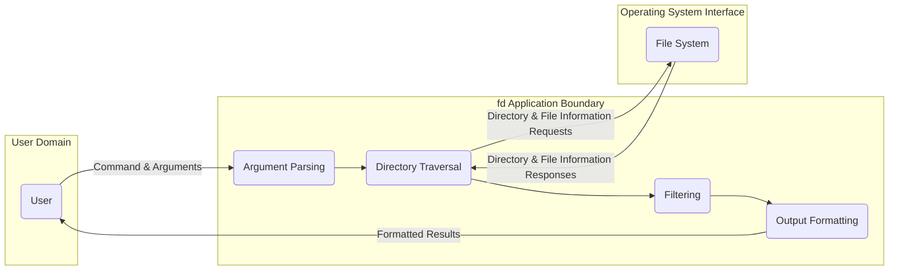
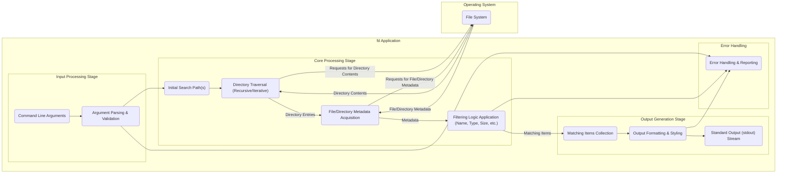

# Project Design Document: fd (A Simple, Fast and User-Friendly Alternative to 'find')

**Version:** 1.1
**Date:** October 26, 2023
**Author:** AI Software Architect

## 1. Introduction

This document provides a refined and detailed design overview of the `fd` command-line utility. `fd` is engineered as a more intuitive and performant alternative to the traditional `find` command for locating files and directories. This document aims to clearly articulate the system's architecture, data flow mechanisms, and the roles of its key components. It serves as a foundational resource for subsequent threat modeling exercises.

## 2. Goals and Non-Goals

**Goals:**

*   Present a clear and comprehensive architectural blueprint of the `fd` utility.
*   Thoroughly describe the key components within the system and elucidate their interactions.
*   Illustrate the flow of data during typical usage scenarios, emphasizing data transformations.
*   Pinpoint potential areas of interest for security assessments and threat modeling activities, providing specific examples.

**Non-Goals:**

*   In-depth, code-level implementation specifics or algorithms used within components.
*   Detailed performance benchmarking data or comparisons with other tools.
*   Specific details regarding the Rust standard library or external crates employed, unless they have significant architectural implications.
*   Deployment or installation procedures across various operating systems.
*   Comprehensive user manual or exhaustive details of command-line arguments beyond what is necessary for understanding the system's architecture.

## 3. High-Level Architecture

The `fd` utility operates as a self-contained command-line application. Its core function is to traverse file system structures and identify files and directories based on criteria specified by the user.

**Description:**

*   The **User** interacts with the `fd` application by entering commands and associated arguments via the command-line interface.
*   The **fd Application Boundary** encapsulates the core logic of `fd`, responsible for interpreting user input, interacting with the underlying file system, and presenting the search results.
*   The **Operating System Interface** represents the file system, the fundamental storage mechanism where the target files and directories are located.

## 4. Detailed Architecture and Data Flow

The subsequent diagram provides a more granular view of the data flow within the `fd` application during a typical file search operation, highlighting key data transformations and component interactions.

**Data Flow Description:**

1. **Command Line Arguments:** The user initiates the search process by providing the search query and any optional parameters to the `fd` executable.
2. **Argument Parsing & Validation:** The application begins by parsing the command-line arguments, rigorously validating their syntax and ensuring semantic correctness. This stage identifies the starting directory(ies), the search pattern, and any specified filtering options.
3. **Initial Search Path(s):** Based on the parsed arguments, the starting point(s) for the file system traversal are established. If no path is provided, the current working directory is typically used.
4. **Directory Traversal:** The application employs a traversal mechanism (either recursive or iterative, depending on user options or defaults) to navigate the directory structure, commencing from the designated starting path(s).
5. **File/Directory Metadata Acquisition:** For each file and directory encountered during traversal, the application interacts with the operating system to retrieve essential metadata. This includes the name, type (file or directory), size, modification timestamps, permissions, etc.
6. **Filtering Logic Application:** The acquired metadata is then evaluated against the user-defined filtering criteria. This involves applying pattern matching algorithms (such as globbing or regular expressions), checking file types, and performing comparisons based on size, timestamps, and other attributes.
7. **Matching Items Collection:** Files and directories that satisfy all the specified filtering criteria are collected into a list of matching items.
8. **Output Formatting & Styling:** The collected matching items are then formatted for presentation to the user. This includes handling different output formats (e.g., just the filename, full path, custom formats) and potentially applying styling (e.g., colorization) for improved readability.
9. **Standard Output (stdout) Stream:** Finally, the formatted results are written to the standard output stream, which is typically displayed on the user's terminal.
10. **Error Handling & Reporting:** Throughout the process, the application incorporates error handling mechanisms to manage potential issues such as invalid arguments, permission errors during file system access, or unexpected system errors. Informative error messages are generated and presented to the user via the standard error stream (stderr).

## 5. Key Components

This section details the major functional components within the `fd` application and their respective responsibilities.

*   **Argument Parser:** This component is responsible for dissecting the command-line arguments provided by the user. It validates the syntax and semantics of these arguments and extracts the necessary parameters to configure the search operation. This component often leverages external libraries to simplify the parsing process.
*   **Directory Traversal Engine:** This is the core component responsible for navigating the file system hierarchy. It makes system calls to read the contents of directories and recursively (or iteratively) explores subdirectories. This component must handle complexities such as symbolic links, potential recursion depth limits, and circular dependencies within the file system.
*   **Metadata Retriever:** This component interacts directly with the operating system's file system API to obtain metadata for individual files and directories. The specific system calls used will vary depending on the operating system.
*   **Filtering Engine:** This component applies the user-defined filters to the metadata retrieved by the Metadata Retriever. It implements various filtering mechanisms, including pattern matching (using glob patterns or regular expressions), type checking (identifying files or directories), and comparisons based on attributes like size, modification time, and permissions.
*   **Output Formatter:** This component takes the list of matching items and formats them for display to the user. It supports different output formats, allowing users to customize the information presented (e.g., just the filename, the full path, or a custom format). It may also handle features like colorization to enhance readability.
*   **Error Handler:** This critical component manages errors that may occur during the execution of `fd`. This includes errors during argument parsing, file system access (e.g., permission denied), and other unexpected issues. The Error Handler is responsible for generating informative error messages and presenting them to the user, typically via the standard error stream.

## 6. Security Considerations (For Threat Modeling)

The following areas represent potential attack surfaces and are crucial considerations for security threat modeling of the `fd` utility.

*   **Command Injection Vulnerabilities:** While `fd` primarily interacts with the file system, vulnerabilities could arise if user-provided arguments are improperly handled and used in a context where external commands are executed. For example, if filename processing involves passing filenames to shell commands without proper sanitization, it could lead to arbitrary command execution.
*   **Path Traversal Exploits:** A significant risk arises from the potential for path traversal vulnerabilities. If the application does not adequately sanitize or validate the starting directory or search patterns provided by the user, an attacker could potentially access files and directories outside the intended scope. For instance, using patterns like `../../sensitive_file` could allow access to restricted areas.
*   **Resource Exhaustion Attacks:** Maliciously crafted search queries or starting points could be designed to cause excessive file system traversal, consuming significant system resources (CPU, memory, disk I/O). For example, starting a search at the root of a very large file system with a broad pattern could lead to a denial-of-service condition.
*   **Symbolic Link Following Vulnerabilities:** Improper handling of symbolic links during directory traversal can lead to the application accessing unintended files or directories. An attacker could create malicious symbolic links that point to sensitive files, potentially bypassing security restrictions. For example, a symbolic link in the target directory pointing to `/etc/shadow`.
*   **Output Handling Exploits:** Although generally a lower-risk area, vulnerabilities in the output formatting logic could potentially be exploited. For instance, if the output formatting logic is susceptible to format string bugs, it could lead to information disclosure or other issues.
*   **Dependency Chain Vulnerabilities:** As `fd` is likely built using external libraries (crates in the Rust ecosystem), vulnerabilities present in these dependencies could indirectly compromise the security of `fd`. Regular auditing and updating of dependencies are crucial to mitigate this risk.
*   **Locale-Based Vulnerabilities:**  Depending on how filename matching and sorting are implemented, inconsistencies or vulnerabilities related to different locales and character encodings could potentially be exploited.

## 7. Future Considerations

*   Potential integration with other command-line tools or scripting workflows through features like machine-readable output formats (e.g., JSON).
*   Expansion of filtering capabilities to include more advanced criteria, such as filtering based on file content or permissions.
*   Performance optimizations specifically targeting very large and deeply nested file systems to maintain responsiveness.
*   Exploration of parallel processing techniques to further enhance search speed.

This refined document provides a more detailed and comprehensive understanding of the architecture and data flow of the `fd` utility, offering a robust foundation for conducting thorough threat modeling and identifying potential security vulnerabilities.
