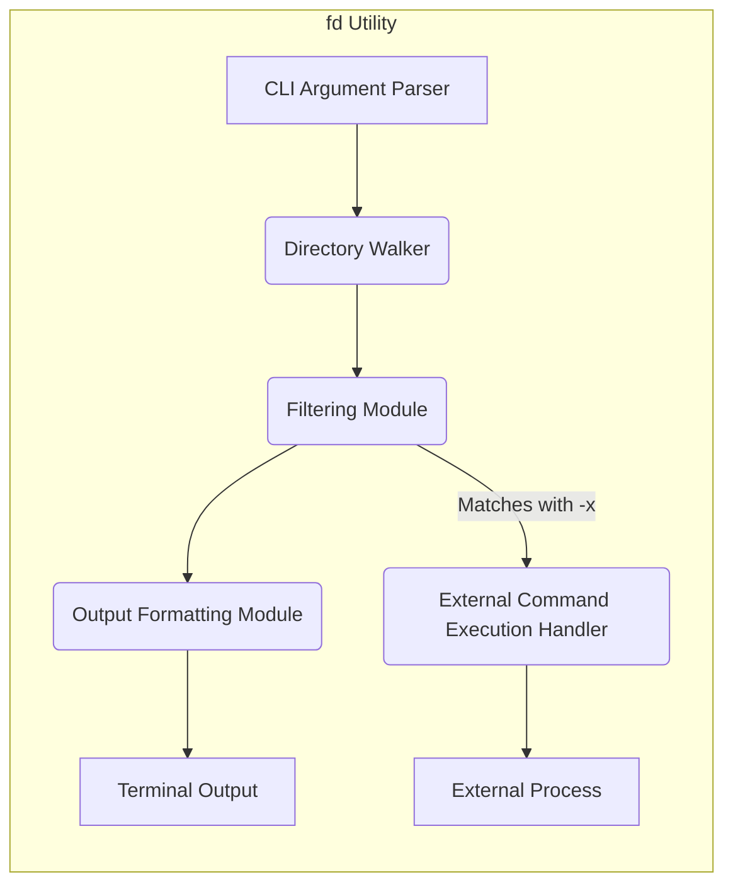
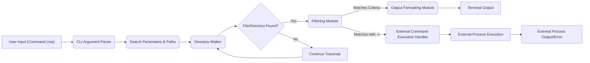

## Project Design Document: fd - A Simple, Fast and User-Friendly Alternative to 'find' (Improved)

**1. Introduction**

This document provides an enhanced design overview of the `fd` utility, a command-line tool implemented in Rust. `fd` is designed as a more user-friendly and performant alternative to the traditional `find` command. This document serves as the foundation for subsequent threat modeling exercises aimed at identifying and mitigating potential security vulnerabilities.

**2. Project Overview**

`fd` is a command-line tool focused on efficient file and directory discovery within a specified directory hierarchy. It prioritizes ease of use and speed compared to `find`, offering features such as:

*   Visually enhanced output through colorization.
*   Intelligent case handling (defaulting to case-insensitive searches, with a case-sensitive option).
*   Automatic exclusion of hidden files and directories.
*   Default adherence to `.gitignore` exclusion patterns.
*   Support for regular expressions in search patterns.
*   Capability to execute external commands on found items via the `-x` flag.
*   Flexible filtering options based on file type, modification time, size, and more.

**3. System Architecture**

The architecture of `fd` can be decomposed into the following interacting components:

*   **Command-Line Interface (CLI) Argument Parser:**  Responsible for interpreting user-provided command-line arguments, including the search pattern, flags, and target paths.
*   **Directory Walker:**  Implements the logic for recursively traversing the file system, starting from the specified path(s).
*   **Filtering Module:**  Applies various filtering criteria to the files and directories encountered by the Directory Walker.
*   **Output Formatting Module:**  Handles the presentation of search results to the user, including colorization and formatting.
*   **External Command Execution Handler (Conditional):**  Activated by the `-x` flag, this component executes external commands on the discovered files.

**4. Data Flow**

The typical flow of data within `fd` involves these stages:

1. **User Invocation:** The user executes the `fd` command with specific arguments via the command line.
2. **Argument Parsing and Validation:** The CLI Argument Parser receives the input, validates the syntax and semantics of the arguments, and extracts relevant parameters.
3. **Target Path Initialization:** The Directory Walker receives the starting path(s) for the search. If no path is provided, it defaults to the current working directory.
4. **Directory Traversal:** The Directory Walker recursively explores the directory structure, identifying files and directories.
5. **Filtering Application:** For each discovered file or directory, the Filtering Module applies the specified filters (name, type, size, etc.).
6. **Result Formatting:** Matching items are passed to the Output Formatting Module for presentation.
7. **Output Display:** The formatted results are displayed to the user on the terminal.
8. **External Command Execution (Conditional):** If the `-x` flag is present and an item matches the filters, the External Command Execution Handler constructs and executes the specified command, passing the item's path as an argument.

**5. Detailed Component Breakdown**

*   **Command-Line Interface (CLI) Argument Parser:**
    *   Leverages a library like `clap` for robust argument parsing.
    *   Performs validation to ensure correct argument types and combinations.
    *   Extracts the search pattern (string or regular expression).
    *   Identifies target paths for the search.
    *   Parses flags that modify behavior (e.g., `-i` for case-insensitivity, `-H` for showing hidden files, `-x` for executing commands).
*   **Directory Walker:**
    *   Implements recursive directory traversal using operating system APIs.
    *   Handles symbolic links, offering options to follow or avoid them.
    *   Respects file system permissions, only accessing directories and files the user has rights to.
    *   May employ techniques for efficient traversal, such as parallel processing of directories.
*   **Filtering Module:**
    *   Compares file and directory names against the provided search pattern, supporting both literal strings and regular expressions.
    *   Applies filters based on file type (file, directory, symlink, etc.).
    *   Applies filters based on file metadata (modification time, access time, size).
    *   Integrates with the `ignore` crate to respect `.gitignore` and other ignore files.
*   **Output Formatting Module:**
    *   Formats the output string for each matching item, including the file path.
    *   Utilizes libraries like `ansi_term` to add color coding based on file type or other attributes.
    *   Provides options for different output formats (e.g., null-separated output for easier piping to other commands).
    *   Handles terminal width and potentially truncates long paths if necessary.
*   **External Command Execution Handler:**
    *   Invoked when the `-x` flag is used.
    *   Constructs the command to be executed by replacing placeholders (e.g., `{}`, `+`) in the provided command string with the path of the found item.
    *   Spawns a new process to execute the external command.
    *   Passes the path of the found item as arguments to the external command.
    *   May offer options for controlling how multiple arguments are passed (e.g., one argument per found item, or accumulating arguments).
    *   Captures and potentially displays the standard output and standard error of the executed command.

**6. Dependencies**

`fd` relies on the following key external crates (libraries) in the Rust ecosystem:

*   `clap`: For parsing command-line arguments.
*   `regex`: For regular expression matching capabilities.
*   `ignore`: For handling `.gitignore` files and other exclusion patterns.
*   `walkdir`: For efficient and configurable directory traversal.
*   `ansi_term`: For adding ANSI color codes to the terminal output.
*   `rayon` (potentially): For parallel processing during directory traversal, enhancing performance.
*   Standard Rust Library (`std`): Provides fundamental functionalities like file system operations, string manipulation, and process management.

**7. Security Considerations (Enhanced)**

This section details potential security considerations for the `fd` utility, providing more specific examples:

*   **Path Traversal Vulnerabilities:**
    *   If the `-x` command is not carefully constructed, a malicious user could craft a command that accesses files outside the intended scope. For example, `fd <pattern> -x "cat ../../../etc/passwd"`.
    *   Improper handling of symbolic links could allow attackers to target files outside the intended search area.
*   **Command Injection Vulnerabilities (via `-x`):**
    *   The `-x` option is a primary attack vector. If the command string provided by the user is not properly sanitized, attackers can inject arbitrary commands. For example, `fd <pattern> -x "rm -rf {}"`.
    *   Even without malicious intent, incorrect quoting or escaping of arguments passed to the external command can lead to unexpected and potentially harmful behavior.
*   **Denial of Service (DoS):**
    *   Searching extremely deep or cyclical directory structures without proper safeguards could lead to stack overflow or excessive memory consumption.
    *   Providing overly broad search patterns on systems with a large number of files could consume excessive CPU and I/O resources.
    *   Using `-x` with commands that consume significant resources or create a large number of processes could lead to system instability.
*   **Information Disclosure:**
    *   While `fd` respects file system permissions, vulnerabilities in output formatting or handling of special characters in file names could potentially expose sensitive information.
    *   If `-x` is used to execute commands that output sensitive data to the terminal, this data could be unintentionally exposed.
*   **Symbolic Link Attacks:**
    *   Without proper handling, `fd` could be tricked into following malicious symbolic links, leading to operations on unintended files or directories.
    *   Attackers could create symbolic link farms to exhaust system resources during traversal.
*   **Dependency Vulnerabilities:**
    *   Vulnerabilities in the external crates used by `fd` could be exploited. Regular dependency updates and security audits are crucial. For example, a vulnerability in the `regex` crate could be exploited through crafted search patterns.
*   **Locale and Encoding Issues:**
    *   Incorrect handling of character encodings in file names or search patterns could lead to unexpected behavior or bypass security checks.
*   **Privilege Escalation (Potential Indirect):**
    *   While `fd` itself doesn't directly escalate privileges, if used in scripts or automated systems running with elevated privileges, vulnerabilities in `fd` could be leveraged to perform actions with those higher privileges.

**8. Assumptions and Constraints**

*   The underlying operating system provides a basic level of security, including file system permissions and process isolation.
*   The user running `fd` has the necessary permissions to access the directories and files they are searching.
*   The security of external commands executed via `-x` is the responsibility of the user. `fd` provides the mechanism but does not guarantee the safety of arbitrary external commands.
*   Error handling within `fd` is robust and prevents unexpected crashes or information leaks in error scenarios.

**9. Future Considerations (Security Focused)**

*   **Introduce a "safe mode" for `-x`:** This mode could restrict the types of commands that can be executed or require explicit confirmation before execution.
*   **Implement argument sanitization for `-x`:**  Automatically escape or quote arguments passed to external commands to prevent command injection.
*   **Resource Limits for Traversal:** Implement options to limit the depth of recursion or the number of files processed to mitigate DoS risks.
*   **Security Hardening of Dependencies:** Regularly review and update dependencies, and consider using tools to scan for known vulnerabilities.
*   **Static Analysis Integration:** Integrate static analysis tools into the development process to automatically detect potential security flaws in the code.
*   **Consider a "dry-run" option for `-x`:** Allow users to preview the commands that would be executed without actually running them.
*   **Explore sandboxing or namespacing for external command execution:**  Isolate the execution environment of external commands to limit the potential impact of malicious commands.

This improved design document provides a more detailed and security-focused overview of the `fd` utility, serving as a stronger foundation for subsequent threat modeling activities.