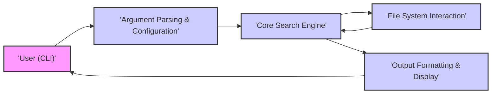

## Project Design Document: fd - A Simple, Fast and User-Friendly Alternative to 'find'

**Project Name:** fd

**Project Repository:** [https://github.com/sharkdp/fd](https://github.com/sharkdp/fd)

**Document Version:** 1.1

**Date:** 2023-10-27

**Author:** AI Expert

### 1. Project Overview

`fd` is a command-line tool designed to find entries in your filesystem. It aims to be a faster, more user-friendly, and intuitive alternative to the traditional `find` command.  Key features include:

*   **Intuitive Syntax:**  Simpler and more natural command-line arguments compared to `find`, reducing the learning curve for new users.
*   **Colored Output:**  Provides visually appealing and informative output in the terminal, enhancing user experience and readability of results.
*   **Smart Case and Hidden File Handling:**  Offers intelligent defaults for case sensitivity and handling of hidden files, aligning with common user expectations and reducing the need for explicit flags in many cases. These defaults can be easily overridden for more specific searches.
*   **Fast Performance:**  Optimized for speed in file system traversal and searching, making it efficient even on large directories. This is achieved through techniques like parallel directory traversal and efficient filtering.

This document outlines the design of `fd` to facilitate threat modeling and security analysis. It describes the system architecture, components, data flow, and external dependencies, providing a basis for identifying potential vulnerabilities and security risks.

### 2. System Architecture

`fd` operates as a command-line application, executed directly by the user in a terminal environment. Its architecture is modular and can be broadly divided into the following interacting components, each responsible for a specific aspect of the search process:

*   **User Interface (CLI):**  This is the entry point for user interaction. It's responsible for receiving commands from the user, displaying output, and handling user signals.
*   **Argument Parsing & Configuration:**  This component takes the raw command-line input and transforms it into a structured configuration. It interprets arguments, potentially reads configuration files (if supported in future), and sets up the parameters for the search operation.
*   **Core Search Engine:**  The heart of `fd`, this component orchestrates the entire search process. It manages file system traversal, applies filters based on user configuration, and collects the results.
*   **File System Interaction:**  This component handles the low-level communication with the operating system's file system. It makes system calls to access directories, read file metadata, and check permissions. It acts as an abstraction layer between the core search logic and the OS.
*   **Output Formatting & Display:**  This component takes the raw search results and prepares them for presentation to the user. It handles coloring, formatting, and potentially different output modes (e.g., plain text, null-separated).

Below is a high-level flowchart illustrating the interaction between these components and the data flow:

### 3. Component Details

This section provides a more detailed description of each component, including their functionalities, potential implementation details (speculative, based on common practices for such tools, especially in Rust), and security considerations relevant for threat modeling.

*   **User Interface (CLI)**
    *   **Functionality:**
        *   **Input Handling:** Receives command-line input strings from the user via standard input.
        *   **Output Display:**  Writes formatted search results to standard output (stdout) and error messages to standard error (stderr).
        *   **Signal Handling:**  Responds to signals like `SIGINT` (Ctrl+C) to allow graceful interruption of long-running searches.
        *   **Potential Interactive Elements (Limited):** While primarily non-interactive, future versions might include features like progress bars or more sophisticated output formatting that could involve minimal terminal interaction.
    *   **Implementation Notes (Speculative):** Likely implemented using standard Rust libraries for CLI interaction and terminal output. Might use libraries for colored output and terminal manipulation.
    *   **Security Considerations:**
        *   **Command Injection Prevention:**  Crucially, the CLI itself should not interpret or execute any part of the user-provided input as commands. The argument parsing component is responsible for interpreting arguments, not the raw CLI interface.
        *   **Terminal Injection Vulnerabilities:**  Output formatting must be carefully handled to prevent terminal escape sequence injection. Maliciously crafted filenames or paths could contain escape sequences that, when printed to the terminal, could alter terminal behavior or potentially execute commands in the user's terminal.  Output sanitization is essential.
        *   **Information Leakage via Error Messages:**  Error messages should be informative for debugging but should avoid leaking sensitive information about the system or internal program state.

*   **Argument Parsing & Configuration**
    *   **Functionality:**
        *   **Command-line Argument Parsing:**  Parses command-line arguments according to defined syntax, likely using a library like `clap` in Rust, which is common for robust CLI argument parsing.
        *   **Configuration Loading (Potential Future Feature):**  Could potentially load configuration from files (e.g., `.fdrc` in user's home directory) to customize default behavior.
        *   **Parameter Validation:**  Validates parsed arguments to ensure they are within acceptable ranges and formats (e.g., validating depth limits, file type specifications).
        *   **Configuration Object Creation:**  Creates a structured configuration object that is passed to the `Core Search Engine`, containing all the search parameters.
    *   **Implementation Notes (Speculative):**  Likely uses the `clap` crate in Rust for argument parsing. Configuration loading (if implemented) would involve file I/O and parsing of configuration files (e.g., TOML, YAML).
    *   **Security Considerations:**
        *   **Argument Parsing Library Vulnerabilities:**  Dependencies like `clap` should be kept up-to-date to mitigate any potential vulnerabilities in the parsing library itself.
        *   **Input Validation Bypass:**  Robust validation logic is needed to prevent attackers from crafting arguments that bypass intended restrictions or cause unexpected behavior. Incorrect validation could lead to path traversal or other vulnerabilities.
        *   **Configuration File Security (If Implemented):** If configuration files are supported, their parsing must be secure to prevent injection attacks (e.g., if configuration files are parsed as code) or manipulation by unauthorized users. Configuration files should ideally be read-only for the `fd` process and located in secure user-specific directories.

*   **Core Search Engine**
    *   **Functionality:**
        *   **Search Orchestration:**  Manages the overall search process, coordinating file system traversal and filtering.
        *   **Directory Traversal:**  Recursively or iteratively traverses directories based on the configured search depth and paths.  Likely uses efficient directory traversal algorithms.
        *   **Filtering Logic:**  Applies filters based on search patterns (filenames, extensions, regular expressions), file types (files, directories, symlinks), size, modification time, and other criteria specified in the configuration.
        *   **Result Aggregation:**  Collects matching file system entries into a list of results.
        *   **Parallelism (Potential):**  May employ parallel processing techniques (e.g., using threads or asynchronous operations) to speed up directory traversal and filtering, especially on systems with multiple cores.
    *   **Implementation Notes (Speculative):**  Likely implemented in Rust, leveraging Rust's concurrency features for potential parallelism. File system traversal would involve using Rust's standard library for file system operations. Regular expression matching might use the `regex` crate.
    *   **Security Considerations:**
        *   **Path Traversal Vulnerabilities:**  This is a critical area. The search engine must strictly adhere to the configured search paths and depth limits.  Improper path handling could allow attackers to escape the intended search scope and access sensitive files outside the user's intended area. Input paths must be carefully sanitized and validated.
        *   **Regular Expression Denial of Service (ReDoS):** If regular expressions are used for pattern matching, they must be handled carefully to prevent ReDoS attacks.  Complex or maliciously crafted regular expressions could cause excessive CPU consumption, leading to denial of service.  Consider using ReDoS-resistant regex libraries or implementing timeouts for regex matching.
        *   **Resource Exhaustion:**  Uncontrolled traversal of very large or deeply nested directories could lead to resource exhaustion (memory, file handles, CPU).  Implement limits on search depth and potentially other resource usage controls to prevent denial-of-service scenarios.
        *   **Symlink Handling:**  Symlink traversal needs to be carefully considered.  Uncontrolled symlink following could lead to infinite loops or traversal outside the intended search scope.  `fd` likely has options to control symlink behavior (follow, don't follow, or follow only within search path).

*   **File System Interaction**
    *   **Functionality:**
        *   **Directory Operations:**  Uses system calls (via Rust's standard library or OS-specific APIs) to open directories, read directory entries, and close directories.
        *   **File Metadata Retrieval:**  Retrieves file metadata (permissions, type, size, modification time, etc.) using system calls like `stat`, `lstat`, or similar.
        *   **Path Manipulation:**  Handles path joining, normalization, and potentially canonicalization.
        *   **Permission Checks:**  Checks file system permissions to determine if the process has access to read directories and files.
    *   **Implementation Notes (Speculative):**  Relies heavily on the operating system's file system API, accessed through Rust's standard library (`std::fs`, `std::path`).  Error handling for file system operations is crucial.
    *   **Security Considerations:**
        *   **Permissions Handling Errors:**  Incorrectly checking or interpreting file system permissions could lead to unauthorized access to files or directories. Ensure that permission checks are performed correctly and consistently.
        *   **Error Handling and Information Leaks:**  Errors during file system operations (e.g., permission denied, file not found) should be handled gracefully and securely. Error messages should not leak sensitive information about the file system structure or permissions.
        *   **Race Conditions (Less Likely but Possible):** While less likely in a tool like `fd`, race conditions in file system access could theoretically be exploited in certain scenarios, especially if file system state changes rapidly during the search.  Careful attention to concurrency and atomicity of operations might be needed in highly concurrent implementations.

*   **Output Formatting & Display**
    *   **Functionality:**
        *   **Result Formatting:**  Formats the list of search results into a user-friendly output format. This includes constructing strings representing file paths and other relevant information.
        *   **Coloring and Styling:**  Applies colors and styles to filenames, paths, and other output elements to enhance readability in the terminal. Likely uses ANSI escape codes for terminal styling.
        *   **Output Modes (Potential):**  May support different output modes, such as plain text, null-separated output (useful for piping to other tools), or potentially JSON or other structured formats in future versions.
    *   **Implementation Notes (Speculative):**  Might use crates like `ansi_term` or similar for terminal styling in Rust. String formatting would be done using Rust's string manipulation capabilities.
    *   **Security Considerations:**
        *   **Terminal Injection Vulnerabilities (Again):**  As highlighted earlier, this component is directly responsible for generating output that is interpreted by the user's terminal.  Thorough sanitization of file paths and other output strings is paramount to prevent terminal injection attacks.  Any special characters in filenames or paths that could be interpreted as terminal escape sequences must be escaped or handled safely.
        *   **Information Leakage in Output:**  Ensure that the output formatting does not inadvertently include sensitive information that should not be exposed to the user (though less likely in `fd`, but relevant in general output formatting scenarios).

### 4. Data Flow (Detailed)

The data flow within `fd` is a sequential process, starting with user input and ending with output display. Here's a more granular breakdown of the data flow:

```mermaid
graph LR
    subgraph User Interaction
        A1["'User Input (Command Line)'"] --> A2["'CLI Receives Input String'"];
        A2 --> B1["'Argument Parsing'"];
        E2["'Formatted Output String'"] --> A3["'CLI Displays Output'"];
        A3 --> A4["'User Sees Results'"];
    end
    subgraph Configuration & Search
        B1 --> B2["'Parse Arguments & Create Configuration Object'"];
        B2 --> C1["'Core Search Engine Starts'"];
        C1 --> C2["'Initialize Search (Paths, Filters)'"];
        C2 --> D1["'File System Interaction: Start Traversal'"];
    end
    subgraph File System Traversal & Filtering
        D1 --> D2["'Request Directory Entries'"];
        D2 --> D3["'OS Returns Directory Entries'"];
        D3 --> C3["'Core Search Engine Receives Entries'"];
        C3 --> C4["'Apply Filters (Name, Type, etc.)'"];
        C4 --> C5["'Matching Entry?'"];
        C5 -- "Yes" --> C6["'Add to Results List'"];
        C5 -- "No" --> C7["'More Entries to Process?'"];
        C7 -- "Yes" --> D1;
        C7 -- "No" --> C8["'Traversal Complete'"];
    end
    subgraph Output Formatting
        C8 --> E1["'Output Formatting & Display Receives Results'"];
        E1 --> E2["'Format Results (Color, Structure)'"];
    end

    style A1 fill:#eee,stroke:#333,stroke-width:1px
    style A2 fill:#eee,stroke:#333,stroke-width:1px
    style A3 fill:#eee,stroke:#333,stroke-width:1px
    style A4 fill:#eee,stroke:#333,stroke-width:1px
    style B1 fill:#eee,stroke:#333,stroke-width:1px
    style B2 fill:#eee,stroke:#333,stroke-width:1px
    style C1 fill:#eee,stroke:#333,stroke-width:1px
    style C2 fill:#eee,stroke:#333,stroke-width:1px
    style C3 fill:#eee,stroke:#333,stroke-width:1px
    style C4 fill:#eee,stroke:#333,stroke-width:1px
    style C5 fill:#eee,stroke:#333,stroke-width:1px
    style C6 fill:#eee,stroke:#333,stroke-width:1px
    style C7 fill:#eee,stroke:#333,stroke-width:1px
    style C8 fill:#eee,stroke:#333,stroke-width:1px
    style D1 fill:#eee,stroke:#333,stroke-width:1px
    style D2 fill:#eee,stroke:#333,stroke-width:1px
    style D3 fill:#eee,stroke:#333,stroke-width:1px
    style E1 fill:#eee,stroke:#333,stroke-width:1px
    style E2 fill:#eee,stroke:#333,stroke-width:1px
```

1.  **User Input:** The user types the `fd` command and arguments in the terminal.
2.  **CLI Input Reception:** The `User Interface (CLI)` component receives the input string.
3.  **Argument Parsing:** The `Argument Parsing & Configuration` component parses the input string and creates a configuration object.
4.  **Search Engine Start:** The `Core Search Engine` is initiated with the configuration.
5.  **Search Initialization:** The search engine initializes the search process based on configured paths and filters.
6.  **File System Traversal Start:** The `Core Search Engine` instructs the `File System Interaction` component to start traversing the specified directories.
7.  **Request Directory Entries:** The `File System Interaction` component requests directory entries from the OS for the current directory being traversed.
8.  **OS Returns Entries:** The operating system kernel returns directory entries (filenames, file types, etc.).
9.  **Receive Entries:** The `Core Search Engine` receives the directory entries.
10. **Apply Filters:** The search engine applies the configured filters (name patterns, file types, etc.) to each entry.
11. **Matching Entry Check:** For each entry, it's determined if it matches the search criteria.
12. **Add to Results (If Match):** If an entry matches, it's added to the list of search results.
13. **More Entries Check:** The search engine checks if there are more entries to process in the current directory or subdirectories to traverse.
14. **Traversal Loop (If More Entries):** If there are more entries, the process loops back to step 7 to request more directory entries.
15. **Traversal Complete (If No More Entries):** Once all directories are traversed and filtered, the traversal is complete.
16. **Output Formatting Receives Results:** The `Output Formatting & Display` component receives the list of search results.
17. **Format Results:** The output formatting component formats the results, adding colors, structure, and potentially applying output mode settings.
18. **Formatted Output String:** The formatted output is prepared as a string.
19. **CLI Displays Output:** The `User Interface (CLI)` component displays the formatted output string to the terminal.
20. **User Sees Results:** The user sees the final search results in their terminal.

### 5. External Dependencies

`fd`, being a command-line tool, relies on various external libraries and system components to function.  Identifying these dependencies is important for security analysis as vulnerabilities in dependencies can impact `fd` itself.

*   **Operating System Kernel:**  Fundamental dependency. Provides the file system interface, system calls (e.g., `opendir`, `readdir`, `stat`), and process management. Vulnerabilities in the kernel can have broad security implications.
*   **Standard C Library (libc):**  Provides essential C runtime functions used by most programs, including memory management, string manipulation, and basic I/O.  Often a dependency of Rust's standard library.
*   **Rust Standard Library (`std`):**  Provides core functionalities in Rust, including file system access (`std::fs`, `std::path`), I/O, concurrency primitives, and more.  Vulnerabilities in the Rust standard library are less common but possible.
*   **`clap` Crate (for Argument Parsing):**  A popular Rust crate for building command-line interfaces with robust argument parsing.  Security vulnerabilities in `clap` could affect `fd`.
*   **`regex` Crate (for Regular Expression Matching):**  If regular expression based searching is supported, the `regex` crate is likely used in Rust. ReDoS vulnerabilities are a concern with regular expression libraries.
*   **`ignore` Crate (for `.gitignore` style filtering):**  `fd` likely uses the `ignore` crate to handle `.gitignore` files and ignore patterns, which is a common feature for file finders. Vulnerabilities in `ignore` could affect how files are filtered.
*   **`ansi_term` or `console` Crate (for Terminal Styling):**  Used for adding colors and styles to terminal output.  Vulnerabilities in these crates related to terminal escape sequence handling could be relevant.
*   **System Libraries (OS-Specific):** Depending on the operating system, `fd` might indirectly depend on other system libraries (e.g., libraries for internationalization, character encoding, etc.) through the Rust standard library or other crates.

To get a precise list of dependencies, one should examine the `Cargo.toml` file in the `fd` project repository and potentially use tools like `cargo tree` to analyze the dependency tree. Regularly auditing and updating dependencies is a crucial security practice.

### 6. Trust Boundaries (Detailed Rationale)

Trust boundaries represent points in the system where the level of trust changes, often between different components or between the system and external entities. Identifying these boundaries is key for threat modeling because they are potential points of vulnerability exploitation.

*   **User Input Boundary (CLI Input to Argument Parsing):**
    *   **Rationale:**  User input from the command line is inherently untrusted. Users can provide arbitrary strings, including potentially malicious commands or data. The `Argument Parsing & Configuration` component must treat all input from the CLI as potentially hostile.
    *   **Threats:** Command injection, argument injection, denial of service through malformed input, bypassing intended program logic.
    *   **Mitigation:** Input validation, sanitization, using robust argument parsing libraries, principle of least privilege (avoid executing user input as code).

*   **System Call Boundary (Core Search Engine to File System Interaction):**
    *   **Rationale:**  The `File System Interaction` component makes system calls to the operating system kernel. While system calls themselves are generally considered trusted interfaces provided by the OS, the *parameters* passed to them and the *handling of their results* are critical. Incorrect usage can lead to security issues.
    *   **Threats:** Path traversal vulnerabilities (if incorrect paths are passed to file system calls), unauthorized access due to permission handling errors, information leakage through error responses from system calls.
    *   **Mitigation:**  Path sanitization and validation before system calls, careful error handling, principle of least privilege (only request necessary permissions), secure coding practices for system call interactions.

*   **Output Boundary (Output Formatting to CLI/Terminal):**
    *   **Rationale:**  The output generated by `fd` is displayed in the user's terminal. Terminals interpret certain character sequences (escape codes) for formatting and control. If output is not properly sanitized, malicious actors could inject terminal escape sequences that could be exploited to alter terminal behavior or potentially execute commands in the user's terminal when they view the output.
    *   **Threats:** Terminal injection attacks, potentially leading to arbitrary command execution in the user's terminal, denial of service (by corrupting terminal display), social engineering attacks (by manipulating terminal output to mislead the user).
    *   **Mitigation:** Output sanitization, escaping special characters in file paths and other output strings, using secure output formatting libraries, security testing of output handling.

### 7. Security Considerations and Potential Threats (Expanded)

Building upon the initial considerations, here's an expanded list of security considerations and potential threats, categorized for clarity:

*   **Input Validation & Argument Parsing Threats:**
    *   **Threat:** Command Injection via Argument Injection.
        *   **Description:**  Maliciously crafted arguments could be designed to be interpreted as commands by underlying system components if input sanitization is insufficient.
        *   **Example:**  An argument like `--exec "rm -rf /"` if not properly handled and passed to a system shell could be disastrous. (While `fd`'s `--exec` is designed for user-provided commands, vulnerabilities could arise in argument parsing itself).
    *   **Threat:** Denial of Service via Malformed Input.
        *   **Description:**  Providing extremely long arguments, deeply nested paths, or arguments that trigger excessive resource consumption in the argument parsing logic could lead to DoS.
    *   **Threat:** Configuration Manipulation (If Configuration Files are Supported).
        *   **Description:** If `fd` reads configuration files, an attacker could potentially modify these files (if they have write access to the user's configuration directory) to alter `fd`'s behavior in a malicious way.

*   **Path Traversal & File System Access Threats:**
    *   **Threat:** Path Traversal Vulnerability.
        *   **Description:**  Improper handling of input paths or relative paths in the `Core Search Engine` or `File System Interaction` could allow attackers to search or access files outside the intended search scope, potentially accessing sensitive data.
        *   **Example:**  Providing a path like `../../../etc/passwd` as a search path if not properly validated could expose system files.
    *   **Threat:** Symlink Exploitation.
        *   **Description:**  Uncontrolled or improperly controlled symlink following could lead to traversal outside the intended search area, infinite loops, or access to unintended files.
    *   **Threat:** Unauthorized Information Disclosure via File Metadata.
        *   **Description:**  If file metadata (permissions, ownership, etc.) is displayed in the output, vulnerabilities in metadata retrieval or display could inadvertently leak sensitive information.

*   **Regular Expression & Pattern Matching Threats:**
    *   **Threat:** Regular Expression Denial of Service (ReDoS).
        *   **Description:**  Using complex or maliciously crafted regular expressions for filename matching could lead to excessive CPU consumption and denial of service.

*   **Output & Terminal Display Threats:**
    *   **Threat:** Terminal Injection Attacks.
        *   **Description:**  Malicious filenames or paths containing terminal escape sequences could be displayed in the output, potentially allowing attackers to manipulate the user's terminal, execute commands, or perform social engineering attacks.

*   **Dependency & Supply Chain Threats:**
    *   **Threat:** Vulnerabilities in External Dependencies.
        *   **Description:**  Vulnerabilities in any of the external libraries (`clap`, `regex`, `ansi_term`, `ignore`, etc.) that `fd` depends on could directly impact `fd`'s security.
    *   **Threat:** Malicious Dependency Injection (Supply Chain Attack).
        *   **Description:**  Although less likely for a project like `fd`, in a broader context, there's a risk of malicious actors injecting vulnerabilities into dependencies that are then incorporated into `fd`.

*   **Resource Management Threats:**
    *   **Threat:** Resource Exhaustion (Memory, CPU, File Handles).
        *   **Description:**  Uncontrolled traversal of very large file systems, deeply nested directories, or complex search patterns could lead to resource exhaustion, causing denial of service or system instability.

This improved design document provides a more comprehensive and detailed foundation for threat modeling `fd`. The next step would be to perform a structured threat modeling exercise (e.g., using STRIDE) based on this document to systematically identify, categorize, and prioritize threats, and then develop appropriate mitigation strategies.