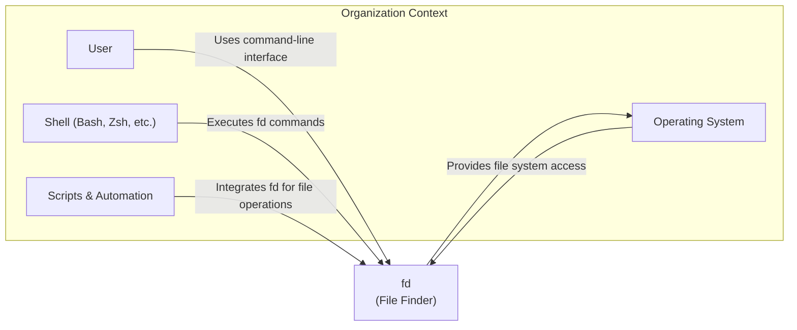
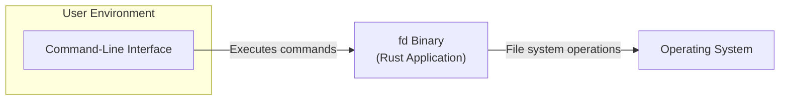
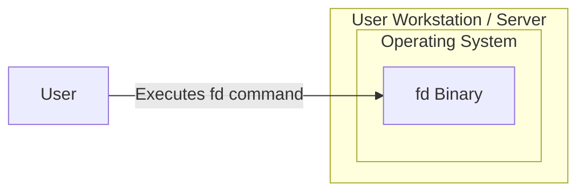
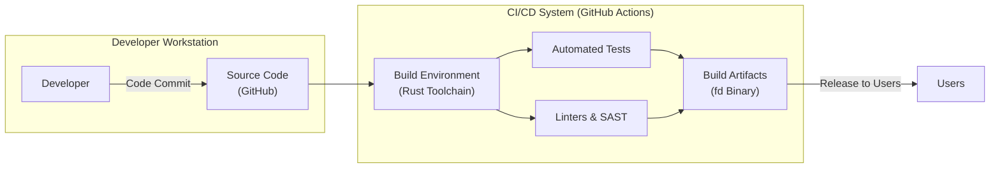

# BUSINESS POSTURE

The `fd` project is a command-line tool designed as a user-friendly and faster alternative to the traditional `find` utility. Its primary goal is to improve the efficiency and user experience of file searching in command-line environments.

- Business priorities:
  - Enhance command-line user experience by providing a more intuitive and faster file searching tool.
  - Increase developer productivity by reducing the time spent on file system navigation and search.
  - Offer a cross-platform solution that works consistently across different operating systems.

- Business risks:
  - Potential for misuse if used in scripts without proper input validation, although the risk is low for a file-finding utility.
  - Dependency risk if critical scripts or processes rely heavily on `fd` and it encounters issues or becomes unavailable.
  - Limited business impact in case of security vulnerabilities due to the nature of the tool (primarily file system navigation).

# SECURITY POSTURE

- Security controls:
  - security control: Open source project with public code repository on GitHub. This allows for community review and scrutiny of the codebase. (Implemented: GitHub Repository)
  - security control: Written in Rust, a memory-safe language, which reduces the risk of certain types of vulnerabilities like buffer overflows. (Implemented: Project Technology Stack)
  - security control: Regular updates and maintenance by the maintainers and community. (Implemented: GitHub Repository - commit history, releases)

- Accepted risks:
  - accepted risk: Reliance on external dependencies (Rust libraries) which could introduce vulnerabilities.
  - accepted risk: Potential for undiscovered vulnerabilities in the codebase, as with any software project.
  - accepted risk: Users might run `fd` with elevated privileges, although it's generally not required for its core functionality.

- Recommended security controls:
  - security control: Implement automated security scanning as part of the CI/CD pipeline to detect potential vulnerabilities in dependencies and the codebase (e.g., using `cargo audit`, `cargo deny`, or similar tools).
  - security control: Follow secure coding practices and guidelines during development and maintenance.
  - security control: Provide clear documentation and examples on secure usage, especially regarding input handling in scripts that use `fd`.

- Security requirements:
  - Authentication: Not applicable as `fd` is a command-line utility and does not handle user authentication.
  - Authorization: `fd` operates within the user's permissions on the file system. It should respect file system permissions and not bypass them.
  - Input validation: `fd` should properly validate user inputs (command-line arguments, patterns) to prevent unexpected behavior or potential vulnerabilities.
  - Cryptography: Not applicable as `fd` does not handle sensitive data or require cryptographic operations for its core functionality. However, if extended with features that involve network communication or data storage, cryptography requirements should be considered.

# DESIGN

## C4 CONTEXT

- C4 Context Elements:
  - - Name: User
    - Type: Person
    - Description: A user who interacts with the command-line interface to search for files and directories.
    - Responsibilities: Provide search queries and interpret the results from `fd`.
    - Security controls: User authentication and authorization are handled by the Operating System and Shell. Users are expected to use `fd` within their authorized file system access.
  - - Name: Operating System
    - Type: Software System
    - Description: The underlying operating system (Linux, macOS, Windows) that provides file system access and manages user permissions.
    - Responsibilities: Manage file system, user permissions, and execute system calls initiated by `fd`.
    - Security controls: Operating system level security controls, including user authentication, authorization, file system permissions, and security updates.
  - - Name: Shell (Bash, Zsh, etc.)
    - Type: Software System
    - Description: The command-line interpreter that executes user commands, including `fd`.
    - Responsibilities: Parse user commands, execute programs like `fd`, and manage input/output.
    - Security controls: Shell history management, command-line input sanitization (to a limited extent), and integration with operating system security features.
  - - Name: Scripts & Automation
    - Type: Software System
    - Description: Various scripts (shell scripts, Python scripts, etc.) and automation tools that might use `fd` for file system operations.
    - Responsibilities: Automate file searching and processing tasks using `fd`.
    - Security controls: Security of scripts depends on the scripting language and the context in which they are executed. Input validation and secure coding practices within scripts are important.

## C4 CONTAINER

- C4 Container Elements:
  - - Name: fd Binary
    - Type: Application
    - Description: The compiled executable of the `fd` file finder, written in Rust. It's a standalone command-line application.
    - Responsibilities: Parse command-line arguments, interact with the operating system to search the file system, and output results to the command-line interface.
    - Security controls:
      - security control: Input validation of command-line arguments. (Implemented: Within `fd` application logic)
      - security control: Memory safety provided by Rust language. (Implemented: Language choice)
      - security control: Adherence to file system permissions enforced by the operating system. (Implemented: Operating System interaction)
  - - Name: Command-Line Interface
    - Type: Interface
    - Description: The interface through which users interact with the `fd` binary, providing commands and receiving output.
    - Responsibilities: Provide a way for users to input commands and display the output from `fd`.
    - Security controls: Command history and basic input handling provided by the shell.

## DEPLOYMENT

- Deployment Diagram Description:
  `fd` is typically deployed directly onto the user's workstation or server operating system. It's a single binary that is placed in a directory accessible in the system's PATH environment variable.

- Deployment Elements:
  - - Name: fd Binary (Deployed)
    - Type: Software Artifact
    - Description: The compiled `fd` executable deployed on the target operating system.
    - Responsibilities: Execute file search operations when invoked by the user or scripts.
    - Security controls:
      - security control: File system permissions on the binary itself to prevent unauthorized modification. (Implemented: Operating System file permissions)
      - security control: Regular updates to the binary to patch any discovered vulnerabilities. (Implemented: Software update process)
  - - Name: Operating System
    - Type: Infrastructure
    - Description: The operating system environment where `fd` is deployed and executed.
    - Responsibilities: Provide the runtime environment for `fd`, manage file system access, and enforce security policies.
    - Security controls: Operating system level security controls, including access control, patching, and security configurations.

## BUILD

- Build Process Description:
  The build process for `fd` starts with developers committing code to the GitHub repository. A CI/CD system, likely GitHub Actions, is triggered upon code changes. The CI/CD pipeline sets up a build environment with the Rust toolchain, compiles the code, runs automated tests, and performs static analysis and linting. If all checks pass, build artifacts (the `fd` binary for different platforms) are produced and released for users to download.

- Build Elements:
  - - Name: Developer
    - Type: Person
    - Description: Software developers who write and maintain the `fd` codebase.
    - Responsibilities: Write secure and functional code, commit code changes to the repository.
    - Security controls: Developer workstations security, secure coding practices, code review process.
  - - Name: Source Code (GitHub)
    - Type: Code Repository
    - Description: The GitHub repository hosting the source code of `fd`.
    - Responsibilities: Version control, code storage, collaboration platform.
    - Security controls: Access control to the repository, branch protection, commit signing.
  - - Name: CI/CD System (GitHub Actions)
    - Type: Automation System
    - Description: GitHub Actions workflows that automate the build, test, and release process.
    - Responsibilities: Automate build process, run tests, perform security checks, and create release artifacts.
    - Security controls: Secure configuration of CI/CD pipelines, access control to CI/CD configurations, secrets management for any credentials used in the build process.
  - - Name: Build Environment (Rust Toolchain)
    - Type: Software Environment
    - Description: The environment with the Rust compiler and necessary build tools used to compile `fd`.
    - Responsibilities: Compile the source code into executable binaries.
    - Security controls: Secure and up-to-date build tools, dependency management, isolation of build environment.
  - - Name: Automated Tests
    - Type: Software Tests
    - Description: Unit tests and integration tests to verify the functionality of `fd`.
    - Responsibilities: Ensure code quality and detect functional regressions.
    - Security controls: Tests should cover security-relevant aspects, such as input validation and error handling.
  - - Name: Linters & SAST
    - Type: Security Tools
    - Description: Static analysis tools and linters used to automatically check the code for potential security vulnerabilities and code quality issues.
    - Responsibilities: Identify potential security flaws and coding style violations.
    - Security controls: Regularly updated linters and SAST tools, configured to detect relevant security issues.
  - - Name: Build Artifacts (fd Binary)
    - Type: Software Artifact
    - Description: The compiled `fd` binaries for different operating systems, ready for distribution.
    - Responsibilities: Distributable binaries of `fd`.
    - Security controls: Signing of binaries to ensure integrity and authenticity, secure storage and distribution of artifacts.
  - - Name: Users
    - Type: Person
    - Description: End-users who download and use the `fd` binary.
    - Responsibilities: Download and use `fd` binary.
    - Security controls: Users are responsible for downloading binaries from trusted sources and verifying their integrity (e.g., using checksums or signatures if provided).

# RISK ASSESSMENT

- Critical business processes:
  - For most users, `fd` enhances productivity in command-line workflows. Critical business processes might include automated scripts or developer workflows that rely on efficient file searching. If `fd` malfunctions or is unavailable, these processes might be slowed down or disrupted. However, the impact is generally low as `find` or other alternatives can be used.

- Data we are trying to protect and their sensitivity:
  - `fd` primarily interacts with file system metadata (file names, paths, timestamps, permissions). It does not directly handle sensitive data in the context of its core functionality. However, if users use `fd` in scripts that process sensitive files, the file paths themselves might be considered sensitive in certain contexts. The sensitivity of the data depends heavily on the user's specific use case and the context in which `fd` is used. In general, the sensitivity is low to medium, primarily concerning the confidentiality and integrity of file system information within the user's environment.

# QUESTIONS & ASSUMPTIONS

- BUSINESS POSTURE:
  - Assumption: `fd` is primarily used by individual users and developers to improve their command-line workflow efficiency.
  - Question: Are there any enterprise or organizational deployments of `fd` where it's used in critical infrastructure or automated systems with higher security requirements?

- SECURITY POSTURE:
  - Assumption: Current security posture relies mainly on open-source principles, Rust's memory safety, and community review.
  - Question: Are there any specific security compliance requirements or industry standards that `fd` should adhere to?
  - Question: Is there a formal security vulnerability reporting and response process in place for `fd`?

- DESIGN:
  - Assumption: `fd` is designed as a standalone, stateless command-line utility.
  - Question: Are there any plans to extend `fd` with features that might introduce new security considerations, such as network communication, data storage, or user management?
  - Question: Is there any consideration for sandboxing or privilege separation for `fd` to further limit its potential impact in case of vulnerabilities?