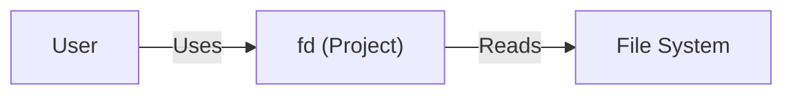
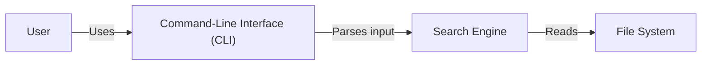
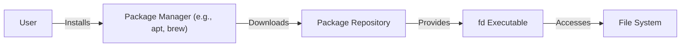
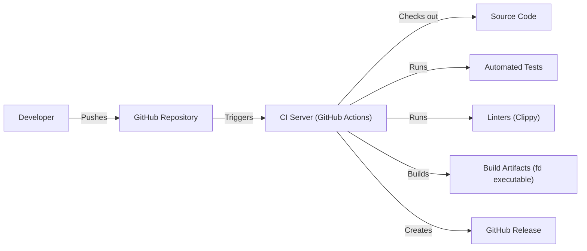

# BUSINESS POSTURE

Business Priorities and Goals:

*   Provide a simple, fast, and user-friendly alternative to the traditional `find` command.
*   Improve developer and system administrator productivity by making file searching more efficient.
*   Offer sensible default settings that cater to common use cases, reducing the need for complex configurations.
*   Maintain cross-platform compatibility, ensuring the tool works consistently across different operating systems.
*   Provide a well-documented and easy-to-install tool.

Business Risks:

*   Usability issues: If the tool is not sufficiently user-friendly or intuitive, it may not be adopted, failing to achieve its goal of improving productivity.
*   Performance bottlenecks: If the tool is not as fast or efficient as claimed, it may be abandoned in favor of existing solutions.
*   Compatibility problems: If the tool does not function correctly on all supported platforms, it may limit its user base and usefulness.
*   Security vulnerabilities: While `fd` itself is not a security-critical application, vulnerabilities in its dependencies or implementation could potentially be exploited, especially if used in automated scripts or system administration tasks.
*   Maintenance overhead: If the project is not actively maintained, it may become outdated, incompatible with newer systems, or vulnerable to unpatched issues.

# SECURITY POSTURE

Existing Security Controls:

*   security control: Code Reviews: The project is open-source and hosted on GitHub, allowing for community code reviews and contributions.
*   security control: Static Analysis: The project uses Rust, a memory-safe language, which inherently prevents many common security vulnerabilities like buffer overflows.
*   security control: Issue Tracking: The GitHub repository provides an issue tracker for reporting and managing bugs and security vulnerabilities.
*   security control: Automated testing: Project have automated tests.

Accepted Risks:

*   accepted risk: Limited input sanitization: As a command-line tool primarily focused on file system traversal, `fd` may not have extensive input sanitization beyond what's provided by the Rust standard library and clap crate for argument parsing. This is acceptable as the primary input is file paths and search patterns, which are inherently limited in their potential for injection attacks.
*   accepted risk: Denial of Service (DoS): A user could potentially craft a search query that consumes excessive resources, leading to a denial of service on the local machine. This is considered an acceptable risk as it requires local access and is inherent to any file searching utility.
*   accepted risk: No built-in sandboxing: `fd` operates with the privileges of the user executing it. It doesn't implement any specific sandboxing or privilege separation. This is acceptable as it's a command-line tool intended to be run with user privileges.

Recommended Security Controls:

*   security control: Regular Dependency Updates: Implement a process for regularly updating dependencies to address known vulnerabilities. Tools like Dependabot (for GitHub) can automate this.
*   security control: Fuzzing: Integrate fuzzing into the testing process to identify potential edge cases and vulnerabilities that might not be caught by traditional testing.
*   security control: Consider using Clippy: Clippy is a linting tool for Rust that can identify potential code quality and security issues.

Security Requirements:

*   Authentication: Not applicable, as `fd` is a local command-line tool and does not involve authentication.
*   Authorization: `fd` operates with the permissions of the user executing it. No additional authorization mechanisms are required within the tool itself. The operating system's file system permissions provide the necessary authorization controls.
*   Input Validation:
    *   Validate command-line arguments using the `clap` crate to ensure they conform to expected types and formats.
    *   Sanitize file paths and search patterns to prevent unexpected behavior or potential vulnerabilities, although the risk is low in this context.
*   Cryptography: Not directly applicable, as `fd` does not handle sensitive data requiring encryption. However, if `fd` were to be extended to support searching within encrypted archives, proper cryptographic practices would need to be followed.

# DESIGN

## C4 CONTEXT

Element Descriptions:

*   Element:
    *   Name: User
    *   Type: Person
    *   Description: A person who interacts with `fd` to search for files.
    *   Responsibilities: Provides search queries, interprets results.
    *   Security controls: None (external to the system).

*   Element:
    *   Name: fd (Project)
    *   Type: Software System
    *   Description: The `fd` command-line tool.
    *   Responsibilities: Parses user input, traverses the file system, matches files against search patterns, displays results.
    *   Security controls: Input validation via `clap`, memory safety via Rust.

*   Element:
    *   Name: File System
    *   Type: External System
    *   Description: The operating system's file system.
    *   Responsibilities: Stores files and directories, provides access to file metadata.
    *   Security controls: Operating system file permissions.

## C4 CONTAINER

Element Descriptions:

*   Element:
    *   Name: User
    *   Type: Person
    *   Description: A person who interacts with `fd` to search for files.
    *   Responsibilities: Provides search queries, interprets results.
    *   Security controls: None (external to the system).

*   Element:
    *   Name: Command-Line Interface (CLI)
    *   Type: Container
    *   Description: The entry point for user interaction.
    *   Responsibilities: Parses command-line arguments, handles user input, displays output.
    *   Security controls: Input validation via `clap`.

*   Element:
    *   Name: Search Engine
    *   Type: Container
    *   Description: The core logic of `fd`.
    *   Responsibilities: Traverses the file system, matches files against search patterns, filters results.
    *   Security controls: Memory safety via Rust.

*   Element:
    *   Name: File System
    *   Type: External System
    *   Description: The operating system's file system.
    *   Responsibilities: Stores files and directories, provides access to file metadata.
    *   Security controls: Operating system file permissions.

## DEPLOYMENT

Possible Deployment Solutions:

1.  Manual Installation: Users download pre-built binaries or compile from source and place the executable in their system's PATH.
2.  Package Managers: `fd` is available through various package managers like `apt`, `brew`, `choco`, etc.
3.  Containerization: `fd` could be packaged within a Docker container, although this is less common for command-line tools intended for direct interaction with the host file system.

Chosen Solution (Package Managers):

Element Descriptions:

*   Element:
    *   Name: User
    *   Type: Person
    *   Description: A person who installs and uses `fd`.
    *   Responsibilities: Initiates the installation process.
    *   Security controls: None (external to the system).

*   Element:
    *   Name: Package Manager
    *   Type: Software System
    *   Description: A system-specific tool for managing software installations (e.g., `apt`, `brew`, `choco`).
    *   Responsibilities: Downloads, installs, and manages `fd` and its dependencies.
    *   Security controls: Package signature verification, dependency integrity checks (specific controls vary by package manager).

*   Element:
    *   Name: Package Repository
    *   Type: External System
    *   Description: A repository hosting `fd` packages.
    *   Responsibilities: Stores and serves `fd` packages.
    *   Security controls: Access controls, integrity checks, HTTPS.

*   Element:
    *   Name: fd Executable
    *   Type: Software Component
    *   Description: The compiled `fd` binary.
    *   Responsibilities: Executes the file searching logic.
    *   Security controls: Memory safety via Rust.

*   Element:
    *   Name: File System
    *   Type: External System
    *   Description: The operating system's file system.
    *   Responsibilities: Stores files and directories.
    *   Security controls: Operating system file permissions.

## BUILD

Build Process Description:

1.  Developer pushes code changes to the GitHub repository.
2.  GitHub Actions (CI Server) is triggered by the push event.
3.  The CI server checks out the source code.
4.  Automated tests are executed.
5.  Linters (Clippy) are run to check for code quality and potential issues.
6.  If tests and linters pass, the code is compiled into build artifacts (the `fd` executable).
7.  A GitHub Release is created, including the build artifacts.

Security Controls:

*   security control: Version Control (Git): All code changes are tracked in the Git repository, providing an audit trail.
*   security control: CI/CD (GitHub Actions): Automates the build, test, and release process, ensuring consistency and reducing manual errors.
*   security control: Automated Testing: Unit tests and integration tests are run automatically on every code change.
*   security control: Static Analysis (Clippy): Linting tools identify potential code quality and security issues.
*   security control: Dependency Management (Cargo): Rust's package manager, Cargo, manages dependencies and helps ensure their integrity.

# RISK ASSESSMENT

Critical Business Processes:

*   Efficient file searching for developers and system administrators.

Data Protection:

*   `fd` itself does not handle sensitive data directly. It interacts with the file system, and the sensitivity of the data accessed depends on the files present on the user's system.
*   Data Sensitivity: The data sensitivity is determined by the user's files, not by `fd` itself. `fd` does not collect, transmit, or store user data.

# QUESTIONS & ASSUMPTIONS

Questions:

*   Are there any specific regulatory compliance requirements (e.g., GDPR, HIPAA) that might indirectly apply to the use of `fd` in certain environments? (Assumption: No, as `fd` doesn't handle personal data directly.)
*   Are there any specific performance benchmarks or targets that `fd` should meet? (Assumption: Performance should be significantly better than the standard `find` command.)
*   Are there plans to extend `fd`'s functionality in ways that might introduce new security considerations (e.g., network access, remote file systems)? (Assumption: No, the focus is on local file system searching.)

Assumptions:

*   BUSINESS POSTURE: The primary goal is to provide a fast and user-friendly alternative to `find`.
*   SECURITY POSTURE: The main security concern is to avoid introducing vulnerabilities that could be exploited through malicious input or crafted file systems.
*   DESIGN: The tool will remain a command-line utility focused on local file system searching.